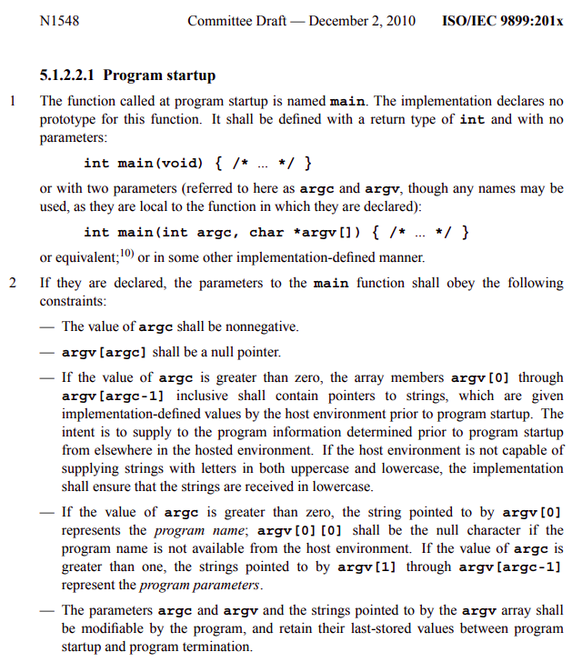

# 第1章-代码规范-华山剑法

代码规范也叫代码范式(套路). 开发界流传至今范式很多, 其中以 Window 操作系统风格'武当'流派, GNU Linux 极客风格昆仑流派代表性最强. 无论那种流派范式, 核心都在于有章可循自成方圆, 协助和提效工程开发. 本书是在昆仑流派基础上衍生, 并会逐一分析其中范式所以然.

在如今这个年代(2012年后), 一招鲜吃遍天, 充满荆棘和挑战也缺乏趣味. 而我们在成长中也会时常遇到不熟悉领域, 一种有意思方式是, 忘记以前了解的, 立即训练需要现在知道的. 先进去学后思考. 如果你正好 C 第一本书刚学完, 这里将会是很好拔高素材. 本章会围绕 针对 C 领域的范式, 带大家学习和训练 C 的起手套路. 不管怎么聊, 全文宗旨会一直延续, 写好代码首要条件是**写代码**! 然后从躬行思索**求简求美** ~  

希望这本小册子带大家进入代码**写手**的世界. 尝试在自己动手中感受其中思路和设计! 

## 1.1 缘起 main

很久很久以前进入一个被无数前辈巨擘称之为 main 函数. 回想其中经历的故事非常有趣. 这里只简单引述 C11 标准中规定的两种标准写法.



main 是起点, 也是一切美好或梦魇的诞生点. C 学习历程可以从 Brian W. Kernighan / Dennis M. Ritchie 的 The C Programming Language 起步, 再到 C 标准文献, 随后熟悉操作系统. 此后遇到疑惑问题翻阅资料查看标准手册, 攀登在起源山峰上, 大多数问题都会迎刃有解. 

> 不知道这会有没有人想起 void main() {} or main() {} 写法呢?
> 对于 void main() {} 引述 C++ 之父 Bjarne Stroustrup 在其 FAQ 中说的 

> The definition void main() { /* ... * / } is not and never has been C++,
> nor has it even been C.

> 编译器'老母亲'纵容了我们的"错误".
> 而 main() {} 最初出现在 K&R C 年代中, 那时候函数缺省定义(默认返回 int)不报警告. 
> 当前 warning 甩过来的时候, 老母亲的提醒应该重视和立即纠错. 

**希望下面代码会是个好的开头 -_- Good luckly**

```C
#include <stdio.h>

int main(int argc, char * argv[]) {
    fprintf(stderr, "嗨! I'm here.\n");
    return 0;
}
```

## 1.2 括号布局

C 是极其强调细节的语言. 多数写手在用 C 开发的时候都会有点神经质. 难以接收铺张浪费. 恶心的是, 细节之处往往充满了妖魔神鬼, 让人'发狂'! 陆小凤通过一片落叶根蒂, 判断出自己绝不是西门吹雪对手. 同样一个 { } 布局就能见证你的起手式. 本门华山剑法 { } 遵循的如下规则和演示.

    1' 左 { 右对齐
    2' 右 } 上对齐
    3' 右 } 是完整的一段代码才另起一行

```C
#include <stdbool.h>

// 1. for or while
for (;;) {     while (true) {
    ...
}              }

// 2. if ... else
if (true) {
    ...
} else {
    ...
}
```

对于 for ( ; ; ) 和 while (true) 二者最终生成的汇编代码是一样的, 但是推荐前者. 因为它更加简单优美. 

对于 if else 为什么这么写, 先看下面对比.

```C
if (true)          if (true) {          if (true) {
{                      ...                  ...
    ...            }                    } else if (false) {
}                  else if (false) {        ...
else if (false)        ...              } else {
{                  }                        ...
    ...            else {               }
}                      ...
else               }
{
    ...
}
```

第一种写法是 Window 推崇的标准. 第三种是 Linux 上面常见写法. 第二种是两者的一种过渡. 对于上面三种范式, 都写过好久. 思索基于 C 精简特性, 这里推荐第三种. 更加紧凑飘逸! C 本身就是个精简的语言, 强调最小意外原则. 第一种直接 pass, 啰嗦的闸门一旦打开, 就难关上了. 第二种还是有点不极致. 同样对于 switch 语法推荐下面写法

```C
switch (type) {
case SBase:
    ...
break;
...
default:
    ...
}
```

    C 中的标签都放在作用域最左边. switch brack 垂直 case 方向形成闭区间.

## 1.3 C 中三大战神 - 函数 § 帝释天

面向过程编程两个主旋律是内存结构和函数封装. C 函数开头一个 extern 关键词也能搞晕不少同学. C 函数分为声明和定义两部分. 华山剑法将其细化为 3 部分. 函数声明: 确定函数地址; 函数定义: 确定函数地址和实现; 函数声明加定义: 确定函数地址和实现, 尝试限制作用域.

```C
/ 1' 函数声明
extern void hoge(void);

// 2' 函数定义 (返回值单独占一行, 用于强调, 标准套路)
void
hoge(void) {
    ...
}

// 3' 函数声明加定义 (extern 默认缺省定义)
[extern] void hoge(void) {
    ...
}

```

2' 中函数返回值另起一行为了突出函数(返回值)定义. 在同一行表示声明加定义. 隐含的一个细节是hoge(void), 因为在 C 中函数声明 void hoge(); 表示的意思是函数 hoge 参数不确定(由 __cdecl 从右向左入栈方式决定). 加上 void 会在语法层面约束函数参数为空! 当我们写库头文件的时候, 下面两个函数声明, 表达出的意思就不一样. 华山剑法为其添加的一种新语义.

```C
// 函数声明 显示声明加上 extern
extern void hoge(void);

// 函数声明 缺省 extern 意图告知别人, 这是个 low level api 用的话要理解源码
void hoge(void);
```

编译层面二者没啥区别, 阅读层面传达的意图不一样, 前者是外部可以调用. 后者是外部不推荐调用, 调用的时候需要小心, 推荐了解源码细节. 当然了如果函数定义存在 inline 行为, 由于不同编译器对 inline 实现的差异, 为了照顾编译器差异, 声明时候可能必须要加上 extern, 用于确定函数定义地址. inline 和 register 很相似, 是书写者意愿表达, 具体看编译器大佬'心情'了! 请同学们多实战演练. 函数套路至关重要, 会陪伴咱们度过整个修真岁月.

同 extern 还有个关键字 static 特别神奇. 它描述变量和函数时, 表示在文件或函数内私有(静态)的. 请看下面演示代码 ->

```C
static void heoo(int arr[static 64]) {
    static int cnt;
    ...
}
```

局部代码中包含的 static 套路和潜规则剖析如下:

a) 第1个 static 表示当前函数是私有的, 被包含的文件所有, 作用域是具体文件中这个函数定义行以下范围.

b) 第2个 static 是 C99 出现的语法, 告诉编译器这个"数组"至少有 64 个数据单元, 您可以放心优化.

c) 第3个 static 表示声明一个私有静态变量 cnt, 作用域属于 heoo 函数域. 

d) 另一个细节是 cnt 生命周期同未初始化全局的变量. 默认内存都是以 0 填充的. 即这
   里 cnt = 0 是缺省的.

***

> 科普 C 中 
> **0, 00, 0x0, .0, '\0', '0', "0", NULL, false, EXIT_SUCCESS** 
> 是什么鬼!  

> 我们首先看源码中能找见的部分

```C
#ifndef NULL
    #ifdef __cplusplus
        #define NULL 0
    #else
        #define NULL ((void *)0)
    #endif
#endif

#ifndef __cplusplus

#define bool    _Bool
#define false    0
#define true    1

#endif /* __cplusplus */

#define EXIT_SUCCESS 0
```

> 可以看出围绕 C 生态部分 NULL, false, EXIT_SUCCESS 都是宏. NULL 是个特殊的空指针 (void *)0, 后两个 false, EXIT_SUCCESS 具体定义是一样的数值零. 有时函数退出使用 exit(EXIT_SUCCESS); 或者 return EXIT_SUCCESS; 本书推荐采用前者 exit 写法(虽年少但沉稳老练).  开始的 0, 00, 0x0, .0, '\0' 这几种都为零, 区别在于 00 是八进制, 0x 是十六进制, '\0' 是字符常量. 零值都是一样的, 写者想表达出来的语义不同. .0 是 double 双精度的零, 对于 "0" 是个字符串常量, 等同于 char [2] { '0', '\0' } 这里也可以看出来 '0' 和 '\0' 不同字符常量 '0' == (int)48; 同样需要让人意外的是 C (sizeof '0' == 4)! 希望大家以后在 C 中看到这些数字, 能了然于胸, 乘云破雾.

***

> 顺带说说 **exit(EXIT_SUCCESS);** 写法居然木有警告?

```C
#include <stdlib.h>

// man 手册推崇套路范式
int main(void) {
    ...
    exit(EXIT_SUCCESS);
}
```

> 你是否好奇[**1' 为啥不 return EXIT_SUCCESS;**] 和 [**2' 而且编译器没有警告**]

> **1' 这要从小伙伴可能踩过坑说起.**
> 
> 在 main 函数中 exit(EXIT_SUCCESS); 和 return EXIT_SUCCESS; 操作系统多数情况是相同的. 在 main 函数 return 会返回到系统的启动函数中, 会再次执行 exit 相关逻辑. 这就存在一个执行顺序依赖的问题了. 如果我们的主函数 return 了没有触发 exit, 那么二者就不一样. 看下面例子

```C
#include <stdio.h>
#include <stdlib.h>

int test(void) {
    puts("main not here");
    return EXIT_SUCCESS;
}

// $ gcc -g -Wall -O2 -nostartfiles --entry=test -o test.exe test.c
// $ ./test.exe
```

> 程序启动后, 退出时多数会崩溃. 因为基础库准备的善后操作执行异常. 这时将 return 替换为 exit 就可以解决! 因为直接退出会走编译器为 exit 开通的善后流程. 为了安全起见有时候直接 exit 粗暴高效.

> **2' 编译器没有警告原因, 先看截取部分源码**

```C
#if defined(__GNUC__) || defined(__clang__)
    #define NORETURN(func) func __attribute__((noreturn))
#elif defined(_MSC_VER)
    #define NORETURN(func) __declspec(noreturn) func
#endif

// C11 中为其构造了新的关键字 _Noreturn
_Noreturn void suicide(void) {
    abort(); // Actually, abort is _Noreturn as well
}
```

> 脉络比较清晰了, 因为 exit 经过 '_Noreturn' 类似声明(标识), 永不返回, 因此编译器编译时就不再抛出无返回值警告. 分享 Over 哈哈哈. **赠送个打桩小技巧. 在协同开发时, 先快速设计好接口给对接方. 随后来个空实现!**

***

此刻再次为函数声明定个弱基调 :)

a) 给其他模块用的函数, 推荐 extern 声明, 然后定义其实体

b) 给自己模块用的函数, 推荐 static 静态(私有) 声明加定义

c) inline 和各种缺省函数声明和定义, 理性使用

## 1.4 C 中三大战神 - 指针 - 达姿·奥利哈刚

C 中一个有争议的命题是一切皆内存. 而指针就是指向内存的魔法杖. C is free and unsafe. 至高奥义就是

**程序员是万能的**

隐含的一层意思是你的程序你负责. 这其中最最强大功能就是指针, 它无所不能在当前的系统世界里. 本小节我们只演练华山剑法中 C 指针的写法范式. 首先看下面小段演示 Demo.

```C
// 第1种: 传统写法, * 靠右
void *piyo, *hoge;

// 函数定义
void *
free(void *block) {
    ...
}

// 第2种: * 靠左, 模仿上层语言的类型
void* piyo, *hoge;

void*
free(void* block) {
    ...
}
```

微发现上面两种写法不太自然和统一. 由于 C 本身存在缺陷, 上面两种写法都不完美. 第1种, 函数定义的时候 * 号就不知道该放在那里了. 这种用法比较广, 但也不是最好的选择. 第2种写法, 多数是有过面向对象的编程经验, 想重温写哈 C. 这种写法在定义多个变量指针的时候基本就废了. 而且本身是变量指针声明, 却被"幻想"成指针类型. 第2种写法强烈不推荐. 这里采用下面写法, 在追求自然和美过程中, 脚步不要停歇!

```C
// 第3种: 变量声明, * 全部放中间
void * piyo, * hoge;

void *
free(void * block) {
    ...
}

// 补充说明, 多维指针, 函数指针声明
int ** arrs = NULL;
typedef void (* signal_f)(int sig);
```

关于指针范式基调主要如上. 简单扯一点关于 C 变量声明. C 目前共有44个关键字, 推荐命名要短小精悍. 强烈不推荐驼峰规则, 因为在远古时期 C 是不区分大小写. 而且 C 代码本身不容易读懂, 要懂的人会懂. 推荐遵从内核源码古法. 命名语义区分用 _ 分隔. C 也许不能让工资飞高, 但是可以让你在面对大佬的时候看见希望 ~

小节最后不妨借花献佛. 引述<<C 语言问题>>书中让人豁然开朗, 关于 C 命名经典问题.

```C
问: 如何判断哪些标识符可以使用, 那些被保留了?
答:
1' 标识符的3个属性: 作用域, 命名空间和链接类型.
[*] C 语言有4种作用域(标识符声明的有效区域): 函数, 文件, 块和原型. (第4种类型
    仅仅存在于函数原型声明的参数列表中)
[*] C 语言有4种命名空间: 行标(label, 即 goto 的目的地), 标签(tag, 结构, 联
    合和枚举名称), 结构联合成员, 以及标准所谓的其它"普通标识符"(函数, 变量, 类
    型定义名称和枚举常量). 另一个名称集(虽然标准并没有称其为"命名空间")包括了预
    处理宏. 这些宏在编译器开始考虑上述4种命名空间之前就会被扩展.
[*] 标准定义了3中"链接类型": 外部链接, 内部链接, 无链接. 对我们来说, 外部链接
    就是指全部变量, 非静态变量和函数(在所有的源文件中有效); 内部链接就是指限于
    文件作用域内的静态函数和变量; 而"无链接"则是指局部变量及类型定义(typedef)
    名称和枚举常量.

2' ANSI/ISO C 标准标识符标准建议规则:
规则1: 所有下划线大头, 后跟一个大写字母或另一个下划线的标识符永远保留(所有的作
       用域, 所有的命名空间).
规则2: 所有以下划线打头的标识符作为文件作用域的普通标识符(函数, 变量, 类型定义
       和枚举常量)保留(为编译器后续实现保留).
规则3: 被包含的标准头文件中的宏名称的所有用法保留.
规则4: 标准中所有具有外部链接属性的标识符(即函数名)永远保留用作外部链接标识符.
规则5: 在标准头文件中定义的类型定义和标签名称, 如果对应的头文件被包含, 则在(同
       一个命名空间中的)文件作用域内保留.(事实上, 标准声称"所有作用于文件作用
       域的标识符", 但规则4没有包含标识符只剩下类型定义和标签名称了.)
```

以上关于标识符问答推荐 write and read 一遍 :)

## 1.5 C 中三大战神 - 宏 - 封神记·天

宏有点爽也有些疯狂. 需切记教条[能用 inline 内联, 就不要用宏!] 如果说指针是自由, 那宏就是噩梦. 我们从 **struct.h** 来认识这个偏执狂 ->

```C
#pragma once

#include <math.h>
#include <ctype.h>
#include <errno.h>
#include <float.h>
#include <stdio.h>
#include <assert.h>
#include <string.h>
#include <stddef.h>
#include <stdlib.h>
#include <stdarg.h>
#include <stdint.h>
#include <limits.h>
#include <stdbool.h>
#include <inttypes.h>

#include "alloc.h"

#ifndef CMP_F
#define CMP_F

//
// cmp_f - 比较行为 > 0 or = 0  or < 0
// : int add_cmp(const void * now, const void * node)
//
typedef int (* cmp_f)();

#endif//CMP_F

#ifndef NEW_F
#define NEW_F

//
// new_f - 构建行为
// : void * rtree_new(void * node)
//
typedef void * (* new_f)();

#endif//NEW_F

#ifndef NODE_F
#define NODE_F

//
// node_f - 销毁行为
// : void list_die(void * node)
//
typedef void (* node_f)();

#endif//NODE_F

#ifndef EACH_F
#define EACH_F

//
// each_f - 遍历行为, node 是内部结点, arg 是外部参数
// : int echo(void * node, void * arg) { return 0; }
//
typedef int (* each_f)(void * node, void * arg);

#endif//EACH_F

//
// DCODE - DEBUG 模式下的测试宏
// DCODE({
//     puts("debug test start ...");
// });
//
#ifndef DCODE
#  ifndef NDEBUG
#    define DCODE(code)  do code while(0)
#  else
#    define DCODE(code)  
#  endif//NDEBUG
#endif//DCODE

#define POUT(fmt, ...)                                                  \
fprintf(stdout, "[%s:%s:%d][%d:%s][stdout]"fmt"\n",                     \
    __FILE__, __func__, __LINE__, errno, strerror(errno), ##__VA_ARGS__)

//
// PERR - 打印错误信息
// EXIT - 打印错误信息, 并 exit
// IF   - 条件判断异常退出的辅助宏
//
#define PERR(fmt, ...)                                                  \
fprintf(stderr, "[%s:%s:%d][%d:%s][stderr]"fmt"\n",                     \
    __FILE__, __func__, __LINE__, errno, strerror(errno), ##__VA_ARGS__)

#define EXIT(fmt, ...)                                                  \
do {                                                                    \
    PERR(fmt, ##__VA_ARGS__);                                           \
    exit(EXIT_FAILURE);                                                 \
} while(0)

#define IF(cond)                                                        \
if ((cond)) EXIT(#cond)

//
// RETURN - 打印错误信息, 并 return 返回指定结果
// val      : return 的东西. 填 NIL 标识 return void;
// fmt      : 双引号包裹的格式化字符串
// ...      : fmt 中对应的参数
// return   : val
// 
#define RETURN(val, fmt, ...)                                           \
do {                                                                    \
    PERR(fmt, ##__VA_ARGS__);                                           \
    return val;                                                         \
} while(0)

#define NIL
#define RETNIL(fmt, ...)                                                \
RETURN(NIL , fmt, ##__VA_ARGS__)

#define RETNUL(fmt, ...)                                                \
RETURN(NULL, fmt, ##__VA_ARGS__)

#define RETERR(fmt, ...)                                                \
RETURN(-1  , fmt, ##__VA_ARGS__)

```

这里主要讲解华山剑法中宏的命名基本准则. 以下关于宏态度和演示, 多感受其中范式! 单纯是推荐不强求, 求美求简 ❤ 就好.

**克制使用, 推荐用最清晰版本**

```C
#define STRUCT_H
#define RMRF_STR        "rm -rf '%s'"
#define LOG_UINT        (2048u)
#define Q_INT           (1<<6)
#define ZERO_FLOAT      (0.000001f)

// 也可以不过宏名中的信息量没有上面全
#define N               (16)
```

上面是常量的宏命名好的示例, 统一大写. 而后 H, STR, UINT INT, FLOAT ... 让人很清晰知道宏的类型. 展示的第一个是头文件宏. 如果项目比较大可以在左边继续加上项目名称, 工程名称等等, 这就是命名空间由来. 其中字符串常量宏, 为了方便字符串拼接不用加 (). 数值常量宏防止意外拼接加了 (). 宏设计过程中, 当你不清楚会有什么意外会发生, 加括号是最保险的解决方案. 

**函数宏另起一行写, 局部使用宏可以放一行写**

```C
// BZERO - 变量置零操作
#define BZERO(v)            \
memset(&(v), 0, sizeof(v))

//
// STR - 添加双引号的宏 
// v    : 待添加双引号的量
//
#define STR(v) S_R(v)
#define S_R(v) #v
```

例如上面 BZERO(v); 可以独立存在, 加上 \ 另起一行. 对于 STR(v) 可以作为一个子语句, 直接写在一行就很清晰明了.

**有些宏想被认为是函数, 那就小写**

```C
typedef volatile long atom_t;  

#ifdef __GNUC__

#define atom_lock(o)        while(__sync_lock_test_and_set(&(o), 1))

#define atom_unlock(o)      __sync_lock_release(&(o))

#endif
```

写的人意图是希望 atom_lock 和 atom_unlock 被人当'函数'去使用, 使用了小写. 对于内置宏, __GNUC__ 是标识 GCC 编译器, 表示当前用 GCC 编译项目会进入这个分支. 同样 _MSC_VER 是标识 M$ 的 CL 编译器. 简单的 project defined template 可以参照下面的 code. 做为开发人员, 推荐用最新的编译器. 因为保持活力和新鲜感很有趣, 一次新的尝试说不定就是一次机遇(多数就是坑...)

```C
#if defined(__linux__) && defined(__GNUC__)

#elif defined(_WIN32) && defined(_MSC_VER)

#endif
```

> 命名规范简单总结  

> a) 变量命名, 函数命名
-> 推荐全小写, 推荐语义分隔使用 _
-> 特殊是用大写字母缩写, 例如算法代码, 静态变量
-> 宏中局部变量使用 $ 开头, 防止变量污染

```C
static struct files F;

static unsigned SDBMHash(const char * k) {
    register unsigned o,h = 0u;
    while ((o = *k++))
        h = o + h * 65599u;
    return h;
}

//
// EXTERN_TEST  - 单元测试宏, 并打印执行时间
// ftest        : 测试函数
// ...          : 可变参数
//
#define EXTERN_TEST(ftest, ...)                         \
do {                                                    \
    printf("> "STR(ftest)" run start ...\n");           \
    clock_t $s = clock();                               \
    extern void ftest ();                               \
    ftest ( __VA_ARGS__);                               \
    double $e = (double)clock();                        \
    printf("> "STR(ftest)" run end time is %lfms\n",    \
          ($e - $s) / (CLOCKS_PER_SEC / 1000));         \
} while(0)
```

> b) 宏命名
-> 推荐全大写, 语义分隔使用 _
-> 宏常量推荐 [名称]_[类型简写]
-> 希望被当成函数使用的宏, 可以用小写命名
    
> c) 枚举声明, 类型声明
-> C 枚举和 INT 宏常量很同质化, 默认类型 int. 有时候很显得多余, 能不用就不用 **用宏替代枚举**
-> 类型声明 [name]_[类型缩写] 例如 start_f tstr_t 等, 类型区分将变得简单.

```C
#ifndef CSTR_INT

struct cstr {
    char * str;     // 字符串
    size_t cap;     // 容量
    size_t len;     // 长度
};

// CSTR_INT 构建字符串初始化大小
#define CSTR_INT    (1 << 7)

typedef struct cstr * cstr_t;

//
// cstr_declare - 栈上创建 cstr_t 结构
// cstr_free - 释放栈上 cstr_t 结构
// var      : 变量名
//
#define cstr_declare(var)               \
struct cstr var[1] = { {                \
    .str = malloc(CSTR_INT),            \
    .cap = CSTR_INT,                    \
} }

inline void cstr_init(cstr_t cs) {
    cs->len = 0;
    // 构建字符串初始化大小
    cs->cap = CSTR_INT;
    cs->str = malloc(CSTR_INT);
}

inline cstr_t cstr_new() {
    cstr_t cs = malloc(sizeof(struct cstr));
    cstr_init(cs);
    return cs;
}

inline void cstr_free(cstr_t cs) {
    free(cs->str);
}

#endif//CSTR_INT
```
    
到这基本把 C 的华山剑法的总纲讲的有小些了. 按照流派范式去写, 你会有更多的时间去学高深心法, 年岁久了再出来构建你自己的独孤草上飞. 同是不年轻的穷"屌丝", 要学会适应, 不流血那就流水. 都不简单, 也不难 ~

## 1.6 绝世好剑

万般皆自然, 一通都顺, 魔鬼在踏实的大道上ヾ(๑╹◡╹)ﾉ" 需要时间才会出现. 这里的绝世好剑指的是你的编程环境. 硬件方面要是可以的话买最快, 最美, 最便宜的套装. 软件方面, 我们只简单介绍昆仑流派.

**昆仑流派**  
    
a) Install Best New Ubuntu Desktop LTS ISO
b) Install Best New GCC, GDB, VIM
c) Install Best New Visual Studio Code

Linux 是业界标杆, 简单高效优美. vi gcc make 能够搞定一切. 无数的一手资料, 强大的 man 手册. 题外话, 自己用老式 Linux 机器很快, 所以推荐 Linux 平台, 其实什么环境都行(Window 系统技术进阶最曲折缓慢, 推荐要不 Mac 要不 Linux), 怎么舒服怎么来, 但都要醇厚精通 ~ 

**剑指何方**  

个人感悟, 跨平台对于浮游生物而言是在浪费生命, 我们这里简单整理 **system.h** 部分辅助简单跨平台操作. 有些人单纯的用 Linux, 感觉非常, 越纯粹越强. Linux 是个回报率很高的平台. 但自从走上了 C 系语言之路. 真是天高地厚不知路长 ~ 岁月过的非常快 ...

```C
#pragma once

//
// 辽阔的夜, 黝黑而深邃 ~
//
// 跨平台模拟自娱自乐了很久, 可能也有零星的收获, 那就是认怂 ~ 
//
// 
// 苏堤春晓
// 明·杨周
// 
// 柳暗花明春正好，重湖雾散分林鸟。
// 何处黄鹂破暝烟，一声啼过苏堤晓。
//

#include <stdint.h>
#include <stddef.h>

/*
project defined template

#if defined(__linux__) && defined(__GNUC__)

#elif defined(_WIN32) && defined(_MSC_VER)

#endif
*/

//
// 约定: BEST NEW VERSION 操作系统 Linux + 编译工具 GCC
//
#if defined(__linux__) && defined(__GNUC__)

# if defined(__x86_64__)
#  define ISX64
# endif

//
// 大小端检测 : ISBIG defined 表示大端
//
# if defined(__BIG_ENDIAN__) || defined(__BIG_ENDIAN_BITFIELD)
#  define ISBIG
# endif

#define PACKED(declare)             \
declare                             \
__attribute__((__packed__))

# ifndef likely
#   define likely(x)   __builtin_expect(!!(x), 1)
# endif
# ifndef unlikely
#   define unlikely(x) __builtin_expect(!!(x), 0)
# endif

//
// 约定: BEST NEW VERSION 操作系统 window + vs
//
#elif defined(_WIN32) && defined(_MSC_VER)

//
// CPU 检测 x64 or x86
// ISX64 defined 表示 x64 否则 x86
//
# if defined _M_ARM64 || defined_M_X64
#  define ISX64
# endif

//
// _M_PPC 为 PowerPC 平台定义, 现在已不支持
//
# if defined _M_PPC
#  define ISBIG
# endif

#define PACKED(declare)             \
__pragma (pack(push, 1))            \
declare                             \
__pragma (pack(pop))

                                    /* 开眼不知何处, */
                                    /* 但听满耳松风。*/
#define likely(x)    (x)
#define unlikely(x)  (x)

#endif
```

其中 Window 用最新的操作系统 + 最新的 Visual Studio 上面最新的 Clang 编译器. 当然我们本文核心是代码思路和代码训练环境方面最好能多简单就多简单.

## 1.7 夜太黑练剑好时光

聊的有些多, 细节部分需要自己亲身建构. 回想起 2013 年看<<自制编程语言>>那本书, 惊为天人. 感觉作者实力好强. 因为看不明白, 强行撸, 狂看猛打最后懂了点, 收益良多(虽然已经忘记了, 但却是另一番体验). 在编程的世界里, 不需要太多前缀, 只要 wo are 正在用手舞剑! 

如果咱们一样只是为了, 更有意思的生存和活着. 那么学起来就更随意了, 君子当善假于物! 熟悉工具, 帮人实现梦想, 自我积蓄德才 ~ 然后回家开个水果店, 想想也挺好.

如果你没有对象, 那就使劲敲代码

如果你觉得无聊, 那就跑步加看书

如果你有了家庭, 那就反思加打桩

如果你真不甘心, 那就呵呵萌萌哒

书归正转, 前面 **struct.h** 头文件中引入了 **alloc.h** 头文件, 不知道小伙伴是否还记得. 这个 **alloc.h** 是我们对 malloc / free 等内存操作接口包装层. 它基本原理是替换系统申请内存释放内存相关函数. 并且携带了少量平台通用宏. 先看接口设计

```C
#pragma once

//
// 这是个非常简单粗暴内存分配模块. 
// 多数这类模块会和项目业务绑定, 例如添加栈日志打印.
//

#include <stdio.h>
#include <stdlib.h>
#include <string.h>

// check 内存检测并处理
inline void * check(void * ptr, size_t size) {
    if (!ptr) {
        fprintf(stderr, "check memory collapse %zu\n", size);
        fflush (stderr);
        abort();
    }
    return ptr;
}

//
// malloc_  - malloc 包装函数
// size     : 分配的内存字节
// return   : 返回可使用的内存地址
//
inline void * malloc_(size_t size) {
    return check(malloc(size), size);
}

//
// strdup_  - strdup 包装函数
// str      : '\0' 结尾 C 字符串
// return   : 拷贝后新的 C 字符串
//
inline char * strdup_(const char * str) {
    if (str) {
        size_t n = strlen(str)+1;
        return memcpy(malloc_(n), str, n);
    }
    return NULL;
}

//
// calloc_  - calloc 包装函数
// num      : 数量
// size     : 大小
// return   : 返回可用内存地址, 并置 0
//
inline void * calloc_(size_t num, size_t size) {
    return check(calloc(num, size), size);
}

//
// realloc_ - realoc 包装函数
// ptr      : 首地址, NULL 等同于 malloc
// size     : 重新分配的内存大小
// return   : 返回重新分配的新地址
//
inline void * realloc_(void * ptr, size_t size) {
    return check(realloc(ptr, size), size);
}

// :) 包裹内存分配层, 些许感怀 ~ 可以通过 define ALLOC_OFF 关闭
//
#ifndef ALLOC_OFF
#  undef    malloc
#  define   malloc  malloc_
#  undef    strdup
#  define   strdup  strdup_
#  undef    calloc
#  define   calloc  calloc_
#  undef    realloc
#  define   realloc realloc_
#endif

```

通过 ALLOC_OFF 宏配置来替换全局 free / malloc. 使用时候对用户无感知的. 

对于 check 函数思路, 在内存不足时, 直接 abort. 不知道有没有朋友会问为什么不用 exit? 思考的出发点是这样的, 当出现申请内存不足的时候. 笼统的概括有两种场景:

1' 申请大内存, 
2' 申请小内存. 

如果是 1' 申请大内存, exit 退出是可行, 并且还会执行 atexit 相关函数.

但如果是 2' 申请小内存, 小内存都耗尽, 那么后续都将是未定义. 综合 1' 和 2' 加上这是个学习项目最终
使用了 abort. 当内存不足的时候, 直接'休息', 粗暴有效的上车. 

对于上面直接使用操作系统能力, 也可以采用了近代软件编程中免费午餐 jemalloc 来包装我们的 alloc.h 层. jemalloc 科普可以搜查资料, 对于如何编译成静态库并使用, 可在 jemalloc github 主页获取官方方法. 如果其中遇到困难, 可以搜索和翻看作者相关博客. jemalloc alloc.c 实现全在这里, 代码即注释 ~

```C
#define ALLOC_OFF
#include "alloc.h"

#define JEMALLOC_NO_DEMANGLE
#include <jemalloc/jemalloc.h>

// check 内存检测并处理
inline void * check(void * ptr, size_t size) {
    if (NULL == ptr) {
        fprintf(stderr, "check memory collapse %zu\n", size);
        fflush(stderr);
        abort();
    }
    return ptr;
}

//
// realloc_ - realoc 包装函数
// ptr      : 首地址, NULL 等同于 malloc
// size     : 重新分配的内存大小
// return   : 返回重新分配的新地址
//
inline void * realloc_(void * ptr, size_t size) {
    void * ntr = je_realloc(ptr, size);
    return check(ntr, size);
}

//
// calloc_  - calloc 包装函数
// num      : 数量
// size     : 大小
// return   : 返回可用内存地址, 并置 0
//
inline void * calloc_(size_t num, size_t size) {
    void * ptr = je_calloc(num, size);
    return check(ptr, size);
}

//
// malloc_  - malloc 包装函数
// size     : 分配的内存字节
// return   : 返回可使用的内存地址
//
inline void * malloc_(size_t size) {
    void * ptr = je_malloc(size);
    return check(ptr, size);
}

//
// free_    - free 包装函数
// ptr      : 内存首地址
// return   : void
//
inline void free_(void * ptr) {
    je_free(ptr);
}

//
// strdup_  - strdup 包装函数
// s        : '\0' 结尾 C 字符串
// return   : 拷贝后新的 C 字符串
//
inline char * strdup_(const char * s) {
    if (s) {
        size_t n = strlen(s) + 1;
        char * ptr = malloc_(n);
        return memcpy(ptr, s, n);
    }
    return NULL;
}
```

可插拔 alloc.h 中引入 jemalloc 库对于我们这类学习项目而言, 非常自信扛住内存方面瓶颈, 算是华山剑法中一道自信秘术 :0 练习的人是否体会到身体中兴奋 ~ 颤抖 ~ 原来变强这么简单, 就可以这么炫. 啊哈. 此刻只想说三个字, 这很 cool ~

***

> 心田的草 ——<<@

***

```C
    也许 - 汪国真
    
    也许, 永远没有那一天
    前程如朝霞般绚烂
    也许, 永远没有那一天
    成功如灯火般辉煌
    也许, 只能是这样
    攀援却达不到峰顶
    也许, 只能是这样
    奔流却掀不起波浪
    也许, 我们能给予你的
    只有一颗
    饱经沧桑的心
    和满脸风霜
```

***

——<— *练剑的你, 终有一天将坑满天下*

***


