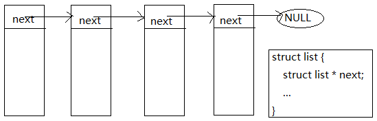

## 第2章-内功-数据结构上卷

	对于 C而言, 数据结构不过关, 一切都是虚妄. 其它语言好点, 复合类型标准支持的很扎实.重
	复一点, 在 C的世界里, 只认数据结构和操作系统. 而数据结构就是核心内功, 一招一式全是内
	劲. 修炼数据结构本质是为了方便操作, 规划整个布局, 捋顺输入输出. 内功没有几个月苦练, 
	外放很难实现. 内功上卷我们只讲简单一点 list, string, array, hash.

### 2.1 list

    如果说数据结构是 C的内功, 那么毫无疑问链表 list就是数据结构的内丹. 链式结构最原始的
    抽象模型就是 list. 同样也是最实用的.

 
    
    上图就是一种最原始的 list结构, next是指向下一个结点的地址. 自己对于 list结构的理解
    比较简单, list 只是个实体, 并且这个实体还能找到它保存的下一个实体. 下面展示构建部分
	接口. 学习一个陌生的东西有很多套路, 一条最迅速的办法就是 
	write demo -> see interface -> copy implement

#### 2.1.1 list.h interface

```C
#ifndef _H_SIMPLEC_LIST
#define _H_SIMPLEC_LIST

#include "struct.h"

//
//	这个万能单链表库, 设计比较老了但可以一用
//	1.使用的时候,需要加上 _LIST_HEAD; 宏
//	2.创建的第一句话就是 list_t head = NULL; 开始从空链表开始list的生涯
//
struct $lnode {
	struct $lnode * next;
};

// 不多说了一定放在想使用链表结构的结构体头部
#define _LIST_HEAD struct $lnode $node

//
// 简单链表结构, 当你使用这个链表的时候 需要 list_t head = NULL; 开始使用之旅
//
typedef void * list_t;

//
// list_next - 主要返回结点n的下一个结点. 用法 node->next = list_next(n) or list_next(n) = node;
// n		: 当前结点
//
#define list_next(n) ((struct $lnode *)(n))->next

//
// list_destroy - 链表销毁函数.对于只是栈上数据就不用调这个api
// ph 		: 指向当前链表结点的指针
// die		: 销毁执行的函数
// return	: void
//
extern void list_destroy(list_t * ph, node_f die);

//
// list_add - 在 cmp(left, x) <= 0 x处前面插入node结点
// ph		: 指向头结点的指针
// cmp		: 比较函数,将left同 *ph中对象按个比较
// left		: cmp(left, x) 比较返回 <=0 or >0
// return	: 返回 SufBase 表示成功!
//
extern int list_add(list_t * ph, icmp_f cmp, void * left);

//
// list_findpop - 查找到要的结点,并弹出,需要你自己回收
// ph		: 指向头结点的指针
// cmp		: 比较函数,将left同 *ph中对象按个比较
// left		: cmp(left, x) 比较返回 0 >0 <0
// return	: 找到了退出/返回结点, 否则返回NULL
//
extern void * list_findpop(list_t * ph, icmp_f cmp, const void * left);

#endif // !_H_SIMPLEC_LIST
```

    对于 struct.h 可以参看第一章的设计部分, 这里轻微提及一下 

```C
//
// icmp_f   - int icmp(const void * ln, const void * rn); 标准结构
//          - return > 0 or = 0 or < 0
//          - ( ) 可以接收任意参数类型, 方便类型转换
//
typedef int    (* icmp_f )( );

//
// node_f   - 每个结点的处理函数指针
//
typedef void   (* node_f )(void * node);

```

    封装的这一套接口, 使用起来也很简单. 例如构建一个人的链表结构, 只需要采用下面方式

```C
struct people {
    _LIST_HEAD;
    int free;       // 有理想
    char * ideal;   // 有文化
    double future;  // 有秩序
};

static inline int _people_add_cmp(const struct people * ln, const struct people * lr) {
    return ln->free - lr->free;
}

static inline int _people_find_cmp(double future, const struct people * lr) {
    return future != lr->future;
}

struct people pe = { { NULL }, 100, 59, 0.0 };

// 构建
list_t pls = NULL;

// 添加
list_add(&pls, _people_add_cmp, &pe);

// 删除 | 返回结点自己负责善后
struct people * ple = list_findpop(&pls, _people_find_cmp, 6.6);

// 销毁
list_destroy(&pls, NULL);
```

    list部分过于基础, 解释太多还没有写10几类链表来的实在. 做 C相关开发, 几乎就是围绕 'list'
	结构增删改查, 高级些加个缓存层, 伪删除. 对于封装库多三思而后行. 想好思路, 定好基调接口. 
	再堆实现. 设计优雅的设计, 是第一位. 在 C中思路出来了, 数据结构也定型了, 
	那么代码实现就已经妥了! 最好也就是 Debug -> Unit testing 

#### 2.1.2 list implements

    这里会展示分析作者设计的思路. 在设计一个库的时候, 首要考虑的是创建和销毁. 关乎生存周期的
	问题. 这里 list创建比较简单采用了一个潜规则 -> list_t list = NULL; 代表创建一个空链表.
	链表创建有两个常见套路, 其一是自带实体头结点, 这种思路在处理头结点的时候特别方便. 
	其二就是我们这里没有头结点一开始为从 NULL开始. 优势在于节省空间. 对于链表的销毁操作, 
	使用了单词 destroy 毁坏, 相当于彻底销毁. 

```C
typedef void * list_t;
typedef void (* node_f )(void * node);
extern void list_destroy(list_t * ph, node_f die);
```

    list_destroy 传达的意图是, 通过 list_t 的指针来改变 list_t 链表. 并且链表中每个结点采用
    die 函数行为销毁. 因而可以理解为有两部分组成 销毁行为 + 自定义的销毁动作. 用的思路是抽象
    出行为, 自定义动作, 这类技巧在上层语言有个好听的叫法 - 委托. 扯些在 C中还有一种套路也能
    达到同样效果, 叫宏模板. 统一行为, 内嵌动作, 性能更好. 但心智成本高点. ok 继续展示代码

```C
void
list_destroy(list_t * ph, node_f die) {
	struct $lnode * head;
	if ((!ph) || !(head = *ph))
		return;

	if (die) {
		do {
			struct $lnode * next = head->next;
			die(head);
			head = next;
		} while (head);
	}

	*ph = NULL;
}
```

    list_add(list_t *, icmp_f, void *) 传达的意图这是向链表中添加结点的接口. icmp_f 是插入
    选择的自定义行为, void * 是选择的基准. 这就是基于注册的链表插入设计思路, 一般这么搞都是为
	了得到一定顺序的链表. 否则直接插在头结点最轻松. 

```C
//
// list_addhead - 采用头查法插入结点, 第一次用需要 list_t head = NULL;
// ph		: 指向头结点的指针
// node		: 待插入的结点对象
// return	: 返回 SufBase 表示成功!
//
inline int 
list_addhead(list_t * ph, void * node) {
	if (!ph || !node){
		RETURN(ErrParam, "list_add check (pal == %p || node == %p)!", ph, node);
	}

	list_next(node) = *ph;
	*ph = node;

	return SufBase;
}
```
    
    是不是很简单. 上面代码用的也非常多, 在不需要链表有序的时候. 那看下这里实际封装

```C
int 
list_add(list_t * ph, icmp_f cmp, void * left) {
	struct $lnode * head;
	DEBUG_CODE({
		if (!ph || !cmp || !left) {
			RETURN(ErrParam, "list_add check ph=%p, cmp=%p, left=%p.", ph, cmp, left);
		}
	});

	head = *ph;
	// 插入为头结点直接返回
	if (!head || cmp(left, head) <= 0) {
		list_next(left) = head;
		*ph = left;
		return SufBase;
	}

	// 中间插入了
	while (head->next) {
		if (cmp(left, head->next) <= 0)
			break;
		head = head->next;
	}
	list_next(left) = head->next;
	head->next = left;
	return SufBase;
}
```

    DEBUG_CODE 是在 DEBUG模式下才会执行的代码, 可以等同于扩展的 assert. 通过 cmp() <= 0 可以看
    此链表是个升序排列. 链表这类代码最好能深入到本能, 闭着眼睛写, 等同于系统开发 DB的增删改查. 当
    初刚学这东西的时候, 应该从头到尾写了不下半百遍, 后面就手熟了. 
    再来看下 list_findpop 字面意思是找到我们要的结点, 并弹出. 后续结点自己负责销毁与否.

```C
void * 
list_findpop(list_t * ph, icmp_f cmp, const void * left) {
	struct $lnode * head, * tmp;
	if((!ph) || (!cmp) || (!left) || !(head = *ph)){
		RETURN(NULL, "check find {(!ph) || (!cmp) || (!left) || !(head = *ph)}!");
	}

	// 头部检测
	if(cmp(left, head) == 0){
		*ph = head->next;
		return head;
	}

	// 后面就是普通的查找
	while((tmp = head->next)){
		if(cmp(left, tmp) == 0){
			head->next = tmp->next;
			break;
		}
		head = tmp;
	}
	
	return tmp;
}
```

    链特性顺藤摸瓜, 给根杆子就 pa. 以上封装链表库基础行为, 创建销毁添加删除. 来回扯几次,
    编程中其它链式结构也都势如破竹, 长虹贯日! 
    链表是整个数据结构的内丹. 是编程内功突破最重要的一个阶段! 修成元婴也不是不可能

### 2.2 string

    有句话不知道当讲不当讲, C中 char * 其实够用了!
    用 C写过几个 string 模型, 但都不太爽, 都有点过度封装. 应用领域很模糊. 
    但有个方面需要扩展 char [] 就是动态字符串. 这里来简单介绍一种缓冲字符串的封装思路.
    首先为了让大家好融进来, 先对 string.h 中一些接口扩展一点点, 顺带多加点说辞

```C
//
// 字符串不区分大小写比较函数
// ls		: 左串
// rs		: 右串
// return	: ls > rs 返回 > 0; ... < 0; ... =0
//
int 
tstr_icmp(const char * ls, const char * rs) {
	int l, r;
	if (!ls || !rs) 
		return (int)(ls - rs);

	do {
		if ((l = *ls++) >= 'a' && l <= 'z')
			l -= 'a' - 'A';
		if ((r = *rs++) >= 'a' && r <= 'z')
			r -= 'a' - 'A';
	} while (l && l == r);

	return l - r;
}

//
// 字符串拷贝函数, 需要自己free
// str		: 待拷贝的串
// return	: 返回拷贝后的串
//
char * 
tstr_dup(const char * str) {
	size_t len;
	char * nstr;
	if (NULL == str) 
		return NULL;

	len = strlen(str) + 1;
	nstr = malloc(sizeof(char) * len);
	//
	// 补充一下, 关于 malloc的写法, 说不尽道不完. 
	// 这里采用 日志 + exit, 这种未定义行为. 方便收集错误日志和监测大内存申请失败情况.
	//
	if (NULL == nstr)
		CERR_EXIT("malloc len = %zu is empty!", len);

	return memcpy(nstr, str, len);
}
```

    以上对 stricmp (strcasecmp) 和 strdup 这些标准中模棱两可函数的补充! 顺带再补充一点点

```C
//
// Brian Kernighan与 Dennis Ritchie 简便快捷的 hash算法
// str		: 字符串内容
// return	: 返回计算后的hash值
//
unsigned 
tstr_hash(const char * str) {
	register unsigned h = 0;
	if (str) {
		register unsigned c;
		while ((c = *str++))
			h = h * 131 + c;
	}
	return h;
}
```

    上面是 C语言之父展示一种 hash算法, 极其简便快速. 哈希(hash) 相当于一个函数, f (char *)
    映射成一个数值. 这样的做意图能够通过一个数值确定这个字符串. 思路特别巧妙, 同样也就造成另
	一个问题, 如果两个串映射一样的值, 那怎么搞. 常用术语叫碰撞, 解决碰撞也好搞.套路不少, 有
	固定范围内 hash, 非固定返回内 hash...... 我们以后者举例. 如果发生碰撞了怎么处理.
    如果我们采用哈希的时候, 需要一个池子中保存所有 hash值. 那么第一种思路是池子中发生碰撞了,
    就加大池子, 再全部重新 hash一遍, 以此来搞, 原理是池子越大碰撞机会越小. 另一种思路是池子
	中有碰撞了, 那好我们单独开个小池子把这个碰撞的值全塞到小池子中.
	hash 其中一个特性是, 两个模型映射的哈希值不一样, 那么二者一定不一样! 一下刷了一批!
	多查查资料, 把 hash 设计和编码都搞明白!!! hash是为了解决急速查找问题. 

#### 2.2.1 string 模型一种封装 tstr interface

    这里封装一种自带扩容缓冲的字符串模型, 比较好懂基础. 首先看下面总的接口声明, 有个感性
    认知. 支持堆上和栈上声明使用

```C
#ifndef _H_SIMPLEC_TSTR
#define _H_SIMPLEC_TSTR

#include "struct.h"

#ifndef _STRUCT_TSTR

struct tstr {
	char * str;			// 字符串实际保存的内容
	size_t len;			// 当前字符串长度
	size_t cap;			// 字符池大小
};

// 定义的字符串类型
typedef struct tstr * tstr_t;

#define _STRUCT_TSTR
#endif

//文本串栈上创建内容,不想用那些技巧了,就这样吧
#define TSTR_CREATE(var) \
	struct tstr var[1] = { { NULL } }
#define TSTR_DELETE(var) \
	free((var)->str)

#endif // !_H_SIMPLEC_TSTR
```

    通过 struct tstr 就可以理解作者思路, str存放内容, len记录当前字符个数, cap 表示str能够保存
    的容量. 声明了字符串类型 tstr_t 用于堆上声明, 如果想在栈上声明, 可以用提供的宏. 其实很多编译
	器支持运行期结束自动执行析构操作, 其实只是编译器的语法糖, 编译内嵌析构操作. 例如下面套路

```C
#define TSTR_USING(var, code) \
    do { \
        TSTR_CREATE(var); \
        code \
        TSTR_DELETE(var); \
    } while(0)
```

    模拟函数退栈 pop自动销毁栈上字符串 var变量. C 修炼入门, 至少也会说, 早已看穿, 却入戏太深.
    通过上面结构的构造, 关于行为的部分那就好理解多了. 多扯一点, C中没有'继承'(当然也可以搞)但
	是有文件依赖, 本质是文件继承. 例如上面 #include "struct.h" 表达的意思是 tstr.h 接口文件
	继承 struct.h 接口文件. 强加文件继承关系, 能够明朗化文件包含关系. 那么看后续设计

```C
//
// tstr_t 创建函数, 会根据c的tstr串创建一个 tstr_t结构的字符串
// str		: 待创建的字符串
// len		: 创建串的长度
// return	: 返回创建好的字符串,内存不足会打印日志退出程序
//
extern tstr_t tstr_create(const char * str, size_t len);
extern tstr_t tstr_creates(const char * str);

//
// tstr_t 释放函数
// tstr		: 待释放的串结构
//
extern void tstr_delete(tstr_t tstr);

//
// tstr_expand - 为当前字符串扩容, 属于低级api
// tstr		: 可变字符串
// len		: 扩容的长度
// return	: tstr->str + tstr->len 位置的串
//
char * tstr_expand(tstr_t tstr, size_t len);

//
// 向tstr_t串结构中添加字符等, 内存分配失败内部会自己处理
// c		: 单个添加的char
// str		: 添加的c串
// sz		: 添加串的长度
//
extern void tstr_appendc(tstr_t tstr, int c);
extern void tstr_appends(tstr_t tstr, const char * str);
extern void tstr_appendn(tstr_t tstr, const char * str, size_t sz);

//
// 通过cstr_t串得到一个c的串以'\0'结尾
// tstr		: tstr_t 串
// return	: 返回构建好的c的串, 内存地址tstr->str
//
extern char * tstr_cstr(tstr_t tstr);
```

    还是无外乎创建销毁, 其中 tstr_expand 表示为 tstr扩容操作. 没加 extern 表达的意图是使用
    这个接口要小心, 低等级接口. tstr_cstr 安全的得到 C 类型 char * 串. 当然如果足够自信, 也
    可以直接 tstr->str走起, 安全因人而异. 这个是 C的'自由', 大神在缥缈峰上, 菜鸡在自家坑中.
    对于 tstr_cstr 封装也很直白, 就是看结尾是否有 C的 '\0'

```C
inline char * 
tstr_cstr(tstr_t tstr) {
	// 本质是检查最后一个字符是否为 '\0'
	if (tstr->len < 1 || tstr->str[tstr->len - 1]) {
		tstr_expand(tstr, 1);
		tstr->str[tstr->len] = '\0';
	}

	return tstr->str;
}
```

    一切封装从简, 最好的自然是大道于无为~

#### 2.2.2 tstr implement

    这里详细谈一下 tstr的实现, 首先看最重要的一个接口 tstr_expand 操作内存.
	C 中, 内存有了完全可以为所欲为

```C
inline void 
tstr_delete(tstr_t tstr) {
	free(tstr->str);
	free(tstr);
}

// 文本字符串创建的初始化大小
#define _UINT_TSTR		(32u)

char *
tstr_expand(tstr_t tstr, size_t len) {
	size_t cap = tstr->cap;
	if ((len += tstr->len) >= cap) {
		char * nstr;
		for (cap = cap < _UINT_TSTR ? _UINT_TSTR : cap; cap < len; cap <<= 1)
			;
		// 开始分配内存
		if ((nstr = realloc(tstr->str, cap)) == NULL) {
			tstr_delete(tstr);
			CERR_EXIT("realloc cap = %zu empty!!!", cap);
		}

		// 重新内联内存
		tstr->str = nstr;
		tstr->cap = cap;
	}

	return tstr->str + tstr->len;
}
```
    
	上面关于 cap <<= 1 的做法在内存分配的时候很常见, 一个最小初始值, 幂级别增长. 还有一种封装
	库的时候替代上面写法的操作, 如下(失传已久的装波升级)

```C
// 2 ^ n >= x , 返回 [2 ^ n] 
static inline int _pow2gt(int x) {
	--x;
	x |= x >> 1;
	x |= x >> 2;
	x |= x >> 4;
	x |= x >> 8;
	x |= x >> 16;
	return x + 1;
}
```

	原理是 2 ^ n - 1 位数全是1, 但不太通用. 对于 realloc返回 NULL的时候, 直接 exit操作也可以
	不需要再次销毁内存了. 以前一位巨擘说过, 进程的事情理应交给操作系统. 想过好久感觉特别有道理.
	后面有机会会统一构建内存管理模块. 再看看添加数据模块实现, 就轻松许多了 ->

```C
inline void 
tstr_appendc(tstr_t tstr, int c) {
	// 这类函数不做安全检查, 为了性能
	tstr_expand(tstr, 1);
	tstr->str[tstr->len++] = c;
}

void 
tstr_appends(tstr_t tstr, const char * str) {
	size_t len;
	if (!tstr || !str) {
		RETURN(NIL, "check '!tstr || !str' param is error!");
	}

	len = strlen(str);
	if(len > 0)
		tstr_appendn(tstr, str, len);
	tstr_cstr(tstr);
}

inline void 
tstr_appendn(tstr_t tstr, const char * str, size_t sz) {
	tstr_expand(tstr, sz);
	memcpy(tstr->str + tstr->len, str, sz);
	tstr->len += sz;
}
```

	思路完全是大白话, [ 还能撑住吗 -> 不能了, 请求支援 -> 能撑住了 -> 继续撑.... ]
	随后看看创建模块

```C
tstr_t 
tstr_create(const char * str, size_t len) {
	tstr_t tstr = calloc(1, sizeof(struct tstr));
	if (NULL == tstr)
		CERR_EXIT("malloc sizeof struct tstr is error!");
	if (str && len > 0)
		tstr_appendn(tstr, str, len);
	return tstr;
}

tstr_t
tstr_creates(const char * str) {
	tstr_t tstr = calloc(1, sizeof(struct tstr));
	if (NULL == tstr)
		CERR_EXIT("malloc sizeof struct tstr is error!");
	if(str)
		tstr_appends(tstr, str);
	return tstr;
}
```

	使用了潜规则 1' struct tstr 为空属性全部要为0; 2' calloc 返回成功后内存会设置为 '0'
	到这里简单的完成了一个C字符串, 准确的说是字符池模块. 顺手展示几个应用

```C
//
// 简单的文件读取类,会读取完毕这个文件内容返回,失败返回NULL.
// path		: 文件路径
// return	: 创建好的字符串内容, 返回NULL表示读取失败
//
tstr_t 
tstr_freadend(const char * path) {
	int err;
	size_t rn;
	tstr_t tstr;
	char buf[BUFSIZ];
	FILE * txt = fopen(path, "rb");
	if (NULL == txt) {
		RETURN(NULL, "fopen r %s is error!", path);
	}

	// 分配内存
	tstr = tstr_creates(NULL);

	// 读取文件内容
	do {
		rn = fread(buf, sizeof(char), BUFSIZ, txt);
		if ((err = ferror(txt))) {
			fclose(txt);
			tstr_delete(tstr);
			RETURN(NULL, "fread err path = %d, %s.", err, path);
		}
		// 保存构建好的数据
		tstr_appendn(tstr, buf, rn);
	} while (rn == BUFSIZ);

	fclose(txt);

	// 继续构建数据, 最后一行补充一个\0
	tstr_cstr(tstr);

	return tstr;
}
```

	上面是一个性能不错的读取文件全部内容的一个子功能. 有了读自然需要有写了, 不妨搞个

```C
static int _tstr_fwrite(const char * path, const char * str, const char * mode) {
	FILE * txt;
	if (!path || !*path || !str) {
		RETURN(ErrParam, "check !path || !*path || !str'!!!");
	}

	// 打开文件, 写入消息, 关闭文件
	if ((txt = fopen(path, mode)) == NULL) {
		RETURN(ErrFd, "fopen mode = '%s', path = '%s' error!", mode, path);
	}
	fputs(str, txt);
	fclose(txt);

	return SufBase;
}

//
// 将c串str覆盖写入到path路径的文件中
// path		: 文件路径
// str		: c的串内容
// return	: SufBase | ErrParam | ErrFd
//
inline int 
tstr_fwrites(const char * path, const char * str) {
	return _tstr_fwrite(path, str, "wb");
}

//
// 将c串str写入到path路径的文件中末尾
// path		: 文件路径
// str		: c的串内容
// return	: SufBase | ErrParam | ErrFd
//
inline int 
tstr_fappends(const char * path, const char * str) {
	return _tstr_fwrite(path, str, "ab");
}
```

	到这 C中字符串辅助模块基本搞定了. string 不是 C必须的, 目前 C的标准更新完全取决于内核层
	的需要. 单纯就目前而言对 C标准支持的最好的是 gcc , 最被期待是 clang, 最水的是 cl!


### 2.3 array

	这里的 array指的是可变数组模块. 但在 C中其实固定数组就够用了! 顺带说一点 C99中支持变量数
	数组, 如下声明本质是编译器帮我们 malloc + free, 但是运行时不可改变大小. 我们这里的 array

```C
int n = 64;
int a[n];
``` 

	支持运行时大小的扩容. 设计原理简单和上面封装 tstr很相似, 只是 char独立单元变成了 void *
	独立单元.

```C
#ifndef _H_SIMPLEC_ARRAY
#define _H_SIMPLEC_ARRAY

#include "struct.h"

struct array {
	void *		as;		/* 存储数组具体内容首地址 */
	unsigned	len;	/* 当前数组的长度 */
	unsigned	size;   /* 当前数组容量大小 */
	size_t		alloc;	/* 每个元素字节大小 */
};

// 定义可变数组类型 对象
typedef struct array * array_t;

#endif//_H_SIMPLEC_ARRAY
```

	array通过注册的 alloc确定数组中每个对象内存模型. 一种原始的反射思路. 上层语言做的
	很多工作就是把编译时转到了运行时. 更高级的魔法直接跳过编译时吟唱阶段瞬发.

#### 2.3.1 array interface

	array 接口设计分为两部分, 核心部分围绕构建删除, 入栈出栈. 

```C
/*
 * 返回创建数组对象
 * size		: 创建数组的总大小个数, 0表示走默认值创建
 * alloc	: 数组中每个元素的字节数, need > 1 否则行为未知
 *			: 返回创建的数组对象
 */
extern array_t array_new(unsigned size, size_t alloc);

/*
 * 销毁这个创建的数组对象
 * a		: 创建的数组对象
 */
extern void array_die(array_t a);

/*
 * 重新构建一个数组对象
 * a		: 可变数组对象
 * size		: 新可变数组总长度
 */
extern void array_init(array_t a, unsigned size);

/*
 * 为可变数组插入一个元素, 并返回这个元素的首地址
 * a		: 可变数组对象
 *			: 返回创建对象位置
 */
extern void * array_push(array_t a);

/*
 * 弹出一个数组元素
 * a		: 可变数组对象
 *			: 返回弹出数组元素节点
 */
extern void * array_pop(array_t a);
```

	上面接口构建的是堆上对象, 如果想构建栈上的对象, 可以采用下面设计

```C
/*
 * 在栈上创建对象var
 * var		: 创建对象名称
 * size		: 创建对象总长度
 * alloc	: 每个元素分配空间大小
 */
#define ARRAY_NEW(var, size, alloc) \
	struct array var[1] = { { NULL, 0, 0, alloc } }; \
	array_init(var, size)
#define ARRAY_DIE(var) \
	free(var->as)
```

	在 C中 数组 [1] 这个技巧本质是为了追求指针对象写法的统一, 全是 -> . 是不是很有意思.
	另外部分辅助接口设计如下

```C
/*
 * 按照索引得到数组元素
 * a		: 可变数组对象
 * idx		: 索引位置
 *			: 返回查询到数据
 */
extern void * array_get(array_t a, unsigned idx);

/*
 * 得到节点elem在数组中索引
 * a		: 可变数组对象
 * elem		: 查询元素
 *			: 返回查询到位置
 */
extern unsigned array_idx(array_t a, void * elem);

/*
 * 得到数组顶的元素
 * a		: 可变数组对象
 *			: 返回得到元素
 */
extern void * array_top(array_t a);

/*
 * 两个数组进行交换
 * a		: 数组a
 * b		: 数组b
 */
extern void array_swap(array_t a, array_t b);

/*
 * 数组进行排序
 * a		: 数组对象
 * compare	: 比对规则
 */
extern void array_sort(array_t a, icmp_f compare);

/*
 * 数组进行遍历
 * a		: 可变数组对象
 * func		: 执行每个结点函数, typedef int	(* each_f)(void * node, void * arg);
 * arg		: 附加参数
 *			: 返回操作结果状态码
 */
int array_each(array_t a, each_f func, void * arg);
```

	结构是设计的内在, 内功循环的套路. 接口是设计的外在, 发招后内力外在波动.
	而实现就是无数次重复磨炼~

#### 2.3.2 array implement

	情不知所起，一往而深.
	这里继续扯编程实现, 同样的, 9成库打头阵的都是内存管理这块. 

```C
#define _INT_ARRAY_SIZE		(16)		// 数组的默认大小

array_t 
array_new(unsigned size, size_t alloc) {
	struct array * a = malloc(sizeof(struct array));
	assert(NULL != a);
	// 指定默认size大小
	size = size ? size : _INT_ARRAY_SIZE;
	a->as = malloc(size * alloc);
	assert(NULL != a->as);
	a->len = 0;
	a->size = size;
	a->alloc = alloc;

	return a;
}

inline void 
array_die(array_t a) {
	if (a) {
		free(a->as);
		free(a);
	}
}

inline void
array_init(array_t a, unsigned size) {
	assert(NULL != a);
	a->as = realloc(a->as, size * a->alloc);
	assert(NULL != a->as);
	if (a->len > size)
		a->len = size;
	a->size = size;
}
```

	思路很朴实那里需要内存那里就向服务器申请内存. 随后展示 push 和 pop 设计

```C
inline void * 
array_push(array_t a) {
	assert(NULL != a);

	if (a->len == a->size) {
		/* the array is full; allocate new array */
		a->size <<= 1;
		a->as = realloc(a->as, a->size * a->alloc);
		assert(NULL != a->as);
	}

	return (unsigned char *)a->as + a->alloc * a->len++;
}

inline void * 
array_pop(array_t a) {
	assert(NULL != a && 0 != a->len);
	--a->len;
	return (unsigned char *)a->as + a->alloc * a->len;
}
```

	代码思索多了, 也就更朴实了. 
	毕竟是剖析, 上面有个争议的地方关于 realloc 用法, 写个装波的教科书用法:

```C
char * str = malloc(sizeof int);
if (NULL == str) {
	return NULL;
}

char * nstr = realloc(str, sizeof long long);
if (NULL == nstr) {
	free(nstr);
	return NULL;
}

str = nstr;
```

	核心围绕 realloc 存在返回 NULL, 泄漏内存的风险. 3年内程序猿喜欢这么搞. 除了定式
	范式, 其它部分就随意了. 最上面做法造成结果会依操作系统而定, 另一个名词统称
	`未定义行为'. 后面看一下辅助代码的设计就异常简单:

```C
inline void * 
array_get(array_t a, unsigned idx) {
	assert(NULL != a && idx < a->len);
	return (unsigned char *)a->as + a->alloc * idx;
}

inline unsigned 
array_idx(array_t a, void * elem) {
	unsigned char * p, * q;
	unsigned off;

	assert(NULL != a && elem >= a->as);

	p = a->as;
	q = elem;
	off = (unsigned)(q - p);

	assert(off % (unsigned)a->alloc == 0);

	return off / (unsigned)a->alloc;
}

inline void * 
array_top(array_t a) {
	assert(NULL != a && 0 != a->len);
	return (unsigned char *)a->as + a->alloc * (a->len - 1);
}
```

	当然了, 越是经过筛选的好东西, 理应很顺很清晰.
	最后一弹, 抽象行为, 自定义动作

```C
inline 
void array_swap(array_t a, array_t b) {
	struct array t = *a;
	*a = *b;
	*b = t;
}

inline void 
array_sort(array_t a, icmp_f compare) {
	assert(NULL != a && 0 != a->len && NULL != compare);
	qsort(a->as, a->len, a->alloc, (int (*)(const void *, const void *))compare);
}

int 
array_each(array_t a, each_f func, void * arg) {
	int rt;
	unsigned char * s, * e;

	assert(NULL != a && NULL != func);

	s = a->as;
	e = s + a->alloc * a->len;
	while (s < e) {
		rt = func(s, arg);
		if (SufBase != rt)
			return rt;
		s += a->alloc;
	}

	return SufBase;
}
```

	顺带扯一点, 对于编程而言, 尽量少 typedef, 多 struct 写全称. 谎言需要另一个谎言来弥补.
	多大量的用标准中推出的解决方案. 例如 多用标准提供的跨平台类型, stdint.h and stddef.h 
	定义全平台类型. 不妨将这么多年习得的无上秘法, 血之限界 - 血轮眼 - 不懂的代码抄几遍, 
	一切如梦如幻! 回到正题, 真没必要多说. 神来一笔就是 if (SufBase != rt) return rt; 
	关于 array的内功学会之后, 可以自己写写单元测试, 融会贯通一下. 
	有篇幅的话会写个单元测试框架, 供参考.

### 2.4 hash

	我们这里讲述的 hash比较针对, 对数值进行哈希映射(想起一个分析名词收敛). 应用场景也多, 
	例如内核层给应用层的句柄id. 无法对其规律进行假设, 那我们把它映射到特定的范围内. 就很
	控制了. 封装系统 io复用的时候很常见.
	下面展示一个 hashid的封装, 原始思路来自云风大佬的 skynet c gate server 上设计

```C
#ifndef _H_SIMPLEC_HASHID
#define _H_SIMPLEC_HASHID

#include <assert.h>
#include <stdlib.h>

struct nodeid {
	int id;
	struct nodeid * next;
};

struct hashid {
	int mod;
	int cap;
	int cnt;
	struct nodeid * ids;
	struct nodeid ** hash;
};

static void hashid_init(struct hashid * hi, int max) {
	int hcap = 16;
	assert(hi && max > 1);
	while (hcap < max)
		hcap *= 2;

	hi->mod = hcap - 1;
	hi->cap = max;
	hi->ids = malloc(max * sizeof(struct nodeid));
	hi->cnt = 0;
	for (int i = 0; i < max; ++i) 
		hi->ids[i] = (struct nodeid) { -1, NULL };
	
	hi->hash = calloc(hcap, sizeof(struct hashid *));
}

static void inline hashid_clear(struct hashid * hi) {
	free(hi->ids); 	hi->ids = NULL;
	free(hi->hash); hi->hash = NULL;
	hi->mod = 1;
	hi->cap = 0;
	hi->cnt = 0;
}

static int hashid_lookup(struct hashid * hi, int id) {
	int h = id & hi->mod;
	struct nodeid * c = hi->hash[h];
	while (c) {
		if (c->id == id)
			return c - hi->ids;
		c = c->next;
	}
	return -1;
}

static int hashid_remove(struct hashid * hi, int id) {
	int h = id & hi->mod;
	struct nodeid * c = hi->hash[h];
	if (c == NULL)
		return -1;

	if (c->id == id) {
		hi->hash[h] = c->next;
		goto _clear;
	}
	while (c->next) {
		if (c->next->id == id) {
			struct nodeid * temp = c->next;
			c->next = temp->next;
			c = temp;
			goto _clear;
		}
		c = c->next;
	}

_clear:
	c->id = -1;
	c->next = NULL;
	--hi->cnt;
	return c - hi->ids;
}

static int hashid_insert(struct hashid * hi, int id) {
	struct nodeid * c = NULL;
	for (int i = 0; i < hi->cap; ++i) {
		int idx = (i + id) % hi->cap;
		if (hi->ids[idx].id == -1) {
			c = hi->ids + idx;
			break;
		}
	}
	assert(c && c->next == NULL);

	++hi->cnt;
	c->id = id;
	int h = id & hi->mod;
	if (hi->hash[h])
		c->next = hi->hash[h];
	hi->hash[h] = c;
	return c - hi->ids;
}

static inline int hashid_full(struct hashid * hi) {
	return hi->cnt >= hi->cap;
}

#endif//_H_SIMPLEC_HASHID
```

	代码比注释值钱.
	一般书中也许会有习题, 我们这里当成一篇阅读理解. 哈哈. 来一同感受设计的细节. 有些朴实, 
	有些飘逸, 有些巧妙. 下面先阅读完讲解一点潜规则, 先入为主

* 0' -> 	return -1;

		没有找见就返回索引 -1, 作为默认错误和 POSIX 默认错误码相同. POSIX 错误码引入了
		errno机制, 不太好, 封装过度. 上层需要二次判断, 开发起来要命. 可能我们后续设计
		思路也是采用这种 POSIX思路, 但愿是 上错花轿嫁对郎.

* 1' -> int hcap = 16;  

		这个 hcap 初始值必须是2的幂数, 方便得到 hi->mod = 2 ^ x - 1 = hcap - 1

* 2' -> hi->hash = calloc(hcap, sizeof(struct hashid *));  

		这里表明当前 hash实体已经全部申请好了, 只能用这些了. 所以有了 hashid_full 接口.

* 3' -> assert(c && c->next == NULL);  

		这个在 hashid_insert中, 表明意思是插入一定成功. 那么这个接口必须在 hashid_full
		之后执行. 

* 4' -> int idx = (i + id) % hi->cap;  

		一种查找策略, 可以有也可以无. 和 O(n) 纯 for 查找没啥区别. 看数据随机性.

* 5' -> 最后小总结
		
		通过以上就好理解了. 上面我们构建的一种 hashid api, 完成的工作就是方便 
		int id的映射工作. 查找急速, 实现上采用的是桶算法. 映射到固定空间上索引. 
		写一遍想一遍就能感受到那些游动于指尖的美好~

### 2.5 内功心法上卷结构

	渔家傲·平岸小桥千嶂抱
	王安石·宋

	平岸小桥千嶂抱，
	柔蓝一水萦花草。
	茅屋数间窗窈窕，
	尘不到，
	时时自有春风扫。

	午枕觉来闻语鸟，
	欹眠似听朝鸡早。
	忽忆故人今总老，
	贪梦好，
	茫然忘了邯郸道。

