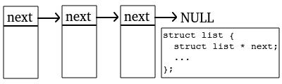

# 第2章-内功-数据结构简述

<!-- TOC -->

- [第2章-内功-数据结构简述](#%E7%AC%AC2%E7%AB%A0-%E5%86%85%E5%8A%9F-%E6%95%B0%E6%8D%AE%E7%BB%93%E6%9E%84%E7%AE%80%E8%BF%B0)
    - [1. list](#1-list)
        - [1.1. list interface](#11-list-interface)
        - [1.2. list implements](#12-list-implements)
    - [2. string](#2-string)
        - [2.1. 包装 string.h => strext.h](#21-%E5%8C%85%E8%A3%85-stringh--strexth)
        - [2.2. chars interface](#22-chars-interface)
        - [2.3. chars implement](#23-chars-implement)
    - [3. array](#3-array)
    - [4. 阅读理解两篇](#4-%E9%98%85%E8%AF%BB%E7%90%86%E8%A7%A3%E4%B8%A4%E7%AF%87)
        - [4.1. 阅读理解 - stack 设计](#41-%E9%98%85%E8%AF%BB%E7%90%86%E8%A7%A3---stack-%E8%AE%BE%E8%AE%A1)
        - [4.2. 阅读理解 - id hash 设计](#42-%E9%98%85%E8%AF%BB%E7%90%86%E8%A7%A3---id-hash-%E8%AE%BE%E8%AE%A1)
    - [5. 拓展阅读 strlen 工程样例](#5-%E6%8B%93%E5%B1%95%E9%98%85%E8%AF%BB-strlen-%E5%B7%A5%E7%A8%8B%E6%A0%B7%E4%BE%8B)
    - [6. 展望](#6-%E5%B1%95%E6%9C%9B)
    - [7. dict](#7-dict)
    - [8. 来个队列吧](#8-%E6%9D%A5%E4%B8%AA%E9%98%9F%E5%88%97%E5%90%A7)
        - [8.1. 简单版本队列](#81-%E7%AE%80%E5%8D%95%E7%89%88%E6%9C%AC%E9%98%9F%E5%88%97)
        - [8.2. 线程安全版本](#82-%E7%BA%BF%E7%A8%8B%E5%AE%89%E5%85%A8%E7%89%88%E6%9C%AC)
        - [8.3. 队列拓展小练习](#83-%E9%98%9F%E5%88%97%E6%8B%93%E5%B1%95%E5%B0%8F%E7%BB%83%E4%B9%A0)
    - [9. 阅读理解 struct heap](#9-%E9%98%85%E8%AF%BB%E7%90%86%E8%A7%A3-struct-heap)

<!-- /TOC -->

对于 C 而言, 数据结构不熟练, 很难不是美丽的泡沫. 其他语言好一点, 标准或者框架中对结构算法有很好用(中庸)的支持. 重复说, 在 C 的世界里, 数据结构和操作系统是硬通货. 其中数据结构就是核心内功, 一招一式全得自己敲打. 修炼数据结构本质是为了掌握业务世界和编程世界沟通单元, 规划细节, 捋顺输入输出. 而关于数据结构内功没有几个月苦练, 很难实现外放得心应手. 这里只讲简单一点 list, string, array, stack, hash, dict, queue, heap 等普通工程类型的数据结构.

## 2.1 list

基于数据结构是 C 内功说法, 毫无疑问那链表结构就是数据结构的两大基础基石之一 (链式结构和顺序结构). 而链式结构最原始抽象模型就是链表 list, 极其普通和实用.



上图是最简单的一种 list 结构布局, next 指向下一个结点的指针. 对于 list 结构的理解比较简单, list 是个实体, 并且这个实体还能找到他保存的下一个实体. 随后会为 list 构建部分接口. 学习一个陌生的东西有很多套路, 一条烂大街的大众路线图是:

> write demo -> see interface -> copy implement -> test -> study source code

### 2.1.1 list interface

**list.h**

```C
#pragma once

#include "struct.h"

//
// list.h 似魔鬼的步伐, 单链表库
// $LIST 需要嵌入 struct 的第一行
// void * list = NULL;      //        create list
// list_delete(list, fide); // [可选] delete list
//
struct $list {
    struct $list * next;
};

#define $LIST struct $list $node;

//
// list_next - 获取结点 n 的下一个结点
// n        : 当前结点
#define list_next(n) ((void *)((struct $list *)(n))->next)

//
// list_each - 链表循环处理, feach(x)
// list     : 链表对象
// feach    : each_f 结点遍历行为
// arg      : 额外参数
// return   : void
//
extern int list_each(void * list, void * feach, void * arg);

//
// list_delete - 链表数据销毁操作, fdie(x)
// pist     : void ** 指向链表对象指针
// fdie     : node_f 链表中删除数据行为
// return   : void
//
extern void list_delete(void * pist, void * fdie);

//
// list_add - 链表中添加数据, 升序 fadd(left, x) <= 0
// pist     : void ** 指向链表对象指针
// fadd     : cmp_f 链表中插入数据方法
// left     : 待插入的链表结点
// return   : void
//
extern void list_add(void * pist, void * fadd, void * left);

//
// list_get - 查找到链表中指定结点值, fget(left, x) == 0
// list     : 链表对象
// fget     : cmp_f 链表中查找数据行为
// left     : 待查找的辅助数据 
// return   : 查找到的结点, NULL 表示没有查到
//
extern void * list_get(void * list, void * fget, const void * left);

//
// list_pop - 弹出链表中指定结点值, fget(left, x) == 0
// pist     : void ** 指向链表对象指针
// fget     : cmp_f 链表中查找数据行为
// left     : 待查找的辅助数据 
// return   : 查找到的结点, NULL 表示没有查到 
//
extern void * list_pop(void * pist, void * fget, const void * left);

```

其中很多 void * 用于消除编译器警告. 也可以用宏操作来消除警告, 推荐宏最好能不用就不要用宏. 毕竟宏调试不是很方便, 对个人功力道行要求很高, 让新人难以为继. 而对于继承的头文件 struct.h 可以参看第1章设计部分, 这里轻微回顾一下.

```C
#ifndef CMP_F
#define CMP_F

//
// cmp_f - left now node 比较 right input node 行为 > 0 or = 0  or < 0
// : int add_cmp(const void * now, const void * node)
//
typedef int (* cmp_f)();

#endif//CMP_F

#ifndef NODE_F
#define NODE_F

//
// node_f - 销毁行为
// : void list_die(void * node)
//
typedef void (* node_f)();

#endif//NODE_F
```

对于 **struct $list { struct $list * next; };** 链式结构的设计方式, 可以稍微思考一下, 等同于内存级别的继承. '$' (类似 _, __ 这些, 存在极微小
时候可能会和编译器生成的冲突) 符号希望标识当前结构是私有的, 不推荐使用, 或者使用要谨慎, 需要知道其内存的全貌. 下面用以上 list 提供的接口原型, 构建 people list 演示例子

```C
struct people {
$LIST               // $LIST 必须在开头位置
    int    free;    // 有理想
    char * ideal;   // 有文化
    double future;  // 有秩序
};

static inline int people_add_cmp(const struct people * n, 
                                 const struct people * r) {
    return n->free - r->free;
}

static inline int people_pop_cmp(double * future, 
                                 const struct people * r) {
    return *future != r->future;
}

// 创建
struct people * list = NULL;
struct people p = { .free = 100, .ideal = "59", .future = 0.0 };

// 添加
list_add(&list, people_add_cmp, &p);

// 删除和返回结点自己负责善后
double future = 6.6;
struct people * e = list_pop(&list, people_pop_cmp, &future);

// 销毁 - 栈上数据无需额外删除, list_delete 缺省
```

来看下 **struct people { $LIST ... };** 结构内在实现的全部

```C
// struct people 结构全展开
struct people {
    struct $list {
        struct $list * next;
    } $node;        // 真面目

    int    free;    // 有理想
    char * ideal;   // 有文化
    double future;  // 有秩序
};

// p 为 struct people 结构 
struct people p = { .free = 100, .ideal = "59", .future = 0.0 };
```

> 下面的关系将会成立 &people == &people::$node
(void *)&p == (void *)&(p.$node)

> 因而由 &p 地址可以确定 $node 地址, 因而也获得了 $node 内部的 $next
((struct $list *)&p)->$next

读者可以画画写写感受哈, list 过于基础, 解释太多没有 **自己抄写 10几类 10几遍 链表源码** 来的实在. 用 C 写业务, 几乎都是**围绕 list 相关结构的增删改查**. 

后续封装代码库基本套路整体是三思而后行, 想出大致思路, 定好基本接口, 再堆实现. 设计出优雅好用的接口, 是第一位. 在 C 中思路落地表现是基本的数据结构定型, 后续实现相关代码实现就已经妥了! 后面是 Debug 和 Unit test 来回倒腾一段时间.

### 2.1.2 list implements

我们用 C 设计一个库的时候, 首要考虑的是**创建**和**删除(销毁)**, 事关**生命周期**的问题. list 创建比较简单采用了一个潜规则 **void * list = NULL;** 代表创建一个空链表. 链表头创建设计常见有两个套路, 其一是自带实体头结点, 这种思路在处理头结点的时候特别方便. 其二就是我们这种没有头结点一开始为从 NULL 开始, 优势在于节省空间. 对于这类链表的销毁删除操作, 使用 **list_delete**

```C
//
// list_delete - 链表数据销毁操作, fdie(x)
// pist     : void ** 指向链表对象指针
// fdie     : node_f 链表中删除数据行为
// return   : void
//
void 
list_delete(void * pist, void * fdie) {
    if (pist && fdie) {
        // 详细处理链表数据变化
        struct $list * head = *(void **)pist;
        while (head) {
            struct $list * next = head->next;
            ((node_f)fdie)(head);
            head = next;
        }
        *(void **)pist = NULL;
    }
}
```

list_delete 做了 3 件事情

- 1 检查 pist 和 fdie 是否都不为 NULL
- 2 为 list 每个结点执行 fdie 注入的行为
- 3 *(void **)pist = NULL 图个心安
    
继续渐进的看 list_add 实现, 直接通过注入函数决定插入的位置

```C
//
// list_next - 获取结点 n 的下一个结点
// n        : 当前结点
#undef  list_next
#define list_next(n) ((struct $list *)(n))->next

//
// list_add - 链表中添加数据, 升序 fadd(left, x) <= 0
// pist     : void ** 指向链表对象指针
// fadd     : cmp_f 链表中插入数据方法
// left     : 待插入的链表结点
// return   : void
//
void 
list_add(void * pist, void * fadd, void * left) {
    if (!pist || !fadd || !left)
        return;
    
    // 看是否是头结点
    struct $list * head = *(void **)pist;
    if (!head || ((cmp_f)fadd)(left, head) <= 0) {
        list_next(left) = head;
        *(void **)pist = left;
        return;
    }

    // 不是头结点, 挨个比对
    while (head->next) {
        if (((cmp_f)fadd)(left, head->next) <= 0)
            break;
        head = head->next;
    }

    // 添加最终的连接关系
    list_next(left) = head->next;
    head->next = left;
}
```

代码和注释很详细. 额外的 list_next 函数宏很有意思, 不妨多讲点.

```C
/* file : list.h */
//
// list_next - 获取结点 n 的下一个结点
// n        : 当前结点
#define list_next(n) ((void *)((struct $list *)(n))->next)

/* file : lish.c */
//
// list_next - 获取结点 n 的下一个结点
// n        : 当前结点
#undef  list_next
#define list_next(n) ((struct $list *)(n))->next
```

可以看出他在外部用的时候, 相当于无类型指针, 只能获取值难于设值. 内部用的时候已经转为类型指针, 就可以操作了. 算是宏控制代码使用权限的一个小技巧. 继续抛砖引玉用宏带大家构造 C 的常量技巧!

```C
#include <stdio.h>

struct version {
    int major; // 主版本号
    int minor; // 副版本号
    int micro; // 子版本号
};

#ifndef const_version
inline static const struct version const_version(void) {
    return (struct version){ .major = 1, .minor = 2, .micro = 3 };
}
#define const_version const_version()
#endif

int main(void) {
    printf("version = { major = %d, minor = %d, micro = %d }\n", 
        const_version.major, const_version.minor, const_version.micro);
    return 0;
}
```

```Bash
$ gcc -g -Wall const_version.c ; ./a.out
version = { major = 1, minor = 2, micro = 3 }
```

通过宏和声明定义 static 函数, 构造 const_version const struct version 真常量. 是不是挺有意思, 希望读者有所消遣 ~ 
    
随后看下 list_pop, list_get, list_each 操作, 都很直白.

```C
//
// list_pop - 弹出链表中指定结点值, fget(left, x) == 0
// pist     : void ** 指向链表对象指针
// fget     : cmp_f 链表中查找数据行为
// left     : 待查找的辅助数据 
// return   : 查找到的结点, NULL 表示没有查到 
//
void * 
list_pop(void * pist, void * fget, const void * left) {
    if (!pist || !*(void **)pist || !fget) 
        return NULL;

    // 看是否是头结点
    struct $list * head = *(void **)pist;
    if (((cmp_f)fget)(left, head) == 0) {
        *(void **)pist = head->next;
        return head;
    }

    // 不是头结点挨个处理
    for (struct $list * next; (next = head->next); head = next) {
        if (((cmp_f)fget)(left, next) == 0) {
            head->next = next->next;
            return next;
        }
    }

    return NULL;
}
```

同样有 3 部曲, step 1 检查, step 2 头结点处理, step 3 非头结点处理. 需要注意的是 list_pop 只是在 list 中通过 fget(left, x) 弹出结点. 后续 free or delete 操作还得依赖使用方自行控制.

```C
#ifndef CMP_F
#define CMP_F

//
// cmp_f - left now node 比较 right input node 行为 > 0 or = 0  or < 0
// : int add_cmp(const void * now, const void * node)
//
typedef int (* cmp_f)();

#endif//CMP_F

//
// list_get - 查找到链表中指定结点值, fget(left, x) == 0
// list     : 链表对象
// fget     : cmp_f 链表中查找数据行为
// left     : 待查找的辅助数据 
// return   : 查找到的结点, NULL 表示没有查到
//
void * 
list_get(void * list, void * fget, const void * left) {
    if (fget) {
        struct $list * head = list;
        while (head) {
            if (((cmp_f)fget)(left, head) == 0)
                return head;
            head = head->next;
        }
    }
    return NULL;
}

#ifndef EACH_F
#define EACH_F

//
// each_f - 遍历行为, node 是内部结点, arg 是外部参数
// : int echo(void * node, void * arg) { return 0; }
//
typedef int (* each_f)(void * node, void * arg);

#endif//EACH_F

int 
list_each(void * list, void * feach, void * arg) {
    if (list && feach) {
        struct $list * head = list;
        while (head) {
            struct $list * next = head->next;
            int ret = ((each_f)feach)(head, arg);
            if (ret < 0)
                return ret;
            head = next;
        }
    }
    return 0;
}
```

list_get 和 list_each 代码是质朴中的质朴啊. 其中 list_each 注入 each_f 函数指针, 通过返回值来精细化控制 list_each 执行行为. 不好意思到这 list 设计套路解释完了. 喜欢的朋友可以多写几遍代码去反复体会其中思路然后再分享运用 ~

实战时候更多直接用原始链表结构, NULL head list 或者 empty head list 结构, 读者可以查阅资料和反复练习增删改查体会其中蕴含的巧妙.

```C
//
// file_f - 文件更新行为
//
typedef void (* file_f)(FILE * c, void * arg);

struct file {
    file_f func;     // 执行行为, NULL 标识删除
    void * arg;      // 行为参数
    char * path;     // 文件路径
    unsigned hash;   // path hash
    time_t lasttime; // 文件最后修改时间点
    struct file * next;
};

struct files {
    atomic_flag data_lock;
    // 用于 update 数据 empty head
    struct file data;

    atomic_flag backup_lock;
    // 在 update 兜底备份数据 empty head
    struct file backup;
};

static struct files F = {
    .data_lock = ATOMIC_FLAG_INIT,
    .backup_lock = ATOMIC_FLAG_INIT,
};
```

本小节介绍 list 例子有点炫技成分, 简单点如上 ``` struct file * next;``` 这类直白往往非常好用, 依赖自身代码量, **简单不简单.**

## 2.2 string

有句话不知道当讲不当讲, C 中 char * 其实够用了! 写过几个 string 模型, 自我觉得都有些过度封装, 不怎么爽且应用领域很鸡肋. 但开发中也有场景需要扩展 char *. 例如说, 如果 char * 字符串长度不确定, 随时可能变化. 那我们怎么处理呢? 这会就需要为其封装个动态字符集的库去管理这种行为. 为了让大家对 string 体会更多, 先带大家为 string.h 扩展几个小接口. 磨刀不费砍柴功.

### 2.2.1 包装 string.h => strext.h

strext.h 是基于 string.h 扩展而来, 先引入 strext.h 目的是方便后续相关 char * 操作. strext.h 功能设计分成 string 相关操作和 file 相关操作. 

```C
#pragma once

/*
    继承 : string.h
    功能 : 扩展 string.h 中部分功能, 方便业务层调用
 */

#include <errno.h>
#include <ctype.h>
#include <stdio.h>
#include <assert.h>
#include <stdarg.h>
#include <string.h>

#include "stdext.h"

#if defined(_WIN32) && defined(_MSC_VER)

#define strcasecmp  _stricmp
#define strncasecmp _strnicmp

#endif

//
// BKDHash - Brian Kernighan 与 Dennis Ritchie hash 算法
// str      : 字符串内容
// return   : 返回计算后的 hash 值
//
extern unsigned BKDHash(const char * str);

//
// str_cpyn - tar 复制内容到 src 中, 相比 strncpy 安全一点, 推荐 memcpy or memncpy
// src      : 返回保存内容
// tar      : 目标内容
// n        : 最大容量
// return   : 返回字符串长度
//
extern int str_cpyn(char * src, const char * tar, size_t n);

//
// str_trim - 去除字符数组前后控制字符
// str      : 待操作的字符数组 \0 结尾
// return   : 返回构建好字符数组首地址
//
extern char * str_trim(char str[]);

//
// str_sprintf - 格化式字符串构建
// fmt      : 构建格式参照 printf
// ...      : 参数集
// return   : char * 堆上内存
//
extern char * str_sprintf(const char * fmt, ...) __attribute__((format(printf, 1, 2)));

//
// str_freads - 读取整个文件内容返回, 需要事后 free
// path     : 文件路径
// return   : 文件内容字符串, NULL 表示读取失败
//
extern char * str_freads(const char * path);

//
// str_fwrites - 将 C 串 str 覆盖写到 path 文件中
// path     : 文件路径
// str      : C 串内容
// return   : >=0 is success, < 0 is error
//
extern int str_fwrites(const char * path, const char * str);

//
// str_fappends - 将 C 串 str 追加写到 path 文件末尾
// path     : 文件路径
// str      : C 串内容
// return   : >=0 is success, < 0 is error
//
extern int str_fappends(const char * path, const char * str);

```

这个库比较简单, 所以能多说点. 大家都能懂也能看得热闹 ~ 

```C
#include "strext.h"

// 19 世纪 60 年代 Brian Kernighan 与 Dennis Ritchie hash 算法
unsigned BKDHash(const char * str) {
    register unsigned u, h = 0;
    if (str) {
        while ((u = *str++))
            h = h * 131u + u;
    }
    return h;
}
```

BKDHash 延续了 C 语言之父展示一种极其简便快速 hash 算法实现. 哈希(hash)映射相当于定义数学上一个函数, f (char *) 映射为 unsigned 数值. 意图通过数值一定程度上反向确定这个字符串. 思路特别巧妙. 同样也隐含了一个问题, 如果两个串映射一样的值, 那怎么搞. 常用术语叫碰撞, 解决碰撞也好搞. 套路不少有桶式 hash, 链式 hash, 混合 hash(后面会看见相关例子). 回到问题, 即如果发生碰撞了后续怎么办? 假设把保存 hash 值集合的地方叫海藻池子, 需要面对棘手问题是当池子中海藻挤在一起(碰撞)了, 怎么办? 除了扩大池子, 降低海藻碰撞几率直接办法. 常见的一种思路碰撞了是吧, 挨个找位置放置这些碰撞的. 另一种思路当池子中海藻挤在一块吹泡泡的时候, 那我们单独开小水沟把这些吹泡泡的海藻全引流到小水沟中, 思路是碰撞的单独放一起. 实际场景更多更加有趣推荐阅读更专业数据结构书籍和资料, 把 hash 设计和编码仔细分析明白! 而对于 hash 最重要特性是"两个模型映射的哈希值不一样, 那么二者一定不一样!". 通过这个特性在数据查找时能够快速刷掉一批! 这也是这种数据结构迷人地方.

```C
//
// str_cpyn - tar 复制内容到 src 中
// src      : 返回保存内容
// tar      : 目标内容
// n        : 最大容量
// return   : 返回字符串长度
//
int 
str_cpyn(char * src, const char * tar, size_t n) {
    size_t i;
    if (!src || !tar || !n) return -1;
    for (i = 1; 
        (i < n) && (*src++ = *tar++); ++i)
        ;
    if (i == n) *src = '\0';
    return (int)i - 1;
}
```

函数写的很普通. 完全算不上"高效"(没采用编译器特定函数优化, 例如按照字长比较函数). 胜在有异常参数处理, 这也是要写这些函数原因, 不希望传入 NULL 就崩溃. 类似练习还可以有

```C
//
// str_cmpi - 字符串不区分大小写比较函数
// ls       : 左串
// rs       : 右串
// return   : ls > rs 返回 > 0; ... < 0; ... =0
//
int 
str_cmpi(const char * ls, const char * rs) {
    int l, r;
    if (!ls || !rs) return (int)(ls - rs);
    do {
        if ((l = *ls++) >= 'A' && l <= 'Z')
            l += 'a' - 'A';
        if ((r = *rs++) >= 'A' && r <= 'Z')
            r += 'a' - 'A';
    } while (l == r && l);
    return l - r;
}

//
// str_cmpin - 字符串不区分小写的限定字符比较函数
// ls       : 左串
// rs       : 右串
// n        : 长度
// return   : ls > rs 返回 > 0; ... < 0; ... =0
//
int 
str_cmpin(const char * ls, const char * rs, size_t n) {
    int l, r;
    if (!ls || !rs || !n) return (int)(ls - rs);
    do {
        if ((l = *ls++) >= 'A' && l <= 'Z')
            l += 'a' - 'A';
        if ((r = *rs++) >= 'A' && r <= 'Z')
            r += 'a' - 'A';
    } while (--n > 0 && l == r && l);
    return l - r;
}
```

实战中我们推荐 strcasecmp 和 stricasecmp POSIX 标准中 api. 再看看 trim 函数.

```C
//
// str_trim - 去除字符数组前后控制字符
// str      : 待操作的字符数组 \0 结尾
// return   : 返回构建好字符数组首地址
//
char * 
str_trim(char str[]) {
    char * s, * e;
    if (!str || !*str)
        return str;

    // 找到第一个不是空格字符的地址
    for (s = str; isspace(*s); ++s)
        ;

    // 找到最后一个不是空格字符的地址
    e = s + strlen(s) - 1;
    if (isspace(*e)) {
        do --e; while (isspace(*e));
        e[1] = '\0';
    }

    // 开始返回移动后的首地址
    return s == str ? str : memmove(str, s, e - s + 2);
}
```

主要思路是在字符串头尾都查找 space 字符并缩进, 最后 e - s + 2 = (e + 1 - s) + 1 (最后 + 1 是 '\0' 字符). str_trim(char []) 声明设计希望调用方传入参数是数组, 且允许修改行为. 开始讲 str_printf 之前, 先回忆下系统 api

```C
#if defined __USE_ISOC99 || defined __USE_UNIX98
/* Maximum chars of output to write in MAXLEN.  */
extern int snprintf (char *__restrict __s, size_t __maxlen,
             const char *__restrict __format, ...)
     __THROWNL __attribute__ ((__format__ (__printf__, 3, 4)));

extern int vsnprintf (char *__restrict __s, size_t __maxlen,
              const char *__restrict __format, _G_va_list __arg)
     __THROWNL __attribute__ ((__format__ (__printf__, 3, 0)));
#endif
```

当初刚学习 snprintf 时候, 总觉得第一个参数好不爽. 凭什么让我来预先构造 char * 大小. 后面看标准说, 不希望过多揉进动态内存分配平台相关的代码, **内存申请和释放都应该交给使用方**. 基于这个提示我们实现思路非常巧妙和直白

```C
//
// str_sprintf - 格化式字符串构建
// fmt      : 构建格式参照 printf
// ...      : 参数集
// return   : char * 堆上内存
//
char * 
str_sprintf(const char * fmt, ...) {
    // 确定待分配内存 size
    va_list arg;
    va_start(arg, fmt);
    int n = vsnprintf(NULL, 0, fmt, arg);
    va_end(arg);

    if (n < 0) 
        return NULL;

    // 获取待分配内存, 尝试填充格式化数据
    char * ret = malloc(++n);

    va_start(arg, fmt);
    n = vsnprintf(ret, n, fmt, arg);
    va_end(arg);

    if (n < 0) {
        free(ret);
        return NULL;
    }

    return ret;
}
```

核心思路是利用 **vsnprintf(NULL, 0, fmt, arg)** 得到 max len, 多看 man 手册还是有好处的. 后面实现部分直接先贴上一块看.  

```C
//
// str_freads - 读取整个文件内容返回, 需要事后 free
// path     : 文件路径
// return   : 文件内容字符串, NULL 表示读取失败
//
char * 
str_freads(const char * path) {
    int64_t size = fsize(path);
    if (size <  0) return NULL;
    if (size == 0) return calloc(1, sizeof (char));

    // 尝试打开文件读取处理
    FILE * txt = fopen(path, "rb");
    if (txt == NULL) return NULL;

    // 构建最终内存
    char * str = malloc(size + 1);

    size_t n = fread(str, sizeof(char), size, txt);
    assert(n == (size_t)size); UNUSED(n);
    if (ferror(txt)) {
        free(str);
        fclose(txt);
        return NULL;
    }
    fclose(txt);

    str[size] = '\0';
    return str;
}

// str_fwrite - 按照约定输出数据到文件中
static int str_fwrite(const char * p, const char * s, const char * m) {
    int len;
    FILE * txt;
    if (!p || !*p || !s || !m) {
        return -EINVAL; // 参数无效
    }

    // 打开文件, 写入消息, 关闭文件
    if (!(txt = fopen(p, m))) {
        return -ENOENT; // 文件或路径不存在
    }

    len = fputs(s, txt);
    fclose(txt);
    // 输出文件长度
    return len;
}

//
// str_fwrites - 将 C 串 str 覆盖写到 path 文件中
// path     : 文件路径
// str      : C 串内容
// return   : >=0 is success, < 0 is error
//
inline int 
str_fwrites(const char * path, const char * str) {
    return str_fwrite(path, str, "wb");
}

//
// str_fappends - 将 C 串 str 追加写到 path 文件末尾
// path     : 文件路径
// str      : C 串内容
// return   : >=0 is success, < 0 is error
//
inline int 
str_fappends(const char * path, const char * str) {
    return str_fwrite(path, str, "ab");
}

```

**str_freads** 中 **fsize** 获取文件大小功能来自于 **stdext.h** 中, 这个功能实现我们放在后面讲. str_fwrite 设计仅仅对系统的文件输出函数包装一下. 以上关于 string.h 接口扩展部分不华丽, 但又是不可或缺, 适合传授新手, 带其练手和快速上手 ~

### 2.2.2 chars interface

经过 strext.h 接口演练, 已经可以回忆起 C string.h 基础库的部分功能. 趁热打铁开始封装一类自带扩容缓冲的字符串模型, 比较好过渡. 首先看总的接口声明, 有个感性认知. **chars.h** 支持堆上和栈上声明使用

```C
#pragma once

#include "struct.h"

// 轻量 char * 串
//
// declare 构建 : struct chars var = {};
// free         : free(var.str);
// 
struct chars {
    size_t len;     // 长度
    size_t cap;     // capacity 容量
    char * str;     // char * 字符串
};
```

通过 struct chars 就能猜出作者思路, str 存放内容, len 记录当前字符长度, cap 表示字符池容量. struct chars * 用于堆. struct chars 用于栈上声明. 其实很多编译器支持运行期结束自动析构操作, 通过编译器的语法糖, 内嵌析构操作. 类比下面套路(编译器协助开发者插入 free or delete 代码), 模拟自动退栈销毁栈上字符串 var 变量.

```C
#define char_using(var, code)           \
do {                                    \
    struct chars var = {}               \
    { code }                            \
    free(var.str);                      \
} while(0)
```

C 修炼入门绝不是一朝一夕的事情, 就算早已看懂, 也需要入戏匪浅. 有了上面数据结构, 关于行为的部分代码定义就好理解多了. 

多说一点, C 中没有'继承'(当然也可以搞)但是有文件依赖, 也像是文件继承. 例如上面 **#include "struct.h"** 表达的意思是 **chars.h** 接口文件继承 **struct.h** 接口文件. 强加文件继承关系, 能够明朗文件包含关系拊顺脉络. 继续看后续接口设计

```C
#pragma once

#include "struct.h"

// 轻量 char * 串
//
// declare 构建 : struct chars var = {};
// free         : free(var.str);
// 
struct chars {
    size_t len;     // 长度
    size_t cap;     // capacity 容量
    char * str;     // char * 字符串
};

//
// chars_expand 字符池子扩容 api
// cs       : 可变字符串
// len      : 扩容的长度
// return   : chars::str + chars::len 位置的串
//
extern char * chars_expand(struct chars * cs, size_t len);

//
// chars_get - 通过 struct chars * 串结构得到一个 以 '\0' 结尾 C 串. 
//            如果你很自信完全可以 chars::str 获取
// cs       : struct chars * 串
// return   : 返回构建 C 串, 内存地址 chars::str
//
inline char * chars_get(struct chars * cs) {
    chars_expand(cs, 1)[0] = 0;
    return cs->str;
}

inline void chars_appendc(struct chars * cs, int c) {
    assert(cs != NULL && c >= CHAR_MIN && c <= CHAR_MAX);
    chars_expand(cs, 1)[0] = c;
    cs->len++;
}

inline void chars_appendn(struct chars * cs, const char * str, size_t len) {
    assert(cs != NULL && str != NULL);
    memcpy(chars_expand(cs, len), str, len);
    cs->len += len;
}

inline void chars_appends(struct chars * cs, const char * str) {
    chars_appendn(cs, str, strlen(str));
}

//
// chars_dup - 得到 C 堆上的串, 需要自行 free
// cs       : struct chars * 串
// return   : 返回创建好的 C 串
//
extern char * chars_dup(struct chars * cs);

//
// chars_pop - 字符串头弹出 len 长度字符
// cs       : 可变字符串
// len      : 弹出的长度
// return   : void
//
extern void chars_pop(struct chars * cs, size_t len);

//
// chars_sprintf - 参照 sprintf 方式填充内容
// cs       : struct chars * 串
// fmt      : 待格式化的串
// ...      : 可变参数列表
// return   : 返回创建的 C 字符串内容
//
extern char * chars_sprintf(struct chars * cs, const char * fmt, ...) __attribute__((format(printf, 2, 3))) ;

```

还是无外乎创建销毁, 其中 chars_expand 表示为 chars 扩容操作. chars_get 安全的得到 C 类型 char * 串. 当然了, 如果足够自信, 也可以直接 chars->str 走起. 安全因人而异, 这是 C 程序员的'自由', 大神在缥缈峰上极限跳伞, 菜鸡在自家泥河里裸泳. 

其中 chars_get 封装很直白, 在串的结尾强加 C 的 '\0'.

```C
//
// chars_get - 通过 struct chars * 串结构得到一个 以 '\0' 结尾 C 串. 
//            如果你很自信完全可以 chars::str 获取
// cs       : struct chars * 串
// return   : 返回构建 C 串, 内存地址 chars::str
//
inline char * chars_get(struct chars * cs) {
    chars_expand(cs, 1)[0] = 0;
    return cs->str;
}
```

我们强调一切封装从简, 最好很自然好用. 减低大道内耗, 提高开心奔跑的吞吐 ~

### 2.2.3 chars implement

详细谈一下 chars 的实现, 首先看最重要的一个接口 chars_expand 操作内存. C 中掌控了内存, 就掌控了世界.

```C
#include "chars.h"

// CHARS_INT 构建字符串初始化大小
#define CHARS_INT    (1 << 7)

//
// chars_expand 字符池子扩容 api
// cs       : 可变字符串
// len      : 扩容的长度
// return   : chars::str + chars::len 位置的串
//
char * chars_expand(struct chars * cs, size_t len) {
    size_t cap = cs->cap;
    if ((len += cs->len) > cap) {
        if (cap < CHARS_INT) {
            cap = CHARS_INT;
        } else {
            // 排脑门走 1.5 倍内存分配, '合理'降低内存占用
            while (cap < len) 
                cap = cap * 3 / 2;
        }

        cs->str = realloc(cs->str, cs->cap = cap);
    }
    return cs->str + cs->len;
}
```

上面 cap = cap * 3 / 2 的做法, 在内存分配的时候很常见, 初始值加幂级别增长. 也有按照分阶段增长, 不同解决增长系数不一样. 最初版本增长用的是 cap <<= 1, 并用了位操作, 一个失传已久的装波技巧.

> pow2gt 返回比 x - 1 大的最小的 2 的 n 次方
原理是 2 ^ n - 1 位数全是 1, 1 -> 11 -> 1111 -> 11111111 -> ... 

```C
// pow2gt - 2 ^ n >= x , 返回 [2 ^ n]
// M = 0 ~ 0 1 X X X X X X X X X X X X X X X X ~ X
// M = M | (M >>  1)
// M = 0 ~ 0 1 1 X X X X X X X X X X X X X X X ~ X
// M = M | (M >>  2)
// M = 0 ~ 0 1 1 1 1 X X X X X X X X X X X X X ~ X
// M = M | (M >>  4)
// M = 0 ~ 0 1 1 1 1 1 1 1 1 X X X X X X X X X ~ X
// M = M | (M >>  8)
// M = 0 ~ 0 1 1 1 1 1 1 1 1 1 1 1 1 1 1 1 1 X ~ X
// ...
static inline int pow2gt(int x) {
    --x;
    x |= x >>  1;
    x |= x >>  2;
    x |= x >>  4;
    x |= x >>  8;
    x |= x >> 16;
    return x + 1;
}
```

综合而言这里内存分配策略也属于直接拍脑门, 合理的还需要 **很多数据支撑以及特定工程使用情况还包括相关的研究论文**. ```chars_appendc``` ```chars_appendn``` ```chars_appends``` 思路完全是大白话, **[ 还能撑住吗 -> 不能, 请求支援 -> 援兵赶到 -> 继续 Back OFF ... ]** 到这简单完成了一个 C 字符串, 准确的说是字符池模块. 顺手展示几个应用

```C
//
// chars_dup - 得到 C 堆上的串, 需要自行 free
// cs       : struct chars * 串
// return   : 返回创建好的 C 串
//
inline char * chars_dup(struct chars * cs) {
    // 构造内存, 返回最终结果
    size_t len = cs->len + (cs->len == 0 || cs->str[cs->len-1] != 0);
    char * str = malloc(len);
    memcpy(str, cs->str, len-1);
    str[len-1] = 0;
    return str;
}

//
// chars_pop - 字符串头弹出 len 长度字符
// cs       : 可变字符串
// len      : 弹出的长度
// return   : void
//
inline void chars_pop(struct chars * cs, size_t len) {
    if (len >= cs->len)
        cs->len = 0;
    else {
        cs->len -= len;
        memmove(cs->str, cs->str+len, cs->len);
    }
}

```

chars_dup 用于 struct chars 结构到 C char * 转换. chars_pop 操作会在 str 头部弹出特定长度字符, 可用于协议解析模块. 再附加赠送个 chars_sprintf 用于 chars sprintf 操作

```C
//
// chars_sprintf - 参照 sprintf 方式填充内容
// cs       : struct chars * 串
// fmt      : 待格式化的串
// ...      : 可变参数列表
// return   : 返回创建的 C 字符串内容
//
char * 
chars_sprintf(struct chars * cs, const char * fmt, ...) {
    // 确定待分配内存 size
    va_list arg;
    va_start(arg, fmt);
    int n = vsnprintf(NULL, 0, fmt, arg);
    va_end(arg);

    if (n <= 0) 
        return chars_get(cs);

    // 获取待分配内存, 尝试填充格式化数据
    chars_expand(cs, ++n);

    va_start(arg, fmt);
    n = vsnprintf(cs->str + cs->len, n, fmt, arg);
    va_end(arg);

    if (n <= 0) 
        return chars_get(cs);

    cs->len += n;
    return cs->str;
}

```

到这 C 字符串辅助模块也大致敲完了. string 不是 C 必须的, 有时候在特定场景会用的很舒服. 这么久, 也可以看出 C 写代码方式是 **[数据结构设计 -> 内存处理设计 -> 业务设计]**. 而大多数现代语言写代码方式只需要关心 [业务设计]. 硬要对比的话, 存在性能和生产力成反比相关性规律. 作为工作很多年菜鸟, 如果有兴趣还是多用心在现代语言上, C 更适合教学知识点拆解而不是工作技能点提升. C string 编码五花八门, 大家有兴趣多可以多学习学习, 有些会贴合业务一些, 有些考虑多线程安全, 或者从后进语言源码实现中找找 string 灵感, 基础通用代码学习可没有捷径, 老师傅带自己也得勤快.

## 2.3 array

array 指的是动态数组. C 中同样固定数组就够用了! 顺带说一点 C99 中新加变长(变量)数组. 如下声明, 本质是编译器运行时帮我们在栈上分配和释放, 一旦分配好后也不可以再改变长度. 

```C
int n = 64;
int array[n];
```

这里要说的 array, 支持运行时容量扩容. 设计原理与上面封装 chars 很相似, 只是 char 独立单元变成了 void * 独立单元.

**array.h**

```C
#pragma once

#include "struct.h"

struct array {
    unsigned size;      // 元素大小
    unsigned cap;       // 数组容量
    unsigned len;       // 数组长度
    void *  data;       // 数组存储
};

// ARRAY_UINT    - 数组初始化默认大小
#define ARRAY_UINT      (1u<<5)
inline struct array array_create(unsigned size) {
    return (struct array) { 
        .size = size,
        // set default cap size 1^x
        .cap = ARRAY_UINT,
        .data = malloc(size * ARRAY_UINT),
     };
}

inline void array_release(struct array * a) {
    free(a->data);
}

//
// array_push - 数组中插入一个数据
// a        : 动态数组对象
// return   : void * 压入数据首地址
//
inline void * array_push(struct array * a) {
    if (a->len >= a->cap) {
        /* the array is full; allocate new array */
        a->cap <<= 1;
        a->data = realloc(a->data, a->cap * a->size);
    }

    return (char *)a->data + a->size * a->len++;
}

//
// array_pop - 数组中弹出一个数据
// a        : 动态数组对象
// return   : void * 返回数据首地址
//
inline void * array_pop(struct array * a) {
    assert(a && a->len > 0);
    --a->len;
    return (char *)a->data + a->size * a->len;
}

//
// struct array *op - 得到动态数组顶元素
// a        : 动态数组
// return   : 得到返回动态数组顶部元素
//
inline void * array_top(struct array * a) {
    assert(a && a->len > 0);
    return (char *)a->data + a->size * (a->len - 1);
}

//
// array_get - 索引映射数组元素
// a        : 动态数组
// idx      : 索引位置
// return   : NULL is not found
//
inline void * array_get(struct array * a, unsigned idx) {
    assert(a && idx < a->len);
    return (char *)a->data + a->size * idx;
}

//
// array_idx - 通过结点返回索引
// a        : 动态数组
// elem     : 查询元素
// return   : 索引
//
inline unsigned array_idx(struct array * a, void * elem) {
    unsigned off = (unsigned)((char *)elem - (char *)a->data);
    assert(a && elem >= a->data && off % a->size == 0);
    return off / a->size;
}

//
// array_swap - 动态数组交换
// a        : 动态数组
// b        : 动态数组
// return   : void
//
inline void array_swap(struct array * a, struct array * b) {
    struct array t = *a; *a = *b; *b = t;
}

//
// array_sort - 动态数组排序
// a        : 动态数组
// fcmp     : 数组元素的比较函数
// return   : void
//
inline void array_sort(struct array * a, cmp_f fcmp) {
    assert(a && a->len && fcmp);
    qsort(a->data, a->len, a->size, 
         (int (*)(const void *, const void *))fcmp);
}

//
// array_each - 动态数组遍历
// a        : 动态数组
// func     : 遍历行为
// return   : >= 0 表示成功, < 0 表示失败
//
extern int array_each(struct array * a, each_f func, void * arg);

```

```array_create``` 中 struct array 通过注册的 size 确定数组中每个对象模型内存大小, 是一种很原始的反射套路. 高级语言做的很多工作就是把原本编译时做的事情转到了运行时. 更现代化的魔法直接跳过编译时吟唱阶段而瞬发.

array 接口设计分为两部分, 第一部分是核心围绕创建, 删除, 压入, 弹出. 第二部分是应用围绕 array 结构做一些辅助操作. 

**array.c**

```C
#include "array.h"

//
// array_each - 动态数组遍历
// a        : 动态数组
// func     : 遍历行为
// return   : >= 0 表示成功, < 0 表示失败
//
int 
array_each(struct array * a, each_f func, void * arg) {
    assert(a != NULL && func != NULL);

    char * s = a->data, * e = s + a->size * a->len;
    while (s < e) {
        int ret = func(s, arg);
        if (ret < 0)
            return ret;
        s += a->size;
    }

    return 0;
}

```

代码写来写去, 也就那点东西了. 当然了, 越是经过筛选的好东西, 理应很顺很清晰. 顺带补充点, 对于编程而言, 尽量少 typedef, 多 struct 写全称. 减少身体对糖依赖性. 并且多用标准中推出的解决方案, 例如标准提供的 stdint.h 和 stddef.h 定义全平台类型. 不妨传大家我这么多年习得的无上秘法, 开 血之限界 -> 血轮眼 -> 不懂装懂, 抄抄抄, 如梦如幻! 回到正题. 再带大家写个很傻的业务可用性的单元测试, 供参考. 对于单元测试有比没有好很多, 严格标准单元测试比普通 Hello World 类型单元测试好很多.

```C
#include <array.h>

// array_test - array test
void array_test(void) {
    // 构建一个在栈上的动态数组
    array_declare(double, a);

    // 开始处理数据
    *(double *)array_push(a) = 1.1234;
    *(double *)array_push(a) = 2.2345;
    *(double *)array_push(a) = 4.9876;

    // 输出数据
    printf("v = %lf\n", *(double *)array_pop(a));
    printf("v = %lf\n", *(double *)array_pop(a));
    printf("v = %lf\n", *(double *)array_pop(a));

    array_free(a);
}

```

## 2.4 阅读理解两篇

### 2.4.1 阅读理解 - stack 设计

stack 设计和上面 chars, array 非常类似. 我们这本书强调是工程实现, 如果你还不知道 stack 干什么的特性是什么, 可以尝试看看数据结构栈的部分. 温故而知新, 一起加油.

```C
#pragma once

#include "struct.h"

// struct stack 对象栈
// stack empty <=> tail = -1 
// stack full  <=> tail == cap
// 
struct stack {
    int      tail;  // 尾结点
    int       cap;  // 栈容量
    void **  data;  // 栈实体
};

#define INT_STACK   (1 << 8)

inline struct stack stack_create(void) {
    return (struct stack) {
        .tail = -1,
        .cap = INT_STACK,
        .data = malloc(sizeof(void *) * INT_STACK),
    };
}

inline void stack_release(struct stack * s) {
    free(s->data);
}

//
// stack_delete - 删除 stack 对象栈
// s        : stack 对象栈
// fdie     : node_f push 结点删除行为
// return   : void
//
inline void stack_delete(struct stack * s, node_f fdie) {
    if (s != NULL) {
        if (fdie != NULL) {
            while (s->tail >= 0)
                fdie(s->data[s->tail--]);
        }
        // stack_create 和 free 对应
        free(s->data);
    }
}

//
// stack_empty - 判断 stack 对象栈是否 empty
// s        : stack 对象栈
// return   : true 表示 empty
//
inline bool stack_empty(struct stack * s) {
    return s->tail <  0;
}

inline bool stack_exist(struct stack * s) {
    return s->tail >= 0;
}

//
// stack_top - 获取 stack 栈顶对象
// s        : stack 对象栈
// return   : 栈顶对象
//
inline void * stack_top(struct stack * s) {
    assert(s != NULL && s->tail >= 0);
    return s->data[s->tail];
}

inline int stack_len(struct stack * s) {
    return s->tail+1;
}

//
// stack_popped - 弹出栈顶元素
// s        : stack 对象栈
// return   : void
//
inline void stack_popped(struct stack * s) {
    assert(s != NULL && s->tail >= 0);
    s->tail--;
}

//
// stack_pop - 弹出并返回栈顶元素
// s        : stack 对象栈
// return   : 弹出的栈顶对象
//
inline void * stack_pop(struct stack * s) {
    assert(s != NULL && s->tail >= 0);
    return s->data[s->tail--];
}

//
// stack_push - 压入元素到对象栈栈顶
// s        : stack 对象栈
// m        : 待压入的对象
// return   : void
// 
inline void stack_push(struct stack * s, void * m) {
    if (s->cap <= s->tail) {
        s->cap <<= 1;
        s->data = realloc(s->data, sizeof(void *)*s->cap);
    }
    s->data[++s->tail] = m;
}

```

### 2.4.2 阅读理解 - id hash 设计

这篇阅读理解讲述的是 id hash 业务, 对数值进行哈希映射. 针对性很强, 应用场景也多, 例如内核层给应用层的句柄 id. 无法对其规律进行假设, 那我们把他映射到特定的范围内, 通过映射值去控制. 封装系统 io 复用层的时候很常见. 下面展示一个 hash id 相关库封装. 原始思路来自云风大佬的 skynet c gate server 上设计小片段节选. **往往前辈躺过的路, 非常有可取可学可琢磨之处**

```C
#pragma once

#include <assert.h>
#include <stdlib.h>
#include <string.h>

struct hashid_node {
    int id;
    struct hashid_node * next;
};

struct hashid {
    int hashmod;
    int cap;
    int len;
    struct hashid_node * array;
    struct hashid_node ** hash;
};

static void hashid_init(struct hashid * hi, int max) {
    int hashcap = 16;
    while (hashcap < max) {
        hashcap <<= 1;
    }
    hi->hashmod = hashcap - 1;
    hi->cap = max;
    hi->len = 0;
    hi->array = malloc(max * sizeof(struct hashid_node));
    for (int i = 0; i < max; i++) {
        hi->array[i].id = -1;
        hi->array[i].next = NULL;
    }
    hi->hash = calloc(hashcap, sizeof(struct hashid_node *));
}

static void hashid_clear(struct hashid * hi) {
    free(hi->array);
    free(hi->hash);
    hi->array = NULL;
    hi->hash = NULL;
    hi->hashmod = 1;
    hi->cap = 0;
    hi->len = 0;
}

static int hashid_lookup(struct hashid * hi, int id) {
    int h = id & hi->hashmod;
    struct hashid_node * node = hi->hash[h];
    while (node) {
        if (node->id == id)
            return node - hi->array;
        node = node->next;
    }
    return -1;
}

static int hashid_remove(struct hashid * hi, int id) {
    int h = id & hi->hashmod;
    struct hashid_node * node = hi->hash[h];
    if (NULL == node)
        return -1;

    if (node->id == id) {
        hi->hash[h] = node->next;
        goto clear_return;
    }

    while (node->next) {
        if (node->next->id == id) {
            struct hashid_node * now = node->next;
            node->next = now->next;
            node = now;
            goto clear_return;
        }

        node = node->next;
    }
    return -1;

clear_return:
    node->id = -1;
    node->next = NULL;
    --hi->len;
    return node - hi->array;
}

static int hashid_insert(struct hashid * hi, int id) {
    struct hashid_node * node = NULL;
    int h;
    for (h = 0; h < hi->cap; h++) {
        int index = (h + id) % hi->cap;
        if (hi->array[index].id == -1) {
            node = hi->array + index;
            break;
        }
    }
    assert(node && node->next == NULL);
    ++hi->len;
    node->id = id;

    h = id & hi->hashmod;
    node->next = hi->hash[h];
    hi->hash[h] = node;

    return node - hi->array;
}

static inline int hashid_full(struct hashid * hi) {
    return hi->len == hi->cap;
}

```

这本小册子很多思想借鉴前辈云风思路. 他的代码非常不错, 读起来抄起来都很舒服, 这里再次感谢前辈的辛苦耕耘 /{|}\

代码比注释值钱, 尝试通过代码理解代码. 一般书中会有习题, 我们这里推荐"阅读理解", 辅助思考而不是考研. 哈哈. 来一同感受设计的细节. hash id 库设计这个阅读理解, 有些飘逸, 有些巧妙. 多临摹多思考
    
- **0 return -1;**

没有找见就返回索引 -1, 作为默认错误和 POSIX 默认错误码相同. POSIX 错误码引入了 errno 机制, 不太好, 封装过度. 上层需要二次判断, 开发起来难受. 我们后续设计思路也是承接这种 POSIX 思路.

- **1 hashcap <<= 1;**

这个 hashcap 初始值必须是 2 的幂数, 方便得到 h->hashmod = 2 ^ x - 1 = hashcap - 1

- **2 hi->hash = calloc(hashcap, sizeof(struct hashid_node *));**

这里表示, 当前 hash 实体已经全部申请好了, 只能用这些了. 所以有了 hashid_full 接口.

- **3 assert(node && node->next == NULL);**

代码在 hashid_insert 中出现, 表明插入一定会成功. 那么这个接口必须在 hashid_full 之后执行. 

- **4 int index = (h + id) % hi->cap;**

一种查找策略, 依赖数据随机性, 和 O(n) 纯 for 查找区别不大.

- **5 小总结**

有了这些阅读理解会容易点. 上面构建的 hash id api, 完成的工作就是方便 int id 的映射工作. 查找急速, 实现上采用的是桶算法. 映射到固定空间上索引. 写一遍想一遍就能感受到那些游动于指尖的美好 ~

## 2.5 拓展阅读 strlen 工程样例

在 **2.2.1 包装 string.h => strext.h** 小节中我们采用直白思路去实现相关功能. 这节带有兴趣同学拓展下视野, 看看标准库级别实现, 挑选了大家都常见 **strlen**. 编程可不是儿戏.

```C
/* Copyright (C) 1991-2020 Free Software Foundation, Inc.
   This file is part of the GNU C Library.
   Written by Torbjorn Granlund (tege@sics.se),
   with help from Dan Sahlin (dan@sics.se);
   commentary by Jim Blandy (jimb@ai.mit.edu).

   The GNU C Library is free software; you can redistribute it and/or
   modify it under the terms of the GNU Lesser General Public
   License as published by the Free Software Foundation; either
   version 2.1 of the License, or (at your option) any later version.

   The GNU C Library is distributed in the hope that it will be useful,
   but WITHOUT ANY WARRANTY; without even the implied warranty of
   MERCHANTABILITY or FITNESS FOR A PARTICULAR PURPOSE.  See the GNU
   Lesser General Public License for more details.

   You should have received a copy of the GNU Lesser General Public
   License along with the GNU C Library; if not, see
   <https://www.gnu.org/licenses/>.  */

#include <string.h>
#include <stdlib.h>

#undef strlen

#ifndef STRLEN
# define STRLEN strlen
#endif

/* Return the length of the null-terminated string STR.  Scan for
   the null terminator quickly by testing four bytes at a time.  */
size_t
STRLEN (const char *str)
{
  const char *char_ptr;
  const unsigned long int *longword_ptr;
  unsigned long int longword, himagic, lomagic;

  /* Handle the first few characters by reading one character at a time.
     Do this until CHAR_PTR is aligned on a longword boundary.  */
  for (char_ptr = str; ((unsigned long int) char_ptr
            & (sizeof (longword) - 1)) != 0;
       ++char_ptr)
    if (*char_ptr == '\0')
      return char_ptr - str;

  /* All these elucidatory comments refer to 4-byte longwords,
     but the theory applies equally well to 8-byte longwords.  */

  longword_ptr = (unsigned long int *) char_ptr;

  /* Bits 31, 24, 16, and 8 of this number are zero.  Call these bits
     the "holes."  Note that there is a hole just to the left of
     each byte, with an extra at the end:

     bits:  01111110 11111110 11111110 11111111
     bytes: AAAAAAAA BBBBBBBB CCCCCCCC DDDDDDDD

     The 1-bits make sure that carries propagate to the next 0-bit.
     The 0-bits provide holes for carries to fall into.  */
  himagic = 0x80808080L;
  lomagic = 0x01010101L;
  if (sizeof (longword) > 4)
    {
      /* 64-bit version of the magic.  */
      /* Do the shift in two steps to avoid a warning if long has 32 bits.  */
      himagic = ((himagic << 16) << 16) | himagic;
      lomagic = ((lomagic << 16) << 16) | lomagic;
    }
  if (sizeof (longword) > 8)
    abort ();

  /* Instead of the traditional loop which tests each character,
     we will test a longword at a time.  The tricky part is testing
     if *any of the four* bytes in the longword in question are zero.  */
  for (;;)
    {
      longword = *longword_ptr++;

      if (((longword - lomagic) & ~longword & himagic) != 0)
    {
      /* Which of the bytes was the zero?  If none of them were, it was
         a misfire; continue the search.  */

      const char *cp = (const char *) (longword_ptr - 1);

      if (cp[0] == 0)
        return cp - str;
      
      if (cp[1] == 0)
        return cp - str + 1;
      if (cp[2] == 0)
        return cp - str + 2;
      if (cp[3] == 0)
        return cp - str + 3;
      if (sizeof (longword) > 4)
        {
          if (cp[4] == 0)
        return cp - str + 4;
          if (cp[5] == 0)
        return cp - str + 5;
          if (cp[6] == 0)
        return cp - str + 6;
          if (cp[7] == 0)
        return cp - str + 7;
        }
    }
    }
}
libc_hidden_builtin_def (strlen)

```

**思考和分析**

**1. unsigned long int 字节多大 4 字节, 8 字节 ?**

```C
  unsigned long int longword, himagic, lomagic;
```

long 具体多长和平台有关, 例如大多数 linux , x86 sizeof (long) = 4, x64 sizeof (long) = 8. window x86, x64 sizeof (long) = 4. C 标准保证 sizeof(long) >= sizeof (int) 具体多少字节交给了标准的实现方.

**2. ((unsigned long int) char_ptr & (sizeof (longword) - 1)) 位对齐 ? **

```C
/* Handle the first few characters by reading one character at a time.
     Do this until CHAR_PTR is aligned on a longword boundary.  */
  for (char_ptr = str; ((unsigned long int) char_ptr
            & (sizeof (longword) - 1)) != 0;
       ++char_ptr)
    if (*char_ptr == '\0')
      return char_ptr - str;
```

起始的这些代码的作用是, 让 chart_ptr 按照 sizeof (unsigned long) 字节大小进行位对齐. 这涉及到多数计算机硬件对齐有要求和性能方面的考虑等等(性能是主要因素).

**3. himagic = 0x80808080L; lomagic = 0x01010101L; what fuck ?**

```C
/* Bits 31, 24, 16, and 8 of this number are zero.  Call these bits
     the "holes."  Note that there is a hole just to the left of
     each byte, with an extra at the end:

     bits:  01111110 11111110 11111110 11111111
     bytes: AAAAAAAA BBBBBBBB CCCCCCCC DDDDDDDD

     The 1-bits make sure that carries propagate to the next 0-bit.
     The 0-bits provide holes for carries to fall into.  */
  himagic = 0x80808080L;
  lomagic = 0x01010101L;
  if (sizeof (longword) > 4)
    {
      /* 64-bit version of the magic.  */
      /* Do the shift in two steps to avoid a warning if long has 32 bits.  */
      himagic = ((himagic << 16) << 16) | himagic;
      lomagic = ((lomagic << 16) << 16) | lomagic;
    }
  if (sizeof (longword) > 8)
    abort ();

  /* Instead of the traditional loop which tests each character,
     we will test a longword at a time.  The tricky part is testing
     if *any of the four* bytes in the longword in question are zero.  */
  for (;;)
    {
      longword = *longword_ptr++;

      if (((longword - lomagic) & ~longword & himagic) != 0)
    {
```

**3.1 (((longword - lomagic) & ~longword & himagic) != 0) ? mmp ?**

可能这就是艺术吧. 想到这个想法的, 真是个天才啊! 好巧妙. 哈哈哈.  我们会分两个小点说明下. 首次看, 感觉有点萌. 我这里用个简单的思路来带大家理解这个问题. 上面代码主要围绕sizeof (unsigned long) 4 字节和 8 字节去处理得到. 我们简单点, 通过处理 1 字节, 类比递归机制. 搞懂这个公式背后的原理 (ˇˍˇ) ～

```C
/**
 * himagic      : 1000 0000
 * lomagic      : 0000 0001
 * longword     : XXXX XXXX
 * /
unsigned long himagic = 0x80L;
unsigned long lomagic = 0x01L;

unsigned long longword ;
```

随后我们仔细分析下面公式

```C
((longword - lomagic) & ~longword & himagic)
```

( & himagic ) = ( & 1000 0000) 表明最终只在乎最高位. longword 分三种情况讨论

```C
longword     : 1XXX XXXX  128 =< x <= 255
longword     : 0XXX XXXX  0 < x < 128
longword     : 0000 0000  x = 0
```

- 第一种 longword = 1XXX XXXX 

    那么 ~longword = 0YYY YYYY 显然 ~ longword & himagic = 0000 0000 不用继续了.

- 第二种 longword = 0XXX XXXX 且不为 0, 及不小于 1

    显然 (longword - lomagic) = 0ZZZ ZZZ >= 0 且 < 127, 因为 lomagic = 1; 
    此刻 (longword - lomagic) & himagic = 0ZZZ ZZZZ & 1000 0000 = 0 , 所以也不需要继续了.

- 第三种 longword = 0000 0000

    那么 ~longword & himagic = 1111 1111 & 1000 0000 = 1000 000;
    再看 (longword - lomagic) = (0000 0000 - 0000 0001) , 由于无符号数减法是按照
    (补码(0000 0000) + 补码(-000 0001)) = (补码(0000 0000) + 补码(~000 0001 + 1))
    = (补码(0000 0000) + 补码(1111 1111)) = 1111 1111 (快捷的可以查公式得到最终结果),
    因而 此刻最终结果为 1111 1111 & 1000 0000 = 1000 0000 > 0.

综合讨论, 可以根据上面公式巧妙的筛选出值是否为 0.  对于 2字节, 4 字节, 8 字节, 思路完全相似. 

**3.2 (sizeof (longword) > 4) ? (sizeof (longword) > 8) 为什么不用宏, 大展宏图呗 ?**

宏可以做到多平台源码共享, 无法做到多平台二进制共享. glibc 这么通用项目, 可移植性影响因子可能会很重. (性能是毒酒, 想活的久还是少喝 ~ )

**4. libc_hidden_builtin_def (strlen) ? 闹哪样 ~**

解这个东西, 要引入些场外信息  (不同编译参数会不一样, 这里只抽取其中一条分支解法)

```C
// file : glibc-2.31/include/libc-symbols.h

libc_hidden_builtin_def (strlen)

#define libc_hidden_builtin_def(name) libc_hidden_def (name)

# define libc_hidden_def(name) hidden_def (name)

/* Define ALIASNAME as a strong alias for NAME.  */
# define strong_alias(name, aliasname) _strong_alias(name, aliasname)
# define _strong_alias(name, aliasname) \
  extern __typeof (name) aliasname __attribute__ ((alias (#name))) \
    __attribute_copy__ (name);

/* For assembly, we need to do the opposite of what we do in C:
   in assembly gcc __REDIRECT stuff is not in place, so functions
   are defined by its normal name and we need to create the
   __GI_* alias to it, in C __REDIRECT causes the function definition
   to use __GI_* name and we need to add alias to the real name.
   There is no reason to use hidden_weak over hidden_def in assembly,
   but we provide it for consistency with the C usage.
   hidden_proto doesn't make sense for assembly but the equivalent
   is to call via the HIDDEN_JUMPTARGET macro instead of JUMPTARGET.  */
#  define hidden_def(name)    strong_alias (name, __GI_##name)

/* Undefine (also defined in libc-symbols.h).  */
#undef __attribute_copy__
#if __GNUC_PREREQ (9, 0)
/* Copies attributes from the declaration or type referenced by
   the argument.  */
# define __attribute_copy__(arg) __attribute__ ((__copy__ (arg)))
#else
# define __attribute_copy__(arg)
#endif
```

利用上面宏定义, 进行展开  

```C
libc_hidden_builtin_def (strlen)
|
hidden_def (strlen)
|
strong_alias (strlen, __GI_strlen)
|
_strong_alias (strlen, __GI_strlen)
|
extern __typeof (strlen) __GI_strlen __attribute__ ((alias ("strlen"))) __attribute_copy__ (strlen);
|
extern __typeof (strlen) __GI_strlen __attribute__ ((alias ("strlen"))) __attribute__ ((__copy__ (strlen)));
```

其中 GUN C 扩展语法

- __typeof (arg) : 获取变量的声明的类型
- __attribute__ ((__copy__ (arg))) : GCC 9 以上版本 attribute copy 复制特性
- alias_name __attribute__ ((alias (name))) : 为 name 声明符号别名 alias name.
 
总结:  libc_hidden_builtin_def (strlen) 意思是基于 strlen 符号, 重新定义一个符号别名 __GI_strlen. (@see strong_alias 注释)

strlen 工程代码有很多种, 我们这里选择一个通用 glibc 版本去思考和分析. 有兴趣可以自行查阅更多. 做人嘛开心最重要 ~

## 2.6 展望

***


    渔家傲·平岸小桥千嶂抱
    王安石·宋
    
    平岸小桥千嶂抱，
    柔蓝一水萦花草。
    茅屋数间窗窈窕，
    尘不到，
    时时自有春风扫。
    
    午枕觉来闻语鸟，
    欹眠似听朝鸡早。
    忽忆故人今总老，
    贪梦好，
    茫然忘了邯郸道。

***

本章算是开发中, 数据结构使用的实战中硬功夫大局观. 上面小节讲了不少工程数据结构部分了, 整体感官是漫天飛絮, 气流涌动 ~ 也许你会觉得点复杂(也许觉得点简单), 后面还有一些数据结构会逐步介绍, 天底下可以没有简单大饼哦 😯. 对于 C 的修真更是如此, 吃苦耐操, 懂实现, 能写代码, 日益精进才会运用流畅, 钻木取火中自生自灭. 扯一点, 编译型语言要是有, 那种万能数据结构 array 或者 table, 那生产力会飙升 10 倍吧, 写代码也会和玩似的 ~ 要知道数据结构是个很扎实且复杂艰深的科目, 这里投机取巧讲了常用简单的工程数据机构设计, 更多大坑和空白, 复杂数据结构, 依靠自己兴趣阅读联系艰深繁多的黑皮书补足算法和数学证明短板巧. 代码写的越多, 越发觉得自己喜欢就好! 也许谁都想在这个元气稀薄的江湖中铸就金身, 何不乘早, 打码穿键盘 ~ 看书悟智慧 ~ 

## 2.7 dict

一般在讲 dict 字典之前, 会讲 tree 树结构, 树和仅此于链表, 数据最常用数据结构之一, 但是工程实现的树非常复杂, 依赖自身下功夫, 多阅读资料, 多下功夫写. 很多时候工程开发和算法设计是不同方向的难度, 二者都拔尖人很少, 看自己兴趣, 但工程实现工程师方向, 确保算法方向给出算法细节, 咱们得代码实现出来, 粗略理解原理. dict, 有时候采用的是 hash 桶算法去实现, 综合查找性能高于 map. 主要应用场景是通过 key -> value 映射查找业务操作. 由于应用场景更多, 这块带大家走遍形式, 直接看接口设计 **dict.h**

```C
#pragma once

#include "struct.h"

//
// dict_t - C 字符串为 key 的字典结构
//
typedef struct dict * dict_t;

extern unsigned dict_size(dict_t d);
extern unsigned dict_used(dict_t d);

//
// dict_delete - 字典删除
// d        : dict_create 创建的字典对象
// return   : void 
//
extern void dict_delete(dict_t d);

//
// dict_create - 字典创建
// fdie     : node_f 销毁行为
// return   : dict_t
//
extern dict_t dict_create(void * fdie);

//
// dict_get - 获取字典中对映的 v
// d        : dict_create 创建的字典对象
// k        : 查找的 key 
// return   : 查找的 v, NULL 表示没有
//
extern void * dict_get(dict_t d, const char * k);

//
// dict_set - 设置一个 <k, v> 结构
// d        : dict_create 创建的字典对象
// k        : 插入的 key
// v        : 插入数据的值, NULL 会销毁 k
// return   : void
//
extern void dict_set(dict_t d, const char * k, void * v);

```

数据结构内功练到后面是不是有种势如破竹的感觉, 清晰易懂, 简单明了. (前提是自己手熟) 那开始实现意图剖析, 来看 dict 内功的气海结构.

```C
#include "dict.h"

#define DICT_INIT_UINT (1u<<6)

struct keypair {
    struct keypair * next;
    unsigned hash;
    void * val;
    char key[];
};

// keypair_delete - 销毁结点数据
inline void keypair_delete(struct keypair * pair, node_f fdie) {
    if (pair->val && fdie)
        fdie(pair->val);
    free(pair);
}

// keypair_create - 创建结点数据
inline struct keypair * keypair_create(unsigned hash, 
                                       void * v, const char * k) {
    size_t len = strlen(k) + 1;
    struct keypair * pair = malloc(sizeof(struct keypair) + len);
    pair->hash = hash;
    pair->val = v;
    memcpy(pair->key, k, len);
    return pair;
}

struct dict {
    node_f fdie;                // 结点注册的销毁函数
    unsigned used;              // 用户已经使用的结点个数
    unsigned size;              // 结点容量
    struct keypair ** table;    // 集合
};

unsigned dict_size(dict_t d) {
    return d ? d->size : 0u;
}

unsigned dict_used(dict_t d) {
    return d ? d->used : 0u;
}
```

dict::table 就是我们的 keypair 池子, 存放所有 struct keypair 结构. 如果冲突了, 那就向 keypair::next 链式结构中接着插入. 如果池子满了, 那就重新挖一个大点的池子, 重新调整所有关系. 这就是核心思想! 不妨详细看看池子漫了的时候的策略.

```C
static unsigned dict_get_resize(struct dict * d) {
    unsigned used = d->used;
    unsigned size = d->size;

    // 看数据是否需要扩张
    if (used >= size) {
        return size << 1;
    }

    // 数据收缩, 拍脑门算法
    while (used < (size >> 2) && size > DICT_INIT_UINT) {
        size >>= 1;
    }

    // 没有变化数据不用管
    return 0;
}

static void dict_resize(struct dict * d) {
    unsigned used = 0;
    struct keypair ** table;

    // 看是否需要收缩
    unsigned size = dict_get_resize(d);
    if (size == 0u) {
        return;
    }
    
    // 构造新的内存布局大小
    table = calloc(size, sizeof(struct keypair *));

    // 开始转移数据
    for (unsigned i = 0; i < d->size && d->used > used; i++) {
        struct keypair * pair = d->table[i];
        while (pair) {
            struct keypair * next = pair->next;

            // 取余
            unsigned index = pair->hash & (size - 1);

            pair->next = table[index];
            table[index] = pair;
            ++used;

            pair = next;
        }
    }

    // table 重新变化
    free(d->table);
    d->table = table;
    d->size = size;
}
```

dict_resize 中选择了取 2 的幂大小当做 table 容量去操作. 这样写优势在于, 可以用 & 替代 % 运算. 减少运算指令. 存在的隐患就是 hash 取余的不够随机导致最终池子中数据分布不均, 依赖链表解冲突. 也有选取了素数表, 希望减少冲突, 提升性能. 接着看 dict_resize 做的工作, 判断容量是否够, 不够开始重构 table. 有了这些可以看看 dict 的 delete 和 create 操作实现.

```C
void dict_delete_partial(dict_t d) {
    free(d->table);
    free(d);
}

//
// dict_delete - 字典删除
// d        : dict_create 创建的字典对象
// return   : void 
//
void 
dict_delete(dict_t d) {
    if (!d) return;

    for (unsigned i = 0; i < d->size; i++) {
        struct keypair * pair = d->table[i];
        while (pair) {
            struct keypair * next = pair->next;
            keypair_delete(pair, d->fdie);
            pair = next;
        }
    }

    dict_delete_partial(d);
}

//
// dict_create - 字典创建
// fdie     : v 销毁函数
// return   : dict_t
//
inline dict_t 
dict_create(void * fdie) {
    struct dict * d = malloc(sizeof(struct dict));
    d->used = 0;
    d->size = DICT_INIT_UINT;
    d->fdie = fdie;
    // 默认构建的第一个素数表 index = 0
    d->table = calloc(DICT_INIT_UINT, sizeof(struct keypair *));
    return d;
}
```

聊到现在大家会发现, create and delete 都是成对出现. 命名很固定, 这是良好一种编码态度, 创建和删除一定要做好. 特别是删除, 不能留坑. 之后是获取字典中数据.

```C
static unsigned SDBMHash(const char * k) {
    register unsigned o,h = 0u;
    while ((o = *k++))
        h = o + h * 65599u;
    return h;
}

//
// dict_get - 获取字典中对映的 v
// d        : dict_create 创建的字典对象
// k        : 查找的 key 
// return   : 查找的 v, NULL 表示没有
//
void * 
dict_get(dict_t d, const char * k) {
    unsigned hash, index;
    struct keypair * pair;
    assert(d && k);

    hash = SDBMHash(k);
    index = hash & (d->size - 1);
    pair = d->table[index];

    while (pair) {
        if (!strcmp(pair->key, k))
            return pair->val;
        pair = pair->next;
    }

    return NULL;
}

```

dict_get hash 之后 cmp 操作很普通. 随后进入 dict 修炼最后一关, dict_set 操作.

```C
void dict_del(dict_t d, const char * k) {
    unsigned hash = SDBMHash(k);
    unsigned index = hash & (d->size - 1);
    struct keypair * pair = d->table[index];
    struct keypair * prev = NULL;

    while (pair) {
        // 找见了数据
        if (pair->hash == hash && !strcmp(pair->key, k)) {
            // 删除操作
            if (NULL == prev)
                d->table[index] = pair->next;
            else
                prev->next = pair->next;

            // 销毁结点并尝试缩减容量
            keypair_delete(pair, d->fdie);
            --d->used;
            return dict_resize(d);
        }

        prev = pair;
        pair = pair->next;
    }
}

//
// dict_set - 设置一个 <k, v> 结构
// d        : dict_create 创建的字典对象
// k        : 插入的 key
// v        : 插入数据的值, NULL 会销毁 k
// return   : void
//
void 
dict_set(dict_t d, const char * k, void * v) {
    assert(d && k);

    // 走删除分支
    if (NULL == v) {
        return dict_del(d, k);
    }

    // 检查一下内存, 看是否要扩充
    dict_resize(d);

    // 开始寻找数据
    unsigned hash = SDBMHash(k);
    unsigned index = hash & (d->size - 1);
    struct keypair * pair = d->table[index];

    while (pair) {
        // 找见了数据
        if (pair->hash == hash && !strcmp(pair->key, k)) {
            // 相同数据直接返回什么都不操作
            if (pair->val == v) {
                return;
            }

            // 更新结点
            if (d->fdie)
                d->fdie(pair->val);
            pair->val = v;
            return;
        }

        pair = pair->next;
    }

    // 没有找见设置操作, 直接插入数据
    pair = keypair_create(hash, v, k);
    pair->next = d->table[index];
    d->table[index] = pair;
    ++d->used;
}
```

这里为 dict_set(d, k, NULL) 赋予新语义 dict_del 删除字典 k 操作. 单纯的 set 操作仍然是三部曲 reset -> get -> set, 到这里 dict 内核部分完工了, 更多的有兴趣可以翻阅更多代码. 如果性能要求更高场景可以 tree 和 hash 结合, 整体用 hash 局部冲突用 tree 替代 list. 当然真实底层库中比这些都复杂, 但都是这些基础概念和能力建构起来的, 苦练内功学什么都快. 类比奇遇太子张无忌 ~ 

## 2.8 来个队列吧

队列实战意义非凡, 基本偏 C 系列的开发中不是链表, 就是队列. 队列可以比喻为咱们排队等待进入火车站, 那个一排排的栏杆让人一个个的检查过去, 就是队列作用. 队列超好用的能力是让异步编程变成同步并发. 说白了就是将异步程序变成顺序同步程序. 不用考虑并发上资源冲突, 开发起来很爽. 而在 C 中队列至高王的装逼是无锁, 而我们这里还是会老老实实带大家用原子自旋锁实现(没有错误和不炒股一样领先 90% 选手). 大伙还记得 **stdatomic.h** 吗? 练气期之后的战斗, 无不是队列领域的对撞. 随我打开简单的队列世界的传送门. 

### 2.8.1 简单版本队列

普通队列数学本质是元素的先进先出. 我们实现采用直白思路是通过动态循环数组和原子锁构建 pop 和 push. 凡事先看接口, 熟悉起用法, 请阅 **q.h**

```C
#pragma once

#include "struct.h"

 // q simple ringlike queue
// pop empty <=> tail == -1 ( head == 0 )
// push full <=> head == (tail + 1) % cap && tail >= 0
//
struct q {
    int     head;       // 头结点索引
    int     tail;       // 尾结点索引
    int      cap;       // 队列容量
    void ** data;       // 队列实体
};

// Q_INT  - 队列初始大小, 必须是 2 的幂
#ifndef Q_INT
#define Q_INT     (1<< 6)
#endif

inline struct q q_create(void) {
    return (struct q) {
        .tail = -1,
        .cap = Q_INT,
        .data = malloc(sizeof(void *)*Q_INT),
    };
}

inline void q_release(struct q * q) {
    free(q->data);
}

inline bool q_empty(struct q * q) {
    return q->tail < 0;
}

inline bool q_exist(struct q * q) {
    return q->tail >=0;
}

inline int q_len(struct q * q) {
    // return q->tail < 0 ? 0 :( 
    //  q->tail < q->head ? q->cap+q->tail-q->head+1 : q->tail-q->head+1
    // );
    // q->tail >= 0       ? 1 : 0
    // q->tail < q-> head ? 1 : 0
    return (q->tail >= 0)*((q->tail < q->head)*q->cap + q->tail-q->head+1);
}

//
// q_swap - q swap
// r      : q one
// w      : q two
// return : void
//
#define q_swap(r, w) \
do { struct q $p = r; r = w; w = $p; } while(0)

//
// q_pop - 队列中弹出消息数据
// q      : 队列对象
// return : 若队列 empty, 返回 NULL
//
extern void * q_pop(struct q * q);

//
// q_push - 队列中压入数据
// q      : 队列对象
// m      : 压入消息
// return : void
// 
extern void q_push(struct q * q, void * m);

//
// q_delete - 队列删除
// q        : 队列对象
// fdie     : node_f push 结点删除行为
// return   : void
//
extern void q_delete(struct q * q, node_f fdie);

```

上面写的循环队列, 喜欢用 q::head == (q::tail + 1) & (q::size - 1) 标识队列为满, q::tail == -1 标识队列为空. 读者可以思考下还有没有其他方式标识 empty 和 full状态, 再互相对比方式差异好处和坏处! 那仍然先看看 q_delete 实现.

```C
#include "q.h"

//
// q_delete - 队列删除
// q        : 队列对象
// fdie     : node_f push 结点删除行为
// return   : void
//
void 
q_delete(struct q * q, node_f fdie) {
    // 销毁所有对象
    if (fdie != NULL && q_exist(q)) {
        for (;;) {
            fdie(q->data[q->head]);
            if (q->head == q->tail)
                break;
            q->head = (q->head+1) & (q->cap-1);
        }
    }

    free(q->data);
}

```

q->head == q->tail 是查找结束条件. 整个删除销毁操作, 等同于 array range. 重点在于 q->head = (q->head + 1) & (q->size - 1); 找到数组下一个位置的索引. 那再看看 q_pop 在队列中弹出元素.

```C
//
// q_pop - 队列中弹出消息数据
// q      : 队列对象
// return : 若队列 empty, 返回 NULL
//
void * 
q_pop(struct q * q) {
    if (q_exist(q)) {
        void * m = q->data[q->head];
        if (q->tail != q->head)
            q->head = (q->head+1) & (q->cap-1);
        else {
            // empty 情况, 重置 tail 和 head
            q->tail = -1; q->head =  0;
        }
        return m;
    }
    return NULL;
}
```

q_push 操作包含了 q_expand 内存扩充操作, 用于内存重建, 同前面的 dict_resize 思路相似. 此刻 q.c 实现部分 50 多行, 已经全部贴完了. 是不是觉得工程中用到的数据结构也不过如此.  

```C
// q_expand - expand memory by twice
static void q_expand(struct q * q) {
    int cap = q->cap << 1;
    void ** p = malloc(sizeof(void *)*cap);
    for (int i = 0; i < q->cap; ++i)
        p[i] = q->data[(q->head+i) & (q->cap-1)];
    free(q->data);

    // 重新构造内存关系
    q->head = 0;
    q->tail = q->cap;
    q->cap = cap;
    q->data = p;
}

//
// q_push - 队列中压入数据
// q      : 队列对象
// m      : 压入消息
// return : void
// 
void 
q_push(struct q * q, void * m) {
    int tail = (q->tail+1) & (q->cap-1);
    // 队列 full 直接扩容
    if (tail == q->head && q->tail >= 0)
        q_expand(q);
    else
        q->tail = tail;
    q->data[q->tail] = m;
}
```

### 2.8.2 线程安全版本

看 **q.h** 实现也会发现, 他不是线程安全的. 并发的 push 和 pop 将未定义. 我们不妨将其包装成线程安全的消息队列 **mq.h**

```C
#pragma once

#include "q.h"
#include "spinlock.h"

struct mq {
    struct q       q;       // 队列
    atomic_flag lock;  // 自旋锁
};

//
// mq_delete - 消息队列删除
// q        : 消息队列对象
// fdie     : node_f 行为, 删除 push 进来的结点
// return   : void
//
inline void mq_delete(struct mq * q, node_f fdie) {
    // 销毁所有对象
    q_delete(&q->q, fdie);
}

//
// mq_create - 消息队列创建
// return   : 消息队列对象
//
inline struct mq mq_create(void) {
    return (struct mq) {
        .q = q_create(),
        .lock = ATOMIC_FLAG_INIT,
    };
}

//
// mq_pop - 消息队列中弹出消息, 并返回数据
// q        : 消息队列对象
// return   : 若 mq empty return NULL
//
inline void * mq_pop(struct mq * q) {
    atomic_flag_lock(&q->lock);
    void * m = q_pop(&q->q);
    atomic_flag_unlock(&q->lock);
    return m;
}

//
// mq_push - 消息队列中压入数据
// q        : 消息队列对象
// m        : 压入的消息
// return   : void
//
inline void mq_push(struct mq * q, void * m) {
    atomic_flag_lock(&q->lock);
    q_push(&q->q, m);
    atomic_flag_unlock(&q->lock);
}

//
// mq_len - 消息队列的长度
// q        : 消息队列对象
// return   : 返回消息队列长度
//
extern inline int mq_len(struct mq * q) {
    atomic_flag_lock(&q->lock);
    int len = q_len(&q->q);
    atomic_flag_unlock(&q->lock);
    return len;
}

```

不知道有没有同学好奇 **mq_delete** 为什么不是线程安全的? 这个是这样的, mq_delete 一旦执行后, 那么 mq 随后的所有的操作都不应该被调用. 因为内存都没了, 别让野指针大魔头冲出封印. 基于这个, mq_delete 只能在所有业务都停下的时候调用. 所以无需画蛇添足. mq_len 额外添加的函数用于线上监控当前循环队列的峰值. 用于观测和调整代码内存分配策略. 这套骚操作, 主要是感悟(临摹)化神巨擘云风 skynet mq 残留的意境而构建的. 欢迎道友修炼 ~ 这倔强的 q.

### 2.8.3 队列拓展小练习

本章已经轻微剧透了些筑基功法的消息. 在我们处理服务器通信的时候, 采用 UDP 报文套接字能很好处理边界问题, 因为 UDP 包有固定大小. 而 TCP 流式套接字一直在收发, 流式操作需要自行定义边界. 因此 TCP 的报文边切割需要程序员自己处理. 这里就利用所学给出一个简易的解决方案 TLV. 首先定义消息结构.

```C
#pragma once

#include "struct.h"
#include "system.h"

//
// msg_t 网络传输协议结构
// sz -> type + len 本地大端字节序 -> data
//
typedef struct {
    // uint8_t type + uint24_t len + data[]
    uint32_t sz;
    char data[];
} * msg_t;

//
// MSG_TYPE - 得到当前消息 8bit 1 字节 type
// MSG_LEN  - 得到当前消息长度 24bit 3 字节 len
// MSG_SZ   - 8bit type + 24 bit len -> uint32_t sz
//
#define MSG_TYPE(sz)  (uint8_t)((uint32_t)(sz)>>24)
#define MSG_LEN( sz)  ((uint32_t)(sz)&0xFFFFFF)
#define MSG_SZ(t, n)  (((uint32_t)(uint8_t)(t)<<24)|(uint32_t)(n))

inline uint32_t big(uint32_t x) {
# ifdef ISBIG
    return x;
# endif
    return (((x & 0xFF000000u) >> 24)
           |((x & 0x00FF0000u) >> 8 )
           |((x & 0x0000FF00u) << 8 )
           |((x & 0x000000FFu) << 24));
}

//
// msg_create - msg 创建函数, send(fd, msg->data, msg->sz, 0)
// data     : 待发送的消息体
// len      : data 的长度
// return   : 创建好的 msg_t 消息体
//
static inline msg_t msg_create(const void * data, uint32_t len) {
    DCODE({
        if(!data || len <= 0 || len > 0xFFFFFF)
            EXIT("error data = %p, len = %u.\n", data, len);
    });

    uint32_t sz = len + sizeof(uint32_t);
    msg_t msg = malloc(sizeof(*msg) + sz);
    msg->sz = sz;
    
    // sz -> type + len 本地网络大端字节序 -> data
    sz = MSG_SZ(0, len);
    // TCP/IP 协议 RFC1700 规定使用大端(big endian)字节序为网络字节序
    sz = big(sz);

    // 开始内存填充
    memcpy(msg->data, &sz, sizeof(uint32_t));
    memcpy(msg->data + sizeof(uint32_t), data, len);

    return msg;
}

//
// msg_delete - msg 删除函数
// msg      : msg_t 消息体
// return   : void
//
inline void msg_delete(msg_t msg) {
    free(msg);
}

```

big 用于本地字节序转为大端字节序(网络字节序). 用于此消息一律走大端字节序的约定. 协议方面我们采用 sz + data  构建 bit 流传输, 其中 sz = 8 bit type + 24 bit size. 用于服务器和客户端基础通信协议. 其中 msg_create 主要将 data -> data + sz -> type size data 消息流构建过程, 代码比文字更有说服力. 这处代码很清晰好懂. 随后分享的是 msg 切包部分, 不同人有不同见解, 这里纯当凑小怪兽, 辅助玩家提升经验 ~

```C
#pragma once

#include "msg.h"

#define MSG_BUF_OK      ( 0)
#define MSG_BUF_PARSE   (-7)    // 协议解析错误
#define MSG_BUF_SMALL   (-9)    // 内容过少, 协议还需要内容

//
// buffer recv send msg
//
typedef struct msg_buf * msg_buf_t;

//
// msg_buf_create - msg buffer 创建
// return   : msg buffer
//
extern msg_buf_t msg_buf_create(void);

//
// msg_buf_delete - msg buffer 删除
// q        : msg buffer
// return   : void
//
extern void msg_buf_delete(msg_buf_t q);

//
// buf_append - msg buffer 添加数据, 并尝试解析出结果
// q        : msg buffer
// p        : return msg
// data     : 内存数据
// sz       : 内存数据 size
// return   : MSG_BUF_PARSE 协议解析错误, MSG_BUF_SMALL 协议不完整
//
extern int msg_buf_append(msg_buf_t q,
                          const void * data, uint32_t sz,
                          msg_t * p);

```

我们先看 struct msg_buf 结构设计.

```C
#include "buf.h"

#define MSG_BUF_INT         (128)

//
// msg buffer manager
//
struct msg_buf {
    uint32_t sz;    // q.sz is msg header body size length
    char * data;    // 数据流
    int cap;        // 容量
    int len;        // 长度
};

// msg_buf_expand - 内存扩充 
static void msg_buf_expand(struct msg_buf * q, int sz) {
    // 确定内存是否足够
    int cap = q->cap, len = q->len;
    if (len + sz <= cap)
        return;

    // 开始构建所需内存
    do cap <<= 1; while (len + sz > cap);
    q->data = realloc(q->data, cap);
    assert(q->data != NULL);
    q->cap = cap;
}
```

这样的结构对我们而言是不是太熟悉了. 随后阅读 create 和 delete 简单系列.

```C
//
// msg_buf_create - msg buffer 创建
// return   : msg buffer
//
inline msg_buf_t 
msg_buf_create(void) {
    struct msg_buf * q = malloc(sizeof(struct msg_buf));
    q->sz = 0;
    q->data = malloc(q->cap = MSG_BUF_INT);
    q->len = 0;
    return q;
}

//
// msg_buf_delete - msg buffer 删除
// q        : msg buffer
// return   : void
//
inline void 
msg_buf_delete(msg_buf_t q) {
    if (q) {
        free(q->data);
        free(q);
    }
}
```

而对于 msg_buf_append 将会复杂一点. 我们将其分为两个环节, 如果传入的 data 内存够, 我们直接从中尝试解析出 msg_t 消息体. 否则进入第二环节, 等待填充候, 再尝试解析. 代码整体认识如下.

```C
//
// buf_append - msg buffer 添加数据, 并尝试解析出结果
// q        : msg buffer
// data     : 内存数据
// sz       : 内存数据 size
// p        : return msg
// return   : MSG_BUF_PARSE 协议解析错误, MSG_BUF_SMALL 协议不完整
//
int 
msg_buf_append(msg_buf_t q,
               const void * data, uint32_t sz,
               msg_t * p) {
    DCODE({
        if(!q || !data || !sz || !p) {
            EXIT(
                "error q = %p, data = %p, sz = %u, p = %p\n", 
                q, data, sz, p
            );
        }
    });

    // data, sz 足够, 尝试直接解析出 msg 情况处理
    if (q->sz <= 0 && sz > MSG_BUF_INT) {
        *p = msg_buf_data_pop(q, data, sz);
        if (*p)
            return MSG_BUF_OK;
    }

    msg_buf_push(q, data, sz);
    return msg_buf_pop(q,p);
}

```

而 msg_buf_data_pop 解析可以尝试当阅读理解, 相对容易一点. 但需要对比 msg_create 着看. 注释很用心, 欢迎阅读 ~ 

```C
// msg_data_pop - data pop msg 
static msg_t msg_buf_data_pop(msg_buf_t q, 
                              const char * data, uint32_t n) {
    // step 1 : 报文长度 buffer q->sz init
    uint32_t sz;
    memcpy(&sz, data, sizeof sz);
    sz = big(sz);

    // step 2 : check data len is true
    uint32_t len = MSG_LEN(q->sz);
    if (len <= 0 || len + sizeof(uint32_t) > n)
        return NULL;

    // step 3 : create msg
    msg_t msg = malloc(sizeof(*msg) + len);
    msg->sz = sz;
    memcpy(msg->data, data + sizeof(uint32_t), len);

    // step 4 : 数据存在, 填入剩余数据
    len += sizeof(uint32_t);
    if (len < n) {
        msg_buf_push(q, data + len, n - len);
    }

    return msg;
}

```

那开始一键横扫了

```C
//
// msg_buf_push - msg buffer push data
// q        : msg buffer
// data     : 内存数据
// sz       : 内存数据 size
//
inline static void msg_buf_push(msg_buf_t q, 
                                const void * data, int len) {
    msg_buf_expand(q, len);
    memcpy(q->data + q->len, data, len);
    q->len += len; 
}

// msg_buf_pop_data - q pop len data
inline void msg_buf_pop_data(msg_buf_t q, 
                             void * data, int len) {
    memcpy(data, q->data, len);
    q->len -= len;
    memmove(q->data, q->data + len, q->len);
}

// msg_buf_pop_sz - q pop sz
inline void msg_buf_pop_sz(msg_buf_t q) {
    msg_buf_pop_data(q, &q->sz, sizeof(uint32_t));
    // 网络 big endian 二次转换就是本地
    q->sz = big(q->sz);
}

//
// msg_buf_pop - msg buffer pop
// q        : msg buffer 
// p        : return msg
// return   : MSG_BUF_PARSE 协议解析错误, MSG_BUF_SMALL 协议不完整
//
int msg_buf_pop(msg_buf_t q, msg_t * p) {
    // step 1 : 报文长度 buffer q->sz check
    if (q->sz <= 0 && q->len >= (int) sizeof(uint32_t))
        msg_buf_pop_sz(q);
    // step 2 : check data parse is true
    int len = MSG_LEN(q->sz);
    if (len <= 0 && q->sz > 0) {
        *p = NULL;
        return MSG_BUF_PARSE;
    }

    // step 3 : q->sz > 0 继续看是否有需要的报文内容
    if (len <= 0 || len > q->len) {
        *p = NULL;
        return MSG_BUF_SMALL;
    }

    // step 4: 索要的报文长度存在, 开始构建返回
    msg_t msg = malloc(sizeof(*msg) + len);
    msg->sz = q->sz;
    msg_buf_pop_data(q, msg->data, len);
    q->sz = 0;

    *p = msg;
    return MSG_BUF_OK;
}

```

对于 msg_buf_data_pop 解析可以尝试当阅读理解, 相对容易一点. 但需要对比 msg_create 从 msg_buf_push 到 msg_buf_pop 到最后的 msg_buf_append 经历过多少个日夜修炼. 此刻不知道有没有感觉上来, 代码中的能量越来越高, 适用性越来越针对. 码多了会明白, 很多极致优化的方案, 都是偏方, 心智成本高. 咱们这里传授的武功秘籍, 只要你多比划多实战. 必定不会被天外飞仙这种失传的绝技一招干死, 怎么着也有希望 Double kill.

***
    ...
    每一条路的尽头 是一个人
    看不透 世上的真
    你还是 这样天真

    假如我可以再生
    像太极为两仪而生
    动静间如行云流水
    追一个豁达的眼神
    ...
***

武侠小说中杜撰过一句话, 内功决定能否成为宗师, 武技决定能否成为侠客 ~ 

## 2.9 阅读理解 struct heap

我们在内功修炼中写了不少实战中操练的数据结构, 不妨来个简单的阅读理解来调味. 构建一种通用的堆结构库. 让你嗨嗨嗨 :0 认真修炼, 精纯内功 ~

```C
#pragma once

#include "struct.h"

//
// heap_t 堆的数据结构
//
typedef struct heap * heap_t;

//
// heap_create - 构建特定规则的初始'小顶'堆
// fcmp   : 当 fcmp(起始结点, 待比较结点) <= 0 停止调整
// return : 返回创建好的堆对象
//
extern heap_t heap_create(cmp_f fcmp);

extern void heap_delete(heap_t h, node_f fide);

extern int heap_len(heap_t h);

extern void * heap_top(heap_t h);

extern bool heap_push(heap_t h, void * node);

extern void * heap_pop(heap_t h);

//
// heap_remove - 删除堆中索引 i 数据
// h      : 堆对象
// i      : 索引 i [0, heap_len())
// return : 索引为 i 的堆结点
//
extern void * heap_remove(heap_t h, int i);

extern void * heap_pop_push(heap_t h, void * node);

```

```C
#include "heap.h"

#define HEAP_INIT_INT   (1<<5)

struct heap {
    void ** data;
    int len;
    int cap;
    cmp_f fcmp;
};

heap_t 
heap_create(cmp_f fcmp) {
    struct heap * h = malloc(sizeof(struct heap));
    if (h == NULL) {
        return NULL;
    }
    
    h->data = malloc(sizeof(void *) * HEAP_INIT_INT);
    if (h->data == NULL) {
        free(h);
        return NULL;
    }
    h->cap = HEAP_INIT_INT;
    h->len = 0;
    h->fcmp = fcmp;

    return h;
}

void 
heap_delete(heap_t h, node_f fdie) {
    if (h != NULL) {
        return;
    }
    if (fdie != NULL && h->len > 0) {
        for (int i = h->len - 1; i >= 0; i--)
            fdie(h->data[i]);
    }
    free(h->data);
    free(h);
}

inline int 
heap_len(heap_t h) {
    return h->len;
}

inline void * 
heap_top(heap_t h) {
    return h->len > 0 ? *h->data : NULL;
}

// down - 堆结点下沉, 从上到下沉一遍
static void down(cmp_f fcmp, void * data[], int len, int x) {
    void * m = data[x];
    for (int i = (x<<1)+1; i < len; i = (x<<1)+1) {
        if (i+1 < len && fcmp(data[i+1], data[i]) < 0)
            ++i;
        if (fcmp(m, data[i]) <= 0)
            break;
        data[x] = data[i];
        x = i;
    }
    data[x] = m;
}

// up - 堆结点上浮, 从下到上浮一遍
static void up(cmp_f fcmp, void * node, void * data[], int x) {
    while (x > 0) {
        void * m = data[(x-1)>>1];
        if (fcmp(m, node) <= 0)
            break;
        data[x] = m;
        x = (x-1)>>1;
    }
    data[x] = node;
}

bool
heap_push(heap_t h, void * node) {
    if (h->len >= h->cap) {
        void * ptr = realloc(h->data, h->cap<<1);
        if (ptr == NULL) {
            return false;
        }
        h->cap <<= 1;
        h->data = ptr;
    }

    up(h->fcmp, node, h->data, h->len++);
    return true;
}

static inline void heap_reduce(struct heap * h) {
    if (h->cap > HEAP_INIT_INT && h->cap >> 1 > h->len) {
        h->cap >>= 1;
        h->data = realloc(h->data, sizeof(void *) * h->cap);
    }
}

void *
heap_pop(heap_t h) {
    void * top = heap_top(h);
    if (top && --h->len > 0) {
        // 尾巴结点一定比(小堆)顶结点大, 那么要下沉
        *h->data = h->data[h->len];
        down(h->fcmp, h->data, h->len, 0);

        heap_reduce(h);
    }
    return top;
}

void * 
heap_remove(heap_t h, int i) {
    if (h == NULL || h->len <= 0 || i < 0 || i >= h->len) {
        return NULL;
    }

    void * node = h->data[i];

    // 找到结点开始走删除操作
    if (--h->len > 0) {
        if (h->len != i) {
            // 尾巴结点和待删除结点比较
            int ret = h->fcmp(h->data[h->len], node);

            if (ret < 0) {
                // '小顶'堆, 新的值比老的值小, 那么上浮
                up(h->fcmp, h->data[h->len], h->data, i);
            } else if (ret > 0) {
                // '小顶'堆, 新的值比老的值大, 那么下沉
                h->data[i] = h->data[h->len];
                down(h->fcmp, h->data, h->len, i);
            }
        }

        heap_reduce(h);
    }

    return node;
}

void * 
heap_pop_push(heap_t h, void * node) {
    assert(h != NULL && h->len > 0 && node != NULL);

    // 获取堆顶数据准备弹出
    void * top = *h->data;
    
    // 从堆顶压入新的数据
    *h->data = node;
    down(h->fcmp, h->data, h->len, 0);

    return top;
}

```

***

日月神教, 战无不胜. 东方教主, 文成武德. 千秋万载, 一统江湖.

***


