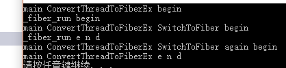
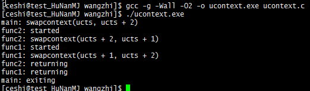
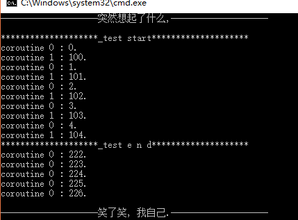

# 第3章-气功-原子锁线程协程

	    不妨仰望星海为编程行业尝试引入修真体系[ 炼气 -> 筑基 -> 金丹 -> 元婴 -> 化神 ]
	. 那时候在学校里或者野路子中锻炼并感应着天地间的元气, 在练气期幸福而不知睡眠. 感受着
	编程行业斑驳交割的元气, 最终选择几类元气开始自己的练气生涯. 期间勤奋些的或者时间够了, 
	一舒心中豪情啪一声进入筑基期. 心随意动, 修炼生涯正式展开. 蹭蹭的我们进入了门派中磨炼. 
	随着门派体系或者一些心有不甘的选手日夜操戈, 自我驱动跃升成为人魔大战的前线主力. 挥洒鲜
	血, 一朝凝华金丹成. 此时的战场才刚刚拉开序幕. 同样以前修炼遗留的隐患也一并爆发. 无数人
	在此厮杀, 对抗域外天魔. 此刻或者在远古战场中获得奇遇, 又或者占有一个门派的全力支持, 通
	过大毅力破吾金丹, 晋升元婴大佬. 隐射一方, 出手之间自带领域威势. 回顾也是白骨功成, 为门
	派马首是瞻. 唯独极个别生时天资聪慧, 道心自明的元婴大佬. 忘却红尘迷恋, 占一代之强气运, 
	耐一世之大孤独, 甩手间风云变幻, 天雷滚滚, 超脱物外, 万中无一化神巨擘独立无为之境, 位于
	东方. 无一丝情感遥望着心的远方, 立于缥缈峰 ~ 窥探浩瀚 ~
	    各位看官, 化神难道就是编程的极限吗? 然而一切才刚刚开始, 这里先不表. 本章讲的气功, 
	等同于金丹期修炼的法术. 打通和操作系统联系的基本关节. 专业程序或多或少依赖于平台, 不同
	平台的修炼会有所大不同. 本章就是在不同平台间练就一门气功, 剑元贯双江
    
## 3.1 原子锁

	    原子锁一个古老的话题, 在不主动放弃 CPU 情况下解决资源竞争问题. 在说原子锁之前需要
	科普些基本原子操作.


### 3.1.1 原子操作

    举个简单例子:

```C
volatile int i = 0;

// ++i 大致可以拆分为下面三步
//
// 1' 把 i 的值放入寄存器中
// 2' 把寄存器中的值加 1
// 3' 返回寄存器中值并设置给 i
++i;
```

    以上执行会导致一个问题, 如果两个线程同时执行到 1' 那么造成一个现象是 i 最终没有预期的
	大. 如何避免上面问题呢? 常见思路是互斥. 当然这里有更好路子, 利用编译器提供的原子操作. 
	本质利用 CPU 提供的原子指令的封装(CPU 提供总线锁定和缓存锁定保证复杂内存操作的原子性)
	. 说直接点, 可以用编译器提供这方面基础能力, 让我们实现原子相加. 例如 GCC 就提供不少像
	下面指令.  

```C
type __sync_add_and_fetch (type * ptr, type value, ...);
type __sync_lock_test_and_set (type * ptr, type value, ...);
bool __sync_bool_compare_and_swap (type * ptr, type oldval, type newval, ...);
```

    这类原子操作的特殊表达式可以直接边查编译手册, 边写个小例子, 就会知道窍门. 我们简单解
	释下, __sync_add_and_fetch 等同于将 ptr 指向的内存加上 value 值, 并且返回最终加好
	的值. __sync_lock_test_and_set 的意思是把 value 的值给 ptr 指向的内存, 并且返回 
	ptr 原先指向的内存值. __sync_bool_compare_and_swap 的意思是判断 ptr 指向的值和原
	先的 oldval 相等吗, 相等将其设置为 newval. 并且返回 ptr 指向值和 oldval 相等与否
	的 bool 值. 为了让大家更好认知, 不妨封装一层, 请收看注释:

```C
// v += a ; return v;
#define atom_add(v, a)      __sync_add_and_fetch(&(v), (a))
// type tmp = v ; v = a; return tmp;
#define atom_set(v, a)      __sync_lock_test_and_set(&(v), (a))
// bool b = v == c; b ? v=a : ; return b;
#define atom_cas(v, c, a)   __sync_bool_compare_and_swap(&(v), (c), (a))
```

    以上定义了 add set cas 原子操作. 随后原子基础库中会封装更多更常用的. 下面展示哈全
	貌. 更多细节可以细查 man 手册, 一切无所遁形.

### 3.1.2 原子锁封装

    代码已经表述了一切好的坏的有得没得, 如果还不明白, 说明字帖抄写少了 ~

```C
#ifndef _ATOM_H
#define _ATOM_H

#include "atomic.h"

//
// atom_t 自旋锁类型
// [static] atom_t o = 0;
//   atom_lock(o);
//  - One Man RPG
// atom_unlock(o);
//
typedef volatile long atom_t;

#ifdef __GNUC__

#define atom_trylock(o)     (!__sync_lock_test_and_set(&(o), 1))

#define atom_lock(o)        while(__sync_lock_test_and_set(&(o), 1))

#define atom_unlock(o)      __sync_lock_release(&(o))

// 内存屏障, 维持代码顺序
#define atom_sync()         __sync_synchronize()

// v += a ; return v;
#define atom_add(v, a)      __sync_add_and_fetch(&(v), (a))
// type tmp = v ; v = a; return tmp;
#define atom_set(v, a)      __sync_lock_test_and_set(&(v), (a))
// v &= a; return v;
#define atom_and(v, a)      __sync_and_and_fetch(&(v), (a))
// return ++v;
#define atom_inc(v)         __sync_add_and_fetch(&(v), 1)
// return --v;
#define atom_dec(v)         __sync_sub_and_fetch(&(v), 1)
// bool b = v == c; b ? v=a : ; return b;
#define atom_cas(v, c, a)   __sync_bool_compare_and_swap(&(v), (c), (a))

#endif

#ifdef _MSC_VER

#include <intrin.h>
#include <intrin0.h>

/* Interlocked intrinsic mapping for _nf/_acq/_rel */
#  if defined(_M_ARM) || defined(_M_ARM64)
#    define _ACQUIRE(x) ATOMIC_CONCAT(x, _acq)
#  else  /* defined(_M_ARM) || defined(_M_ARM64) */
#    define _ACQUIRE(x) x
#  endif /* defined(_M_ARM) || defined(_M_ARM64) */

#define atom_trylock(o)     (!_ACQUIRE(_interlockedbittestandset)(&(o), 0))

#define atom_lock(o)        while(_ACQUIRE(_interlockedbittestandset)(&(o), 0))

static inline void store_release(atom_t * x) {
    /* store _Value atomically with release memory order */
#  if defined(_M_ARM) || defined(_M_ARM64)
    __dmb(0xB /* _ARM_BARRIER_ISH or _ARM64_BARRIER_ISH*/);
    __iso_volatile_store32((volatile int *)x, 0);
#  else
    _ReadWriteBarrier();
    *x = 0;
#  endif
}

#define atom_unlock(o)      store_release(&(o))

// 保证代码优化后不乱序执行
#define atom_sync()         MemoryBarrier()

// v 和 a 都是 long 这样数据
#define atom_add(v, a)      InterlockedAdd((volatile LONG *)&(v), (LONG)(a))
#define atom_set(v, a)      InterlockedExchange((volatile LONG *)&(v), (LONG)(a))
#define atom_and(v, a)      (InterlockedAnd((volatile LONG *)&(v), (LONG)(a)), (LONG)(v))
#define atom_inc(v)         InterlockedIncrement((volatile LONG *)&(v))
#define atom_dec(v)         InterlockedDecrement((volatile LONG *)&(v))
//
// 对于 InterlockedCompareExchange(v, c, a) 等价于下面
// long tmp = v ; v == a ? v = c : ; return tmp;
//
// 咱们的 atom_cas(v, c, a) 等价于下面
// long tmp = v ; v == c ? v = a : ; return tmp;
//
#define atom_cas(v, c, a)   ((LONG)(c) == InterlockedCompareExchange((volatile LONG *)&(v), (LONG)(a), (LONG)(c)))

#endif

#endif//_ATOM_H
```

    这些代码很短, atom.h 希望抄写几遍, 保证有效果. 当然我们的原子锁主打 linux 平台. 也
	是当前开发届主旋律, winds 辅助开发, linux 在外实战. 使用起来也很容易. 例如在上一章
	写了个 tstr 字符串. 它不是线程安全的. 可以利用原子锁, 简单改成线程安全版本: 

```C
struct astr {
    atom_t lock;
    struct tstr str[1];
}

// 初始化
struct astr a = { 0 };

// 使用
atom_lock(a.lock);

// 各种对于 astr.str 操作都是线程安全的
// ...

atom_unlock(a.lock);

// 销毁
TSTR_DELETE(a.str);
```

    以上就是原子锁使用的核心步骤. 当然了, 装波的事情远远还没有结束. 很久以前别人问什么是
	自旋锁, 当时羞愧难当. 后面才知道就是写了无数遍的原子锁. 更多的是想说少炒作一些概念, 
	多一些真诚. 编程本身就那些东西, 讲明白后大家就很容易懂. 切记编程路上多真善美否则基本
	无望元婴. 当然高阶金丹期也都能够胜任主程了, 多数定型一生. 上面原子锁仍然可以优化, 例
	如采用忙等待和阻塞混合编程, 降低 CPU 空转, 等等优化. 总而言之在解决资源竞争问题上, 
	消耗最小是真无锁编程. 通过业务优化避免锁的产生. C 开发用系统互斥锁偏重, 这也是原子锁
	一直存在的原因, 并且处于上升势头.

### 3.1.3 原子操作封装

	不知道有木有人好奇 atomic.h 里是什么? 恭喜你新世界的大门已经被打开. 在讲解之前希望
	读者事先研究过 C11 stdatomic.h 原子操作. 而我们这里将会说明 stdatomic.h 中引入的
	六种不同 memory order 来控制同步的粒度, 以获得更好的程序性能. 这六种 order 分别是:

```C
/* 7.17.3 Order and consistency */
typedef enum memory_order {
  memory_order_relaxed = __ATOMIC_RELAXED,
  memory_order_consume = __ATOMIC_CONSUME,
  memory_order_acquire = __ATOMIC_ACQUIRE,
  memory_order_release = __ATOMIC_RELEASE,
  memory_order_acq_rel = __ATOMIC_ACQ_REL,
  memory_order_seq_cst = __ATOMIC_SEQ_CST
} memory_order;
```

memory_order_relaxed 宽松内存顺序 :

	六种不同 memory order 来控制同步的粒度, 以获得更好的程序性能. 这六种 order 分别是
    没有同步或顺序制约, 仅对此操作要求原子性. 带 memory_order_relaxed 标签的原子操作不
	考虑线程间同步操作, 其它线程可能读到新值, 也可能读到旧值. 只保证当前操作的原子性和修
	改顺序一致性. 例如:

```C
// atomic init
atomic_int x = 0, y = 0;

// 线程 1 操作
int a = atomic_load_explicit(&y, memory_order_relaxed); // A
atomic_store_explicit(&x, a, memory_order_relaxed);     // B

// 线程 2 操作
int b = atomic_load_explicit(&x, memory_order_relaxed); // C
atomic_store_explicit(&y, 28, memory_order_relaxed);    // D
```

	允许产生结果 a == 28 && b == 28. 因为即使线程 1 中 A 先序于 B 且线程 2 中 C 先序
	于 D, 但没法保证 y 的修改顺序中 D 比 A 先执行, x 的修改顺序中 B 比 C 先执行. 这就
	会导致 D 在 y 上的副效应, 可能可见于线程 1 中的加载 A, 同时 B 在 x 上的副效应，可
	能可见于线程 2 中的加载 C. 宽松内存顺序的典型应用场景是计数器自增. 例如引用计数器, 
	因为这只要求原子性保证自增 OK, 但不要求顺序或同步(注意计数器自减要求进行 
	memory_order_acquire 获取内存顺序同步)

memory_order_consume 消费内存顺序 :

	有此内存顺序的加载操作, 在其影响的内存位置进行消费操作: 当前线程中依赖于当前加载的
	该值的读或写不能被重排到此加载前. 其它释放同一原子变量的线程的对数据依赖变量的写入, 
	为当前线程所可见. 在大多数平台上, 这只影响到编译器优化. 例如线程 1 中的原子存储带标
	签 memory_order_release 而线程 2 中来自同一原子对象的加载带标签 
	memory_order_consume, 则线程 1 视角中依赖先序于原子存储的所有内存写入(非原子和宽松
	原子的), 会在线程 B 中加载操作所携带依赖进入的操作中变成可见副效应, 即一旦完成原子加
	载, 则保证线程 2 中, 使用从该加载获得的值的运算符和函数, 能见到线程 1 写入内存的内容
	. 同步仅在释放和消费同一原子对象的线程间建立. 其它线程能见到与被同步线程的一者或两者
	相异的内存访问顺序.

```C
// atomic init
int a = 0;
atomic_int x = 0;

// 线程 1 操作
a = 1;
// memory_order_release 释放内存顺序
// 后面所有与这块内存有关的读写操作都无法被重排到这个操作之前
atomic_store_explicit(&x, 1, memory_order_release);

// 线程 2 操作
while (atomic_load_explicit(&x, memory_order_consume) != 1) {
    if (a == 1) { // a 可能是 1 也可能是 0
        
    }
}
```

	更好理解的是下面这个例子, a 的值一定为 0. 但多数编译器没有跟踪依赖链, 均将消费内存顺
	序操作提升为 memory_order_acquire 获得内存顺序操作.

```C
atomic_int x = 0;

int a = atomic_load_explicit(&x, memory_order_consume);
// a 的值一定是 0, memory_order_consume 后面与这块内存的相关代码不会重排到它前面
x = 1;
```

memory_order_release 释放内存顺序 :

	有此内存顺序的存储操作进行释放操作: 当前线程中的读或写不能被重排到此存储后. 当前线程
	的所有写入, 可见于获得该同一原子变量的其它线程(获得内存顺序), 并且对该原子变量的带依
	赖写入变得对于其他消费同一原子对象的线程可见. 例如一些原子对象被存储-释放, 而有数个其
	它线程对该原子对象进行读修改写操作, 则会形成"释放序列": 所有对该原子对象读修改写的线
	程与首个线程同步, 而且彼此同步, 即使它们没有 memory_order_release 语义. 这使得单产
	出-多消费情况可行, 而无需在每个消费线程间强加不必要的同步. 同样 unlock 也全靠
	memory_order_release 释放内存顺序

memory_order_seq_cst 序列一致内存顺序 :

	有此内存顺序的加载操作进行获得操作, 存储操作进行释放操作, 而读修改写操作进行获得操作
	和释放操作, 再加上存在一个单独全序, 其中所有线程以同一顺序观测到所有修改. 如果是读取
	就是 acquire 语义, 如果是写入就是 release 语义, 如果是读取写入就是 acquire-release
	语义. 通常情况下编译器默认使用 memory_order_seq_cst. 在你不确定如何选取这些 memory 
	order, 可以直接用此内存顺序.

```C
/* 7.17.8 Atomic flag type and operations */
typedef struct atomic_flag { atomic_bool _Value; } atomic_flag;

#define atomic_flag_test_and_set(object) __c11_atomic_exchange(     \
	&(object)->_Value, 1, __ATOMIC_SEQ_CST)

#define atomic_flag_clear(object) __c11_atomic_store(               \
	&(object)->_Value, 0, __ATOMIC_SEQ_CST)
```

	但当 memory_order_acquire 及 memory_order_release 与 memory_order_seq_cst 混合
	使用时, 会产生诡异的结果. 对于 memory_order_seq_cst 需要了解的注意点: 
    1' memory_order_seq_cst 标签混合使用时, 程序的序列一致保证就会立即丧失
    2' memory_order_seq_cst 原子操作相对于同一线程所进行的其它原子操作可重排

	有了简单基础, 我们参照 C11 stdatomic.h 理念设计个跨平台的 atomic.h. 首先看 linux
	实现部分

```C
#if !defined(_ATOMIC$C11_H) && !defined(_MSC_VER)
#define _ATOMIC$C11_H

#include <stdbool.h>
#include <stdatomic.h>

#define GENERIC_ATOMIC(type, mark, /* unused */ size)               \
                                                                    \
typedef _Atomic(type) atomic_##mark##_t;                            \
                                                                    \
static inline type                                                  \
atomic_load_##mark(const atomic_##mark##_t * a, memory_order o) {   \
   /*                                                               \
    * A strict interpretation of the C standard prevents            \
    * atomic_load from taking a const argument, but it's            \
    * convenient for our purposes. This cast is a workaround.       \
    */                                                              \
    return atomic_load_explicit((atomic_##mark##_t *)a, o);         \
}                                                                   \
                                                                    \
static inline void                                                  \
atomic_store_##mark(atomic_##mark##_t * a, type v,                  \
                    memory_order o) {                               \
    atomic_store_explicit(a, v, o);                                 \
}                                                                   \
                                                                    \
static inline type                                                  \
atomic_exchange_##mark(atomic_##mark##_t * a, type v,               \
                       memory_order o) {                            \
    return atomic_exchange_explicit(a, v, o);                       \
}                                                                   \
                                                                    \
static inline bool                                                  \
atomic_compare_exchange_weak_##mark(atomic_##mark##_t * a,          \
                                    type * c, type v,               \
                                    memory_order o,                 \
                                    memory_order n) {               \
    return atomic_compare_exchange_weak_explicit(a, c, v, o, n);    \
}                                                                   \
                                                                    \
static inline bool                                                  \
atomic_compare_exchange_strong_##mark(atomic_##mark##_t * a,        \
                                      type * c, type v,             \
                                      memory_order o,               \
                                      memory_order n) {             \
    return atomic_compare_exchange_strong_explicit(a, c, v, o, n);  \
}

//
// Integral types have some special operations available that
// non-integral ones lack.
//
#define GENERIC_INT_ATOMIC(type, mark, /* unused */ size)           \
                                                                    \
GENERIC_ATOMIC(type, mark, size)                                    \
                                                                    \
static inline type                                                  \
atomic_fetch_add_##mark(atomic_##mark##_t * a, type v,              \
                        memory_order o) {                           \
    return atomic_fetch_add_explicit(a, v, o);                      \
}                                                                   \
                                                                    \
static inline type                                                  \
atomic_fetch_sub_##mark(atomic_##mark##_t * a, type v,              \
                        memory_order o) {                           \
    return atomic_fetch_sub_explicit(a, v, o);                      \
}                                                                   \
                                                                    \
static inline type                                                  \
atomic_fetch_and_##mark(atomic_##mark##_t * a, type v,              \
                        memory_order o) {                           \
    return atomic_fetch_and_explicit(a, v, o);                      \
}                                                                   \
                                                                    \
static inline type                                                  \
atomic_fetch_or_##mark(atomic_##mark##_t * a, type v,               \
                       memory_order o) {                            \
    return atomic_fetch_or_explicit(a, v, o);                       \
}                                                                   \
                                                                    \
static inline type                                                  \
atomic_fetch_xor_##mark(atomic_##mark##_t * a, type v,              \
                        memory_order o) {                           \
    return atomic_fetch_xor_explicit(a, v, o);                      \
}

#endif//_ATOMIC$C11_H
```

	上面基于支持 C11 标准实现且没有定义 __STDC_NO_ATOMICS__ 宏为1 的编译器, 而封装的原
	子操作宏模板. 分为两个部分. 第一部分是 GENERIC_ATOMIC 用于通用类型的原子操作宏模板. 
	第二部分是 GENERIC_INT_ATOMIC 用于整型类型的原子操作宏模板. 核心思路参照 jemalloc 
	源码而开发设计的. 扯一点, 要不是 winds cl 目前不支持 C11, 完全没有必要去设计这个库.
	真是谁弱势, 谁是爷. 来看下 winds cl 平台相关模板宏设计思路.

```C
#if !defined(_ATOMIC$CL_H) && defined(_MSC_VER)
#define _ATOMIC$CL_H

#include <stdbool.h>
#include <windows.h>

typedef enum memory_order {
    memory_order_relaxed,
    memory_order_consume,
    memory_order_acquire,
    memory_order_release,
    memory_order_acq_rel,
    memory_order_seq_cst,
} memory_order;

#define ATOMIC_VAR_INIT(...) {__VA_ARGS__}

static inline void atomic_thread_fence(memory_order o) {
    _ReadWriteBarrier();
#  if defined(_M_ARM) || defined(_M_ARM64)
    // ARM needs a barrier for everything but relaxed.
    if (o != memory_order_relaxed)
        MemoryBarrier();
#  elif defined(_M_IX86) || defined (_M_X64)
    // x86 needs a barrier only for seq_cst.
    if (o == memory_order_seq_cst)
        MemoryBarrier();
#  else
#    error "Don't know how to create atomics for this platform for cl."
#  endif
    _ReadWriteBarrier();
}

#define INTERLOCKED_SUFFIX_1 8
#define INTERLOCKED_SUFFIX_2 16
#define INTERLOCKED_SUFFIX_4
#define INTERLOCKED_SUFFIX_8 64

#define CONCAT(a, b)                 CONCAT_RAW(a, b)
#define CONCAT_RAW(a, b)             a##b

typedef char    atomic_size_1_t;
typedef short   atomic_size_2_t;
typedef long    atomic_size_4_t;
typedef __int64 atomic_size_8_t;

#define INTERLOCKED_TYPE(size)       atomic_size_##size##_t

#define INTERLOCKED_SUFFIX(size)     CONCAT(INTERLOCKED_SUFFIX_, size)

#define INTERLOCKED_NAME(name, size) CONCAT(name, INTERLOCKED_SUFFIX(size))

#define GENERIC_ATOMIC(type, mark, size)                            \
                                                                    \
typedef struct {                                                    \
    INTERLOCKED_TYPE(size) repr;                                    \
} atomic_##mark##_t;                                                \
                                                                    \
static inline type                                                  \
atomic_load_##mark(const atomic_##mark##_t * a, memory_order o) {   \
    INTERLOCKED_TYPE(size) ret = a->repr;                           \
    if (o != memory_order_relaxed)                                  \
        atomic_thread_fence(memory_order_acquire);                  \
    return (type)ret;                                               \
}                                                                   \
                                                                    \
static inline void                                                  \
atomic_store_##mark(atomic_##mark##_t * a, type v,                  \
                    memory_order o) {                               \
    if (o != memory_order_relaxed)                                  \
        atomic_thread_fence(memory_order_release);                  \
    a->repr = (INTERLOCKED_TYPE(size))v;                            \
    if (o == memory_order_seq_cst)                                  \
        atomic_thread_fence(memory_order_seq_cst);                  \
}                                                                   \
                                                                    \
static inline type                                                  \
atomic_exchange_##mark(atomic_##mark##_t * a, type v,               \
                       memory_order o) {                            \
    return (type)INTERLOCKED_NAME(_InterlockedExchange, size)(      \
                &a->repr, (INTERLOCKED_TYPE(size))v                 \
           );                                                       \
}                                                                   \
                                                                    \
static inline bool                                                  \
atomic_compare_exchange_weak_##mark(atomic_##mark##_t * a,          \
                                    type * c, type v,               \
                                    memory_order o,                 \
                                    memory_order n) {               \
    INTERLOCKED_TYPE(size) d = (INTERLOCKED_TYPE(size))v;           \
    INTERLOCKED_TYPE(size) e = (INTERLOCKED_TYPE(size))*c;          \
    INTERLOCKED_TYPE(size) old =                                    \
        INTERLOCKED_NAME(_InterlockedCompareExchange, size)(        \
            &a->repr, d, e                                          \
        );                                                          \
    if (e != old) {                                                 \
        *c = (type)old;                                             \
        return false;                                               \
    }                                                               \
    return true;                                                    \
}                                                                   \
                                                                    \
static inline bool                                                  \
atomic_compare_exchange_strong_##mark(atomic_##mark##_t * a,        \
                                      type * c, type v,             \
                                      memory_order o,               \
                                      memory_order n) {             \
    /* We implement the weak version with strong semantics. */      \
    return atomic_compare_exchange_weak_##mark(a, c, v, o, n);      \
}

#define GENERIC_INT_ATOMIC(type, mark, size)                        \
                                                                    \
GENERIC_ATOMIC(type, mark, size)                                    \
                                                                    \
static inline type                                                  \
atomic_fetch_add_##mark(atomic_##mark##_t * a, type v,              \
                        memory_order o) {                           \
    return (type)INTERLOCKED_NAME(_InterlockedExchangeAdd, size)(   \
                &a->repr, (INTERLOCKED_TYPE(size))v                 \
           );                                                       \
}                                                                   \
                                                                    \
static inline type                                                  \
atomic_fetch_sub_##mark(atomic_##mark##_t * a, type v,              \
                        memory_order o) {                           \
    /*                                                              \
     * MSVC warns on negation of unsigned operands, but for us it   \
     * gives exactly the right semantics (MAX_TYPE + 1 - operand).  \
     */                                                             \
    __pragma(warning(push))                                         \
    __pragma(warning(disable: 4146))                                \
    return atomic_fetch_add_##mark(a, -v, o);                       \
    __pragma(warning(pop))                                          \
}                                                                   \
                                                                    \
static inline type                                                  \
atomic_fetch_and_##mark(atomic_##mark##_t * a, type v,              \
                        memory_order o) {                           \
    return (type)INTERLOCKED_NAME(_InterlockedAnd, size)(           \
                &a->repr, (INTERLOCKED_TYPE(size))v                 \
           );                                                       \
}                                                                   \
                                                                    \
static inline type                                                  \
atomic_fetch_or_##mark(atomic_##mark##_t * a, type v,               \
                       memory_order o) {                            \
    return (type)INTERLOCKED_NAME(_InterlockedOr, size)(            \
                &a->repr, (INTERLOCKED_TYPE(size))v                 \
           );                                                       \
}                                                                   \
                                                                    \
static inline type                                                  \
atomic_fetch_xor_##mark(atomic_##mark##_t * a, type v,              \
                        memory_order o) {                           \
    return (type)INTERLOCKED_NAME(_InterlockedXor, size)(           \
                &a->repr, (INTERLOCKED_TYPE(size))v                 \
           );                                                       \
}

#endif//_ATOMIC$CL_H
```

	这里有个巧妙地方在于 INTERLOCKED_TYPE 和 INTERLOCKED_NAME 宏的设计, 看下面我的摘取
	部分源码, 你应该会恍然大悟. 仙师说的是 ~

```C
typedef char                  atomic_size_1_t;
typedef short                 atomic_size_2_t;
typedef long                  atomic_size_4_t;
typedef __int64               atomic_size_8_t;

#define InterlockedExchange8  _InterlockedExchange8
#define InterlockedExchange16 _InterlockedExchange16
#define InterlockedExchange   _InterlockedExchange
#define InterlockedExchange64 _InterlockedExchange64
```

	有了 atomic$c11.h 和 atomic$cl.h 我们开始就着手封装 atomic.h. 仔细看其中的注释部分. 
	它就是这个库的使用 help. 此刻原子操作的封装有了结果了. 后面有兴趣的道友可以练习哈 C 宏
	模板的技巧. 这个越级挑战杀手锏, 高性能库中总会有它的身影. 我们保持观望 ~

```C
#ifndef _ATOMIC_H
#define _ATOMIC_H

#include <stddef.h>
#include <stdint.h>

#include "atomic$cl.h"
#include "atomic$c11.h"

/*
 * This header gives more or less a backport of C11 atomics. The user
 * can write GENERIC_ATOMIC(type, tail, size) to generate
 * counterparts of the C11 atomic functions for type, as so:
 *   GENERIC_ATOMIC(int *, pi, PTR_SIZEOF)
 * and then write things like:
 *   atomic_pi_t ptr;
 *   int * some = NULL;
 *   atomic_store_pi(&ptr, some, memory_order_relaxed);
 *   int * prev = atomic_exchange_pi(&ptr, NULL, memory_order_acq_rel);
 *   assert(some == prev);
 * and expect things to work in the obvious way.
 *
 * Also included (with naming differences to avoid conflicts with the
 * standard library):
 *   mimics C11's ATOMIC_VAR_INIT
 *   mimics C11's atomic_thread_fence(memory_order)
 */

// sys/types.h constructor
#ifndef __ssize_t_defined
typedef ptrdiff_t ssize_t;
#endif

#ifndef PTR_SIZEOF
#  if defined(_M_X64) || defined(__x86_64__) || defined(_M_ARM64)
#    define PTR_SIZEOF 8
#  else
#    define PTR_SIZEOF 4
#  endif
#endif

GENERIC_ATOMIC(bool, b, 1)

GENERIC_INT_ATOMIC(unsigned, u, 4)

GENERIC_INT_ATOMIC(uint32_t, u32, 4)

GENERIC_ATOMIC(void *, p, PTR_SIZEOF)

/*
 * Not all platforms have 64-bit atomics. If we do, this #define
 * exposes that fact.
 */
#if (PTR_SIZEOF == 8)
GENERIC_INT_ATOMIC(uint64_t, u64, 8)
#endif

GENERIC_INT_ATOMIC(size_t, zu, PTR_SIZEOF)

GENERIC_INT_ATOMIC(ssize_t, zd, PTR_SIZEOF)

#endif//_ATOMIC_H
```

## 3.2 POSIX 线程库

    	对于 POSIX 标准线程库, 也就是我们常在 Linux 使用 pthread 线程库. 首先为其罗列些
	常用的 API 提纲. 先看 PThread Attribute Functions 系列

```C
//
// pthread_attr_init    - 初始化线程环境
// pthread_attr_destroy - 销毁线程环境
// attr		: pthread_attr_t 线程环境
// return	: 0 标识成功, -1 标识失败
//
extern int __cdecl pthread_attr_init (pthread_attr_t * attr);
extern int __cdecl pthread_attr_destroy (pthread_attr_t * attr);

//
// pthread_attr_setdetachstate - 设置线程的运行结束后的分离属性
// attr		:pthread_attr_t 线程环境
// state	: 默认 PTHREAD_CREATE_JOINABLE, 需要 pthread_join 销毁遗留的线程空间.
// 			: PTHREAD_CREATE_DETACHED 属性等同于 pthread_detach, 结束即销毁
// return	: 0 表示成功
//
extern int __cdecl pthread_attr_setdetachstate (pthread_attr_t * attr, int state);
```

    有了线程环境相关操作, 再来看看线程构建的相关操作 PThread Functions

```C
//
// pthread_create - 创建一个线程, 并自启动实体运行
// tid			: 返回创建线程的句柄 pthread_t 类型变量
// attr			: 线程创建初始化的量, pthread_attr_xxxx 系列设置
// start		: 线程创建成功后运行的实体
// arg			: start 运行时需要的额外参数
// return		: 返回 0 表示成功, -1 表示失败 并会设置 errno
//
extern int __cdecl pthread_create (pthread_t * tid,
                                   const pthread_attr_t * attr,
                                   void * (__cdecl * start) (void *),
                                   void * arg);

//
// pthread_equal - 两个线程 id 比较
// t1			: 线程 id
// t2			: 线程 id
// return		: 1 表示二者相同, 0 表示二者不同
//
extern int __cdecl pthread_equal (pthread_t t1, pthread_t t2);

//
// pthread_exit - 退出当前线程
// value_ptr    : 会保存在线程的私有变量中, 留给 pthread_join 得到
// return       : void
//
extern void __cdecl pthread_exit (void * value_ptr);

//
// pthread_join - 等待线程 pthread_create -> start 函数运行结束
// thread       : 线程 id
// value_ptr    : 返回 start 返回值, 或 pthread_exit 设置的值
// return       : 0 表示成功, -1 标识失败
//
extern int __cdecl pthread_join (pthread_t thread, void ** value_ptr);
```

    线程互斥量, 基本和 pthread_create 使用频率差不多. 加上手工注释希望大家能够感性认知,
	Mutex Attribute Functions 相关操作. 前面一致忘记说了, 展示过很多系统层的源码实现, 
	但我们假定这些实现就应该这样, 因为它会因时而异.

```C
#define PTHREAD_MUTEX_INITIALIZER ((pthread_mutex_t)(size_t) -1)

// pthread_mutex_init    - 初始化线程互斥量
// pthread_mutex_destroy - 销毁线程互斥量, 必须和 pthread_mutex_init 成对
extern int __cdecl pthread_mutex_init (pthread_mutex_t * mutex, 
                                       const pthread_mutexattr_t * attr);
extern int __cdecl pthread_mutex_destroy (pthread_mutex_t * mutex);

// pthread_mutex_lock   - 加锁
// pthread_mutex_unlock - 解锁
extern int __cdecl pthread_mutex_lock (pthread_mutex_t * mutex);
extern int __cdecl pthread_mutex_unlock (pthread_mutex_t * mutex);
```

	上面 PTHREAD_MUTEX_INITIALIZER 初始化的互斥量, 不需要调用 pthread_mutex_destroy 默
	认跟随系统生命周期. 对于 POSIX 线程, 假如调用了 pthread_xxx_init 那么最终最好都需要调
	用 pthread_xxx_destroy. 对于 pthread 我们包装一下

```C
#ifndef _THREAD_H
#define _THREAD_H

#include "struct.h"
#include <pthread.h>
#include <semaphore.h>

//
// pthread_end - 等待线程运行结束
// tid      : 线程 id
// return   : void
//
inline void pthread_end(pthread_t id) {
    pthread_join(id, NULL);
}

//
// pthread_run - 启动线程
// id       : 线程 id
// frun     : 运行主体
// arg      : 运行参数
// return   : return 0 is success
//
#define pthread_run(id, frun, arg)                                  \
pthread_run_(&(id), (node_f)(frun), (void *)(intptr_t)(arg))
inline int pthread_run_(pthread_t * pi, node_f frun, void * arg) {
    return pthread_create(pi, NULL, (start_f)frun, arg);
}

//
// pthread_async - 启动无需等待的线程
// frun     : 运行的主体
// arg      : 运行参数
// return   : return 0 is success
// 
#define pthread_async(frun, arg)                                    \
pthread_async_((node_f)(frun), (void *)(intptr_t)(arg))
inline int pthread_async_(node_f frun, void * arg) {
    pthread_t id;
    pthread_attr_t attr;
    pthread_attr_init(&attr);
    pthread_attr_setdetachstate(&attr, PTHREAD_CREATE_DETACHED);
    int ret = pthread_create(&id, &attr, (start_f)frun, arg);
    pthread_attr_destroy(&attr);
    return ret;
}

#endif//_THREAD_H
```

	后续可以通过 pthread_async 来启动设置好分离属性的线程. 你是否想过 winds 上使用 POSIX
	pthread 线程库, 是不是想想就很爽. github 上 GerHobbelt 大神的 pthread-win32 项目, 
	让我们梦想成真. 或者关注作者 github 上面 pthread static lib 的水经验的项目. 从此以后
	, 你要的一切 pthread 都会给你! 为保护所爱的人去战斗 <*-*>    

#### 3.2.1 pthread 练手

    运用搭建好的 pthread 模块, 写个 Demo 练练手. 使用了 pthread 读写锁相关操作. 纯属熟悉
	api 而构造的示例.

```C
#include "thread.h"

#define TH_INT    (6)

struct rwarg {
    pthread_t id;
    pthread_rwlock_t lock;    // 读写锁
    char buf[BUFSIZ];         // 存储数据
    int idx;                  // buf 索引
};

// write - 写线程, 随机写字符
void write(struct rwarg * arg);
// reads - 读线程
void reads(struct rwarg * arg);

/*
 * 主函数测试线程读写逻辑
 * 少量写线程, 大量读线程测试
 */
int main(int argc, char * argv[]) {
    // 初始化 rwarg::rwlock
    struct rwarg arg = { .lock = PTHREAD_RWLOCK_INITIALIZER, };

    // 读写线程跑起来
    for (int i = 0; i < TH_INT; ++i) {
        pthread_async(reads, &arg);
        pthread_async(write, &arg);
        pthread_async(reads, &arg);
    }

    // 简单等待一下
    puts("sleep input enter:");
    return getchar();
}

// write - 写线程, 随机写字符
void 
write(struct rwarg * arg) {
    pthread_rwlock_wrlock(&arg->lock);
    arg->buf[arg->idx] = 'a' + arg->idx;
    ++arg->idx;
    printf("write idx[%-2d], buf[%-9s]\n", arg->idx, arg->buf);
    pthread_rwlock_unlock(&arg->lock);
}

// reads - 读线程
void 
reads(struct rwarg * arg) {
    pthread_rwlock_rdlock(&arg->lock);
    printf("reads idx[%2d], buf[%9s]\n", arg->idx, arg->buf);
    pthread_rwlock_unlock(&arg->lock);
}
```

    可以说手握 pthread 神器不知道写个啥, 随便写了上面点. 关于 pthrad rwlock 相关存在一个
	隐患就是 pthread_rwlock_unlock 这个 api 时不区分读解锁, 还是写解锁. 这就导致一个问题
	大量写操作存在时候, 会极大降低写加锁机会的期望. 导致写操作饥渴. 后面会带大家手写个读写
	锁, 用于感受一下那些远古时期那些妖魔大能弥留在天地之间, 万仞无边的气息 ~ . 关于 POSIX
	线程库 pthread 就到这里了. 看看头文件, 查查手册, 再不济看看源码一切仍然是那么自然.

### 3.3 读写锁

    pthread 已经提供了读写锁, 为什么还要没事瞎搞呢. 其实这个问题好理解. 1' 要剖析一下基
	本原理; 2' 它有点重, 不如用原子锁构造一个. 3' pthread 读写锁存在写竞争不过读的隐患.
    特别是3', 不妨把上面代码刷到演武场上演示演示. 会发现打印了大量空白, 说白了就是写锁被
	大量读锁阻塞了. (问题很严重) 

    下面对读写锁进行详细分析. 首先看下面有用的套话

	读写锁 是为了 解决, 大量 ''读'' 和 少量 ''写'' 的业务而设计的.  

	读写锁有3个特征:

	1'. 当读写锁是写加锁状态时，
	    在这个锁被解锁之前，所有试图对这个锁加锁的线程都会被阻塞

	2'. 当读写锁在读加锁状态时，
	    再以读模式对它加锁的线程都能得到访问权，但以写模式加锁的线程将会被阻塞

	3'. 当读写锁在读加锁状态时，
	    如果有线程试图以写模式加锁，读写锁通常会阻塞随后的读模式加锁

    从上面表述可以看出, pthread的线程库对于第三个特征没有完成. 默认还是平等竞争. 
	3' 默认写锁优先级高于读锁, 对其有遏制效果. 

#### 3.3.1 读写锁设计 interface

    通过上面3大特征和已经构建好的 scatom.h原子操作接口, 不妨设计如下读写锁接口 
	
scrwlock.h

```C
#ifndef _H_SIMPLEC_SCRWLOCK
#define _H_SIMPLEC_SCRWLOCK

#include "scatom.h"

/*
 * create simple write and read lock
 * struct rwlock need zero.
 * is scatom ext
 */

// init need all is 0
struct rwlock {
	int rlock;
	int wlock;
};

// add read lock
extern void rwlock_rlock(struct rwlock * lock);
// add write lock
extern void rwlock_wlock(struct rwlock * lock);

// add write lock
extern void rwlock_unrlock(struct rwlock * lock);
// unlock write
extern void rwlock_unwlock(struct rwlock * lock);

#endif // !_H_SIMPLEC_SCRWLOCK
```

    通过 scrwlock.h可以看出来这里读写锁是分别加锁和解锁的. pthread 线程库只走一个
    pthread_rwlock_unlock 这就是为啥读锁压制写锁的原因了, 因为它不做区分. 同等对待.
	当大量读锁出现的时候自然遏制写锁 (其实是策略问题, 没有高低)
    上面接口使用方法也灰常简单, 举例如下:

```C
struct rwarg {
    pthread_t id;
    struct rwlock rwlock;       // 加锁用的
    int idx;                    // 指示buf中写到那了
    char buf[BUFSIZ];           // 存储临时数据
};

// 初始化
struct rwarg arg = { 0 };

// 写线程, 主要随机写字符进去
...
    rwlock_wlock(&arg->rwlock);
    while(arg->idx < _INT_BZ) {
        arg->buf[arg->idx] = 'a' + arg->idx;
        ++arg->idx;
    }
    rwlock_unwlock(&arg->rwlock);
...

// 读线程
...
    while(arg->idx < _INT_BZ) {
        rwlock_rlock(&arg->rwlock);
        puts(arg->buf);
        rwlock_unrlock(&arg->rwlock);
    }
...
```

    本质就是两把交叉的锁模拟出一把读写锁. 来来回回, 虚虚实实, 随意潇洒~

#### 3.3.2 读写锁实现 implement

    这里展示的是详细的设计部分. 按照上面3个基准特征开始 write code, 首先看读加锁

```C
// add read lock
void 
rwlock_rlock(struct rwlock * lock) {
	for (;;) {
		// 看是否有人在试图读, 得到并防止代码位置优化
		while (lock->wlock)
			ATOM_SYNC();

		ATOM_INC(lock->rlock);
		// 没有写占用, 开始读了
		if (!lock->wlock)
			break;

		// 还是有写, 删掉添加的读
		ATOM_DEC(lock->rlock);
	}
}
```

    while (lock->wlock) ... 表示读锁为写锁让道. 随后得到资源后读锁获取资源开始引用加1. 
    再看看读解锁的实现:

```C
// unlock read lock
inline void 
rwlock_unrlock(struct rwlock * lock) {
	ATOM_DEC(lock->rlock);
}
```

    读解锁只是将读的锁值引用减1. 方便写加锁的时候判断是否有有人读. 再看看写加锁和解锁

```C
// add write lock
void 
rwlock_wlock(struct rwlock * lock) {
	ATOM_LOCK(lock->wlock);
	// 等待读占用锁
	while (lock->rlock)
		ATOM_SYNC();
}

// unlock write lock
inline void 
rwlock_unwlock(struct rwlock * lock) {
	ATOM_UNLOCK(lock->wlock);
}
```

    到这~关于读写锁的炫迈已经嚼完了. 读写锁使用常见, 能够想到就是网络IO中读写分离.
	很酷炫, 但不推荐, 因为(恐龙强大吗, 强大, 但是灭绝了) 它不是必须的~
    
### 3.4 设计协程库

    以上我们搞定了原子锁, 读写锁, POSIX 线程. 忘记说了有本很古老的 POSIX线程程序设计
    一本书很不错. 如果做专业的多线程开发那本书是必须的. 服务器开发行业最难的无外乎就是
	多线程和网络这两个方面了. 继续聊回来协程火起来的缘由(主要是我入行慢) 还是被 Lua 
	的 coroutine.create (f) 带起来. 这里将从系统层面分析协程库的实现细节. 

#### 3.4.1 协程库引言

    上层语言中协程比较常见. 例如C# 中 yield retrun, lua 中 coroutine.yield 等构建同步
	并发的程序. 本文是探讨如何从底层实现开发级别的协程库. 在说协程之前, 顺带温故一下进程和
	线程关系. 进程拥有一个完整的虚拟地址空间，不依赖于线程而独立存在. 线程是进程的一部分，
	没有自己的地址空间，与进程内的其他线程一起共享分配给该进程的所有资源. 进程和线程是1对
	多关系, 协程同线程关系也是类似. 一个线程中可以有多个协程. 协程同线程相比区别再于, 线程
	是操作系统控制调度(异步并发), 而线程是程序自身控制调度(同步串行). 
	简单总结协程特性如下:

　　  1. 相比线程具有更优的性能(假定, 程序写的没有明显失误) , 省略了操作系统的切换操作

　　  2. 相比线程占用更少的内存空间, 线程是操作系统对象很耗资源, 协程是用户态资源.

　　  3. 对比线程开发, 逻辑结构更复杂, 需要开发人员了解程序运行走向.

    举个例子 数码宝贝例子 : 滚球兽 ->  亚古兽－>  暴龙兽－>  机械暴龙兽 －> 战斗暴龙兽


    '类比协程进化史' if .. else / switch -> goto -> setjmp / logjump -> coroutine -<
    协程开发是串行程序开发中构建异步效果的开发模型.

#### 3.4.2 协程库储备, winds 部分

    在 winds 有一种另一个东西叫做纤程 fiber.  官方说明是"Microsoft公司给Windows添加了一
	种纤程，以便能够非常容易地将现有的UNIX服务器应用程序移植到Windows中". 这就是纤程概念的
	由来. 在这里会详细解释其中关于 winds fiber常用 api. 
	先浏览关于当前线程开启纤程相关接口说明.

```C
//
// Fiber creation flags
//
#define FIBER_FLAG_FLOAT_SWITCH 0x1     // context switch floating point

/*
 * VS编译器特性约定
 * 1. 其参数都是从右向左通过堆栈传递的
 * 2. 函数调用在返回前要由被调用者清理堆栈(被调用函数弹出的时候销毁堆栈)
 */
#define WINAPI      __stdcall

/*
 * 将当前线程转成纤程, 返回转换成功的主纤程对象域
 * lpParameter    : 转换的时候传入到主线程中用户数据
 * dwFlags        : 附加参数, 默认填写 FIBER_FLAG_FLOAT_SWITCH
 *                : 返回转换成功后的主纤程对象域
 */
WINBASEAPI __out_opt LPVOID WINAPI ConvertThreadToFiberEx(
    __in_opt LPVOID lpParameter,
    __in DWORD dwFlags
);

// 得到当前纤程中用户传入的数据, 就是上面 lpParameter
__inline PVOID GetFiberData(void)    { return *(PVOID *) (ULONG_PTR) __readfsdword (0x10); }

// 得到当前运行纤程对象
__inline PVOID GetCurrentFiber(void) { return (PVOID) (ULONG_PTR) __readfsdword (0x10); }
                                                          
/*
 * 将当前纤程转换成线程, 对映ConvertThreadToFiberEx操作系列函数. 返回原始环境
 *                : 返回成功状态, TRUE标识成功
 */
WINBASEAPI BOOL WINAPI ConvertFiberToThread(VOID);
```

    下面是关于如何创建纤程并切换(启动)官方接口说明.

```C
// 标识纤程执行体的注册函数声明, lpFiberParameter 可以通过 GetFiberData 得到
typedef VOID (WINAPI * PFIBER_START_ROUTINE)(LPVOID lpFiberParameter);
typedef PFIBER_START_ROUTINE LPFIBER_START_ROUTINE;

/*
 * 创建一个没有启动纤程对象并返回
 * dwStackCommitSize    : 当前纤程栈大小, 0标识默认大小
 * dwStackReserveSize   : 当前纤程初始化化保留大小, 0标识默认大小
 * dwFlags              : 纤程创建状态, 默认FIBER_FLAG_FLOAT_SWITCH, 支持浮点数操作
 * lpStartAddress       : 指定纤程运行的载体.等同于纤程执行需要指明执行函数
 * lpParameter          : 纤程执行的时候, 传入的用户数据, 在纤程中GetFiberData可以得到
 *                      : 返回创建好的纤程对象 
 */                                              
WINBASEAPI __out_opt LPVOID WINAPI CreateFiberEx(
    __in     SIZE_T dwStackCommitSize,
    __in     SIZE_T dwStackReserveSize,
    __in     DWORD dwFlags,
    __in     LPFIBER_START_ROUTINE lpStartAddress,
    __in_opt LPVOID lpParameter
);

// 销毁一个申请的纤程资源和CreateFiberEx成对出现
WINBASEAPI VOID WINAPI DeleteFiber(__in LPVOID lpFiber);

// 纤程跳转, 跳转到lpFiber指定的纤程
WINBASEAPI VOID WINAPI SwitchToFiber(__in LPVOID lpFiber);
```

    通过上面解释过的 api 写一个基础的演示 demo , fiber.c. 实践能补充猜想:

```C
#include <stdio.h>
#include <windows.h>

static void WINAPI _fiber_run(LPVOID fiber) {
	puts("_fiber_run begin");
	// 切换到主纤程中
	SwitchToFiber(fiber);
	puts("_fiber_run e n d");

	// 主动切换到主纤程中, 子纤程不会主动切换到主纤程
	SwitchToFiber(fiber);
}

//
// winds fiber hello world
//
int main(int argc, char * argv[]) {
	PVOID fiber, fiberc;
	// A pointer to a variable that is passed to the fiber. 
	// The fiber can retrieve this data by using the GetFiberData macro.
    fiber = ConvertThreadToFiberEx(NULL, FIBER_FLAG_FLOAT_SWITCH);
	// 创建普通纤程, 当前还是在主纤程中
	fiberc = CreateFiberEx(0, 0, FIBER_FLAG_FLOAT_SWITCH, _fiber_run, fiber);
	puts("main ConvertThreadToFiberEx begin");

	SwitchToFiber(fiberc);
	puts("main ConvertThreadToFiberEx SwitchToFiber begin");
	
	SwitchToFiber(fiberc);
	puts("main ConvertThreadToFiberEx SwitchToFiber again begin");

	DeleteFiber(fiberc);
	ConvertFiberToThread();
	puts("main ConvertThreadToFiberEx e n d");
	return EXIT_SUCCESS;
}
```

    总结起来运用纤程的步骤无外乎如下, 以两个纤程举例:
        1、使用ConverThreadToFiber(Ex)将当前线程转换到纤程，这是纤程F1
        2、定义一个纤程函数，用于创建一个新纤程
        3、纤程F1中调用CreateFiber(Ex)函数创建一个新的纤程F2
        4、SwitchToFiber函数进行纤程切换，让新创建的纤程F2执行
        5、F2纤程函数执行完毕的时候，使用SwitchToFiber转换到F1
        6、在纤程F1中调用DeleteFiber来删除纤程F2
        7、纤程F1中调用ConverFiberToThread，转换为线程
        8、线程结束

    上面的测试代码执行最终结果如下, 更加详细的, 呵呵只能靠自己, winds 深入资料不多



    winds fiber 储备部分画上句号了. 现在市场上 winds高级工程师很少了, 因为功法少, 
	太邪乎了. 吃亏不讨好~ (从买的书籍上看抛开老美, 韩国棒子对 winds研究的比较深入)

#### 3.4.3 协程储备, linux 部分

    winds 纤程出现的本源自于 unix. 而一脉而下的 linux也有这类机制. 自己称之为上下
	文 ucp 对象, 上下文记录跳转机制. 翻译了些高频率用的 api 手册如下:

```C
#include <ucontext.h>

/*
 * 得到当前程序运行此处上下文信息
 * ucp        : 返回当前程序上下文并保存在ucp指向的内存中
 *            : -1标识失败, 0标识成功
 */
int getcontext(ucontext_t * ucp);

/*
 * 设置到执行程序上下文对象中. 
 * ucp        : 准备跳转的上下文对象
 *            : 失败返回-1. 成功不返回
 */
int setcontext(const ucontext_t * ucp);

/*
 * 重新设置ucp上下文. 
 * ucp      : 待设置的上下文对象
 * func     : 新上下文执行函数体, 其实gcc认为声明是void * func(void)
 * argc     : func 函数参数个数
 * ...      : 传入func中的可变参数, 默认都是 int类型
 */
void makecontext(ucontext_t * ucp, void (* func)(), int argc, ...);

/*
 * 保存当前上下文对象 oucp, 并且跳转到执行上下文件对象 ucp 中
 * oucp       : 保存当前上下文对象
 * ucp        : 执行的上下文对象
 *            : 失败返回-1, 成功不返回
 */
int swapcontext (ucontext_t * ucp, ucontext_t * ucp);
```

    相比 winds fiber确实很清爽. 扩充一下 ucontext_t 一种实现结构

```C
/* Userlevel context.  */
typedef struct ucontext {
     unsigned long int uc_flags;
     struct ucontext * uc_link;                // 下一个执行的序列, NULL不继续执行了
     stack_t uc_stack;                         // 当前上下文, 堆栈信息
     mcontext_t uc_mcontext;
     __sigset_t uc_sigmask;
    struct _libc_fpstate __fpregs_mem;
} ucontext_t;

/* Alternate, preferred interface.  */
typedef struct sigaltstack {
    void * ss_sp;                             // 指向当前堆栈信息首地址
    int ss_flags;
    size_t ss_size;                           // 当前堆栈大小
} stack_t;
```

    上面加了中文注释的部分, 就是我们开发中需要用到的几个字段. 设置执行顺序, 指定当前上下文
    堆栈信息. 有了这些知识, 我们在 linux上练练手, 演示一下结果:

```C
#include <stdio.h>
#include <stddef.h>
#include <stdint.h>
#include <stdlib.h>
#include <ucontext.h>

#define PERROR_EXIT(msg) \
    do { perror(msg); exit(EXIT_FAILURE); } while (0)

static void _func1(uint32_t low32, uint32_t hig32) {
    // 得到所传入的指针类型
    uintptr_t ptr = (uintptr_t)low32 | ((uintptr_t)hig32 << 32);
    ucontext_t * ucts = (ucontext_t *)ptr;

    // 开始操作
    puts("func1: started");
    puts("func1: swapcontext(ucts + 1, ucts + 2)");
    if (swapcontext(ucts + 1, ucts + 2) < 0)
        PERROR_EXIT("swapcontext");
    puts("func1: returning");
}

static void _func2(uint32_t low32, uint32_t hig32) {
    uintptr_t ptr = (uintptr_t)low32 | ((uintptr_t)hig32 << 32);
    ucontext_t * ucts = (ucontext_t *)ptr;

    puts("func2: started");
    puts("func2: swapcontext(ucts + 2, ucts + 1)");
    if (swapcontext(ucts + 2, ucts + 1) < 0)
        PERROR_EXIT("swapcontext");
    puts("func2: returning");
}

//
// use ucontext hello world
//
int main(int argc, char * argv[]) {
    ucontext_t ucts[3];
    char stack1[16384];
    char stack2[16384];
    uintptr_t ptr = (uintptr_t)ucts;
    uint32_t low32 = (uint32_t)ptr;
    uint32_t hig32 = (uint32_t)(ptr >> 32);

    if (getcontext(ucts + 1) < 0)
        PERROR_EXIT("getcontext");
    ucts[1].uc_stack.ss_sp = stack1;
    ucts[1].uc_stack.ss_size = sizeof stack1;
    // ucts[1] -> ucts[0]
    ucts[1].uc_link = ucts;
    makecontext(ucts + 1, (void (*)())_func1, 2, low32, hig32);

    // 开始第二个搞
    if (getcontext(ucts + 2) < 0)
        PERROR_EXIT("getcontext");
    ucts[2].uc_stack.ss_sp = stack2;
    ucts[2].uc_stack.ss_size = sizeof stack2;
    // ucts[2] -> ucts[1]
    ucts[2].uc_link = ucts + 1;
    makecontext(ucts + 2, (void (*)())_func2, 2, low32, hig32);

    puts("main: swapcontext(ucts, ucts + 2)");
    if (swapcontext(ucts, ucts + 2) < 0)
        PERROR_EXIT("swapcontext");

    puts("main: exiting");
    return EXIT_SUCCESS;
}
```

    linux 接口很自然, 执行流程很清晰. (上面也可以深入封装, 去掉重复过程) 最终结果如下



    很多时候我们写代码, 或者说在模仿代码的时候. 花点心思 也许 就是突破.

#### 3.4.4 一切就绪, 那就开始协程设计吧

    关于协程的设计主要围绕打开关闭创建切换阻塞几个操作

```C
#ifndef _H_SIMPLEC_SCOROUTINE
#define _H_SIMPLEC_SCOROUTINE

#define SCO_DEAD		(0)		// 协程死亡状态
#define SCO_READY		(1)		// 协程已经就绪
#define SCO_RUNNING		(2)		// 协程正在运行
#define SCO_SUSPEND		(3)		// 协程暂停等待

// 协程管理器
typedef struct scomng * scomng_t;

//
// 注册的协程体
// sco		: 创建开启的协程总对象
// arg		: 用户创建协程的时候传入的参数
//
typedef void (* sco_f)(scomng_t sco, void * arg);

//
// sco_open - 开启协程系统函数, 并返回创建的协程管理器
// return	: 返回创建的协程对象
//
extern scomng_t sco_open(void);

//
// sco_close - 关闭已经开启的协程系统函数
// sco		: sco_oepn 返回的当前协程中协程管理器
//
extern void sco_close(scomng_t sco);

//
// sco_create - 创建一个协程, 此刻是就绪态
// sco		: 协程管理器
// func		: 协程体执行的函数体
// arg		: 协程体中传入的参数
// return	: 返回创建好的协程id
//
extern int sco_create(scomng_t sco, sco_f func, void * arg);

//
// sco_resume - 通过协程id激活协程
// sco		: 协程系统管理器
// id		: 具体协程id, sco_create 返回的协程id
//
extern void sco_resume(scomng_t sco, int id);

//
// sco_yield - 关闭当前正在运行的协程, 让协程处理暂停状态
// sco		: 协程系统管理器
//
extern void sco_yield(scomng_t sco);

//
// sco_status - 得到当前协程状态
// sco		: 协程系统管理器
// id		: 协程id
// return	: 返回 _SCO_* 相关的协程状态信息
//
extern int sco_status(scomng_t sco, int id);

//
// sco_running - 当前协程系统中运行的协程id
// sco		: 协程系统管理器
// return	: 返回 < 0 表示没有协程在运行
//
extern int sco_running(scomng_t sco);

#endif // !_H_SIMPLEC_SCOROUTINE
```

    通过上面接口设计不妨给出一段测试代码. 感受接口的用法. 测试真是个好东西

```C
#include <stdio.h>
#include <stdlib.h>
#include "scoroutine.h"

#define _INT_TEST	(5)

struct args {
	int n;
};

static void _foo(scomng_t sco, struct args * as) {
	int start = as->n;
	int i = -1;

	while (++i < _INT_TEST) {
		printf("coroutine %d : %d.\n", sco_running(sco), start + i);
		sco_yield(sco);
	}
}

static void _test(void * sco) {
	struct args argo = { 000 };
	struct args argt = { 100 };

	int coo = sco_create(sco, (sco_f)_foo, &argo);
	int cot = sco_create(sco, (sco_f)_foo, &argt);

	puts("********************_test start********************");
	while (sco_status(sco, coo) && sco_status(sco, cot)) {
		sco_resume(sco, coo);
		sco_resume(sco, cot);
	}
	puts("********************_test e n d********************");
}

//
// 测试主函数, 主要测试协程使用
//
int main(void) {
	scomng_t sco = sco_open();

	puts("--------------------突然想起了什么,--------------------\n");
	_test(sco);

	// 再来测试一下, 纤程切换问题
	struct args arg = { 222 };
	int co = sco_create(sco, (sco_f)_foo, &arg);
	for (int i = -1; i < _INT_TEST; ++i)
		sco_resume(sco, co);

	puts("\n--------------------笑了笑, 我自己.--------------------");
	sco_close(sco);
}
```

    不妨提前剧透结果, 也能通过执行流程分析出来主要就是 resume 和 yield 来回切:



    扯一点, 这里用了个 (sco_f)_foo 编译时替换运行时 struct args * as = arg 更快些.
	当然也可以通过宏伪造函数

#### 3.4.5 协程库的初步实现

    讲的有点琐碎, 主要还是需要通过代码布局感受作者意图. 这里协程库实现总思路是 winds
	实现一份, liunx 实现一份. 如何蹂在一起, 请看下面布局

scoroutine.c

```C
// Compiler Foreplay
#if !defined(_MSC_VER) && !defined(__GNUC__)
#	error "error : Currently only supports the Best New CL and GCC!"
#endif

#include <string.h>
#include <stdlib.h>
#include <assert.h>

// 默认协程栈大小 和 初始化协程数量
#define _INT_STACK		(256 * 1024)
#define _INT_COROUTINE	(16)

#include "scoroutine$winds.h"
#include "scoroutine$linux.h"

//
// sco_status - 得到当前协程状态
// sco		: 协程系统管理器
// id		: 协程id
// return	: 返回 SCO_* 相关的协程状态信息
//
inline int
sco_status(scomng_t sco, int id) {
	assert(sco && id >= 0 && id < sco->cap);
	return sco->cos[id] ? sco->cos[id]->status : SCO_DEAD;
}

//
// sco_running - 当前协程系统中运行的协程id
// sco		: 协程系统管理器
// return	: 返回 < 0 表示没有协程在运行
//
inline int
sco_running(scomng_t sco) {
	return sco->running;
}
```

    多说无益. 上面数值宏统一了每个协程栈大小, 协程数量等基础共性. 不同平台不同局部实现文件
	对映. 使用了 $ 符号表示当前头文件是私有头文件, 局部的. 以前流传用 - 符号. 缺陷是 - 符
	号不可以在 .h 和 .c 文件中识别出来. 为了和谐统一巧妙(or Sha bi)用 $ 替代了 - .
    开始了, 下面逐个分析协程库的不同平台的实现部分~

#### 3.4.5 scoroutine$winds.h

    对于这种框架基础库方面设计, 懂了好懂, 不懂有点难受. 难受就是进步的契机. 功法修炼还是循序
	渐进, 先从设计结构入手

```C
#if !defined(_H_SIMPLEC_SCOROUTINE$WINDS) && defined(_MSC_VER)
#define _H_SIMPLEC_SCOROUTINE$WINDS

#include <windows.h>
#include "scoroutine.h"

// 声明协程结构 和 协程管理器结构
struct sco {
	PVOID ctx;			// 当前协程运行的环境
	sco_f func;			// 协程体执行
	void * arg;			// 用户输入的参数
	int status;			// 当前协程运行状态 SCO_*
};

// 构建 struct sco 协程对象
static inline struct sco * _sco_new(sco_f func, void * arg) {
	struct sco * co = malloc(sizeof(struct sco));
	assert(co && func);
	co->func = func;
	co->arg = arg;
	co->status = SCO_READY;
	return co;
}

struct scomng {
	PVOID main;			// 当前主协程记录运行环境
	int running;		// 当前协程中运行的协程id

	struct sco ** cos;	// 协程对象集, 循环队列
	int cap;			// 协程对象集容量
	int idx;			// 当前协程集中轮询到的索引
	int cnt;			// 当前存在的协程个数
};

// 销毁一个协程对象
static inline void _sco_delete(struct sco * co) {
	DeleteFiber(co->ctx);
	free(co);
}

#endif // !_H_SIMPLEC_SCOROUTINE$WINDS
```

    SCO_READY 表示准备状态, 协程管理器内部维护了一个简易状态机. 方便记录当前协程是啥状况.
	大体可以总结为这样
		co_create   -> CS_Ready
		co_resume   -> CS_Running
		co_yield    -> CS_Suspend
    协程运行完毕后就是 CS_Dead. 主协程默认一直运行不参与状态切换中. 协调控制所有子协程.
    最后就是线程中开启协程和关闭协程操作:

```C
inline scomng_t
sco_open(void) {
	struct scomng * comng = malloc(sizeof(struct scomng));
	assert(NULL != comng);
	comng->running = -1;
	comng->cos = calloc(_INT_COROUTINE, sizeof(struct sco *));
	comng->cap = _INT_COROUTINE;
	comng->idx = 0;
	comng->cnt = 0;
	assert(NULL != comng->cos);
	// 在当前线程环境中开启Window协程
	comng->main = ConvertThreadToFiberEx(NULL, FIBER_FLAG_FLOAT_SWITCH);
	return comng;
}

void
sco_close(scomng_t sco) {
	int i = -1;
	while (++i < sco->cap) {
		struct sco * co = sco->cos[i];
		if (co) {
			_sco_delete(co);
			sco->cos[i] = NULL;
		}
	}

	free(sco->cos);
	sco->cos = NULL;
	free(sco);
	// 切换当前协程系统变回默认的主线程, 关闭协程系统
	ConvertFiberToThread();
}
```

    大头戏逐渐来了, 创建, 启动, 阻塞

```C
int
sco_create(scomng_t sco, sco_f func, void * arg) {
	struct sco * co = _sco_new(func, arg);
	struct sco ** cos = sco->cos;
	int cap = sco->cap;
	// 下面开始寻找, 如果数据足够的话
	if (sco->cnt < sco->cap) {
		// 当循环队列去查找
		int idx = sco->idx;
		do {
			if (NULL == cos[idx]) {
				cos[idx] = co;
				++sco->cnt;
				++sco->idx;
				return idx;
			}
			idx = (idx + 1) % cap;
		} while (idx != sco->idx);

		assert(idx == sco->idx);
		return -1;
	}

	// 这里需要重新构建空间
	cos = realloc(cos, sizeof(struct sco *) * cap * 2);
	assert(NULL != cos);
	memset(cos + cap, 0, sizeof(struct sco *) * cap);
	sco->cos = cos;
	sco->cap = cap << 1;
	++sco->cnt;
	cos[sco->idx] = co;
	return sco->idx++;
}

void
sco_yield(scomng_t sco) {
	struct sco * co;
	int id = sco->running;
	if ((id < 0 || id >= sco->cap) || !(co = sco->cos[id]))
		return;
	co->status = SCO_SUSPEND;
	sco->running = -1;
	co->ctx = GetCurrentFiber();
	SwitchToFiber(sco->main);
}
```

    以上是创建一个协程和挂起协程将操作顺序交给主协程. 随后构建最重要的一环激活协程.
    comng::cos 中保存所有的协程对象, 不够就 realloc, 够直接返回. 其中查询用的协程
	对象循环查找. 协程之间的跳转采用先记录当前环境, 后跳转思路.

```C
static inline VOID WINAPI _sco_main(struct scomng * comng) {
	int id = comng->running;
	struct sco * co = comng->cos[id];
	// 执行协程体
	co->func(comng, co->arg);
	co = comng->cos[id];
	co->status = SCO_DEAD;
	// 跳转到主纤程体中销毁
	SwitchToFiber(comng->main);
}

void
sco_resume(scomng_t sco, int id) {
	struct sco * co;
	int running;

	assert(sco && id >= 0 && id < sco->cap);

	// SCO_DEAD 状态协程, 完全销毁其它协程操作
	running = sco->running;
	if (running != -1) {
		co = sco->cos[running];
		assert(co && co->status == SCO_DEAD);
		sco->cos[running] = NULL;
		--sco->cnt;
		sco->idx = running;
		sco->running = -1;
		_sco_delete(co);
		if (running == id)
			return;
	}

	// 下面是协程 SCO_READY 和 SCO_SUSPEND 处理
	co = sco->cos[id];
	if ((!co) || (co->status != SCO_READY && co->status != SCO_SUSPEND))
		return;

	// Window特性创建纤程, 并保存当前上下文环境, 切换到创建的纤程环境中
	if (co->status == SCO_READY)
		co->ctx = CreateFiberEx(_INT_STACK, 0, 
								FIBER_FLAG_FLOAT_SWITCH, 
								(LPFIBER_START_ROUTINE)_sco_main, sco);

	co->status = SCO_RUNNING;
	sco->running = id;
	sco->main = GetCurrentFiber();
	// 正常逻辑切换到创建的子纤程中
	SwitchToFiber(co->ctx);
}
```

    关于 winds部分实现协程的功能基本都稿完了. 就是数据结构和系统接口的一套杂糅.
	重点看围绕状态切换那些部分~

#### 3.4.6 scoroutine$linux.h

    关于 linux部分封装, 相比 winds只是多了写操作细节. 主要理解状态切换的那块

```C
#if !defined(_H_SIMPLEC_SCOROUTINE$LINUX) && defined(__GNUC__)
#define _H_SIMPLEC_SCOROUTINE$LINUX

#include <scoroutine.h>
#include <ucontext.h>
#include <stddef.h>
#include <stdint.h>

// 声明协程结构 和 协程管理器结构
struct sco {
	char * stack;			// 当前协程栈指针
	ucontext_t ctx;			// 当前协程运行的上下文环境
	ptrdiff_t cap;			// 当前栈的容量
	ptrdiff_t cnt;			// 当前栈的大小

	sco_f func;				// 协程体执行
	void * arg;				// 用户输入的参数
	int status;				// 当前协程运行状态 SCO_*
};

// 构建 struct sco 协程对象
static inline struct sco * _sco_new(sco_f func, void * arg) {
	struct sco * co = malloc(sizeof(struct sco));
	assert(co && func);
	co->func = func;
	co->arg = arg;
	co->status = SCO_READY;

	co->stack = NULL;
	co->cap = 0;
	co->cnt = 0;

	return co;
}

// 销毁一个协程对象
static inline void _sco_delete(struct sco * co) {
	free(co->stack);
	free(co);
}

struct scomng {
	char stack[_INT_STACK];	// 当前协程中开辟的栈对象
	ucontext_t main;		// 当前协程上下文对象

	int running;			// 当前协程中运行的协程id

	struct sco ** cos;		// 协程对象集, 循环队列
	int cap;				// 协程对象集容量
	int idx;				// 当前协程集中轮询到的索引
	int cnt;				// 当前存在的协程个数
};

inline scomng_t
sco_open(void) {
	struct scomng * comng = malloc(sizeof(struct scomng));
	assert(NULL != comng);
	comng->running = -1;
	comng->cos = calloc(_INT_COROUTINE, sizeof(struct sco *));
	comng->cap = _INT_COROUTINE;
	comng->idx = 0;
	comng->cnt = 0;
	assert(NULL != comng->cos);
	return comng;
}

void
sco_close(scomng_t sco) {
	int i = -1;
	while (++i < sco->cap) {
		struct sco * co = sco->cos[i];
		if (co) {
			_sco_delete(co);
			sco->cos[i] = NULL;
		}
	}

	free(sco->cos);
	sco->cos = NULL;
	free(sco);
}

int
sco_create(scomng_t sco, sco_f func, void * arg) {
	struct sco * co = _sco_new(func, arg);
	struct sco ** cos = sco->cos;
	int cap = sco->cap;
	// 下面开始寻找, 如果数据足够的话
	if (sco->cnt < sco->cap) {
		// 当循环队列去查找
		int idx = sco->idx;
		do {
			if (NULL == cos[idx]) {
				cos[idx] = co;
				++sco->cnt;
				++sco->idx;
				return idx;
			}
			idx = (idx + 1) % cap;
		} while (idx != sco->idx);

		assert(idx == sco->idx);
		return -1;
	}

	// 这里需要重新构建空间
	cos = realloc(cos, sizeof(struct sco *) * cap * 2);
	assert(NULL != cos);
	memset(cos + cap, 0, sizeof(struct sco *) * cap);
	sco->cos = cos;
	sco->cap = cap << 1;
	++sco->cnt;
	cos[sco->idx] = co;
	return sco->idx++;
}

// 协程运行的主体
static inline void _sco_main(uint32_t low32, uint32_t hig32) {
	uintptr_t ptr = (uintptr_t)low32 | ((uintptr_t)hig32 << 32);
	struct scomng * comng = (struct scomng *)ptr;
	int id = comng->running;
	struct sco * co = comng->cos[id];
	// 执行协程体
	co->func(comng, co->arg);
	co = comng->cos[id];
	co->status = SCO_DEAD;
	_sco_delete(co);
	comng->cos[id] = NULL;
	--comng->cnt;
	comng->idx = id;
	comng->running = -1;
}

void
sco_resume(scomng_t sco, int id) {
	uintptr_t ptr;
	struct sco * co;
	int status;
	int running = sco->running;
	assert(running == -1 && id >= 0 && id < sco->cap);

	// 下面是协程 SCO_READY 和 SCO_SUSPEND 处理
	co = sco->cos[id];
	if ((!co) || (status = co->status) == SCO_DEAD)
		return;

	sco->running = id;
	co->status = SCO_RUNNING;
	switch (status) {
	case SCO_READY:
		// 兼容x64指针通过makecontext传入
		ptr = (uintptr_t)sco;
		// 构建栈和运行链
		getcontext(&co->ctx);
		co->ctx.uc_stack.ss_sp = sco->stack;
		co->ctx.uc_stack.ss_size = _INT_STACK;
		co->ctx.uc_link = &sco->main;
		makecontext(&co->ctx, (void(*)())_sco_main, 2, (uint32_t)ptr, (uint32_t)(ptr >> 32));
		// 保存当前运行状态到sco->main, 然后跳转到 co->ctx运行环境中
		swapcontext(&sco->main, &co->ctx);
		break;
	case SCO_SUSPEND:
		// stack add is high -> low
		memcpy(sco->stack + _INT_STACK - co->cnt, co->stack, co->cnt);
		swapcontext(&sco->main, &co->ctx);
		break;
	default:
		assert(co->status && 0);
	}
}

// 保存当前运行的堆栈信息
static void _sco_savestack(struct sco * co, char * top) {
	char dummy = 0;
	ptrdiff_t size = top - &dummy;
	assert(size <= _INT_STACK);
	if (co->cap < size) {
		free(co->stack);
		co->cap = size;
		co->stack = malloc(size);
	}
	co->cnt = size;
	memcpy(co->stack, &dummy, size);
}

void
sco_yield(scomng_t sco) {
	struct sco * co;
	int id = sco->running;
	if ((id < 0 || id >= sco->cap) || !(co = sco->cos[id]))
		return;
	assert((char *)&co > sco->stack);
	_sco_savestack(co, sco->stack + _INT_STACK);
	co->status = SCO_SUSPEND;
	sco->running = -1;
	swapcontext(&co->ctx, &sco->main);
}

#endif // !_H_SIMPLEC_SCOROUTINE$LINUX
```

    需要注意的几点就是 makecontext 默认可变参数全是 int 类型, 所以注意 x64指针拆分.
    当我们要 sco_yield 的时候需要保存当前阻塞的栈状态 _sco_savestack, 方便恢复.
    目前疯狂贴代码, 但愿下次不会了, 毕竟跨平台代码很多时候都是粗暴通过宏分支解决.
    后面赠送个 time 时间模块的代码, 做为这个金丹功法的额外赠送. 重复一下下: 
	程序员世界看数据结构和操作系统, 同样自然世界看得是

*All knowledge is, in final analysis, history.*

*All sciences are, in the abstract, mathematics.*

*All judgements are, in their rationale, statistics.*

### 3.5 高效的时间业务库

    底层库一定会有它, 时间业务帮助库. 简单基础必须. 例如业务常见字符串和时间戳来回转.
    是否同一天, 同一周, 时间开始点什么鬼. 那么阅读理解开始

```C
#ifndef _H_SIMPLEC_SCTIMEUTIL
#define _H_SIMPLEC_SCTIMEUTIL

#include <time.h>
#include <stdbool.h>

//
// 1s = 1000ms = 1000000us = 1000000000ns
// 1秒  1000毫秒  1000000微秒  1000000000纳秒
// ~ 力求最小时间业务单元 ~ 
//

#ifdef __GNUC__

#include <unistd.h>
#include <sys/time.h>

//
// sh_msleep - 睡眠函数, 时间颗粒度是毫秒.
// m		: 待睡眠的毫秒数
// return	: void
//
#define sh_msleep(m) \
		usleep(m * 1000)

#endif

// 为Visual Studio导入一些和linux上优质思路
#ifdef _MSC_VER

#include <windows.h>

#define sh_msleep(m) \
		Sleep(m)

//
// usleep - 微秒级别等待函数
// usec		: 等待的微秒
// return	: The usleep() function returns 0 on success.  On error, -1 is returned.
//
extern int usleep(unsigned usec);

/*
 * 返回当前得到的时间结构体, 高仿linux上调用
 * pt	: const time_t * , 输入的时间戳指针
 * ptm	: struct tm * , 输出的时间结构体
 *		: 返回 ptm 值
 */
#define localtime_r(pt, ptm) localtime_s(ptm, pt), ptm

#endif

// 定义时间串类型
#define _INT_STULEN (64)
typedef char stime_t[_INT_STULEN];

/*
 * 将 [2016-7-10 21:22:34] 格式字符串转成时间戳
 * tstr	: 时间串分隔符只能是单字节的.
 * pt	: 返回得到的时间戳
 * otm	: 返回得到的时间结构体
 *		: 返回false表示构造失败
 */
extern bool stu_gettime(stime_t tstr, time_t * pt, struct tm * otm);

/*
 * 判断当前时间戳是否是同一天的.
 * lt : 判断时间一
 * rt : 判断时间二
 *    : 返回true表示是同一天, 返回false表示不是
 */
extern bool stu_tisday(time_t lt, time_t rt);

/*
 * 判断当前时间戳是否是同一周的.
 * lt : 判断时间一
 * rt : 判断时间二
 *    : 返回true表示是同一周, 返回false表示不是
 */
extern bool stu_tisweek(time_t lt, time_t rt);

//
// stu_sisday - 判断当前时间串是否是同一天的.
// ls : 判断时间一
// rs : 判断时间二
//    : 返回true表示是同一天, 返回false表示不是
//
extern bool stu_sisday(stime_t ls, stime_t rs);

//
// 判断当前时间串是否是同一周的.
// ls : 判断时间一
// rs : 判断时间二
//    : 返回true表示是同一周, 返回false表示不是
//
extern bool stu_sisweek(stime_t ls, stime_t rs);

/*
 * 将时间戳转成时间串 [2016-07-10 22:38:34]
 * nt	: 当前待转的时间戳
 * tstr	: 保存的转后时间戳位置
 *		: 返回传入tstr的首地址
 */
extern char * stu_gettstr(time_t nt, stime_t tstr);

/*
 * 得到当前时间戳 [2016-7-10 22:38:34]
 * tstr	: 保存的转后时间戳位置
 *		: 返回传入tstr的首地址
 */
extern char * stu_getntstr(stime_t tstr);

//
// stu_getmstr - 得到加毫秒的串 [2016-07-10 22:38:34 500]
// tstr		: 保存最终结果的串
// return	: 返回当前串长度
//
#define _STR_MTIME			"%04d-%02d-%02d %02d:%02d:%02d %03ld"
extern size_t stu_getmstr(stime_t tstr);

//
// stu_getmstrn - 得到特定包含时间串, fmt 依赖 _STR_MTIME
// buf		: 保存最终结果的串
// len		: 当前buf串长度
// fmt		: 输出格式串例如 -> "simplec-%04d%02d%02d-%02d%02d%02d-%03ld.log"
// return	: 返回当前串长度
//
extern size_t stu_getmstrn(char buf[], size_t len, const char * const fmt);

#endif // !_H_SIMPLEC_SCTIMEUTIL
```

    下面开始剖析它了, 推荐随后的代码可以全部拔到你的项目中. 也算是久经考验的忠诚
	战斗士. 首先看一个飘逸的字符串解析为系统时间结构的函数

```C
// 从时间串中提取出来年月日时分秒
static bool _stu_gettm(stime_t tstr, struct tm * otm) {
	char c;
	int sum, * py, * es;

	if ((!tstr) || !(c = *tstr) || c < '0' || c > '9')
		return false;

	py = &otm->tm_year;
	es = &otm->tm_sec;
	sum = 0;
	while ((c = *tstr) && py >= es) {
		if (c >= '0' && c <= '9') {
			sum = 10 * sum + c - '0';
			++tstr;
			continue;
		}

		*py-- = sum;
		sum = 0;

		// 去掉特殊字符, 一直找到下一个数字
		while ((c = *++tstr) && (c < '0' || c > '9'))
			;
	}
	// 非法, 最后解析出错
	if (py != es)
		return false;

	*es = sum; // 保存最后秒数据
	return true;
}

bool
stu_gettime(stime_t tstr, time_t * pt, struct tm * otm) {
	time_t t;
	struct tm st;

	// 先高效解析出年月日时分秒
	if (!_stu_gettm(tstr, &st))
		return false;

	st.tm_year -= 1900;
	st.tm_mon -= 1;
	// 得到时间戳, 失败返回false
	if ((t = mktime(&st)) == -1)
		return false;

	// 返回最终结果
	if (pt)
		*pt = t;
	if (otm)
		*otm = st;

	return true;
}
```

    又好又快, 思路是围绕解析时间字符串, 分隔为一系列的数值. 再巧妙利用指针移位赋值.
    继续看两个时间戳是否是同一天的小学数学分析

```C
inline bool
stu_tisday(time_t lt, time_t rt) {
	// GMT [World] + 8 * 3600 = CST [China], 得到各自当前天数
	lt = (lt + 8UL * 3600) / (24 * 3600);
	rt = (rt + 8UL * 3600) / (24 * 3600);
	return lt == rt;
}
```

    8UL * 3600 科普一下, GMT(Greenwich Mean Time) 代表格林尼治标准时间, 也是咱们代码中
    time(NULL) 返回的时间戳. 而中国北京标准时间采用的 CST(China Standard Time UT+8:00). 
	因而需要在原先的标准时间戳基础上加上 8h, 就得到咱们中国帝都的时间戳. 
	说道时间业务上面, 推荐用新的标准函数 timespec_get 替代 gettimeofday! 精度更高, 更规范.
	对于 gettimeofday 还有 usleep linux 上常用函数, 我们在用到的时候回给出详细 winds 实现.

	扩展一点, 假如有个策划需求, 我们规定一天的开始时间是 5时0分0秒. 现实世界默认一天开始时
	间是 0时0分0秒. 那你会怎么做呢 ? 

	其实有很多方式, 只要计算好偏移量就可以. 例如我们假如在底层支持. 可以这么写

```C
#define _INT_DAYNEWSTART	( 0UL * 3600 + 0 * 60 + 0)
inline bool
stu_tisday(time_t lt, time_t rt) {
	// GMT [World] + 8 * 3600 = CST [China], 得到各自当前天数
	lt = (lt + 8UL * 3600 - _INT_DAYNEWSTART) / (24 * 3600);
	rt = (rt + 8UL * 3600 - _INT_DAYNEWSTART) / (24 * 3600);
	return lt == rt;
}
```

	可以用于游戏服务器的底层库中. 同样对于如果判断是否是同一周什么鬼, 也是减去上面
	偏移量. 后面代码不再扩展解释, 大家多写多用就会吸星大法了. 本书很多素材基本都是
	在游戏服务器中常用业务. 扯一点题外话, 游戏相比其它互联网项目而言, 开宝箱的几率
	很高. 技术上多数吃老本, 新技术落后. 业务上面增删改查少很多. 总体而言轻巧些. 

```C
bool
stu_tisweek(time_t lt, time_t rt) {
	time_t mt;
	struct tm st;

	if (lt < rt) { //得到最大时间, 保存在lt中
		mt = lt;
		lt = rt;
		rt = mt;
	}

	// 得到lt 表示的当前时间
	localtime_r(&lt, &st);

	// 得到当前时间到周一起点的时间差
	st.tm_wday = st.tm_wday ? st.tm_wday - 1 : 6;
	mt = st.tm_wday * 24 * 3600 + st.tm_hour * 3600 
        + st.tm_min * 60 + st.tm_sec;

	// [min, lt], lt = max(lt, rt) 就表示在同一周内
	return rt >= lt - mt;
}

size_t 
stu_getmstr(stime_t tstr) {
    time_t t;
    struct tm st;
    struct timespec tv;

    timespec_get(&tv, TIME_UTC);
    t = tv.tv_sec;
    localtime_r(&t, &st);
    return snprintf(tstr, sizeof(stime_t), _STR_MTIME,
                    st.tm_year + 1900, st.tm_mon + 1, st.tm_mday,
                    st.tm_hour, st.tm_min, st.tm_sec,
                    tv.tv_nsec / 1000000);
}
```

    对于比较的问题, 用草纸花花图图就明白了. 
    这里关于时间核心业务都搞定了. 还有什么搞不定, 下次如果用到, 再细说 ~

### 3.6 展望

    这章目的, 打通跨平台一些共性操作. 给大家抛砖引玉, 试了解开发中都需要的基础操作. 
    学会一种方法, 应对不同平台的封装的策略. 也是以后步入金丹期, 漫天空气炮的一个好的开始~
    最后希望, 多陪陪爱我们的人, 房子票子那种法宝有最好, 没有也不影响你求的道 <*-*>


    
    以梦为马
    海子-节选

    面对大河我无限惭愧

    我年华虚度 空有一身疲倦

    和所有以梦为马的诗人一样

    岁月易逝 一滴不剩