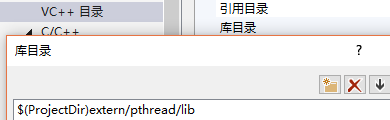

## 第3章-气功-原子锁线程协程

    不妨恶作剧的为编程行业引入修真体系 [炼气 -> 筑基 -> 金丹 -> 元婴 -> 化神] . 
    学校中锻炼的处于练气期, 感受编程行业斑驳交割的元气最终选择几门开始自己的练气生涯. 期间
    勤奋些的或者时间够了, 一舒心中豪情啪一声进入筑基期, 心随意动. 修炼生涯正式展开, 蹭蹭的
    进入了门派中磨炼.  随着门派体系或者一些心有不甘的选手日夜操戈, 自我驱动跃升成为人妖大战
    的前线主力, 金丹期. 此时的战场才刚刚开始, 同样以前修炼暴露的问题也就出现. 无数人在此厮
    杀, 对抗域外天魔, 或者在远古战场中获得奇遇, 又或者占有一个门派的全力支持, 通过大毅力破
    的金丹, 晋升元婴大佬. 隐射一方, 出手之间自带领域此时也是白骨功成, 为门派马首是瞻. 同样
    于生时天资聪慧, 道心自成的元婴大佬, 不被红尘迷恋. 占一代之大气运, 耐一世之大孤独. 甩手
    间风云变幻, 天雷滚滚中, 超脱物外, 万中无一化神巨擘独立无为之境, 位于东方.
    各位看官化神难道就是编程的极限吗. 呵呵, 这里先不表.
    我们这章讲的气功, 可以等同于金丹期修炼的法术. 打通和操作系统联系的基本关节. 毕竟程序都
    是依赖于平台, 不同平台的世界总会有大不同. 本章就是在不同平台间练出一门气功, 一招贯双江
    
### 3.1 原子锁

    一个古老的话题, 主要解决的问题资源竞争问题. 同样在说原子锁之前需要科普一些原子操作.

#### 3.1.1 常用的几种原子操作

    我们首先来举例一下如简单的:

```C
static int _a = 0;

++_a; 
/*
 ++_a 大致可以拆分为下面三步

 1' 把 _a 的值放入寄存器中
 2' 把 寄存器中值加1
 3' 返回寄存器中值并且设置给a

 */
```

    上面就会导致一个问题, 如果两个线程同时执行到 1' 那么造成一个现象是 _a最终没有预期的大.
    如何避免上面问题呢. 常见思路是互斥. 当然这里有更好思路利用编译器提供的原子操作(对CPU
    原子指令的封装), 说白了找一个编译器提供功能, 让我们实现原子相加.
    例如 GCC就提供不少这种指令.  

```C
type __sync_add_and_fetch (type * ptr, type value, ...);
type __sync_lock_test_and_set (type * ptr, type value, ...);
bool __sync_bool_compare_and_swap (type * ptr, type oldval, type newval, ...);
```

    这类原子操作命令直接查编译手册很好理解, 我们简单解释下. __sync_add_and_fetch 等同于将
    ptr指向的内存加上 value值, 并且返回最终加好的值. __sync_lock_test_and_set 的意思是
    把 value的值给ptr指向的内存, 并且返回 ptr原先指向的内存值. __sync_bool_compare_and_swap
    的意思是 ptr指向的值和原先的 oldval相等吗, 相等让其变成 newval. 并且返回 ptr指向值和
    oldval相等与否的 bool值. 为了让大家更好认知, 不妨封装一层, 通过注释好理解些

```C
// v += a ; return v;
#define ATOM_ADD(v, a)		__sync_add_and_fetch(&(v), (a))
// type tmp = v ; v = a; return tmp;
#define ATOM_SET(v, a)		__sync_lock_test_and_set(&(v), (a))
// v &= a; return v;
#define ATOM_AND(v, a)		__sync_and_and_fetch(&(v), (a))
// return ++v;
#define ATOM_INC(v)			__sync_add_and_fetch(&(v), 1)
// return --v;
#define ATOM_DEC(v)			__sync_sub_and_fetch(&(v), 1)
// bool b = v == c; b ? v=a : ; return b;
#define ATOM_CAS(v, c, a)	__sync_bool_compare_and_swap(&(v), (c), (a))

 // 保证代码不乱序
#define ATOM_SYNC()			__sync_synchronize()

// 对ATOM_LOCK 解锁, 当然 直接调用相当于 v = 0;
#define ATOM_UNLOCK(v)		__sync_lock_release(&(v))
```

    上面定义了增加设置 & ++ -- 这里原子操作. 普通系统基本就用到这些. 为了更好的展示全貌.
    更多细节可以查阅手册, 一切无所遁形.

#### 3.1.2 原子锁的大平台实现

    代码已经表达一切, 没有什么比代码更好懂了, 不懂那就抄几遍~

scatom.h

```C
#ifndef _H_SIMPLEC_SCATOM
#define _H_SIMPLEC_SCATOM

/*
 * 作者 : wz
 * 描述 : 简单的原子操作,目前只考虑 VS(CL) 和 gcc
 */

// 如果 是 VS 编译器
#if defined(_MSC_VER)

#include <windows.h>

#pragma warning(push)
//忽略 warning C4047: “==”:“void *”与“LONG”的间接级别不同
#pragma warning(disable:4047)

// v 和 a 都是 long 这样数据
#define ATOM_ADD(v, a)		InterlockedAdd((LONG volatile *)&(v), (LONG)(a))
#define ATOM_SET(v, a)		InterlockedExchange((LONG volatile *)&(v), (LONG)(a))
#define ATOM_AND(v, a)		InterlockedAnd((LONG volatile *)&(v), (LONG)(a))
#define ATOM_INC(v)			InterlockedIncrement((LONG volatile *)&(v))
#define ATOM_DEC(v)			InterlockedDecrement((LONG volatile *)&(v))
//
// 对于 InterlockedCompareExchange(v, c, a) 等价于下面
// long tmp = v ; v == a ? v = c : ; return tmp;
//
// 咱们的 ATOM_CAS(v, c, a) 等价于下面
// long tmp = v ; v == c ? v = a : ; return tmp;
//
#define ATOM_CAS(v, c, a)	((LONG)(c) == InterlockedCompareExchange((LONG volatile *)&(v), (LONG)(a), (LONG)(c)))

#pragma warning(pop)

// 保证代码不乱序优化后执行
#define ATOM_SYNC()			MemoryBarrier()

#define ATOM_UNLOCK(v)		ATOM_SET(v, 0)

// 否则 如果是 gcc 编译器
#elif defined(__GNUC__)

// v += a ; return v;
#define ATOM_ADD(v, a)		__sync_add_and_fetch(&(v), (a))
// type tmp = v ; v = a; return tmp;
#define ATOM_SET(v, a)		__sync_lock_test_and_set(&(v), (a))
// v &= a; return v;
#define ATOM_AND(v, a)		__sync_and_and_fetch(&(v), (a))
// return ++v;
#define ATOM_INC(v)			__sync_add_and_fetch(&(v), 1)
// return --v;
#define ATOM_DEC(v)			__sync_sub_and_fetch(&(v), 1)
// bool b = v == c; b ? v=a : ; return b;
#define ATOM_CAS(v, c, a)	__sync_bool_compare_and_swap(&(v), (c), (a))

 // 保证代码不乱序
#define ATOM_SYNC()			__sync_synchronize()

// 对ATOM_LOCK 解锁, 当然 直接调用相当于 v = 0;
#define ATOM_UNLOCK(v)		__sync_lock_release(&(v))

#endif // !_MSC_VER && !__GNUC__

/*
 * 试图加锁, 用法举例
 
	 if(ATOM_TRYLOCK(v)) {
		 // 已经有人加锁了, 处理返回事件
		...
	 }
 
	 // 得到锁资源, 开始处理
	 ...
 
	 ATOM_UNLOCK(v);
 
 * 返回1表示已经有人加锁了, 竞争锁失败.
 * 返回0表示得到锁资源, 竞争锁成功
 */
#define ATOM_TRYLOCK(v)		ATOM_SET(v, 1)

//
// 使用方式:
//  int lock = 0;
//  ATOM_LOCK(lock);
//  ...
//  ATOM_UNLOCK(lock);
//
#define ATOM_LOCK(v)		while(ATOM_SET(v, 1))

#endif // !_H_SIMPLEC_SCATOM
```

    这些代码很短, scatom.h 希望抄写几遍, 保证有效果. 使用起来就更简单了. 例如在上一章
    我们写了个 tstr字符串. 它不是线程安全的. 我们就可以利用上面原子锁, 简单帮它改成线程
    安全. 

```C
struct astr {
    int lock;
    struct tstr str;
}

// 初始化
struct astr as = { 0 };

// 使用
ATOM_LOCK(as.lock);

// 各种对于 astr.str 操作都是线程安全的
...

ATOM_UNLOCK(as.lock);

// 销毁
free(as.str.str);
```

    上面步骤就是原子锁使用的全部步骤了. 当然了装波的事情远远没有这样就完了. 很久以前别人
    问我什么是自旋锁, 当时羞愧难当. 我去后面才知道就是我写了无数遍的原子锁. 更多的是想说
    少炒作一些概念, 多一些真诚. 编程本身就那些东西, 说明白了大家都懂了. 切记编程道上多真
    多善否则基本无望元婴. 当然了高阶金丹期也都能够胜任主程了. 
    上面原子锁仍然可以优化, 例如我们采用的是忙等待也可以使用特殊睡眠, 降低 CPU空转. 等等
    优化. 当然在解决资源竞争问题上消耗最小是真无锁编程, 通过业务避免锁的产生. C 开发用系
    统线程锁还是有点重, 这也是原子锁存在的原因.

### 3.2 POSIX 线程库

    对于 POSIX 标准线程库, 也就是我们在 Linux中常用的 pthread线程库. 首先为其列个常用
    API的提纲. 线程环境初始化, 线程构建, 线程互斥量, 线程条件变量...

```C
/*
 * PThread Attribute Functions
 */

//
// pthread_attr_init - 初始化一个线程环境变量
// pthread_attr_destroy - 销毁一个线程环境变量
// attr     : pthread_attr_t 线程环境变量
// return   : 0 表示成功
//
extern int __cdecl pthread_attr_init (pthread_attr_t * attr);
extern int __cdecl pthread_attr_destroy (pthread_attr_t * attr);

//
// pthread_attr_setdetachstate - 设置线程的运行结束的分离属性
// attr         : pthread_attr_t 线程环境变量
// detachstate  : 默认是 PTHREAD_CREATE_JOINABLE, 需要执行 pthread_join 销毁遗留的线程空间
//              : PTHREAD_CREATE_DETACHED 属性等同于 pthread_detach, 结束即销毁
// return       : 0 表示成功
//
extern int __cdecl pthread_attr_setdetachstate (pthread_attr_t * attr, int detachstate);
```

    线程构建初始化如下

```C
/*
 * PThread Functions
 */

//
// pthread_create - 创建一个线程
// tid      : 返回创建线程的句柄 pthread_t 类型变量
// attr     : 线程创建初始化的量, 主要看 pthread_attr_xxxx 一系列设置
// start    : 线程创建成功运行的实体
// arg      : start 启动后传入的额外参数
// return   : 返回 0 表示成功, 非零表示失败例如 EAGAIN
//
extern int __cdecl pthread_create (pthread_t * tid,
                            const pthread_attr_t * attr,
                            void * (__cdecl * start) (void *),
                            void * arg);

//
// pthread_equal - 两个线程id比较
// t1       : 线程id
// t2       : 线程id
// return   : 1 表示二者相等, 0 表示二者不等
//
extern int __cdecl pthread_equal (pthread_t t1, pthread_t t2);

//
// pthread_exit - 退出当前线程
// value_ptr    : 会保存在线程的私有变量中, 留给 pthread_join 得到
// return       : void
//
extern void __cdecl pthread_exit (void * value_ptr);

//
// pthread_join - 等待线程 pthread_create -> start 函数运行结束
// thread       : 线程id
// value_ptr    : 返回 start 返回值, 或 pthread_exit 设置的值
// return       : 0表示成功, 其它查源码吧
//
extern int __cdecl pthread_join (pthread_t thread, void ** value_ptr);
```

    线程互斥量, 基本和 pthread_create 差不多, 用的最多的系列. 加上手工注释希望大家
    能够感性认知.

```C
/*
 * Mutex Attribute Functions
 */
static pthread_mutex_t _mtx = PTHREAD_MUTEX_INITIALIZER;

//
// pthread_mutex_init - 初始化一个线程互斥量类型
// pthread_mutex_destroy - 清理一个线程互斥量类型, 必须和 pthread_mutex_init成对
//
extern int __cdecl pthread_mutex_init (pthread_mutex_t * mutex, const pthread_mutexattr_t * attr);
extern int __cdecl pthread_mutex_destroy (pthread_mutex_t * mutex);

//
// pthread_mutex_lock - 加锁
// pthread_mutex_unlock - 解锁
//
extern int __cdecl pthread_mutex_lock (pthread_mutex_t * mutex);
extern int __cdecl pthread_mutex_unlock (pthread_mutex_t * mutex);
```

    擦, 翻译 API有点累, 不想继续扯了. 下次用到额外的 api 继续深入翻译. 上面
    PTHREAD_MUTEX_INITIALIZER 初始化的互斥量, 不需要调用 pthread_mutex_destroy 跟随系统生命周期.
    对于 pthread 线程假如你用了 xxx_init 那么最终最好都需要调用 xxx_destroy .
    简单通过上面代码我们就可以露一手了哈哈

```C
//
// async_run - 开启一个自销毁的线程 运行 run
// run		: 运行的主体
// arg		: run的参数
// return	: >= SufBase 表示成功
//
inline int 
async_run_(node_f run, void * arg) {
	pthread_t tid;
	pthread_attr_t attr;

	// 构建pthread 线程奔跑起来
	pthread_attr_init(&attr);
	pthread_attr_setdetachstate(&attr, PTHREAD_CREATE_DETACHED);
	if (pthread_create(&tid, &attr, (start_f)run, arg) < 0) {
		pthread_attr_destroy(&attr);
		RETURN(ErrBase, "pthread_create error run, arg = %p | %p.", run, arg);
	}

	pthread_attr_destroy(&attr);
	return SufBase;
}
```

    使用起来就非常轻松了, async_run_((node_f) run, xxx) 异步分离线程就跑起来哈哈

#### 3.2.1 winds 使用 pthread 线程库

    winds 上使用 POSIX 的 pthread 线程特别的 cool. 也很爽, 毕竟 winds自带的线程库用起来要人
    命, 丑的无语. 我们采用的方案是 pthread for win32, 请自己去 github 上找 GerHobbelt 大神 
    的 pthread-win32 项目. 源码结构特别清晰好懂, 异常佩服. 
    随后下载我的 pthread for winds 32位静态库发布版项目 pthread.winds.lib.2.10.0.1

> 使用解释:  

    sched.h
    pthread.h
    semaphore.h
    pthread_lib.lib
    
    添加到咱们的 Visual Studio  sln 项目中, pthread.h 中已经包含了 pthread_lib.lib

```C
#if !defined(_H_PTHREAD) && defined(_MSC_VER)
#define _H_PTHREAD

/*
 * See the README file for an explanation of the pthreads-win32 version
 * numbering scheme and how the DLL is named etc.
 */
#define PTW32_VERSION 2, 10, 0, 1
#define PTW32_VERSION_STRING "2, 10, 0, 1"

#pragma comment(lib, "pthread_lib.lib")

#endif
```

    为了达到和 linux上使用 #include <pthread.h> 一样效果. 还需要添加一个包含的文件目录.
    就和下面这样



> 使用完毕

    从此以后你要的一切 pthread都会给你! 

#### 3.2.2 pthread 线程库

    不妨利用构建好的 pthread 模块, 写个 Demo 练练手. 用的 api是系统中读写锁相关操作. 主要为了
    解决大量消费者少量生产者的模型

```C
#include <stdio.h>
#include <stdlib.h>
#include <pthread.h>

#define _INT_BZ     (13)
#define _INT_WTH    (2)
#define _INT_RTH    (10)

struct rwarg {
    pthread_t id;
    pthread_rwlock_t rwlock;    // 加锁用的
    int idx;                    // 指示buf中写到那了
    char buf[BUFSIZ];           // 存储临时数据
};

// 写线程, 主要随机写字符进去
void twrite(struct rwarg * arg);
// 读线程
void treads(struct rwarg * arg);

/*
 * 主函数测试线程读写逻辑
 * 少量写线程, 大量读线程测试
 */
int main(int argc, char * argv[]) {
    // 初始化定义需要使用的量. C99以上写法, 避免跨平台不同实现的警告问题, 感谢好人随性徜徉
    struct rwarg arg = { 0, .rwlock = PTHREAD_RWLOCK_INITIALIZER, 0, "" };    
    int i;

    // 读线程跑起来
    for(i=0; i<_INT_RTH; ++i) 
        pthread_create((pthread_t *)&arg, NULL, (void * (*)(void *))treads, &arg);

    // 写线程再跑起来
    for(i=0; i<_INT_WTH; ++i)
        pthread_create((pthread_t *)&arg, NULL, (void * (*)(void *))twrite, &arg);

    // 简单等待一下
    printf("sleep input enter:");
    getchar();

    return 0;
}

// 写线程, 主要随机写字符进去
void 
twrite(struct rwarg * arg) {
    pthread_detach(pthread_self());

    pthread_rwlock_wrlock(&arg->rwlock);
    while(arg->idx < _INT_BZ) {
        arg->buf[arg->idx] = 'a' + arg->idx;
        ++arg->idx;
    }
    pthread_rwlock_unlock(&arg->rwlock);
}

// 读线程
void 
treads(struct rwarg * arg) {
    pthread_detach(pthread_self());
    
    while(arg->idx < _INT_BZ) {
        pthread_rwlock_rdlock(&arg->rwlock);
        puts(arg->buf);
        pthread_rwlock_unlock(&arg->rwlock);
    }
}
```

    因为手握 pthread不知道写个啥, 随便写了点. 上面模型就是大量读者读加锁频繁, 少量写线程.
    可以临摹一遍, 感受一下远古时期那些妖魔锁来回瞎搞的时代.
    关于 POSIX 线程库 pthread就到这里了, 看看头文件, 查查手册, 再不济看看源码一切都是那么
    自然.

### 3.3 读写锁

    pthread 已经提供了读写锁, 为什么咱们还要再搞搞呢. 其实这个很好理解. 1' 要剖析一下基本
    原理, 2' 它有点重, 不如用原子锁构造一个. 3' pthread 读写锁存在写竞争不过读的隐患.
    特别是对于第三点, 不妨把上面代码刷到你所能执行的环境中. 会发现打印了大量空白, 说白了就是
    写锁被大量读锁阻塞了.

    下面我们队读写锁进行详细分析. 首先来段有用的套话

读写锁 是为了 解决, 大量 ''读'' 和 少量 ''写'' 的业务而设计的.  

读写锁有3个特征:

　　1.当读写锁是写加锁状态时，在这个锁被解锁之前，所有试图对这个锁加锁的线程都会被阻塞
　　2.当读写锁在读加锁状态时，再以读模式对它加锁的线程都能得到访问权，但以写模式加锁的线程将会被阻塞
　　3.当读写锁在读加锁状态时，如果有线程试图以写模式加锁，读写锁通常会阻塞随后的读模式加锁

    从上面分析主要是 pthread的线程库对于第三个特征没有完成. 默认还是平等竞争. 3默认写锁具有最高
    优先级. 

#### 3.3.1 读写锁设计 interface

    通过上面3大特征和已经构建好的原子操作接口 scatom.h, 不妨设计如下接口 scrwlock.h

```C
#ifndef _H_SIMPLEC_SCRWLOCK
#define _H_SIMPLEC_SCRWLOCK

#include "scatom.h"

/*
 * create simple write and read lock
 * struct rwlock need zero.
 * is scatom ext
 */

// init need all is 0
struct rwlock {
	int rlock;
	int wlock;
};

// add read lock
extern void rwlock_rlock(struct rwlock * lock);
// add write lock
extern void rwlock_wlock(struct rwlock * lock);

// add write lock
extern void rwlock_unrlock(struct rwlock * lock);
// unlock write
extern void rwlock_unwlock(struct rwlock * lock);

#endif // !_H_SIMPLEC_SCRWLOCK
```

    从上面接口我们也可以看出来我们这里读写锁是分别解锁的. pthread 线程库直走一个
    pthread_rwlock_unlock 这就是为啥读锁压制写锁的原因了, 因为它不做区分. 同等对待.
    使用方法也灰常简单以上面举例

```C
struct rwarg {
    pthread_t id;
    struct rwlock rwlock;       // 加锁用的
    int idx;                    // 指示buf中写到那了
    char buf[BUFSIZ];           // 存储临时数据
};

// 初始化
struct rwarg arg = { 0 };

// 写线程, 主要随机写字符进去
...
    rwlock_wlock(&arg->rwlock);
    while(arg->idx < _INT_BZ) {
        arg->buf[arg->idx] = 'a' + arg->idx;
        ++arg->idx;
    }
    rwlock_unwlock(&arg->rwlock);
...

// 读线程
...
    while(arg->idx < _INT_BZ) {
        rwlock_rlock(&arg->rwlock);
        puts(arg->buf);
        rwlock_unrlock(&arg->rwlock);
    }
...
```

    本质就是两把交叉的锁模拟出一把读写锁. 

#### 3.3.2 读写锁设计 implement

    这里看一下详细的设计部分. 按照上面3个特征写代码, 首先看读加锁

```C
// add read lock
void 
rwlock_rlock(struct rwlock * lock) {
	for (;;) {
		// 看是否有人在试图读, 得到并防止代码位置优化
		while (lock->wlock)
			ATOM_SYNC();

		ATOM_INC(lock->rlock);
		// 没有写占用, 开始读了
		if (!lock->wlock)
			break;

		// 还是有写, 删掉添加的读
		ATOM_DEC(lock->rlock);
	}
}
```

    while (lock->wlock) ... 表示读锁为写锁让道. 后面采用读锁获取资源开始引用加1. 
    随后是读解锁

```C
// unlock read lock
inline void 
rwlock_unrlock(struct rwlock * lock) {
	ATOM_DEC(lock->rlock);
}
```

    读解锁引用减1. 方便写加锁的时候判断是否有读伙伴占用读锁. 然后看写加锁和解锁

```C
// add write lock
void 
rwlock_wlock(struct rwlock * lock) {
	ATOM_LOCK(lock->wlock);
	// 等待读占用锁
	while (lock->rlock)
		ATOM_SYNC();
}

// unlock write lock
inline void 
rwlock_unwlock(struct rwlock * lock) {
	ATOM_UNLOCK(lock->wlock);
}
```

    到这里关于读写锁的炫迈已经嚼完了. 能够想到就是网络IO中存在应用的空间. 但不推荐. 
    
### 3.4 协程

    通过上面我们搞定了原子锁, 读写锁, POSIX 线程. 忘记说了有本很古老的 POSIX线程程序设计
    一本书很不错. 如果想做专业的多线程开发那本书是必须的. 服务器开发行业最难的两个岗感觉就
    是多线程和网络这两个方面了. 继续聊回来
    协程火起来的缘由(主要是我入行慢) 还是被 Lua 的 coroutine.create (f) 带起来. 
    我们从系统层面分析协程的实现. 

#### 3.4.1 协程库引言

    协程对于上层语言还是比较常见的. 例如C# 中 yield retrun, lua 中 coroutine.yield 等来
    构建同步并发的程序.本文就是探讨如何从底层实现开发级别的协程库. 在说协程之前, 简单温故一
    下进程和纤程关系. 进程拥有一个完整的虚拟地址空间，不依赖于线程而独立存在. 线程是进程的
    一部分，没有自己的地址空间，与进程内的其他线程一起共享分配给该进程的所有资源。进程和纤程
    是1对多关系, 协程同线程关系也是类似. 一个线程中可以有多个协程. 协程同线程相比区别再于, 
    线程是操作系统控制调度(异步并发),
    而纤程是程序自身控制调度(同步串行). 简单总结协程特性如下:

　　  1. 相比线程具有更优的性能(假定, 程序写的没有明显失误) , 省略了操作系统的切换操作

　　  2. 相比线程具有更少的内存空间, 线程是操作系统对象很耗资源, 协程是用户态资源, 占用系统层资源很少.

　　  3. 对比线程开发, 逻辑结构更复杂, 需要开发人员了解程序运行走向.

    举个例子 数码宝贝例子 : 滚球兽 ->  亚古兽－>  暴龙兽－>  机械暴龙兽 －> 战斗暴龙兽


    '类比协程进化史' if .. else / switch -> goto -> setjmp / logjump -> coroutine -> .......
    协程开发是串行程序开发中构建异步效果的开发模型.

#### 3.4.2 协程储备, winds 部分

    在 winds 有一种另一个东西叫做纤程 fiber.  官方说明是 "Microsoft公司给Windows添加了一种纤程，
    以便能够非常容易地将现有的UNIX服务器应用程序移植到Windows中". 这就是纤程概念的由来. 而我们这
    里会详细解释其中关于 winds fiber常用 api. 先浏览关于当前线程开启纤程相关接口说明.

```C
//
// Fiber creation flags
//
#define FIBER_FLAG_FLOAT_SWITCH 0x1     // context switch floating point

/*
 * VS编译器特性约定
 * 1. 其参数都是从右向左通过堆栈传递的
 * 2. 函数调用在返回前要由被调用者清理堆栈(被调用函数弹出的时候销毁堆栈)
 */
#define WINAPI      __stdcall

/*
 * 将当前线程转成纤程, 返回转换成功的主纤程对象域
 * lpParameter    : 转换的时候传入到主线程中用户数据
 * dwFlags        : 附加参数, 默认填写 FIBER_FLAG_FLOAT_SWITCH
 *                : 返回转换成功后的主纤程对象域
 */
WINBASEAPI __out_opt LPVOID WINAPI ConvertThreadToFiberEx(
    __in_opt LPVOID lpParameter,
    __in DWORD dwFlags
);

// 得到当前纤程中用户传入的数据, 就是上面 lpParameter
__inline PVOID GetFiberData(void)    { return *(PVOID *) (ULONG_PTR) __readfsdword (0x10); }

// 得到当前运行纤程对象
__inline PVOID GetCurrentFiber(void) { return (PVOID) (ULONG_PTR) __readfsdword (0x10); }
                                                          
/*
 * 将当前纤程转换成线程, 对映ConvertThreadToFiberEx操作系列函数. 返回原始环境
 *                : 返回成功状态, TRUE标识成功
 */
WINBASEAPI BOOL WINAPI ConvertFiberToThread(VOID);
```

    下面是关于如何创建纤程并切换(启动)官方接口说明.

```C
// 标识纤程执行体的注册函数声明, lpFiberParameter 可以通过 GetFiberData 得到
typedef VOID (WINAPI * PFIBER_START_ROUTINE)(LPVOID lpFiberParameter);
typedef PFIBER_START_ROUTINE LPFIBER_START_ROUTINE;

/*
 * 创建一个没有启动纤程对象并返回
 * dwStackCommitSize    : 当前纤程栈大小, 0标识默认大小
 * dwStackReserveSize   : 当前纤程初始化化保留大小, 0标识默认大小
 * dwFlags              : 纤程创建状态, 默认FIBER_FLAG_FLOAT_SWITCH, 支持浮点数操作
 * lpStartAddress       : 指定纤程运行的载体.等同于纤程执行需要指明执行函数
 * lpParameter          : 纤程执行的时候, 传入的用户数据, 在纤程中GetFiberData可以得到
 *                      : 返回创建好的纤程对象 
 */                                              
WINBASEAPI __out_opt LPVOID WINAPI CreateFiberEx(
    __in     SIZE_T dwStackCommitSize,
    __in     SIZE_T dwStackReserveSize,
    __in     DWORD dwFlags,
    __in     LPFIBER_START_ROUTINE lpStartAddress,
    __in_opt LPVOID lpParameter
);

// 销毁一个申请的纤程资源和CreateFiberEx成对出现
WINBASEAPI VOID WINAPI DeleteFiber(__in LPVOID lpFiber);

// 纤程跳转, 跳转到lpFiber指定的纤程
WINBASEAPI VOID WINAPI SwitchToFiber(__in LPVOID lpFiber);
```

    我们通过上面 api 写一个基础的演示demo , fiber.c,  实践能补充猜想.

```C

```
