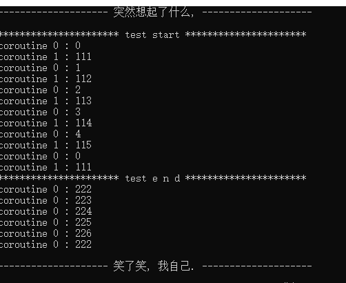

# 第3章-气功-系统编程简述

	    不妨仰望星海为编程行业引入修真体系 [ 炼气 -> 筑基 -> 金丹 -> 元婴 -> 化神 ]. 
    那时候在学校里或者野路子中锻炼并感应着天地间的元气, 在练气期幸福而不知睡眠. 感受着编
    程行业斑驳交割的元气, 最终选择几类元气开始自己的练气生涯. 期间勤奋些的或者时间够了, 
    一舒心中豪情啪的一声进入筑基期. 心随意动, 修炼生涯正式展开. 蹭蹭的我们进入了门派中磨
    炼. 随着门派体系或者一些心有不甘的选手日夜操戈, 自我驱动跃升成为人魔大战的前线主力. 
    挥洒鲜血, 一朝凝华金丹成. 此时的战场才刚刚拉开序幕. 同样以前修炼遗留的隐患也一并爆发
    . 无数人在此厮杀, 对抗域外天魔. 此刻或者在远古战场中获得奇遇, 又或者占有一个门派的全
    力支持, 通过大毅力破吾金丹, 晋升元婴大佬. 隐射一方, 出手之间自带领域威势. 回顾也是
    白骨功成, 为门派马首是瞻. 唯独极个别生时天资聪慧, 道心自明的元婴大佬. 忘却红尘迷恋, 
    占一代之强气运, 耐一世之大孤独, 甩手间风云变幻, 天雷滚滚, 超脱物外, 万中无一化神巨
    擘独立无为之境, 位于东方. 无一丝情感遥望着心的远方, 立于缥缈峰 ~ 窥探浩瀚 ~
	    各位看官, 化神难道就是编程的至高境界了吗? 然而一切才刚刚开始, 这里先不表. 本章
    讲的气功, 等同于金丹期修炼的法术. 打通和操作系统联系的基本关节. 专业程序或多或少依赖
    于平台, 不同平台的修炼会有所大不同. 本章就是在不同平台间练就一门气功, 剑元贯双江.
    
## 3.1 原子库

	    原子锁一个古老的话题, 在不主动放弃 CPU 情况下解决资源竞争问题. 在说原子库之前
    需要科普些基本原子操作.


### 3.1.1 引言

    举个简单例子:

```C
volatile int i = 0;

// ++i 大致可以拆分为下面三步
//
// 1' 把 i 的值放入寄存器中
// 2' 把寄存器中的值加 1
// 3' 返回寄存器中值并设置给 i
++i;
```

    以上执行会导致一个问题, 如果两个线程同时执行到 1' 那么造成一个现象是 i 最终没有预期
    的大. 如何避免上面问题呢? 常见思路是互斥. 当然这里有更好路子, 利用编译器提供的原子
    操作. 本质利用 CPU 提供的原子指令的封装(CPU 提供总线锁定和缓存锁定保证复杂内存操作
    的原子性). 说直接点, 可以用编译器提供这方面基础能力, 让我们实现原子相加. 例如 GCC 
    就提供不少像下面指令.

```C
type __sync_add_and_fetch (type * ptr, type value, ...);
type __sync_lock_test_and_set (type * ptr, type value, ...);
bool __sync_bool_compare_and_swap (type * ptr, type old, type new, ...);
```

    这类原子操作的特殊表达式可以直接边查编译手册, 边写个小例子, 就会知道窍门. 我们简单解
	释下, __sync_add_and_fetch 等同于将 ptr 指向的内存加上 value 值, 并且返回最终
    加好的值. __sync_lock_test_and_set 的意思是把 value 的值给 ptr 指向的内存, 
    并且返回 ptr 原先指向的内存值. __sync_bool_compare_and_swap 的意思是判断 ptr 
    指向的值和原先的 old 相等吗, 相等将其设置为 new. 并且返回 ptr 指向值和 old 相等
    与否的 bool 值. 为了让大家更好认知, 不妨封装一层, 请收看注释:

```C
// v += a ; return v;
#define atom_add(v, a)      __sync_add_and_fetch(&(v), (a))
// type tmp = v ; v = a; return tmp;
#define atom_set(v, a)      __sync_lock_test_and_set(&(v), (a))
// bool b = v == c; b ? v=a : ; return b;
#define atom_cas(v, c, a)   __sync_bool_compare_and_swap(&(v), (c), (a))
```

    以上定义了 add set cas 原子操作. 随后原子基础库中会封装更多更常用的. 下面展示哈全
	貌. 更多细节可以细查 man 手册, 一切无所遁形.

### 3.1.2 原子锁

    代码已经表述了一切好的坏的有得没得, 如果还不明白, 说明字帖抄写少了 ~

```C
#ifndef _ATOM_H
#define _ATOM_H

#include "atomic.h"

//
// atom_t 自旋锁类型
// [static] atom_t o = 0;
//   atom_lock(o);
//  - One Man RPG
// atom_unlock(o);
//
typedef volatile long atom_t;

#ifdef __GNUC__

#define atom_trylock(o)     (!__sync_lock_test_and_set(&(o), 1))

#define atom_lock(o)        while(__sync_lock_test_and_set(&(o), 1))

#define atom_unlock(o)      __sync_lock_release(&(o))

// 内存屏障, 维持代码顺序
#define atom_sync()         __sync_synchronize()

// v += a ; return v;
#define atom_add(v, a)      __sync_add_and_fetch(&(v), (a))
// type tmp = v ; v = a; return tmp;
#define atom_set(v, a)      __sync_lock_test_and_set(&(v), (a))
// v &= a; return v;
#define atom_and(v, a)      __sync_and_and_fetch(&(v), (a))
// return ++v;
#define atom_inc(v)         __sync_add_and_fetch(&(v), 1)
// return --v;
#define atom_dec(v)         __sync_sub_and_fetch(&(v), 1)
// bool b = v == c; b ? v=a : ; return b;
#define atom_cas(v, c, a)   __sync_bool_compare_and_swap(&(v), (c), (a))

#endif

#ifdef _MSC_VER

#include <intrin.h>
#include <intrin0.h>

/* Interlocked intrinsic mapping for _nf/_acq/_rel */
#  if defined(_M_ARM) || defined(_M_ARM64)
#    define _ACQUIRE(x) ATOMIC_CONCAT(x, _acq)
#  else  /* defined(_M_ARM) || defined(_M_ARM64) */
#    define _ACQUIRE(x) x
#  endif /* defined(_M_ARM) || defined(_M_ARM64) */

#define atom_trylock(o)     (!_ACQUIRE(_interlockedbittestandset)(&(o), 0))

#define atom_lock(o)        while(_ACQUIRE(_interlockedbittestandset)(&(o), 0))

static inline void store_release(atom_t * x) {
    /* store _Value atomically with release memory order */
#  if defined(_M_ARM) || defined(_M_ARM64)
    __dmb(0xB /* _ARM_BARRIER_ISH or _ARM64_BARRIER_ISH*/);
    __iso_volatile_store32((volatile int *)x, 0);
#  else
    _ReadWriteBarrier();
    *x = 0;
#  endif
}

#define atom_unlock(o)      store_release(&(o))

// 保证代码优化后不乱序执行
#define atom_sync()         MemoryBarrier()

// v 和 a 都是 long 这样数据
#define atom_add(v, a)      InterlockedAdd((volatile LONG *)&(v), (LONG)(a))
#define atom_set(v, a)      InterlockedExchange((volatile LONG *)&(v), (LONG)(a))
#define atom_and(v, a)      (InterlockedAnd((volatile LONG *)&(v), (LONG)(a)), (LONG)(v))
#define atom_inc(v)         InterlockedIncrement((volatile LONG *)&(v))
#define atom_dec(v)         InterlockedDecrement((volatile LONG *)&(v))
//
// 对于 InterlockedCompareExchange(v, c, a) 等价于下面
// long tmp = v ; v == a ? v = c : ; return tmp;
//
// 咱们的 atom_cas(v, c, a) 等价于下面
// long tmp = v ; v == c ? v = a : ; return tmp;
//
#define atom_cas(v, c, a)   ((LONG)(c) == InterlockedCompareExchange((volatile LONG *)&(v), (LONG)(a), (LONG)(c)))

#endif

#endif//_ATOM_H
```

    这些代码很短, atom.h 希望抄写几遍, 保证有效果. 我们的原子锁主打的 linux 平台, 也
    是当前开发届主旋律. winds 辅助开发, linux 在外实战. 使用起来也很容易. 例如在上一
    章写了个 tstr 字符串. 他不是线程安全的. 可以利用原子锁, 简单改成线程安全版本: 

```C
struct astr {
    atom_t lock;
    struct tstr str[1];
}

// 初始化
struct astr a = { 0 };

// 使用
atom_lock(a.lock);

// 各种对于 astr.str 操作都是线程安全的
// ...

// 销毁
TSTR_DELETE(a.str);

atom_unlock(a.lock);
```

    以上就是原子锁使用的核心步骤. 当然了, 装波的事情远远还没有结束. 很久以前别人问什么是
	自旋锁, 当时羞愧难当. 后面才知道就是写了无数遍的原子锁. 此刻在想, 确实应该多一份博
    学, 也要多一分真诚. 编程本身就那些东西, 讲明白后大家就很容易懂. 切记编程路上多真善
    美, 否则基本无望元婴. 当然金丹大圆满也都能够胜任主程了, 以此定型一生. 上面原子锁仍    
    然可以优化, 例如采用忙等待和阻塞混合编程, 降低 CPU 空转, 等等优化. 总而言之在解决
    资源竞争问题上, 消耗最小是真无锁编程. 通过业务优化避免锁的产生. C 开发用系统互斥锁
    偏重, 这也是原子锁一直存在的原因, 并且处于上升势头.

### 3.1.3 原子库封装

	不知道有木有人好奇 atomic.h 里是什么? 恭喜你, 新世界的大门已经被打开. 在讲解之前希
    望读者事先研究过 C11 stdatomic.h 原子操作. 而我们这里将会说明 stdatomic.h 中引
    入的六种不同 memory order 来控制同步的粒度, 以获得更好的程序性能. 这六种 order 
    分别是:

```C
/* 7.17.3 Order and consistency */
typedef enum memory_order {
  memory_order_relaxed = __ATOMIC_RELAXED,
  memory_order_consume = __ATOMIC_CONSUME,
  memory_order_acquire = __ATOMIC_ACQUIRE,
  memory_order_release = __ATOMIC_RELEASE,
  memory_order_acq_rel = __ATOMIC_ACQ_REL,
  memory_order_seq_cst = __ATOMIC_SEQ_CST
} memory_order;
```

memory_order_relaxed 宽松内存顺序 :

    没有同步或顺序制约, 仅对此操作要求原子性. 带 memory_order_relaxed 标签的原子操
    作不考虑线程间同步操作, 其他线程可能读到新值, 也可能读到旧值. 只保证当前操作的原子性
    和修改顺序一致性. 例如:

```C
// atomic init
atomic_int x = 0, y = 0;

// 线程 1 操作
int a = atomic_load_explicit(&y, memory_order_relaxed); // A
atomic_store_explicit(&x, a, memory_order_relaxed);     // B

// 线程 2 操作
int b = atomic_load_explicit(&x, memory_order_relaxed); // C
atomic_store_explicit(&y, 28, memory_order_relaxed);    // D
```

	允许产生结果 a == 28 && b == 28. 因为即使线程 1 中 A 先序于 B 且线程 2 中 C 先
    序于 D, 但没法保证 y 的修改顺序中 D 比 A 先执行, x 的修改顺序中 B 比 C 先执行. 
    这就会导致 D 在 y 上的副效应, 可能可见于线程 1 中的加载 A, 同时 B 在 x 上的副效应
    , 可能可见于线程 2 中的加载 C. 宽松内存顺序的典型应用场景是计数器自增. 例如引用计数
    器, 因为这只要求原子性保证自增 OK, 但不要求顺序或同步(注意计数器自减要求进行 
	memory_order_acquire 获取内存顺序同步)

memory_order_consume 消费内存顺序 :

	有此内存顺序的加载操作, 在其影响的内存位置进行消费操作: 当前线程中依赖于当前加载的该
    值的读或写不能被重排到此加载前. 其他释放同一原子变量的线程的对数据依赖变量的写入, 为
    当前线程所可见. 在大多数平台上, 这只影响到编译器优化. 例如线程 1 中的原子存储带标签
    memory_order_release 而线程 2 中来自同一原子对象的加载带标签 
    memory_order_consume, 则线程 1 视角中依赖先序于原子存储的所有内存写入(非原子和宽
    松原子的), 会在线程 B 中加载操作所携带依赖进入的操作中变成可见副效应, 即一旦完成原
    子加载, 则保证线程 2 中, 使用从该加载获得的值的运算符和函数, 能见到线程 1 写入内存
    的内容. 同步仅在释放和消费同一原子对象的线程间建立. 其他线程能见到与被同步线程的一者
    或两者相异的内存访问顺序.

```C
// atomic init
int a = 0;
atomic_int x = 0;

// 线程 1 操作
a = 1;
// memory_order_release 释放内存顺序
// 后面所有与这块内存有关的读写操作都无法被重排到这个操作之前
atomic_store_explicit(&x, 1, memory_order_release);

// 线程 2 操作
while (atomic_load_explicit(&x, memory_order_consume) != 1) {
    if (a == 1) { // a 可能是 1 也可能是 0
        
    }
}
```

	更好理解的是下面这个例子, a 的值一定为 0. 但多数编译器没有跟踪依赖链, 均将消费内存
    顺序操作提升为 memory_order_acquire 获得内存顺序操作.

```C
atomic_int x = 0;

int a = atomic_load_explicit(&x, memory_order_consume);
// a 的值一定是 0, memory_order_consume 后面与这块内存的相关代码不会重排到他前面
x = 1;
```

memory_order_release 释放内存顺序 :
   
	有此内存顺序的存储操作进行释放操作, 当前线程中的读或写不能被重排到此存储后. 当前线程
	的所有写入, 可见于获得该同一原子变量的其他线程(获得内存顺序), 并且对该原子变量的带依
	赖写入变得对于其他消费同一原子对象的线程可见. 例如一些原子对象被存储-释放, 而有数个
    其他线程对该原子对象进行读修改写操作, 则会形成"释放序列": 所有对该原子对象读修改写的
    线程与首个线程同步, 而且彼此同步, 即使他们没有 memory_order_release 语义. 这使
    得单产出-多消费情况可行, 而无需在每个消费线程间强加不必要的同步. 同样 unlock 也全靠
	memory_order_release 释放内存顺序

memory_order_seq_cst 序列一致内存顺序 :
 
	有此内存顺序的加载操作进行获得操作, 存储操作进行释放操作, 而读修改写操作进行获得操作
	和释放操作, 会加上存在一个单独全序, 其中所有线程以同一顺序观测到所有修改. 如果是读
    取就是 acquire 语义, 如果是写入就是 release 语义, 如果是读写就是 
    acquire-release 语义. 通常情况下编译器默认使用 memory_order_seq_cst. 在你不
    确定如何选取这些 memory order, 可以直接用此内存顺序.

```C
/* 7.17.8 Atomic flag type and operations */
typedef struct atomic_flag { atomic_bool _Value; } atomic_flag;

#define atomic_flag_test_and_set(object) __c11_atomic_exchange(     \
	&(object)->_Value, 1, __ATOMIC_SEQ_CST)

#define atomic_flag_clear(object) __c11_atomic_store(               \
	&(object)->_Value, 0, __ATOMIC_SEQ_CST)
```

	但当 memory_order_acquire 及 memory_order_release 与 
    memory_order_seq_cst 混合使用时, 会产生诡异的结果. 对于 memory_order_seq_cst
    需要了解的注意点: 
        1' memory_order_seq_cst 标签混合使用时, 程序的序列一致保证就会立即丧失
        2' memory_order_seq_cst 原子操作相对于同一线程所进行的其他原子操作可重排
	有了简单基础, 我们参照 C11 stdatomic.h 理念设计个跨平台的 atomic.h. 首先看 
    linux 实现部分

```C
#if !defined(_ATOMIC$C11_H) && !defined(_MSC_VER)
#define _ATOMIC$C11_H

#include <stdbool.h>
#include <stdatomic.h>

#define GENERIC_ATOMIC(type, mark, /* unused */ size)               \
                                                                    \
typedef _Atomic(type) atomic_##mark##_t;                            \
                                                                    \
static inline type                                                  \
atomic_load_##mark(const atomic_##mark##_t * a, memory_order o) {   \
   /*                                                               \
    * A strict interpretation of the C standard prevents            \
    * atomic_load from taking a const argument, but it's            \
    * convenient for our purposes. This cast is a workaround.       \
    */                                                              \
    return atomic_load_explicit((atomic_##mark##_t *)a, o);         \
}                                                                   \
                                                                    \
static inline void                                                  \
atomic_store_##mark(atomic_##mark##_t * a, type v,                  \
                    memory_order o) {                               \
    atomic_store_explicit(a, v, o);                                 \
}                                                                   \
                                                                    \
static inline type                                                  \
atomic_exchange_##mark(atomic_##mark##_t * a, type v,               \
                       memory_order o) {                            \
    return atomic_exchange_explicit(a, v, o);                       \
}                                                                   \
                                                                    \
static inline bool                                                  \
atomic_compare_exchange_weak_##mark(atomic_##mark##_t * a,          \
                                    type * c, type v,               \
                                    memory_order o,                 \
                                    memory_order n) {               \
    return atomic_compare_exchange_weak_explicit(a, c, v, o, n);    \
}                                                                   \
                                                                    \
static inline bool                                                  \
atomic_compare_exchange_strong_##mark(atomic_##mark##_t * a,        \
                                      type * c, type v,             \
                                      memory_order o,               \
                                      memory_order n) {             \
    return atomic_compare_exchange_strong_explicit(a, c, v, o, n);  \
}

//
// Integral types have some special operations available that
// non-integral ones lack.
//
#define GENERIC_INT_ATOMIC(type, mark, /* unused */ size)           \
                                                                    \
GENERIC_ATOMIC(type, mark, size)                                    \
                                                                    \
static inline type                                                  \
atomic_fetch_add_##mark(atomic_##mark##_t * a, type v,              \
                        memory_order o) {                           \
    return atomic_fetch_add_explicit(a, v, o);                      \
}                                                                   \
                                                                    \
static inline type                                                  \
atomic_fetch_sub_##mark(atomic_##mark##_t * a, type v,              \
                        memory_order o) {                           \
    return atomic_fetch_sub_explicit(a, v, o);                      \
}                                                                   \
                                                                    \
static inline type                                                  \
atomic_fetch_and_##mark(atomic_##mark##_t * a, type v,              \
                        memory_order o) {                           \
    return atomic_fetch_and_explicit(a, v, o);                      \
}                                                                   \
                                                                    \
static inline type                                                  \
atomic_fetch_or_##mark(atomic_##mark##_t * a, type v,               \
                       memory_order o) {                            \
    return atomic_fetch_or_explicit(a, v, o);                       \
}                                                                   \
                                                                    \
static inline type                                                  \
atomic_fetch_xor_##mark(atomic_##mark##_t * a, type v,              \
                        memory_order o) {                           \
    return atomic_fetch_xor_explicit(a, v, o);                      \
}

#endif//_ATOMIC$C11_H
```

	上面基于支持 C11 标准实现且没有定义 __STDC_NO_ATOMICS__ 宏为 1 的编译器, 而封装
    的原子操作宏模板. 实现分为两个部分. 第一部分是 GENERIC_ATOMIC 用于通用类型的原子
    操作宏模板. 第二部分是 GENERIC_INT_ATOMIC 用于整型类型的原子操作宏模板. 核心思路
    参照 jemalloc 源码而开发设计的. 扯一点, 要不是 winds CL 目前不支持 C11, 完全没
    有必要去设计这个库. 真是谁弱势, 谁是爷. 来看下 winds CL 平台相关模板宏设计思路.

```C
#if !defined(_ATOMIC$CL_H) && defined(_MSC_VER)
#define _ATOMIC$CL_H

#include <stdbool.h>
#include <windows.h>

typedef enum memory_order {
    memory_order_relaxed,
    memory_order_consume,
    memory_order_acquire,
    memory_order_release,
    memory_order_acq_rel,
    memory_order_seq_cst,
} memory_order;

#define ATOMIC_VAR_INIT(...) {##__VA_ARGS__}

static inline void atomic_thread_fence(memory_order o) {
    _ReadWriteBarrier();
#  if defined(_M_ARM) || defined(_M_ARM64)
    // ARM needs a barrier for everything but relaxed.
    if (o != memory_order_relaxed)
        MemoryBarrier();
#  elif defined(_M_IX86) || defined (_M_X64)
    // x86 needs a barrier only for seq_cst.
    if (o == memory_order_seq_cst)
        MemoryBarrier();
#  else
#    error "Don't know how to create atomics for this platform for cl."
#  endif
    _ReadWriteBarrier();
}

#define INTERLOCKED_SUFFIX_1 8
#define INTERLOCKED_SUFFIX_2 16
#define INTERLOCKED_SUFFIX_4
#define INTERLOCKED_SUFFIX_8 64

#define CONCAT(a, b)                 CONCAT_RAW(a, b)
#define CONCAT_RAW(a, b)             a##b

typedef char    atomic_size_1_t;
typedef short   atomic_size_2_t;
typedef long    atomic_size_4_t;
typedef __int64 atomic_size_8_t;

#define INTERLOCKED_TYPE(size)       atomic_size_##size##_t

#define INTERLOCKED_SUFFIX(size)     CONCAT(INTERLOCKED_SUFFIX_, size)

#define INTERLOCKED_NAME(name, size) CONCAT(name, INTERLOCKED_SUFFIX(size))

#define GENERIC_ATOMIC(type, mark, size)                            \
                                                                    \
typedef struct {                                                    \
    INTERLOCKED_TYPE(size) repr;                                    \
} atomic_##mark##_t;                                                \
                                                                    \
static inline type                                                  \
atomic_load_##mark(const atomic_##mark##_t * a, memory_order o) {   \
    INTERLOCKED_TYPE(size) ret = a->repr;                           \
    if (o != memory_order_relaxed)                                  \
        atomic_thread_fence(memory_order_acquire);                  \
    return (type)ret;                                               \
}                                                                   \
                                                                    \
static inline void                                                  \
atomic_store_##mark(atomic_##mark##_t * a, type v,                  \
                    memory_order o) {                               \
    if (o != memory_order_relaxed)                                  \
        atomic_thread_fence(memory_order_release);                  \
    a->repr = (INTERLOCKED_TYPE(size))v;                            \
    if (o == memory_order_seq_cst)                                  \
        atomic_thread_fence(memory_order_seq_cst);                  \
}                                                                   \
                                                                    \
static inline type                                                  \
atomic_exchange_##mark(atomic_##mark##_t * a, type v,               \
                       memory_order o) {                            \
    return (type)INTERLOCKED_NAME(_InterlockedExchange, size)(      \
                &a->repr, (INTERLOCKED_TYPE(size))v                 \
           );                                                       \
}                                                                   \
                                                                    \
static inline bool                                                  \
atomic_compare_exchange_weak_##mark(atomic_##mark##_t * a,          \
                                    type * c, type v,               \
                                    memory_order o,                 \
                                    memory_order n) {               \
    INTERLOCKED_TYPE(size) d = (INTERLOCKED_TYPE(size))v;           \
    INTERLOCKED_TYPE(size) e = (INTERLOCKED_TYPE(size))*c;          \
    INTERLOCKED_TYPE(size) old =                                    \
        INTERLOCKED_NAME(_InterlockedCompareExchange, size)(        \
            &a->repr, d, e                                          \
        );                                                          \
    if (e != old) {                                                 \
        *c = (type)old;                                             \
        return false;                                               \
    }                                                               \
    return true;                                                    \
}                                                                   \
                                                                    \
static inline bool                                                  \
atomic_compare_exchange_strong_##mark(atomic_##mark##_t * a,        \
                                      type * c, type v,             \
                                      memory_order o,               \
                                      memory_order n) {             \
    /* We implement the weak version with strong semantics. */      \
    return atomic_compare_exchange_weak_##mark(a, c, v, o, n);      \
}

#define GENERIC_INT_ATOMIC(type, mark, size)                        \
                                                                    \
GENERIC_ATOMIC(type, mark, size)                                    \
                                                                    \
static inline type                                                  \
atomic_fetch_add_##mark(atomic_##mark##_t * a, type v,              \
                        memory_order o) {                           \
    return (type)INTERLOCKED_NAME(_InterlockedExchangeAdd, size)(   \
                &a->repr, (INTERLOCKED_TYPE(size))v                 \
           );                                                       \
}                                                                   \
                                                                    \
static inline type                                                  \
atomic_fetch_sub_##mark(atomic_##mark##_t * a, type v,              \
                        memory_order o) {                           \
    /*                                                              \
     * MSVC warns on negation of unsigned operands, but for us it   \
     * gives exactly the right semantics (MAX_TYPE + 1 - operand).  \
     */                                                             \
    __pragma(warning(push))                                         \
    __pragma(warning(disable: 4146))                                \
    return atomic_fetch_add_##mark(a, -v, o);                       \
    __pragma(warning(pop))                                          \
}                                                                   \
                                                                    \
static inline type                                                  \
atomic_fetch_and_##mark(atomic_##mark##_t * a, type v,              \
                        memory_order o) {                           \
    return (type)INTERLOCKED_NAME(_InterlockedAnd, size)(           \
                &a->repr, (INTERLOCKED_TYPE(size))v                 \
           );                                                       \
}                                                                   \
                                                                    \
static inline type                                                  \
atomic_fetch_or_##mark(atomic_##mark##_t * a, type v,               \
                       memory_order o) {                            \
    return (type)INTERLOCKED_NAME(_InterlockedOr, size)(            \
                &a->repr, (INTERLOCKED_TYPE(size))v                 \
           );                                                       \
}                                                                   \
                                                                    \
static inline type                                                  \
atomic_fetch_xor_##mark(atomic_##mark##_t * a, type v,              \
                        memory_order o) {                           \
    return (type)INTERLOCKED_NAME(_InterlockedXor, size)(           \
                &a->repr, (INTERLOCKED_TYPE(size))v                 \
           );                                                       \
}

#endif//_ATOMIC$CL_H
```

	这里有个巧妙地方在于 INTERLOCKED_TYPE 和 INTERLOCKED_NAME 宏的设计, 看下面我
    的摘取部分源码, 你应该会恍然大悟. 仙师说的是 ~

```C
typedef char                  atomic_size_1_t;
typedef short                 atomic_size_2_t;
typedef long                  atomic_size_4_t;
typedef __int64               atomic_size_8_t;

#define InterlockedExchange8  _InterlockedExchange8
#define InterlockedExchange16 _InterlockedExchange16
#define InterlockedExchange   _InterlockedExchange
#define InterlockedExchange64 _InterlockedExchange64
```

	有了 atomic$c11.h 和 atomic$cl.h 我们就开始着手封装 atomic.h. 仔细看其中的注
    释部分. 他就是这个库的使用 help. 此刻原子操作的封装要结果了. 后面有兴趣的道友可以
    练习哈 C 宏模板的技巧. 这个越级挑战杀手锏, 高性能库中总会有他的身影. 我们保持观望.

```C
#ifndef _ATOMIC_H
#define _ATOMIC_H

#include <stddef.h>
#include <stdint.h>

#include "atomic$cl.h"
#include "atomic$c11.h"

/*
 * This header gives more or less a backport of C11 atomics. The user
 * can write GENERIC_ATOMIC(type, tail, size) to generate
 * counterparts of the C11 atomic functions for type, as so:
 *   GENERIC_ATOMIC(int *, pi, PTR_SIZEOF)
 * and then write things like:
 *   atomic_pi_t ptr;
 *   int * some = NULL;
 *   atomic_store_pi(&ptr, some, memory_order_relaxed);
 *   int * prev = atomic_exchange_pi(&ptr, NULL, memory_order_acq_rel);
 *   assert(some == prev);
 * and expect things to work in the obvious way.
 *
 * Also included (with naming differences to avoid conflicts with the
 * standard library):
 *   mimics C11's ATOMIC_VAR_INIT
 *   mimics C11's atomic_thread_fence(memory_order)
 */

// sys/types.h constructor
#ifndef __ssize_t_defined
typedef ptrdiff_t ssize_t;
#endif

#ifndef PTR_SIZEOF
#  if defined(_M_X64) || defined(__x86_64__) || defined(_M_ARM64)
#    define PTR_SIZEOF 8
#  else
#    define PTR_SIZEOF 4
#  endif
#endif

GENERIC_ATOMIC(bool, b, 1)

GENERIC_INT_ATOMIC(unsigned, u, 4)

GENERIC_INT_ATOMIC(uint8_t, u8, 1)

GENERIC_INT_ATOMIC(uint32_t, u32, 4)

GENERIC_ATOMIC(void *, p, PTR_SIZEOF)

/*
 * Not all platforms have 64-bit atomics. If we do, this #define
 * exposes that fact.
 */
#if (PTR_SIZEOF == 8)
GENERIC_INT_ATOMIC(uint64_t, u64, 8)
#endif

GENERIC_INT_ATOMIC(size_t, zu, PTR_SIZEOF)

GENERIC_INT_ATOMIC(ssize_t, zd, PTR_SIZEOF)

#endif//_ATOMIC_H
```

## 3.2 POSIX 线程库

    	对于 POSIX 标准线程库, 也就是我们在 Linux 上使用的 pthread 线程库. 首先为其
    罗列些常用的 api 提纲. 先看 PThread Attribute Functions 系列

```C
//
// pthread_attr_init    - 初始化线程环境
// pthread_attr_destroy - 销毁线程环境
// attr		: pthread_attr_t 线程环境
// return	: 0 标识成功, -1 标识失败
//
extern int __cdecl pthread_attr_init (pthread_attr_t * attr);
extern int __cdecl pthread_attr_destroy (pthread_attr_t * attr);

//
// pthread_attr_setdetachstate - 设置线程的运行结束后的分离属性
// attr		: pthread_attr_t 线程环境
// state	: 默认 PTHREAD_CREATE_JOINABLE, 需要 pthread_join 清理遗留数据
// 			: PTHREAD_CREATE_DETACHED 属性等同于 pthread_detach, 结束即销毁
// return	: 0 表示成功
//
extern int __cdecl pthread_attr_setdetachstate (pthread_attr_t * attr, 
                                                int state);
```

    有了线程环境相关操作, 再来看看线程构建的相关操作 PThread Functions

```C
//
// pthread_create - 创建一个线程, 并自启动实体运行
// tid			: 返回创建线程的句柄 pthread_t 类型变量
// attr			: 线程创建初始化的量, pthread_attr_xxxx 系列设置
// start		: 线程创建成功后运行的实体
// arg			: start 运行时需要的额外参数
// return		: 返回 0 表示成功, -1 表示失败 并会设置 errno
//
extern int __cdecl pthread_create (pthread_t * tid,
                                   const pthread_attr_t * attr,
                                   void * (__cdecl * start) (void *),
                                   void * arg);

//
// pthread_equal - 两个线程 id 比较
// t1			: 线程 id
// t2			: 线程 id
// return		: 1 表示二者相同, 0 表示二者不同
//
extern int __cdecl pthread_equal (pthread_t t1, pthread_t t2);

//
// pthread_exit - 退出当前线程
// value_ptr    : 会保存在线程的私有变量中, 留给 pthread_join 得到
// return       : void
//
extern void __cdecl pthread_exit (void * value_ptr);

//
// pthread_join - 等待线程 pthread_create -> start 函数运行结束
// thread       : 线程 id
// value_ptr    : 返回 start 返回值, 或 pthread_exit 设置的值
// return       : 0 表示成功, -1 标识失败
//
extern int __cdecl pthread_join (pthread_t thread, void ** value_ptr);
```

    线程互斥量, 基本和 pthread_create 使用频率差不多. 加上手工注释希望大家能够感性认
    识他, Mutex Attribute Functions 相关操作. 前面一直忘记说了, 展示过很多系统层的
    源码实现, 我们是基于此刻假定这些实现就应该这样, 因为他会因时而异.

```C
#define PTHREAD_MUTEX_INITIALIZER ((pthread_mutex_t)(size_t) -1)

// pthread_mutex_init    - 初始化线程互斥量
// pthread_mutex_destroy - 销毁线程互斥量, 必须和 pthread_mutex_init 成对
extern int __cdecl pthread_mutex_init (pthread_mutex_t * mutex, 
                                       const pthread_mutexattr_t * attr);
extern int __cdecl pthread_mutex_destroy (pthread_mutex_t * mutex);

// pthread_mutex_lock   - 加锁
// pthread_mutex_unlock - 解锁
extern int __cdecl pthread_mutex_lock (pthread_mutex_t * mutex);
extern int __cdecl pthread_mutex_unlock (pthread_mutex_t * mutex);
```

	上面 PTHREAD_MUTEX_INITIALIZER 初始化的互斥量, 本质也需要调用
    pthread_mutex_destroy, 但如果默认跟随系统生命周期, 可以不用调用. 对于 POSIX 线
    程, 假如调用了 pthread_xxx_init 那么非特殊情况最好都需要调用 
    pthread_xxx_destroy. 对于 pthread 我们包装一下.

```C
#ifndef _THREAD_H
#define _THREAD_H

#include "struct.h"
#include <pthread.h>
#include <semaphore.h>

//
// pthread_end - 等待线程运行结束
// tid      : 线程 id
// return   : void
//
inline void pthread_end(pthread_t id) {
    pthread_join(id, NULL);
}

//
// pthread_async - 启动无需等待的线程
// frun     : node_f or start_f 运行的主体
// arg      : 运行参数
// return   : 0 is success, -1 is error
// 
extern int pthread_async(void * frun, void * arg);

//
// pthread_run - 启动线程
// p        : 指向线程 id 的指针
// frun     : node_f or start_f 运行主体
// arg      : 运行参数
// return   : 0 is success, -1 is error
//
inline int pthread_run(pthread_t * p, void * frun, void * arg) {
    return pthread_create(p, NULL, frun, arg);
}

#endif//_THREAD_H
```

    讲的气功, 等同于金丹期修炼的法术. 打通和操作系统联系的基本关节. 专业程序或多或少依赖
	后续可以通过 pthread_async 来启动设置好分离属性的线程. 你是否想过 winds 上使用 
    POSIX pthread 线程库, 是不是想想就很爽. github GerHobbelt 大神的 
    pthread-win32 项目, 让我们梦想成真. 或者关注作者 github 上面 pthread static 
    lib 的水经验的项目. 从此以后, 你要的一切 pthread 都会给你!  

```C
#include "thread.h"

static pthread_attr_t attr[1];

// 
// pthread_init - thread 使用方初始化
// attr     : pthread_attr_t 变量
// return   : void
//
void pthread_init(void) {
    pthread_attr_init(attr);
    pthread_attr_setdetachstate(attr, PTHREAD_CREATE_DETACHED);    
}

//
// pthread_async - 启动无需等待的线程
// frun     : node_f or start_f 运行的主体
// arg      : 运行参数
// return   : 0 is success, -1 is error
// 
inline int 
pthread_async(void * frun, void * arg) {
    pthread_t id;
    return pthread_create(&id, attr, frun, arg);
}
```

    为保护所爱的人去战斗 <*-*>  

### 3.2.1 pthread 练手

    运用搭建好的 pthread 模块, 写个 Demo 练练手. 使用了 pthread 读写锁相关操作. 纯
    属熟悉 api 而构造的示例.

```C
#include "thread.h"

struct rwarg {
    pthread_rwlock_t lock;  // 读写锁

    unsigned id;            // 标识

    // conf 配置
    struct {
        char * description; // 描述
    };
};

// write - 写线程, 随机写字符
void write(struct rwarg * arg);
// reads - 读线程
void reads(struct rwarg * arg);

/*
 * 主函数测试线程读写逻辑
 * 少量写线程, 大量读线程测试
 */
int main(int argc, char * argv[]) {
    // 初始化 rwarg::rwlock
    struct rwarg arg = { 
        .lock = PTHREAD_RWLOCK_INITIALIZER,
        .description = "爱我中华",
    };

    // 写程序跑起来
    pthread_async(reads, &arg);

    // 读线程跑起来
    for (int i = 0; i < 10; ++i)
        pthread_async(reads, &arg);

    // 写程序跑起来
    pthread_async(reads, &arg);

    // 简单等待一下
    puts("sleep input enter:");
    return getchar();
}

// write - 写线程, 随机写字符
void 
write(struct rwarg * arg) {
    pthread_rwlock_wrlock(&arg->lock);
    ++arg->id;
    arg->description = arg->id%2 ? "为人民服务" : "才刚刚开始";
    printf("write id[%u][%s]\n", arg->id, arg->description);
    pthread_rwlock_unlock(&arg->lock);
}

// reads - 读线程
void 
reads(struct rwarg * arg) {
    pthread_rwlock_rdlock(&arg->lock);
    ++arg->id;
    printf("reads id[%u][%s]\n", arg->id, arg->description);
    pthread_rwlock_unlock(&arg->lock);
}
```

    可以说手握 pthread 神器不知道写个啥, 随便写了上面点. 关于 pthread rwlock 存在
    一个隐患就是 pthread_rwlock_unlock 这个 api. 也能看出来他不区分读解锁, 还是写
    解锁. 这就存在一个问题, 当大量写操作存在时候, 会极大降低写加锁机会的期望. 使写操作
    饥渴. 后面会带大家手写个读写锁, 用于感受一下远古时期那些妖魔大能弥留在天地之间, 万
    仞无边的意念 ~. 关于 POSIX 线程库 pthread 就到这里了. 看看头文件, 查查手册, 再
    不济看看源码一切仍然是那么自然.

### 3.3 读写锁

    pthread 已经提供了读写锁, 为什么还要没事瞎搞呢. 对于这个问题我是这样解释的. 
		1' 学习价值, 写写顺便了解一下基本原理
		2' pthread 读写锁有点重, 不如原子实现轻量
		3' pthread 读写锁存在写操作饥渴的隐患        
    特别是 3' 问题很严重, 不妨自行构造多读少写情况自行验证. 下面对读写锁进行详细分析. 
    读写锁主要还是为了解决, 大量'读'和少量'写'的业务而设计的. 如果读写均衡, 那用 
    pthrad rwlock 效果更好. 我们这里写优先的读写锁满足 3 个特征:
		1' 当读写锁是写加锁状态时, 
		   在这个锁被解锁之前，所有试图对这个锁加锁的线程都会被阻塞
		2' 当读写锁在读加锁状态时, 
	       再以读模式对他加锁的线程都能得到访问权，但以写模式加锁的线程将会被阻塞
		3' 当读写锁在读加锁状态时, 
	       如果有线程试图以写模式加锁，读写锁通常会阻塞随后的读模式加锁           
    从上面表述可以看出, pthread 的线程库对于特征 3' 没有支持. 默认还是平等竞争. 我们
    这里默认写锁优先级高于读锁, 对其有遏制效果, 用于解决少量写饥渴问题. 

### 3.3.1 读写锁 interface

    以上面 3 大特征和已经构建好的 atom.h 原子操作接口, 开始设计 rwlock.h 读写锁接口

```C
#ifndef _RWLOCK_H
#define _RWLOCK_H

#include "atom.h"

// create atom write and read lock
// struct rwlock need zero is atom interface ext
// need var init struct rwlock rw = { 0,0 };
struct rwlock {
    atom_t rlock;
    atom_t wlock;
};

// rwlock_rlock - add read lock
extern void rwlock_rlock(struct rwlock * lock);

// rwlock_wlock - add write lock
extern void rwlock_wlock(struct rwlock * lock);

// rwlock_unwlock - unlock write lock
extern void rwlock_unwlock(struct rwlock * lock);

// rwlock_unrlock - unlock read lock
extern void rwlock_unrlock(struct rwlock * lock);

#endif//_RWLOCK_H
```

    通过 rwlock.h 可以看出来这里是分别对读和写进行加锁和解锁的. rwlock 中 rlock 和 
    wlock 两个字段就是直接表现, 本质通过两把交叉的锁模拟出一把读写锁. 来来回回, 虚虚实
    实, 互相打配合 ~

### 3.3.2 读写锁 implement

    按照上面 3 个基准特征开始 write code, 首先看读加锁

```C
// rwlock_rlock - add read lock
void
rwlock_rlock(struct rwlock * lock) {
    for (;;) {
        // 等待读完毕, 并防止代码位置优化
        while (lock->wlock)
            atom_sync();

        atom_inc(lock->rlock);
        // 没有写占用, 开始读了
        if (!lock->wlock)
            break;

        // 还是有写, 删掉添加的读
        atom_dec(lock->rlock);
    }
}
```

    while (lock->wlock) 表示读锁在为写锁让道. 随后读锁得到资源后, 读资源引用加 1. 
    再看看读解锁的实现:

```C
// rwlock_unwlock - unlock write lock
inline void
rwlock_unwlock(struct rwlock * lock) {
    atom_unlock(lock->wlock);
}
```

    读解锁只是将读资源引用减 1. 方便写加锁的时候判断是否有有人读. 再看看写加锁和解锁

```C
// rwlock_wlock - add write lock
void
rwlock_wlock(struct rwlock * lock) {
    atom_lock(lock->wlock);
    // 等待读占用锁
    while (lock->rlock)
        atom_sync();
}

// rwlock_unrlock - unlock read lock
inline void
rwlock_unrlock(struct rwlock * lock) {
    atom_dec(lock->rlock);
}
```

    看到这 ~ 关于读写锁的炫迈已经嚼完了. 读写锁应用场景也很窄, 例如配置中心用于解决配置
    读取和刷新可能会尝试使用. 读写锁用于学习原子操作特别酷炫, 但不推荐实战使用, 因为他
    很容易被更高效的设计所替代 ~
    
## 3.4 设计协程库

    	以上我们捣鼓了原子锁, 原子操作, POSIX 线程, 读写锁. 有本很古老的 POSIX 多线
    程程序设计书很不错, 如果做专业的多线程开发那本书是必须的. 服务器开发行业最难的也就是
    多线程和网络这两个方面了. 继续聊回来, 我们说下和多线程相关的一个模型协程. 协程是被 
    Lua 的 coroutine.create (f) 带起来, 最后被 Go 的 goroutine 发扬光大. 这里将
    会带大家实现一个简单的协程库, 用于感知协程库的一种实现思路. 

### 3.4.1 协程库引言

    协程的种类很多, 实现也千奇百怪. 我们这里要讲的协程模型, 通 winds 的纤程概念很像. 
    属于高级的同步串行控制模型. 开始讲解之前顺带温故一下进程和线程关系. 进程拥有一个完
    整的虚拟地址空间，不依赖于线程而独立存在. 线程是进程的一部分，没有自己的地址空间，
    与进程内的其他线程一起共享分配给该进程的所有资源. 进程和线程是一对多关系, 同样我们
    这里要说的协程也一样. 一个线程中可以有多个协程. 他同线程相比区别再于, 线程是操作系
    统控制调度可以做到异步并行, 当前要实现的协程是程序自身控制调度同步串行. 举个数码宝
    贝例子用于类比协程进化史: 
	滚球兽  －>  亚古兽  －>  暴龙兽  －>  机械暴龙兽  －>  战斗暴龙兽


    if else -> switch -> goto -> setjmp / logjump -> coroutine
    而对于其他语言的协程模型可以自行针对性研究. 毕竟浩瀚星辰, 生生不息.  

### 3.4.2 协程库 winds 储备

    winds api 中有个概念叫做纤程 fiber.  官方说明是 "Microsoft 公司给 Windows 添
    加了一种纤程, 以便能够非常容易地将现有的 UNIX 服务器应用程序移植到 Windows 中". 
    这就是纤程概念的由来. 这里会详细说明关于 winds fiber 常用 api 接口. 先浏览当前线
    程开启纤程相关接口说明.

```C
//
// Windows 编译特性约定
// 1. 其参数都是从右向左通过堆栈传递的
// 2. 函数调用在返回前要由被调用者清理堆栈(被调用函数弹出的时候销毁堆栈)
//
#define WINAPI      __stdcall

//
// Fiber creation flags
// context switch floating point
//
#define FIBER_FLAG_FLOAT_SWITCH 0x1

//
// ConvertThreadToFiberEx - 将当前线程转成纤程, 返回主纤程对象域
// lpParameter  : 转换的时候传入到主线程中用户数据
// dwFlags      : 附加参数, 默认填写 FIBER_FLAG_FLOAT_SWITCH
// return       : 返回转换成功后的主纤程对象域
//
WINBASEAPI __out_opt LPVOID WINAPI ConvertThreadToFiberEx(
    __in_opt LPVOID lpParameter,
    __in DWORD dwFlags
);

// GetFiberData - 得到当前纤程中用户传入的数据, 就是上面 lpParameter
__inline PVOID GetFiberData(void) { 
	return *(PVOID *) (ULONG_PTR) __readfsdword (0x10); 
}

// GetCurrentFiber - 得到当前运行纤程对象
__inline PVOID GetCurrentFiber(void) { 
	return (PVOID) (ULONG_PTR) __readfsdword (0x10); 
}
                                                          
//
// ConvertFiberToThread - 将当前纤程转换成线程, 返回原始环境
//  return      : 返回成功状态, TRUE 标识成功
//
WINBASEAPI BOOL WINAPI ConvertFiberToThread(VOID);
```

    下面是关于如何创建纤程并切换启动纤程的官方接口说明.

```C
// 标识纤程执行体的注册函数声明, lpFiberParameter 可以通过 GetFiberData 得到
typedef VOID (WINAPI * PFIBER_START_ROUTINE)(LPVOID lpFiberParameter);
typedef PFIBER_START_ROUTINE LPFIBER_START_ROUTINE;

//
// CreateFiberEx - 创建一个没有启动纤程对象并返回
// dwStackCommitSize  : 当前纤程栈大小, 0 标识默认大小
// dwStackReserveSize : 当前纤程初始化化保留大小, 0 标识默认大小
// dwFlags            : 纤程创建状态,
//                    : 默认 FIBER_FLAG_FLOAT_SWITCH 保证浮点数计算正确
// lpStartAddress     : 指定纤程运行的载体. 等同于纤程执行需要指明执行函数
// lpParameter        : 纤程执行的用户数据, 在纤程中 GetFiberData 得到
// return             : 返回创建好的纤程对象
//                                              
WINBASEAPI __out_opt LPVOID WINAPI CreateFiberEx(
    __in     SIZE_T dwStackCommitSize,
    __in     SIZE_T dwStackReserveSize,
    __in     DWORD dwFlags,
    __in     LPFIBER_START_ROUTINE lpStartAddress,
    __in_opt LPVOID lpParameter
);

// DeleteFiber - 销毁一个申请的纤程资源和 CreateFiberEx 成对出现
WINBASEAPI VOID WINAPI DeleteFiber(__in LPVOID lpFiber);

// SwitchToFiber - 纤程跳转, 跳转到 lpFiber 指定的纤程
WINBASEAPI VOID WINAPI SwitchToFiber(__in LPVOID lpFiber);
```

    通过上面粗糙 api 解释, 写一个基础的演示 fiber.c Demo, 以实践能补充猜想:

```C
#include <stdio.h>
#include <windows.h>

static void WINAPI fiber_run(LPVOID fiber) {
    puts("fiber_run begin");
    // 切换到主纤程中
    SwitchToFiber(fiber);
    puts("fiber_run e n d");

    // 主动切换到主纤程中, 子纤程不会主动切换到主纤程
    SwitchToFiber(fiber);
}

//
// winds fiber hello world
//
int main(int argc, char * argv[]) {
    PVOID fiber, fibec;
    // A pointer to a variable that is passed to the fiber. 
    // The fiber can retrieve this data by using the GetFiberData macro.
    fiber = ConvertThreadToFiberEx(NULL, FIBER_FLAG_FLOAT_SWITCH);
    // 创建普通纤程, 当前还是在主纤程中
    fibec = CreateFiberEx(0, 0, FIBER_FLAG_FLOAT_SWITCH, fiber_run, fiber);
    puts("main ConvertThreadToFiberEx begin");

    SwitchToFiber(fibec);
    puts("main ConvertThreadToFiberEx SwitchToFiber begin");

    SwitchToFiber(fibec);
    puts("main ConvertThreadToFiberEx SwitchToFiber again begin");

    DeleteFiber(fibec);
    ConvertFiberToThread();
    puts("main ConvertThreadToFiberEx e n d");
    return EXIT_SUCCESS;
}
```

    来总结哈使用纤程的步骤, 以两个纤程切换举例:
        1' 使用 ConverThreadToFiber(Ex) 将当前线程转换到纤程, 这是纤程 F1
        2' 定义一个纤程函数, 用于创建一个新纤程
        3' 纤程 F1 中调用 CreateFiber(Ex) 函数创建一个新的纤程 F2
        4' SwitchToFiber 函数进行纤程切换, 让新创建的纤程 F2 执行
        5' F2 纤程函数执行完毕的时候, 使用 SwitchToFiber 转换到 F1
        6' 在纤程 F1 中调用 DeleteFiber 来删除纤程 F2
        7' 纤程 F1 中调用 ConverFiberToThread，转换为线程
        8' 线程结束

    以上测试代码执行最终结果如下, 更加详细的, 呵呵靠自己(winds 深入资料不多).


    winds api 中有个概念叫做纤程 fiber.  官方说明是 "Microsoft 公司给 Windows 添
    加储备 winds fiber 部分画上句号了. 现在市场上 winds 高级工程师很少了, 因为功法少
    , 太邪乎了. 吃亏不讨好 ~ (从买的书籍上看, 抛开米国, 韩国对 winds 研究的比较深入)

### 3.4.3 协程库 linux 储备

    winds 纤程出现的本源自于 unix. 而一脉而下的 linux 也有这类机制. 这里称呼为上下文
    ucp 对象, 是一种上下文记录跳转机制. 翻译了些高频率用的 api 手册如下:

```C
#include <ucontext.h>

/* Userlevel context.  */
typedef struct ucontext {
     unsigned long int uc_flags;
     struct ucontext * uc_link;     // 下一个执行的序列, NULL 不再继续执行
     stack_t uc_stack;              // 当前上下文, 堆栈信息
     mcontext_t uc_mcontext;
     __sigset_t uc_sigmask;
    struct _libc_fpstate __fpregs_mem;
} ucontext_t;

/* Alternate, preferred interface.  */
typedef struct sigaltstack {
    void * ss_sp;                   // 指向当前堆栈信息首地址
    int ss_flags;
    size_t ss_size;                 // 当前堆栈大小
} stack_t;

//
// getcontext - 得到当前程序运行此处上下文信息
// ucp      : 返回当前程序上下文并保存在ucp指向的内存中
// return   : 0 标识成功, -1 标识失败
//
int getcontext(ucontext_t * ucp);

//
// setcontext - 设置当前执行程序上下文信息, 并跳转过去
// ucp      : 准备跳转的上下文对象
// return   : 调用成功不返回, 失败返回 -1
//
int setcontext(const ucontext_t * ucp);

//
// makecontext - 重新设置ucp上下文. 
// ucp      : 待设置的上下文对象
// func     : 新上下文执行函数体, gcc 默认声明是 void * func(void)
// argc     : func 函数参数个数
// ...      : 传入 func 中的可变参数, 默认都是 int 类型
// return   : void
//
void makecontext(ucontext_t * ucp, void (* func)(), int argc, ...);

//
// swapcontext - 保存当前上下文对象 ocp, 并且跳转到要执行上下文件对象 ucp 中
// ocp      : 保存当前上下文对象
// ucp      : 执行的上下文对象
// return   : 成功不返回, 失败返回 -1
//
int swapcontext (ucontext_t * ocp, ucontext_t * ucp);
```

    ucp 相比 winds fiber, linux ucontext 确实比较清爽. 其中 struct ucontext 和 
    struct sigaltstack 加了注释地方需要关注, uc_link 设置执行顺序, uc_stack 指定
    当前上下文堆栈信息. 有了这些知识, 我们在 linux 上演练下, 并展示输出结果.

```C
#include <stdio.h>
#include <stddef.h>
#include <stdint.h>
#include <stdlib.h>
#include <ucontext.h>

#define PERROR_EXIT(msg)    \
do { perror(msg); exit(EXIT_FAILURE); } while (0)

static void func1(uint32_t l32, uint32_t h32) {
    // 得到所传入的指针类型
    uintptr_t ptr = (uintptr_t)l32 | ((uintptr_t)h32 << 32);
    ucontext_t * uts = (ucontext_t *)ptr;

    puts("func1: started");
    puts("func1: swapcontext(uts + 1, uts + 2)");
    if (swapcontext(uts + 1, uts + 2) < 0)
        PERROR_EXIT("swapcontext");
    puts("func1: returning");
}

static void func2(uint32_t l32, uint32_t h32) {
    uintptr_t ptr = (uintptr_t)l32 | ((uintptr_t)h32 << 32);
    ucontext_t * uts = (ucontext_t *)ptr;

    puts("func2: started");
    puts("func2: swapcontext(uts + 2, uts + 1)");
    if (swapcontext(uts + 2, uts + 1) < 0)
        PERROR_EXIT("swapcontext");
    puts("func2: returning");
}

//
// use ucontext hello world
//
int main(int argc, char * argv[]) {
    ucontext_t uts[3];
    char stack1[16384];
    char stack2[16384];
    uintptr_t ptr = (uintptr_t)uts;
    uint32_t l32 = (uint32_t)ptr;
    uint32_t h32 = (uint32_t)(ptr >> 32);

    // uts[1] -> uts[0]
    if (getcontext(uts + 1) < 0)
        PERROR_EXIT("getcontext");
    uts[1].uc_stack.ss_sp = stack1;
    uts[1].uc_stack.ss_size = sizeof stack1;
    uts[1].uc_link = uts;
    makecontext(uts + 1, (void (*)())func1, 2, l32, h32);

    // uts[2] -> uts[1]
    if (getcontext(uts + 2) < 0)
        PERROR_EXIT("getcontext");
    uts[2].uc_stack.ss_sp = stack2;
    uts[2].uc_stack.ss_size = sizeof stack2;
    uts[2].uc_link = uts + 1;
    makecontext(uts + 2, (void (*)())func2, 2, l32, h32);

    puts("main: swapcontext(uts, uts + 2)");
    if (swapcontext(uts, uts + 2) < 0)
        PERROR_EXIT("swapcontext");

    puts("main: exiting");
    return EXIT_SUCCESS;
}
```


    很多时候我们写代码, 或者说在照虎画猫的时候, 花点心思也许就是突破.

### 3.4.4 协程库设计

    协程库的设计主要围绕打开关闭创建切换阻塞几个操作. 见 coroutine.h 和 coroutine.c

```C
#ifndef _COROUTINE_H
#define _COROUTINE_H

#include <stddef.h>
#include <stdint.h>
#include <string.h>
#include <stdlib.h>
#include <assert.h>

// 默认协程栈大小 和 初始化协程数量
#define STACK_INT       (1048576)
#define COROUTINE_INT   (16)

#define CO_DEAD         (0)     // 协程死亡状态
#define CO_READY        (1)     // 协程已经就绪
#define CO_RUNNING      (2)     // 协程正在运行
#define CO_SUSPEND      (3)     // 协程暂停等待

// comng_t - 协程管理器对象
typedef struct comng * comng_t;

// co_f - 协程运行函数体
// g        : 协程管理器对象
// arg      : 用户创建协程传入参数
typedef void (* co_f)(comng_t g, void * arg);

//
// co_open - 开启协程系统, 返回协程管理器对象
// return   : 创建的协程管理器对象
//
extern comng_t co_open(void);

//
// co_close - 关闭开启的协程系统
// g        : 协程管理器对象
// return   : void
//
extern void co_close(comng_t g);

//
// co_create - 创建一个就绪态协程
// g        : 协程管理器对象
// func     : 协程体执行的函数体
// arg      : 协程体中传入的参数
// return   : 返回协程 id
//
extern int co_create(comng_t g, co_f func, void * arg);

//
// co_resume - 通过协程 id 激活协程
// g        : 协程管理器对象
// id       : 协程id
// return   : void
//
extern void co_resume(comng_t g, int id);

//
// co_yield - 挂起正在运行的协程
// g        : 协程管理器对象
// return   : void
//
extern void co_yield(comng_t g);

//
// co_running - 获取正在运行的协程 id
// g        : 协程系统管理器
// retrunr  : < 0 表示没有协程在运行
//
extern int co_running(comng_t g);

//
// co_status - 获取对应协程的状态
// g        : 协程管理器对象
// id       : 协程 id
// return   : 协程状态
//
extern int co_status(comng_t g, int id);

#endif//_COROUTINE_H
```

    其中 CO_READY 表示准备状态, 协程库内部维护了一个简易状态机. 方便记录当前协程是啥状
    况. 切换可以状态大体如下:
		co_create   -> CO_Ready
		co_resume   -> CO_Running
		co_yield    -> CO_Suspend
    当创建的协程执行完毕后会被动变成 CO_Dead. 主协程默认一直运行不参与状态切换中. 协调
    控制所有子协程. 而 coroutine.c implement 如下, 同样是分平台去实现. 

```C
#include "coroutine$linux.h"
#include "coroutine$winds.h"
```

    有了上面的基础设计, 不妨给出一段测试代码. 通过展示接口的用法. 来了解表达的意图.

```C
#include <stdio.h>
#include "coroutine.h"

#define TEST_INT    (5)

struct args { int n; };

static void run(comng_t g, struct args * arg) {
    int start = arg->n;
    for (int i = 0; i < TEST_INT; ++i) {
        printf("coroutine %d : %d\n", co_running(g), start + i);
        co_yield(g);
    }

    printf("coroutine %d : %d\n", co_running(g), start);
}

static void test(comng_t g) {
    struct args aro = {   0 };
    struct args art = { 111 };

    int coo = co_create(g, (co_f)run, &aro);
    int cot = co_create(g, (co_f)run, &art);

    puts("********************** test start **********************");
    while (co_status(g, coo) && co_status(g, cot)) {
        co_resume(g, coo);
        co_resume(g, cot);
    }
    puts("********************** test e n d **********************");
}

//
// main 主逻辑, 用于测试多个协程之间的纠缠
//
int main(void) {
    comng_t g = co_open();

    puts("-------------------- 突然想起了什么, --------------------\n");

    test(g);

    // 再来测试一下, 纤程切换问题
    struct args arg = { 222 };
    int id = co_create(g, (co_f)run, &arg);
    for (int i = -1; i < TEST_INT; ++i)
        co_resume(g, id);

    puts("\n-------------------- 笑了笑, 我自己. --------------------");
    
    co_close(g);

    return EXIT_SUCCESS;
}
```

    可以通过 resume 和 yield 来回切, 分析出执行流程. 这里也不妨剧透结果.



    扯一点, 这里用的 (co_f)run 编译时替换运行时 struct args * <- arg 会更快些. 当
    然也可以通过宏伪造函数. 纯当一类奇巧淫技吧!

### 3.4.5 协程库实现

    有点琐碎, 主要还是需要通过代码布局感受作者意图. 协程库实现总思路通过 coroutine.c 
    就可以看出来了. winds 利用 fiber 机制实现一份, liunx 通过 ucontext 机制实现一
    份. 先看 coroutine$winds.h 数据结构设计部分.

```C
#if  !defined(_COROUTINE$WINDS_H) && defined(_WIN32)
#define _COROUTINE$WINDS_H

#include <windows.h>
#include "coroutine.h"

// 声明 co - 协程结构 和 comng - 协程管理器结构
struct co {
    co_f func;              // 协程执行行为
    void * arg;             // 协程执行参数
    int status;             // 当前协程状态 CO_*
    void * ctx;             // 当前协程运行的上下文环境
};

// co_new - 构建 struct co 协程对象
inline struct co * co_new(co_f func, void * arg) {
    struct co * c = malloc(sizeof(struct co));
    assert(c && func);
    c->func = func;
    c->arg = arg;
    c->status = CO_READY;
    c->ctx = NULL;
    return c;
}

// co_delete - 销毁一个协程对象
inline void co_die(struct co * c) {
    if (c->ctx)
        DeleteFiber(c->ctx);
    free(c);
}

struct comng {
    struct co ** cs;        // 协程对象集, 循环队列
    int cap;                // 协程对象集容量
    int idx;                // 当前协程集中轮询到的索引
    int len;                // 当前协程集存在的协程个数

    int running;            // 当前协程集中运行的协程 id
    void * ctx;             // 当前主协程记录运行上下文环境
};

#endif//_COROUTINE$WINDS_H
```

    对于这种基础库方面设计, 明白很好懂, 不懂看着有点难受. 但难受会是自我进步的契机. 功
    法修炼还是循序渐进. 通过 struct comng 和 struct co 数据结构大致可以看出来通过循
    环队列来管理所有协程对象. 此刻是时候拉开序幕了

```C
//
// co_open - 开启协程系统, 返回协程管理器对象
// return   : 创建的协程管理器对象
//
comng_t 
co_open(void) {
    struct comng * g = malloc(sizeof(struct comng));
    assert(NULL != g);
    g->running = -1;
    g->cs = calloc(COROUTINE_INT, sizeof(struct co *));
    assert(NULL != g->cs);
    g->cap = COROUTINE_INT;
    g->idx = g->len = 0;

    // 在当前线程环境中开启 winds 协程
    g->ctx = ConvertThreadToFiberEx(NULL, FIBER_FLAG_FLOAT_SWITCH);
    return g;
}

//
// co_close - 关闭开启的协程系统
// g        : 协程管理器对象
// return   : void
//
void 
co_close(comng_t g) {
    for (int i = 0; i < g->cap; ++i) {
        struct co * c = g->cs[i];
        if (c) {
            co_die(c);
            g->cs[i] = NULL;
        }
    }

    free(g->cs);
    g->cs = NULL;
    free(g);

    // 切换当前协程系统变回默认的主线程, 关闭协程系统
    ConvertFiberToThread();
}
```

    大头戏逐渐来了, 创建, 挂起, 和激活.

```C
//
// co_create - 创建一个就绪态协程
// g        : 协程管理器对象
// func     : 协程体执行的函数体
// arg      : 协程体中传入的参数
// return   : 返回协程 id
//
int 
co_create(comng_t g, co_f func, void * arg) {
    int cap = g->cap;
    struct co ** cs = g->cs;
    struct co * c = co_new(func, arg);

    // 下面开始寻找, 如果数据足够的话
    if (g->len < g->cap) {
        // 当循环队列去查找
        int idx = g->idx;
        do {
            if (NULL == cs[idx]) {
                cs[idx] = c;
                ++g->len;
                ++g->idx;
                return idx;
            }
            idx = (idx + 1) % cap;
        } while (idx != g->idx);

        assert(idx == g->idx);
        return -1;
    }

    // 这里需要重新构建空间
    cs = realloc(cs, sizeof(struct co *) * cap<<1);
    assert(NULL != cs);
    memset(cs + cap, 0, sizeof(struct co *) * cap);
    cs[g->idx] = c;
    g->cap = cap<<1;
    g->cs = cs;
    ++g->len;
    return g->idx++;
}


//
// co_yield - 挂起正在运行的协程
// g        : 协程管理器对象
// return   : void
//
void 
co_yield(comng_t g) {
    int id = g->running;
    if (id < 0 || id >= g->cap || !g->cs[id])
        return;

    struct co * c = g->cs[id];
    c->status = CO_SUSPEND;
    g->running = -1;

    c->ctx = GetCurrentFiber();
    SwitchToFiber(g->ctx);
}
```

    co_create 创建一个协程, co_yield 挂起当前协程并切换到主协程. comng::cs 中保存
    所有的协程对象, 不够就 realloc, 够直接使用操作. 其中查询用的协程对象循环查找. 协程
    之间的跳转采用先记录当前环境, 后跳转思路. 那开始看激活操作

```C
// comng_run - 协程管理器运行实体
static void __stdcall comng_run(struct comng * g) {
    int id = g->running;
    struct co * c = g->cs[id];

    // 执行协程体
    c->func(g, c->arg);
    c->status = CO_DEAD;

    // 跳转到主纤程体中销毁
    SwitchToFiber(g->ctx);
}

//
// co_resume - 通过协程 id 激活协程
// g        : 协程管理器对象
// id       : 协程id
// return   : void
//
void 
co_resume(comng_t g, int id) {
    assert(g && id >= 0 && id < g->cap);

    // CO_DEAD 状态协程, 完全销毁其它协程操作
    int running = g->running;
    if (running != -1) {
        struct co * c = g->cs[running];
        assert(c && c->status == CO_DEAD);

        g->cs[running] = NULL;
        --g->len;
        g->idx = running;
        g->running = -1;
        co_die(c);
        if (running == id)
            return;
    }

    // 下面是协程 CO_READY 和 CO_SUSPEND 处理
    struct co * c = g->cs[id];
    if ((!c) || (c->status != CO_READY && c->status != CO_SUSPEND))
        return;

    // window 创建纤程, 并保存当前上下文环境
    if (c->status == CO_READY)
        c->ctx = CreateFiberEx(STACK_INT, 0, FIBER_FLAG_FLOAT_SWITCH, comng_run, g);

    c->status = CO_RUNNING;
    g->running = id;

    // 正常逻辑切换到创建的子纤程上下文环境中
    g->ctx = GetCurrentFiber();
    SwitchToFiber(c->ctx);
}
```

    此时关于 winds 协程库实现部分基本都稿完了. 就是数据结构和系统接口的一套杂糅. 而关于
    linux 部分封装, 相比 winds 只是写操作细节不一样. 重点也是看围绕状态切换那些部分.

```C
#if !defined(_COROUTINE$LINUX_H) && !defined(_WIN32)
#define _COROUTINE$LINUX_H

#include "coroutine.h"

#if defined(__linux__)
#  include <ucontext.h>
#else
#  include <sys/ucontext.h>
#endif

// 声明 co - 协程结构 和 comng - 协程管理器结构
struct co {
    co_f func;              // 协程执行行为
    void * arg;             // 协程执行参数
    int status;             // 当前协程状态 CO_*
    ucontext_t ctx;         // 当前协程运行的上下文环境

    char * stack;           // 当前协程栈指针
    ptrdiff_t cap;          // 当前栈的容量
    ptrdiff_t size;         // 当前栈使用大小
};

// co_new - 构建 struct co 协程对象
inline struct co * co_new(co_f func, void * arg) {
    struct co * c = malloc(sizeof(struct co));
    assert(c && func);
    c->func = func;
    c->arg = arg;
    c->status = CO_READY;

    c->stack = NULL;
    c->cap = c->size = 0;
    return c;
}

// co_die - 销毁一个协程对象
inline void co_die(struct co * c) {
    free(c->stack);
    free(c);
}

// co_savestack 保存当前运行的栈信息
static void co_savestack(struct co * c, char * top) {
    // x86 CPU 栈从高位向低位增长
    char dummy = 0;
    ptrdiff_t size = top - &dummy;
    assert(size <= STACK_INT);
    if (c->cap < size) {
        free(c->stack);
        c->stack = malloc(c->cap = size);
        assert(c->stack);
    }
    c->size = size;
    memcpy(c->stack, &dummy, size);
}

struct comng {
    struct co ** cs;        // 协程对象集, 循环队列
    int cap;                // 协程对象集容量
    int idx;                // 当前协程集中轮询到的索引
    int len;                // 当前协程集存在的协程个数

    int running;            // 当前协程集中运行的协程 id
    ucontext_t ctx;         // 当前协程集上下文对象
    char stack[STACK_INT];  // 当前协程集中用的栈
};

// comng_run - 协程运行的主体
static void comng_run(uint32_t l32, uint32_t h32) {
    uintptr_t ptr = (uintptr_t)l32 | ((uintptr_t)h32 << 32);
    struct comng * g = (struct comng *)ptr;
    int id = g->running;
    struct co * c = g->cs[id];

    // 执行协程体
    c->func(g, c->arg);

    c->status = CO_DEAD;
    co_die(c);

    g->cs[id] = NULL;
    --g->len;
    g->idx = id;
    g->running = -1;
}

//
// co_open - 开启协程系统, 返回协程管理器对象
// return   : 创建的协程管理器对象
//
comng_t 
co_open(void) {
    struct comng * g = malloc(sizeof(struct comng));
    assert(NULL != g);
    g->running = -1;
    g->cs = calloc(COROUTINE_INT, sizeof(struct co *));
    assert(NULL != g->cs);
    g->cap = COROUTINE_INT;
    g->idx = g->len = 0;
    return g;
}

//
// co_close - 关闭开启的协程系统
// g        : 协程管理器对象
// return   : void
//
void 
co_close(comng_t g) {
    for (int i = 0; i < g->cap; ++i) {
        struct co * c = g->cs[i];
        if (c) {
            co_die(c);
            g->cs[i] = NULL;
        }
    }

    free(g->cs);
    g->cs = NULL;
    free(g);
}

//
// co_create - 创建一个就绪态协程
// g        : 协程管理器对象
// func     : 协程体执行的函数体
// arg      : 协程体中传入的参数
// return   : 返回协程 id
//
int 
co_create(comng_t g, co_f func, void * arg) {
    int cap = g->cap;
    struct co ** cs = g->cs;
    struct co * c = co_new(func, arg);

    // 下面开始寻找, 如果数据足够的话
    if (g->len < g->cap) {
        // 当循环队列去查找
        int idx = g->idx;
        do {
            if (NULL == cs[idx]) {
                cs[idx] = c;
                ++g->len;
                ++g->idx;
                return idx;
            }
            idx = (idx + 1) % cap;
        } while (idx != g->idx);

        assert(idx == g->idx);
        return -1;
    }

    // 这里需要重新构建空间
    cs = realloc(cs, sizeof(struct co *) * cap<<1);
    assert(NULL != cs);
    memset(cs + cap, 0, sizeof(struct co *) * cap);
    cs[g->idx] = c;
    g->cap = cap<<1;
    g->cs = cs;
    ++g->len;
    return g->idx++;
}

//
// co_resume - 通过协程 id 激活协程
// g        : 协程管理器对象
// id       : 协程id
// return   : void
//
void 
co_resume(comng_t g, int id) {
    int status, running = g->running;
    assert(running == -1 && id >= 0 && id < g->cap);

    // 下面是协程 CO_READY 和 CO_SUSPEND 处理
    struct co * c = g->cs[id];
    if ((!c) || (status = c->status) == CO_DEAD)
        return;

    g->running = id;
    c->status = CO_RUNNING;
    switch (status) {
    case CO_READY: {
        // 兼容 x64 指针通过 2 个 4 字节传入到 makecontext 中
        uintptr_t ptr = (uintptr_t)g;
        uint32_t l32 = (uint32_t)ptr;
        uint32_t h32 = (uint32_t)(ptr >> 32);

        // 构建栈和上下文环境运行链
        getcontext(&c->ctx);
        c->ctx.uc_link = &g->ctx;
        c->ctx.uc_stack.ss_sp = g->stack;
        c->ctx.uc_stack.ss_size = STACK_INT;
        makecontext(&c->ctx, (void(*)())comng_run, 2, l32, h32);
        // 保存当前运行状态到 g->ctx, 然后跳转到 co->ctx 运行环境中
        swapcontext(&g->ctx, &c->ctx);
    }
    break;
    case CO_SUSPEND:
        // stack add is high -> low
        memcpy(g->stack + STACK_INT - c->size, c->stack, c->size);
        swapcontext(&g->ctx, &c->ctx);
    break;
    default:
        assert(c->status && 0);
    }
}

//
// co_yield - 挂起正在运行的协程
// g        : 协程管理器对象
// return   : void
//
void 
co_yield(comng_t g) {
    int id = g->running;
    if (id < 0 || id >= g->cap || !g->cs[id])
        return;

    struct co * c = g->cs[id];
    assert((char *)&c > g->stack);
    co_savestack(c, g->stack + STACK_INT);

    c->status = CO_SUSPEND;
    g->running = -1;

    swapcontext(&c->ctx, &g->ctx);
}

//
// comng_running - 获取正在运行的协程 id
// g        : 协程系统管理器
// retrunr  : < 0 表示没有协程在运行
//
inline int 
comng_running(comng_t g) {
    return g->running;
}

//
// co_status - 获取对应协程的状态
// g        : 协程管理器对象
// id       : 协程 id
// return   : 协程状态
//
inline int co_status(comng_t g, int id) {
    assert(g && id >= 0 && id < g->cap);
    return g->cs[id] ? g->cs[id]->status : CO_DEAD;
}

#endif//_COROUTINE$LINUX_H
```

    疯狂贴代码, 惨不忍睹. 目前主流的跨平台代码也几乎是粗暴的各自独立. 杂糅会导致性能和维
    护性都不高. 这里需要注意的地方是 makecontext 默认的可变参数全是 int 类型, 所以只
    能将 x64 指针分拆传入. 当我们要 co_yield 挂起当前协程时候, 需要保存当前挂起的栈信
    息, 即调用 co_savestack 以便下次恢复. co_savestack 隐患是假定了当前系统栈方向时
    向下增上的. 如同在野外游历, 狭路遇大妖, 为保命不计后果决绝吃下小药丸, 疾飞而撤. 

*All knowledge is, in final analysis, history.*

*All sciences are, in the abstract, mathematics.*

*All judgements are, in their rationale, statistics.*

    后面赠送个 time 时间模块的阅读理解, 做为这个金丹功法的额外回馈. 重复一下下, 程序员
    的世界看数据结构和操作系统. 同样自然世界也是, 万物是数据结构, 宇宙是操作系统.

## 3.5 阅读理解

        基础库中一定会有他, 时间业务模块库. 例如业务常见字符串和时间戳来回转, 是否同一
    天, 同一周, 时间开始点什么鬼的. 那阅读理解开始吧!

```C
#ifndef _TIMES_H
#define _TIMES_H

#include <time.h>
#include <stdio.h>
#include <stdbool.h>

//
// ~ 力求最小时间业务单元 ~ 
// 1s 秒 = 1000ms 毫秒 = 1000000us 微秒 = 1000000000ns 纳秒
//

#ifdef _WIN32

#include <winsock2.h>

//
// msleep - 睡眠函数, 颗粒度是毫秒.
// ms       : 睡眠的毫秒数
// return   : void
//
inline void msleep(int ms) {
    Sleep(ms);
}

//
// usleep - 微秒级别等待函数
// usec     : 等待的微秒
// return   : 0 on success.  On error, -1 is returned.
//
extern int usleep(unsigned usec);

//
// gettimeofday - 实现 Linux sys/time.h 得到微秒时间
// tv       : 返回秒数和微秒数
// tz       : 返回时区, winds 上这个变量没有作用
// return   : success is 0
//
extern int gettimeofday(struct timeval * tv, void * tz);

//
// localtime_r - 获取当前时间, 线程安全
// timep    : 输入的时间戳指针
// result   : 返回输出时间结构
// return   : 失败 NULL, 正常返回 result
//
inline struct tm * localtime_r(const time_t * timep, struct tm * result) {
    return localtime_s(result, timep) ? NULL : result;
}

#else

#include <unistd.h>
#include <sys/time.h>

inline void msleep(int ms) {
    usleep(ms * 1000);
}

#endif

// times_t - 时间串类型
#define INT_TIMES (64)
typedef char times_t[INT_TIMES];

//
// times_get - 解析时间串, 返回时间戳
// ns           : 时间串内容 
// ot           : 返回得到的时间戳
// om           : 返回得到的时间结构体
// return       : 返回 true 表示构造成功
//
extern bool times_get(times_t ns, time_t * ot, struct tm * om);

//
// time_get - 解析时间串, 返回时间戳
// ns           : 时间串内容  
// return       : < 0 is error
//
extern time_t time_get(times_t ns);

//
// time_day - 判断时间戳是否是同一天
// n            : 第一个时间戳
// t            : 第二个时间戳
// return       : true 表示同一天
//
extern bool time_day(time_t n, time_t t);

//
// time_now - 判断时间戳是否是今天
// t            : 待判断的时间戳
// return       : 返回当前时间戳, < 0 is error
//
extern time_t time_now(time_t t);

//
// time_week - 判断时间戳是否是同一周
// n            : 第一个时间戳
// t            : 第二个时间戳
// return       : true 表示同一周
//
extern bool time_week(time_t n, time_t t);

//
// times_day - 判断时间串是否是同一天
// ns           : 第一个时间串
// ts           : 第二个时间串
// return       : true 表示同一天
//
extern bool times_day(times_t ns, times_t ts);

//
// times_week - 判断时间串是否是同一周
// ns           : 第一个时间串
// ts           : 第二个时间串
// return       : true 表示同一周
//
extern bool times_week(times_t ns, times_t ts);

// TIMES_STR - "{年}.{月}.{日}.{时}.{分}.{秒}.{毫秒}"
#define TIMES_STR "%04d-%02d-%02d %02d:%02d:%02d %03d"

//
// times_fmt - 通过 fmt 格式最终拼接一个字符串
// fmt          : 推荐遵循 TIMES_STR 意图
// out          : 最终保存的内容
// sz           : buf 长度
// return       : 返回生成串长度
//
int times_fmt(const char * fmt, char out[], size_t sz);

//
// times_buf - 存储毫秒串 "2016-07-10 22:38:34 500"
// ns           : 返回生成串
// return       : 返回生成串长度
inline int times_buf(times_t ns) {
    return times_fmt(TIMES_STR, ns, sizeof(times_t));
}

//
// times_str - 得到毫秒串
// ns           : 返回生成串
// return       : 返回生成串
//
inline char * times_str(times_t ns) {
    times_buf(ns);
    return ns;
}

#endif//_TIMES_H
```

    这里赠送 time 时间模块的阅读理解, 做为这个金丹功法的额外回馈. 重复一下下, 程序员的
    世界道友是否看到 localtime_r 函数. 这种函数带着浓浓的 linux api 的设计口味. 标
    识是可重入的. 这就扯到另一个常被误导的话题了可重入和线程安全. 可重入是基于操作系统中
    断层面的定义, 多数是系统发生中断瞎比调用这个函数仍然没有问题, 表示此函数可重入. 线
    程安全呢? 他是线程调度层面的定义, 希望多个线程之间瞎比调用这个函数, 程序最终运行结
    果仍然能够符合预期思路. 二者有相关性, 例如多数可线程安全的函数可重入. 但而二者是个
    完全不同的概念. 例如 malloc 内部通过锁来实现线程安全, 如果调用 malloc 过程中发生
    中断, 中断程序再次调用 malloc 那么两次 lock 操作会导致死锁. 因而有些线程安全的函
    数是不可重入. 另外一个例子就是一个函数打开文件读取内容这是可重入的, 但却不是线程安
    全的(文件读写非线程安全), 因为可重入函数不一定线程安全. 希望到这里你能对可重入和线
    程安全有个更清晰的认识. 那继续剖析上面的 times.h 接口设计. 推荐随后的代码可以全部
    拔到你的项目中. 他们也算是久经考验的忠诚战士. 首先看一个飘逸的字符串解析为系统时间
    结构的函数.

```C
// times_tm - 从时间串中提取出来年月日时分秒
bool times_tm(times_t ns, struct tm * om) {
    int c, num, * es, * py;
    if ((!ns) || !(c = *ns) || c < '0' || c > '9')
        return false;

    num = 0;
    es = &om->tm_sec;
    py = &om->tm_year;
    do {
        if (c >= '0' && c <= '9') {
            num = 10 * num + c - '0';
            c = *++ns;
            continue;
        }

        *py-- = num;
        if (py < es)
            break;

        // 去掉特殊字符, 重新开始
        for (;;) {
            if ((c = *++ns) == '\0')
                return false;
            if (c >= '0' && c <= '9')
                break;
        }
        num = 0;
    } while (c);

    // true : py < es || c == '\0' && py == es
    if (py < es) return true;
    if (py == es) {
        *es = num;
        return true;
    }
    return false;
}

//
// times_get - 解析时间串, 返回时间戳
// ns           : 时间串内容 
// ot           : 返回得到的时间戳
// om           : 返回得到的时间结构体
// return       : 返回 true 表示构造成功
//
bool
times_get(times_t ns, time_t * ot, struct tm * om) {
    time_t t;
    struct tm m;

    // 先高效解析出年月日时分秒
    if (!times_tm(ns, &m))
        return false;

    // 得到时间戳, 失败返回false
    m.tm_mon -= 1;
    m.tm_year -= 1900;
    if ((t = mktime(&m)) < 0)
        return false;

    // 返回最终结果
    if (ot) *ot = t;
    if (om) *om = m;
    return true;
}

//
// time_get - 解析时间串, 返回时间戳
// ns           : 时间串内容  
// return       : < 0 is error
//
inline time_t
time_get(times_t ns) {
    struct tm m;
    // 先高效解析出年月日时分秒
    if (!times_tm(ns, &m))
        return -1;
    // 得到时间戳, 失败返回false
    m.tm_mon -= 1;
    m.tm_year -= 1900;
    return mktime(&m);
}
```

    又好又快, 思路是将解析时间字符串, 分隔为一系列的数值. 再巧妙利用指针移位赋值. 继续
    看两个时间戳是否是同一天的小学数学分析.

```C
//
// time_day - 判断时间戳是否是同一天
// n            : 第一个时间戳
// t            : 第二个时间戳
// return       : true 表示同一天
//
inline bool
time_day(time_t n, time_t t) {
    // China local 适用, 得到当前天数
    // GMT [World] + 8 * 3600 = CST [China]
    n = (n + 8UL * 3600) / (24 * 3600);
    t = (t + 8UL * 3600) / (24 * 3600);
    return n == t;
}

//
// time_now - 判断时间戳是否是今天
// t            : 待判断的时间戳
// return       : 返回当前时间戳, < 0 is error
//
inline time_t
time_now(time_t t) {
    time_t n = time(NULL);
    return time_day(n, t) ? n : -1;
}

//
// time_week - 判断时间戳是否是同一周
// n            : 第一个时间戳
// t            : 第二个时间戳
// return       : true 表示同一周
//
bool
time_week(time_t n, time_t t) {
    time_t p;
    struct tm m;
    // 获取最大时间存在 n 中
    if (n < t) {
        p = n; n = t; t = p;
    }

    // 得到 n 表示的当前时间
    localtime_r(&n, &m);
    // 得到当前时间到周一起点的时间差
    m.tm_wday = m.tm_wday ? m.tm_wday - 1 : 6;
    p = m.tm_wday * 24 * 3600 + m.tm_hour * 3600 +
        m.tm_min * 60 + m.tm_sec;

    // [min, n], n = max(n, t) 表示在同一周内
    return t >= n - p;
}
```

    8UL * 3600 科普一下, GMT(Greenwich Mean Time) 代表格林尼治标准时间, 也是咱们
    代码中 time(NULL) 返回的时间戳. 而中国北京标准时间采用的 CST(China Standard 
    Time UT+8:00). 因而需要在原先的标准时间戳基础上加上 8h, 就得到咱们中国皇城的时间
    戳. 说道时间业务上面, 推荐用新的标准函数 timespec_get 替代 gettimeofday! 精度
    更高, 更规范. 对于 gettimeofday 还有usleep linux 上常用函数, 我们在 winds 实
    现如下.

```C
#include "times.h"

#ifdef _WIN32

//
// usleep - 微秒级别等待函数
// usec     : 等待的微秒
// return   : 0 on success.  On error, -1 is returned.
//
int
usleep(unsigned usec) {
    int ret = -1;
    // Convert to 100 nanosecond interval, negative value indicates relative time
    LARGE_INTEGER t = { .QuadPart = -10ll * usec };

    HANDLE timer = CreateWaitableTimer(NULL, TRUE, NULL);
    if (timer) {
        // 负数以100ns为单位等待, 正数以标准FILETIME格式时间
        SetWaitableTimer(timer, &t, 0, NULL, NULL, FALSE);
        WaitForSingleObject(timer, INFINITE);
        if (GetLastError() == ERROR_SUCCESS)
            ret = 0;
        CloseHandle(timer);
    }

    return ret;
}

//
// gettimeofday - 实现 Linux sys/time.h 得到微秒时间
// tv       : 返回秒数和微秒数
// tz       : 返回时区, winds 上这个变量没有作用
// return   : success is 0
//
int 
gettimeofday(struct timeval * tv, void * tz) {
    struct tm m;
    SYSTEMTIME se;
    GetLocalTime(&se);

    m.tm_year = se.wYear - 1900;
    m.tm_mon = se.wMonth - 1;
    m.tm_mday = se.wDay;
    m.tm_hour = se.wHour;
    m.tm_min = se.wMinute;
    m.tm_sec = se.wSecond;
    m.tm_isdst = -1; // 不考虑夏令时

    tv->tv_sec = (long)mktime(&m);
    tv->tv_usec = se.wMilliseconds * 1000;
    return 0;
}

#endif
```

	扩展一点, 假如有个策划需求, 我们规定一天的开始时间是 5 时 0 分 0 秒. 现实世界默认
    一天开始时间是 0 时 0 分 0 秒. 那你会怎么做呢 ? 其实有很多处理方式, 只要计算好偏
    移量就可以. 例如我们假如在底层支持. 可以这么写.

```C
#define DAYNEWSTART_INT	( 5UL * 3600 + 0 * 60 + 0)

inline bool time_isday(time_t n, time_t t) {
    // China local 适用, 得到当前天数
    // GMT [World] + 8 * 3600 = CST [China]
    n = (n + 8UL * 3600 - DAYNEWSTART_INT) / (24 * 3600);
    t = (t + 8UL * 3600 - DAYNEWSTART_INT) / (24 * 3600);
    return n == t;
}
```

	可以用于游戏服务器的底层库中. 同样对于如果判断是否是同一周什么鬼, 也是减去上面偏移量
    . 大家多写多用, 将吸星大法练习精深. 本书很多素材最初来自于写游戏服务器业务时感悟. 
    扯一点题外话, 游戏相比其他互联网项目而言, 开宝箱的几率很高. 技术上多数吃老本, 新技
    术落后. 业务上面增删改查不多. 整个行业偏重客户端和策划玩法. 

```C
//
// times_day - 判断时间串是否是同一天
// ns           : 第一个时间串
// ts           : 第二个时间串
// return       : true 表示同一天
//
bool
times_day(times_t ns, times_t ts) {
    time_t t, n = time_get(ns);
    // 解析失败直接返回结果
    if ((n < 0) || ((t = time_get(ts)) < 0))
        return false;
    return time_day(n, t);
}

//
// times_week - 判断时间串是否是同一周
// ns           : 第一个时间串
// ts           : 第二个时间串
// return       : true 表示同一周
//
bool
times_week(times_t ns, times_t ts) {
    time_t t, n = time_get(ns);
    // 解析失败直接返回结果
    if ((n < 0) || ((t = time_get(ts)) < 0))
        return false;
    return time_week(n, t);
}

//
// times_fmt - 通过 fmt 格式最终拼接一个字符串
// fmt          : 推荐遵循 TIMES_STR 意图
// out          : 最终保存的内容
// sz           : buf 长度
// return       : 返回生成串长度
//
int
times_fmt(const char * fmt, char out[], size_t sz) {
    struct tm m;
    struct timespec s;

    timespec_get(&s, TIME_UTC);
    localtime_r(&s.tv_sec, &m);

    return snprintf(out, sz, fmt,
                    m.tm_year + 1900, m.tm_mon + 1, m.tm_mday,
                    m.tm_hour, m.tm_min, m.tm_sec,
                    (int)s.tv_nsec / 1000000);
}
```

    对于比较的问题, 用草纸画画涂涂就明白了. 时间核心业务就带大家操练到这. 还有什么搞不定
    , 下次如果用到, 自行细细琢磨推敲 ~

## 3.6 展望

        这章目的是为了打通跨平台一些共性桥梁. 先给大家抛砖引玉, 试图解开开发中基础操作
    奥秘. 学会一种方法, 应对不同平台的封装策略. 也是为以后步入金丹期, 漫天空气炮铺展一
    个好的开始 ~ 同样在心里希望, 多陪陪爱我们的人, 房子票子那种法宝有最好, 没有也不影响    
    你所求的道 *-*

***

    以梦为马(节选)
    海子

    面对大河我无限惭愧

    我年华虚度 空有一身疲倦

    和所有以梦为马的诗人一样

    岁月易逝 一滴不剩

***


