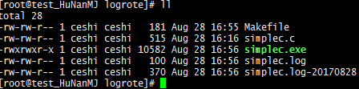
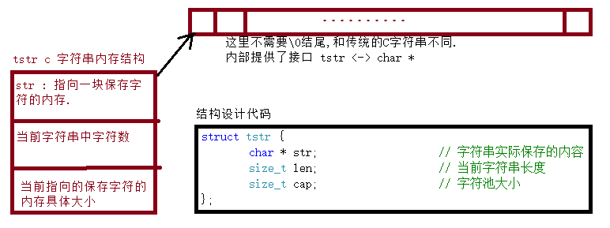
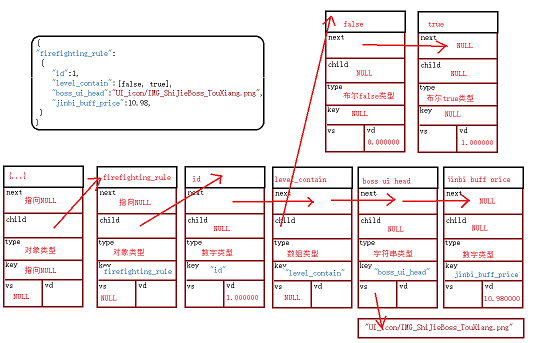
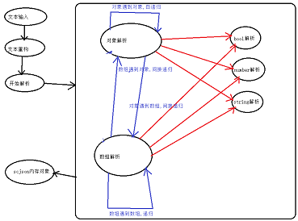

## 第4章-武技-常见轮子下三路

    本章是关于系统中常见轮子的介绍. 构建框架中最基础的组件. 也是参与战斗的最基层保障.
    当前定位是筑基期的顶阶武技, 融于了那些在妖魔大战中无数前辈们英魄构建的套路. 有章法
    的筑基, 厚积薄发, 一飞冲天. 此武技说不定让你成为战场上苟延残喘 小强 ┗|｀O′|┛ 嗷
    那开始出招吧 ~

### 4.1 那些年写过的日志库

    用过太多日志库轮子, 也写过不少. 见过漫天飞花, 也遇到过一个个地狱火撕裂天空, 最后选
    择了50行的 小小 日志库代码, 来表达所要的一切美好~ 越简单越优美越让人懂代码总会出彩.
    不是吗? 一个高性能的日志库突破点无外乎
        1. 缓存
        2. 无锁
        3. 定位
    随后会对这个日志武技轮子, 深入剖析

#### 4.1.1 小小 日志库, 详细设计

    先看接口设计部分, 感受下三个宏解决一切幺蛾子:

clog.h

```C
#ifndef _H_SIMPLEC_CLOG
#define _H_SIMPLEC_CLOG

#include "sctime.h"

//
// error info debug printf log  
//
#define CL_ERROR(fmt,	...)	CL_PRINTF("[ERROR]",	fmt, ##__VA_ARGS__)
#define CL_INFOS(fmt,	...)	CL_PRINTF("[INFOS]",	fmt, ##__VA_ARGS__)
#if defined(_DEBUG)
#define CL_DEBUG(fmt,	...)	CL_PRINTF("[DEBUG]",	fmt, ##__VA_ARGS__)
#else
#define CL_DEBUG(fmt,	...)	/*  (^_−)☆ */
#endif

//
// CLOG_PRINTF - 拼接构建输出的格式串,最后输出数据
// fstr		: 日志标识宏
// fmt		: 自己要打印的串,必须是双引号包裹. 
// return	: 返回待输出的串详细内容
//
#define CL_PRINTF(fstr, fmt, ...) \
	cl_printf(fstr "[%s:%s:%d]" fmt "\n", __FILE__, __func__, __LINE__, ##__VA_ARGS__)

//
// cl_start - !单例! 开启单机日志库
// path		: 初始化日志系统文件名
// return	: void
//
extern void cl_start(const char * path);

//
// cl_printf - 具体输出日志内容
// fmt		: 必须双引号包裹起来的串
// ...		: 对映fmt参数
// return	: void
//
void cl_printf(const char * fmt, ...);

#endif // !_H_SIMPLEC_CLOG
```

    clog.h 继承自 sctime.h, 唯一使用的就是 sctime.h 中得到根据格式串得到时间串

```C
//
// stu_getmstrn - 得到毫秒的串, 每个中间分隔符都是fmt[idx]
// buf		: 保存最终结果的串
// len		: 当前buf串长度
// fmt		: 输出格式串例如 -> "simplec-%04d%02d%02d-%02d%02d%02d-%03ld.log"
// return	: 返回当前串长度
//
size_t 
stu_getmstrn(char buf[], size_t len, const char * const fmt) {
	time_t t;
	struct tm st;
	struct timespec tv;

	timespec_get(&tv, TIME_UTC);
	t = tv.tv_sec;
	localtime_r(&t, &st);
	return snprintf(buf, len, fmt,
                    st.tm_year + _INT_YEAROFFSET, st.tm_mon + _INT_MONOFFSET, st.tm_mday,
                    st.tm_hour, st.tm_min, st.tm_sec,
                    tv.tv_nsec / _INT_MSTONS);
}
```

    得到带毫秒的时间串, 填充到日志的头部进行标识. 小小 核心构造原理如下展开:

```C
#include "clog.h"
#include <stdio.h>
#include <stdarg.h>
#include <stdlib.h>

//
// 急速, 清洁, 可靠配合 logrorate的 c多线程单机日志库 clog.h
//					by simplec wz 2017年4月26日
//

static FILE * _log;

inline void 
cl_start(const char * path) {
	if (NULL == _log) {
		_log = fopen(path, "ab");
		if (NULL == _log) {
			fprintf(stderr, "fopen ab err path = %s!\n", path);
			exit(EXIT_FAILURE);
		}
	}
}

void 
cl_printf(const char * fmt, ...) {
	va_list ap;
	size_t len;
	// 每条日志的大小, 唯一值
	char str[2048];

	// 串:得到时间串并返回长度 [2016-07-10 22:38:34 999]
	len = stu_getmstrn(str, sizeof(str), "[" _STR_MTIME "]");

	// 开始数据填充
	va_start(ap, fmt);
	vsnprintf(str + len, sizeof(str) - len, fmt, ap);
	va_end(ap);
	
	// 下数据到文本中
	fputs(str, _log);
}
```

    是不是很恐怖, 一个日志库完了. fputs 是系统内部打印函数, 默认自带缓冲机制. 缓冲说白
    了就是批量操作, 存在非及时性. vsnprintf 属于 printf 函数簇自带文件锁. 有兴趣的可以
    详细研究 printf, C 入门最早的学的函数, 也是最复杂的函数之一. 那目前就差生成业务了!
    也就是第三点定位, 这也是 小小 日志库的另一个高明之处, 借天罚来干妖魔鬼怪. 

### 4.1.2 小小 日志库, VT 二连

    先构建一下测试环境. 模拟一个妖魔大战的场景~ 嗖 ~ 切换到 linux 平台. 依次看下去

```C
#include <stdio.h>
#include <stdlib.h>
#include <unistd.h>

#define _TXT_PATH   "simplec.log"

// 
// logrotate hello world
//
int main(int argc, char * argv[]) {
    int id = 0;
    FILE * log = fopen(_TXT_PATH, "ab");
    if (NULL == log) {
        fputs("fopen ab err path = " _TXT_PATH  "!\n", stderr);
        exit(EXIT_FAILURE);
    }   
    
    // Ctrl + C 中断结束
    for (;;) {
        printf(_TXT_PATH " id = %d\n", id);
        fprintf(log, _TXT_PATH " id = %d\n", id);
        fflush(log);
        ++id;
        sleep(1);
    }   

    
    fclose(log);
    return EXIT_SUCCESS;    
}
```

    顺带给个编译文件 Makefile

```C
.PHONY : all clean

all : simplec.exe

clean :
    -rm -rf *~
    -rm -rf simplec.exe
    -rm -rf simplec.log simplec.log.* simplec.log-*

simplec.exe : simplec.c
    gcc -g -Wall -O2 -o $@ $^
```

    make
    ./simplec.exe

    按照上面操作开始持续输出日志. 有关试炼场的环境已经搭建成功. 那么是时候主角 T 
    logrotate  出来了. 我当前用的测试机是 centos, 那就以它举例, 看图:


    安装好上面工具, 那么 logrotate 日志轮询器就能够开始使用了. 推荐自己查相关手册,
    我这里只是简单弄个 Demo. Ok开始搞起来, 看下面所做的 shell 批处理:

```Bash
su root

cd /etc/logrotate.d
vi simplec

#
# 添加 logrotate 规则
# daily : 日志文件将按天轮循
# rotate 7 : 存档7次, 时间最久的删除
# dateext : 日志添加日期后缀名
# copytruncate : 复制截断, (懒得写 SIGHUP 信号处理解决方案)
# create 644 root root : 截断日志文件权限
#
# size = 100 : 测试用的, 超过100B就生成日志备份文件, 单位 K, M 默认B
#

i
/home/ceshi/wangzhi/logrote/simplec.log {
        daily
        rotate 7
        dateext
        copytruncate
        create 644 root root
        size = 100
}

Esc
:wq!

logrotate -vf /etc/logrotate.d/simplec

```

    最终所构建的结果如下:



    如果你有幸遇到贵人, 也只会给你一条路, 随后就是自己的双脚. 
    如果没有那么是时候 -> 冲冲冲, 四驱兄弟在心中 ~
    当然了 小小 VT二连之后, 可以再A一下. 那就利用自带的定时器了, cron 等等. 
    以后的事情那就留给以后自己做吧 ~
    这里教了最精简的优质日志库实战架构. 对于普通选手可能难以吹NB(说服别人), 因而这里
    会再来分析一波其它几种日志库的套路, 知彼知己才能又说又吃 ~

* 多用户日志库   

        这类日志库在上层语言构建的业务框架中有所出现. 最大特点是每条日志有个唯一标识码.
        通过唯一标识码能够分析出一条请求所经过的所有流程, 时间消耗等. 实现的核心思路: 
        消息来到网关服务器, 生成唯一的日志索引id, 保存在线程的私有变量中, 调到那个服务
        器发到那个服务器. 一套优秀的多用户日志库, 可以做到, 日志就能分析玩家所进行的一
        切操作. 当然后备还有一系列自动化运维的脚本工具支持. 总结就是业务能力最强, 
        性能最弱 ~

* 消息轮询日志库  

        这类日志库在游戏服务器中极其常见, 开个线程跑个日志消息队列. 它的一个应用场景,
        例如端游中大量日志打印, 运维备份的时候, 同步日志会将业务机卡死. 所以消息队列就
        出来缓存日志. 此类日志库可以秀一下代码功底, 毕竟线程轮询, 消息队列, 资源竞争,
        对象池, 日志构建所有的业务都需要有. 个人看法它很俗外加太重. 哪有摘叶伤人来的快
        速呀. 其缓冲层消息队列, 还不一定比不进行 fflush 的系统层面输出接口来的直接. 而
        且启动了个单独线程处理日志, 那么就一定重度依赖对象池. 一环套一环, 收益很普通~ 
        业务设计的时候一条准则是 能不用线程就别用. 因为我们没钱~ 
        线程不便宜 且 小脾气可大了. 

        到这也扯的差不多了, 如果以后和人交流的时候, 被问到这个日志库为什么高效. 记住
            1. 无锁编程, 利用 fprintf IO锁
            2. fputs 最大限度的利用系统 IO缓冲层, 没必要 fflush, 从消息队列角度分析
            3. 万剑一, 小小 日志库只负责写, 其它交给系统层面最屌的工具搞. 定位专业
            ... 

### 4.2 开胃点心, 高效随机数库

    为什么来个随机数库呢, 因为不同平台的随机数实现不一样, 导致期望结果不一样. 顺便给系统
    函数提提速. 随机函数对于计算机行业真不得了, 奠定了人类模拟未知的一种可能. 顺带扯一点
    概率分析学上一种神奇的事情是: "概率为0的事情, 也可能发生~". 还是有点哈哈. 数学的本源
    不是为了解决具体遇到问题, 多数是人内部思维的升华 -> 自己爽就行了. 就如同这个时代最强
    数学家俄罗斯的[格里戈里·佩雷尔曼]渡劫真君, 嗨了一发就影响来了整个人类思维的跳跃. 

    我们的随机函数算法是从 redis源码上拔下来的, redis是从 pysam源码上拔下来. 也只能说是
    薪火相传, 生生不息 哭~ 首先看接口设计

scrand.h

```C
#ifndef _H_SIMPLEC_SCRAND
#define _H_SIMPLEC_SCRAND

#include <stdint.h>

//
// sh_srand - 初始化随机数种子, (int32_t)time(NULL)
// seed		: 种子数
// return	: void
//
extern void sh_srand(int32_t seed);

//
// sh_rand  - 得到[0, INT32_MAX]随机数
// sh_rands - 得到[min, max] 范围内随机数
// sh_randk - 得到一个64位的key
//
extern int32_t sh_rand(void);
extern int32_t sh_rands(int32_t min, int32_t max);
extern int64_t sh_randk(void);

#endif//_H_SIMPLEC_SCRAND
```

    最核心是 sh_rand 函数实现, 阅读理解来了, 感受下离散数学的魅力

scrand.c

```C
#include <scrand.h>
#include <assert.h>

#define N               (16)
#define MASK            ((1 << N) - 1)
#define LOW(x)          ((x) & MASK)
#define HIGH(x)         LOW((x) >> N)
#define CARRY(x, y)     ((x + y) > MASK) // 二者相加是否进位, 基于16位
#define ADDEQU(x, y, z)	z = CARRY(x, y); x = LOW(x + y)

#define MUL(x, y, z)	l = (x) * (y); (z)[0] = LOW(l); (z)[1] = HIGH(l)

#define X0              (0x330E)
#define X1              (0xABCD)
#define X2              (0x1234)
#define A0              (0xE66D)
#define A1              (0xDEEC)
#define A2              (0x0005)
#define C               (0x000B)

static uint32_t _x[] = { X0, X1, X2 }, _a[] = { A0, A1, A2 }, _c = C;

static void _sh_next(void) {
	uint32_t p[2], q[2], r[2], c0, c1, l;

	MUL(_a[0], _x[0], p);
	ADDEQU(p[0], _c, c0);
	ADDEQU(p[1], c0, c1);
	MUL(_a[0], _x[1], q);
	ADDEQU(p[1], q[0], c0);
	MUL(_a[1], _x[0], r);
	
	l = c0 + c1 + CARRY(p[1], r[0]) + q[1] + r[1]
		+ _a[0] * _x[2] + _a[1] * _x[1] + _a[2] * _x[0];
	_x[2] = LOW(l);
	_x[1] = LOW(p[1] + r[0]);
	_x[0] = LOW(p[0]);
}

//
// sh_srand - 初始化随机数种子, (int32_t)time(NULL)
// seed		: 种子数
// return	: void
//
inline void 
sh_srand(int32_t seed) {
	_x[0] = X0; _x[1] = LOW(seed); _x[2] = HIGH(seed);
	_a[0] = A0; _a[1] = A1; _a[2] = A2;
	_c = C;
}

//
// sh_rand  - 得到[0, INT32_MAX]随机数
// sh_rands - 得到[min, max] 范围内随机数
// sh_randk - 得到一个64位的key
//
inline int32_t 
sh_rand(void) {
	_sh_next();
	return (_x[2] << (N - 1)) + (_x[1] >> 1);
}

inline int32_t 
sh_rands(int32_t min, int32_t max) {
	assert(max > min);
	return sh_rand() % (max - min + 1) + min;
}

inline int64_t 
sh_randk(void) {
	uint64_t x = ((sh_rand() << N) ^ sh_rand()) & INT32_MAX;
	uint64_t y = ((sh_rand() << N) ^ sh_rand()) & INT32_MAX;
	return ((x << 2 * N) | y) & INT64_MAX;
}
```

    (为什么成篇的刷代码, 方便你一个个对着敲到你的电脑中, 也方便你找出作者错误 ~)
    代码都懂, _sh_next计算复杂点. 之后就看自己悟了, 毕竟世界也是咱们的. sh_rands, 
    sh_randk 思路很浅显分别根据范围和位随机. 从上面可以看出来随机函数并不是线程安全的.
    在多线程环境中就会出现未知行为了(至少咱们不清楚). 这样也很有意思, 毕竟不可控的随机
    才有点随机吗? 
    
    不怕折腾可以把上面代码直接刷到你的项目中, 解决随机数的平台无关性 ~
    目前 winds 和 linux 测试结果如下:

```C
/*
 describe:
	1亿的数据量, 测试随机生成函数
	front system rand, back sh_rand rand
 
 test code

 // 1亿的数据测试
 #define _INT_TEST	(100000000)
 
 static int _test_rand(int (* trand)(void)) {
 	 int rd = 0;
 	 for (int i = 0; i < _INT_TEST; ++i)
 	 	rd = trand();
 	 return rd;
 }

 winds test :
	cl version 14 Visual Studio 2015 旗舰版(Window 10 专业版)

	Debug
	The current code block running time:1.743000 seconds
	The current code block running time:4.408000 seconds

	Release
	The current code block running time:1.649000 seconds
	The current code block running time:0.753000 seconds

 linux test : 
	gcc version 6.3.0 20170406 (Ubuntu 6.3.0-12ubuntu2)
	-g -O2
	The current code block running time:0.775054 seconds
	The current code block running time:0.671887 seconds
 */
``` 

    到这基本前戏做的够足了, 奥特曼要出现了 ~

### 4.3 奥特曼, 通用头文件构建

    在实战项目中, 都会有个出现频率特别高的一个头文件, 项目中基本每个头文件都继承自它.
    同样此刻出现的就是筑基期至强奥义, 一切从头开始
    
schead.h

```C
#ifndef _H_SIMPLEC_SCHEAD
#define _H_SIMPLEC_SCHEAD

#include "clog.h"
#include "scrand.h"
#include "struct.h"
#include <pthread.h>

//
//  宏就是C的金字塔最底层, 所有丑陋的起源~
//  [ __clang__ -> clang | __GNUC__ -> gcc | __MSC_VER -> cl ]
//
#ifdef __GNUC__

#include <termio.h>
#include <sys/stat.h>
#include <sys/types.h>

/*
 * 屏幕清除宏, 依赖系统脚本
 *  return	: void
 */
#define sh_cls() \
		printf("\ec")

//
// getch - 立即得到用户输入的一个字符, linux实现
// return	: 返回得到字符
//
extern int getch(void);

//
// sh_mkdir - 通用的单层目录创建宏 等同于 shell> mkdir path
// path		: 目录路径加名称
// return	: 0表示成功, -1表示失败, 失败原因都在 errno
// 
#define sh_mkdir(path) \
	mkdir(path, S_IRWXU | S_IRWXG | S_IROTH | S_IXOTH)

#elif _MSC_VER

#include <direct.h> 
#include <conio.h>

#define sh_cls() \
		system("cls")

#define sh_mkdir(path) \
	mkdir(path)

#else
#	error "error : Currently only supports the Best New CL and GCC!"
#endif

// 添加双引号的宏 
#define _STR(v) #v
#define CSTR(v)	_STR(v)

// 获取数组长度,只能是数组类型或""字符串常量,后者包含'\0'
#define LEN(a) (sizeof(a) / sizeof(*(a)))

// 置空操作, v必须是个变量
#define BZERO(v) \
	memset(&(v), 0, sizeof(v))

/*
 * 比较两个结构体栈上内容是否相等,相等返回true,不等返回false
 * a	: 第一个结构体值
 * b	: 第二个结构体值
 *		: 相等返回true, 否则false
 */
#define STRUCTCMP(a, b) (!memcmp(&a, &b, sizeof(a)))

//
// EXTERN_RUN - 简单的声明, 并立即使用的宏
// test		: 需要执行的函数名称
//
#define EXTERN_RUN(test, ...) \
	do { \
		extern void test(); \
		test (__VA_ARGS__); \
	} while(0)

// 简单的time时间记录宏
#define TIME_PRINT(code) \
	do { \
		clock_t $s, $e; \
		$s = clock(); \
		code \
		$e = clock(); \
		printf("Now code run time:%lfs.\n", ((double)$e - $s) / CLOCKS_PER_SEC); \
	} while (0)

//
// sh_pause - 等待的宏 是个单线程没有加锁 | "请按任意键继续. . ."
// return	: void
//
extern void sh_pause(void);

#ifndef SH_PAUSE

#	ifdef _DEBUG
#		define SH_PAUSE() atexit(sh_pause)
#	else
#		define SH_PAUSE() /* 别说了, 都重新开始吧 */
#	endif

#endif // !INIT_PAUSE

//
// sh_isbe - 判断是大端序还是小端序,大端序返回true
// sh_hton - 将本地四字节数据转成'小端'网络字节
// sh_ntoh - 将'小端'网络四字节数值转成本地数值
//
extern bool sh_isbe(void);
extern uint32_t sh_hton(uint32_t x);
extern uint32_t sh_ntoh(uint32_t x);

//
// async_run - 开启一个自销毁的线程 运行 run
// run		: 运行的主体
// arg		: run的参数
// return	: >= SufBase 表示成功
//
extern int async_run_(node_f run, void * arg);
#define async_run(run, arg) \
		async_run_((node_f)(run), arg)

#endif//_H_SIMPLEC_SCHEAD
```

    可以看出来, 头文件包含是一种继承关系. 基本每一个包含了 schead.h 的文件, 都不用
    再包含其它的辅助文件, 开发起来会很方便. 额外说一下 getch 这个函数: 

```C
#if defined(__GNUC__)

inline int 
getch(void) {
	int cr;
	struct termios nts, ots;
	if (tcgetattr(0, &ots) < 0) // 得到当前终端(0表示标准输入)的设置
		return EOF;

	nts = ots;
	cfmakeraw(&nts); // 设置终端为Raw原始模式，该模式下所有的输入数据以字节为单位被处理
	if (tcsetattr(0, TCSANOW, &nts) < 0) // 设置上更改之后的设置
		return EOF;

	cr = getchar();
	if (tcsetattr(0, TCSANOW, &ots) < 0) // 设置还原成老的模式
		return EOF;
	return cr;
}

#endif
```

    很久以前一位化神期巨擘说过: 由于 linux对于 getch支持不友好, 导致了 linux错失了很多
    游戏开发人员. 我是挺喜欢 getch的, 写个小游戏太轻松了. 就顺手补上了.
    其它的辅助函数:

```C
inline void 
sh_pause(void) {
    rewind(stdin);
	fflush(stderr); fflush(stdout);
	printf("Press any key to continue . . .");
	getch();
}

inline bool 
sh_isbe(void) {
	static union { uint16_t i; uint8_t c; } _u = { 1 };
	return 0 == _u.c;
}

inline uint32_t 
sh_hton(uint32_t x) {
	if (sh_isbe()) {
		uint8_t t;
		union { uint32_t i; uint8_t s[sizeof(uint32_t)]; } u = { x };
		t = u.s[0], u.s[0] = u.s[sizeof(u) - 1], u.s[sizeof(u) - 1] = t;
		t = u.s[1], u.s[1] = u.s[sizeof(u) - 1 - 1], u.s[sizeof(u) - 1 - 1] = t;
		return u.i;
	}
	return x;
}

inline uint32_t 
sh_ntoh(uint32_t x) {
	return sh_hton(x);
}
```

    说一下 sh_isbe, 它是判断当前系统是否是大端系统, 是返回 true. 而多数接触的是小端
    机器, 所以自己设计了个 sh_hton 如果是大端结构会转成小端结构. 这样减少转换频率.
    sh_pause 相似功能在 winds上面是 system("pause"), 在 linux 是 pause(). 用起来
    不爽, 顺带为了方便 DEBUG 测试, 搞了个 SH_PAUSE(). schead.h 接口文件定位目标是
    所有业务层面的辅助头文件. 美好从此刻开始 ~
    
    新的风暴已经出现 怎么能够停滞不前 穿越时空竭尽全力 我会来到你身边

### 4.4 C 来个 Json 轮子

    在我刚做开发的时候, 那时候维护的系统, 所有配置走的是 xml 和 csv. 刚好 json 在国内
    刚兴起, 所以一时兴起写了一个解释器. 过了1年接触到 cJSON库, 直接把自己当初写的那个删
    了. 用起了 cJSON, 后面觉得 cJSON 真的丑的不行不行, 就琢磨写了个简单的 scjson. 
    这小节, 就带大家写写这个 scjson 的解析引擎, 清洁高效小. 能够保证的就是比 cJSON好.

    首先大概分析 scjson 的实现部分. 最关心的是 scjson的内存布局, 这里引入了 tstr 布局.
    设计结构图如下 :



    str 指向内存常变, tstr指向内存不怎么变. 所以采用两块内存保存. tstr 存在目的是个中转
    站. 因为读取文件内容, 中间 json 内容去注释, 压缩需要一块内存. 这就是引入 tstr目的.

    再看看 scjson 结构代码设计:

```C
struct cjson {
	struct cjson * next;	// 采用链表结构处理, 放弃二叉树结构, 优化内存
	struct cjson * child;	// type == ( CJSON_ARRAY or CJSON_OBJECT ) 那么 child 就不为空

	unsigned char type;     // 数据类型 CJSON_XXXX, 一个美好的意愿
	char * key;             // json内容那块的 key名称 	
	union {
		char * vs;      // type == CJSON_STRING, 是一个字符串 	
		double vd;      // type == CJSON_NUMBER, 是一个num值, ((int)c->vd) 转成int 或 bool
	};
};

//定义cjson_t json类型
typedef struct cjson * cjson_t;
```

    使用 c99的匿名结构体挺爽的, 整个内存详细布局如下:



    scjson 中处理的类型类型无外乎:

```C
// json中几种数据结构和方式定义, 对于程序开发而言最难的还是理解思路(思想 or 业务)
#define CJSON_NULL      (0u << 0)
#define CJSON_FALSE     (1u << 0)
#define CJSON_TRUE      (1u << 1)
#define CJSON_NUMBER    (1u << 2)
#define CJSON_STRING    (1u << 3)
#define CJSON_ARRAY     (1u << 4)
#define CJSON_OBJECT    (1u << 5)

//
// cjson_getint - 这个宏, 协助我们得到 int 值
// item		: 待处理的目标cjson_t结点
// return	: int
//
#define cjson_getvi(item) ((int)((item)->vd))
```

    以上就是解析之后的具体结构类型. 下面简单分析一下文本解析规则.



    思路是递归下降分析. 到这里基本关于 scjson详细设计图介绍完毕了.
    后面会看见这只麻雀代码极少 ヽ(✿ﾟ▽ﾟ)ノ

#### 4.4.1 scjson 详细设计

    当初写这类东西, 就是对着协议文档开撸 ~
    这类代码是协议文档和作者思路的杂糅体, 推荐最好手敲一遍, 自行加注释, 琢磨后吸收.
    来看看删除函数

```C
//
// cjson_delete - 删除json串内容  
// c		: 待释放json_t串内容
// return	: void
//
void 
cjson_delete(cjson_t c) {
	while (c) {
		cjson_t next = c->next;
		// 放弃引用和常量的优化选项
		free(c->key);
		if (c->type & CJSON_STRING)
			free(c->vs);
		// 递归删除子节点
		if (c->child)
			cjson_delete(c->child);
		free(c);
		c = next;
	}
}
```

    一直到此刻我们一直直接使用 malloc 和 free. 没有提供自定义分配器接口. 其实这个很好
    扩展, 后期自己可以内嵌个 jemalloc 传说中最屌的内存分配器. 全局宏替换, 或者直接包
    装层再全局搞. 
    上面操作无外乎就是递归找到最下面的儿子结点, 期间删除自己挂载的结点. 然后依次按照 
    next 链表顺序循环执行. 随后通过代码逐个分析思维过程, 例如我们得到一个 json串, 
    这个串中可能存在多余的空格, 多余的注释等. 就需要做洗词的操作, 只留下最有用的
    json 字符串 :

```C
//  将 jstr中 不需要解析的字符串都去掉, 返回压缩后串的长度. 并且纪念mini 比男的还平
static size_t _cjson_mini(char * jstr) {
	char c, * in = jstr, * to = jstr;

	while ((c = *to)) {
		// step 1 : 处理字符串
		if (c == '"') {
			*in++ = c;
			while ((c = *++to) && (c != '"' || to[-1] == '\\'))
				*in++ = c;
			if (c) {
				*in++ = c;
				++to;
			}
			continue;
		}
		// step 2 : 处理不可见特殊字符
		if (c < '!') {
			++to;
			continue;
		}
		if (c == '/') {
			// step 3 : 处理 // 解析到行末尾
			if (to[1] == '/') {
				while ((c = *++to) && c != '\n')
					;
				continue;
			}

			// step 4 : 处理 /*
			if (to[1] == '*') {
				while ((c = *++to) && (c != '*' || to[1] != '/'))
					;
				if (c)
					to += 2;
				continue;
			}
		}
		// step 5 : 合法数据直接保存
		*in++ = *to++;
	}

	*in = '\0';
	return in - jstr;
}
```

    上面操作主要目的是让解析器能够处理 json串中 // 和 /**/, 并删除些不可见字符.
    开始上真正的解析器入口函数 :

```C
// 递归下降分析 需要声明这些函数
static const char * _parse_value(cjson_t item, const char * str);
static const char * _parse_array(cjson_t item, const char * str);
static const char * _parse_object(cjson_t item, const char * str);

//构造一个空 cjson 对象
static inline cjson_t _cjson_new(void) {
	cjson_t node = malloc(sizeof(struct cjson));
	if (NULL == node)
		CERR_EXIT("malloc struct cjson is null!");
	return memset(node, 0, sizeof(struct cjson));
}

// jstr 必须是 _cjson_mini 解析好的串
static cjson_t _cjson_parse(const char * jstr) {
	const char * end;
	cjson_t json = _cjson_new();

	if (!(end = _parse_value(json, jstr))) {
		cjson_delete(json);
		RETURN(NULL, "_parse_value params end = %s!", end);
	}

	return json;
}

//
// cjson_newxxx - 通过特定源, 得到内存中json对象
// str		: 普通格式的串
// tstr		: tstr_t 字符串, 成功后会压缩 tstr_t
// path		: json 文件路径
// return	: 解析好的 json_t对象, 失败为NULL
//
inline cjson_t 
cjson_newstr(const char * str) {
	cjson_t json;
	TSTR_CREATE(tstr);
	tstr_appends(tstr, str);

	_cjson_mini(tstr->str);
	json = _cjson_parse(tstr->str);

	TSTR_DELETE(tstr);
	return json;
}
```

    从 cjson_newstr看起, 声明了栈上字符串 tstr填充 str, 随后进行 _cjson_mini洗词, 然后
    通过 _cjson_parse 解析最终结果返回. 随后可以看哈 _cjson_parse 实现, 非常好理解, 本
    质就是走分支. 不同分支走不同的解析函数:

```C
// 将 value 转换塞入 item json 值中一部分
static const char * 
_parse_value(cjson_t item, const char * str) {
	char c = '\0'; 
	if ((str) && (c = *str)) {
		switch (c) {
		// n = null, f = false, t = true ... 
		case 'n' : return item->type = CJSON_NULL, str + 4;
		case 'f' : return item->type = CJSON_FALSE, str + 5;
		case 't' : return item->type = CJSON_TRUE, item->vd = 1.0, str + 4;
		case '\"': return _parse_string(item, str);
		case '0' : case '1' : case '2' : case '3' : case '4' : case '5' :
		case '6' : case '7' : case '8' : case '9' :
		case '+' : case '-' : case '.' : return _parse_number(item, str);
		case '[' : return _parse_array(item, str);
		case '{' : return _parse_object(item, str);
		}
	}
	// 循环到这里是意外 数据
	RETURN(NULL, "params value = %c, %s!", c, str);
}
```

    肉眼层面的协议处理了, 像 MSGPACK 就是对上面 n f ... { 扩展成1字节内数值. 核心原理
    还是一样. 看下 _parse_string 处理, 内嵌了 utf8 字符处理会感觉套路长一点点

```C
// parse 4 digit hexadecimal number
static unsigned _parse_hex4(const char str[]) {
	unsigned c, h = 0, i = 0;
	// 开始转换16进制
	for(;;) {
		c = *str;
		if (c >= '0' && c <= '9')
			h += c - '0';
		else if (c >= 'A' && c <= 'F')
			h += 10 + c - 'A';
		else if (c >= 'a' && c <= 'z')
			h += 10 + c - 'a';
		else
			return 0;
		// shift left to make place for the next nibble
		if (4 == ++i)
			break;
		h <<= 4;
		++str;
	}

	return h;
}

// 分析字符串的子函数,
static const char * _parse_string(cjson_t item, const char * str) {
	static unsigned char _marks[] = { 0x00, 0x00, 0xC0, 0xE0, 0xF0, 0xF8, 0xFC };
	const char * ptr;
	char c, * nptr, * out;
	unsigned len = 1, uc, nuc;

	// 检查是否是字符串内容, 并记录字符串大小
	if (*str != '\"')
		RETURN(NULL, "need \\\" str => %s error!", str);
	for (ptr = str + 1; (c = *ptr++) != '\"' && c; ++len)
		if (c == '\\') {
			//跳过转义字符
			if (*ptr == '\0')
				RETURN(NULL, "ptr is end len = %d.", len);
			++ptr;
		}
	if (c != '\"')
		RETURN(NULL, "need string \\\" end there c = %d, %c!", c, c);

	// 这里开始复制拷贝内容
	if (!(nptr = out = malloc(len)))
		CERR_EXIT("calloc size = %d is error!", len);
	for (ptr = str + 1; (c = *ptr) != '\"' && c; ++ptr) {
		if (c != '\\') {
			*nptr++ = c;
			continue;
		}
		// 处理转义字符
		switch ((c = *++ptr)) {
		case 'b': *nptr++ = '\b'; break;
		case 'f': *nptr++ = '\f'; break;
		case 'n': *nptr++ = '\n'; break;
		case 'r': *nptr++ = '\r'; break;
		case 't': *nptr++ = '\t'; break;
		case 'u': // 将utf16 => utf8, 专门的utf处理代码
			uc = _parse_hex4(ptr + 1);
			ptr += 4; //跳过后面四个字符, unicode
			if (0 == uc || (uc >= 0xDC00 && uc <= 0xDFFF))
				break;	/* check for invalid. */

			if (uc >= 0xD800 && uc <= 0xDBFF) { /* UTF16 surrogate pairs. */
				if (ptr[1] != '\\' || ptr[2] != 'u')	
					break;	/* missing second-half of surrogate. */
				nuc = _parse_hex4(ptr + 3);
				ptr += 6;
				if (nuc < 0xDC00 || nuc>0xDFFF)		
					break;	/* invalid second-half of surrogate.	*/
				uc = 0x10000 + (((uc & 0x3FF) << 10) | (nuc & 0x3FF));
			}

			if (uc < 0x80)
				len = 1;
			else if (uc < 0x800)
				len = 2;
			else if (uc < 0x10000)
				len = 3;
			else
				len = 4;
			nptr += len;

			switch (len) {
			case 4: *--nptr = ((uc | 0x80) & 0xBF); uc >>= 6;
			case 3: *--nptr = ((uc | 0x80) & 0xBF); uc >>= 6;
			case 2: *--nptr = ((uc | 0x80) & 0xBF); uc >>= 6;
			case 1: *--nptr = (uc | _marks[len]);
			}
			nptr += len;
			break;
		default: *nptr++ = c;
		}
	}
	*nptr = '\0';
	item->vs = out;
	item->type = CJSON_STRING;
	return ++ptr;
}
```

    编码转换非内幕人员多数只能看看. 扯一点, 很久以前对于编码解决方案. 采用的是 libiconv 
    方案, 将其移植到 winds上. 后面学到一招, 因为国内开发最多的需求就是 gbk 和 utf-8 国际
    标准的来回切. 那就直接把这个编码转换的算法拔下来, 岂不最好~

> 引述一丁点维基百科 UTF-8 编码字节含义:  
>  
> 对于UTF-8编码中的任意字节B，如果B的第一位为0，则B独立的表示一个字符(ASCII码)；  
> 如果B的第一位为1，第二位为0，则B为一个多字节字符中的一个字节(非ASCII字符)；  
> 如果B的前两位为1，第三位为0，则B为两个字节表示的字符中的第一个字节；  
> 如果B的前三位为1，第四位为0，则B为三个字节表示的字符中的第一个字节；  
> 如果B的前四位为1，第五位为0，则B为四个字节表示的字符中的第一个字节；  
>  
> 因此，对UTF-8编码中的任意字节，根据第一位，可判断是否为ASCII字符；根据前二位，  
> 可判断该字节是否为一个字符编码的第一个字节；根据前四位（如果前两位均为1），  
> 可确定该字节为字符编码的第一个字节，并且可判断对应的字符由几个字节表示；  
> 根据前五位（如果前四位为1），可判断编码是否有错误或数据传输过程中是否有错误。 

    最后一个前戏呼之欲出了, 字符串转 number

```C
// 分析数值的子函数,写的可以
static const char * _parse_number(cjson_t item, const char * str) {
	double n = .0, ns = 1.0, nd = .0; // ns表示开始正负, 负为-1, nd表示小数后面位数
	int e = 0, es = 1; // e表示后面指数, es表示 指数的正负, 负为-1
	char c;

	if ((c = *str) == '-' || c == '+') {
		ns = c == '-' ? -1.0 : 1.0; // 正负号检测, 1表示负数
		++str;
	}
	// 处理整数部分
	for (c = *str; c >= '0' && c <= '9'; c = *++str)
		n = n * 10 + c - '0';
	if (c == '.')
		for (; (c = *++str) >= '0' && c <= '9'; --nd)
			n = n * 10 + c - '0';

	// 处理科学计数法
	if (c == 'e' || c == 'E') {
		if ((c = *++str) == '+') //处理指数部分
			++str;
		else if (c == '-')
			es = -1, ++str;
		for (; (c = *str) >= '0' && c <= '9'; ++str)
			e = e * 10 + c - '0';
	}

	//返回最终结果 number = +/- number.fraction * 10^+/- exponent
	item->vd = ns * n * pow(10.0, nd + es * e);
	item->type = CJSON_NUMBER;
	return str;
}
```

    最后就到了重头戏, 递归下降分析的两位主角了 _parse_array 和 _parse_object 

```C
// 分析数组的子函数, 采用递归下降分析
static const char * 
_parse_array(cjson_t item, const char * str) {
	cjson_t child;

	if (*str != '[') {
		RETURN(NULL, "array str error start: %s.", str);
	}

	item->type = CJSON_ARRAY;
	if (*++str == ']') // 低估提前结束, 跳过']'
		return str + 1;

	item->child = child = _cjson_new();
	str = _parse_value(child, str);
	if (NULL == str) {
		RETURN(NULL, "array str error e n d one: %s.", str);
	}

	while (*str == ',') {
		// 支持行尾处理多余 ','
		if (str[1] == ']')
			return str + 1;

		// 写代码是一件很爽的事
		child->next = _cjson_new();
		child = child->next;
		str = _parse_value(child, str + 1);
		if (NULL == str) {
			RETURN(NULL, "array str error e n d two: %s.", str);
		}
	}

	if (*str != ']') {
		RETURN(NULL, "array str error e n d: %s.", str);
	}
	return str + 1;
}
```

    处理的格式 '[ ... , ... , ... ]'. 
    同样处理 object 格式如下 ' { "str":..., "str":..., ... } '

```C
// 分析对象的子函数
static const char * 
_parse_object(cjson_t item, const char * str) {
	cjson_t child;

	if (*str != '{') {
		RETURN(NULL, "object str error start: %s.", str);
	}

	item->type = CJSON_OBJECT;
	if (*++str == '}')
		return str + 1;

	//处理结点, 开始读取一个 key
	item->child = child = _cjson_new();
	str = _parse_string(child, str);
	if (!str || *str != ':') {
		RETURN(NULL, "_parse_string is error : %s!", str);
	}
	child->key = child->vs;

	child->vs = NULL;
	str = _parse_value(child, str + 1);
	if (!str) {
		RETURN(NULL, "_parse_value is error 2!");
	}

	// 递归解析
	while (*str == ',') {
		// 支持行尾处理多余 ','
		if (str[1] == '}')
			return str + 1;

		child->next = _cjson_new();
		child = child->next;
		str = _parse_string(child, str + 1);
		if (!str || *str != ':'){
			RETURN(NULL, "_parse_string need name or no equal ':' %s.", str);
		}
		child->key = child->vs;

		child->vs = NULL;
		str = _parse_value(child, str+1);
		if (!str) {
			RETURN(NULL, "_parse_value need item two ':' %s.", str);
		}
	}

	if (*str != '}') {
		RETURN(NULL, "object str error e n d: %s.", str);
	}
	return str + 1;
}
```

    关于 json 串的解析部分就完工了. 核心是学习递归下降分析的套路, 一个间接递归套路.
    通过上面的思路, 花些心思也可以构建出 json对象转 json串的思路. 或者写个小型计算
    器等等. 有了 json 的处理库, 有没有感觉基础的业务都能轻松胜任了哈哈.

#### 4.5 阅读理解环节, csv解析库

    很久以前桌面项目配置文件基本都走 csv文件配置. 采用 ',' 分隔. 同 excel表格形式.
    维护人员通过 notepad++ or excel 编辑操作. 程序人员直接读取开撸. 展示个自己写的
    解决方案, 灰常节约内存. 首先展示 interface:

scscv.h

```C
#ifndef _H_SIMPLEC_SCCSV
#define _H_SIMPLEC_SCCSV

//
// 这里是一个解析 csv 文件的 简单解析器.
// 它能够帮助我们切分文件内容, 保存在字符串数组中.
//
typedef struct sccsv {          //内存只能在堆上
	int rlen;               //数据行数,索引[0, rlen)
	int clen;               //数据列数,索引[0, clen)
	const char * data[];    //保存数据一维数组,希望他是二维的 rlen*clen
} * sccsv_t;

//
// 从文件中构建csv对象, 最后需要调用 sccsv_delete 释放
// path		: csv文件内容
// return	: 返回构建好的 sccsv_t 对象
//
extern sccsv_t sccsv_create(const char * path);

//
// 释放由sccsv_create构建的对象
// csv		: sccsv_create 返回对象
//
extern void sccsv_delete(sccsv_t csv);

//
// 获取某个位置的对象内容
// csv		: sccsv_t 对象, new返回的
// ri		: 查找的行索引 [0, csv->rlen)
// ci		: 查找的列索引 [0, csv->clen)
// return	: 返回这一项中内容,后面可以用 atoi, atof, tstr_dup 等处理了...
//
extern const char * sccsv_get(sccsv_t csv, int ri, int ci);

#endif // !_H_SIMPLEC_SCCSV
```

    这里我们只提供了读接口, 比较有特色的思路是. sccsv_t 我们采用一整块内存构建. 非常
    爽. 

```C
#include "sccsv.h"
#include "tstr.h"

//从文件中读取 csv文件内容, 构建一个合法串
static bool _csv_parse(tstr_t tstr, int * prl, int * pcl) {
	int c = -1, n = -1;
	int cl = 0, rl = 0;
	char * sur = tstr->str, * tar = tstr->str;

	while (!!(c = *tar++)) {
		// 小型状态机切换, 相对于csv文件内容解析
		switch (c) {
		case '"': // 双引号包裹的特殊字符处理
			while (!!(c = *tar++)) {
				if ('"' == c) {
					if ((n = *tar) == '\0') // 判断下一个字符
						goto _faild;
					if (n != '"') // 有效字符再次压入栈, 顺带去掉多余 " 字符
						break;
					++tar;
				}

				// 添加得到的字符
				*sur++ = c;
			}
			// 继续判断,只有是c == '"' 才会下来,否则都是错的
			if ('"' != c)
				goto _faild;
			break;
		case ',':
			*sur++ = '\0';
			++cl;
			break;
		case '\r':
			break;
		case '\n':
			*sur++ = '\0';
			++cl;
			++rl;
			break;
		default: // 其它所有情况只添加数据就可以了
			*sur++ = c;
		}
	}
	
	if (cl % rl) { // 检测 , 号是个数是否正常
	_faild:
		RETURN(false, "now csv error c = %d, n = %d, cl = %d, rl = %d.", c, n, cl, rl);
	}
	
	// 返回最终内容
	*prl = rl;
	*pcl = cl;
	// 构建最终处理的串内容
	tstr->len = sur - tstr->str + 1;
	tstr->str[tstr->len - 1] = '\0';
	return true;
}

// 将 _csv_get 得到的数据重新构建返回, 执行这个函数认为语法检测都正确了
static sccsv_t _csv_create(tstr_t tstr) {
	sccsv_t csv;
	size_t pdff;
	char * cstr;
	int rl, cl, i;
	if (!_csv_parse(tstr, &rl, &cl))
		return NULL;

	// 分配最终内存
	pdff = sizeof(struct sccsv) + sizeof(char *) * cl;
	csv = malloc(pdff + tstr->len);
	if (NULL == csv) {
		RETURN(NULL, "malloc error cstr->len = %zu, rl = %d, cl = %d.", tstr->len, rl, cl);
	}

	// 这里开始拷贝内存, 构建内容了
	cstr = (char *)csv + pdff;
	memcpy(cstr, tstr->str, tstr->len);
	csv->rlen = rl;
	csv->clen = cl / rl;
	i = 0;
	do {
		csv->data[i] = cstr;
		while(*cstr++) // 找到下一个位置处
			;
	} while(++i < cl);
	
	return csv;
}

//
// 从文件中构建csv对象, 最后需要调用 sccsv_delete 释放
// path		: csv文件内容
// return	: 返回构建好的 sccsv_t 对象
//
sccsv_t
sccsv_create(const char * path) {
	sccsv_t csv;
	tstr_t tstr = tstr_freadend(path);
	if (NULL == tstr) {
		RETURN(NULL, "tstr_freadend path = %s is error!", path);
	}

	// 如果解析 csv 文件内容失败直接返回
	csv = _csv_create(tstr);

	tstr_delete(tstr);
	// 返回最终结果
	return csv;
}

//
// 释放由sccsv_create构建的对象
// csv		: sccsv_new 返回对象
//
inline void 
sccsv_delete(sccsv_t csv) {
	free(csv);
}

//
// 获取某个位置的对象内容
// csv		: sccsv_t 对象, new返回的
// ri		: 查找的行索引 [0, csv->rlen)
// ci		: 查找的列索引 [0, csv->clen)
// return	: 返回这一项中内容,后面可以用 atoi, atof, tstr_dup 等处理了...
//
inline const char * 
sccsv_get(sccsv_t csv, int ri, int ci) {
	DEBUG_CODE({
		if (!csv || ri < 0 || ri >= csv->rlen || ci < 0 || ci >= csv->clen) {
			RETURN(NULL, "params is csv:%p, ri:%d, ci:%d.", csv, ri, ci);
		}
	});

	// 返回最终结果
	return csv->data[ri * csv->clen + ci];
}
```

    核心重点在 _csv_parse 和 _csv_create 上面. 前者负责预建内存布局, 后者负责构建内
    存. 代码很短, 但却很有效不是吗~ 
    希望上面的阅读理解你能喜欢~

### 4.6 筑基展望

    妖魔战场逐渐急促起来, 我们筑基期顶天功法也就介绍到此. 数据结构算法可能要勤学苦练,
    这些轮子基本都是3遍过, 战无不利, 终身会用. 本章多数在抠细节, 协助熟悉常用基础轮子
    开发套路. 从 clog -> scrand -> schead -> scjson -> sccsv 遇到的妖魔鬼怪也不过
    如此. 真实开发中这类基础库, 要么是行业前辈遗留下来的馈赠. 要么就是远古大能的传世组
    件. 但总的而言, 如果你想把他们的精华用的更自然, 显然你也得懂行(自己会写). 
    凡事总要瞎搞搞才能有所突破 <--:-o

***

    西门吹雪忽然道：“你学剑?”

    叶孤城道：“我就是剑。”

    西门吹雪道：“你知不知道剑的精义何在?”

    叶孤城道：“你说。”

    西门吹雪道：“在于诚。”

    叶孤城道：“诚?”

    西门吹雪道：“唯有诚心正义，才能到达剑术的颠峰，不诚的人，根本不足论剑。”

    叶孤城的瞳孔突又收缩。

    西门吹雪盯着他，道：“你不诚。”

    叶孤城沉默了很久，忽然也问道：“你学剑?”

    西门吹雪道：“学无止境，剑更无止境。”

    叶孤城道：“你既学剑，就该知道学剑的人只在诚于剑，并不必诚于人。”  

***

    思绪有些乱, 突然想起飞升真仙 ~ 我们仨 ~ 或许是她(他)们撑起种族底蕴 ~

