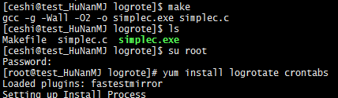
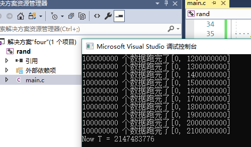

# 第4章-武技-常见轮子下前仆

        本章是关于系统中常见轮子的介绍. 在构建框架中属于最基础的组件. 算是咱们参与战斗过
    程中的生命线. 当前定位是筑基期的顶阶武技, 融合了那些在妖魔大战中无数前辈们的英魄构建
    的套路. 最大程度的发挥筑基的实力, 一招飞龙在天, 同阶无敌. 武技的宗旨就是让你成为战场
    上苟延残喘的小强 ┗|｀O′|┛ . 嗷, 那请出招吧 ~

## 4.1 那些年写过的日志库

        用过太多日志库轮子, 也写过不少. 也见过漫天飞花, 也遇到过一个个地狱火撕裂天空, 
    最后展示核心就 50 行的极短的日志库, 来表达所要的一切美好 ~ 越简单越优美越让人懂的代
    码总会出彩, 不是吗? 一个高性能的日志库突破点无外乎
        1' 缓存
        2' 无锁
        3' 定位
    随后会对这个日志武技轮子, 深入剖析.

### 4.1.1 小小日志库

    先看接口 clog.h 设计部分, 感受下几个宏解决一切幺蛾子.

```C
#ifndef _LOG_H
#define _LOG_H

#include "times.h"
#include <stdlib.h>
#include <stdarg.h>

//
// LOG_PRINTF - 拼接构建输出的格式串
// pre      : 日志前缀串必须 "" 包裹
// fmt      : 自己要打印的串, 必须 "" 包裹
// return   : void
//
#define LOG_PRINTF(pre, fmt, ...)   \
log_printf(pre"[%s:%s:%d]"fmt"\n", __FILE__, __func__, __LINE__, __VA_ARGS__)

//
// log 有些朴实, 也许很快很安全 ~
//
#define LOG_ERROR(fmt, ...) LOG_PRINTF("[ERROR]", fmt, __VA_ARGS__)
#define LOG_INFOS(fmt, ...) LOG_PRINTF("[INFOS]", fmt, __VA_ARGS__)
#ifdef _DEBUG
#define LOG_DEBUG(fmt, ...) LOG_PRINTF("[DEBUG]", fmt, __VA_ARGS__)
#else
#define LOG_DEBUG(fmt, ...) /*  (^_−)☆ */
#endif

//
// log_printf - 具体输出的日志内容
// fmt      : 必须 "" 包裹的串
// ...      : 对映 fmt 参数
// return   : void
//
void log_printf(const char * fmt, ...);

#endif//_LOG_H
```

    clog.h 继承自 times.h, 唯一需要的就是其中 times_fmt 接口用以得到特定时间格式串.

```C
// TIMES_STR - "{年}.{月}.{日}.{时}.{分}.{秒}.{毫秒}"
#define TIMES_STR "%04d-%02d-%02d %02d:%02d:%02d %03d"

//
// times_fmt - 通过 fmt 格式最终拼接一个字符串
// fmt          : 必须包含 %04d %02d %02d %02d %02d %02d %03d
// out          : 最终保存的内容
// sz           : buf 长度
// return       : 返回生成串长度
//
int
times_fmt(const char * fmt, char out[], size_t sz) {
    struct tm m;
    struct timespec s;

    timespec_get(&s, TIME_UTC);
    localtime_r(&s.tv_sec, &m);

    return snprintf(out, sz, fmt,
                    m.tm_year + 1900, m.tm_mon + 1, m.tm_mday,
                    m.tm_hour, m.tm_min, m.tm_sec,
                    (int)s.tv_nsec / 1000000);
}
```

    填充到日志的头部进行标识. 日志库小小核心构造源码展开:

```C
#include "log.h"

static FILE * log;

//
// log_init - !单例! 日志库初始化
// path     : 初始化日志系统文件名
// return   : void
//
void log_init(const char * path) {
    if (!(log = fopen(path, "ab"))) {
        fprintf(stderr, "fopen ab path err %s\n", path);
        exit(EXIT_FAILURE);
    }
}

//
// log_printf - 具体输出的日志内容
// fmt      : 必须 "" 包裹的串
// ...      : 对映 fmt 参数
// return   : void
//
void 
log_printf(const char * fmt, ...) {
    va_list ap;
    // 每条日志大小, 按照系统缓冲区走
    char str[BUFSIZ];
    int len = times_fmt("["TIMES_STR"]", str, sizeof str);

    // 填入日志内容
    va_start(ap, fmt);
    vsnprintf(str + len, sizeof str - len, fmt, ap);
    va_end(ap);

    // 数据刷入文件缓存
    fputs(str, log);
}
```

	其中 log_init 可以通过 EXTERN_RUN 在 main 中初始化注册.

```C
//
// EXTERN_RUN - 简单的声明, 并立即使用的宏
// ftest    : 需要执行的函数名称
// ...      : 可变参数, 保留
//
#define EXTERN_RUN(ftest, ...)                                    \
do {                                                              \
    extern void ftest();                                          \
    ftest (__VA_ARGS__);                                          \
} while(0)

EXTERN_RUN(log_init, LOG_PATH_STR);
```

    是不是很恐怖, 一个日志库这就完了. fputs 是系统内部打印函数, 默认自带缓冲机制. 缓冲说
    白了就是批量处理, 存在非及时性. vsnprintf 属于 printf 函数簇自带文件锁. 有兴趣的可以
    详细研究 printf, C 入门最早用的函数, 也是最复杂的函数之一. 那目前就差生成业务了! 也就
    是第三点定位, 这也是小小日志库的另一个高明之处, 借天罚来隔绝妖魔鬼怪. 

### 4.1.2 小小日志库 VT 二连

    先构建一下测试环境. 模拟一个妖魔大战的场景 ~ 嗖 ~ 切换到 linux 平台. 依次看下去

```C
#include <stdio.h>
#include <stdlib.h>
#include <unistd.h>

#define PATH_STR   "simplec.log"

// 
// logrotate hello world
//
int main(int argc, char * argv[]) {
    FILE * log = fopen(PATH_STR, "ab");
    if (NULL == log) {
        fputs("fopen ab err path = "PATH_STR "!\n", stderr);
        exit(EXIT_FAILURE);
    }   
    
    // Ctrl + C 中断结束
    for (int id = 0; ; ++id) {
        printf(PATH_STR" id = %d\n", id);
        fprintf(log, PATH_STR" id = %d\n", id);
        fflush(log);
        sleep(1);
    }

    return fclose(log);
}
```

    顺带给个编译文件 Makefile

```C
.PHONY : all clean

all : simplec.exe

clean :
    -rm -rf *~
    -rm -rf simplec.exe
    -rm -rf simplec.log simplec.log-*

simplec.exe : simplec.c
    gcc -g -Wall -O2 -o $@ $^
```

    通过 make 得到 simplec.exe 运行起来, 就开始在日志文件中持续输出. 有关试炼场的环境
	已经搭建完成. 那么是时候主角 T logrotate 出场了. 很久前在 centos 测试构建过看图:



    安装好 logrotate 和 crontabs 工具, 那么日志轮询器就能够开始使用了. 推荐自己查相关
	手册, 我这里只带大家简单弄个 Demo. Ok 开始搞起来, 看下面所做的 shell 批处理:

```Bash
su root

cd /etc/logrotate.d
vi simplec
i

#
# 添加 logrotate 规则
# daily : 日志文件将按天轮循
# rotate 7 : 存档7次, 时间最久的删除, LRU
# dateext : 日志添加日期后缀名
# copytruncate : 复制截断, (懒得写 SIGHUP 信号处理解决方案)
# create 644 root root : 创建的日志文件权限
#
# size = 100 : 测试用的, 超过 100B 就生成日志备份文件, 单位 K, M 默认 B
#
/home/ceshi/wangzhi/logrote/simplec.log {
        daily
        rotate 7
        dateext
        copytruncate
        create 644 root root
        size = 100
}

Esc
:wq!

logrotate -vf /etc/logrotate.d/simplec
```

	copytruncate 复制截断存在一个隐患是 logrotate 在 copy 后 truncate 时候会丢失那一
	瞬间新加的日志. 如果不想日志发生丢失, 可以自行实现, 最终取舍在于你对于业务的认识. 最
	终所搭建的环境:


    如果你有幸遇到贵人, 也只会给你一条路, 随后就是自己双脚的主场. 如果没有那么是时候 -> 
	冲冲冲, 四驱兄弟在心中 ~ 以往小小 VT 二连之后, 可以再 A 一下. 那就利用自带的定时器了
    , 例如 crontabs 等等以后的事情那就留给以后自己做吧 ~ 以上就是最精简的优质日志库实战
	架构. 对于普通选手可能难以吹 NB(说服别人), 因而这里会再来分析一波所见过日志库的套路
	, 知彼知己才能大口吃喝 ~ 日志库大体实现还存在一种套路, 开个线程跑日志消息队列. 这类
	日志库在游戏服务器中极其常见, 例如端游中大量日志打印, 运维备份的时候, 同步日志会将业
	务机卡死(日志无法写入, 玩家业务挂起). 所以构造出消息队列来缓存日志. 此类日志库可以秀
	一下代码功底, 毕竟线程轮询, 消息队列, 资源竞争, 对象池, 日志构建这些都需要有. 个人看
	法它很重. 难有摘叶伤人来的迅捷呀. 其缓冲层消息队列, 还不一定比不进行 fflush 的系统层
	面输出接口来的快捷. 而且启动一个单独线程处理日志, 那么就一定重度依赖对象池. 一环套一
	环, 收益普通 ~ 业务设计的时候能不用线程就别用. 因为线程脾气可大了, 还容易琢磨不透. 
	到这也扯的差不多了, 如果以后和人交流的时候, 被问到这个日志库为什么高效. 记住
	    1' 无锁编程, 利用 fprintf IO 锁
	    2' fputs 最大限度利用系统 IO 缓冲层, 没必要 fflush, 从消息队列角度分析
	    3' 各司其职, 小小日志库只负责写, 其它交给系统层面最合适的工具搞. 定位单一

### 4.2 开胃点心, 高效随机数库

        为什么来个随机数库呢? 因为不同平台的随机数实现不一样, 导致期望结果不一致. 顺便嫌
	弃系统 rand 函数不够快和安全. 随机函数算法诞生对于计算机行业的发展真不得了, 奠定了人
	类模拟未知的一种可能. 顺带扯一点概率分析学上一种神奇的事情是: "概率为 0 的事情, 也可
	能发生 ~". 还是有点呵呵(非标准分析中可能有答案). 数学的本源不是为了解决具体遇到问题,
    多数是人内部思维的升华 -> 自己爽就好了. 就如同这个时代最强数学家俄罗斯[格里戈里·佩雷
    尔曼]渡劫真君, 嗨了一发就影响了整个人类思维的跳跃. 我们的随机函数算法是从 redis 源码
    上拔下来的, redis 是从 pysam 源码上拔下来. 可以算是薪火相传, 生生不息. 哭 ~ 首先看
    接口设计.

```C
#ifndef _RAND_H
#define _RAND_H

//
// 线程安全的 rand 库, by redis
//

#include <time.h>
#include <stdint.h>
#include <assert.h>

struct rand {
    uint32_t x[3];
    uint32_t a[3];
    uint32_t c;
};

typedef struct rand rand_t[1];

#define X0              (0x330E)
#define X1              (0xABCD)
#define X2              (0x1234)
#define A0              (0xE66D)
#define A1              (0xDEEC)
#define A2              (0x0005)
#define C               (0x000B)

#define N               (16)
#define MASK            ((1 << N) - 1)
#define LOW(x)          ((unsigned)(x) & MASK)
#define HIGH(x)         LOW((x) >> N)

//
// rand_init - 随机函数初始化种子方法
// r        : 随机函数对象
// seed     : 种子数
// return   : void
//
inline void rand_init(rand_t r, int64_t seed) {
    r->x[0] = X0; r->x[1] = LOW(seed); r->x[2] = HIGH(seed);
    r->a[0] = A0; r->a[1] = A1; r->a[2] = A2;
    r->c = C;
}

//
// rand_rand - 获取一个随机值
// r        : 随机函数对象
// return   : 返回 [0, INT32_MAX] 随机数
//
extern int32_t rand_rand(rand_t r);

//
// r_rand  - 得到 [0, INT32_MAX] 随机数
// r_randk - 得到一个 64 位的 key
// r_rands - 得到 [min, max] 范围内随机数
//
extern int32_t r_rand(void);

inline int64_t r_randk(void) {
    uint64_t x = ((r_rand() << N) ^ r_rand()) & INT32_MAX;
    uint64_t y = ((r_rand() << N) ^ r_rand()) & INT32_MAX;
    return ((x << 2 * N) | y) & INT64_MAX;
}

inline int32_t r_rands(int32_t min, int32_t max) {
    assert(max > min);
    return r_rand() % (max - min + 1) + min;
}

#endif//_RAND_H
```

    最核心是 rand_rand 函数实现, 小阅读理解来了, 感受下离散数学的魅力

scrand.c

```C
#include "rand.h"

#define CARRY(x, y)     ((x + y) > MASK) // 基于 16位判断二者和是否进位
#define ADDRQ(x, y, z)  (z = CARRY(x, y), x = LOW(x + y))

#define MUL(l, x, y, z) l = (x) * (y); z[0] = LOW(l); z[1] = HIGH(l)

inline void rand_next(rand_t r) {
    uint32_t l, p[2], q[2], s[2], c[2];

    MUL(l, r->a[0], r->x[0], p);
    ADDRQ(p[0], r->c, c[0]);
    ADDRQ(p[1], c[0], c[1]);
    MUL(l, r->a[0], r->x[1], q);
    ADDRQ(p[1], q[0], c[0]);
    MUL(l, r->a[1], r->x[0], s);

    l = c[0] + c[1] + CARRY(p[1], s[0]) + q[1] + s[1] + 
        r->a[0] * r->x[2] + r->a[1] * r->x[1] + r->a[2] * r->x[0];
    r->x[2] = LOW(l);
    r->x[1] = LOW(p[1] + s[0]);
    r->x[0] = LOW(p[0]);
}

//
// rand_rand - 获取一个随机值
// r        : 随机函数对象
// return   : 返回 [0, INT32_MAX] 随机数
//
inline int32_t 
rand_rand(rand_t r) {
    rand_next(r);
    return (r->x[2] << (N - 1)) + (r->x[1] >> 1);
}

//
// 我 - 想云, 因为不甘心 :0
//
static rand_t r_r = { { { X0, X1, X2 }, { A0, A1, A2 }, C } };

// EXTERN_RUN(r_init) 启动初始化
extern inline void r_init(void) {
    rand_init(r_r, time(NULL));
}

//
// r_rand  - 得到 [0, INT32_MAX] 随机数
// r_randk - 得到一个 64 位的 key
// r_rands - 得到 [min, max] 范围内随机数
//
inline int32_t 
r_rand(void) {
    return rand_rand(r_r);
}
```

    (为什么成篇的刷代码, 方便你一个个对着敲到你的电脑中, 也方便你找出作者错误 ~) 代码都
	懂, rand_next 计算复杂点. 之后靠看自己悟了, 毕竟世界也是咱们的. r_randk, r_rands
    思路很浅显分别根据位随机和区间范围. 从上面 r_r 能够看出来随机函数并不是线程安全的. 
	在多线程环境中就会出现未知行为(至少咱们不清楚). 这样也很有意思, 毕竟不可控的随机才
	会有点真随机味道吧? 同样我们也提供了 rand_rand 这种线程安全的伪随机函数. 不怕折腾
    可以把上面代码直接刷到你的项目中, 解决随机数的平台无关性 ~ 目前 winds 和 linux 测
    试良好.

```C
/*
 describe:
	1 亿的数据量, 测试随机生成函数
	front system rand, back r_rand rand
 
 test code

 // 1 亿的数据测试
 #define TEST_INT	(100000000)
 
 static int test_rand(int (* trand)(void)) {
 	 int rd = 0;
 	 for (int i = 0; i < TEST_INT; ++i)
 	 	rd = trand();
 	 return rd;
 }

 winds test :
	cl version 14 Visual Studio 2015 旗舰版(Window 10 专业版)

	Debug
	The current code block running time:1.743000 seconds
	The current code block running time:4.408000 seconds

	Release
	The current code block running time:1.649000 seconds
	The current code block running time:0.753000 seconds

 linux test : 
	gcc version 6.3.0 20170406 (Ubuntu 6.3.0-12ubuntu2)
	-g -O2
	The current code block running time:0.775054 seconds
	The current code block running time:0.671887 seconds
 */
``` 
	
    到这基本前戏做的够足了. 这里不妨带大家去武当山抓个宝宝.

```C
#include <stdio.h>
#include <stdlib.h>

#define R_INT         (128)
#define F_INT         (100000000)

// getr - 得到 rand() 返回值, 并写入到文件中
static int getr(long long * pnt) {
    static int cnt;

    int r = rand();
    long long t = *pnt + 1;
    
    // 每次到万再提醒一下
    if(t % F_INT == 0)
        fprintf(stdout, "%d 个数据跑完了[%d, %lld]\n", F_INT, cnt, t);

    if(t < 0) { // 数据超标了
        ++cnt;

        fprintf(stderr, "Now %d T > %lld\n", cnt, t - 1);
        *pnt = 0; // 重新开始一轮
    }
    *pnt = t;
    return r;
}

// main - 验证 rand 函数的周期
int main(int argc, char* argv[]) {
    int base[R_INT];
    int r, i = -1;
    long long cnt = 0;


    // 先产生随机函数
    while(++i < R_INT)
        base[i] = getr(&cnt);

    // 这里开始随机了
    for(;;) {
        r = getr(&cnt);
        if (r != base[0])
            continue;

        // 继续匹配查找
        for(i = 1; i < R_INT; ++i) {
            r = getr(&cnt);
            if(r != base[i]) 
                break;
        }

        // 找见了数据
        if(i == R_INT) {
            printf("Now T = %lld\n", cnt);
            break;
        }
    }

    return EXIT_SUCCESS;
}
```

	可以将 R_INT 修改为 (1024) 最终得到结果也是一样. 因为抓到了 window 平台上面 rand()
	伪随机函数的周期 G 点. 希望大家玩的开心.



## 4.3 file 文件库封装

        文件相关操作无外乎删除创建获取文件属性. 更加具体点的需求有, 想获取程序的运行目录,
	需要多级删除目录, 需要多级创建目录... 这里就是为了解决这个问题. 先展示部分设计, 再逐
	个击破.

```C
#ifndef _FILE_H
#define _FILE_H

#include "atom.h"
#include "struct.h"
#include "strext.h"

#ifdef __GNUC__

#include <fcntl.h>
#include <unistd.h>
#include <sys/stat.h>
#include <sys/types.h>

//
// mkdir - 单层目录创建函数宏, 类比 mkdir path
// path     : 目录路径
// return   : 0 表示成功, -1 表示失败, 失败原因见 errno
// 
#undef  mkdir
#define mkdir(path)                                 \
mkdir(path, S_IRWXU | S_IRWXG | S_IROTH | S_IXOTH)

//
// mtime - 得到文件最后修改时间
// path     : 文件路径
// return   : 返回时间戳, -1 表示失败
//
inline time_t mtime(const char * path) {
    struct stat st;
    // 数据最后的修改时间
    return stat(path, &st) ? -1 : st.st_mtime;
}

#endif

#ifdef _MSC_VER

#include <io.h>
#include <direct.h>
#include <windows.h>

// int access(const char * path, int mode /* 四个检测宏 */);
#ifndef F_OK
#   define  F_OK    (0)
#endif       
#ifndef X_OK 
#   define  X_OK    (1)
#endif       
#ifndef W_OK 
#   define  W_OK    (2)
#endif       
#ifndef R_OK 
#   define  R_OK    (4)
#endif

inline time_t mtime(const char * path) {
    WIN32_FILE_ATTRIBUTE_DATA st;
    if (!GetFileAttributesEx(path, GetFileExInfoStandard, &st))
        return -1;
    // 基于 winds x64 sizeof(long) = 4
    return *(time_t *)&st.ftLastWriteTime;
}

#endif

//
// removes - 删除非空目录 or 文件
// path     : 文件路径
// return   : < 0 is error, >=0 is success
//
extern int removes(const char * path);

//
// mkdirs - 创建多级目录
// path     : 目录路径
// return   : < 0 is error, 0 is success
//
extern int mkdirs(const char * path);

//
// mkfdir - 通过文件路径创建目录
// path     : 文件路径
// return   : < 0 is error, 0 is success
//
extern int mkfdir(const char * path);

//
// getawd - 得到程序运行目录, \\ or / 结尾
// buf      : 存储地址
// size     : 存储大小
// return   : 返回长度, -1 is error 
//
extern int getawd(char * buf, size_t size);

#endif//_FILE_H
```

	removes, mkdirs, mkfdir, getawd 是不是有了这些接口, 以后写代码操作目录方便了很多. 
    其中 removes 借力的通过系统 shell 的能力来实现的.

```C
#include "file.h"

//
// removes - 删除非空目录 or 文件
// path     : 文件路径
// return   : < 0 is error, >=0 is success
//
inline int removes(const char * path) {
    char s[BUFSIZ];

#  ifndef RMRF_STR
#    ifdef _MSC_VER
#      define RMRF_STR    "rmdir /s /q \"%s\""
#    else
#      define RMRF_STR    "rm -rf '%s'"
#    endif
#  endif

    // path 超过缓冲区长度, 返回异常
    if (snprintf(s, sizeof s, RMRF_STR, path) == sizeof s) 
        return -1;
    return access(path, F_OK) ? 0 : -system(s);
}
```

	access 检查 path 是否存在, 存在返回 0. 不存在返回 -1, 并且执行 system RMRF_STR 相关
	操作. 而 mkdirs 和 mkfdir 核心在于 access 和 mkdir 来回瞎搞. 

```C
//
// mkdirs - 创建多级目录
// path     : 目录路径
// return   : < 0 is error, 0 is success
//
int 
mkdirs(const char * path) {
    char c, * p, * s;

    // 参数错误直接返回
    if (!path || !*path) return -2;
    // 文件存在 or 文件一次创建成功 直接返回
    if (!access(path, F_OK) || !mkdir(path))
        return 0;

    // 跳过第一个 ['/'|'\\'] 检查是否是多级目录
    p = (char *)path;
    while ((c = *++p) != '\0')
        if (c == '/' || c == '\\')
            break;
    if (c == '\0') return -1;

    // 开始循环构建多级目录
    s = p = strdup(path);
    while ((c = *++p) != '\0') {
        if (c == '/' || c == '\\') {
            *p = '\0';

            if (access(s, F_OK)) {
                // 文件不存在, 开始创建, 创建失败直接返回错误
                if (mkdir(s)) {
                    free(s);
                    return -1;
                }
            }

            *p = c;
        }
    }

    // 最后善尾
    c = p[-1]; free(s);
    if (c == '/' || c == '\\')
        return 0;

    // 剩下最后文件路径, 开始构建
    return mkdir(path) ? -1 : 0;
}

//
// mkfdir - 通过文件路径创建目录
// path     : 文件路径
// return   : < 0 is error, 0 is success
//
int 
mkfdir(const char * path) {
    const char * r;
    char c, * p, * s;
    if (!path) return -2;

    for (r = path + strlen(path); r >= path; --r)
        if ((c = *r) == '/' || c == '\\')
            break;
    if (r < path) return -1;

    // 复制地址地址并构建
    s = p = strdup(path);
    p[r - path] = '\0';

    while ((c = *++p) != '\0') {
        if (c == '/' || c == '\\') {
            *p = '\0';

            if (access(s, F_OK)) {
                // 文件不存在, 开始创建, 创建失败直接返回错误
                if (mkdir(s)) {
                    free(s);
                    return -1;
                }
            }

            *p = c;
        }
    }

    // 一定不是 / or \\ 结尾直接, 构建返回
    if (access(s, F_OK)) {
        if (mkdir(s)) {
            free(s);
            return -1;
        }
    }
    free(s);
    return 0;
}
```

	最后 getawd 获取程序运行目录

```C
//
// getawd - 得到程序运行目录, \\ or / 结尾
// buf      : 存储地址
// size     : 存储大小
// return   : 返回长度, -1 is error 
//
int 
getawd(char * buf, size_t size) {
    char * tail;

#  ifndef getawe
#    ifdef _MSC_VER
#      define getawe(b, s)    (int)GetModuleFileName(NULL, b, (DWORD)s);
#    else
#      define getawe(b, s)    (int)readlink("/proc/self/exe", b, s);
#    endif
#  endif

    int r = getawe(buf, size);
    if (r <= 0 || r >= size)
        return -1;

    for (tail = buf + r - 1; tail > buf; --tail)
        if ((r = *tail) == '/' || r == '\\')
            break;
    // believe getawe return
    *++tail = '\0';
    return (int)(tail - buf);
}
```

	主要使用场景如下, 通过 getawd 得到程序运行目录, 随后拼接出各种文件的绝对路径. 再去嗨.

```C
#define LOG_PATH_STR        "logs/structc.log"

int n;
char r[BUFSIZ];
// 配置模块初始化
//
n = getawd(r, sizeof r);
assert(0 < n && n < sizeof r);

memcpy(r+n, LOG_PATH_STR, LEN(LOG_PATH_STR));
mkfdir(r);
EXTERN_RUN(log_init, r);
```

### 4.3.1 file 监控

    很多时候有这样一个需求, 某个配置需要可刷新. 完成这个功能也很简单, 无外乎外部触发或者内部
    监控. 两种方式, 内部触发是最省力, 我们也想把这种能力包含到 file.h 接口设计中.

```C
#ifndef _FILE_H
#define _FILE_H

...

//
// file_f - 文件更新行为
//
typedef void (* file_f)(FILE * c, void * arg);

//
// file_set - 文件注册更新行为
// path     : 文件路径
// func     : NULL 是标记清除, 否则 update -> func(path -> FILE, arg)
// arg      : func 额外参数
// return   : void
//
extern void file_set(const char * path, file_f func, void * arg);

//
// file_update - 配置文件刷新操作
// return   : void
//
extern void file_update(void);

#endif//_FILE_H
```

    file_set 注册需要监控的文件, file_f 是监控到变化后触发的行为. file_update 是全局的更新行
    为, 用于监控是否有文件发生了变化. 它的本质是依赖 mtime 获取最后一次文件变化的时间. 用于确
    定此文件当前是否发生了变化. 其中核心的数据结构如下

```C
struct file {
    time_t last;            // 文件最后修改时间点
    char * path;            // 文件全路径
    unsigned hash;          // 文件路径 hash 值

    file_f func;            // 执行行为
    void * arg;             // 行为参数

    struct file * next;     // 文件下一个节点
};

static struct files {
    atom_t lock;            // 当前对象原子锁
    struct file * list;     // 当前文件对象集
} f_s;

// files add 
static void f_s_add(const char * p, unsigned h, file_f func, void * arg) {
    struct file * fu;
    if (mtime(p) == -1) {
        RETNIL("mtime error p = %s", p);
    }

    fu = malloc(sizeof(struct file));
    fu->last = -1;
    fu->path = strdup(p);
    fu->hash = h;
    fu->func = func;
    fu->arg = arg;

    // 直接插入到头节点部分
    atom_lock(f_s.lock);
    fu->next = f_s.list;
    f_s.list = fu;
    atom_unlock(f_s.lock);
}

// files get 
static struct file * f_s_get(const char * p, unsigned * r) {
    struct file * fu = f_s.list;
    unsigned h = *r = str_hash(p);

    while (fu) {
        if (fu->hash == h && strcmp(fu->path, p) == 0)
            break;
        fu = fu->next;
    }

    return fu;
}
```

    file_set 注册需要监控的文件, file_f 是监控到变化后触发的行为. file_update 是全局的更新行
    对于每个要监控的文件, 我们记录了最后一次修改时间 last, 文件全路径 path, 执行体 func 和 
    arg. 有了这些基本上就差码代码了. 其中 file_set 设计包含了 del 操作, 即当 file_f 设置为空
    NULL 就认为是 file_del(path) 操作. 

```C
//
// file_set - 文件注册更新行为
// path     : 文件路径
// func     : NULL 是标记清除, 否则 update -> func(path -> FILE, arg)
// arg      : func 额外参数
// return   : void
//
void 
file_set(const char * path, file_f func, void * arg) {
    unsigned h;
    assert(path && *path);
    struct file * fu = f_s_get(path, &h);
    if (NULL == fu)
        f_s_add(path, h, func, arg);
    else {
        atom_lock(f_s.lock);
        fu->last = -1;
        fu->func = func;
        fu->arg = arg;
        atom_unlock(f_s.lock);
    }
}
```

    随后就是 file_update 全局监控和更新

```C
//
// file_update - 配置文件刷新操作
// return   : void
//
void 
file_update(void) {
    atom_lock(f_s.lock);
    struct file * fu = f_s.list;
    while (fu) {
        struct file * next = fu->next;

        if (NULL == fu->func) {
            // 删除的是头节点
            if (f_s.list == fu)
                f_s.list = next;

            free(fu->path);
            free(fu);
        } else {
            time_t last = mtime(fu->path);
            if (fu->last != last && last != -1) {
                FILE * c = fopen(fu->path, "rb+");
                if (NULL == c) {
                    CERR("fopen rb+ error = %s.", fu->path);
                    continue;
                }
                fu->last = last;
                fu->func(c, fu->arg);
                fclose(c);
            }
        }

        fu = next;
    }
    atom_unlock(f_s.lock);
}
```

    file_update 做的工作就是循环遍历 struct files::head 链表, 挨个检查文件最后一次修改时间
    mtime 是否发生变化. 如果不一样就触发 file_f 注册行为. 当然也会清除待删除的注册文件. 到这
    里我们的文件操作就讲完了. 很枯燥, 但是是你的鲤鱼跃龙门的阶梯.

## 4.4 C 来个 json 轮子

        在我刚做开发的时候, 那时候维护的系统, 所有配置走的是 xml 和 csv. 刚好 json 在国内刚
    兴起, 所以一时兴起为其写了个解释器. 过了 1 年接触到 cJSON 库, 直接把自己当初写的那个删了.
    用起了 cJSON, 后面觉得 cJSON 真的丑的不行不行的, 就琢磨写了个简单的 c json. 这小节, 就带
    大家写写这个 c json 的解析引擎, 清洁高效小. 能够保证的就是比 cJSON 好学习.

### 4.4.1 c json 设计布局 

    首先大概分析 c json 的实现部分. 最关心的是 c json 的内存布局, 这里引入了 tstr 布局. 设计
    结构图如下 :


    str 指向内存常量, tstr 指向内存不怎么变, 所以采用两块内存保存. tstr 存在目的是个中转站. 
    因为读取文件内容, 中间 json 内容清洗, 例如注释, 去空白, 压缩需要一块内存. 这就是引入目的
    . 再看看 c json 结构代码设计:

```C
struct json {
    unsigned char type;     // CJSON_NULL - JSON_ARRAY and JSON_CONST
    struct json * next;     // type & OBJECT or ARRAY -> 下个节点链表
    struct json * chid;     // type & OBJECT or ARRAY -> 对象节点数据

    char * key;             // json 节点的 key
    union {
        char * str;         // type & STRING -> 字符串
        double num;         // type & NUMBER -> number
    };
};

// 定义 json 对象类型
//
typedef struct json * json_t;
```

    使用 c99 的匿名结构体挺爽的, 整个 struct json 内存详细布局如下:


    c json 中处理的类型类型无外乎:

```C
#define JSON_NULL           (0u << 0)
#define JSON_BOOL           (1u << 1)
#define JSON_NUMBER         (1u << 2)
#define JSON_STRING         (1u << 3)
#define JSON_OBJECT         (1u << 4)
#define JSON_ARRAY          (1u << 5)
#define JSON_CONST          (1u << 6)

//
// json_int - 得到节点的 int 值
// item     : json 节点
//          : 返回 number int 值
//
#define json_int(item) ((int)(item)->num)

#endif//JSON_NULL

// json_str - json 字符串分离, 需要自行 free
inline char * json_str(json_t item) {
    item->type &= JSON_CONST;
    return item->str;
}

```

    以上就是解析之后的具体结构类型. 下面简单分析一下文本解析规则. 思路是递归下降分析. 到这里基
    本关于 c json 详细设计图介绍完毕了. 后面会看见这只麻雀代码极少 ヽ(✿ﾟ▽ﾟ)ノ


### 4.4.2 c json 详细设计

    当初写这类东西, 就是对着协议文档开撸 ~ 这类代码是协议文档和作者思路的杂糅体, 推荐最好手敲一
    遍, 自行加注释, 琢磨后吸收. 来看看 c json 的删除函数

```C
//
// json_delete - json 对象销毁
// c        : json 对象
// return   : void
//
void 
json_delete(json_t c) {
    while (c) {
        json_t next = c->next;
        unsigned char t = c->type;

        free(c->key);
        if ((t & JSON_STRING) && !(t & JSON_CONST))
            free(c->str);

        // 子节点 继续递归删除
        if (c->chid)
            json_delete(c->chid);

        c = next;
    }
}
```

    上面操作无外乎就是递归找到最下面的儿子节点, 期间删除自己挂载的节点. 然后依次按照 next 链表
    顺序循环执行. 随后通过代码逐个分析思维过程, 例如我们得到一个 json 串, 这个串中可能存在多余
    的空格, 多余的注释等. 就需要做洗词的操作, 只留下最有用的 json 字符串.

```C
// json_mini - 清洗 str 中冗余的串并返回最终串的长度. 纪念 mini 比男的还平 :)
// EF BB BF     = UTF-8                 (可选标记, 因为 Unicode 标准未有建议)
// FE FF        = UTF-16, big-endian    (大尾字节序标记)
// FF FE        = UTF-16, little-endian (小尾字节序标记, windows 中的 Unicode 编码默认标记)
// 00 00 FE FF  = UTF-32, big-endian    (大尾字节序标记)
// FF FE 00 00  = UTF-32, little-endian (小尾字节序标记)
//
size_t json_mini(char * str) {
    char c, * in = str;
    unsigned char * to = (unsigned char *)str;
    
    // 跳过 UTF-8 With BOM 前三个字节
    if (to[0] == 0xEF && to[1] == 0xBB && to[2] == 0xBF)
        to += 3;

    while ((c = *to)) {
        // step 0 : 处理字面串
        if (c == '`') {
            *in++ = c;
            while ((c = *++to) && c != '`')
                *in++ = c;
            if (c) {
                *in++ = c;
                ++to;
            }
            continue;
        }

        // step 1 : 处理字符串
        if (c == '"') {
            *in++ = c;
            while ((c = *++to) && (c != '"' || to[-1] == '\\'))
                *in++ = c;
            if (c) {
                *in++ = c;
                ++to;
            }
            continue;
        }
        // step 2 : 处理不可见特殊字符
        if (c < '!') {
            ++to;
            continue;
        }
        if (c == '/') {
            // step 3 : 处理 // 解析到行末尾
            if (to[1] == '/') {
                while ((c = *++to) && c != '\n')
                    ;
                continue;
            }
            // step 4 : 处理 /*
            if (to[1] == '*') {
                while ((c = *++to) && (c != '*' || to[1] != '/'))
                    ;
                if (c)
                    to += 2;
                continue;
            }
        }
        // step 5 : 合法数据直接保存
        *in++ = *to++;
    }

    *in = '\0';
    return in - str;
}
```

    以上操作主要目的是让解析器能够处理 json串中 // 和 /**/, 并删除些不可见字符. 开始上真正的解
    析器入口函数:

```C
//
// parse_value - 递归下降解析
// item     : json 节点
// str      : 语句源串
// return   : 解析后剩下的串
//
static const char * parse_value(json_t item, const char * str);

//
// json_parse - json 解析函数
// str      : json 字符串串
// return   : json 对象, NULL 表示解析失败
//
json_t json_parse(const char * str) {
    json_t c = json_new();
    if (!parse_value(c, str)) {
        json_delete(c);
        return NULL;
    }
    return c;
}

//
// json_file - 通过文件构造 json 对象
// json_create  - 通过字符串构造 json 对象
// str      : 字符串
// path     : 文件路径
// return   : json_t 对象
//
json_t 
json_file(const char * path) {
    // 读取文件中内容, 并检查
    if (!path || !*path) return NULL;
    char * str = str_freads(path);
    if (!str) return NULL;

    // 返回解析结果
    json_t c = json_create(str);
    free(str);
    return c;
}

json_t 
json_create(const char * str) {
    json_t c = NULL;
    if (str && *str) {
        TSTR_CREATE(tsr);
        tstr_appends(tsr, str);

        // 清洗 + 解析
        json_mini(tsr->str);
        c = json_parse(tsr->str);

        TSTR_DELETE(tsr);
    }
    return c;
}
```

    以上操作主要目的是让解析器能够处理 json串中 // 和 /**/, 并删除些不可见字符. 开始上真正的解
    从 json_create 看起, 声明了栈上字符串 tsr 填充 str, 随后进行 json_mini 洗词, 然后通过 
    json_parse 解析出最终结果并返回. 随后可以看哈 json_parse 实现非常好理解, 核心调用的是
    parse_value. 而 parse_value 就是我们的重头戏, 本质就是走分支. 不同分支走不同的解析操作.

```C
static const char * 
parse_value(json_t item, const char * str) {
    if (!str) return NULL;
    switch (*str) {
    // n or N = null, f or F = false, t or T = true ...
    case 'n': case 'N':
        if (str_cmpin(str + 1, "ull", sizeof "ull" - 1)) return NULL;
        item->type = JSON_NULL;
        return str + sizeof "ull"; // exists invalid is you!
    case 't': case 'T':
        if (str_cmpin(str + 1, "rue", sizeof "rue" - 1)) return NULL;
        item->type = JSON_BOOL; item->num = true;
        return str + sizeof "rue";
    case 'f': case 'F':
        if (str_cmpin(str + 1, "alse", sizeof "alse"-1)) return NULL;
        item->type = JSON_BOOL;
        return str + sizeof "alse";
    case '+': case '-': case '.':
    case '0': case '1': case '2': case '3': case '4':
    case '5': case '6': case '7': case '8': case '9':
        return parse_number(item, str);
    case '`': return parse_literal(item, str + 1);
    case '"': return parse_string (item, str + 1);
    case '{': return parse_object (item, str + 1);
    case '[': return parse_array  (item, str + 1);
    }
    return NULL;
}
```

    由 parse_value 引出了 parse_number, parse_literal, parse_string, parse_object, 
    parse_array. 是不是后面五个写好了 parse_value 就写好了. 那随后开始逐个击破, 
    parse_number 走起.

```C
// parse_number - number 解析
static const char * parse_number(json_t item, const char * str) {
    char c;
    double n = 0;
    int e, eign, sign = 1;

    // 正负号处理判断
    if ((c = *str) == '-' || c == '+') {
        sign = c == '-' ? -1 : 1;
        c = *++str;
    }

    // 整数处理部分
    while (c >= '0' && c <= '9') {
        n = n * 10 + c - '0';
        c = *++str;
    }
    // 处理小数部分
    if (c == '.') {
        int d = 0;
        double s = 1;
        while ((c = *++str) && c >= '0' && c <= '9') {
            d = d * 10 + c - '0';
            s *= 0.1;
        }
        // 得到整数和小数部分
        n += s * d;
    }

    // 添加正负号
    n *= sign;

    // 不是科学计数内容直接返回
    item->type = JSON_NUMBER;
    if (c != 'e' && c != 'E') {
        item->num = n;
        return str;
    }

    // 处理科学计数法
    if ((c = *++str) == '-' || c == '+')
        ++str;
    eign = c == '-' ? -1 : 1;

    e = 0;
    while ((c = *str) >= '0' && c <= '9') {
        e = e * 10 + c - '0';
        ++str;
    }

    // number = +/- number.fraction * 10^+/- exponent
    item->num = n * pow(10, eign * e);
    return str;
}
```

    parse_number 特别像下面两兄弟. 大体功能相似, 用于将字符串解析成浮点数.

```C
extern double __cdecl strtod(char const * _String, char ** _EndPtr);

inline double __cdecl atof(char const * _String) {
    return strtod(_String, NULL);
}
```

    parse_literal 用于解析 `` 包裹的字符常量. 输入额外添加的私货. 

```C
// parse_literal - 字面串解析
static const char * parse_literal(json_t item, const char * str) {
    char c, * ntr;
    const char * ptr, * etr = str;

    // 获取到 '`' 字符结尾处
    while ((c = *etr) != '`' && c)
        ++etr;
    if (c != '`') return NULL;

    // 开始构造 json string 节点
    item->type = JSON_STRING;
    item->str = ntr = malloc(etr - str + 1);
    for (ptr = str; ptr < etr; ++ptr) 
        *ntr++ = *ptr;
    *ntr = '\0';

    return ptr + 1;
}
```

    是不是也很骨骼精奇. 快要进入小高潮了 parse_string 解析难点在于 UTF-8 \uxxxx 字符的处理. 
    我们了原先 cJSON 的代码. 作为程序员, 有些地方还是得低头 ~  

```C
// parse_hex4 - parse 4 digit hexadecimal number
static unsigned parse_hex4(const char str[]) {
    unsigned h = 0;
    for (unsigned i = 0; ; ++str) {
        unsigned char c = *str;
        if (c >= '0' && c <= '9')
            h += c - '0';
        else if (c >= 'a' && c <= 'f')
            h += c - 'a' + 10;
        else if (c >= 'A' && c <= 'F')
            h += c - 'A' + 10;
        else return 0; // invalid

        // shift left to make place for the next nibble
        if (4 == ++i) break;
        h <<= 4;
    }

    return h;
}

// parse_string - string 解析
static const char * parse_string(json_t item, const char * str) {
    unsigned len = 1;
    char c, * ntr, * out;
    const char * ptr, * etr = str;

    while ((c = *etr) != '"' && c) {
        ++etr;
        // 转义字符特殊处理
        if (c == '\\') {
            if (*etr == '\0') 
                return NULL;
            ++etr;
        }
        ++len;
    }
    if (c != '"') return NULL;

    // 开始复制拷贝内容
    ntr = out = malloc(len);
    for (ptr = str; ptr < etr; ++ptr) {
        // 普通字符直接添加处理
        if ((c = *ptr) != '\\') {
            *ntr++ = c;
            continue;
        }
        // 转义字符处理
        switch ((c = *++ptr)) {
        case 'b': *ntr++ = '\b'; break;
        case 'f': *ntr++ = '\f'; break;
        case 'n': *ntr++ = '\n'; break;
        case 'r': *ntr++ = '\r'; break;
        case 't': *ntr++ = '\t'; break;
        // transcode UTF16 to UTF8. See RFC2781 and RFC3629
        case 'u': {
            // first bytes of UTF8 encoding for a given length in bytes
            static const unsigned char marks[] = { 0x00, 0x00, 0xC0, 0xE0, 0xF0, 0xF8, 0xFC };
            unsigned oc, uc = parse_hex4(ptr + 1);
            // check for invalid
            if ((ptr += 4) >= etr) goto err_free;
            if ((uc >= 0xDC00 && uc <= 0xDFFF) || uc == 0)
                goto err_free;

            // UTF16 surrogate pairs
            if (uc >= 0xD800 && uc <= 0xDBFF) {
                if ((ptr + 6) >= etr) goto err_free;
                // missing second-half of surrogate
                if ((ptr[1] != '\\') || (ptr[2] != 'u' && ptr[2] != 'U')) 
                    goto err_free;

                oc = parse_hex4(ptr + 3);
                ptr += 6; // parse \uXXXX
                // invalid second-half of surrogate
                if (oc < 0xDC00 || oc > 0xDFFF) goto err_free;
                // calculate unicode codepoint from the surrogate pair
                uc = 0x10000 + (((uc & 0x3FF) << 10) | (oc & 0x3FF));
            }

            // encode as UTF8
            // takes at maximum 4 bytes to encode:

            // normal ascii, encoding 0xxxxxxx
            if (uc < 0x80) len = 1;
            // two bytes, encoding 110xxxxx 10xxxxxx
            else if (uc < 0x800) len = 2;
            // three bytes, encoding 1110xxxx 10xxxxxx 10xxxxxx
            else if (uc < 0x10000) len = 3;
            // 11110xxx 10xxxxxx 10xxxxxx 10xxxxxx
            else len = 4;
            ntr += len;

            switch (len) {
            // 10xxxxxx
            case 4: *--ntr = ((uc | 0x80) & 0xBF); uc >>= 6;
            // 10xxxxxx
            case 3: *--ntr = ((uc | 0x80) & 0xBF); uc >>= 6;
            // 10xxxxxx
            case 2: *--ntr = ((uc | 0x80) & 0xBF); uc >>= 6;
            // depending on the length in bytes this determines the 
            // encoding ofthe first UTF8 byte
            case 1: *--ntr = ((uc | marks[len]));
            }
            ntr += len;
        }
        break;
        default : *ntr++ = c;
        }
    }
    *ntr = '\0';
    item->str = out;
    item->type = JSON_STRING;
    return ptr + 1;

err_free:
    free(out);
    return NULL;
}
```

    是不是也很骨骼精奇. 快要进入小高潮了 parse_string 解析难点在于 UTF-8 \uxxxx 字符的处理. 
    编码转换非内幕人员多数只能看看. 扯一点, 很久以前对于编码解决方案. 采用的是 libiconv 方案
    , 将其移植到 winds 上. 后面学到一招, 因为国内开发最多的需求就是 gbk 和 utf-8 国际标准的
    来回切. 那就直接把这个编码转换的算法拔下来, 岂不最好 ~ 所以后面抄录了一份 utf8.h. 有兴趣
    同学可以去作者主页找下来看看, 这里只带大家看看接口设计.

```C
#ifndef _UTF8_H
#define _UTF8_H

#include "struct.h"

//
// utf8 和 gbk 基础处理能力的库
//
// g = gbk 是 ascii 扩展码, u8 = utf8
// 2 * LEN(g) >= LEN(u8) >= LEN(g)
//

//
// u82g - utf8 to gbk save d mem
// g2u8 - gbk to utf8 save d mem by size n
// d        : mem
// n        : size
// return   : void
//
extern void u82g(char d[]);
extern void g2u8(char d[], size_t n);

//
// isu8s - 判断字符串是否是utf8编码
// s        : 输入的串
// return   : true 表示 utf8 编码
//
extern bool isu8s(const char * s);

//
// isu8 - check is utf8
// d        : mem
// n        : size
// return   : true 表示 utf8 编码
//
extern bool isu8(const char d[], size_t n);

#endif//_UTF8_H
```

> 引述一丁点维基百科上 UTF-8 编码字节含义:
>  
> 对于 UTF-8 编码中的任意字节 B, 如果 B 的第一位为 0，则 B 独立的表示一个字符(是 ASCII 码);  
> 如果 B 的第一位为 1, 第二位为 0, 则 B 为一个多字节字符中的一个字节(非 ASCII 字符);  
> 如果 B 的前两位为 1, 第三位为 0, 则 B 为两个字节表示的字符中的第一个字节;  
> 如果 B 的前三位为 1, 第四位为 0, 则 B 为三个字节表示的字符中的第一个字节;  
> 如果 B 的前四位为 1, 第五位为 0, 则 B 为四个字节表示的字符中的第一个字节;  
>  
> 因此, 对 UTF-8 编码中的任意字节, 根据第一位, 可判断是否为 ASCII 字符; 根据前二位,  
> 可判断该字节是否为一个字符编码的第一个字节; 根据前四位(如果前两位均为 1),  
> 可确定该字节为字符编码的第一个字节, 并且可判断对应的字符由几个字节表示;  
> 根据前五位(如果前四位为 1), 可判断编码是否有错误或数据传输过程中是否有错误.

    有了插播的内容, 写个判断是否是 utf-8 编码还是容易的. 希望对你理解 parse_string 有所帮助.

```C
//
// isu8 - check is utf8
// d        : mem
// n        : size
// return   : true 表示 utf8 编码
//
bool 
isu8(const char d[], size_t n) {
    size_t i = 0;
    bool ascii = true;
    // byts 表示编码字节数, utf8 [1, 6]字节编码
    unsigned char c, byts = 0;

    while (i < n) {
        c = d[i++];
        // ascii 码最高位为 0, 0xxx xxxx
        if ((c & 0x80)) ascii = false;

        // 计算字节数
        if (0 == byts) {
            if (c >= 0x80) {
                if (c >= 0xFC && c <= 0xFD) byts = 6;
                else if (c >= 0xF8) byts = 5;
                else if (c >= 0xF0) byts = 4;
                else if (c >= 0xE0) byts = 3;
                else if (c >= 0xC0) byts = 2;
                else return false; // 异常编码直接返回
                --byts;
            }
        } else {
            // 多字节的非首位字节, 应为 10xx xxxx
            if ((c & 0xC0) != 0x80) return false;
            // byts 来回变化, 最终必须为 0
            --byts;
        }
    }

    return !ascii && byts == 0;
}
```

### 4.4.3 parse array value

    最后就到了结尾戏了. 递归下降分析的两位主角 parse_array 和 parse_object. 希望带给你不一样
    的体验.

```C
// parse_array - array 解析
static const char * parse_array(json_t item, const char * str) {
    json_t chid;
    item->type = JSON_ARRAY;
    // 空数组直接解析完毕退出
    if (']' == *str) return str + 1;

    // 开始解析数组中数据
    item->chid = chid = json_new();
    str = parse_value(chid, str);
    if (NULL == str) return NULL;

    // array ',' cut
    while (',' == *str) {
        // 支持行尾多一个 ','
        if (']' == *++str)
            return str + 1;

        chid->next = json_new();
        chid = chid->next;
        // 继续间接递归处理值
        str = parse_value(chid, str);
        if (NULL == str) return NULL;
    }

    return ']' == *str ? str + 1 : NULL;
}
```

    parse_array 处理的格式 '[ ... , ... , ... ]' 串. 同样 parse_object 处理的格式如下 
    '{ "key":..., "key":..., ... }'

```C
// parse_object - object 解析
static const char * parse_object(json_t item, const char * str) {
    json_t chid;
    item->type = JSON_OBJECT;
    if ('}' == *str) return str + 1;
    // "key" check invalid
    if ('"' != *str && *str != '`') return NULL;

    // {"key":value,...} 先处理 key 
    item->chid = chid = json_new();
    if ('"' != *str)
        str = parse_literal(chid, str + 1);
    else
        str = parse_string(chid, str + 1);

    if (!str || *str != ':') return NULL;
    chid->key = chid->str;
    chid->str = NULL;

    // 再处理 value
    str = parse_value(chid, str + 1);
    if (NULL == str) return NULL;

    // 开始间接递归解析
    while (*str == ',') {
        // 多行解析直接返回结果
        if ('}' == *++str) return str + 1;
        if ('"' != *str && *str != '`') return NULL;

        chid->next = json_new();
        chid = chid->next;
        if ('"' != *str)
            str = parse_literal(chid, str + 1);
        else
            str = parse_string(chid, str + 1);

        if (!str || *str != ':') return NULL;
        chid->key = chid->str;
        chid->str = NULL;

        str = parse_value(chid, str + 1);
        if (NULL == str) return NULL;
    }

    return '}' == *str ? str + 1 : NULL;
}
```

    关于 json 串的解析部分就完工了. 核心是学习递归下降分析的套路, 间接递归. 通过上面演示的思路
    , 花些心思也可以构建出 json 对象转 json 串的套路. 麻烦点有 JSON_STRING 转换, 我们简单提
    提, 有心人可以作为拓展修炼. 有了 json 的处理库, 有没有感觉基础的业务配置就很轻松了. 

```C
/ print_string - string 编码
static char * print_string(char * str, tstr_t p) {
    unsigned char c;
    const char * ptr;
    char * ntr, * out;
    // 什么都没有 返回 "" empty string
    if (!str || !*str) {
        out = tstr_expand(p, 3);
        out[0] = out[1] = '"'; out[2] = '\0';
        return out;
    }

    // 获取最终字符输出长度
    size_t len = 0;
    for (ptr = str; (c = *ptr); ++ptr) {
        ++len;
        switch (c) {
        case '\b': case '\t': case '\n':
        case '\f': case '\r':
        case '\\': case '"': ++len; break;
        default:
            if (c < 32) {
                // UTF-16 escape sequence uXXXX
                len += 5;
            }
        }
    }

    // 开始分配内存
    ntr = out = tstr_expand(p, len + 3);
    *ntr++ = '"';
    ntr[len+1] = '\0';

    // 没有特殊字符直接返回
    if (len == ptr - str) {
        memcpy(ntr, str, len);
        goto ret_out;
    }

    // 存在特殊字符挨个处理
    for (ptr = str; (c = *ptr); ++ptr) {
        if (c >= 32 && c != '"' && c != '\\') {
            *ntr++ = c;
            continue;
        }
        *ntr++ = '\\';
        switch(c) {
        case '\b': *ntr++ = 'b'; break;
        case '\t': *ntr++ = 't'; break;
        case '\n': *ntr++ = 'n'; break;
        case '\f': *ntr++ = 'f'; break;
        case '\r': *ntr++ = 'r'; break;
        case '"': case '\\': *ntr++ = c; break;
        // escape and print as unicode codepoint
        default: sprintf(ntr, "u%04x", c); ntr += 5;
        }
    }

ret_out:
    out[len+1] = '"';
    return out;
}
```

## 4.5 config 配置库

        有了上面 json 解析库, 我们不妨运用 c json 解析能力, 构建配置解析库. 这年头配置解析库
    有不少, 例如 ini, csv, xml, json, yaml, toml, 自定义 ... 我最推荐是 json 和 toml. 
    json 推荐原因在于至今通用性最好, 配置, 协议传输, javascript 可直接使用等等优势. 我们先看
    待解析的配置文件 conf/conf.conf.

```json
/*
 * struct c config 
 * 
 * 框架支持的 json 配置
 *
 */

{
  `description` : "我不知道风是在哪一个方向吹。",

  "image"       : 
`*--------------------------------** struct c **--------------------------------*
| Welcome to the struct c v2.2.2                                               |
| More detailed information need to http://www.cnblogs.com/life2refuel/        |
| Thank you so much by wangzhi @ https://github.com/wangzhione/structc         |
|                                                                              |
|      _________                                                               |
|     / ======= \                                                              |
|    / __________\                                                             |
|   | ___________ |                                                            |
|   | | -       | |                                                            |
|   | |  Hello  | |                                                            |
|   | |_________| |________________                                            |
|   \=____________/                )                                           |
|   / ........... \               /    >    ->   go ->->    go   ->>   go  :)  |
|  / ::::::::::::: \          =D-'                                             |
| (_________________)                                                          |
|                                                                              |
| ---- __@                 __@        __@    -----  __@                 __@    |
| --- _\\<,_              _\\<,_     _\\<,_  ----  _\\<,_              _\\<,_  |
| -- (*)/ (*)            (*)/ (*)  (*)/ (*)  ---  (*)/ (*)            (*)/ (*) |
|                                                                              |
*--------------------------------** struct c **--------------------------------*`,

  //
  // add you config, 再在 conf.h / conf.c 中添加映射关系
  //

}

```

### 4.5.1 config 配置库实现

    conf.h 接口构思是配置文件同运行程序中内存一一映射, 一条配置程序就有一个字段和其对应. 可以
    从 struct conf 中字段看出来.

```C
#ifndef _CONF_H
#define _CONF_H

#include "utf8.h"
#include "json.h"

//
// config 映射配置
//
struct conf {
    char * description;
    char * image;
};

//
// conf_instance - 获取配置
// return   : 返回详细配置内容
//
extern struct conf * conf_instance(void);

//
// conf_init - 初始化读取配置内容
// path     : 配置初始化路径
// return   : true 表示解析成功
//
bool conf_init(const char * path);

#endif//_CONF_H

```

    实现层面考虑了文件格式可能是 gdk 和 utf8 两种情况. 具体见 locals 实现代码.

```C
#include "conf.h"

//
// conf_instance - 获取配置
// return   : 返回详细配置内容
//
inline struct conf * 
conf_instance(void) {
    //
    // 配置存储信息
    //
    static struct conf conf;

    return &conf;
}

// locals - 本地字符串特殊处理, winds 会把 utf8 转 gbk
inline char * locals(char utf8s[]) {
#ifdef _MSC_VER
    if (isu8s(utf8s)) {
        u82g(utf8s);
    }
#endif
    return utf8s;
}

// CONFIG_PARSE_JSON_STR - json field -> conf field
#define CONFIG_PARSE_JSON_STR(json, conf, field)                     \
json_t $##field = json_object(json, #field);                         \
if (NULL == $##field || $##field->type != JSON_STRING) {             \
    RETURN(false, "json_object err field = "#field", %p", $##field); \
}                                                                    \
free(conf->##field);                                                 \
conf->##field = json_str($##field);                                  \
locals(conf->##field)

// conf_parse - 解析内容, 并返回解析结果
bool conf_parse(json_t json, struct conf * conf) {
    CONFIG_PARSE_JSON_STR(json, conf, description);
    CONFIG_PARSE_JSON_STR(json, conf, image);

    return true;
}

//
// conf_init - 初始化读取配置内容
// path     : 配置初始化路径
// return   : true 表示解析成功
//
bool 
conf_init(const char * path) {
    json_t json = json_file(path);
    if (NULL == json) {
        RETURN(false, "json_file err path is %s", path);
    }

    // 解析 json 内容, 并返回详细配置内容
    bool ret = conf_parse(json, conf_instance());
    json_delete(json);
    return ret;
}
```

    使用的时候先要在 main 中注册 conf_init, 随后就可以通过 conf_instance() 来获取配置中内容.
    经过这些是不是觉得, 到筑基也不过如此. 心随意动.

## 4.6 奥特曼, 通用头文件

        在实战项目中, 都会有个出现频率特别高的一个头文件, 项目中基本每个业务头文件都继承自它. 
    同样此刻要出现的就是筑基期至强奥义, 一切从头开始 head.h.

```C
#ifndef _HEAD_H
#define _HEAD_H

#include "log.h"
#include "conf.h"
#include "file.h"
#include "check.h"
#include "thread.h"

#ifdef _MSC_VER

#include <conio.h>

inline void cls(void) {
    system("cls");
}

#endif

#ifdef __GNUC__

#include <unistd.h>
#include <termios.h>

// cls - 屏幕清除宏, 依赖系统脚本
inline void cls(void) {
    printf("\ec");
}

// getch - 立即得到用户输入的一个字符
inline int getch(void) {
    struct termios nts, ots;
    if (tcgetattr(0, &ots)) // 得到当前终端(0表示标准输入)的设置
        return EOF;

    nts = ots;
    // 设置终端为 Raw 原始模式，该模式下输入数据全以字节单位被处理
    cfmakeraw(&nts);
    if (tcsetattr(0, TCSANOW, &nts)) // 设置上更改之后的设置
        return EOF;

    int cr = getchar();
    if (tcsetattr(0, TCSANOW, &ots)) // 设置还原成老的模式
        return EOF;
    return cr;
}

#endif

// epause - 程序结束等待操作
inline void epause(void) {
    rewind(stdin);
    fflush(stderr); fflush(stdout);
    printf("Press any key to continue . . .");
    getch();
}

//
// STR - 添加双引号的宏 
// v    : 待添加双引号的量
//
#define STR(v) S_R(v)
#define S_R(v) #v

//
// LEN - 获取数组长度
// arr : 数组名
//
#define LEN(a) sizeof(a)/sizeof(*(a))

// hton - 本地字节序转网络字节序(大端)
// noth - 网络字节序转本地字节序
inline uint32_t hton(uint32_t x) {
#ifndef ISBENIAN
    uint8_t t;
    union { uint32_t i; uint8_t s[sizeof(uint32_t)]; } u = { x };
    t = u.s[0]; u.s[0] = u.s[sizeof(u)-1]; u.s[sizeof(u)-1] = t;
    t = u.s[1]; u.s[1] = u.s[sizeof(u)-2]; u.s[sizeof(u)-2] = t;
    return u.i;
#else
    return x;
#endif
}

inline uint32_t ntoh(uint32_t x) {
    return hton(x);
}

//
// EXTERN_RUN - 简单的声明, 并立即使用的宏
// ftest    : 需要执行的函数名称
// ...      : 可变参数, 保留
//
#define EXTERN_RUN(ftest, ...)                                    \
do {                                                              \
    extern void ftest();                                          \
    ftest (__VA_ARGS__);                                          \
} while(0)

//
// TEST_RUN - 测试代码块, 并输出简单时间信息
// code : { ... } 包裹的代码块
//
#define TEST_RUN(code)                                            \
do {                                                              \
    clock_t $s = clock();                                         \
    code                                                          \
    double $e = (double)clock();                                  \
    printf("test code run time:%lfs\n", ($e-$s)/CLOCKS_PER_SEC);  \
} while (0)

#endif//_HEAD_H
```

    head.h 相关内容是不是很简单, 很熟悉. cls -> getch -> epause 想想有了也挺好的. 而 
    check.h 会放入一些参数校验的函数. 可以随着自身对修炼的理解, 自主添加. 我这里只是加了个 
    ipv4 和 email 校验操作.

```C
#include "check.h"

//
// is_ip - 判断是否是 ipv4
// ips      : ip 串
// return   : true 是合法 ip
//
bool 
is_ip(const char * ips) {
    //
    // [0-9].
    // 7       - 15
    // 0.0.0.0 - 255.255.255.255
    // 00 (x), > 255 (x), . . .
    //
    int i, c, m, d;
    if (!ips || !*ips) return false;
    // 处理前 16 个字符 = sizeof "255.255.255.255"
    for (d = m = i = 0; i < sizeof "255.255.255.255"; ++i) {
        c = ips[i];
        if (c >= '0' && c <= '9') {
            // 00 (x)
            if (c == '0') {
                if (ips[i+1] != '.' && ips[i+1] != '\0')
                    return false;
            }
            m = m * 10 + c - '0';
        } else if (c == '.' || c == '\0') {
            // < 0 (x), > 255 (x)
            if (m > 255 || d > 3)
                return false;
            if (c == '\0') {
                // . . .
                // sizeof "0.0.0.0" = 8
                return d == 3 && i + 1 >= sizeof "0.0.0.0";
            }
            ++d;
            m = 0;
        } else {
            // 不是 [0-9]. 字符非法
            return false;
        }
    }
    return false;
}

//
// is_email - 判断是否是邮箱
// mail     : email 串 
// return   : true is email
#define EMAIL_INT (255)
bool 
is_email(const char * mail) {
    //
    // A@B.xx size <= 255
    // [0-9][a-z][A-Z] .-_ 字符构成
    // @ . 分割处首位和末位只能是 [0-9][a-z][A-Z] 
    // 不能出现 .. 连续
    //
    int c, i, b, d;
    if (!mail) return false;
    // check A
    c = *mail;
    if (!((c >= '0' && c <= '9') 
       || (c >= 'A' && c <= 'Z') 
       || (c >= 'a' && c <= 'z'))) return false;
    for (i = 1; (c = *++mail) && c != '@' && i < EMAIL_INT; ++i) {
        // 非法字符直接返回
        if (!((c >= '0' && c <= '9') 
        || (c >= 'A' && c <= 'Z') 
        || (c >= 'a' && c <= 'z'))) {
            if (c == '-' || c == '_')
                continue;
            return false;
        }
    }

    // check A end
    if (c != '@' || i >= EMAIL_INT 
                 || mail[-1] == '-' || mail[-1] == '_')
        return false;
    
    // check b start
    for (b = d = false; (c = *++mail) && i < EMAIL_INT; ++i) {
        // 非法字符直接返回
        if (!((c >= '0' && c <= '9') 
        || (c >= 'A' && c <= 'Z') 
        || (c >= 'a' && c <= 'z'))) {
            // 首字符不能是 非数字和字母
            if (b) {
                if (c == '-' || c == '_') 
                    continue;
                else if (c == '.') {
                    b = false;
                    d = true;
                    continue;
                }
            }
            return false;
        }
        b = true;
    }
    // 必须存在 ., 最后 '\0' 结尾, 255 以内
    return b && d && !c && i < EMAIL_INT 
             && (mail[-1] < '0' || mail[-1] > '9');
}
```

    使用的时候先要在 main 中注册 conf_init, 随后就可以通过 conf_instance() 来获取配置中内容.
    check.h 继承自 stdbool.h, 对于 is_ip 和 is_email 可以参阅相关资料对着看. 如果有问题也可
    以在修真岁月中道友间互相探讨补充. getch 函数可以重点关注下. 很久以前一位化神期巨擘说过: 由
    于 linux 对于 getch 支持不友好, 导致了 linux 错失了很多游戏开发人员. 我是挺喜欢 getch 的,
    让立即交互变得轻松. 所以就顺手补上了. 继承 head.h 让你的业务轻装上阵. 美好从此刻开始 ~ 新
    的风暴已经出现, 怎么能够停滞不前. 穿越时空竭尽全力, 我会来到你身边 ~

## 4.6 阅读理解, csv 解析库

        很久以前桌面项目配置文件基本都走 csv 文件配置. 采用 ',' 分隔. 同 excel 表格形式. 维护
    人员通过 notepad++ or excel 编辑操作. 程序人员直接读取开撸. 展示个自己写的解决方案, 灰常节
    约内存. 首先展示 interface:

```C
#ifndef _CSV_H
#define _CSV_H

//
// csv readonly parse
// 1. 相邻字段必须被单个逗号分隔开, CRLF 换行
// 2. 每个被嵌入的双引号字符必须被表示为两个双引号字符
// 3. 字段都可以被双引号包裹, 有回车换行符双引号或者逗号, 那必须包裹
//

#include "struct.h"
#include "strext.h"

typedef struct {   // struct in heap malloc
    int    rlen;   // 数据行数, 索引 [0, rlen)
    int    clen;   // 数据列数, 索引 [0, clen)
    char * data[]; // 保存数据, rlen * clen '二维数组
} * csv_t;

//
// csv_get - 获取 csv[r][c] 位置的字符串
// csv     : csv_t 对象
// r       : 行索引 [0, csv->rlen)
// c       : 列索引 [0, csv->clen)
// return  : 返回 csv[r][c], 后面可以用 atoi, atof, strdup ...
//
inline const char * csv_get(csv_t csv, int r, int c) {
    DCODE({
        if (!csv || r < 0 || r >= csv->rlen || c < 0 || c >= csv->clen) {
            RETNUL("params is error csv:%p, r:%d, c:%d.", csv, r, c);
        }
    });

    // 返回 csv[r][c] 索引位置字符串
    return csv->data[r * csv->clen + c];
}

//
// csv_delete - 释放 csv_t 对象
// csv     : csv_t 对象
// return  : void 
//
inline void csv_delete(csv_t csv) {
    free(csv);
}

//
// csv_create - 文件中构建 csv_t 对象
// path    : 文件路径
// return  : 返回 csv_t 对象, NULL is error
//
extern csv_t csv_create(const char * path);

#endif//_CSV_H
```

    我们这里只提供了读接口, 比较有特色的思路是 csv_t 采用一整块内存构建. 非常干净. 

```C
#include "csv.h"

// csv_check - 解析和检查 csv 文件内容, 返回构造的合法串
static int csv_check(char * str, int * pr, int * pc) {
    int c, n, rnt = 0, cnt = 0;
    char * tar = str, * s = str;
    while ((c = *tar++) != '\0') {
        // csv 内容解析, 状态机切换
        switch (c) {
        case '"' : // 双引号包裹的特殊字符处理
            while ((c = *tar++) != '\0') {
                if ('"' == c) {
                    // 有效字符再次压入栈, 顺带去掉多余 " 字符
                    if ((n = *tar) != '"') 
                        break;
                    ++tar;
                }
                // 添加得到的字符
                *s++ = c;
            }
            // 继续判断,只有是 c == '"' 才会继续, 否则都是异常
            if (c != '"') 
                goto err_faid;
            break;
        case ',' : *s++ = '\0'; ++cnt; break;
        case '\r': break;
        case '\n': *s++ = '\0'; ++cnt; ++rnt; break;
        default  : *s++ = c; // 其它所有情况只添加数据就可以了
        }
    }
    // CRLF 处理
    if (str != s && tar[-2] != '\n') {
        *s++ = '\0'; ++cnt; ++rnt;
    }

    // 检查, 行列个数是否正常
    if (rnt == 0 || cnt % rnt) {
err_faid:
        RETURN(-1, "csv parse error %d, %d, %d.", c, rnt, cnt);
    }

    // 返回最终内容
    *pr = rnt; *pc = cnt;
    return (int)(s - str);
}

// csv_parse - 解析 csv 内容返回解析后的对象
csv_t csv_parse(char * s) {
    csv_t csv;
    char * str;
    int diff, rnt, cnt;
    if ((diff = csv_check(s, &rnt, &cnt)) < 0)
        return NULL;
    
    // 分配最终内存
    csv = malloc(diff + sizeof *csv + sizeof(char *) * cnt);
    str = (char *)csv + sizeof *csv + sizeof(char *) * cnt ;
    memcpy(str, s, diff);
    // 开始内存整理
    csv->rlen = rnt;
    csv->clen = cnt / rnt;
    diff = 0;
    do {
        csv->data[diff] = str;
        while (*str ++)
            ;
    } while (++diff < cnt);

    return csv;
}

//
// csv_create - 文件中构建 csv_t 对象
// path    : 文件路径
// return  : 返回 csv_t 对象, NULL is error
//
csv_t 
csv_create(const char * path) {
    char * str = str_freads(path);
    if (NULL == str) {
        RETNUL("str_freads path = %s is error!", path);
    }

    // 开始解析 csv 文件内容
    csv_t csv = csv_parse(str);
    free(str);
    // 返回最终结果
    return csv;
}
```

    核心重点在 csv_parse 和 csv_create 上面. 前者负责预建和填充内存布局, 后者负责平滑过渡
    . 代码很短, 但却很有效不是吗? 希望上面的阅读理解你能喜欢 ~

## 4.6 筑基展望

        妖魔战场逐渐急促起来, 筑基期顶天功法也就介绍到此. 数据结构算法可能要勤学苦练, 而这些
    轮子多数只需 3 遍后, 战无不利, 终身会用. 本章多数在抠细节, 协助熟悉常用基础轮子开发套路.
    从 clog -> rand -> json -> conf -> head -> csv 遇到的妖魔鬼怪也不过如此. 真实开发中
    这类基础库, 要么是行业前辈遗留下来的馈赠. 要么就是远古大能的传世组件. 但总的而言, 如果你
    想把前辈英魂用的更自然, 显然你也得懂行(自己会写). 凡事总要瞎搞搞才能有所突破 <--:-o

***

西门吹雪忽然道: "你学剑?"

叶孤城道: "我就是剑."

西门吹雪道: "你知不知道剑的精义何在?"

叶孤城道: "你说."

西门吹雪道: "在于诚."

叶孤城道: "诚?"

西门吹雪道: "唯有诚心正义, 才能到达剑术的颠峰, 不诚的人, 根本不足论剑."

叶孤城的瞳孔突又收缩.

西门吹雪盯着他, 道: "你不诚."

叶孤城沉默了很久, 忽然也问道: "你学剑?"

西门吹雪道: "学无止境, 剑更无止境."

叶孤城道: "你既学剑, 就该知道学剑的人只在诚于剑, 并不必诚于人."  

***

思绪有些乱, 梦幻间想起 ~ 我们仨 ~ 飞升真仙 ~ 或许是她(他)们撑起种族底蕴 ~


