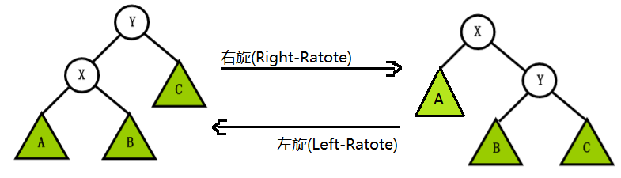

<!-- @import "[TOC]" {cmd="toc" depthFrom=1 depthTo=6 orderedList=false} -->

<!-- code_chunk_output -->

- [第5章-内功-数据结构下卷](#第5章-内功-数据结构下卷)
  - [5.1 红黑树, 一道坎](#51-红黑树-一道坎)
    - [5.1.1 红黑树调整](#511-红黑树调整)
    - [5.1.2 红黑树 insert](#512-红黑树-insert)
    - [5.1.3 红黑树 remove](#513-红黑树-remove)
  - [5.2 dict](#52-dict)
  - [5.3 来个队列吧](#53-来个队列吧)
    - [5.3.1 简单版本队列](#531-简单版本队列)
    - [5.3.2 线程安全版本](#532-线程安全版本)
    - [5.3.3 队列拓展小练习](#533-队列拓展小练习)
  - [5.4 阅读理解](#54-阅读理解)

<!-- /code_chunk_output -->
# 第5章-内功-数据结构下卷

恭喜你, 来到这里. 此刻将是新开始的临界点. 本章算是开发中, 数据结构使用的实战阶段. 将会在数据结构上卷部分继续精进, 争取练习完美, 增强数据结构的内功. 漫天飛絮, 气流涌动 ~ 也许你会觉得点复杂(也许觉得点简单). 而 C 修真一个要求就是, 需要你懂得实现. 才能运用流畅. 一切都会是钻木取火, 自生自灭的务实. 扯一点, 编译型语言要是有, 那种万能数据结构 array 或者 table, 那生产力会飙升 10 倍吧. 写代码就和玩似的 ~ 本章完工宗旨是数据结构可以入得厨房. 代码写的越多, 越发觉得喜欢就好! 也许谁都想在这个元气稀薄的江湖中铸就金身, 何不乘早, 打码穿键盘 ~ 看书出智慧 ~ 

## 5.1 红黑树, 一道坎

红黑树的理论, 推荐搜索多方资料恶补. 它解决的问题是, 防止查找二叉搜索树退化为有序的双向链表. 相似替代有跳跃表, hash 桶. 但具体使用什么, 因个人喜好. 作者只是站在自己框架用到的, 实现角度出发. 带大家去感受, 那些瞎逼调整的二叉树结点 ~ 是如何张狂的出现在编程的世界里 ~ 啊哈 ~ 首先瞄一下总设计野路子 **rtree.h**

```C
#pragma once

#include "stack.h"

//
// 红黑树通用结构, 需要将 $RTREE 放在结构开头部位
//

struct $rtree {
    uintptr_t parentc;
    struct $rtree * left;
    struct $rtree * right;
};

#define $RTREE struct $rtree $node;

typedef struct {
    struct $rtree * root;
    cmp_f  fcmp;
    node_f fdie;
} * rtree_t;

//
// rtee_create - 创建一个红黑树对象
// fcmp     :  cmp_f 结点的比较行为
// fdie     : node_f 结点的销毁行为
// return   : 返回构建红黑树对象
//
extern rtree_t rtree_create(void * fcmp, void * fdie);

//
// rtree_delete - 红黑树删除函数
// tree     : 待删除的红黑树
// return   : void
//
extern void rtree_delete(rtree_t tree);

//
// rtree_search - 红黑树查找函数
// tree     : 待查找的红黑树结构
// pack     : 树结点, fcmp(x, pack)
// return   : 返回查找的结点
//
extern void * rtree_search(rtree_t tree, void * pack);

//
// rtree_insert - 红黑树中插入结点 fnew(pack)
// tree     : 红黑树结构
// pack     : 待插入基础结构
// return   : void
//
extern void rtree_insert(rtree_t tree, void * pack);

//
// rtree_remove - 红黑树中删除结点
// tree     : 红黑树结构
// pack     : 此树中待删除结点
// return   : void
//
extern void rtree_remove(rtree_t tree, void * pack);

```

通过上面结构先体会下设计意图, 例如 rtree_t 结构中 fget, fnew, fcmp, fdie 分别用于红黑树中 search 查找结点, insert 创建结点, insert 查找结点, delete 销毁结点时候的处理规则. 使用的套路是基于注册的设计思路. $RTREE 可类比 $LIST 套路. C 中一种结构继承的技巧, 运用地址重叠确定 struct $rtree 首地址. 而对于 struct $rtree 中 uintptr_t parentc 它表示红黑树的父亲结点地址和当前是红是黑标识两种状态. 利用原理是, 当前结构的内存布局以指针(x86 4 字节, x64 8 字节)位对齐的. 因为地址一定是 4 的倍数, 即 0100 的倍数. 所以最后两位默认用不上, 扩展用于标识结点的红黑属性. 有了这些知识那么就有如下代码.

```C
#include "rtree.h"

//
// struct $rtree 结构辅助操作宏
// r    : 当前结点
// p    : 父结点
// c    : 当前结点颜色, 1 is black, 0 is red
//
#define rtree_parent(r)      ((struct $rtree *)((r)->parentc & ~1))
#define rtree_color(r)       ((r)->parentc & 1)
#define rtree_is_red(r)      (!rtree_color(r))
#define rtree_is_black(r)    rtree_color(r)
#define rtree_set_red(r)     (r)->parentc &= ~1
#define rtree_set_black(r)   (r)->parentc |=  1

inline void rtree_set_parent(struct $rtree * r, struct $rtree * p) {
    r->parentc = (r->parentc & 1) | (uintptr_t)p;
}

inline void rtree_set_color(struct $rtree * r, int color) {
    r->parentc = (r->parentc & ~1) | (1 & color);
}

inline static int rtree_cmp_default(const void * l, const void * r) {
    return (int)((intptr_t)l - (intptr_t)r);
}

```

rtree_parent 通过当前结点获取父结点, rtree_color 获取当前结点颜色标识. 有了这些我们就可以写些简单的部分代码. rtree_create 红黑树创建, rtree_delete 红黑树删除.

```C
//
// rtee_create - 创建一个红黑树对象
// fcmp     :  cmp_f 结点的比较行为
// fdie     : node_f 结点的销毁行为
// return   : 返回构建红黑树对象
//
inline rtree_t 
rtree_create(void * fcmp, void * fdie) {
    rtree_t tree = malloc(sizeof *tree);
    tree->root = NULL;
    tree->fcmp = fcmp ? fcmp : (void *)rtree_cmp_default;
    tree->fdie = fdie;
    return tree;
}

// rtree_die - 后序删除树结点
static void rtree_die(struct $rtree * root, node_f fdie) {
    struct $rtree * pre = NULL;
    struct stack s; stack_init(&s);
    stack_push(&s, root);
    do {
        struct $rtree * cur = stack_top(&s);
        if ((!cur->left && !cur->right) 
         || ((cur->left == pre || cur->right == pre) && pre)) {
            fdie(pre = cur);
            stack_pop(&s);
        } else {
            if (cur->right)
                stack_push(&s, cur->right);
            if (cur->left)
                stack_push(&s, cur->left);
        }
    } while (!stack_empty(&s));
    stack_free(&s);
}

//
// rtree_delete - 红黑树删除函数
// tree     : 待删除的红黑树
// return   : void
//
inline void 
rtree_delete(rtree_t tree) {
    if (tree) {
        if (tree->root && tree->fdie)
            rtree_die(tree->root, tree->fdie);
        tree->root = NULL;
        free(tree);
    }
}
```

同样 rtree_search 红黑树查找操作也是很普通, 和有序二叉树操作一样. 只是多了步查找行为 tree->fget 的选择. 

```C
//
// rtree_search - 红黑树查找函数
// tree     : 待查找的红黑树结构
// pack     : 树结点, fcmp(x, pack)
// return   : 返回查找的结点
//
void * 
rtree_search(rtree_t tree, void * pack) {
    cmp_f fcmp = tree->fcmp;
    struct $rtree * node = tree->root;
    while (node) {
        int diff = fcmp(node, pack);
        if (diff == 0)
            break;
        //
        // tree left less, right greater 
        //
        node = diff > 0 ? node->left : node->right;
    }
    return node;
}
```

### 5.1.1 红黑树调整

后续逐渐拉开了红黑树大戏. 继续细化代码, 逐个分析. 红黑树中有个重要调整旋转操作. 被称为左旋和右旋, 例如左旋代码如下:

```C
/* 
 * 对红黑树的结点 [x] 进行左旋转
 *
 * 左旋示意图 (对结点 x 进行左旋):
 * 
 *       px                             px
 *      /                              /
 *     x                              y
 *    / \       --- (左旋) -->       / \
 *   lx  y                          x   ry
 *      / \                        /     \
 *    ly   ry                    lx       ly  
 *
 */
static void rtree_left_rotate(rtree_t tree, struct $rtree * x) {
    // 设置 [x] 的右孩子为 [y]
    struct $rtree * y = x->right;
    struct $rtree * xparent = rtree_parent(x);

    // 将 [y的左孩子] 设为 [x的右孩子]；
    x->right = y->left;
    // 如果 y的左孩子 非空，将 [x] 设为 [y的左孩子的父亲]
    if (y->left)
        rtree_set_parent(y->left, x);

    // 将 [x的父亲] 设为 [y的父亲]
    rtree_set_parent(y, xparent);

    if (!xparent) {
        // 如果 [x的父亲] 是空结点, 则将 [y] 设为根结点
        tree->root = y;
    } else {
        if (xparent->left == x) {
            // 如果 [x] 是它父结点的左孩子, 则将 [y] 设为 [x的父结点的左孩子]
            xparent->left = y;
        } else {
            // 如果 [x] 是它父结点的左孩子, 则将 [y] 设为 [x的父结点的左孩子]
            xparent->right = y;
        }
    }

    // 将 [x] 设为 [y的左孩子]
    y->left = x;
    // 将 [x的父结点] 设为 [y]
    rtree_set_parent(x, y);
}
```

为什么有这些额外辅助调整操作呢, 主要是为了满足红黑树五大特性.

- 特性 1: 每个结点或者是黑色, 或者是红色.
- 特性 2: 根结点是黑色.
- 特性 3: 每个叶子结点(NIL)是黑色. [这里是指为空(NIL或NULL)的叶子结点]
- 特性 4: 如果一个结点是红色的, 则它的子结点必须是黑色的.
- 特性 5: 从一个结点到该结点的子孙结点的所有路径上包含相同数目的黑色结点.

而左右旋转操作, 就是为了调整出**特性 5**设计的. 相应的右旋操作如下:

```C
/* 
 * 对红黑树的结点 [y] 进行右旋转
 *
 * 右旋示意图(对结点y进行左旋)：
 * 
 *         py                            py
 *        /                             /
 *       y                             x
 *      / \      --- (右旋) -->       / \
 *     x   ry                       lx   y  
 *    / \                               / \
 *  lx   rx                           rx   ry
 * 
 */
static void rtree_right_rotate(rtree_t tree, struct $rtree * y) {
    // 设置 [x] 是当前结点的左孩子。
    struct $rtree * x = y->left;
    struct $rtree * yparent = rtree_parent(y);

    // 将 [x的右孩子] 设为 [y的左孩子]
    y->left = x->right;
    // 如果 x的右孩子 不为空的话，将 [y] 设为 [x的右孩子的父亲]
    if (x->right)
        rtree_set_parent(x->right, y);

    // 将 [y的父亲] 设为 [x的父亲]
    rtree_set_parent(x, yparent);
    if (!yparent) {
        // 如果 [y的父亲] 是空结点, 则将 [x] 设为根结点
        tree->root = x;
    } else {
        if (y == yparent->right) {
            // 如果 [y] 是它父结点的右孩子, 则将 [x] 设为 [y的父结点的右孩子]
            yparent->right = x;
        } else {
            // 如果 [y] 是它父结点的左孩子, 将 [x] 设为 [x的父结点的左孩子]
            yparent->left = x;
        }
    }

    // 将 [y] 设为 [x的右孩子]
    x->right = y;
    // 将 [y的父结点] 设为 [x]
    rtree_set_parent(y, x);
}
```

注释很详细, 看起来也有点头痛. 木办法, 需要各自课间花功夫. 疯狂的吸收相关元气, 照着算法解释抄一遍代码, 写一遍代码, 理解一遍, 坎就过了. 毕竟上面是工程代码, 和教学过家家有些不同. 旋转调整相比后面的插入调整, 删除调整, 要简单很多. 因而趁着它简单, 我们再额外补充些. 红黑树存在父亲结点, 左右旋转相对容易点. 如果一个普通二叉数没有父亲结点, 该如何旋转呢? 我们以陈启峰 2006 高中的时候构建的 **Size Balanced Tree** 为例子演示哈. 分别观望数据结构和旋转实现, 坐山观虎斗(眼睛看), 净收渔翁之利(动手写). 

```C
#pragma once

typedef unsigned long long stree_key_t;

typedef union {
    int i;
    unsigned u;
    void * ptr;
    double number;
    long long ll;
    unsigned long long llu;
} stree_value_t;

struct stree {
    struct stree * left;    // 左子树
    struct stree * right;   // 右子树
    unsigned size;          // 树结点个数

    stree_key_t key;        // tree node key
    stree_value_t value;    // tree node value
};

typedef struct stree * stree_t;

inline unsigned stree_size(const struct stree * const node) {
    return node ? node->size : 0;
}

```



```C
// stree_left_rotate - size tree left rotate
static void stree_left_rotate(stree_t * pode) {
    stree_t node = *pode;
    stree_t right = node->right;

    node->right = right->left;
    right->left = node;
    right->size = node->size;
    node->size = stree_size(node->left) + stree_size(node->right) + 1;

    *pode = right;
}

// stree_right_rotate - size tree right rotate
//
//           (y)   left rotate      (x)
//          /   \  ------------>   /   \
//        (x)   [C]              [A]   (y)
//       /   \     <------------      /   \
//      [A]  [B]    right rotate    [B]   [C]
//
static void stree_right_rotate(stree_t * pode) {
    stree_t node = *pode;
    stree_t left = node->left;

    node->left = left->right;
    left->right = node;
    left->size = node->size;
    node->size = stree_size(node->left) + stree_size(node->right) + 1;

    *pode = left;
}
```

### 5.1.2 红黑树 insert

请原谅作者借(chao)花(xi)献(mei)佛(lian), 弄了个大概无关痛痒的步骤说明. 将一个结点插入到红黑树中. 首先, 将红黑树当作一颗二叉查找树, 将结点插入. 然后, 将结点着色为红色. 最后通过旋转和重新着色等方法来修正该树, 使之重新成为一颗红黑树. 详细过程描述.

- 第一步:

将红黑树当作一颗二叉查找树, 将结点插入红黑树本身就是一颗二叉查找树, 将结点插入后, 该树仍然是一颗二叉查找树. 也就意味着, 树的键值仍然是有序的. 此外, 无论是左旋还是右旋, 若旋转之前这棵树是二叉查找树, 旋转之后它一定还是二叉查找树. 这也就意味着, 任何的旋转和重新着色操作, 都不会改变它仍然是一颗二叉查找树的事实.

- 第二步:

将插入的结点着色为'红色'. 将插入的结点着色为红色, 不会违背'特性 5'!

- 第三步:

通过一系列的旋转或着色等操作, 使之重新成为一颗红黑树. 第二步中, 将插入结点着色为'红色'之后, 不会违背'特性 5'. 那它会违背哪些特性呢? 

对于'特性 1': 不会违背. 因为我们已经将它涂成红色了.

对于'特性 2': 也不会违背. 在第一步中, 我们是将红黑树当作二叉查找树, 然后执行的插入操作. 而根据二叉查找数的特点, 插入操作不会改变根结点. 所以，根结点仍然是黑色.

对于'特性 3': 不会违背. 叶子结点是指的空叶子结点, 插入非空结点并不会对其造成影响

对于'特性 4': 是有可能违背的!

那接下来工作就是想办法'满足特性 4', 就可以将搜索树重新生成一棵红黑树了. 来看看热闹, 代码到底是怎样实现这三大步的.

```C
/*
 * 红黑树插入修正函数
 *
 * 在向红黑树中插入结点之后(失去平衡), 再调用该函数.
 * 目的是将它重新塑造成一颗红黑树.
 *
 * 参数说明:
 *     tree 红黑树的根
 *     node 插入的结点        // 对应 <<算法导论>> 中的 z
 */
static void rtree_insert_fixup(rtree_t tree, struct $rtree * node) {
    struct $rtree * parent, * gparent, * uncle;

    // 若 [父结点] 存在，并且 [父结点] 的颜色是红色
    while ((parent = rtree_parent(node)) && rtree_is_red(parent)) {
        gparent = rtree_parent(parent);

        //若 [父结点] 是 [祖父结点的左孩子]
        if (parent == gparent->left) {
            // Case 1 条件: 叔叔结点是红色
            uncle = gparent->right;
            if (uncle && rtree_is_red(uncle)) {
                rtree_set_black(uncle);
                rtree_set_black(parent);
                rtree_set_red(gparent);
                node = gparent;
                continue;
            }

            // Case 2 条件: 叔叔是黑色, 且当前结点是右孩子
            if (parent->right == node) {
                rtree_left_rotate(tree, parent);
                uncle = parent;
                parent = node;
                node = uncle;
            }

            // Case 3 条件: 叔叔是黑色, 且当前结点是左孩子
            rtree_set_black(parent);
            rtree_set_red(gparent);
            rtree_right_rotate(tree, gparent);
        } else { // 若 [z的父结点] 是 [z的祖父结点的右孩子]
            // Case 1 条件: 叔叔结点是红色
            uncle = gparent->left;
            if (uncle && rtree_is_red(uncle)) {
                rtree_set_black(uncle);
                rtree_set_black(parent);
                rtree_set_red(gparent);
                node = gparent;
                continue;
            }

            // Case 2 条件: 叔叔是黑色, 且当前结点是左孩子
            if (parent->left == node) {
                rtree_right_rotate(tree, parent);
                uncle = parent;
                parent = node;
                node = uncle;
            }

            // Case 3 条件: 叔叔是黑色, 且当前结点是右孩子
            rtree_set_black(parent);
            rtree_set_red(gparent);
            rtree_left_rotate(tree, gparent);
        }
    }

    // 将根结点设为黑色
    rtree_set_black(tree->root);
}

//
// rtree_insert - 红黑树中插入结点 fnew(pack)
// tree     : 红黑树结构
// pack     : 待插入基础结构
// return   : void
//
void 
rtree_insert(rtree_t tree, void * pack) {
    cmp_f fcmp = tree->fcmp;
    struct $rtree * x = tree->root, * y = NULL;
    // 1. 构造插入结点, 并设置结点的颜色为红色
    struct $rtree * node = memset(pack, 0, sizeof(struct $rtree));

    // 2. 将红黑树当作一颗二叉查找树, 将结点添加到二叉查找树中. 默认 从小到大
    while (x) {
        y = x;
        if (fcmp(x, node) > 0)
            x = x->left;
        else
            x = x->right;
    }
    rtree_set_parent(node, y);

    if (!y) {
        // 情况 1: 若 y是空结点, 则将 node设为根
        tree->root = node;
    } else {
        if (fcmp(y, node) > 0) {
            // 情况 2: 
            // 若 "node所包含的值" < "y所包含的值", 则将 [node] 设为 [y的左孩子]
            y->left = node;
        } else {
            // 情况 3: 
            // 若 "node所包含的值" >= "y所包含的值", 将 [node] 设为 [y的右孩子] 
            y->right = node;
        }
    }

    // 3. 将它重新修正为一颗二叉查找树
    rtree_insert_fixup(tree, node);
}

```

手写红黑树是个挑战. 参照很多前辈们筑基期历练的手稿, 顺带从 linux 上拔下来的原始代码敲个几遍后, 构造了上面库. 学习的话 1 查 2 抄 3 默写, 应该能蒙蒙胧吧 ~

### 5.1.3 红黑树 remove

将红黑树内某一个结点删除. 需要执行的操作顺序是: 首先, 将红黑树当作一颗二叉查找树, 将该结点从二叉查找树中删除. 然后, 通过'旋转和重新着色' 等一系列来修正该树, 使之重新
成为一棵红黑树. 详细描述参照下面步骤.

- 第一步:

将红黑树当作一颗二叉查找树, 将结点删除. 这和'删除常规二叉查找树中删除结点的方法是一样的'. 分 3 种情况: 

情况 1. 被删除结点没有儿子, 即为叶结点. 那么直接将该结点删除就 OK 了.

情况 2. 被删除结点只有一个儿子. 那么直接删除该结点, 并用该结点的儿子结点顶替它的位置.

情况 3. 被删除结点有两个儿子. 那么, 先找出它的后继结点. 然后把'它的后继结点的内容'复制给'该结点的内容'. 之后, 删除'它的后继结点'. 在这里, 后继结点相当于替身, 在将后继结点的内容复制给'被删除结点'之后, 再将后继结点删除. 这样就巧妙的将问题转换为'删除后继结点'的情况了, 下面就考虑后继结点. 在'被删除结点'有两个非空子结点的情况下, 它的后继结点不可能是双子非空. 既然'被删除结点的后继结点'不可能双子都非空, 就意味着'该结点的后继结点'要么没有儿子, 要么只有一个儿子. 若没有儿子, 则按'情况 1' 进行处理. 若只有一个儿子, 则按'情况 2' 进行处理.

- 第二步:

通过'旋转和重新着色'等一系列来修正该树, 使之重新成为一棵红黑树. 因为'第一步'中删除结点之后, 可能会违背红黑树的特性. 所以需要通过'旋转和重新着色'来修正该树, 使之重新成为一棵红黑树. 最终对着算法说明和 linux 红黑树源码构造的一种工程实现. 构造了 rtree_remove 纯属一起作死一起嗨.

```C
/*
 * 红黑树删除修正函数
 *
 * 在从红黑树中删除插入结点之后(红黑树失去平衡), 再调用该函数.
 * 目的是将它重新塑造成一颗红黑树.
 *
 * 参数说明:
 *     tree 红黑树的根
 *     node 待修正的结点
 */
static void rtree_remove_fixup(rtree_t tree, 
                               struct $rtree * node, 
                               struct $rtree * parent) {
    struct $rtree * other;

    while ((!node || rtree_is_black(node)) && node != tree->root) {
        if (parent->left == node) {
            other = parent->right;
            if (rtree_is_red(other)) {
                // Case 1: x的兄弟 w 是红色的  
                rtree_set_black(other);
                rtree_set_red(parent);
                rtree_left_rotate(tree, parent);
                other = parent->right;
            }
            if ((!other->left || rtree_is_black(other->left)) &&
                (!other->right || rtree_is_black(other->right))) {
                // Case 2: x的兄弟 w 是黑色, 且 w的俩个孩子也都是黑色的  
                rtree_set_red(other);
                node = parent;
                parent = rtree_parent(node);
            } else {
                if (!other->right || rtree_is_black(other->right)) {
                    // Case 3: x的兄弟 w 是黑色的, 并且 w的左孩子是红色, 右孩子为黑色  
                    rtree_set_black(other->left);
                    rtree_set_red(other);
                    rtree_right_rotate(tree, other);
                    other = parent->right;
                }
                // Case 4: x的兄弟 w 是黑色的, 并且 w的右孩子是红色的, 左孩子任意颜色
                rtree_set_color(other, rtree_color(parent));
                rtree_set_black(parent);
                rtree_set_black(other->right);
                rtree_left_rotate(tree, parent);
                node = tree->root;
                break;
            }
        } else {
            other = parent->left;
            if (rtree_is_red(other)) {
                // Case 1: x 的兄弟 w 是红色的  
                rtree_set_black(other);
                rtree_set_red(parent);
                rtree_right_rotate(tree, parent);
                other = parent->left;
            }
            if ((!other->left || rtree_is_black(other->left)) &&
                (!other->right || rtree_is_black(other->right))) {
                // Case 2: x 的兄弟 w 是黑色, 且 w的俩个孩子 也都是黑色的  
                rtree_set_red(other);
                node = parent;
                parent = rtree_parent(node);
            } else {
                if (!other->left || rtree_is_black(other->left)) {
                    // Case 3: x的兄弟 w 是黑色的, 并且 w的左孩子是红色, 右孩子为黑色
                    rtree_set_black(other->right);
                    rtree_set_red(other);
                    rtree_left_rotate(tree, other);
                    other = parent->left;
                }
                // Case 4: x的兄弟 w 是黑色的, 并且 w的右孩子是红色的, 左孩子任意颜色.
                rtree_set_color(other, rtree_color(parent));
                rtree_set_black(parent);
                rtree_set_black(other->left);
                rtree_right_rotate(tree, parent);
                node = tree->root;
                break;
            }
        }
    }
    if (node) rtree_set_black(node);
}

//
// rtree_remove - 红黑树中删除结点
// tree     : 红黑树结构
// pack     : 此树中待删除结点
// return   : void
//
void 
rtree_remove(rtree_t tree, void * pack) {
    int color;
    struct $rtree * child, * parent, * node = pack;

    // 被删除结点的 "左右孩子都不为空" 的情况
    if (node->left && node->right) {
        // 被删结点的后继结点. (称为 "取代结点")
        // 用它来取代 "被删结点" 的位置, 然后再将 "被删结点" 去掉
        struct $rtree * replace = node;

        // 获取后继结点
        replace = replace->right;
        while (replace->left)
            replace = replace->left;

        // "node结点" 是根结点, 更新根结点
        if (!(parent = rtree_parent(node)))
            tree->root = replace;
        else {
            // "node结点" 不是根结点(只有根结点不存在父结点)
            if (parent->left == node)
                parent->left = replace;
            else
                parent->right = replace;
        }

        // child 是 "取代结点" 的右孩子, 也是需要 "调整的结点"
        // "取代结点" 肯定不存在左孩子! 因为它是一个后继结点
        child = replace->right;
        parent = rtree_parent(replace);
        // 保存 "取代结点" 的颜色
        color = rtree_color(replace);

        // "被删除结点" 是 "它的后继结点的父结点"
        if (parent == node)
            parent = replace; 
        else {
            // child不为空
            if (child)
                rtree_set_parent(child, parent);
            parent->left = child;

            replace->right = node->right;
            rtree_set_parent(node->right, replace);
        }

        rtree_set_parent(replace, rtree_parent(node));
        rtree_set_color(replace, rtree_color(node));
        replace->left = node->left;
        rtree_set_parent(node->left, replace);

        goto ret_out;
    }

    if (node->left)
        child = node->left;
    else 
        child = node->right;

    parent = rtree_parent(node);
    // 保存 "取代结点" 的颜色
    color = rtree_color(node);

    if (child)
        rtree_set_parent(child, parent);

    // "node结点" 不是根结点
    if (!parent)
        tree->root = child;
    else {
        if (parent->left == node)
            parent->left = child;
        else
            parent->right = child;
    }

ret_out:
    if (color) // 黑色结点重新调整关系, 并销毁结点操作
        rtree_remove_fixup(tree, child, parent);
    if (tree->fdie)
        tree->fdie(node);
}
```

红黑树代码是非线性的, 需要一点看材料的功夫. 就当扩展视野, 吸收成自己的代码库. 写代码很多时候要同姑苏慕容学习, 以彼之道还治彼身. 这里关于红黑树的梗过去了, 飞云逐日, 不如, 一切安好 ~ 

其实我们不是写不出来, 而是想不出来这么巧妙数学结构. 真实实战中, 是走宏模板机制. 这本小册子实现的 list, red black tree 更多是学习机制, 距离实战还是不漂亮. 不漂亮根源在于 C 很难抽离业务通用库. 如果有第二版我们细致简单构造相关例子, 例如 list 库是否需要我们需要讨论讨论等等. 但其中设计思路学习和消化还是大有益处的. 同样对于红黑树, 跳表, 能看懂就好, 不要求能手写, 因为那些代码一直在哪里, 不用和科研的抢活, 毕竟分工不一样. 开发工程师是实施, 是拿来主义的匠人. 

## 5.2 dict

趁热打铁 map -> dict. 红黑树是上层 map 库的实现基石, 同样另一种相似的查找库 dict, 有时候采用的是 hash 桶算法去实现, 综合查找性能高于 map. 主要应用场景是通过 key -> value 映射查找业务操作. 由于应用场景更多, 我们带大家走遍形式, 直接看接口设计 **dict.h**

```C
#pragma once

#include "struct.h"

//
// dict_t - C 字符串为 key 的字典结构
//
typedef struct dict * dict_t;

//
// dict_delete - 字典删除
// d        : dict_create 创建的字典对象
// return   : void 
//
extern void dict_delete(dict_t d);

//
// dict_create - 字典创建
// fdie     : node_f 销毁行为
// return   : dict_t
//
extern dict_t dict_create(void * fdie);

//
// dict_get - 获取字典中对映的 v
// d        : dict_create 创建的字典对象
// k        : 查找的 key 
// return   : 查找的 v, NULL 表示没有
//
extern void * dict_get(dict_t d, const char * k);

//
// dict_set - 设置一个 <k, v> 结构
// d        : dict_create 创建的字典对象
// k        : 插入的 key
// v        : 插入数据的值, NULL 会销毁 k
// return   : void
//
extern void dict_set(dict_t d, const char * k, void * v);
```

内功练到后面是不是有种势如破竹的感觉, 清晰易懂, 简单明了. (前提是自己手熟) 那开始实现意图剖析, 来看 dict 内功的气海结构.

```C
#include "dict.h"

#define DICT_INIT_UINT (1u<<6)

struct keypair {
    struct keypair * next;
    unsigned hash;
    void * val;
    char key[];
};

// keypair_delete - 销毁结点数据
inline void keypair_delete(struct keypair * pair, node_f fdie) {
    if (pair->val && fdie)
        fdie(pair->val);
    free(pair);
}

// keypair_create - 创建结点数据
inline struct keypair * keypair_create(unsigned hash, 
                                       void * v, const char * k) {
    size_t len = strlen(k) + 1;
    struct keypair * pair = malloc(sizeof(struct keypair) + len);
    pair->hash = hash;
    pair->val = v;
    memcpy(pair->key, k, len);
    return pair;
}

struct dict {
    node_f fdie;                // 结点注册的销毁函数
    unsigned used;              // 用户已经使用的结点个数
    unsigned size;              // 结点容量
    struct keypair ** table;    // 集合
};
```

dict::table 就是我们的 keypair 池子, 存放所有 struct keypair 结构. 如果冲突了, 那就向 keypair::next 链式结构中接着插入. 如果池子满了, 那就重新挖一个大点的池子, 重新调整所有关系. 这就是核心思想! 不妨详细看看池子漫了的时候的策略.

```C
static unsigned dict_get_resize(struct dict * d) {
    unsigned used = d->used;
    unsigned size = d->size;

    // 看数据是否需要扩张
    if (used >= size) {
        return size << 1;
    }

    // 数据收缩, 拍脑门算法
    while (used < (size >> 2) && size > DICT_INIT_UINT) {
        size >>= 1;
    }

    // 没有变化数据不用管
    return 0;
}

static void dict_resize(struct dict * d) {
    unsigned used = 0;
    struct keypair ** table;

    // 看是否需要收缩
    unsigned size = dict_get_resize(d);
    if (size == 0u) {
        return;
    }
    
    // 构造新的内存布局大小
    table = calloc(size, sizeof(struct keypair *));

    // 开始转移数据
    for (unsigned i = 0; i < d->size && d->used > used; i++) {
        struct keypair * pair = d->table[i];
        while (pair) {
            struct keypair * next = pair->next;

            // 取余
            unsigned index = pair->hash & (size - 1);

            pair->next = table[index];
            table[index] = pair;
            ++used;

            pair = next;
        }
    }

    // table 重新变化
    free(d->table);
    d->table = table;
    d->size = size;
}
```

dict_resize 中选择了取 2 的幂大小当做 table 容量去操作. 这样写优势在于, 可以用 & 替代 % 运算. 减少运算指令. 存在的隐患就是 hash 取余的不够随机导致最终池子中数据分布不均, 依赖链表解冲突. 也有选取了素数表, 希望减少冲突, 提升性能. 接着看 dict_resize 做的工作, 判断容量是否够, 不够开始重构 table. 有了这些可以看看 dict 的 delete 和 create 操作实现.

```C
void dict_delete_partial(dict_t d) {
    free(d->table);
    free(d);
}

//
// dict_delete - 字典删除
// d        : dict_create 创建的字典对象
// return   : void 
//
void 
dict_delete(dict_t d) {
    if (!d) return;

    for (unsigned i = 0; i < d->size; i++) {
        struct keypair * pair = d->table[i];
        while (pair) {
            struct keypair * next = pair->next;
            keypair_delete(pair, d->fdie);
            pair = next;
        }
    }

    dict_delete_partial(d);
}

//
// dict_create - 字典创建
// fdie     : v 销毁函数
// return   : dict_t
//
inline dict_t 
dict_create(void * fdie) {
    struct dict * d = malloc(sizeof(struct dict));
    d->used = 0;
    d->size = DICT_INIT_UINT;
    d->fdie = fdie;
    // 默认构建的第一个素数表 index = 0
    d->table = calloc(DICT_INIT_UINT, sizeof(struct keypair *));
    return d;
}
```

聊到现在大家会发现, create and delete 都是成对出现. 命名很固定, 这是良好一种编码态度, 创建和删除一定要做好. 特别是删除, 不能留坑. 之后是获取字典中数据.

```C
static unsigned SDBMHash(const char * k) {
    register unsigned o,h = 0u;
    while ((o = *k++))
        h = o + h * 65599u;
    return h;
}

//
// dict_get - 获取字典中对映的 v
// d        : dict_create 创建的字典对象
// k        : 查找的 key 
// return   : 查找的 v, NULL 表示没有
//
void * 
dict_get(dict_t d, const char * k) {
    unsigned hash, index;
    struct keypair * pair;
    assert(d && k);

    hash = SDBMHash(k);
    index = hash & (d->size - 1);
    pair = d->table[index];

    while (pair) {
        if (!strcmp(pair->key, k))
            return pair->val;
        pair = pair->next;
    }

    return NULL;
}
```

dict_get hash 之后 cmp 操作很普通. 随后进入 dict 修炼最后一关, dict_set 操作.

```C
void dict_del(dict_t d, const char * k) {
    unsigned hash = SDBMHash(k);
    unsigned index = hash & (d->size - 1);
    struct keypair * pair = d->table[index];
    struct keypair * prev = NULL;

    while (pair) {
        // 找见了数据
        if (pair->hash == hash && !strcmp(pair->key, k)) {
            // 删除操作
            if (NULL == prev)
                d->table[index] = pair->next;
            else
                prev->next = pair->next;

            // 销毁结点并尝试缩减容量
            keypair_delete(pair, d->fdie);
            --d->used;
            return dict_resize(d);
        }

        prev = pair;
        pair = pair->next;
    }
}

//
// dict_set - 设置一个 <k, v> 结构
// d        : dict_create 创建的字典对象
// k        : 插入的 key
// v        : 插入数据的值, NULL 会销毁 k
// return   : void
//
void 
dict_set(dict_t d, const char * k, void * v) {
    assert(d && k);

    // 走删除分支
    if (NULL == v) {
        return dict_del(d, k);
    }

    // 检查一下内存, 看是否要扩充
    dict_resize(d);

    // 开始寻找数据
    unsigned hash = SDBMHash(k);
    unsigned index = hash & (d->size - 1);
    struct keypair * pair = d->table[index];

    while (pair) {
        // 找见了数据
        if (pair->hash == hash && !strcmp(pair->key, k)) {
            // 相同数据直接返回什么都不操作
            if (pair->val == v) {
                return;
            }

            // 更新结点
            if (d->fdie)
                d->fdie(pair->val);
            pair->val = v;
            return;
        }

        pair = pair->next;
    }

    // 没有找见设置操作, 直接插入数据
    pair = keypair_create(hash, v, k);
    pair->next = d->table[index];
    d->table[index] = pair;
    ++d->used;
}
```

这里为 dict_set(d, k, NULL) 赋予新语义 dict_del 删除字典 k 操作. 单纯的 set 操作仍然是三部曲 reset -> get -> set, 到这里 dict 内核部分完工了, 更多的有兴趣可以翻阅更多代码. 如果性能要求更高场景可以 tree 和 hash 结合, 整体用 hash 局部冲突用 tree 替代 list. 当然真实底层库中比这些都复杂, 但都是这些基础概念和能力建构起来的, 苦练内功学什么都快. 类比奇遇太子张无忌 ~ 

## 5.3 来个队列吧

队列实战意义非凡, 基本偏 C 系列的开发中不是链表, 就是队列. 队列可以比喻为咱们排队等待进入火车站, 那个一排排的栏杆让人一个个的检查过去, 就是队列作用. 队列超好用的能力是让异步编程变成同步并发. 说白了就是将异步程序变成顺序同步程序. 不用考虑并发上资源冲突, 开发起来很爽. 而在 C 中队列至高王的装逼是无锁, 而我们这里还是会老老实实带大家用原子自旋锁实现(不出错至少是良). 大伙还记得 **stdatomic.h** 吗? 练气期之后的战斗, 无不是队列领域的对撞. 随我打开简单的队列世界的传送门. 

### 5.3.1 简单版本队列

普通队列数学本质是元素的先进先出. 我们实现采用直白思路是通过动态循环数组和原子锁构建 pop 和 push. 凡事先看接口, 熟悉起用法, 请阅 **q.h**

```C
#pragma once

#include "struct.h"

//
// pop empty <=> tail == -1 ( head == 0 )
// push full <=> head == (tail + 1) % cap && tail >= 0
//
typedef struct q {
    int     head;       // 头结点
    int     tail;       // 尾结点
    int      cap;       // 队列容量
    void ** data;       // 队列实体
} q_t[1];

//
// q_init - 初始化
// q      : 队列对象
// return : void
// Q_INT  - 队列初始大小, 必须是 2 的幂
#define Q_INT     (1<< 6)
inline void q_init(q_t q) {
    q->data = malloc(sizeof(void *) * Q_INT);
    q->cap = Q_INT;
    q->head =  0;
    q->tail = -1;
}

inline void q_free(q_t q) {
    free(q->data);
}

inline bool q_empty(q_t q) {
    return q->tail < 0;
}

inline bool q_exist(q_t q) {
    return q->tail >= 0;
}

//
// q_swap - q swap
// r      : q one
// w      : q two
// return : void
//
inline void q_swap(q_t r, q_t w) {
    q_t q;
    q[0] = r[0];
    r[0] = w[0];
    w[0] = q[0];
}

//
// q_pop - 队列中弹出消息数据
// q      : 队列对象
// return : 若队列 empty, 返回 NULL
//
extern void * q_pop(q_t q);

//
// q_push - 队列中压入数据
// q      : 队列对象
// m      : 压入消息
// return : void
// 
extern void q_push(q_t q, void * m);

//
// q_delete - 队列删除
// q        : 队列对象
// fdie     : node_f push 结点删除行为
// return   : void
//
extern void q_delete(q_t q, node_f fdie);

```

我写的循环队列, 喜欢用 q::head == (q::tail + 1) & (q::size - 1) 标识队列为满, q::tail == -1 标识队列为空. 读者可以思考下还有没有其它方式标识 empty 和 full状态, 再互相对比方式差异好处和坏处! 那仍然先看看 q_delete 实现.

```C
#include "q.h"

//
// q_delete - 队列删除
// q        : 队列对象
// fdie     : node_f push 结点删除行为
// return   : void
//
void 
q_delete(q_t q, node_f fdie) {
    // 销毁所有对象
    if (fdie && q_exist(q)) {
        for (;;) {
            fdie(q->data[q->head]);
            if (q->head == q->tail)
                break;
            q->head = (q->head + 1) & (q->cap - 1);
        }
    }

    q_free(q);
}
```

q->head == q->tail 是查找结束条件. 整个删除销毁操作, 等同于 array range. 重点在于 q->head = (q->head + 1) & (q->size - 1); 找到数组下一个位置的索引. 那再看看 q_pop 在队列中弹出元素.

```C
//
// q_pop - 队列中弹出消息数据
// q      : 队列对象
// return : 若队列 empty, 返回 NULL
//
void * 
q_pop(q_t q) {
    void * m = NULL;
    if (q_exist(q)) {
        m = q->data[q->head];
        if (q->tail != q->head)
            q->head = (q->head + 1) & (q->cap - 1);
        else {
            q->head =  0; // empty 情况, 重置 tail 和 head
            q->tail = -1;
        }
    }
    return m;
}
```

q_push 操作包含了 q_expand 内存扩充操作, 用于内存重建, 同前面的 dict_resize 思路相似. 此刻 q.c 实现部分 50 多行, 已经全部贴完了. 是不是觉得工程中用到的数据结构也不过如此.   

```C
// q_expand - expand memory by twice
static void q_expand(q_t q) {
    int i, cap = q->cap << 1;
    void ** p = malloc(sizeof(void *) * cap);
    for (i = 0; i < q->cap; ++i)
        p[i] = q->data[(q->head + i) & (q->cap - 1)];
    free(q->data);

    // 重新构造内存关系
    q->tail = q->cap;
    q->cap = cap;
    q->data = p;
    q->head = 0;
}

//
// q_push - 队列中压入数据
// q      : 队列对象
// m      : 压入消息
// return : void
// 
void 
q_push(q_t q, void * m) {
    int tail = (q->tail + 1) & (q->cap - 1);
    // 队列 full 直接扩容
    if (tail == q->head && q->tail >= 0)
        q_expand(q);
    else
        q->tail = tail;
    q->data[q->tail] = m;
}
```

### 5.3.2 线程安全版本

看 **q.h** 实现也会发现, 它不是线程安全的. 并发的 push 和 pop 将未定义. 我们不妨将其包装成线程安全的消息队列 **mq.h**

```C
#pragma once

#include "q.h"
#include "spinlock.h"

struct mq {
    q_t       q;       // 队列
    atomic_flag lock;  // 自旋锁
};

typedef struct mq * mq_t;

//
// mq_delete - 消息队列删除
// q        : 消息队列对象
// fdie     : node_f 行为, 删除 push 进来的结点
// return   : void
//
inline void mq_delete(mq_t q, node_f fdie) {
    // 销毁所有对象
    q_delete(q->q, fdie);
    free(q);
}

//
// mq_create - 消息队列创建
// return   : 消息队列对象
//
inline mq_t mq_create(void) {
    struct mq * q = malloc(sizeof(struct mq));
    q_init(q->q);
    q->lock = (atomic_flag)ATOMIC_FLAG_INIT;
    return q;
}

//
// mq_pop - 消息队列中弹出消息, 并返回数据
// q        : 消息队列对象
// return   : 若 mq empty return NULL
//
inline void * mq_pop(mq_t q) {
    atomic_flag_lock(&q->lock);
    void * m = q_pop(q->q);
    atomic_flag_unlock(&q->lock);
    return m;
}

//
// mq_push - 消息队列中压入数据
// q        : 消息队列对象
// m        : 压入的消息
// return   : void
//
inline void mq_push(mq_t q, void * m) {
    atomic_flag_lock(&q->lock);
    q_push(q->q, m);
    atomic_flag_unlock(&q->lock);
}

//
// mq_len - 消息队列的长度
// q        : 消息队列对象
// return   : 返回消息队列长度
//
extern inline int mq_len(mq_t q) {
    int cap, head, tail;
    atomic_flag_lock(&q->lock);
    if ((tail = q->q->tail) == -1) {
    atomic_flag_unlock(&q->lock);
        return 0;
    }

    cap = q->q->cap;
    head = q->q->head;
    atomic_flag_unlock(&q->lock);

    // 计算当前时间中内存队列的大小
    tail -= head - 1;
    return tail > 0 ? tail : tail+cap;
}

```

不知道有没有同学好奇 **mq_delete** 为什么不是线程安全的? 这个是这样的, mq_delete 一旦执行后, 那么 mq 随后的所有的操作都不应该被调用. 因为内存都没了, 别让野指针大魔头冲出封印. 基于这个, mq_delete 只能在所有业务都停下的时候调用. 所以无需画蛇添足. mq_len 额外添加的函数用于线上监控当前循环队列的峰值. 用于观测和调整代码内存分配策略. 这套骚操作, 主要是感悟(临摹)化神巨擘云风 skynet mq 残留的意境而构建的. 欢迎道友修炼 ~    

### 5.3.3 队列拓展小练习

本章已经轻微剧透了些筑基功法的消息. 在我们处理服务器通信的时候, 采用 UDP 报文套接字能很好处理边界问题, 因为 UDP 包有固定大小. 而 TCP 流式套接字一直在收发, 流式操作需要自行定义边界. 因此 TCP 的报文边切割需要程序员自己处理. 这里就利用所学给出一个简易的解决方案 TLV. 首先定义消息结构.

```C
#pragma once

#include "struct.h"
#include "system.h"

//
// msg_t 网络传输协议结构
// sz -> type + len 本地小端字节序 -> data
//
typedef struct {
    // uint8_t type + uint24_t len + data[]
    uint32_t sz;
    char data[];
} * msg_t;

//
// MSG_TYPE - 得到当前消息 8bit 1 字节 type
// MSG_LEN  - 得到当前消息长度 24bit 3 字节 len
// MSG_SZ   - 8bit type + 24 bit len -> uint32_t sz
//
#define MSG_TYPE(sz)  (uint8_t)((uint32_t)(sz)>>24)
#define MSG_LEN( sz)  ((uint32_t)(sz)&0xFFFFFF)
#define MSG_SZ(t, n)  (((uint32_t)(uint8_t)(t)<<24)|(uint32_t)(n))

// small - 转本地字节序(小端)
inline uint32_t small(uint32_t x) {
# ifdef ISBIG
    uint8_t t;
    uint8_t * p = (uint8_t *)&x;

    t = p[0]; p[0] = p[3]; p[3] = t;
    t = p[1]; p[1] = p[2]; p[2] = t;
# endif
    return x;
}

//
// msg_create - msg 创建函数, send(fd, msg->data, msg->sz, 0)
// data     : 待发送的消息体
// len      : data 的长度
// return   : 创建好的 msg_t 消息体
//
inline static msg_t msg_create(const void * data, uint32_t len) {
    DCODE({
        if(!data || len <= 0 || len > 0xFFFFFF)
            EXIT("error data = %p, len = %u.\n", data, len);
    });

    uint32_t sz = len + sizeof(uint32_t);
    msg_t msg = malloc(sizeof(*msg) + sz);
    msg->sz = sz;
    
    // sz -> type + len 本地小端字节序 -> data
    sz = MSG_SZ(0, len);
    sz = small(sz);

    // 开始内存填充
    memcpy(msg->data, &sz, sizeof(uint32_t));
    memcpy(msg->data + sizeof(uint32_t), data, len);

    return msg;
}

//
// msg_delete - msg 删除函数
// msg      : msg_t 消息体
// return   : void
//
inline static void msg_delete(msg_t msg) {
    if (msg) free(msg);
}

```

small 用于本地字节序转为小端字节序. 用于此消息一律走小端字节序的规则. 协议方面我们采用 sz + data  构建 bit 流传输, 其中 sz = 8 bit type + 24 bit size. 用于服务器和客户端基础通信协议. 其中 msg_create 主要将 data -> data + sz -> type size data 消息流构建过程, 代码比文字更有说服力. 这处代码很清晰好懂. 随后分享的是 msg 切包部分, 不同人有不同见解, 这里纯当凑小怪兽, 辅助玩家提升经验 ~

```C
#pragma once

#include "msg.h"

//
// buffer recv send msg
//
typedef struct msg_buf * msg_buf_t;

//
// msg_buf_create - msg buffer 创建
// return   : msg buffer
//
extern msg_buf_t msg_buf_create(void);

//
// msg_buf_delete - msg buffer 删除
// q        : msg buffer
// return   : void
//
extern void msg_buf_delete(msg_buf_t q);

//
// buf_append - msg buffer 添加数据, 并尝试解析出结果
// q        : msg buffer
// p        : return msg
// data     : 内存数据
// sz       : 内存数据 size
// return   : EParse 协议解析错误, ESmall 协议不完整
//
extern int msg_buf_append(msg_buf_t q,
                          const void * data, uint32_t sz,
                          msg_t * p);

```

我们先看 struct msg_buf 结构设计. 

```C
#include "buf.h"

#define BUF_INT         (128)

//
// msg buffer manager
//
struct msg_buf {
    uint32_t sz;    // q.sz is msg header body size length
    char * data;    // 数据流
    int cap;        // 容量
    int len;        // 长度
};

// msg_buf_expand - 内存扩充 
static void msg_buf_expand(struct msg_buf * q, int sz) {
    // 确定内存是否足够
    int cap = q->cap, len = q->len;
    if (len + sz <= cap)
        return;

    // 开始构建所需内存
    do cap <<= 1; while (len + sz > cap);
    q->data = realloc(q->data, cap);
    assert(q->data != NULL);
    q->cap = cap;
}
```

这样的结构对我们而言是不是太熟悉了. 随后阅读 create 和 delete 简单系列.

```C
//
// msg_buf_create - msg buffer 创建
// return   : msg buffer
//
inline msg_buf_t 
msg_buf_create(void) {
    struct msg_buf * q = malloc(sizeof(struct msg_buf));
    q->sz = 0;
    q->data = malloc(q->cap = BUF_INT);
    q->len = 0;
    return q;
}

//
// msg_buf_delete - msg buffer 删除
// q        : msg buffer
// return   : void
//
inline void 
msg_buf_delete(msg_buf_t q) {
    if (q) {
        free(q->data);
        free(q);
    }
}
```

而对于 msg_buf_append 将会复杂一点. 我们将其分为两个环节, 如果传入的 data 内存够, 我们直接从中尝试解析出 msg_t 消息体. 否则进入第二环节, 等待填充候, 再尝试解析. 代码整体认识如下.

```C
//
// buf_append - msg buffer 添加数据, 并尝试解析出结果
// q        : msg buffer
// data     : 内存数据
// sz       : 内存数据 size
// p        : return msg
// return   : EParse 协议解析错误, ESmall 协议不完整
//
int 
msg_buf_append(msg_buf_t q,
               const void * data, uint32_t sz,
               msg_t * p) {
    DCODE({
        if(!q || !data || !sz || !p) {
            EXIT(
                "error q = %p, data = %p, sz = %u, p = %p\n", 
                q, data, sz, p
            );
        }
    });

    // data, sz 刚好可以解析出 msg 情况处理
    if (q->sz <= 0 && sz > BUF_INT) {
        *p = msg_buf_data_pop(q, data, sz);
        if (*p)
            return SBase;
    }

    msg_buf_push(q, data, sz);
    return msg_buf_pop(q,p);
}
```

而 msg_buf_data_pop 解析可以尝试当阅读理解, 相对容易一点. 但需要对比 msg_create 着看. 注释很用心, 欢迎阅读 ~ 

```C
// msg_data_pop - data pop msg 
static msg_t msg_buf_data_pop(msg_buf_t q, 
                              const char * data, uint32_t n) {
    // step 1 : 报文长度 buffer q->sz init
    uint32_t sz;
    memcpy(&sz, data, sizeof sz);
    sz = small(sz);

    // step 2 : check data len is true
    uint32_t len = MSG_LEN(q->sz);
    if (len <= 0 || len + sizeof(uint32_t) > n)
        return NULL;

    // step 3 : create msg
    msg_t msg = malloc(sizeof(*msg) + len);
    msg->sz = sz;
    memcpy(msg->data, data + sizeof(uint32_t), len);

    // step 4 : 数据存在, 填入剩余数据
    len += sizeof(uint32_t);
    if (len < n) {
        msg_buf_push(q, data + len, n - len);
    }

    return msg;
}
```

那开始一键横扫了

```C
//
// msg_buf_push - msg buffer push data
// q        : msg buffer
// data     : 内存数据
// sz       : 内存数据 size
//
inline static void msg_buf_push(msg_buf_t q, 
                                const void * data, int len) {
    msg_buf_expand(q, len);
    memcpy(q->data + q->len, data, len);
    q->len += len; 
}

// msg_buf_pop_data - q pop len data
inline void msg_buf_pop_data(msg_buf_t q, 
                             void * data, int len) {
    memcpy(data, q->data, len);
    q->len -= len;
    memmove(q->data, q->data + len, q->len);
}

// msg_buf_pop_sz - q pop sz
inline void msg_buf_pop_sz(msg_buf_t q) {
    msg_buf_pop_data(q, &q->sz, sizeof(uint32_t));
    q->sz = small(q->sz);
}

//
// msg_buf_pop - msg buffer pop
// q        : msg buffer 
// p        : return msg
// return   : EParse 协议解析错误, ESmall 协议不完整
//
int msg_buf_pop(msg_buf_t q, msg_t * p) {
    // step 1 : 报文长度 buffer q->sz check
    if (q->sz <= 0 && q->len >= sizeof(uint32_t))
        msg_buf_pop_sz(q);
    // step 2 : check data parse is true
    int len = MSG_LEN(q->sz);
    if (len <= 0 && q->sz > 0) {
        *p = NULL;
        return EParse;
    }

    // step 3 : q->sz > 0 继续看是否有需要的报文内容
    if (len <= 0 || len > q->len) {
        *p = NULL;
        return ESmall;
    }

    // step 4: 索要的报文长度存在, 开始构建返回
    msg_t msg = malloc(sizeof(*msg) + len);
    msg->sz = q->sz;
    msg_buf_pop_data(q, msg->data, len);
    q->sz = 0;

    *p = msg;
    return SBase;
}
```

对于 msg_buf_data_pop 解析可以尝试当阅读理解, 相对容易一点. 但需要对比 msg_create 从 msg_buf_push 到 msg_buf_pop 到最后的 msg_buf_append 经历过多少个日夜修炼. 此刻不知道有没有感觉上来, 代码中的能量越来越高, 适用性越来越针对. 码多了会明白, 很多极致优化的方案, 都是偏方, 心智成本高. 咱们这里传授的武功秘籍, 只要你多比划多实战. 必定不会被天外飞仙这种失传的绝技一招干死, 怎么着也有希望 Double kill.

***
    ...
    每一条路的尽头 是一个人
    看不透 世上的真
    你还是 这样天真

    假如我可以再生
    像太极为两仪而生
    动静间如行云流水
    追一个豁达的眼神
    ...
***

武侠小说中杜撰过一句话, 内功决定能否成为宗师, 武技决定能否成为侠客 ~ 

## 5.4 阅读理解

我们在内功修炼中写了不少实战中操练的数据结构, 不妨来个简单的阅读理解来调味. 构建一种通用的堆结构库. 让你嗨嗨嗨 :0 认真修炼, 精纯内功 ~

```C
#include "heap.h"

#define HEAP_INIT_INT   (1<<5)

struct heap {
    void ** data;
    int len;
    int cap;
    cmp_f fcmp;
};

heap_t 
heap_create(cmp_f fcmp) {
    struct heap * h = malloc(sizeof(struct heap));
    if (h == NULL) {
        return NULL;
    }
    
    h->data = malloc(sizeof(void *) * HEAP_INIT_INT);
    if (h->data == NULL) {
        free(h);
        return NULL;
    }
    h->cap = HEAP_INIT_INT;
    h->len = 0;
    h->fcmp = fcmp;

    return h;
}

void 
heap_delete(heap_t h, node_f fdie) {
    if (h != NULL) {
        return;
    }
    if (fdie != NULL && h->len > 0) {
        for (int i = h->len - 1; i >= 0; i--)
            fdie(h->data[i]);
    }
    free(h->data);
    free(h);
}

inline int 
heap_len(heap_t h) {
    return h->len;
}

inline void * 
heap_top(heap_t h) {
    return h->len > 0 ? *h->data : NULL;
}

// down - 堆结点下沉, 从上到下沉一遍
static void down(cmp_f fcmp, void * data[], int len, int x) {
    void * m = data[x];
    for (int i = (x<<1)+1; i < len; i = (x<<1)+1) {
        if (i+1 < len && fcmp(data[i+1], data[i]) < 0)
            ++i;
        if (fcmp(m, data[i]) <= 0)
            break;
        data[x] = data[i];
        x = i;
    }
    data[x] = m;
}

// up - 堆结点上浮, 从下到上浮一遍
static void up(cmp_f fcmp, void * node, void * data[], int x) {
    while (x > 0) {
        void * m = data[(x-1)>>1];
        if (fcmp(m, node) <= 0)
            break;
        data[x] = m;
        x = (x-1)>>1;
    }
    data[x] = node;
}

bool
heap_push(heap_t h, void * node) {
    if (h->len >= h->cap) {
        void * ptr = realloc(h->data, h->cap<<1);
        if (ptr == NULL) {
            return false;
        }
        h->cap <<= 1;
        h->data = ptr;
    }

    up(h->fcmp, node, h->data, h->len++);
    return true;
}

static inline void heap_reduce(struct heap * h) {
    if (h->cap > HEAP_INIT_INT && h->cap >> 1 > h->len) {
        h->cap >>= 1;
        h->data = realloc(h->data, sizeof(void *) * h->cap);
    }
}

void *
heap_pop(heap_t h) {
    void * top = heap_top(h);
    if (top && --h->len > 0) {
        // 尾巴结点一定比(小堆)顶结点大, 那么要下沉
        *h->data = h->data[h->len];
        down(h->fcmp, h->data, h->len, 0);

        heap_reduce(h);
    }
    return top;
}

void * 
heap_remove(heap_t h, int i) {
    if (h == NULL || h->len <= 0 || i < 0 || i >= h->len) {
        return NULL;
    }

    void * node = h->data[i];

    // 找到结点开始走删除操作
    if (--h->len > 0) {
        if (h->len != i) {
            // 尾巴结点和待删除结点比较
            int ret = h->fcmp(h->data[h->len], node);

            if (ret < 0) {
                // '小顶'堆, 新的值比老的值小, 那么上浮
                up(h->fcmp, h->data[h->len], h->data, i);
            } else if (ret > 0) {
                // '小顶'堆, 新的值比老的值大, 那么下沉
                h->data[i] = h->data[h->len];
                down(h->fcmp, h->data, h->len, i);
            }
        }

        heap_reduce(h);
    }

    return node;
}

void * 
heap_pop_push(heap_t h, void * node) {
    assert(h != NULL && h->len > 0 && node != NULL);

    // 获取堆顶数据准备弹出
    void * top = *h->data;
    
    // 从堆顶压入新的数据
    *h->data = node;
    down(h->fcmp, h->data, h->len, 0);

    return top;
}

```

***

日月神教, 战无不胜. 东方教主, 文成武德. 千秋万载, 一统江湖.

***


