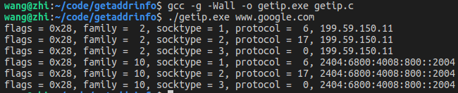
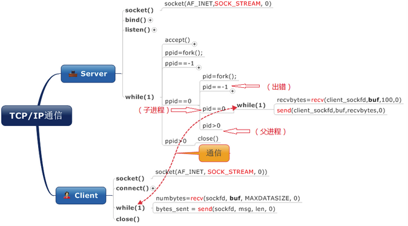
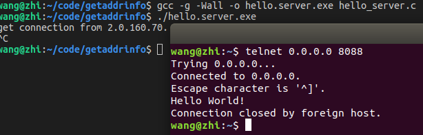
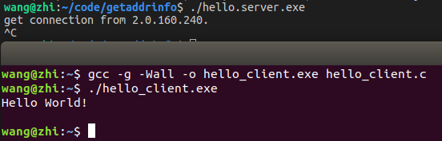
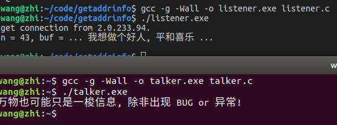
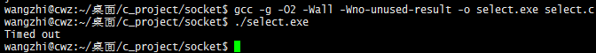
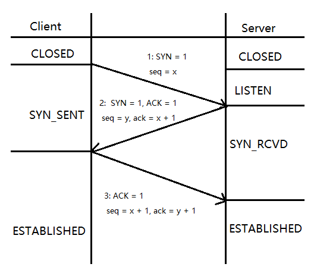
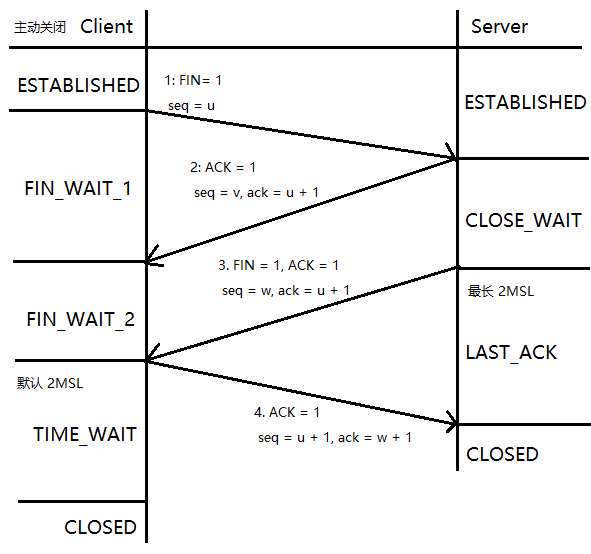

# 第7章-气功-网络编程简介

华山派除开人人可练的华山剑法, 还曾有一本被遗忘的秘籍, 紫霞神功. 也许正是靠它, 当年气宗整体压过剑宗. 后期随着气宗修习紫霞神功要求的资格越来越高, 导致气宗衰败. 紫霞神功也逐渐在江湖中遗失. 同样编程中也有个遗失的学习领域, 网络开发. 学习成本陡峭, 开发成本高, 核心组件非常成熟, 阻挡了一批又一批深入了解服务器网络开发的生源. 好在江湖中有不少巅峰的网络库吼住了互联网的基石. 让重新搭建网络轮子可操作性以及必要性变低. 但如果想打好基础, 或许 ~ 此刻不妨随我翻开远古大能们遗留(抄袭)的书章, 感受下那些年可以吹的 NB. 友情提示, 本书写到这, 可以发现非常注重实战练习, 忽略缘由. 因为授之以鱼渔, 你还要有欲望, 才能驱动. 

文末我们会简单讲解网络库要处理那些业务它的来由. 全章流程迂回递进, 需要反复回溯, 必有豁然开朗醍醐灌顶. 修真, 修炼, 一个不传的隐秘就是, 有了持续时间精进和反思感悟就会拥有自己的全世界. 例如 <<无尽剑装>> 小说主角结局无不是靠寿元兑换大道 ~ 不妨补充一下以前修炼的经验, 当初刚做开发时候. 公司朴实的前辈说, 搞个 TCP 估计 1 年就过去了. 后来想想还真是, 虽然到现在还是水经验. 但有一点可以确定, 编程, 修炼并不是一个青春饭. 很需要底蕴和积累. 投机倒把不能干成一件需要长时间心力体力投入的事情. 大佬赠我越努力越幸运. 也有个小确幸送给修真路上的道友们. 当有一天, 打游戏了累了, 刚好没目标. 那就打开笔记本, 秀出你的神之一技吧 ~ 山中不知岁月, 一切才刚刚开始 ~

## 7.1 回忆哈 C, 入门前那些年

C 语言已是暮年, 就目前而言存在 32 + 5 + 7 = 44 个关键字. 具体如下 O(∩_∩)O

C89 版本关键字

|          |           |          |          |
| -------- | --------- | -------- | -------- |
| char 	   | short     | int      | unsigned |
| long 	   | float     | double   | struct   |
| union    | void      | enum     | signed   |
| const    | volatile  | typedef  | auto     |
| register | static    | extern   | break    |
| case     | continue  | default  | do       |
| else     | for       | goto     | if       |
| return   | switch    | while    | sizeof   |

C99 新增关键字

|       |          |            |        |          |
| ----- | -------- | ---------- | ------ | -------- |
| _Bool | _Complex | _Imaginary | inline | restrict |

C11 新增关键字

|           |                |               |          |
| --------  | --------       | -------       | -------- |
| _Alignas  | _Alignof       | _Atomic       | _Generic |
| _Noreturn | _Static_assert | _Thread_local |          |


C17 关键词没有变化, C2x 未来会去掉这种 _Bool 等类型声明, 可能直接采用 bool 关键字. 随后会细细分析以上关键词的具体用法, 每个平台的实现会有些差别. C89 最稳, C New 更强更活. 本节主要目的是通过回忆杀, 唤醒大家入门前的远古信仰.

### 7.1.1 C89 32 个关键字

**1' char**

解释 :

声明变量的时候用! 

char 多数占 1 字节, 8bit. 多数环境(CL or GCC)中是有符号的(ARM 无符号), 范围是[-128, 127]. 而在工程项目开发中推荐用 int8_t 和 uint8_t 替代 char.

```C
#include <stdint.h>
#include <stddef.h>

int8_t   -> signed char 
uint8_t  -> unsigned char
```

扯淡一点, 程序开发最常遇到的就是自解释问题. 鸡生蛋, 蛋生鸡. 后面再分析 signed 和 unsigned.     
    
演示 :

```C
#include <stdio.h>

char c = getchar();
rewind(stdin);
printf("c = %d, c = %c.\n", c);
```

**2' short**

解释 :

声明变量的时候用! 

short 多数占 2 字节, 为无符号的. 默认自带 signed. 范围 [-2^15, 2^15 - 1] 2^15 = 32800. 推荐使用 int16_t or uint16_t 类型.

演示 :

```C
short port = 443;
printf("port = %hd.\n", port);
```

**3' int**

解释 :

声明变量的时候用!

int 声明的变量, 多数占 4 字节, 有符号. 范围 [-2^31, 2^31 - 1]. 相似的有 int32_t 和 uint32_t 类型.

演示 :

```C
int hoge = 500;
printf("hoge = %d.\n", hoge);
```

**4' unsigned**

解释 :

变量类型修饰符!

被修饰的变量声明为无符号类型. 范围 >= 0.  unsigned 只能修饰整型的变量. 当然当你用这个修饰变量的时候. 再使用 - 和 -- 运算的时候一定要小心.

演示 :

```C
unsigned int i = 110;       // 正确
unsigned short s = 0;       // 正确
unisgned float f = 9.11f;   // 错误
```

**5' long**

解释 :

声明变量的时候用!             

long 长整型 x86 上 4 字节, x64 有的平台是 8 字节. 但一定不比 int 字节数小. C99 之后出现 long long 类型 8 字节.
    
演示 :

```C
long l = 1;
long long ll = l;
printf("l = %ld, ll = %lld.\n", l, ll);
```

**6' float**

解释 :

声明变量的时候用!

4 字节. 精度是 6-7 位左右. 详细精度可以查 float 与 double 的范围和精度资料.

演示 :

```C
float f = -0.12f;        // 4 字节
long float lf = 0;       // 8 字节, 等同于 double, 不推荐这么写
```

**7' double**

解释 :

声明变量的时候用!

8 字节, 精度在 15-16 位左右. 有的时候压缩内存用 float 代替. 再优化那就 int.

演示 :

```C
double d = 3e14;               // 8 字节
long double ld = -0.99;        // x86 也是 8 字节, 不推荐这么用
long long double lld = 88;     // 写法错误, 不支持
```

**8' struct**

解释 :

定义结构体关键字, 用法广泛, 是大头!

C 重要思路就是面向过程编程, 撑起面向过程的大头就是结构体. 而 struct 就是定义结构的东西, 可以看看下面演示.

演示 :

```C
// node 普通结构体定义
struct node {
    struct node * next;
    int id;  
};

struct node node = { .id = 1 };

// 匿名结构定义
struct { int id; char * name; } ple = { 28, "喜欢兰花山丘" };
```

**9' union**

解释 :

定义共用体, 用法很花哨! 常在封装特殊库设计时用到, 技巧性强.

演示 :

```C
// type 普通定义
union type {
    int i;
    char c;
    float f;
};

union type t = { .f = 3.33f };

struct json {
    struct json * next;
    struct json * chid;
    unsigned char type;
    char * key;

    // 类型匿名定义
    union {
        char * vs;
        double vd;
    };
};
```

再来一种 union 用法, 利用内存对齐得到机器的大小端. 其实主流编译器都有宏辅助判断大小端情况.

```C
// isbig 判断是大端序还是小端序, 大端序返回 true
inline bool isbig(void) {
    static union { unsigned char c; unsigned short s; } u = { .s = 1 };
    return u.c == 0;
}
```

还是很久很久以前利用 union 实现结构内存字节对齐, 那时好兴奋. 太多了, 这个关键字用法, 也很意外.

**10' void**

解释 :

这个空关键字. 用法很多!

也是最喜欢的关键字. 用在函数声明中, 类型定义中.

演示 :

```C
// 函数声明
extern void foo();

// 函数参数约束
extern void foo(void);   // () 中加 void 表示函数无参数, 否则是任意的

// 万能指针类型定义, 指针随便转
void * arg = NULL;
```

**11' enum**

解释 :

枚举类型, C 中枚举类型很简陋!        

其实就相当于一种变相的 INT 宏常量. 估计这也许也是 INT 宏常量和枚举并存的原因.

演示 :

```C
// flag_e - 函数状态枚举
enum flag {
    SuccessBase     = +0,       // 结果正常
    ErrorBase       = -1,       // 错误基类型
};

typedef enum flag flag_e;
```

枚举变量可以等同于 int 变量使用, 枚举值等同于宏 INT 常量使用. 枚举的默认值是以 0 开始, 1 为默认单位从上向下递加.

**12' signed**

解释 :

变量声明类型修饰符. 有符号型!

对比 unsigned 无符号型. 变量声明默认是 signed, 所以绝大多数情况下就省略了.

演示 :

```C
signed int piyo = 0x1314520;
signed char * str = u8"你好吗";
```

当然了, 平时不需要刻意加. 会让人嫌麻烦. O(∩_∩)O 哈哈 ~

**13' const**

解释 :

const 修饰的变量表示是个不可(不推荐)修改的变量!

和常量有点区别. 可以简单认为 const type val 是个只读的类型变量.

演示 :

```C
// 声明不可修改的量
const int age = 32;

// 修饰指针
const int * pi = NULL;         // *pi 不能修改指向变量
int * const pt = NULL;         //  pt 不能指向新的指针 
const int * const pc = NULL;   // *pc 和 pc 都不能动
```

在 C 中基本没有什么改变不了的. 全是内存来回搞, 软件不行硬件 ~~

**14' volatile**

解释 :

声明变量修饰符, 可变的!     
        
当变量前面有这个修饰符. 编译器不再从寄存器中取值, 直接内存读取写入. 保证实时性. 常用在多线程代码中.

演示 :

```C
// srl 具体轮询器
struct srl {
    mq_t mq;                 // 消息队列
    pthread_t id;            // 具体奔跑的线程
    die_f run;               // 每个消息都会调用 run(pop())
    volatile bool loop;      // true表示还在继续 
};
```

在使用 srl::loop 的时候被其它线程修改, 但当前线程也希望正确获取它的值.

**15' typedef**

解释 :

类型重定义修饰符, 重新定义新的类型!

演示 :

```C
// 声明普通类型
typedef void * list_t;

// 声明不完全类型, 头文件中不存在 struct tree 实体定义
typedef struct tree * tree_t;
```

**16' auto**

解释 :

变量类型声明符!    

auto 变量存放在动态存储区(栈上), 随着生存周期结束而立即释放. 默认变量是 auto 的. 基本都省略不写, 除非装逼!

演示 :

```C
{
    // 生存期开始
    auto int piyo = 10000;
    // 生存期结束
}
```

**17' register**
    
解释 :   
        
变量修饰符! 

只能修饰整形变量. 表示, 希望这个变量存放在 CPU 的寄存器上. 现代编译器在开启优化时候, 能够一定程度上默认启用 register 寄存器变量.

演示 :

```C
#include <limits.h>

register int i = 0;
while (i < INT_MAX) {
   ++i;
}
```

由于 CPU 寄存器是有限的, 有时候哪怕声明的寄存器变量也可能只是普通变量. 其次对于寄存器变量进行取地址操作是非法的, 例如 printf("&i = %p\n", &i) 寄存器变量语义层面是没有地址的.


**18' static**


解释 :       

static 用法很广泛, 修饰变量! 

表示变量存在于静态区(全局区). 生存周期同当前程序生存周期. static 修饰的变量作用域只能在当前文件范围内. 除 auto 就是 static. static 修饰函数表示当前函数是私有的, 只能在当前文件中使用. 更加详细的看演示.

演示 :

```C
// 修饰全局变量, 只对当前文件可见
static int fd = 0;

// 修饰局部变量, 存储在全局区, 具有记忆功能
{
    static int cnt = 0;
}

// 修饰函数, 函数只能在当前文件可见
static void * run(void * arg) {
   ......
   return arg;
}

// C99 之后加的 static 新用法, 方便编译器优化.
// static 只能修饰函数第一维, 表示传入的数组最小长度.
int sum(int a[static 99]) { ... }
```

**19' extern**
    
解释 :

extern 关键字表示声明, 变量声明, 函数声明! 奇葩的用法有很多.

演示 :

```C
// g_c 声明引用全局变量
extern int g_c;

// kill 声明引用全局函数
extern int kill(int sig, int val);
```

有时候 extern 不写, 对于变量可能会出现重定义. 但对于函数是可以缺省写法. 再扯一点

```C
// extern 主动声明, 希望外部可以调用
extern int kill(int sig, int val);

// extern 缺省, 不推荐外部调用
int kill(int sig, int val);
```

**20' break**

解释 :

结束语句!

主要用于循环的跳转, 只能跳转出当前层级. 也用于 switch 语句中, 跳出 switch 嵌套.

演示 :

```C
for (;;) {
   // 符合条件跳转
   if(six == 6)    
       break;
}

// break 跳出 while 循环
int i = 0;
while(i < 8) {
    if(i == 6)
        break;
} 
```

break 用法主要和循环一块使用, 还有 do while. 但只能跳出当前层循环. 

**21' case**
    
解释 :

switch 语句中分支语句, 确定走什么分支!

演示 :

```C
// case 普通用法 和 break成对出现
switch ((c = *++ptr)) {
case 'b': *ntr++ = '\b'; break;
case 'f': *ntr++ = '\f'; break;
case 'n': *ntr++ = '\n'; break;
case 'r': *ntr++ = '\r'; break;
case 't': *ntr++ = '\t'; break;
}
```

对于 case 相当于标记点. switch 中值决定 case 跳转到哪里. 再一直往下执行, 遇到 break 再结束 switch 嵌套.

**22' continue**

解释 :

跳过此次循环!

直接进行条件判断操作. for 和 while 有些区别. for 会执行第三个后面的语句.

演示 :

```C
// for 循环 continue
for(int i = 0; i < 2222; ++i) {
    if(i % 22 == 0)
        continue;
    // continue 跳到 ++i 再到 i < 2222 条件判断
}
```

**23' default**

解释 :

switch 分支的默认分支!     

假如所有 case 都没有进入, 那就进入 default 分支. default 可以省略 break, C 语法中可行.

演示 :

```C
uint32_t 
skynet_queryname(struct skynet_context * ctx, const char * name) {
    switch(name[0]) {
    case ':':
        return strtoul(name+1, NULL, 16);
    case '.':
        return skynet_handle_findname(name + 1);
    default:
        skynet_error(ctx, "Don't support query global name %s", name); 
    }
    return 0;
}
```

**24' do**

解释 :

do 循环!

先执行循环体, 后再执行条件判断.

演示 :

```C
register int i = 0;
do {
    if(i % 2 == 0) 
        continue;

    printf("i = %d.\n", i);   
} while(++i < 101);
```

do while 循环有时候可以减少一次条件判断. 性能更好, 代码更长.

**25' else**

解释 :

else 是 if 的条件非分支! 具体看演示.

演示 :

```C
#include <stdbool.h>

if (true) {
    puts("你好?");
} else {
    puts("真巧,");
}

// 附赠个 else 语法
#  if defined (__GNUC__)
// 定义了 __GNUC__ 环境, 就是 GCC 环境
#  else
#    error "NOT __GNUC__, NEED GCC!";
#  enfif
```

**26' for**

解释 :

for 循环其实就是 while 循环的语法糖, 也有独到的地方! 

演示 :

```C
for(int i = 0; i > -1; ++i) {
    if(i == 100)
        continue;
    
    if(i == 5000)
        break;
}

// 等价于下面这个
int i = 0;
while(i > -1) {
    if(i == 100) {
        ++i;
        continue;
    }

    if(i == 5000)
        break;
    ++i;
}

// for 最好的写法, 对于死循环写法
for (;;) {
    // xxx
}
```

for(;;) {  } 比 while (true) { } 写法好. 虽然最终汇编一样, 想表达出不走判断的意图. 

**27' goto**

解释 :

goto 可以在当前函数内跳转!

goto 可以替代所有循环. goto 在复杂业务中会尝试用到, 切记不要麻木的用! 演示 :

```C
loop_continue:
// goto 拆解循环语法
if (...)
    goto loop_break;

goto loop_continue;
loop_break:
```

在工程开发中, goto 常用于非常复杂的业务逻辑上.

```C
    // 继续判断,只有是 c == '"' 才会继续, 否则都是异常
    if (c != '"') 
        goto err_faid; 

    // 检查, 行列个数是否正常
    if (rnt == 0 || cnt % rnt) {
err_faid:
        RETURN(-1, "csv parse error %d, %d, %d.", c, rnt, cnt);
    }
```

**28' if**
    
解释 :

if 分支语句! 

用法太多了. 智能藏在程序语句中分支中.

演示 :

```C
if (false) {
    puts("想做个好人!");
}
```

**29' return**

解释 :

程序返回语句, 用于函数返回!

单纯只想返回 void 可以直接用 return;

演示 :

```C
#include <stdlib.h>

int main(int argc, char * argv[]) {
   return EXIT_SUCCESS;
}
```

**30' switch**

解释 :

条件分支语句!        

当 if else if 这类分支很复杂的时候, 特定情况可以转为高效的 switch 分支语句.

演示 :

```C
#include <errno.h>
#include <unistd.h>

int ret;
char buf[BUFSIZ];
do {
    ret = write(fd, buf, sizeof buf);
    if (ret < 0) {
        switch (errno) {
        case EINTR:
            continue;
        default:
            perror("write error");
        }
    }
} while(ret > 0);
```

**31' while**

解释 :

循环语句!

有 do while 和 while 语句两种.

演示 :

```C
#define TTL_INT (9)

int i = -1;
while(++i < TTL_INT) {
    // ...... 
}
```

**32' sizeof**

解释 :   

也称为 sizeof 运算符, 计算变量或类型的字节大小, 这个关键字很好用! sizeof 在 C89 时代是编译时确定, 但随着 C99 引入 VLA, sizeof 有时候也只能运行时确定值.

演示 :

```C
sizeof (main)   -> x86 上四字节

// LEN 获取数组长度
#define LEN(a) (sizeof(a) / sizeof(*a))

// C99 VLA sizeof 用法
int n = 0xC99;
int a[n];
printf("sizeof a = %zu.\n", sizeof a);
```

到这 C89 保留的关键字已经解释完毕. 走马观花的理解理解, 希望能够勾起你心里的小妖精.

### 7.1.2 C99 5 个新增关键字

**33' _Bool**

解释 :

bool 类型变量!

等价于 unsigned char 只有 0 和 1.

演示 :

```C
#ifndef _STDBOOL
#define _STDBOOL

#define __bool_true_false_are_defined	1

#ifndef __cplusplus

#define bool	_Bool
#define false	0
#define true	1

#endif /* __cplusplus */

#endif /* _STDBOOL */
```

**34' _Complex**

解释 :

数学中复数类型!       

对于 C99 标准, 存在 float _Complex, double _Complex, long double _Complex 复数类型. 可在 GCC 中演示下面复数的用法.

演示 :

```C
#include <math.h>
#include <stdio.h>
#include <complex.h>

//
// 测试 C99 complex 复数
//
int main(int argc, char * argv[]) {
    float complex f = -1.0f - 0.1if;
    printf("The complex number is: %f + %fi\n", crealf(f), cimagf(f));
    
    double complex d = csqrt(4.0 + 4.0i);
    printf("d = %lf + %lfi\n", creal(d), cimag(d));

    return 0;
}
```

复数类型在GCC 中采用标准实现的

```C
#define complex     _Complex
```

而在 CL 中只是模拟实现, 没有实现标准所要的样子.

```C
#ifndef _C_COMPLEX_T
    #define _C_COMPLEX_T
    typedef struct _C_double_complex
    {
        double _Val[2];
    } _C_double_complex;

    typedef struct _C_float_complex
    {
        float _Val[2];
    } _C_float_complex;

    typedef struct _C_ldouble_complex
    {
        long double _Val[2];
    } _C_ldouble_complex;
#endif

typedef _C_double_complex  _Dcomplex;
typedef _C_float_complex   _Fcomplex;
typedef _C_ldouble_complex _Lcomplex;
```

总的说, 学习 C 最好的平台就是 *nix 平台上使用 Best new GCC. 除了科学计算会用到复数, 其它地方很少用到. 这里 VS 和 GCC 实现理念不一样. 用起来需要注意. 总有一天你会全身入定的进入开源的怀抱 ~

**35' _Imaginary**

解释 :

虚数类型, _Complex 复数类型的虚部!

例如 10.01i . 这个关键字在当前的 CL 上没有实现. 个人也觉得没有必要, 同 _Complex 有重叠.

演示 :

```C
/* 这个关键字无法在代码中表示. 系统保留, 我们不能使用. */
```

**36'  inline**

解释 :

内联函数定义符号!        

尝试避免函数入栈出栈的浪费. 希望将小函数直接嵌入到代码中提升性能. C 代码多数损耗在于函数的进出栈. 新标准是希望 static inline 替代宏, 但不同平台语义实现不一致, 用起来可以随环境而定. 要是可以也推荐用内联函数替代宏, 宏不到万不得已别让其出山. 

演示 :

```C
// json_new - 构造 json 对象
inline json_t json_new(void) {
    return calloc(1, sizeof(struct json));
}

// socket_set_block     - 设置套接字是阻塞
inline static int socket_set_block(socket_t s) {
    int mode = fcntl(s, F_GETFL, 0);
    return fcntl(s, F_SETFL, mode & ~O_NONBLOCK);
}
```

**37' restrict**

解释 :

指针修饰符!        

这是很装逼的关键字用于编译器优化. 关键字 restrict 只用于限定指针, 用于告知编译器, 所有修改该指针所指向内容的操作全部都是基于该指针的, 即不存在其它进行修改操作的途径. 这样做是尝试帮助编译器进行更好的代码优化, 生成更有效率的汇编代码.

演示 :

```C
extern void * mempcpy (void * __restrict __dest,
                       const void * __restrict __src, 
                       size_t __n) __THROW __nonnull ((1, 2));
```

上面摘自 GCC 的 string.h 中. 正式用法

```C
// 简单演示用法, GCC 和 VS 都是 __restrict 推荐加在 * 后面
static inline void strlove(char * __restrict dest) {
    *dest = '\0';
}
```

### 7.1.3 C11 7 个新增关键字

**38' _Alignas**

解释 :

内存对齐的操作符!

需要和 _Alignof 配合使用, 指定结构的对齐方式.

演示 :

```C
#ifndef __cplusplus

#define alignas _Alignas
#define alignof _Alignof

#define __alignas_is_defined 1
#define __alignof_is_defined 1

#endif
```

例如一种演示用法

```C
#include <stdio.h>
#include <stdalign.h>

struct demo {
    int age;
    char sex;
    double sec;
};

int main(int argc, char * argv[]) {
    char money[BUFSIZ];    
    alignas(struct demo) struct demo * p = (struct demo *)money;
    printf("democratic = %p, c = %p.\n", p, c); 

    return 0;
}
```

将 money 数组以 struct demo 对齐方式对齐构造赋值. 同 placement new.

**39' _Alignof**

解释 :

返回由类型标识所指定的类型的任何实例所要求的按字节算的对齐!

该类型可以为完整类型, 数组类型或者引用类型. 当类型为引用类型时, 该运算符返回被引用类型的对齐方式. 当类型为数组类型时, 返回其元素类型的对齐方式.

演示 :

```C
// return size_t , 对齐方式是 8 字节, 值为 8
printf("alignof(struct demo) = %zu.\n", alignof(struct demo));
```

**40' _Atomic**

解释 :

原子操作, 原子锁!        

目前 GCC 完整支持, CL 支持不友好. 如果编译器都支持那么以后原子操作更加方便高效. 详细用法需要查阅相关手册, 无外乎怎么初始化, 设置, 加载等等 ~

演示 :

```C
#include <stdio.h>
#include <stdatomic.h>

int main(int argc, char * argv[]) {
    // 全局初始化 hoge 和局部初始化 atomic_init(&hoge, 386)
    _Atomic int hoge = ATOMIC_VAR_INIT(386);

    // 将 hoge 值返回给 piyo
    int piyo = atomic_load(&hoge);  
    printf("piyo = %d.\n", piyo);

    piyo <<= 1;
    // 将 piyo 值重新设置到原子变量 hoge 中
    atomic_store(&hoge, piyo);
    printf("hoge = %d.\n", hoge);

    return 0;
}
```

具体执行结果, 相信你也懂. 原子操作, 对于写出高效代码很重要.

**41' _Generic**

解释 :

这个比较叼, C 的泛函机制. 高级宏, low level black. 来个老套路感受其奥妙!

演示 :

```C
#include <math.h>
#include <stdio.h>

#define abs(x)                                          \
_Generic((x), int:abs, float:fabsf, double:fabs)(x)

// 测试 C11 _Generic 高级宏用法
int main(int argc, char * argv[]) {
    int a = 1, b = 2, c = 3;

    _Generic(a + 0.1f, int:b, float:c, default:a)++;
    printf("a = %d, b = %d, c = %d\n", a, b, c); 

    printf("int abs: %d\n", abs(-4));
    printf("float abs: %f\n", abs(-5.5f));
    printf("double abs: %f\n", abs(-3.1415926));

    return 0;
}
```

宏泛型真的很给力. 如果全平台都支持的话, 宏又能被玩上天 :)

**42' _Noreturn**

解释 :

修饰函数, 绝对不会有返回值!       

_Noreturn 声明的函数语义层面可以不返回. 引入此函数修饰符为了消除编译器对需要 return 而没有 return 的警告, 还有允许某些只针对不返回函数的优化.

演示 :

```C
_Noreturn void suicide(void) {
    abort(); // Actually, abort is _Noreturn as well
}
```
 
再扯一点, 它等同于 GCC 中 __attribute__((__noreturn__)), 在 CL 中相似功能是 __declspec(noreturn). 它不是说函数没有返回值, 而是说一旦你调了这个函数, 它存在永远不会返回的情况. 一些函数是永远不会返回的, 比如 abort 或者 exit 之类, 调用它们就意味着结束程序. 所以编译器再给出 warning 就显得没有必要.

**43' _Static_assert**

解释 :

编译期间断言符!

当 #if #error #endif 预编译之后, 开始编译期断言, 再到 assert 是运行时断言. _Static_assert 就是编译期断言, 想用的时候看具体的需求.

演示 :

```C
// Guess I don't really need _Static_assert to tell me this :-(
_Static_assert(__STDC_VERSION__ >= 201112L, "C11 support required");
```

**44' _Thread_local**

解释 :

到这里快扯完了, 其实 C11 标准是个很好的尝试. 为 C 引入了线程和原子操作. 各种安全特性补充. 它让 C 标准变得更完善和强大还有丑陋. _Thread_local 是新的存储类修饰符, 限定变量不能在多线程之间共享.

演示 :

```C
// Thread local isn't local!
_Thread_local static int i;
```

语义上就是线程的私有变量. 在 POSIX 标准 pthread 实现中采用如下设计

```C
/*
 * Thread Specific Data Functions
 */
extern int __cdecl pthread_key_create (pthread_key_t * key, 
                                       void (__cdecl * destructor) (void *));
extern int __cdecl pthread_key_delete (pthread_key_t key);
extern int __cdecl pthread_setspecific (pthread_key_t key, 
                                        const void * value);
extern void * __cdecl pthread_getspecific (pthread_key_t key);
```

pthread_key_create 创建私有变量, 需要注册销毁行为. 随后是删除, 设置, 获取操作. 从实现而言, 线程私有变量其实是通过公有变量模拟映射的. 开发中推荐少用线程私有变量, pthread 实现有数量限制. 到这里关于 C 修炼的筑基期的语法层面回顾就完毕了. 不知不觉新的呼喊已经到来, 期待笑和痛, 收拾行囊 ~ 出发!

***

    游子吟
    孟郊(唐代)

    慈母手中线, 游子身上衣.
    临行密密缝, 意恐迟迟归.
    谁言寸草心, 报得三春晖.


***

## 7.2 C 语言 SOCKET 编程指南

有了 C 基础语法支持, 随后一举巩固练气, 拿下常见 socket api 基本操作. socket 编程也被狭义的称为网络编程, 其基础知识是成为高级大头兵一个卡. 很久以前整理过一个学习手册, 抄袭的年代久远. 这里借花献佛随我温故那些必备 socket 相关知识. 协助同道气成丹田, 安身立命 ~ 

很多行, 带你入行的人或者契机, 以及自己能多用功走多高多远 ~ 都非常重要 ~ 相辅相成.

### 7.2.1 一切才刚刚开始

socket 编程让你沮丧吗? 从 man pages 中很难明白有用的信息吧? 你想跟上时代去编写 Internet 相关的程序, 但是你在为调用 connect() 前的 bind() 的结构而不知所措? 等等 ... .. .

好在已经将这些事整理了, 这里将和所有人分享所知道的知识(抄袭由头). 如果你了解 C 语言并想穿过网络编程的沼泽, 那么你来对了地方哦.

这篇小章节是一个小型演练法阵, 而不是新华词典. 如果你刚启蒙 socket 编程并想找一本入门内容, 那么将是本篇的读者. 但这不是一本完全的 socket 编程教程, 只会让你有所感悟的希望. 当前文档中的大多数代码都在 CentOS and Ubuntu 平台上用 GNU best new GCC 编译测试过. socket 入门推荐从 Linux 入手, 此后可以阅读圣经 TCP/IP 协议 和 Unix 网络编程等. 此处应有掌声(xx)

**什么是 socket ?**

你经常听到人们谈论着 "socket", 或许你还不知道它的确切含义. 现在让我告诉你: 它是使用标准 linux 文件描述符(file descriptor)和其它程序通讯的方式. 什么? 你也许听到一些 linux hacker 这样说过: "呀, linux 中的一切都是文件!". 那个同行也许正在说到一个事实: linux 程序在执行任何形式的 I/O 的时候, 程序是在读或者写一个文件描述符. 一个文件描述符只是一个和打开的文件相关联的整数值. 但是(注意后面的话), 这个文件可能是一个网络连接, FIFO, 管道, 终端, 磁盘上的文件或者什么其它的东西. linux 中所有的东西就是文件! 所以, 你想和 Internet 上别的程序通讯的时候, 你将要使用到文件描述符. 你必须理解刚才的话. 现在你脑海中或许冒出这样的念头: "那么该从哪里得到网络通讯的文件描述符呢?", 这个问题无论如何都需要为你回答: 你利用系统调用 socket(), 它返回套接字描述符(socket descriptor), 然后你再通过它来进行 send() 和 recv() 调用. 但是, 你可能有很大的疑惑, "如果它是个文件描述符, 那么为什么不用一般调用 read() 和 write() 来进行套接字通讯?". 简单的答案是: "你可以使用!". 详细的答案是: "你可以, 但是使用 send() 和 recv() 让你更好的控制数据传输." 存在这样一个情况: 在我们的世界上, 有很多种套接字. 例如 DARPA Internet 地址(Internet 套接字), 本地节点的路径名 (linux 套接字) ... 也许在你的 linux 机器上还有其它更多的. 在这里只讲 Internet 套接字.

**Internet 两种套接字**

什么意思? 有两种类型的 Internet 套接字? 是的. 不, 我在撒谎. 其实还有很多, 但是我可不想吓着你. 我们这里只讲两种. 除了这些, 还有 "Raw Sockets" 也是非常强大的, 也值得查阅.

那么这两种类型是什么呢? 一种是 "Stream Sockets(流格式)", 另外一种是 "Datagram Sockets(数据包格式)". 我们以后谈到它们的时候也会用到 "SOCK_STREAM" 和 "SOCK_DGRAM". 数据报套接字有时也叫"无连接套接字"(如果你确实要连接的时候可以用 connect()) 流式套接字是可靠的双向通讯的数据流. 如果你向套接字按顺序输出 "1,2", 那么它们将按顺序 "1,2" 到达另一边. 它们是无错误的传递的, 有自己的错误控制, 在此不详细讨论, 章节末会有所回忆.

有什么在使用流式套接字? 你可能听说过 telnet, 不是吗? 它就使用流式套接字. 你需要你所输入的字符按顺序到达, 不是吗? 同样, WWW 浏览器使用的 HTTP 协议也使用它们来下载页面. 实际上, 当你通过端口 80 telnet 到一个 WWW 站点, 然后输入 "GET {pagename}" 的时候, 你也可以得到 HTML 的内容. 为什么流式套接字可以达到高质量的数据传输? 这是因为它使用了"传输控制协议(The Transmission Control Protocol)", 也叫"TCP". TCP 控制你的数据按顺序到达并且"安全可靠". 你也许听到"TCP" 是因为听到过 "TCP/IP". 这里的 IP 是指 "Internet 协议" 小部分. IP 只是处理 Internet 路由而已. 那么数据报套接字呢? 为什么它叫无连接呢? 为什么它是不可靠的呢?

有这样的一些事实: 如果你发送一个数据报, 它可能会到达, 它可能次序颠倒了. 如果它到达, 那么在这个包的内部是无错误的. 数据报也使用 IP 作路由, 但是它不使用 TCP. 它使用"用户数据报协议(User Datagram Protocol)", 也叫 "UDP". 为什么它们是无连接的呢? 主要是因为它并不象流式套接字那样维持一个连接. 你只要建立一个包, 构造一个有目标信息的 IP 头, 然后发出去. 无需连接, 它们通常使用于传输包信息. 简单的应用程序有: QQ 视频, tftp 等等. 当然最新的 HTTP/3 希望引入安全可靠的 UDP 协议来提升 Internet 性能.

你也许会想: "假如数据丢失了这些程序如何正常工作?" 我的朋友, 每个程序在 UDP 上需要有自己加的额外的协议. 例如, TFTP 协议每发出的一个被接受到包, 收到者必须发回一个包来说"我收到了!"(一个"命令正确应答"也叫"ACK"包). 如果在一定时间内(例如 6 秒), 发送方没有收到应答, 它将重新发送, 直到得到 ACK. 这一 ACK 过程在实现 SOCK_DGRAM 应用程序的时候非常重要.

**网络理论**

既然刚才提到了协议层, 那么现在是讨论网络究竟如何工作和一些关于 SOCK_DGRAM 包是如何建立的例子. 当然, 你也可以跳过这一段, 如果你认为已经熟悉的话. 首先来学习数据如何封装 (Data Encapsulation)! 它非常非常重要. 重要到你在网络课程学习中无论如何也得也得掌握它. 主要的内容是: 一个包, 先是被第一个协议(在这里是 TFTP) 在它的报头(也许是报尾)包装("封装"), 然后, 整个数据(包括 TFTP 头)被另外一个协议(在这里是 UDP)封装, 然后下一个(IP), 一直重复下去, 直到硬件(物理)层(这里是以太网). 当另外一台机器接收到包, 硬件先剥去以太网头, 内核剥去 IP 和 UDP 头, TFTP 程序再剥去 TFTP 头, 最后得到数据.

此刻我们终于讲到声名狼藉的网络分层模型(LayeredNetwork Model). 这种网络模型在描述网络系统上相对其它模型有很多优点. 例如, 你可以写一个套接字程序而不用关心数据的物理传输(串行口, 以太网, 连接单元接口 AUI 还是其它介质), 因为底层的程序会为你处理它们. 实际的网络硬件和拓扑对于程序员来说是透明的. 不说其它废话了, 现在列出整个层次模型. 如果你要参加网络考试, 可一定要记住:

```
应用层      (Application)
表示层      (Presentation)
会话层      (Session)
传输层      (Transport)
网络层      (Network)
数据链路层  (Data Link)
物理层      (Physical) 
```

物理层是硬件(串口, 以太网等等). 应用层是和硬件层相隔最远的, 它是用户和网络交互的地方. 这个模型如此通用, 如果你想, 你可以把它作为修车指南. 把它对应到 linux 映射是:

```
应用层      (Application Layer) (telnet, ftp, 等等)
传输层      (Host-to-Host Transport Layer) (TCP, UDP)
Internet 层 (Internet Layer) (IP和路由)
网络访问层  (Network Access Layer) (网络层, 数据链路层和物理层)   
```

现在, 你可能看到这些层次如何协调来封装原始的数据了. 看看建立一个简单的数据包有多少工作? 哎呀, 你将不得不使用 "cat" 来建立数据包头! 这仅仅是个玩笑. 对于流式套接字你要作的是 send() 发送数据. 对于数据报式套接字, 你按照你选择的方式封装数据然后使用 sendto(). 内核将为你建立传输层和 Internet 层, 硬件完成网络访问层. 这就是现代科技, 现在结束我们的网络理论速成班. 哦, 忘记告诉你关于路由的事情了. 但是我不准备谈它, 如果你真的关心, 那你可以自行搜阅 RFC 相关的协议说明部分.

### 7.2.2 编程前奏

**结构体**

终于快谈到编码了. 这小节, 将谈到被套接字用到的各种数据类型. 因为它们中的一些内容很重要. 首先是简单的一个 socket 描述符. 它在类 unix 系统的类型是 int, 仅仅是一个常见的 int. 从现在起, 事情变得不可思议了, 而你所需做的就是继续看下去. 注意这样的事实:

有两种字节排列顺序: 重要的字节(有时叫 octet, 即八位位组)在前面, 或者不重要的字节在前面. 前一种叫"网络字节顺序(Network Byte Order)". 有些机器在内部是按照这个顺序储存数据, 而另外一些则不然. 当我说某数据必须按照 NBO 顺序, 那么你要调用函数(例如 htons) 来将它从本机字节顺序(Host Byte Order)转换过来. 如果我没有提到 NBO, 那么就让它保持本机字节顺序. 介绍的第一个结构 struct sockaddr. 这个结构为许多类型的套接字储存套接字地址信息:

```C
struct sockaddr {
    unsigned short sa_family;
    char sa_data[14];
};
```

sa_family 能够是各种各样的类型, 例如 AF_INET, AF_INET6, AF_UNSPEC. sa_data 包含套接字中的目标地址和端口信息. 这好像有点不明智. 为了处理 struct sockaddr, 程序员创造了一个并列的结构: struct sockaddr_in("in" 代表 "Internet")

```C
struct sockaddr_in {
    short int sin_family;
    unsigned short int sin_port;
    struct in_addr sin_addr;
    unsigned char sin_zero[8];
};
```

用这个数据结构可以轻松处理套接字地址的基本元素. 注意 sin_zero (它被加入到这个结构中, 主要为了 struct sockaddr_in 长度和 struct sockaddr 保持一样) 应该使用函数 memset 来全部置零. 同时, 这一重要的细节, 一个指向 sockaddr_in 结构体的指针也可以被指向结构体 sockaddr 并且代替它. 这样的话即使 socket 想要的是 struct sockaddr, 你仍然可以使用 struct sockaddr_in, 函数内部会转换. 同时, 注意 sin_family 要一致并能够设置为 "AF_INET". 最后, sin_port 和 sin_addr 必须是网络字节顺序 (Network Byte Order)!

你也许会反驳道: "但是, 怎么让整个数据结构 struct in_addr sin_addr 按照网络字节顺序呢?" 要知道这个问题的答案, 我们就要仔细的看一看这个数据结构: 

```C
/* Internet address.  */
typedef uint32_t in_addr_t;

struct in_addr {
    in_addr_t s_addr;
};
```

它曾经是个最坏的联合(知道的都是有点年头了, 哎), 但是现在那些日子过去了. 如果你声明 ina 是数据结构 struct sockaddr_in 的实例, 那么 ina.sin_addr.s_addr 就储存 4 字节的 IP 地址(使用网络字节顺序). 如果你不幸的系统使用的还是同下面相似的恐怖联合 struct in_addr, 你还是可以放心 4 字节的 IP 地址并且和上面我说的一样.

```C
#ifndef s_addr
/*
 * Internet address (old style... should be updated)
 */
struct in_addr {
    union {
        struct { u_char s_b1,s_b2,s_b3,s_b4; } S_un_b;
        struct { u_short s_w1,s_w2; } S_un_w;
        u_long S_addr;
    } S_un;
#define s_addr  S_un.S_addr
                                /* can be used for most tcp & ip code */
#define s_host  S_un.S_un_b.s_b2
                                /* host on imp */
#define s_net   S_un.S_un_b.s_b1
                                /* network */
#define s_imp   S_un.S_un_w.s_w2
                                /* imp */
#define s_impno S_un.S_un_b.s_b4
                                /* imp # */
#define s_lh    S_un.S_un_b.s_b3
                                /* logical host */
};
#endif
```

**本机转换**

用这个数据结构可以轻松处理套接字地址的基本元素. 注意 sin_zero (它被加入到这个结构中, 我们现在讲了很多网络到本机字节顺序的转换, 现在可以实践了! 你能够转换两种类型: short (2 个字节) 和 uint32_t (4 个字节). 假设你想将 short 从本机字节顺序转换为网络字节顺序. 用 "h" 表示 "本机 (host)", 接着是 "to", 然后用 "n" 表示 " 网络 (network)", 最后用 "s" 表示 "short": h-to-n-s, 或者 htons() ("Host to Network Short"). 是不是太简单了.

如果不是太傻的话, 你一定想到了由 "n", "h", "s", 和 "l" 形成的正确组合, 例如这里肯定没有 stolh() ("Short to Long Host") 函数, 不仅在这里没有, 所有场合都没有. 但是这里有:

```
htons() -- "Host to Network Short"
htonl() -- "Host to Network Long"
ntohs() -- "Network to Host Short"
ntohl() -- "Network to Host Long"
```

现在, 你可能想你已经知道它们了. 你也可能想: "如果我想改变 char 的顺序要怎么办呢?" 但是你也许马上就意识到这用不着考虑的, 因为只有一个字节. 你也许会想到: 在 IBM 机器已经使用了网络字节顺序, 就没有必要去调用 htonl() 转换 IP 地址吧! 此刻你可能是对的, 但是当你移植你的程序到别的机器上的时候, 你的程序将失败. 可移植性! 这里是 linux 世界! 记住: 在你将数据放到网络上的时候, 确信它们是网络字节顺序的. 最后一点: 为什么在数据结构 struct sockaddr_in 中 sin_addr 和 sin_port 需要转换为网络字节顺序, 而 sin_family 需不需要呢? 答案是: sin_addr 和 sin_port 分别封装在包的 IP 和 UDP 层. 因此, 它们必须要是网络字节顺序. 但是 sin_family 没有发送到网络上, 它们可以是本机字节顺序. 最主要的是 sin_family 域只是被内核(kernel)使用来决定在数据结构中包含什么类型的地址, 所以它必须是本机字节顺序.

**如何处理 IP 地址**
 
现在我们很幸运, 因为我们有很多的函数来方便地操作 IP 地址. 没有必要用手工计算它们, 也没有必要用 "<<" 操作来储存成长整型. 首先, 假设你已经有了一个 sockaddr_in 结构体 ina, 你有一个 IP 地址 "8.8.8.8" 要储存在其中, 你就要用到函数 inet_addr(), 将 IP 地址从点数格式转换成无符号长整型. 使用方法如下：

```C
ina.sin_addr.s_addr = inet_addr("8.8.8.8");
```

注意, inet_addr() 返回的地址已经是网络字节格式, 所以你无需再调用函数 htonl(). 我们现在发现上面的代码片断不是十分完整, 因为它没有错误检查. 显而易见, 当 inet_addr() 发生错误时返回 -1. 记住这些二进制数字?(无符号数)-1 仅仅和 IP 地址 255.255.255.255 相符合! 这可是广播地址! 这将会发生大错误! 记住要先进行错误检查. 好了, 现在你可以将 IP 地址转换成长整型了. 有没有其相反的方法呢? 它可以将一个 in_addr 结构体输出成点数格式? 这样的话, 你就要用到函数 inet_ntoa()("ntoa" 的含义是 "network to ascii"), 就像这样:

```C
printf("%s", inet_ntoa(ina.sin_addr));
```

它将输出 IP 地址. 需要注意的是 inet_ntoa() 将结构体 in_addr 作为一个参数, 不是长整形. 同样需要注意的是它返回的是一个指向一个字符的指针. 它是一个由 inet_ntoa() 控制的指向静态的固定内存的指针, 所以每次调用 inet_ntoa(), 它就将覆盖上次调用时所得的 IP 地址. 例如:

```C
char * a, * b;
a = inet_ntoa(ina.sin_addr);
b = inet_ntoa(inb.sin_addr);
printf("address a: %s/n", a);
printf("address b: %s/n", a);
```

输出如下:

```
address a: 8.8.8.8
address b: 8.8.8.8
```

这在学习阶段或者是单线程程序中是没有问题. 但在真实环境只推荐以下方式. 其中 family 可以设置为 AF_INET 处理 IPV4 or AF_INET6 处理 IPV6.

```C
#include <arpa/inet.h>

// inet_pton 若成功返回1, 0 表示输入不是有效的表达式, -1 表示出错
int inet_pton(int family, const char * strptr, void * addrptr);
      
// inet_ntop 若成功返回指向结果的指针, NULL 表示出错
const char * inet_ntop(int family, 
                       const void * addrptr, 
                       char * strptr, size_t len);
```

好了, 这小节. socket 含义的介绍就这些, 随后逐步开展编程工作. 

### 7.2.3 编程常见 API

**socket() 函数**

我想我不能再不提这个了, 下面我将讨论一下 socket() 系统调用详细介绍.

```C
#include <sys/types.h>
#include <sys/socket.h>

#define PF_UNIX         AF_UNIX
#define PF_INET         AF_INET

int socket(int domain, int type, int protocol);
```

那其中的参数是什么? 首先, domain 应该设置成 "PF_INET", 就像上面的数据结构 struct sockaddr_in 中一样, 使用 IPv4 协议地址. 然后, 参数 type 告诉内核是 SOCK_STREAM 类型还是 SOCK_DGRAM 类型. 最后, 把 protocol 设置为 "0". (注意: 有很多种 domain, type, 不可能一一列出, 请尝试看 socket() 的 man 帮助. 当然, 还有一个更好的方式去得到 protocol, 翻看其特定头文件找到协议定义.) 常用例子

```C
// 使用系统针对 IPv4 与字节流的默认的协议，一般为 TCP
int sockfd = socket(PF_INET, SOCK_STRAM, IPPROTO_TCP);
// 使用 STCP 作为协议
int sockfd = socket(PF_INET, SOCK_STRAM, IPPROTO_SCTP);
// 使用数据报 作为协议
int sockfd = socket(PF_INET, SOCK_DGRAM, IPPROTO_UDP);
```

socket() 只是返回在系统调用种可能用到的 socket 描述符, 错误的时候返回 -1. 全局变量 errno 中将储存返回的错误值(请参考 perror() 的 man 帮助).

**bind() 函数**

一旦你有一个套接字, 你可能要将套接字同机器上的固定的端口关联起来. (如果你想用 listen() 来侦听固定端口的数据, 这是必要一步. 如果你只想用 connect(), 那么这个步骤将没有必要. 但是无论如何, 请继续读下去. 这里是系统调用 bind() 的大概:

```C
#include <sys/types.h>
#include <sys/socket.h>

int bind(int sockfd, struct sockaddr * ress, int addrlen);
```

sockfd 是调用 socket 返回的文件描述符. ress 是指向 struct sockaddr 数据结构的指针, 它保存你的地址(即端口和 IP)信息. addrlen 设置为 sizeof(struct sockaddr). 很简单不是吗? 再看看例子:

```C
#include <string.h>
#include <sys/types.h>
#include <sys/socket.h>

#define PORT_SHORT	(8088)

int main(void) {
    int sockfd = socket(PF_INET, SOCK_STREAM, IPPROTO_TCP);

    struct sockaddr_in ress;
    ress.sin_family = AF_INET;
    ress.sin_port = htons(PORT_SHORT);
    ress.sin_addr.s_addr = inet_addr("8.8.8.8");
    memset(&ress.sin_zero, 0, sizeof(ress.sin_zero));
    bind(sockfd, (struct sockaddr *)&ress, sizeof(struct sockaddr_in));
    ... .. .
}
```

这里也有要注意的点. ress.sin_port 是网络字节顺序, ress.sin_addr.s_addr 也是的, 其中 ress.sin_zero 需要置零防止脏数据污染, 其实是一种历史约束. 在 bind() 主题中最后要说的话是, 如果自己不想绑定固定地址, 让操作系统自行分配. 可以用下面方式处理.

```C
ress.sin_port = 0;                   // 自行分配绑定的端口
ress.sin_addr.s_addr = INADDR_ANY;   // 绑定所有网卡
```

通过将 0 赋给 ress.sin_port, 会告诉 bind() 自己选择合适的端口. 相似的服务器将 ress.sin_addr.s_addr 设置为 INADDR_ANY 后,

```C
/* Address to accept any incoming messages. */
#define INADDR_ANY  ((in_addr_t) 0x00000000)
```

会告诉操作系统: "我需要在 prot 端口上侦听, 所有发送到服务器的这个端口, 不管是哪个网卡/哪个 IP 地址接收到的数据, 都是我处理的." 

bind() 出错的时候依然是返回 -1, 并且设置全局错误变量 errno. 在你调用 bind() 的时候, 你要小心的另一件事情是: 不要绑定小于 1024 和大于 49151 的端口号. 所有小于 1024 的端口号都被系统保留! 更加详细的参照资料是系统端口号分为三大类, 一已知端口[0, 1023], 二注册端口[1024, 49151], 三动态专用端口[49152, 65535]. 理论上我们服务器业务程序只能绑定注册端口[1024, 49151]中尚未被别的程序使用的. 我们一直在说服务器, 如果是客户端在和远端机器进行通讯. 你完全没有必要 bind() 操作, 只需要轻轻 connect() 它一下就可以了啦.

**connect() 函数**

你正在阅读的 connect() 能够帮我们连接到远程主机. 希望不会让你的用户失望. connect() 系统调用是这样的: 

```C
#include <sys/types.h>
#include <sys/socket.h>

int connect(int sockfd, struct sockaddr * serv_addr, int addrlen);
```

sockfd 是系统调用 socket() 返回的套接字文件描述符. serv_addr 是保存着目的地端口和 IP 地址的数据结构 struct sockaddr. addrlen 设置为你采用的地址结构长度, 例如 sizeof(struct sockaddr). 想知道得更多吗? 让我们来看个例子:

```C
#include <string.h>
#include <sys/types.h>
#include <sys/socket.h>

#define IP_STR		"8.8.8.8"
#define PORT_SHORT	(8088)

int main(void) {
    int sockfd = socket(PF_INET, SOCK_STREAM, IPPROTO_TCP);

    struct sockaddr_in addr;
    addr.sin_family = AF_INET;
    addr.sin_port = htons(PORT_SHORT);
    addr.sin_addr.s_addr = inet_addr(IP_STR);
    memset(&addr.sin_zero, 0, sizeof(addr.sin_zero));

    connect(sockfd, (struct sockaddr *)&addr, sizeof addr);
    ... ...
}
```

再一次，你应该检查 connect() 的返回值 - 它在错误的时候返回 -1, 并设置全局错误变量 errno. 
    
同时, 你可能看到, 我没有调用 bind(). 因为我不在乎本地的端口号. 我只关心我要去那. 内核将为我选择一个合适的端口号, 而我们所连接的地方也自动地获得这些信息. 一切都不用担心.

**listen() 函数**

是换换内容的时候了. 假如你不希望与远程的一个地址相连, 或者说, 想和多个一个地址相连, 那你就需要等待接入请求并且用各种方法处理它们. 处理过程分两步: 首先, 你监听 listen(), 然后, 你接收 accept(). 除了要些解释外, 系统调用 listen 也简单.

```C
#include <sys/types.h>
#include <sys/socket.h>

/* Prepare to accept connections on socket FD.
   N connection requests will be queued before 
   further requests are refused.
   Returns 0 on success, -1 for errors. 
 */
extern int listen (int sockfd, int backlog);
```

sockfd 是调用 socket() 返回的套接字文件描述符. backlog 是在链接完成队列中允许的连接数目. 什么意思呢? 进入的链接是在队列中一直等待直到你 accept() 接受链接. 它们的数目限制于已经完成三次握手队列的允许. 你可以设置这个值, 但是最终用不用是系统决定. 和别的函数一样, 在发生错误的时候返回 -1, 并设置全局错误变量 errno. 你可能想象到了, 在你调用 listen() 前你或者要调用 bind() 或者让内核选择一个自动端口. 如果你想侦听进入的连接, 那么系统调用的顺序可能是这样的:

```C
socket();
bind();
listen();
```

因为它相当的明了, 我在这里不给出例子了.

**accept() 函数**

准备好了, 系统调用 accept() 会有点古怪的地方的! 你可以想象发生这样的事情: 有人从很远的地方通过一个你在 listen() 侦听的端口 connect() 连接到你的机器. 它的连接将加入到等待接收 accept() 的队列中. 你调用 accept() 告诉它你有空闲的链接. 它将返回一个新的套接字文件描述符! 这样你就多了个套接字了, 原来的一个还在侦听你的那个端口, 新的在准备发送 send() 和接收 recv() 数据. 这就是进行的过程! 函数是这样定义的:

```C
#include <sys/types.h>
#include <sys/socket.h>

/* Await a connection on socket FD.
   When a connection arrives, open a new socket 
   to communicate with it, set *ADDR (which is *ADDR_LEN bytes long) 
   to the address of the connecting peer and *ADDR_LEN to 
   the address's actual length, and return the
   new socket's descriptor, or -1 for errors.

   This function is a cancellation point and therefore not 
   marked with __THROW.  
 */
extern int accept (int sockfd, 
                   struct sockaddr * addr,
		           socklen_t * restrict addr_len);
```

sockfd 相当简单, 是和 listen() 中一样的套接字描述符. addr 可以是个指向局部的数据结构 sockaddr_in 的指针. 这是要求接入的信息所要去的地方. 在它的地址传递给 accept 之前, addr_len 是指向局部的整型变量, 且指向的变量值为 sizeof(struct sockaddr_in) 在使用 IPv4 地址协议的时候. accept 将不会将多余的字节给 addr. 如果你放入的少些, 那么它会通过改变 addr_len 的值反映出来. 需要注意的是 addr_len 即是输入也是输出参数, 开始之前可以写成

```C
int addrlen = sizeof(struct sockaddr_in);
```

后面传入 &addrlen. 同样, 在错误时返回 -1, 并设置全局错误变量 errno. 现在要展示的是你应该熟悉的代码片段.

```C
#include <string.h>
#include <sys/types.h>
#include <sys/socket.h>

#define PORT_SHORT		(8088)

int main(void) {
    struct sockaddr_in sddr, cddr;
    int sen = sizeof(struct sockaddr_in);

    int sockfd = socket(PF_INET, SOCK_STREAM, IPPROTO_TCP);

    sddr.sin_family = AF_INET;
    sddr.sin_port = htons(PORT_SHORT);
    sddr.sin_addr.s_addr = INADDR_ANY;
    memset(&sddr.sin_zero, 0, sizeof(sddr.sin_zero));

    bind(sockfd, (struct sockaddr *)&sddr, sen);
    listen(sockfd, SOMAXCONN);

    int fd = accept(sockfd, &cddr, &sen);
    ... .. .
}
```

注意, 此后的系统中可以调用 send() 和 recv(). 如果你只想让一个连接进来, 那么你可以使用 close() 去关闭原来的文件描述符 sockfd 来避免同一个端口更多的连接.

**send() 和 recv() 函数**

这两个函数用于流式套接字或者数据报套接字的通讯. 如果你喜欢使用无连接的数据报套接字, 你可以看一看下面关于 sendto() 和 recvfrom() 的章节. send() 是这样的:

```C
#include <sys/types.h>
#include <sys/socket.h>

/* Send N bytes of BUF to socket FD.  Returns the number sent or -1.
   This function is a cancellation point and therefore not marked with
   __THROW. 
 */
extern ssize_t send (int sockfd, const void * buf, size_t len, int flags);
```

sockfd 是你想发送数据的套接字描述符(或者是调用 socket() 或者是 accept()返回的) buf 是指向你想发送的数据的指针. len 是数据的长度. 把 flags 设置为 0 就可以了. (详细的资料请看 send() 的 man pages). 这里是相似的例子：

```C
char * msg = "I am here!";
int len = (int)strlen(msg);
int size = (int)send(sockfd, msg, len, 0);
```

send() 返回实际发送的数据的字节数 - 它可能小于你要求发送的数目! 注意, 有时候你告诉它要发送一堆数据可是它不能处理成功. 它只是发送它可能发送的数据, 然后希望你能够发送其它的数据. 记住, 如果 send() 返回的数据和 len 不匹配, 你就应该发送其它的数据. 但是这里也有个好消息: 如果你要发送的包很小(小于大约 1K), 它可能处理数据让其一次发送完. 最后要说得就是, 它在错误的时候返回 -1, 并设置 errno. recv() 函数很相似:

```C
/* Read N bytes into BUF from socket FD.
   Returns the number read or -1 for errors.

   This function is a cancellation point and therefore not marked with
   __THROW.  */
extern ssize_t recv (int sockfd, void * buf, size_t len, int flags);
```

sockfd 是要读的套接字描述符. buf 是要读的信息的缓冲. len 是缓冲的最大长度. flags 可以设置为 0. (请参考 recv() 的 man pages) recv() 返回实际读入缓冲的数据的字节数. 或者在错误的时候返回 -1, 同时设置 errno.
    
很简单，不是吗? 你现在可以在流式套接字上发送数据和接收数据了. 此刻你就是 linux 网络程序员了! 恭喜 :)

**sendto() 和 recvfrom() 函数**

"这很不错啊", 你说, "但是你还没有讲无连接数据报套接字呢?" 没问题, 现在我们开始这个内容. 既然数据报套接字不是连接到远程主机的, 那么在我们发送一个包之前需要什么信息呢? 不错, 是目标地址! 看看下面的:

```C
#include <sys/types.h>
#include <sys/socket.h>

/* Send N bytes of BUF on socket FD to peer at address ADDR (which is
   ADDR_LEN bytes long).  Returns the number sent, or -1 for errors.

   This function is a cancellation point and therefore not marked with
   __THROW.  */
extern ssize_t sendto (int sockfd, const void * buf, size_t len,
                       int flags, 
                       const struct sockaddr * addr, 
                       socklen_t addr_len);

/* Read N bytes into BUF through socket FD.
   If ADDR is not NULL, fill in *ADDR_LEN bytes of it with tha address of
   the sender, and store the actual size of the address in *ADDR_LEN.
   Returns the number of bytes read or -1 for errors.

   This function is a cancellation point and therefore not marked with
   __THROW.  */
extern ssize_t recvfrom (int sockfd, const void * restrict buf, size_t len,
                         int flags, 
                         struct sockaddr * restrict addr, 
                         socklen_t * restrict addr_len);
```

你已经看到了, 除了另外的两个信息外, 其余的和函数 send() 是一样的. addr 是个指向数据结构 struct sockaddr 的指针, 它包含了目的地的 IP 地址和端口信息. addr_len 可以简单地设置为 sizeof(struct sockaddr). 和函数 send() 类似, sendto() 返回实际发送的字节数(它也可能小于你想要发送的字节数!), 或者在错误的时候返回 -1. 相似的还有函数 recv() 和 recvfrom(). recvfrom() 的定义也在上面. 又一次, 除了两个增加的参数外, 这个函数和 recv() 也是一样的. addr 也是个指向局部数据结构 struct sockaddr 的指针, 它的内容是源机器的 IP 地址和端口信息. addr_len 是个 socklen_t 型的局部指针, 它的初始值为 sizeof(struct sockaddr). 函数调用返回后, addr_len 保存着实际储存在 addr 中的地址的长度. recvfrom() 返回收到的字节长度, 或者在发生错误后返回 -1. 记住, 如果你用 connect() 连接一个数据报套接字, 你可以简单的调用 send() 和 recv() 来满足你的要求. 这个时候依然是数据报套接字, 依然使用 UDP, 系统套接字接口会为你自动加上了目标源的信息.

**close() 和 shutdown() 函数**

你已经整天都在发送 send() 和接收 recv() 数据了, 现在你准备关闭你的套接字描述符吧. 这很简单, 你可以使用一般的 linux 文件描述符的 close() 函数：

```C
#include <unistd.h>

/* Close the file descriptor FD.
   This function is a cancellation point and therefore not marked with
   __THROW.  */
extern int close (int fd);
```

它将防止套接字上更多的数据的读写. 任何在另一端读写套接字的企图都将返回错误信息. 如果你想在如何关闭套接字上有多一点的控制, 你可以使用函数 shutdown(). 它允许你将一定方向上的通讯或者双向的通讯(就像 close() 一样)关闭, 你可以使用:

```C
#include <sys/types.h>
#include <sys/socket.h>

/* Shut down all or part of the connection open on socket FD.
   HOW determines what to shut down:
     SHUT_RD   = No more receptions;
     SHUT_WR   = No more transmissions;
     SHUT_RDWR = No more receptions or transmissions.
   Returns 0 on success, -1 for errors.  */
extern int shutdown (int sockfd, int how);
```

sockfd 是你想要关闭的套接字文件描述复. how 的值是下面的其中之一:

```C
/* The following constants should be used for the second parameter of
   `shutdown'.  */
enum
{
  SHUT_RD = 0,      /* No more receptions.  */
#define SHUT_RD     SHUT_RD
  SHUT_WR,          /* No more transmissions.  */
#define SHUT_WR     SHUT_WR
  SHUT_RDWR         /* No more receptions or transmissions.  */
#define SHUT_RDWR   SHUT_RDWR
};
```
希望表述的含义如下:

```C
0 - 不允许接受
1 - 不允许发送
2 - 不允许发送和接受 (内部资源会保留直到 close())
```

shutdown() 成功时返回 0, 失败时返回 -1 (同时设置 errno) 如果在无连接的数据报套接字中使用 shutdown(), 那么只不过是让 send() 和 recv() 不能使用哦.

**getpeername() and gethostname() 函数**

这个函数太简单了. 它太简单了, 以至我只想简单说说. 函数 getpeername() 告诉你在连接的流式套接字上谁在另外一边. 函数是这样的:

```C
#include <sys/socket.h>

/* Put the address of the peer connected to socket FD into *ADDR
   (which is *LEN bytes long), and its actual length into *LEN.  */
extern int getpeername (int sockfd, 
                        struct sockaddr * restrict addr,
                        socklen_t * restrict addr_len);
```

sockfd 是连接的流式套接字的描述符. addr 是一个指向结构 struct sockaddr 内存布局的的指针, 它保存着连接的另一边的信息. addr_len 是一个 int 型的指针, 它初始化值为 sizeof(struct sockaddr). 函数在错误的时候返回 -1, 设置相应的 errno. 一旦你获得它们的地址, 你就可以用 inet_ntop(), getnameinfo() 打印获取得更多信息 (多自行 Search, 别打作者 :). 此刻比 getpeername() 还简单的函数是 gethostname(). 它返回你程序所运行的机器的主机名字. 

```C
#include <unistd.h>

/* Put the name of the current host in no more than LEN bytes of NAME.
   The result is null-terminated if LEN is large enough for the full
   name and the terminator.  */
extern int gethostname (char * name, size_t len);
```

参数很简单: name 是一个字符数组指针, 它将在函数返回时保存主机名. len 是 name 数组的字节长度. 函数调用成功时返回 0, 失败时返回 -1, 并设置 errno.

### 7.2.4 编程操练,道阻且长

**DNS 域名服务**

如果你不知道 DNS 的意思, 那么我告诉你, 它代表域名服务 (Domain Name Service). 它主要的功能是: 你给它一个容易记忆的某站点的地址, 它给你 IP 地址(然后你就可以使用 bind(), connect(), sendto() 或者其它函数). 当一个人输入:
    
```C
$ telnet www.google.com
```

telnet 将为它将连接(connect()) 到 "31.13.74.1". 但是这是如何工作的呢? 你可以研究 getaddrinfo() 这类函数, 先看演示吧.

```C
#include <sys/types.h>
#include <sys/socket.h>
#include <arpa/inet.h>
#include <netdb.h>
#include <stdio.h>

// test getaddrinfo 地址打印
static void test(const char * restrict name) {
    struct addrinfo * a = NULL;
    int r = getaddrinfo(name, NULL, NULL, &a);
    if (r < 0) {
        fprintf(stderr, "%s error(%d) = %s\n", name, r, gai_strerror(r));
        return;
    }

    char ip[INET6_ADDRSTRLEN];
    for (struct addrinfo * u = a; (u) ; u = u->ai_next) {
        void * addr;

        if (u->ai_family == AF_INET)
            addr = &((struct sockaddr_in *)(u->ai_addr))->sin_addr;
        else
            addr = &((struct sockaddr_in6 *)(u->ai_addr))->sin6_addr;
        

        if (!inet_ntop(u->ai_family, addr, ip, sizeof ip)) {
            fprintf(stderr, "%s family = %d\n", name, u->ai_family);
            freeaddrinfo(a);
            return;
        }

        printf("flags = 0x%x, family = %2d, socktype = %d, protocol = %2d, %s\n",
               u->ai_flags, u->ai_family, u->ai_socktype, u->ai_protocol, ip);
    }

    freeaddrinfo(a);
}

//
// getaddringo 构建
//
int main(int argc, char * argv[]) {
    for (int i = 1; i < argc; ++i) {
        test(argv[i]);
    }
    return 0;
}
```




sockfd 是连接的流式套接字的描述符. addr 是一个指向结构 struct sockaddr 内存布局输出中可能对 flags, family, socktype, protocol 有些不明觉厉. 可以参看下面解释.

```C
//
// netdb.h
// 
// [ai_flags]
// # define AI_PASSIVE      0x0001  // Socket address is intended for `bind'
// # define AI_CANONNAME    0x0002  // Request for canonical name
// # define AI_NUMERICHOST  0x0004  // Don't use name resolution
// # define AI_V4MAPPED     0x0008  // IPv4 mapped addresses are acceptable
// # define AI_ALL          0x0010  // Return IPv4 mapped and IPv6 addresses
// # define AI_ADDRCONFIG   0x0020  // Use configuration of this host to choose
//

//
// sys/types.h
// 
// [ai_family]
// #define PF_INET      2   // IP protocol family
// #define PF_NETROM    6   // Amateur radio NetROM
//
// #define AF_INET      PF_INET
// #define AF_INET6     PF_INET6
//
// [ai_socktype]
// SOCK_STREAM  = 1,    // Sequenced, reliable, connection-based byte streams
// #define SOCK_STREAM  SOCK_STREAM
// SOCK_DGRAM   = 2,    // Connectionless, unreliable datagrams of fixed maximum length
// #define SOCK_DGRAM   SOCK_DGRAM
// SOCK_RAW     = 3,    // Raw protocol interface
// #define SOCK_RAW     SOCK_RAW
//
// [ai_protocol]
// IPPROTO_TCP = 6,     // Transmission Control Protocol
// #define IPPROTO_TCP  IPPROTO_TCP
//
// #define IPPROTO_PUP  IPPROTO_PUP
// IPPROTO_UDP = 17,    // User Datagram Protocol
//
```

**客户端和服务器通信**

sockfd 是连接的流式套接字的描述符. addr 是一个指向结构 struct sockaddr 内存布局客户端和服务端通信这个太普遍了, 例如我们上网通过浏览器客户端同对应的服务器交互. 举个 telnet 的例子. 当你用 telnet 客户端通过 23 号端口登陆到主机, 主机上运行的一个一般叫 telnetd 程序被激活. 它处理这个连接, 进入交互流程. 注意, 客户端--服务器之间可以使用 SOCK_STREAM, SOCK_DGRAM 或者其它协议(只要双方约定是相同的). 这里为大家搜集一种简单编码流程图. 那我们开始编码吧.




先服务器

这个服务器所做的全部工作是在流式连接上发送字符串 "Hello, World!\n" 给客户端. 你要测试这个程序的话, 可以使用 telnet [ip] [port] 来看最终结果.

```C
#include <stdio.h>
#include <errno.h>
#include <stdlib.h>
#include <string.h>
#include <unistd.h>
#include <sys/wait.h>
#include <arpa/inet.h>
#include <sys/types.h>

#define PORT_USHORT	(8088u)
#define HELLO_STR	"Hello World!\n"

#define IF(code)                    \
if((code) < 0)                      \
perror(#code), exit(EXIT_FAILURE)

//
// simple server send heoo to client
//
int main(int argc, char * argv[]) {
    int sfd;
    IF(sfd = socket(PF_INET, SOCK_STREAM, IPPROTO_TCP));

    struct sockaddr_in addr = {
        .sin_family = AF_INET,
        .sin_port = htons(PORT_USHORT),
    };
    IF(bind(sfd, (struct sockaddr *)&addr, sizeof addr));

    //监听一下
    IF(listen(sfd, SOMAXCONN));

    // 采用单进程处理客户端链接请求
    for (;;) {
        int cfd, fd;
        struct sockaddr_in cddr;
        socklen_t cen = sizeof cddr;
        IF(cfd = accept(sfd, (struct sockaddr *)&cddr, &cen));

        // 输出客户端信息
        char ip[INET6_ADDRSTRLEN];
        IF(inet_ntop(AF_INET, &cddr, ip, sizeof ip));
        printf("get connection from %s.\n", ip);

        // 开启多进程, fd == 0 进入子进程流程处理
        IF(fd = fork()); 
        if(fd == 0) {
            close(sfd);

            write(cfd, HELLO_STR, strlen(HELLO_STR));
            close(cfd);

            exit(EXIT_SUCCESS);
        }
        
        // 父进程中关闭子进程的 socket fd
        close(cfd);

        // 非阻塞为子进程尝试收尸
        while(waitpid(-1, NULL, WNOHANG) > 0)
            ;
    }

    return close(sfd);
}
```

我们通过编译, telnet 链接, 最终 Ctrl + C 发送 SIGINT 信号演示. 如果你很挑剔不妨尝试将代码组织结构划分的更细点.



后客户端

客户端程序比服务器还简单. 这个程序的所有工作是通过 8088 端口连接到命令行中指定的主机, 然后得到服务器发送过来的字符串.

```C
#include <stdio.h>
#include <errno.h>
#include <stdlib.h>
#include <unistd.h>
#include <sys/types.h>
#include <arpa/inet.h>

#define PORT_USHORT	(8088u)

#define IF(code)                    \
if((code) < 0)                      \
perror(#code), exit(EXIT_FAILURE)

int main(int argc, char * argv[]) {
    int sfd;
    IF(sfd = socket(PF_INET, SOCK_STREAM, IPPROTO_TCP));

    struct sockaddr_in addr = {
        .sin_family = AF_INET,
        .sin_port = htons(PORT_USHORT),
    };

    // 链接一下
    IF(connect(sfd, (struct sockaddr *)&addr, sizeof addr));

    // 接收消息直到结束
    for (;;) {
        ssize_t len;
        char buf[BUFSIZ];
        IF(len = read(sfd, buf, sizeof buf - 1));
        if (len == 0) {
            close(sfd);
            break;
        }
        
        // 开始输出
        buf[len] = '\0';
        puts(buf);
    }

    return 0;
}
```

同样先启动服务器, 然后编译客户端, 再启动客户端, 随后关闭服务器. 这样演示, 是不是都好简单. 就是这种远古时代傻×的网络编程模式居然在 golang 中大杀四方. 诸神凝重 ~ 

 

**数据包 UDP Socket**

不想讲更多了, 所以我给出代码 talker.c 和 listener.c. listener.exe 在机器上等待来自端口 8088 的数据包. talker.exe 发送数据包到指定的机器端口上, 它包含用户在命令行输入的内容. 对于 TCP 和 UDP 可以绑定相同端口, 主要原因是机器接收到 IP 包随后通过其头部的协议值决定是向上给 TCP 栈或者还是给 UDP栈, 所以哪怕二者端口相同.

这里就是 **listener.c**

```C
#include <stdio.h>
#include <errno.h>
#include <stdlib.h>
#include <unistd.h>
#include <sys/wait.h>
#include <arpa/inet.h>
#include <sys/types.h>

#define PORT_USHORT	(8088u)

#define IF(code)                    \
if((code) < 0)                      \
perror(#code), exit(EXIT_FAILURE)

int main(int argc, char * argv[]) {
    int fd;
    IF(fd = socket(PF_INET, SOCK_DGRAM, IPPROTO_UDP));

    struct sockaddr_in addr = {
        .sin_family = AF_INET,
        .sin_port = htons(PORT_USHORT),
    };
    socklen_t sen = sizeof addr;

    // 绑定地址, 然后接收数据
    IF(bind(fd, (struct sockaddr *)&addr, sen));

    // 等待并接收数据
    int n;
    char buf[BUFSIZ];
    IF(n = recvfrom(fd, buf, sizeof buf - 1, 
                    0, 
                    (struct sockaddr *)&addr, &sen));

    // 输出接收的地址信息
    char ip[INET6_ADDRSTRLEN];
    IF(inet_ntop(AF_INET, &addr, ip, sizeof ip));
    printf("get connection from %s.\n", ip);

    // 返回最终结果
    buf[n] = '\0';
    printf("n = %d, buf = %s\n", n, buf);

    return close(fd);
}
```

下面是 **talker.c**

```C
#include <stdio.h>
#include <errno.h>
#include <stdlib.h>
#include <unistd.h>
#include <sys/types.h>
#include <arpa/inet.h>

#define HELLO_STR	"... 想做个好人, .. .\r\n"
#define PORT_USHORT	(8088u)

#define IF(code)                    \
if((code) < 0)                      \
perror(#code), exit(EXIT_FAILURE)

int main(int argc, char * argv[]) {
    int fd;
    IF(fd = socket(PF_INET, SOCK_DGRAM, IPPROTO_UDP));

    struct sockaddr_in addr = {
        .sin_family = AF_INET,
        .sin_port = htons(PORT_USHORT),
    };
    // 发送消息
    IF(sendto(fd, HELLO_STR, sizeof HELLO_STR, 
              0, 
              (struct sockaddr *)&addr, sizeof addr));

    // 返回最终结果
    puts("万物也可能只是一梭信息, 除非出现 BUG or 异常!");

    return close(fd);
}
```



观察它们的通讯! 除了一些在上面提到的数据套接字连接的小细节外, 对于数据包套接字. 还得说一点, 当 UDP 程序通过 connect() 函数绑定地址时候, 后续你使用 sendto(), recvfrom() 时可以不用附带地址 sockaddr 信息, 此刻完全可以用 send() 和 recv() 代替. 原因在于 connnect() 函数帮助在内核记录下所需要的地址信息. 

**阻塞**

阻塞, 你也许早就听说了. "阻塞"是 "sleep" 的科技行话. 你可能注意到前面运行的 listener.exe 程序, 它在 recvfrom() 时候等待数据包的到来. 如果没有数据就会一致等待, 因此说  recvfrom() 是 "阻塞(block)" 的, 直到数据的到来. 很多函数都利用阻塞. accept() 阻塞, 所有的 recv*() 函数阻塞. 它们之所以能这样做是因为它们被允许这样做. 当你第一次调用 socket() 建立套接字描述符的时候, 内核就将它设置为阻塞. 如果你不想套接字阻塞, 你就要调用函数 fcntl() 修改为非阻塞模式.

```C
#include <fcntl.h>
#include <unistd.h>

int fd = socket(AF_INET, SOCK_STREAM, IPPROTO_TCP);

int mode = fcntl(fd, F_GETFL, 0);
return fcntl(fd, F_SETFL, mode | O_NONBLOCK);
```

通过设置套接字为非阻塞, 你能够有效地"询问"套接字以获得信息. 如果你尝试着从一个非阻塞的套接字读信息并且没有任何数据, 它不允许阻塞. 它将返回 -1 并将 errno 设置为 EAGAIN. 但是一般说来, 这种询问不是个好主意. 如果你让你的程序在忙等状态查询套接字的数据, 你将浪费大量的 CPU 时间. 更好的解决之道是用下一章讲的 IO 复用机制, 被通知后才去查询是否有数据要读进来. 到这基本上 TCP 和 UDP 通过 Linux socket 比划扫盲篇宣告 OK, 后续的勤学苦练看福分深浅了 :)


### 7.2.5 编程拓展

说了那么多, 后续会逐渐进入状态, 更多还是回顾. 因为很多都是很老的东西. 

**select()**

这个函数有点奇怪, 但是它很有用. 假设这样的情况: 你是个服务器, 你一边在不停地从连接上读数据, 一边在侦听连接上的信息. 没问题, 你可能会说, 不就是一个 accept() 和一个 recv() 吗? 这么容易吗, 朋友? 如果你在调用 accept() 的时候阻塞呢? 你怎么能够同时接受 recv() 数据? "用非阻塞的套接字啊!" 不行! 你不想耗尽所有的 CPU 吧? 那么, 该如何是好? select() 让你可以同时监视多个套接字. 如果你想知道的话, 那么它就会告诉你哪个套接字准备读, 哪个又准备写, 哪个套接字又发生了意外 (exception). 闲话少说, 下面是 select() 一种模拟演示:

```C
/* According to POSIX.1-2001, POSIX.1-2008 */
#include <sys/select.h>

/* According to earlier standards */
#include <unistd.h>
#include <sys/time.h>
#include <sys/types.h>

void FD_ZERO(fd_set * set);
void FD_SET(int fd, fd_set * set);
void FD_CLR(int fd, fd_set * set);
int  FD_ISSET(int fd, fd_set * set);

int select(int nfds, 
           fd_set  * readfds, fd_set * writefds, fd_set * exceptfds, 
           struct timeval * timeout);
```

**select** 函数监视一系列文件描述符, 特别是 readfds writefds 和 exceptfds. 如果你想知道你是否能够从标准输入和套接字描述符 sockfd 读入数据, 你只要将文件描述符 sockfd 加入到事先置空 FD_ZERO readfds 集合中. 参数 nfds 应该等于最高的文件描述符的值加 1. 在这个例子中, 你应该设置该值为 sockfd + 1. 当函数 select() 返回的时候, readfds 的值修改为反映你选择的哪个文件描述符可以读. 你可以用 FD_ISSET() 来测试. 在我们继续下去之前, 让我来讲讲如何对这些集合进行操作. 每个集合 类型都是 fd_set. 下面加一些注释来说明:

```C
FD_ZERO(fd_set * set)           - 置空一个文件描述符集合
FD_SET(int fd, fd_set * set)    - 添加 fd 到集合
FD_CLR(int fd, fd_set * set)    - 从集合中移去 fd
FD_ISSET(int fd, fd_set * set)  - 测试 fd 是否在集合中
```

最后, 是有点古怪的数据结构 struct timeval. 有时你可不想永远等待别人发送数据过来. 也许什么事情都没有发生的时候你也想每隔 64 秒在终端上打印字符串 "对不起". 这个数据结构允许你设定一个时间, 如果时间到了, 而 select() 还没有找到一个准备好的文件描述符, 它将返回让你继续处理. 数据结构 struct timeval 是这样的:

```C
struct timeval {
    long    tv_sec;         /* seconds */
    long    tv_usec;        /* microseconds */
};
```

只要将 tv_sec 设置为你要等待的秒数, 将 tv_usec 设置为你要等待的微秒数就可以了. 是的, 是微秒而不是毫秒. 1,000 微秒等于 1 毫秒，1,000 毫秒等于 1 秒. 也就是说, 1 秒等于 1,000,000 微秒. 为什么用符号 "usec" 呢? 字母 "u" 很象希腊字母 Mu, 而 Mu 表示 "微" 的意思. 当然, 函数返回的时候 timeout 可能是剩余的时间, 之所以是可能, 是因为它依赖于你的 linux 操作系统对于时间片的实现. 还有一些有趣的事情: 如果你设置数据结构 struct timeval 中的数据为 0, select() 将立即超时, 这样就可以有效地轮询集合中的所有的文件描述符. 如果你将参数 timeout 赋值为 NULL, 那么将永远不会发生超时, 即一直等到有文件描述符就绪. 最后, 如果你不是很关心等待多长时间, 那么就把它赋为 NULL 吧. 下面的代码演示了在标准输入上等待 2.5 秒:

演示代码 **select.c**

```C
#include <stdio.h>
#include <unistd.h>
#include <sys/time.h>
#include <sys/types.h>

// 等待控制台 2.5s 操作
int main(int argc, char * argv[]) {
    fd_set fds = { 0 };
    struct timeval tv = { 2, 500000 };

    FD_SET(STDIN_FILENO, &fds);
    if(select(STDIN_FILENO + 1, &fds, NULL, NULL, &tv) < 0) {
        printf("select error tv = %ld | %ld.\n", tv.tv_sec, tv.tv_usec);
        return -1;
    }

    // 判断结果1
    if(FD_ISSET(STDIN_FILENO, &fds))
        puts("A key war pressed!");
    else
        puts("Timed out");

    return 0;
}
```



我这里对于 select 介绍是百不存一, 后续强烈推荐读者认真演技相关资料. 它如此与众不同. 到这里本节应该结束了, 但是一念又想起高中老师的谆谆教导, 回赠个总的复习吧!

**问: TCP 是否可以只进行两次握手建立链接?**

首先回顾下 TCP 通过三次握手建立安全连接的大致过程:

* 客户端向服务器发送一个 SYN, seq = x，尝试连接服务器
* 服务器向客户端响应一个 SYN, seq = y, 并对 seq = x 进行确认 ack x + 1, 表示服务器可用, 可以建立连接了
* 客户端再向服务器发一个确认 ack y + 1, 连接建立成功

更加详细的看下图.



从这个过程我们就有了解答这个问题的素材了. 假如两次握手, 即没有 3 那条线. 这时候对于 Server 而言是无法知道其发送的序列号 y, 已经被 Client 知道了. 这就导致一个现象是两次握手可以建立链接, 但无法较确定这个链接是否有效. 因而对于 TCP 这种追求可靠链接的协议两次握手建立链接方式是不可取的. 

**问: TCP 为什么 TIME_WAIT 默认等待 2MSL?**

首先还是得熟悉 TCP 四次挥手的过程.


    
单纯从图中可以看出 LAST_ACK 和 TIME_WAIT 都能凑出 2MSL 时间. 我们从理想情况分析. Client 收到 FIN 会从 TIME_WAIT_2 变为 TIME_WAIT 开始回复 Server ACK. 这时候临界情况回复了 MSL 长度的 ACK, Server 还是没有收到, 也经过了 MSL 又给 Client 发送最后一个 FIN. 此刻 Client 临界回复了 1 MSL ACK, 这次过后, 可以确定对方已经消解在虚拟的网络中了. 二者一加, 这就是 2 个 MSL 的由来.

**IO 复用中结束本小节吧**

TCP/IP 协议, 网络编程是一个传统行业知识点, 如同九阳神功, 主角张无忌也都练 5, 6 年才小成. 同样这些传统知识点很难啃, 未来怎么样看自己的兴趣和造化了. 好, 继续帮助加深理解. 网络编程内幕确实不少. 细节多技巧性强. 本人也只是个菜鸡小哥, 所以是菜鸟之旅. 到这再带大家掌握一下 Linux 上使用 epoll IO 复用 api 管理文件描述符. 修行的就看个人了, 演示 Demo 如下:

```C
#include <time.h>
#include <fcntl.h>
#include <errno.h>
#include <stdio.h>
#include <string.h>
#include <limits.h>
#include <stdlib.h>

#include <netdb.h>
#include <unistd.h>
#include <arpa/inet.h>
#include <sys/epoll.h>
#include <sys/socket.h>

// CERR - 打印错误信息
#define CERR(fmt, ...)                                                 \
fprintf(stderr, "[%s:%s:%d][%d:%s]"fmt"\n",                            \
    __FILE__, __func__, __LINE__, errno, strerror(errno), ##__VA_ARGS__)

// IF   - 条件判断异常退出的辅助宏
#define IF(cond)                                                       \
if ((cond) < 0) do {                                                   \
    CERR(#cond);                                                       \
    exit(EXIT_FAILURE);                                                \
} while(0)

//
// RETURN - 打印错误信息, 并 return 返回指定结果
// val      : return 的东西, 当需要 return void; 时候填 , or NIL
// fmt      : 双引号包裹的格式化字符串
// ...      : fmt 中对应的参数
// return   : val
// 
#define RETURN(val, fmt, ...)                                         \
do {                                                                  \
    CERR(fmt, ##__VA_ARGS__);                                         \
    return val;                                                       \
} while(0)

#define NIL
#define RETNIL(fmt, ...)                                              \
RETURN(NIL, fmt, ##__VA_ARGS__)

// setnonblock 设置套接字非阻塞
inline static void setnonblock(int fd) {
    int mode = fcntl(fd, F_GETFL);
    IF(fcntl(fd, F_SETFL, mode | O_NONBLOCK));
}

// echo_send 发给数据给客户端
void echo_send(int efd, int fd);

// echo_add 添加监听的 socket
void echo_add(int efd, int fd);

// echo_recv 接收数据
void echo_recv(int efd, int fd);

//
// echo.c echo 服务主业务
//

#define PORT_USHORT		(8088u)
#define EPOLL_EVENT     (64)
#define EPOLL_WAIT		(60 * 1000)

int main(int argc, char * argv[]) {
    int sfd, efd, n, on = 1;
    struct sockaddr_in a = { 
        .sin_family = AF_INET, 
        .sin_port = htons(PORT_USHORT), 
    };

    // 创建 socket 并检测
    IF(sfd = socket(PF_INET, SOCK_STREAM, IPPROTO_TCP));
    // 设置地址复用
    IF(setsockopt(sfd, SOL_SOCKET, SO_REUSEADDR, &on, sizeof on));
    // 设置 socket 为非阻塞的
    setnonblock(sfd);
    // 绑定地址地址
    IF(bind(sfd, (struct sockaddr *)&a, sizeof a));
    // 开始监听端口
    IF(listen(sfd, SOMAXCONN));

    // 这里创建 epoll 对象的句柄
    IF(efd = epoll_create1(EPOLL_CLOEXEC));
    // 这里注册一个监听事件, 这里采用边缘触发模型
    struct epoll_event es[EPOLL_EVENT], ev = { 
        .events = EPOLLIN | EPOLLET, 
        .data = { .fd = sfd }
    };
    IF(epoll_ctl(efd, EPOLL_CTL_ADD, sfd, &ev));

    //下面是等待操作,将时间传送给客户端
    for (;;) {
        n = epoll_wait(efd, es, sizeof es/sizeof *es, EPOLL_WAIT);
        if (n < 0) {
            if (errno == EINTR)
                continue;
            CERR("epoll_wait efd = %d error", efd);
            break;
        }

        // 简单处理超时
        if(0 == n) {
            puts("echo server timeout, server auto exit ...");
            break;
        }
        
        // 处理各种 event
        for (on = 0; on < n; ++on) {
            uint32_t events = es[on].events;
            int fd = es[on].data.fd;

            // 有数据可以读取
            if (events & (EPOLLIN | EPOLLHUP)) { 
                if(fd == sfd)
                    echo_add(efd, fd);
                else
                    echo_recv(efd, fd);
                continue;
            }
            
            // 如果有数据要发送
            if (events & EPOLLOUT) {
                echo_send(efd, fd);
                continue;
            }
            
            // 其它事件目前挣只眼和闭只眼
            if (events & EPOLLERR) {
                CERR("epoll fd = %d, events = %u error", fd, events);
                continue;
            }
        }
    }

    close(efd);
    close(sfd);
    return EXIT_SUCCESS;
}

// echo_send 同客户端 socket 数据交互
void 
echo_send(int efd, int fd) {
    struct sockaddr_in a;    
    socklen_t aen = sizeof a;
    struct epoll_event ev = {
        .events = EPOLLIN | EPOLLET,
        .data = { .fd = fd }
    };

    // 获取客户端数据并打印
    if(getpeername(fd, (struct sockaddr *)&a, &aen) < 0) {
        epoll_ctl(efd, EPOLL_CTL_DEL, fd, &ev);
        close(fd);
        RETNIL("getpeername fd is error = %d.", fd);
    }

    // 字符串拼接
    char buf[BUFSIZ];
    char ip[INET6_ADDRSTRLEN];
    aen = snprintf(buf, sizeof buf, 
                    "send: [%s:%d] To start ...\n",
                    inet_ntop(AF_INET, &a, ip, sizeof ip),
                    ntohs(a.sin_port));
    printf("%s", buf);

    // 发送信息给客户端, 这里不考虑传输异常情况
    send(fd, buf, aen, 0);

    // 重新注册为读事件, 采用边缘触发
    epoll_ctl(efd, EPOLL_CTL_MOD, fd, &ev);
}

// echo_add 添加监听的 socket
void 
echo_add(int efd, int fd) {
    struct sockaddr_in a;
    socklen_t aen = sizeof a;
    int cfd = accept(fd, (struct sockaddr *)&a, &aen);
    IF(cfd);
    setnonblock(cfd);

    struct epoll_event ev = { 
        .events = EPOLLIN | EPOLLET,
        .data = { .fd = cfd }
    };
    if (epoll_ctl(efd, EPOLL_CTL_ADD, cfd, &ev)) {
        CERR("epoll_ctl cfd = %d", cfd);
        close(cfd);
    }
}

// echo_recv 接收数据
void 
echo_recv(int efd, int fd) {
    // 设置 epoll event 边缘触发
    struct epoll_event ev = { 
        .events = EPOLLIN | EPOLLOUT | EPOLLET,
        .data = { .fd = fd } 
    };

    ssize_t n;
    char buf[BUFSIZ];
    do {
        n = recv(fd, buf, BUFSIZ-1, 0);
        if (n < 0) {
            if (errno == EINTR)
                continue;
            // 当前事件已经处理完毕!
            if (errno == EAGAIN)
                break;

            // 句柄清除
            epoll_ctl(efd, EPOLL_CTL_DEL, fd, &ev);
            close(fd);

            // 异常情况
            RETNIL("read error n = %ld, fd = %d.", n, fd);   
        }

        if (n == 0) {
            epoll_ctl(efd, EPOLL_CTL_DEL, fd, &ev);
            close(fd);
            printf("client fd = %d close\n", fd);
            return;
        }

        // 数据输出
        buf[n] = '\0';
        printf("recv: %s", buf);
    } while (n >= BUFSIZ-1);

    // 修改 fd 的处理事件为写事件
    epoll_ctl(efd, EPOLL_CTL_MOD, fd, &ev);
}
```

如果你抄写完毕, 并编译执行, 通过 telnet 可以简单测试测试. 关于 C 基础 socket 开发的回顾内容基本结束了. 此刻也带领了一些人踏入了 Linux socket 开发的大门吧. 错误是难免的, 抄袭创新也只是拾人牙慧(贬义词). 毕竟一山还比一山高! 修行的大道上你会遇到更清澈的风, 更飘逸的云. 哈哈, 祝我们好运!

## 7.3 socket 筑基

很高兴能到这里, 不能老和上面一样水了, 后面的这些封装可能让你在从学习状态切换到实战中并势如破竹. 希望大段的文字让我们大体回忆起 Linux socket 有哪些 api 用法. 那 window 呢. 这也算是个问题对吧. 解决思路会有很多, 我们这里介绍一种算加巧妙的方法, 就是在 window 上面极大可能的模拟 linux api 用法. 这样以后移植代码提供极大方面. 而需要模拟的无外乎 errno 机制, pipe 机制, 类型和部分接口细节上移植. 采用这个思路那我们开始堆砌吧.

### 7.3.1 errno 机制

**很久以前**

很久之前有个大胆的想法. 构建 **errno** 和 **strerror** 一一对应映射表. 例如下面这样

```C
#pragma once

#include <errno.h>
#include <string.h>
#include <stddef.h>
#include <stdlib.h>

//
// strerr - strerror 跨平台实现
// no      : linux errno, winds WSAGetLastError()
// return  : system os 拔下来的提示串
//
extern const char * strerr(int no);

#ifdef _WIN32

#include <windows.h>

#undef  errno
#define errno                   (GetLastError())
#undef  strerror
#define strerror                ((char * (*)(int))strerr)

#endif

```

window 本身也有 errno, 但平时多数用 GetLastError, 在 socket 操作的时候, 又走另一套机制 WSAGetLastError. 虽然这里使用 WSAGetLastError 函数来获得上一次的错误代码, 而不是依靠全局错误变量, 是为了提供和将来的多线程环境相兼容. 以上代码核心在于通过我们定义的 strerr 来替代拓展系统的 strerror. 对于 window 实现层面需要参阅 winerror.h 文件就会有所得.

```C
// winerror.h 摘选部分

//
// MessageId: ERROR_SUCCESS
//
// MessageText:
//
// The operation completed successfully.
//
#define ERROR_SUCCESS                    0L

//
// MessageId: ERROR_INVALID_FUNCTION
//
// MessageText:
//
// Incorrect function.
//
#define ERROR_INVALID_FUNCTION           1L    // dderror

... .. .
```

大家有没有一点明白了, 上面是不是很有规律! 通过这个发现就能自己实现一个 strerror 相似的函数. 看我的一种实现模板

strerr.c.template

```C
#ifndef _WIN32

#include <string.h>

extern inline const char * strerr(int no) {
    return strerror(no);
}

#else

#include <winerror.h>

#define DWORD int

extern const char * strerr(int no) {
    switch (no) {
    case {MessageId} : return "{MessageText}";
    ... .. .
    }

    return "The aliens are coming, Go tell your favorite people";
}

#undef  DWORD

#endif
```

是不是豁然开朗, 根据上面模板, 大家不妨当个课外拓展写一个切词工具. 同样的关于 linux strerror 映射表也是相同办法拔下来然后相似操盘套路. 人总是要向着希望走, 才会玩的有劲吧. 通过这样的野路子, 我们成功的构造一套统一的并且疯狂不讨喜 errno 机制.

**现在**

```C
#if defined(_WIN32) && defined(_MSC_VER)

#undef  errno
#define errno           WSAGetLastError()

#endif
```

**就这**? 是的**就这**. 

我们主要利用后备知识是

```C
/* Copyright (C) 1991-2021 Free Software Foundation, Inc.
   This file is part of the GNU C Library.

   The GNU C Library is free software; you can redistribute it and/or
   modify it under the terms of the GNU Lesser General Public
   License as published by the Free Software Foundation; either
   version 2.1 of the License, or (at your option) any later version.

   The GNU C Library is distributed in the hope that it will be useful,
   but WITHOUT ANY WARRANTY; without even the implied warranty of
   MERCHANTABILITY or FITNESS FOR A PARTICULAR PURPOSE.  See the GNU
   Lesser General Public License for more details.

   You should have received a copy of the GNU Lesser General Public
   License along with the GNU C Library; if not, see
   <https://www.gnu.org/licenses/>.  */

#include <string.h>
#include <locale/localeinfo.h>

char *
strerror (int errnum)
{
  return __strerror_l (errnum, __libc_tsd_get (locale_t, LOCALE));
}
```

```C
/* Copyright (C) 2007-2021 Free Software Foundation, Inc.
   This file is part of the GNU C Library.

   The GNU C Library is free software; you can redistribute it and/or
   modify it under the terms of the GNU Lesser General Public
   License as published by the Free Software Foundation; either
   version 2.1 of the License, or (at your option) any later version.

   The GNU C Library is distributed in the hope that it will be useful,
   but WITHOUT ANY WARRANTY; without even the implied warranty of
   MERCHANTABILITY or FITNESS FOR A PARTICULAR PURPOSE.  See the GNU
   Lesser General Public License for more details.

   You should have received a copy of the GNU Lesser General Public
   License along with the GNU C Library; if not, see
   <https://www.gnu.org/licenses/>.  */

#include <libintl.h>
#include <locale.h>
#include <stdio.h>
#include <string.h>
#include <tls-internal.h>


static const char *
translate (const char *str, locale_t loc)
{
  locale_t oldloc = __uselocale (loc);
  const char *res = _(str);
  __uselocale (oldloc);
  return res;
}


/* Return a string describing the errno code in ERRNUM.  */
char *
__strerror_l (int errnum, locale_t loc)
{
  int saved_errno = errno;
  char *err = (char *) __get_errlist (errnum);
  if (__glibc_unlikely (err == NULL))
    {
      struct tls_internal_t *tls_internal = __glibc_tls_internal ();
      free (tls_internal->strerror_l_buf);
      if (__asprintf (&tls_internal->strerror_l_buf, "%s%d",
		      translate ("Unknown error ", loc), errnum) == -1)
	tls_internal->strerror_l_buf = NULL;

      err = tls_internal->strerror_l_buf;
    }
  else
    err = (char *) translate (err, loc);

  __set_errno (saved_errno);
  return err;
}
weak_alias (__strerror_l, strerror_l)
libc_hidden_def (__strerror_l)

```

从中我们看出关键词 **"Unknown error "** 和 **errnum** (errno) 还有 TLS 线程私有变量. 所以无能如何变 errno 还在, 只要这个还在文字再多都是苍白的!

### 7.3.2 socket 工程库接口设计

**socket.h** 他(古汉语他可以代所有, 比她和它出现更早, 更泛用)终究不是一个寂寂无名之辈. 

```C
#pragma once

#include <time.h>
#include <fcntl.h>
#include <signal.h>
#include <sys/types.h>

#include "system.h"
#include "struct.h"

#if defined(__linux__) && defined(__GNUC__)

#include <netdb.h>
#include <unistd.h>
#include <sys/un.h>
#include <sys/uio.h>
#include <sys/time.h>
#include <arpa/inet.h>
#include <netinet/in.h>
#include <sys/socket.h>
#include <netinet/tcp.h>
#include <sys/resource.h>

// This is used instead of -1, since the. by WinSock
// On now linux EAGAIN and EWOULDBLOCK may be the same value 
// connect 链接中, linux 是 EINPROGRESS，winds 是 WSAEWOULDBLOCK
//
typedef int             socket_t;

#define INVALID_SOCKET  (~0)
#define SOCKET_ERROR    (-1)

// socket_init - 初始化 socket 库初始化方法
inline static void socket_init(void) {
    // 防止管道破裂, 忽略 SIGPIPE 信号
    signal(SIGPIPE, SIG_IGN);
    // 防止会话关闭, 忽略 SIGHUP  信号
    signal(SIGHUP , SIG_IGN);
}

inline static int socket_close(socket_t s) {
    return close(s);
}

// socket_set_block - 设置套接字是阻塞
inline static int socket_set_block(socket_t s) {
    int mode = fcntl(s, F_GETFL);
    if (mode == SOCKET_ERROR) {
        return SOCKET_ERROR;
    }
    return fcntl(s, F_SETFL, mode & ~O_NONBLOCK);
}

// socket_set_nonblock - 设置套接字是非阻塞
inline static int socket_set_nonblock(socket_t s) {
    int mode = fcntl(s, F_GETFL);
    if (mode == SOCKET_ERROR) {
        return SOCKET_ERROR;
    }
    return fcntl(s, F_SETFL, mode | O_NONBLOCK);
}

#elif defined(_WIN32) && defined(_MSC_VER)

#include <ws2tcpip.h>

typedef SOCKET          socket_t;
typedef int             socklen_t;

#undef  errno
#define errno           WSAGetLastError()

#undef  EINTR
#define EINTR           WSAEINTR
#undef  EAGAIN
#define EAGAIN          WSAEWOULDBLOCK
#undef  ETIMEDOUT
#define ETIMEDOUT       WSAETIMEDOUT
#undef  EINPROGRESS
#define EINPROGRESS     WSAEWOULDBLOCK

// WinSock 2 extension manifest constants for shutdown()
//
#define SHUT_RD         SD_RECEIVE
#define SHUT_WR         SD_SEND
#define SHUT_RDWR       SD_BOTH

#define SO_REUSEPORT    SO_REUSEADDR

// socket_init - 初始化 socket 库初始化方法
inline void socket_init(void) {
    WSADATA version;
    IF(WSAStartup(WINSOCK_VERSION, &version));
}

// socket_close - 关闭上面创建后的句柄
inline int socket_close(socket_t s) {
    return closesocket(s);
}

// socket_set_block - 设置套接字是阻塞
inline int socket_set_block(socket_t s) {
    u_long ov = 0;
    return ioctlsocket(s, FIONBIO, &ov);
}

// socket_set_nonblock - 设置套接字是非阻塞
inline int socket_set_nonblock(socket_t s) {
    u_long ov = 1;
    return ioctlsocket(s, FIONBIO, &ov);
}

#endif

// socket_recv - 读取数据
inline int socket_recv(socket_t s, void * buf, int sz) {
    if (likely(sz > 0)) {
        return (int)recv(s, buf, sz, 0);
    }
    return 0;
}

// socket_send - 写入数据
inline int socket_send(socket_t s, const void * buf, int sz) {
    return (int)send(s, buf, sz, 0);
}

inline int socket_set_enable(socket_t s, int optname) {
    int ov = 1;
    return setsockopt(s, SOL_SOCKET, optname, (void *)&ov, sizeof ov);
}

// socket_set_reuse - 开启端口和地址复用
inline int socket_set_reuse(socket_t s) {
    return socket_set_enable(s, SO_REUSEPORT);
}

// socket_set_keepalive - 开启心跳包检测, 默认 5 次/2h
inline int socket_set_keepalive(socket_t s) {
    return socket_set_enable(s, SO_KEEPALIVE);
}

inline int socket_set_time(socket_t s, int ms, int optname) {
    struct timeval ov = { 0,0 };
    if (ms > 0) {
        ov.tv_sec = ms / 1000;
        ov.tv_usec = (ms % 1000) * 1000;
    }
    return setsockopt(s, SOL_SOCKET, optname, (void *)&ov, sizeof ov);
}

// socket_set_rcvtimeo - 设置接收数据毫秒超时时间
inline int socket_set_rcvtimeo(socket_t s, int ms) {
    return socket_set_time(s, ms, SO_RCVTIMEO);
}

// socket_set_sndtimeo - 设置发送数据毫秒超时时间
inline int socket_set_sndtimeo(socket_t s, int ms) {
    return socket_set_time(s, ms, SO_SNDTIMEO);
}

// socket_get_error - 获取 socket error 值, 0 正确, 其它都是 error
inline int socket_get_error(socket_t s) {
    int err, no = errno;
    socklen_t len = sizeof(err);
    return getsockopt(s, SOL_SOCKET, SO_ERROR, (void *)&err, &len) ? no : err;
}

// sockaddr_t 为 socket 默认通用地址结构
// len == sizeof(struct sockaddr_in) => ipv4
// len == sizeof(struct sockaddr_in) => ipv6
typedef struct {
    union {
        struct sockaddr s;
        //
        // s4->sin_family = AF_INET
        // s4->sin_port = htons(9527)
        // inet_pton(AF_INET, "189.164.0.1", &s4->sin_addr) == 1 => success
        //
        struct sockaddr_in s4;
        struct sockaddr_in6 s6;
    };

    socklen_t len;
} sockaddr_t[1];

//
// socket create 
// socket_t s; 
//
// socket(AF_INET , SOCK_DGRAM , IPPROTO_UDP)
// socket(AF_INET6, SOCK_DGRAM , IPPROTO_UDP)
// socket(AF_INET , SOCK_STREAM, IPPROTO_TCP)
// socket(AF_INET6, SOCK_STREAM, IPPROTO_TCP)
// 

extern socket_t socket_sockaddr_stream(sockaddr_t a, int family);

extern int socket_sockaddr(sockaddr_t a, const char * host, uint16_t port, int family);

// socket_getsockname - 获取 socket 的本地地址
inline int socket_getsockname(socket_t s, sockaddr_t name) {
    return getsockname(s, &name->s, &name->len);
}

// socket_getpeername - 获取 client socket 的地址
inline int socket_getpeername(socket_t s, sockaddr_t name) {
    return getpeername(s, &name->s, &name->len);
}

// socket_ntop - sin_addr or sin6_addr -> ip 串, return -1 error or port
extern int socket_ntop(const sockaddr_t a, char ip[INET6_ADDRSTRLEN]);

// socket_bind - 返回绑定好端口的 socket fd, family return AF_INET AF_INET6
extern socket_t socket_binds(const char * host, uint16_t port, uint8_t protocol, int * family);

// socket_listen - 返回监听好的 socket fd
extern socket_t socket_listen(const char * ip, uint16_t port, int backlog);

// socket_recvfrom  - recvfrom 接受函数
inline int socket_recvfrom(socket_t s, void * buf, int sz, sockaddr_t in) {
    // ssize_t recvfrom(int sockfd, void * buf, size_t len, int flags,
    //                  struct sockaddr * src_addr, socklen_t * addrlen);
    //
    // If  src_addr  is  not  NULL, and the underlying protocol provides the source
    // address, this source address is filled in.  When src_addr is  NULL,  nothing
    // is  filled  in;  in this case, addrlen is not used, and should also be NULL.
    // The argument addrlen is a value-result argument,  which  the  caller  should
    // initialize  before  the  call  to  the  size  of  the buffer associated with
    // src_addr, and modified on return to indicate the actual size of  the  source
    // address.   The  returned  address is truncated if the buffer provided is too
    // small; in this case, addrlen will return a value greater than  was  supplied
    // to the call.
    in->len = sizeof(in->s6);
    return (int)recvfrom(s, buf, sz, 0, &in->s, &in->len);
}

// socket_sendto    - sendto 发送函数
inline int socket_sendto(socket_t s, const void * buf, int sz, const sockaddr_t to) {
    return (int)sendto(s, buf, sz, 0, &to->s, to->len);
}

// socket_recvn - socket 接受 sz 个字节
extern int socket_recvn(socket_t s, void * buf, int sz);

// socket_sendn - socket 发送 sz 个字节
extern int socket_sendn(socket_t s, const void * buf, int sz);

// socket_connect_timeout - 毫秒超时的 connect
extern socket_t socket_connect_timeout(const sockaddr_t a, int ms);

extern socket_t socket_connect(const sockaddr_t a);

inline socket_t socket_accept(socket_t s, sockaddr_t a) {
    a->len = sizeof(struct sockaddr_in6);
    return accept(s, &a->s, &a->len);
}

```

INVALID_SOCKET 和 SOCKET_ERROR 是 linux 屈尊兼容 window 严谨的错误验证. 前者用于默认无效的 socket fd, 后者用做 socket 接口 error 的时候返回的值. 有些新版 linux 内核系统上 EWOULDBOCK 宏业务上已经忽略因为和 EAGAIN 宏功能重叠(socket 层面表示缓冲区已经读取为空, 下次再尝试). 

```C
#define	EWOULDBLOCK	EAGAIN	/* Operation would block */
```

这里介绍一个编程老前辈构造的技巧, 飘逸的不行.

```C
#if defined(EWOULDBOCK) && EWOULDBOCK != EAGAIN
#  define EAGAIN_WOULDBOCK EWOULDBOCK : case EAGAIN
#else
#  define EAGAIN_WOULDBOCK : case EAGAIN
#endif

switch (errno) {
case EINTR:
    continue;
case EAGAIN_WOULDBOCK:
    return SOCKET_ERROR;
}
```

其次补充说明下 IPv4, IPv6. 现在主流推广 IPv6, 咱们的接口设计是兼容 IPV4 和 IPV6. 

```C
// sockaddr_t 为 socket 默认通用地址结构
// len == sizeof(struct sockaddr_in) => ipv4
// len == sizeof(struct sockaddr_in) => ipv6
typedef struct {
    union {
        struct sockaddr s;
        //
        // s4->sin_family = AF_INET
        // s4->sin_port = htons(9527)
        // inet_pton(AF_INET, "189.164.0.1", &s4->sin_addr) == 1 => success
        //
        struct sockaddr_in s4;
        struct sockaddr_in6 s6;
    };

    socklen_t len;
} sockaddr_t[1];
```

可能未来会统一使用 IPv6 地址协议, 也可能是更先进的地址协议, 或者出现大一统的完备系数高的语言. 但终究以后的编码创造会更加简单. 随后将会详细剖析其中接口, 这些技能是服务器开发工程师升级的潜在财富. 一行 socket 没写过, 却能解决亿万并发, 分布式缓存, 那应届生应该也可以吧. socket 它就是练气期大圆满的里程碑. 

### 7.3.3 socket 库接口实现

首先看首缕实现, 每一次突破都与踩坑并行.

```C
#include "socket.h"

int 
socket_ntop(const sockaddr_t a, char ip[INET6_ADDRSTRLEN]) {
    const char * res;

    if (a->s.sa_family == AF_INET || a->len == sizeof(a->s4)) {
        res = inet_ntop(AF_INET, &a->s4.sin_addr, ip, INET_ADDRSTRLEN);
        if (res != NULL) {
            return ntohs(a->s4.sin_port); 
        }
        return -1;
    }

    if (a->s.sa_family == AF_INET6 || a->len == sizeof(a->s6)) {
        res = inet_ntop(AF_INET6, &a->s6.sin6_addr, ip, INET6_ADDRSTRLEN);
        if (res != NULL) {
            return ntohs(a->s6.sin6_port); 
        }
        return -1;
    }

    return -1;
}

// socket_pton - ip -> AF_INET a->s4.sin_addr or AF_INET6 a->s6.sin6_addr
int socket_pton(sockaddr_t a, int family, char ip[INET6_ADDRSTRLEN], uint16_t port) {
    int res;
    
    if (family == AF_INET) {
        memset(a, 0, sizeof(sockaddr_t));
        res = inet_pton(AF_INET, ip, &a->s4.sin_addr);
        if (res == 1) {
            a->s.sa_family = AF_INET;
            a->len = sizeof(a->s4);
            a->s4.sin_port = htons(port);
        }
        return res;
    }

    if (family == 0 || family == AF_INET6 || family == AF_UNSPEC) {
        memset(a, 0, sizeof(sockaddr_t));
        // 默认按照 ipv6 去处理
        res = inet_pton(AF_INET6, ip, &a->s6.sin6_addr);
        if (res == 1) {
            a->s.sa_family = AF_INET6;
            a->len = sizeof(a->s6);
            a->s6.sin6_port = htons(port);
        }
        return res;
    }

    return -1;
}

socket_t socket_sockaddr_stream(sockaddr_t a, int family) {
    socket_t s;
    assert(family == AF_INET || family == 0 || family == AF_INET6 || family == AF_UNSPEC);
    
    if (family == AF_INET) {
        s = socket(AF_INET, SOCK_STREAM, IPPROTO_TCP);
        if (s == INVALID_SOCKET) {
            return INVALID_SOCKET;
        }
        
        memset(a, 0, sizeof(struct sockaddr_in6));
        a->s.sa_family = AF_INET;
        a->len = sizeof(struct sockaddr_in);
        return s;
    }

    if (family == 0 || family == AF_INET6 || family == AF_UNSPEC) { 
        s = socket(AF_INET6, SOCK_STREAM, IPPROTO_TCP);
        if (s == INVALID_SOCKET) {
            return INVALID_SOCKET;
        }
        
        // 默认走 :: in6addr_any 默认地址
        memset(a, 0, sizeof(struct sockaddr_in6));
        a->s.sa_family = AF_INET6;
        a->len = sizeof(struct sockaddr_in6);
        return s;
    }

    return INVALID_SOCKET;
}

// socket_addr - 通过 family AF_INET or AF_INET6, ip, port 构造 ip sock addr 结构
//               return -1 is error
//               host is char ip[INET6_ADDRSTRLEN] or node host name
int socket_sockaddr(sockaddr_t a, const char * host, uint16_t port, int family) {
    int res;
    char ports[sizeof "65535"];

    res = socket_pton(a, family, (char *)host, port);
    if (res == 1) {
        return 0;
    }

    // 再次通过网络转换
    sprintf(ports, "%hu", port);
    // 这里默认走 TCP 数据流
    struct addrinfo * rsp, req = {
        .ai_family   = family,
        .ai_socktype = SOCK_STREAM,
        .ai_protocol = IPPROTO_TCP,
    };

    if (getaddrinfo(host, ports, &req, &rsp)) {
        return -1;
    }

    memset(a, 0, sizeof(sockaddr_t));
    // 尝试获取默认第一个
    memcpy(&a->s, rsp->ai_addr, rsp->ai_addrlen);
    a->len = rsp->ai_addrlen;
    freeaddrinfo(rsp);

    return 0;
}
```

看看熟悉熟悉, 相信你会学的很快. 主要原因是我们从剑宗实践出发, 快速战斗, 但缺少底蕴. 用的急, 忘记也快, 真真的大贯通, 多数是气宗剑宗归一. 在无我无它中寻求大圆满. 再来补充一下 listen 和 bind 辅助操作.

```C
socket_t 
socket_binds(const char * host, uint16_t port, uint8_t protocol, int * family) {
    socket_t fd;
    char ports[sizeof "65535"];
    // 构建 getaddrinfo 请求参数, ipv6 兼容 ipv4
    struct addrinfo * rsp, req = {
        .ai_socktype = protocol == IPPROTO_TCP ? SOCK_STREAM : SOCK_DGRAM,
        .ai_protocol = protocol,
    };
    if (family != NULL && (*family == AF_INET || *family == AF_INET6)) {
        req.ai_family = *family;
    } else {
        req.ai_family = AF_UNSPEC;
    }

    sprintf(ports, "%hu", port);
    if (getaddrinfo(host, ports, &req, &rsp))
        return INVALID_SOCKET;

    fd = socket(rsp->ai_family, rsp->ai_socktype, 0);
    if (fd == INVALID_SOCKET)
        goto err_free;
    if (socket_set_reuse(fd))
        goto err_close;
    if (bind(fd, rsp->ai_addr, (int)rsp->ai_addrlen))
        goto err_close;

    // Success return ip family
    if (family) {
        *family = rsp->ai_family;
    }
    freeaddrinfo(rsp);
    return fd;

err_close:
    socket_close(fd);
err_free:
    freeaddrinfo(rsp);
    return INVALID_SOCKET;
}

socket_t 
socket_listen(const char * ip, uint16_t port, int backlog) {
    socket_t fd = socket_binds(ip, port, IPPROTO_TCP, NULL);
    if (INVALID_SOCKET != fd && listen(fd, backlog)) {
        socket_close(fd);
        return INVALID_SOCKET;
    }
    return fd;
}
```
 
goto 还是欲言又止, 好用, 代码更完整, 未尝不可 goto. 简单说了一下 listen 的 backlog, 这里再补充说明一些辅助理解. 关于 backlog 的讨论网上有很多, 你只需要了解 backlog 是服务器被允许 connection 队列的最大长度, 并和系统某处 somaxconn 参数取最小. 而 accept 就是从 connection 队列中获取客户端链接. 有时候也被称为 ESTABLISHED 已完成连接队列. 其它方面有兴趣可以研究下相关资料, 说不定能提升下爬楼梯的速度 ~ 


山中不知岁月, 心思最耐人. 本文很多套路都是参悟化神前辈云风残留剑意所得, 最终交叉在华山剑法中, 供后来者思索和演练. bind, listern 完了之后干什么呢, 自如等待客户端 connect 了.

```C
// socket_connect_timeout_partial 带毫秒超时的 connect, 返回非阻塞 socket
static int socket_connect_timeout_partial(socket_t s, const sockaddr_t a, int ms) {
    int n, r;
    struct timeval timeout;
    fd_set rset, wset, eset;

    // 还是阻塞的 connect
    if (ms < 0) return connect(s, &a->s, a->len);

    // 非阻塞登录, 先设置非阻塞模式
    r = socket_set_nonblock(s);
    if (r < 0) return r;

    // 尝试连接, connect 返回 -1 并且 errno == EINPROGRESS 表示正在建立链接
    r = connect(s, &a->s, a->len);
    // connect 链接中, linux 是 EINPROGRESS，winds 是 WSAEWOULDBLOCK
    if (r >= 0 || errno != EINPROGRESS) return r;

    // 超时 timeout, 直接返回结果 -1 错误
    if (ms == 0) return -1;

    FD_ZERO(&rset); FD_SET(s, &rset);
    FD_ZERO(&wset); FD_SET(s, &wset);
    FD_ZERO(&eset); FD_SET(s, &eset);
    timeout.tv_sec = ms / 1000;
    timeout.tv_usec = (ms % 1000) * 1000;
    n = select((int)s + 1, &rset, &wset, &eset, &timeout);
    // 超时返回错误, 防止客户端继续三次握手
    if (n <= 0) return -1;

    // 当连接成功时候,描述符会变成可写
    if (n == 1 && FD_ISSET(s, &wset)) return 0;

    // 当连接建立遇到错误时候, 描述符变为即可读又可写
    if (FD_ISSET(s, &eset) || n == 2) {
        // 只要最后没有 error 那就链接成功
        if (!socket_get_error(s))
            r = 0;
    }

    return r;
}

socket_t 
socket_connect_timeout(const sockaddr_t a, int ms) {
    // 获取 tcp socket 尝试 parse connect
    socket_t s = socket(a->s.sa_family, SOCK_STREAM, IPPROTO_TCP);
    if (s != INVALID_SOCKET) {
        if (socket_connect_timeout_partial(s, a, ms) >= 0) {
            if (socket_set_block(s) >= 0)
                return s;
        } 

        // 构造 connect 失败日志
        char ip[INET6_ADDRSTRLEN];
        int port = socket_ntop(a, ip);
        PERR("ip = %s, port = %d, ms = %d", ip, port, ms);

        socket_close(s);
    }

    return INVALID_SOCKET;
}

socket_t 
socket_connect(const sockaddr_t a) {
    socket_t s = socket(a->s.sa_family, SOCK_STREAM, IPPROTO_TCP);
    if (s != INVALID_SOCKET) {
        if (connect(s, &a->s, a->len) >= 0) {
            return s;
        }

        // 构造 connect 失败日志
        char ip[INET6_ADDRSTRLEN];
        int port = socket_ntop(a, ip);
        PERR("ip = %s, port = %d", ip, port);

        socket_close(s);
    }

    return INVALID_SOCKET;
}

```

其中 **socket_connect_timeout** 是客户端核心, 非阻塞的 connect. window 的 select 和 linux 的 select 是两个完全不同的东西. 凡人迫于淫威不得不把它们揉在一起. 而我们这里的非阻塞的 connect 本质多了个超时机制的. 实现上即借用 select 这个坑来监听 socket 句柄是否存在写行为. connect 也有了, 那就开始 send 和 recv 听说读写吧.

```C
// socket_recvn - socket 接受 sz 个字节
int 
socket_recvn(socket_t s, void * buf, int sz) {
    int r, n = sz;
    while (n > 0 && (r = recv(s, buf, n, 0)) != 0 ) {
        if (r == SOCKET_ERROR) {
            if (errno == EINTR)
                continue;
            return SOCKET_ERROR;
        }
        n -= r;
        buf = (char *)buf + r;
    }
    return sz - n;
}

// socket_sendn - socket 发送 sz 个字节
int 
socket_sendn(socket_t s, const void * buf, int sz) {
    int r, n = sz;
    while (n > 0 && (r = send(s, buf, n, 0)) != 0) {
        if (r == SOCKET_ERROR) {
            if (errno == EINTR)
                continue;
            return SOCKET_ERROR;
        }
        n -= r;
        buf = (char *)buf + r;
    }
    return sz - n;
}
```

整体看是不是很简单, 一切都妥了. 到这也应该成为了个合格码农. 至少也学会了磨剑, 磨出我们心中所要 ... .. .


## 7.4 阅读理解

基于跨平台的 socket 封装, 这里带大家学习个 pipe 的封装, 权当阅读理解.

```C
#pragma once

#include "socket.h"

#if defined(__linux__) && defined(__GNUC__)

//
// 库设计的核心主要是包装 pipe
//
typedef int pass_t;
#define pass_close      close

#elif defined(_WIN32) && defined(_MSC_VER)

//
// pipe - 移植 linux 函数, 通过 WinSock 实现
// pipefd   : 索引 0 表示 recv fd, 1 是 send fd
// return   : 0 is success -1 is error returned
//
extern int pipe(socket_t pipefd[2]);

// pass_t - 单通道类型
// pass_close - 单通道类型
typedef HANDLE pass_t;
#define pass_close      CloseHandle

#endif

// chan_t - 管道类型
typedef struct { pass_t recv, send; } pipe_t[1];

// pipe_close - 管道关闭
inline void pipe_close(pipe_t ch) {
    pass_close(ch->recv);
    pass_close(ch->send);
}

//
// pipe_open - pipe open
// ch       : 管道类型
// return   : 0 is success ,-1 is error returned
//
extern int pipe_open(pipe_t ch);

// pipe_recv - 管道阻塞接收, PIPE_BUF 4K 内原子交换
// pipe_send - 管道阻塞发送
extern int pipe_recv(pipe_t ch, void * __restrict buf, int sz);
extern int pipe_send(pipe_t ch, const void * buf, int sz);

```

希望你会喜欢.

```C
#include "pipe.h"

#if defined(__linux__) && defined(__GNUC__)

//
// pipe_open - pipe open
// ch       : 管道类型
// return   : 0 is success ,-1 is error returned
//
inline int 
pipe_open(pipe_t ch) {
    return pipe(&ch->recv);
}

// pipe_recv - 管道阻塞接收, PIPE_BUF 4K 内原子交换
// pipe_send - 管道阻塞发送
inline int 
pipe_recv(pipe_t ch, void * __restrict buf, int sz) {
    return (int)read(ch->recv, buf, sz);
}

inline int 
pipe_send(pipe_t ch, const void * buf, int sz) {
    return (int)write(ch->send, buf, sz);
}

#elif defined(_WIN32) && defined(_MSC_VER)

//
// pipe - 移植 linux 函数, 通过 WinSock 实现
// pipefd   : 索引 0 表示 recv fd, 1 是 send fd
// return   : 0 is success -1 is error returned
//
int pipe(socket_t pipefd[2]) {
    sockaddr_t name;
    socket_t s = socket_sockaddr_stream(name, AF_INET6);
    if (s == INVALID_SOCKET)
        return -1;

    // 绑定默认网卡, 多平台上更容易 connect success
    name->s6.sin6_addr = in6addr_loopback;

    if (bind(s, &name->s, name->len)) 
        goto err_close;

    if (listen(s, 1))
        goto err_close;

    // 得到绑定端口和本地地址
    if (socket_getsockname(s, name))
        goto err_close;

    // 开始构建互相通信的 socket
    pipefd[0] = socket_connect(name);
    if (pipefd[0] == INVALID_SOCKET)
        goto err_close;

    // 通过 accept 通信避免一些意外
    pipefd[1] = socket_accept(s, name);
    if (pipefd[1] == INVALID_SOCKET) 
        goto err_pipe;

    socket_close(s);
    return 0;
err_pipe:
    socket_close(pipefd[0]);
err_close:
    socket_close(s);
    return -1;
}

//
// pipe_open - pipe open
// ch       : 管道类型
// return   : 0 is success ,-1 is error returned
//
inline int 
pipe_open(pipe_t ch) {
    SECURITY_ATTRIBUTES a = { 
        .nLength              = sizeof(SECURITY_ATTRIBUTES),
        .lpSecurityDescriptor = NULL,
        .bInheritHandle       = TRUE,
    };
    return CreatePipe(&ch->recv, &ch->send, &a, 0) ? 0 : -1;
}

// pipe_recv - 管道阻塞接收, PIPE_BUF 4K 内原子交换
// pipe_send - 管道阻塞发送
inline int 
pipe_recv(pipe_t ch, void * __restrict buf, int sz) {
    DWORD len = 0;
    BOOL ret = PeekNamedPipe(ch->recv, NULL, 0, NULL, &len, NULL);
    if (!ret || len <= 0)
        return -1;

    // 开始读取数据
    ret = ReadFile(ch->recv, buf, sz, &len, NULL);
    return ret ? (int)len : -1;
}

inline int 
pipe_send(pipe_t ch, const void * buf, int sz) {
    DWORD len = 0;
    if (WriteFile(ch->send, buf, sz, &len, NULL))
        return (int)len;
    return -1;
}

#endif

```

华山减法+练气大圆满, 以后让岁月疯狂打磨. **十年磨一剑** ~ 

原本关于 C (菜鸟)修真之旅到这里, 是完工了, 因为世间套路都抵不过时间, **用心去封装** ~

***

也许下次重新求索, **带上你的剑** ---88--

***
## 7.5 socket poll 一股至纯气息

很久以前幻想着能和那些元婴大佬, 化神真君一样御剑飞行, 一步千里. (儿时英雄梦) 随着年限增加发现那些没有必要, 追求自己的道, 学会接纳自己, 和心中自己相处. 偶幸得到一部筑基的功法, 分享参悟, 说不定修炼的生涯中你曾经尝试过 ~ 基础最后一招. 

sokcet fd 太多了, 我们需要一个通用的 io 复用模块用于统一管理. 用 select 可以吗, 可以, 学习用途未尝不可. 工程中当 fd 数量过大时候, 因为 select 大量在内核态和用户态交互内存, 存在性能瓶颈. 我们这里 Linux 上面借助 epoll 能力, 协助 socket fd 万物归一. 先看接口设计 **spool.h**.

```C
#pragma once

#include "socket.h"

#define MAX_EVENT (64)

struct spoll_event {
    void * u;
    bool read;
    bool write;
    bool error;
    bool eof;
};

// poll 模型对象
#if defined(__linux__) && defined(__GNUC__)
typedef int            spoll_t;
#elif defined(_WIN32) && defined(_MSC_VER)
typedef struct spoll * spoll_t;
#endif

// poll 模型 event 事件集
typedef struct spoll_event spoll_event_t[MAX_EVENT];

//
// spoll_create   - 创建 poll 对象
// spoll_invalid  - true 表示创建 poll 对象异常
// spoll_delete   - 销毁创建的 poll 对象
//
extern spoll_t spoll_create(void);
extern bool spoll_invalid(spoll_t p);
extern void spoll_delete(spoll_t p);

//
// spoll_del     - 删除监测的 socket fd
// spoll_add     - 添加监测的 socket fd, 并设置读模式, 失败返回 true
// spoll_mod     - 修改监测的 socket fd, 通过 true 和 false 设置读写
//
extern void spoll_del(spoll_t p, socket_t s);
extern bool spoll_add(spoll_t p, socket_t s, void * u);
extern int spoll_mod(spoll_t p, socket_t s, void * u, bool read, bool write);

//
// spoll_wait    - wait 函数, 守株待兔
// p        : poll 对象
// e        : 返回操作事件集
// return   : 返回操作事件长度, < 0 表示失败
//
extern int spoll_wait(spoll_t p, spoll_event_t e);

```

### 7.5.1 socket poll select 拔剑

```C
#pragma once

#if defined(_WIN32) && defined(_MSC_VER)

#undef  FD_SETSIZE
#define FD_SETSIZE      (1024)

#include "spoll.h"

struct fds {
    void * u;
    bool write;
    socket_t fd;
};

struct spoll {
    fd_set fdr;
    fd_set fdw;
    fd_set fde;
    uint16_t len;
    struct fds s[FD_SETSIZE];
};

inline spoll_t spoll_create(void) {
    return calloc(1, sizeof(struct spoll));
}

inline bool spoll_invalid(spoll_t p) {
    return !p;
}

inline void spoll_delete(spoll_t p) {
    free(p);
}

void spoll_del(spoll_t p, socket_t s) {
    struct fds * begin = p->s, * end = p->s + p->len;
    while (begin < end) {
        if (begin->fd == s) {
            --p->len;
            while (begin < end) {
                begin[0] = begin[1];
                ++begin;
            }
            break;
        }
        ++begin;
    }
}

bool spoll_add(spoll_t p, socket_t s, void * u) {
    struct fds * begin, * end;
    if (p->len >= FD_SETSIZE)
        return true;

    begin = p->s;
    end = p->s + p->len;
    while (begin < end) {
        if (begin->fd == s)
            break;
        ++begin;
    }
    if (begin == end) {
        ++p->len;
        begin->fd = s;
    }
    begin->write = false;
    // 风险, u 用户数据赋值用户负责
    begin->u = u;
    return false;
}

void spoll_write(spoll_t p, socket_t s, void * u, bool enable) {
    struct fds * begin = p->s, * end = p->s + p->len;
    while (begin < end) {
        if (begin->fd == s) {
            begin->u = u;
            begin->write = enable;
            break;
        }
        ++begin;
    }
}

int spoll_wait(spoll_t p, spoll_event_t e) {
    socket_t fd;
    struct fds * s;
    int c, r, i, n, len = p->len;

    FD_ZERO(&p->fdr);
    FD_ZERO(&p->fdw);
    FD_ZERO(&p->fde);
    for (i = 0; i < len; ++i) {
        s = p->s + i;
        fd = s->fd;

        FD_SET(fd, &p->fdr);
        if (s->write)
            FD_SET(fd, &p->fdw);
        FD_SET(fd, &p->fde);
    }

    // wait for you ...
    n = select(0, &p->fdr, &p->fdw, &p->fde, NULL);
    if (n <= 0) RETURN(-1, "select n = %d error", n);

    for (c = i = 0; c < n && c < MAX_EVENT && i < len; ++i) {
        s = p->s + i;
        fd = s->fd;

        e[c].eof = false;
        e[c].read = FD_ISSET(fd, &p->fdr);
        e[c].write = s->write && FD_ISSET(fd, &p->fdw);

        r = true;
        if (FD_ISSET(fd, &p->fde)) {
            // 只要最后没有 error 那就 OK | 排除带外数据
            if (socket_get_error(fd))
                r = false;
        }

        // 保存最后错误信息
        if (e[c].read || e[c].write || !r) {
            e[c].error = !!r;
            e[c].u = s->u;
            ++c;
        }
    }

    return c;
}

#endif /* _WIN32 */

```

对于 select 模型, 有些场景可以尝试. 其最大优势在于跨平台代价最小. 合理场景也能饭否. 对于 socket_get_error 函数再带大家重复熟悉一遍. 

```C
// socket_get_error - 获取 socket error 值, 0 正确, 其它都是 error
inline int socket_get_error(socket_t s) {
    int err, no = errno;
    socklen_t len = sizeof(err);
    return getsockopt(s, SOL_SOCKET, SO_ERROR, (void *)&err, &len) ? no : err;
}
```

是 SO_ERROR 和 errno 的整合. 用于增强程序的健壮性. select spoll_wait 思路推荐抄写抄写. 还是那句话, 作者错误是难免的欢迎指正, 共建华山门庭.

### 7.5.2 socket poll epoll 入鞘

多数业务服务器开发没得选, epoll LT 模式就是最好解决方案, ET 也可以需要你更强控制欲. 最正统的练气突破功法. 

```C
#pragma once

#if defined(__linux__) && defined(__GNUC__)

#include <sys/epoll.h>

#include "spoll.h"

inline spoll_t spoll_create(void) {
    return epoll_create1(EPOLL_CLOEXEC);
}

inline bool spoll_invalid(spoll_t p) {
    return p < 0;
}

inline void spoll_delete(spoll_t p) {
    close(p);
}

inline void spoll_del(spoll_t p, socket_t s) {
    epoll_ctl(p, EPOLL_CTL_DEL, s, NULL);
}

inline bool spoll_add(spoll_t p, socket_t s, void * u) {
    struct epoll_event event = {
        .events = EPOLLIN,
        .data = {
            .ptr = u,
        },
    };
    return epoll_ctl(p, EPOLL_CTL_ADD, s, &event);
}

inline int spoll_mod(spoll_t p, socket_t s, void * u, bool read, bool write) {
    struct epoll_event event = {
        .events = (read ? EPOLLIN : 0) | (write ? EPOLLOUT : 0),
        .data = {
            .ptr = u,
        },
    };
    return epoll_ctl(p, EPOLL_CTL_MOD, s, &event);
}

int spoll_wait(spoll_t p, spoll_event_t e) {
    struct epoll_event v[MAX_EVENT];
    
    int n = epoll_wait(p, v, sizeof v / sizeof *v, -1);

    for (int i = 0; i < n; ++i) {
        uint32_t flag = v[i].events;

        e[i].u = v[i].data.ptr;
        e[i].read = flag & EPOLLIN;
        e[i].write = flag & EPOLLOUT;
        e[i].error = flag & EPOLLERR;
        e[i].eof = flag & EPOLLHUP;
    }

    return n;
}

#endif/* __linux__ */

```

spoll_wait -> epoll_wait 后, 开始 read, write, error 判断. 其中对于 EPOLLHUP 解释是当 socket 的一端认为对方发来了一个不存在的 4 元组请求的时候, 会回复一个 RST 响应, 在 epoll 上会响应为 EPOLLHUP 事件, 目前查资料已知的两种情况会发响应 RST. 

- 1' 当客户端向一个没有在 listen 的服务器端口发送的 connect 的时候服务器会返回一个 RST, 因为服务器根本不知道这个 4 元组的存在. 

- 2' 当已经建立好连接的一对客户端和服务器, 客户端突然操作系统崩溃, 或者拔掉电源导
致操作系统重新启动(kill pid 或者正常关机不行, 因为操作系统会发送 FIN 给对方). 这时服务器在原有的 4 元组上发送数据, 会收到客户端返回的 RST, 因为客户端根本不知道之前这个 4 元组的存在. 这么做的目的是能够进入 read 环节, 触发额外处理操作. socket poll 至强气息就在此回归大地. 

最后是 **spoll.c**

```C
#include "spoll$epoll.h"
#include "spoll$select.h"

```

### 7.5.3 socket poll 路人

**spoll_test.c**

```C
#include <spoll.h>

struct userdata {
    socket_t fd;
};

//
// test socket poll 模型
//
void spoll_test(void) {
    const char * host = "127.0.0.1";
    uint16_t port = 8964;

    // 开始构建一个 socket
    socket_t s = socket_listen(host, port, SOMAXCONN);
    if (INVALID_SOCKET == s)
        RETNIL("socket_listen is error!");

    spoll_t p = spoll_create();
    assert(!spoll_invalid(p));

    struct userdata user = { .fd = s };
    if (spoll_add(p, s, &user))
        PERR("spoll_add sock = is error!");
    else {
        spoll_event_t e;
        // 开始等待数据
        printf("spoll_wait [%s:%hu] listen ... \n", host, port);
        int n = spoll_wait(p, e);
        printf("spoll_wait n = %d. 一切都有点点意外!\n", n);

        for (int i = 0; i < n; i++) {
            printf("i = %d, user = %p, u = %p\n", i, &user, e[i].u);
        }
    }

    spoll_delete(p);
    socket_close(s);
}

```

***

很高兴我们 **网络编程简介** 带操练一遍. 但这远远不够, 协议部分还需要自行恶补, 工程部分还需要自己磨炼, 抛开之前推荐 TCP/IP 卷, Unix 网络编程等大砖头, 最后推荐 **skyent socket** 抄录个十几遍 socket 零基础入门不是梦.

***

感谢你我他她它, 阿门, 阿弥陀佛, 无量天尊, 扎西德勒, 萨瓦迪 ...

唤醒心中的武德, 让华山剑法帮你在 C 的世界角落中找到自我. 后续的啰嗦话就在此刻太监吧 .. . 


```C
           ,
          / \
         {   }
         p   !
         ; : ;
         | : |
         | : |
         l ; l
         l ; l
         I ; I
         I ; I
         I ; I
         I ; I
         d | b 
         H | H
         H | H
         H I H
 ,;,     H I H     ,;,
;H@H;    ;_H_;,   ;H@H;
`\Y/d_,;|4H@HK|;,_b\Y/'
 '\;MMMMM$@@@$MMMMM;/'
   "~~~*;!8@8!;*~~~"
         ;888;
         ;888;
         ;888;
         ;888;
         d8@8b
         O8@8O
         T808T
          `~` 

```

## 7.6 缘深缥缈归, 落叶风不同

***

    鹧鸪天·懒向青门学种瓜·陆游

    懒向青门学种瓜. 只将渔钓送年华. 双双新燕飞春岸, 片片轻鸥落晚沙.

    歌缥渺, 舻呕哑. 酒如清露鲊如花. 逢人问道归何处, 笑指船儿此是家.

***


